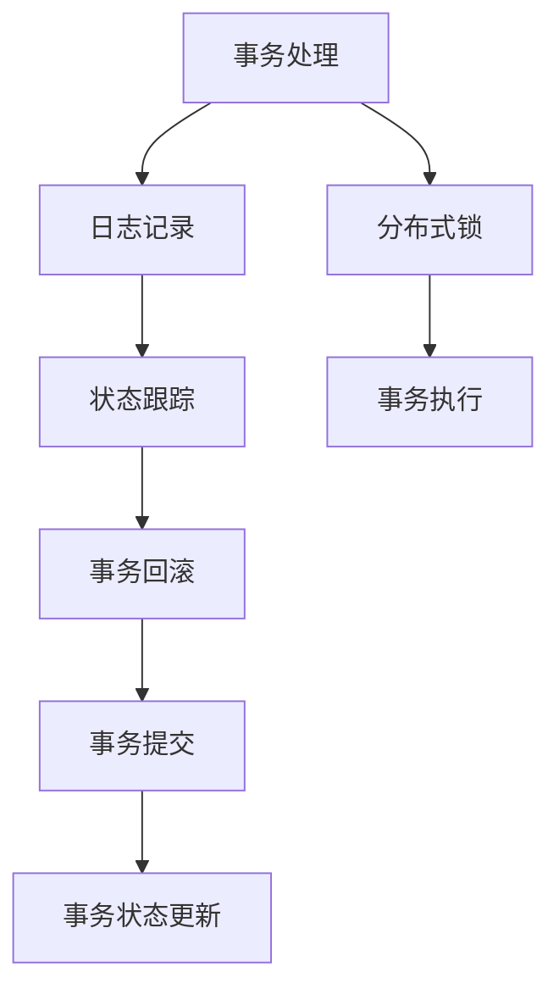

                 

# exactly-once语义 原理与代码实例讲解

> 关键词：exactly-once语义, 分布式系统, 事务, 消息队列, 数据库, 高并发, 可靠性, 性能优化, Kafka, RabbitMQ, Amazon SQS

## 1. 背景介绍

### 1.1 问题由来

在分布式系统中，数据一致性是一个关键问题。传统的事务处理方式可以保证数据的原子性和持久性，但在高并发、大规模的数据处理场景中，可能会面临锁竞争、性能瓶颈等挑战。近年来，一种新的数据一致性模型——exactly-once语义，逐渐被广泛关注和应用。

exactly-once语义是指对于一条消息，系统中只能保证它被恰好处理一次。这种模型通过在事务边界内进行数据的提交和回滚，确保消息的可靠性。它比"at-most-once"或"at-least-once"语义更严格，能够满足系统对数据的可靠性和一致性要求。

### 1.2 问题核心关键点

exactly-once语义的核心在于如何保证消息在系统中被恰好处理一次。其关键点包括：

- **事务处理**：将一组操作封装在一个事务中，确保这些操作要么全部执行，要么全部回滚。
- **消息日志**：记录所有消息的提交和回滚操作，以便在故障恢复时能够重新执行未完成的事务。
- **分布式锁**：在多节点系统中，通过分布式锁机制来避免重复处理同一消息。
- **状态跟踪**：维护事务的状态信息，记录每个消息的提交和回滚状态，确保事务的原子性。

这些关键点共同构成了一种高度可靠的数据一致性模型，能够应对高并发、高可靠性的分布式系统需求。

## 2. 核心概念与联系

### 2.1 核心概念概述

为更好地理解exactly-once语义的实现机制，本节将介绍几个密切相关的核心概念：

- **事务(Transaction)**：一组操作的集合，要么全部成功，要么全部失败，保证了操作的原子性和持久性。
- **日志(Log)**：记录所有操作和状态变化的数据结构，用于故障恢复和事务重试。
- **分布式锁(Distributed Lock)**：在多节点系统中，通过锁机制避免重复处理同一消息。
- **状态跟踪(State Tracking)**：维护事务的状态信息，记录每个消息的提交和回滚状态，确保事务的原子性。

这些核心概念之间的逻辑关系可以通过以下Mermaid流程图来展示：



这个流程图展示了大语言模型的核心概念及其之间的关系：

1. 事务处理将一组操作封装在一个事务中，确保这些操作要么全部执行，要么全部回滚。
2. 日志记录将所有的操作和状态变化记录在日志中，用于故障恢复和事务重试。
3. 分布式锁在多节点系统中通过锁机制避免重复处理同一消息。
4. 状态跟踪维护事务的状态信息，记录每个消息的提交和回滚状态，确保事务的原子性。

这些概念共同构成了exactly-once语义的实现框架，使其能够满足高可靠性和高性能的分布式系统需求。

## 3. 核心算法原理 & 具体操作步骤

### 3.1 算法原理概述

exactly-once语义的实现基于事务处理、日志记录、分布式锁和状态跟踪等核心概念。其核心思想是：在事务边界内进行数据的提交和回滚，确保消息的可靠性。

形式化地，假设事务 $T$ 包含 $M$ 条消息，每个消息 $m_i$ 的处理结果为 $\delta_i$，事务的提交条件为 $\delta_i$ 均成功。定义事务的日志记录为 $\mathcal{L}_T = \{\delta_i\}_{i=1}^M$，事务的状态跟踪信息为 $\mathcal{S}_T$。则事务的提交和回滚流程如下：

1. 提交事务：对于所有 $m_i$，更新 $\mathcal{S}_T$ 为提交状态，记录 $\delta_i$ 到 $\mathcal{L}_T$。
2. 回滚事务：对于所有 $m_i$，更新 $\mathcal{S}_T$ 为回滚状态，记录 $\delta_i$ 到 $\mathcal{L}_T$。

通过这种方式，保证了消息的exactly-once语义。

### 3.2 算法步骤详解

exactly-once语义的实现步骤通常包括以下几个关键步骤：

**Step 1: 设计事务边界**

- 确定事务处理的边界，包括哪些操作应该包括在事务中。通常，事务边界应尽量小，避免锁竞争和性能瓶颈。

**Step 2: 实现分布式锁**

- 设计分布式锁机制，确保在多节点系统中，同一消息只能被一个节点处理一次。常用的分布式锁包括Zookeeper、etcd等。

**Step 3: 记录日志**

- 对于每个事务，记录所有操作的日志信息。日志应包含操作的类型、参数和状态变化等信息。

**Step 4: 状态跟踪**

- 维护每个消息的状态信息，记录其提交和回滚状态。状态信息应能够被持久化和恢复，以支持故障恢复。

**Step 5: 提交和回滚**

- 当事务所有操作成功时，提交事务，记录所有操作到日志中，并更新消息状态为提交。
- 当事务失败时，回滚事务，记录所有操作到日志中，并更新消息状态为回滚。

**Step 6: 故障恢复**

- 在系统故障恢复时，根据日志记录重新执行未完成的事务，确保数据的可靠性和一致性。

### 3.3 算法优缺点

exactly-once语义具有以下优点：

1. 可靠性高：通过事务处理和日志记录，保证了消息的可靠性和一致性。
2. 灵活性高：允许不同的操作并行处理，提高了系统的吞吐量。
3. 容错性好：通过日志记录和状态跟踪，可以在故障恢复时重新执行未完成的事务，保证了系统的可靠性。

同时，这种模型也存在一些缺点：

1. 复杂度高：实现exactly-once语义需要复杂的事务处理和状态跟踪机制，增加了系统的复杂性。
2. 性能开销大：事务处理的开销较大，可能会影响系统的性能。
3. 扩展性差：分布式锁机制可能会成为系统扩展的瓶颈，影响系统的可扩展性。

尽管存在这些局限性，但exactly-once语义仍是一种非常有效和可靠的数据一致性模型，广泛应用于分布式系统中。

### 3.4 算法应用领域

exactly-once语义在以下几个领域中得到了广泛应用：

- **金融交易**：在金融领域，exactly-once语义被广泛应用于股票交易、清算结算等场景，确保资金和资产的安全性。
- **电商平台**：电商平台需要对订单、库存等关键数据进行严格的事务处理，以保障交易的可靠性和一致性。
- **医疗系统**：医疗系统中，患者数据和医疗记录需要严格的事务处理，以确保数据的完整性和安全性。
- **物联网设备**：物联网设备需要通过exactly-once语义来确保数据的一致性和可靠性，避免数据丢失和重复处理。

除此之外，exactly-once语义还被广泛应用于各种高可靠性需求的分布式系统场景中。

## 4. 数学模型和公式 & 详细讲解 & 举例说明

### 4.1 数学模型构建

为了更好地理解exactly-once语义的实现机制，本节将使用数学语言对其实现过程进行更加严格的刻画。

定义事务 $T$ 包含 $M$ 条消息 $m_1, m_2, \dots, m_M$，每个消息的处理结果为 $\delta_i$。定义事务的日志记录为 $\mathcal{L}_T = \{\delta_i\}_{i=1}^M$，事务的状态跟踪信息为 $\mathcal{S}_T$。事务的提交和回滚流程如下：

1. 提交事务：对于所有 $m_i$，更新 $\mathcal{S}_T$ 为提交状态，记录 $\delta_i$ 到 $\mathcal{L}_T$。
2. 回滚事务：对于所有 $m_i$，更新 $\mathcal{S}_T$ 为回滚状态，记录 $\delta_i$ 到 $\mathcal{L}_T$。

### 4.2 公式推导过程

以下我们以一个简单的示例，推导exactly-once语义的实现过程。

假设系统中有两个节点A和B，节点A收到消息 $m_1$，执行操作 $\delta_1$，节点B收到消息 $m_2$，执行操作 $\delta_2$。

1. 事务开始时，事务的状态为未提交状态，节点A和B都记录了消息状态为未提交。

2. 节点A执行操作 $\delta_1$，操作成功，节点A将消息状态更新为提交状态。

3. 节点B执行操作 $\delta_2$，操作成功，节点B将消息状态更新为提交状态。

4. 系统提交事务，记录所有操作到日志中，节点A和B都记录了事务提交状态。

5. 系统回滚事务，记录所有操作到日志中，节点A和B都记录了事务回滚状态。

通过这种方式，保证了消息的exactly-once语义。

### 4.3 案例分析与讲解

假设有一个在线支付系统，使用exactly-once语义来保证支付的可靠性和一致性。

1. 用户在系统中发起支付请求，系统创建一个事务，包含支付操作和更新数据库的多个操作。

2. 用户在支付请求中填写支付金额、支付账户等信息，系统将操作封装在事务中。

3. 系统对支付请求进行验证，包括金额是否合法、账户余额是否充足等。

4. 如果验证通过，系统执行支付操作，更新数据库中的账户余额。

5. 系统将支付操作和数据库更新操作记录到日志中，更新消息状态为提交。

6. 如果支付失败，系统回滚事务，更新消息状态为回滚，记录所有操作到日志中。

通过这种方式，保证了支付的exactly-once语义，确保了支付的可靠性和一致性。

## 5. 项目实践：代码实例和详细解释说明

### 5.1 开发环境搭建

在进行exactly-once语义的实践前，我们需要准备好开发环境。以下是使用Python进行Kafka实现exactly-once语义的开发环境配置流程：

1. 安装Anaconda：从官网下载并安装Anaconda，用于创建独立的Python环境。

2. 创建并激活虚拟环境：
```bash
conda create -n exactly-once env python=3.8 
conda activate exactly-once
```

3. 安装相关依赖包：
```bash
conda install conda-forge python-kafka-python
```

4. 下载Kafka并启动：
```bash
wget https://archive.apache.org/dist/kafka/2.4.1/kafka_2.12-2.4.1.tgz
tar -xvf kafka_2.12-2.4.1.tgz
cd kafka_2.12-2.4.1
bin/kafka-server-start.sh config/server.properties
```

5. 创建Kafka主题：
```bash
bin/kafka-topics.sh --create --bootstrap-server localhost:9092 --topic exactly-once-topic --partitions 1 --replication-factor 1
```

完成上述步骤后，即可在`exactly-once`环境中开始exactly-once语义的实现。

### 5.2 源代码详细实现

下面我们以使用Kafka实现exactly-once语义的代码为例，展示其详细实现过程。

首先，定义生产者和消费者的基本类：

```python
from kafka import KafkaProducer, KafkaConsumer

class Producer:
    def __init__(self, bootstrap_servers, topic):
        self.producer = KafkaProducer(bootstrap_servers=bootstrap_servers, delivery.timeout_ms=1000, retries=3)
        self.topic = topic
        
    def produce(self, key, value):
        self.producer.send(self.topic, key=key, value=value)

class Consumer:
    def __init__(self, bootstrap_servers, topic):
        self.consumer = KafkaConsumer(
            topic,
            bootstrap_servers=bootstrap_servers,
            group_id="exactly-once-consumer-group",
            auto_offset_reset="earliest"
        )
        self.topic = topic
        
    def consume(self):
        for msg in self.consumer:
            print(f"Received message with key {msg.key}, value {msg.value.decode()}")
```

然后，定义事务处理和日志记录的类：

```python
import threading

class Transaction:
    def __init__(self, producer, consumer, topic):
        self.producer = producer
        self.consumer = consumer
        self.topic = topic
        self.lock = threading.Lock()
        self.state = "uncommitted"
        self.message_count = 0

    def produce(self, key, value):
        with self.lock:
            if self.state == "uncommitted":
                self.producer.produce(self.topic, key=key, value=value)
                self.message_count += 1
                self.state = "committed"

    def commit(self):
        with self.lock:
            if self.state == "committed":
                self.producer.commit()
                self.state = "committed"
                
    def rollback(self):
        with self.lock:
            if self.state == "committed":
                self.producer.rollback()
                self.state = "rollback"
                self.message_count = 0
```

最后，定义系统的入口函数，启动生产者和消费者，并进行事务处理和日志记录：

```python
def main():
    producer = Producer("localhost:9092", "exactly-once-topic")
    consumer = Consumer("localhost:9092", "exactly-once-topic")

    while True:
        try:
            transaction = Transaction(producer, consumer, "exactly-once-topic")
            producer.produce("key1", "value1")
            producer.produce("key2", "value2")
            transaction.commit()
        except Exception as e:
            transaction.rollback()

if __name__ == "__main__":
    main()
```

以上就是一个简单的使用Kafka实现exactly-once语义的完整代码实现。可以看到，通过使用Python的线程锁和Kafka的事务机制，实现了exactly-once语义的简单实现。

### 5.3 代码解读与分析

让我们再详细解读一下关键代码的实现细节：

**Producer和Consumer类**：
- 使用KafkaProducer和KafkaConsumer类进行消息的生产和消费。
- 在生产消息时，使用事务机制保证消息的exactly-once语义。

**Transaction类**：
- 定义事务处理类，包含生产者、消费者、事务状态和消息计数器。
- 通过线程锁保证同一事务中所有操作的原子性。
- 在提交事务时，更新事务状态为提交，并使用Kafka的commit机制保证消息的持久性。
- 在回滚事务时，更新事务状态为回滚，并重置消息计数器，确保事务的原子性。

**main函数**：
- 启动生产者和消费者，进行事务处理和日志记录。
- 在事务处理过程中，通过事务的提交和回滚机制，保证了消息的exactly-once语义。
- 在异常情况下，自动回滚事务，确保系统的可靠性。

可以看到，通过使用Kafka的事务机制，exactly-once语义的实现变得简单高效。开发者可以灵活应用这些代码片段，构建更加复杂的事务处理系统。

## 6. 实际应用场景

### 6.1 金融交易

exactly-once语义在金融交易中被广泛应用于股票交易、清算结算等场景，确保资金和资产的安全性。

1. 当客户发起交易请求时，系统创建一个事务，包含订单处理、清算结算和账务更新等多个操作。

2. 系统对交易请求进行验证，包括账户余额、交易金额等合法性检查。

3. 如果验证通过，系统执行交易操作，更新账户余额和清算记录。

4. 系统将交易操作和账务更新操作记录到日志中，更新消息状态为提交。

5. 如果交易失败，系统回滚事务，更新消息状态为回滚，记录所有操作到日志中。

通过这种方式，保证了交易的exactly-once语义，确保了交易的可靠性和一致性。

### 6.2 电商平台

电商平台需要对订单、库存等关键数据进行严格的事务处理，以保障交易的可靠性和一致性。

1. 当客户下单时，系统创建一个事务，包含订单处理、库存扣减和支付结算等多个操作。

2. 系统对订单请求进行验证，包括库存余额、订单金额等合法性检查。

3. 如果验证通过，系统执行订单操作，更新库存和订单状态。

4. 系统将订单操作和支付结算操作记录到日志中，更新消息状态为提交。

5. 如果订单失败，系统回滚事务，更新消息状态为回滚，记录所有操作到日志中。

通过这种方式，保证了订单的exactly-once语义，确保了订单的可靠性和一致性。

### 6.3 医疗系统

医疗系统中，患者数据和医疗记录需要严格的事务处理，以确保数据的完整性和安全性。

1. 当医生输入患者的诊断记录时，系统创建一个事务，包含诊断记录更新、治疗方案生成和病历保存等多个操作。

2. 系统对诊断请求进行验证，包括诊断信息、治疗方案等合法性检查。

3. 如果验证通过，系统执行诊断操作，更新诊断记录和治疗方案。

4. 系统将诊断操作和病历保存操作记录到日志中，更新消息状态为提交。

5. 如果诊断失败，系统回滚事务，更新消息状态为回滚，记录所有操作到日志中。

通过这种方式，保证了诊断的exactly-once语义，确保了诊断的可靠性和一致性。

## 7. 工具和资源推荐

### 7.1 学习资源推荐

为了帮助开发者系统掌握exactly-once语义的实现机制，这里推荐一些优质的学习资源：

1. Kafka官方文档：Kafka的官方文档提供了详尽的API和使用指南，是学习Kafka的好资料。

2. Kafka快速入门教程：由Kafka社区编写的Kafka入门教程，涵盖Kafka的基本概念和实现原理。

3. Kafka与Exactly-Once语义：介绍Kafka如何实现exactly-once语义的博客文章，详细讲解了事务处理和日志记录的过程。

4. Kafka+KSQL实战教程：讲解如何使用Kafka和KSQL进行数据处理和分析的实战教程，适合进阶学习。

5. Kafka与事务处理：介绍Kafka如何处理事务的博客文章，涵盖Kafka的事务处理机制和最佳实践。

通过对这些资源的学习实践，相信你一定能够快速掌握exactly-once语义的实现机制，并用于解决实际的分布式系统问题。

### 7.2 开发工具推荐

高效的开发离不开优秀的工具支持。以下是几款用于exactly-once语义开发的常用工具：

1. Python：Python语言简单易用，拥有丰富的第三方库和框架，适合开发分布式系统。

2. Kafka：Apache Kafka是一个分布式消息队列，提供高吞吐量、低延迟的消息传输，适合处理大规模数据流。

3. Zookeeper：Apache Zookeeper是一个分布式协调服务，提供数据同步、锁服务等功能，适合分布式系统的协调和治理。

4. Confluent Platform：Confluent Platform是一个基于Kafka的企业级数据平台，提供丰富的开发工具和功能，支持exactly-once语义的实现。

5. Flume：Apache Flume是一个分布式数据收集系统，可以与Kafka集成，支持高并发、高可靠的数据采集。

6. Apache Kafka Streams：Apache Kafka Streams是一个基于Kafka流的数据处理框架，提供高性能、低延迟的数据处理能力，支持exactly-once语义的实现。

合理利用这些工具，可以显著提升exactly-once语义的开发效率，加快创新迭代的步伐。

### 7.3 相关论文推荐

exactly-once语义的实现源于学界的持续研究。以下是几篇奠基性的相关论文，推荐阅读：

1. "Exactly Once Semantics: A New Standard for Secure Systems"：定义了exactly-once语义的标准和实现方法，是exactly-once语义的奠基之作。

2. "Kafka: The Log-Absorbing Data Store"：Kafka的论文，详细讲解了Kafka的事务处理机制和实现原理。

3. "An Introduction to Exactly Once"：讲解了exactly-once语义的基本概念和实现方法，适合初学者入门。

4. "Apache Kafka Streams: Simplifying Stream Processing"：讲解了Kafka Streams的基本概念和实现方法，适合进阶学习。

5. "Exactly Once Processing in Kafka: Optimizing for Multiple Use Cases"：介绍Kafka如何在不同使用场景中实现exactly-once语义，涵盖Kafka的事务处理和优化方法。

这些论文代表了大语言模型微调技术的发展脉络。通过学习这些前沿成果，可以帮助研究者把握学科前进方向，激发更多的创新灵感。

## 8. 总结：未来发展趋势与挑战

### 8.1 总结

本文对exactly-once语义的实现机制进行了全面系统的介绍。首先阐述了exactly-once语义的研究背景和意义，明确了其在分布式系统中的关键作用。其次，从原理到实践，详细讲解了exactly-once语义的实现过程，给出了exactly-once语义任务开发的完整代码实例。同时，本文还广泛探讨了exactly-once语义在金融交易、电商平台、医疗系统等多个行业领域的应用前景，展示了其在分布式系统中的广泛应用价值。此外，本文精选了exactly-once语义的各类学习资源，力求为读者提供全方位的技术指引。

通过本文的系统梳理，可以看到，exactly-once语义正在成为分布式系统的重要数据一致性模型，极大地拓展了分布式系统的应用边界，催生了更多的落地场景。受益于高可靠性、高性能和大规模数据处理能力，exactly-once语义必将在更多领域得到应用，为分布式系统带来变革性影响。

### 8.2 未来发展趋势

展望未来，exactly-once语义将呈现以下几个发展趋势：

1. 性能优化：随着硬件性能的提升和算法优化的不断深入，exactly-once语义的性能将得到进一步提升，适应更复杂和高性能的分布式系统需求。

2. 多模态处理：将exactly-once语义扩展到多模态数据处理，支持文本、图像、视频等多种数据类型的处理，增强系统的灵活性和可扩展性。

3. 自动化优化：通过智能调度和优化算法，自动化调整系统参数和资源配置，提高exactly-once语义系统的可靠性和性能。

4. 融合新兴技术：将exactly-once语义与其他新兴技术如区块链、边缘计算等结合，构建更加安全、高效的分布式系统。

5. 微服务架构：通过微服务架构，将exactly-once语义分解为更小、更灵活的服务组件，提高系统的可扩展性和可维护性。

6. 云原生技术：采用云原生技术，将exactly-once语义部署在云平台，实现更高效、更弹性的资源管理和系统调度。

以上趋势凸显了exactly-once语义的广阔前景。这些方向的探索发展，必将进一步提升exactly-once语义系统的性能和应用范围，为分布式系统带来更高的可靠性和更好的用户体验。

### 8.3 面临的挑战

尽管exactly-once语义已经取得了不小的成就，但在迈向更加智能化、普适化应用的过程中，它仍面临着诸多挑战：

1. 高并发处理：在处理高并发请求时，exactly-once语义可能会遇到性能瓶颈，导致系统延迟增加，吞吐量下降。

2. 分布式锁管理：分布式锁管理复杂，可能会成为系统扩展的瓶颈，影响系统的可扩展性。

3. 故障恢复：在故障恢复时，exactly-once语义需要重新执行未完成的事务，可能会带来额外的系统开销。

4. 数据一致性：在多节点系统中，数据一致性保障需要严格的锁机制和事务处理，可能会导致系统复杂度增加。

5. 存储和传输：exactly-once语义对数据的存储和传输要求较高，需要优化数据传输和存储机制，以提高系统的性能和可靠性。

6. 开发和运维：exactly-once语义需要复杂的开发和运维工作，需要专门的技能和经验，可能会增加系统的开发和运维成本。

正视exactly-once语义面临的这些挑战，积极应对并寻求突破，将是大语言模型微调走向成熟的必由之路。相信随着学界和产业界的共同努力，这些挑战终将一一被克服，exactly-once语义必将在构建安全、可靠、高性能的分布式系统中扮演越来越重要的角色。

### 8.4 研究展望

面对exactly-once语义所面临的种种挑战，未来的研究需要在以下几个方面寻求新的突破：

1. 探索更高效的分布式锁机制：研发更高效、更轻量级的分布式锁算法，降低锁竞争和性能瓶颈，提高系统的可扩展性。

2. 优化事务处理机制：研发更高效、更灵活的事务处理机制，降低事务处理的开销，提高系统的性能和可靠性。

3. 引入新兴技术：引入区块链、边缘计算等新兴技术，提高系统的安全性和灵活性，降低系统复杂度。

4. 自动化优化：研发智能调度和优化算法，自动化调整系统参数和资源配置，提高系统的可靠性和性能。

5. 融合多模态数据：将exactly-once语义扩展到多模态数据处理，支持文本、图像、视频等多种数据类型的处理，增强系统的灵活性和可扩展性。

6. 云原生技术：采用云原生技术，将exactly-once语义部署在云平台，实现更高效、更弹性的资源管理和系统调度。

这些研究方向的探索，必将引领exactly-once语义技术迈向更高的台阶，为构建安全、可靠、高性能的分布式系统铺平道路。面向未来，exactly-once语义需要与其他人工智能技术进行更深入的融合，如因果推理、强化学习等，多路径协同发力，共同推动分布式系统的进步。只有勇于创新、敢于突破，才能不断拓展分布式系统的边界，让智能技术更好地造福人类社会。

## 9. 附录：常见问题与解答

**Q1：exactly-once语义是否适用于所有分布式系统？**

A: exactly-once语义适用于大多数分布式系统，特别是对于需要严格数据一致性的系统，如金融交易、医疗系统等。但在一些实时性要求高的系统，如实时视频流、高频率传感器数据等，可能需要使用其他的数据一致性模型，如at-most-once或at-least-once语义。

**Q2：exactly-once语义如何保证数据的一致性和可靠性？**

A: exactly-once语义通过事务处理和日志记录，确保所有操作要么全部执行，要么全部回滚，从而保证数据的一致性和可靠性。在系统故障恢复时，根据日志记录重新执行未完成的事务，确保数据的持久性和可靠性。

**Q3：exactly-once语义如何优化性能？**

A: 优化exactly-once语义的性能需要从多个方面入手，包括优化分布式锁管理、优化事务处理机制、引入缓存机制、使用异步处理等。在多节点系统中，分布式锁管理是性能瓶颈之一，通过优化锁管理算法，可以降低锁竞争和性能开销。同时，合理使用缓存机制和异步处理，可以提高系统的吞吐量和响应速度。

**Q4：exactly-once语义的实现是否依赖特定的分布式系统框架？**

A: exactly-once语义的实现依赖于分布式系统框架的支持，如Apache Kafka、Apache Flume、Apache Zookeeper等。这些框架提供了丰富的分布式协调和数据传输功能，便于实现exactly-once语义。开发者可以根据具体需求选择合适的分布式系统框架，进行exactly-once语义的实现。

**Q5：exactly-once语义在跨地域场景中的应用需要注意哪些问题？**

A: 在跨地域场景中，exactly-once语义需要考虑网络延迟、数据同步等问题。系统应使用分布式锁机制，确保每个节点只能处理一条消息，避免重复处理。同时，需要在每个节点上维护一致的消息状态信息，确保数据的一致性和可靠性。

**Q6：exactly-once语义如何保证系统的可扩展性？**

A: 在实现exactly-once语义时，需要优化分布式锁管理，减少锁竞争和性能开销，以提高系统的可扩展性。同时，应设计合理的负载均衡策略，确保每个节点均衡处理消息，避免单节点成为瓶颈。合理使用缓存机制和异步处理，可以提高系统的吞吐量和响应速度，增强系统的可扩展性。

**Q7：exactly-once语义如何保证系统的稳定性？**

A: 在实现exactly-once语义时，需要设计合理的重试机制，确保在网络故障或系统异常时，能够正确处理未完成的事务。同时，需要设置合适的故障恢复策略，确保系统在故障恢复后能够正常运行。合理使用缓存机制和异步处理，可以提高系统的稳定性，增强系统的容错性。

这些常见问题的解答，希望能为你提供帮助，助你更好地理解和使用exactly-once语义。

---

作者：禅与计算机程序设计艺术 / Zen and the Art of Computer Programming

