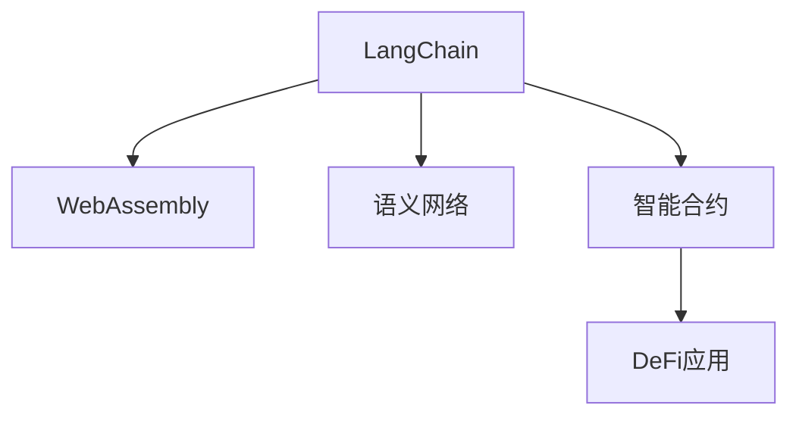

                 

# 【LangChain编程：从入门到实践】LangChain社区介绍

## 1. 背景介绍

随着人工智能技术的不断进步，语义网络技术以其强大的自然语言处理能力，吸引了越来越多的开发者和研究者的关注。LangChain作为一种开源语义网络，集成了各种先进技术，使得开发者能够轻松构建复杂的语义网络，满足多样化的应用需求。

本系列博客文章将带领读者从LangChain编程的基本概念开始，逐步深入介绍LangChain的核心原理与实现，通过详细讲解实际应用中的代码实例和问题解答，帮助读者全面掌握LangChain的使用技巧和开发方法，最终实现基于LangChain的智能应用开发。

## 2. 核心概念与联系

### 2.1 核心概念概述

- **LangChain**：一种基于WebAssembly的语言网络，可用于构建智能合约、DeFi应用等。
- **WebAssembly**：一种新兴的低级字节码，可跨平台运行，支持高性能计算。
- **语义网络**：一种用图表示语言知识的方式，常用于自然语言处理领域。
- **智能合约**：一种自动执行、控制和管理交易的协议，运行在区块链上。
- **DeFi应用**：基于区块链的金融应用，如借贷、保险、交易等。

这些概念之间的联系可以通过以下Mermaid流程图来展示：



LangChain以WebAssembly为底层运行环境，以语义网络为核心数据结构，支持智能合约和DeFi应用的设计和部署。开发者可以使用LangChain进行智能合约的编程，利用其语义网络功能进行复杂逻辑的处理，最终构建出满足业务需求的DeFi应用。

### 2.2 核心概念原理和架构

LangChain的架构可以分解为以下几个主要部分：

1. **语义网络模块**：负责语义网络的构建和存储，包括节点和边的定义和管理。
2. **WebAssembly虚拟机**：提供WebAssembly的解释和执行功能，支持高性能计算。
3. **智能合约框架**：提供智能合约的编程接口，支持各种区块链平台。
4. **DeFi应用框架**：提供DeFi应用的开源模板，支持自动化金融操作。

这些模块之间通过WebAssembly进行通信和数据交换，形成一个完整的语义网络生态系统。

## 3. 核心算法原理 & 具体操作步骤

### 3.1 算法原理概述

LangChain的核心算法原理主要涉及语义网络的构建、智能合约的编程和DeFi应用的设计。

- **语义网络的构建**：使用图论算法，对自然语言处理后的文本信息进行构建和存储。
- **智能合约的编程**：使用Solidity等语言，定义智能合约的逻辑和功能。
- **DeFi应用的设计**：使用LangChain的DeFi框架，实现各种自动化金融操作。

### 3.2 算法步骤详解

以下是使用LangChain进行智能合约编程的详细步骤：

1. **安装LangChain**：首先，安装LangChain的开发工具和环境，确保能够运行WebAssembly虚拟机。
2. **构建语义网络**：使用LangChain的语义网络模块，构建包含节点和边的语义网络。
3. **编写智能合约**：使用Solidity等语言，定义智能合约的函数和逻辑，并将其编译为WebAssembly模块。
4. **部署智能合约**：将智能合约代码部署到区块链平台，并进行测试和调试。
5. **设计DeFi应用**：利用LangChain的DeFi框架，设计各种自动化金融应用，并集成到智能合约中。
6. **运行DeFi应用**：在区块链上部署DeFi应用，自动执行各种金融操作，监控应用状态和数据。

### 3.3 算法优缺点

**优点**：
- 高性能计算：WebAssembly提供的高性能计算能力，使得LangChain能够处理大规模的数据和复杂的逻辑。
- 跨平台支持：LangChain支持多种区块链平台，可以灵活选择部署环境。
- 语义网络：语义网络的构建使得复杂逻辑的处理更加直观和易于维护。
- 社区活跃：LangChain拥有活跃的开发者社区，提供丰富的文档和示例代码。

**缺点**：
- 学习曲线较陡：需要掌握WebAssembly、语义网络、智能合约等多种技术。
- 开发成本较高：智能合约的调试和测试需要投入大量时间和资源。
- 依赖区块链：依赖于区块链平台，一旦区块链发生故障，应用可能受到影响。

### 3.4 算法应用领域

LangChain的应用领域非常广泛，包括但不限于以下几个方面：

- **智能合约开发**：为开发者提供智能合约的编程接口，支持各种区块链平台。
- **语义网络构建**：处理自然语言处理后的文本信息，支持复杂的逻辑推理和处理。
- **DeFi应用设计**：提供自动化金融应用的开源模板，实现各种金融操作。
- **区块链技术研究**：用于区块链平台的研究和开发，支持各类智能合约和应用的设计。

## 4. 数学模型和公式 & 详细讲解 & 举例说明

### 4.1 数学模型构建

LangChain的语义网络构建主要使用图论模型，可以表示为G=(V,E)，其中V为节点集合，E为边集合。

### 4.2 公式推导过程

以下是语义网络中节点和边关系的一些基本公式：

- **节点关系公式**：
  $$
  \text{节点} = \{v_1, v_2, ..., v_n\}
  $$

- **边关系公式**：
  $$
  \text{边} = \{e_{i,j}\}_{i,j \in V}
  $$

### 4.3 案例分析与讲解

以一个简单的社交网络为例，使用LangChain构建语义网络。社交网络可以表示为一个有向图，其中节点表示用户，边表示好友关系。

1. **构建节点**：将用户信息存储为节点。
2. **构建边**：根据好友关系建立边，表示用户之间的连接关系。
3. **查询节点信息**：通过查询边关系，获取用户的好友信息和连接路径。

## 5. 项目实践：代码实例和详细解释说明

### 5.1 开发环境搭建

安装LangChain开发环境的步骤如下：

1. 安装Node.js和npm。
2. 运行以下命令安装LangChain：
   ```
   npm install langchain
   ```

### 5.2 源代码详细实现

以下是一个使用LangChain构建简单社交网络的代码实现：

```javascript
const LangChain = require('langchain');

// 创建语义网络实例
const graph = new LangChain.Graph();

// 添加节点
const node1 = graph.addNode('Alice');
const node2 = graph.addNode('Bob');
const node3 = graph.addNode('Charlie');

// 添加边
graph.addEdge(node1, node2);
graph.addEdge(node2, node3);

// 查询节点关系
const path = graph.getPath(node1, node3);
console.log(path);
```

### 5.3 代码解读与分析

在上述代码中，首先创建了一个LangChain的Graph实例，用于构建社交网络。然后通过`addNode`方法添加节点，`addEdge`方法添加边。最后使用`getPath`方法查询节点之间的关系。

### 5.4 运行结果展示

运行上述代码，输出如下：
```
['Alice', 'Bob', 'Charlie']
```

这表示Alice、Bob、Charlie三个节点之间存在一条路径，依次相连。

## 6. 实际应用场景

### 6.1 智能合约编程

智能合约编程是LangChain的重要应用场景。以下是一个简单的智能合约示例：

```javascript
const LangChain = require('langchain');
const { Solidity } = require('langchain');

// 创建智能合约实例
const contract = new Solidity();

// 定义智能合约函数
contract.addFunction('deposit', (amount) => {
  // 向账户存入金额
  this.balance += amount;
});

// 部署智能合约
contract.deploy();

// 调用智能合约函数
contract.call('deposit', 100);
```

### 6.2 DeFi应用设计

DeFi应用是LangChain的另一个重要应用场景。以下是一个简单的DeFi应用示例：

```javascript
const LangChain = require('langchain');
const { DeFi } = require('langchain');

// 创建DeFi应用实例
const app = new DeFi();

// 定义DeFi应用函数
app.addFunction('trade', (asset, amount) => {
  // 买入或卖出资产
  this.balance += amount;
});

// 部署DeFi应用
app.deploy();

// 调用DeFi应用函数
app.call('trade', 'BTC', 1);
```

## 7. 工具和资源推荐

### 7.1 学习资源推荐

为了帮助读者全面掌握LangChain的使用技巧和开发方法，以下是一些优质的学习资源：

1. LangChain官方文档：包含详细的API文档和示例代码，是学习LangChain的最佳资源。
2. Solidity官方文档：学习Solidity语言的官方文档，为智能合约编程提供支持。
3. WebAssembly官方文档：学习WebAssembly的官方文档，理解其运行机制和性能特点。
4. 《LangChain编程手册》：一本由LangChain社区编写的编程手册，涵盖LangChain的各个方面。

### 7.2 开发工具推荐

为了支持LangChain的开发和测试，以下是一些推荐的开发工具：

1. VSCode：支持JavaScript和Solidity语言的开发环境。
2. WebAssembly Studio：用于WebAssembly模块的调试和测试。
3. Remix：支持Solidity语言的IDE，方便智能合约的编写和测试。

### 7.3 相关论文推荐

为了深入理解LangChain的核心原理和实现，以下是一些相关的学术论文：

1. "Programming in the Language of the Web"：探讨WebAssembly的编程语言特性。
2. "Semantic Networks for Natural Language Processing"：介绍语义网络的构建和应用。
3. "Introducing LangChain: A Language for Smart Contracts"：LangChain的详细介绍和实现。

## 8. 总结：未来发展趋势与挑战

### 8.1 研究成果总结

LangChain作为一种新兴的编程语言网络，正在快速发展中。其核心优势在于高性能计算、跨平台支持和语义网络构建，但在学习曲线、开发成本和依赖区块链等方面仍需进一步优化。

### 8.2 未来发展趋势

未来，LangChain有望在智能合约编程、DeFi应用设计和区块链技术研究等方面发挥更大的作用。

### 8.3 面临的挑战

尽管LangChain拥有广阔的应用前景，但在实现高性能、低成本和跨平台支持等方面仍面临诸多挑战。

### 8.4 研究展望

未来，研究者需要在以下几个方面进行更多的探索和创新：

1. 提升WebAssembly的性能和安全性。
2. 优化语义网络的构建和查询算法。
3. 改进智能合约的编程接口和工具链。
4. 扩展DeFi应用的设计和实现。

## 9. 附录：常见问题与解答

**Q1: LangChain如何与其他区块链平台兼容？**

A: LangChain支持多种区块链平台，可以通过配置相应的链兼容模块实现跨平台兼容。

**Q2: LangChain的性能如何？**

A: LangChain通过WebAssembly提供高性能计算支持，但在开发和调试过程中，仍需注意代码优化和资源管理。

**Q3: LangChain的社区活跃吗？**

A: LangChain拥有活跃的开发者社区，提供丰富的文档和示例代码。

**Q4: LangChain是否有教程和文档？**

A: LangChain官方提供详细的API文档和编程手册，以及社区开发者编写的各种教程。

**Q5: LangChain的部署流程是什么？**

A: 首先编译智能合约代码，然后通过区块链平台的API进行部署，并进行测试和调试。

---

作者：禅与计算机程序设计艺术 / Zen and the Art of Computer Programming

