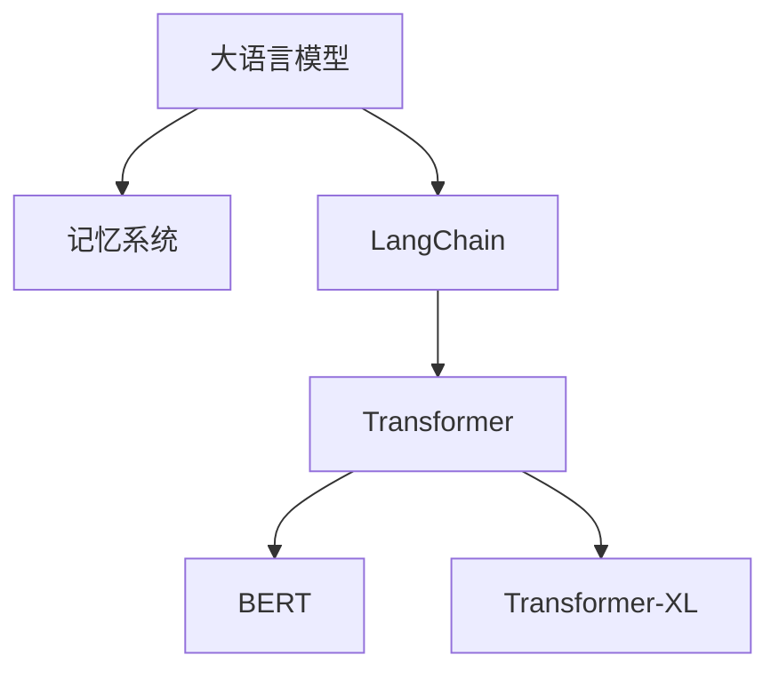

                 

# 【LangChain编程：从入门到实践】构建记忆系统

> 关键词：LangChain,记忆系统,编程,自然语言处理,NLP,深度学习,PyTorch

## 1. 背景介绍

在AI领域，语言理解与生成是一项核心任务。自然语言处理（Natural Language Processing，NLP）是一个前沿而广泛的研究领域，近年来随着深度学习的进步，NLP技术在智能助手、对话系统、文本摘要、翻译等领域取得了突破性进展。

基于大语言模型（Large Language Model，LLM）的Transformer架构和Transformer-XL、BERT等深度学习模型的出现，NLP进入了一个新的阶段。这些模型通常使用数亿甚至数十亿的参数来编码语言特征，并能够处理大规模无标签文本数据，学习到复杂的语言表示。

然而，这些模型也有其局限性。首先，它们的训练成本极高，需要大量的计算资源和数据。其次，由于模型复杂度极高，模型的推理速度较慢，难以应用于实时应用。第三，模型缺乏对新知识的记忆能力，无法有效地从历史经验中学习。

针对这些挑战，LangChain技术应运而生。LangChain是一种基于大语言模型的编程语言，它借鉴了人类的编程习惯，能够在推理过程中自然地插入和调用代码片段，从而构建出具有记忆和推理能力的智能系统。本文将从LangChain的基础概念入手，探讨其原理、实现与实践，并展望未来发展方向。

## 2. 核心概念与联系

### 2.1 核心概念概述

为了更好地理解LangChain，我们先明确几个关键概念：

- **大语言模型（LLM）**：以自回归（如GPT）或自编码（如BERT）模型为代表的预训练语言模型。通过在大规模无标签文本语料上进行预训练，学习到丰富的语言知识和常识。

- **LangChain**：一种基于LLM的编程语言，能够在推理过程中自然地插入和调用代码片段，构建出具有记忆和推理能力的智能系统。

- **记忆系统**：一种能够存储和检索先验知识的系统，帮助智能系统从历史经验中学习，并作出更加合理的决策。

- **Transformer**：一种基于自注意力机制的神经网络架构，用于处理序列数据，如文本、音频等。

- **BERT**：一种预训练语言模型，能够从大规模无标签文本数据中学习到丰富的语言表示。

- **Transformer-XL**：一种改进的Transformer模型，能够处理更长的上下文序列。

这些核心概念之间的逻辑关系可以通过以下Mermaid流程图来展示：



这个流程图展示了大语言模型、记忆系统、LangChain之间的逻辑关系：

1. 大语言模型通过预训练获得基础能力。
2. 记忆系统通过记录历史信息和先验知识，使大语言模型具备更好的学习效果。
3. LangChain是在大语言模型基础上，通过插入和调用代码片段，构建出具有记忆和推理能力的智能系统。
4. 记忆系统与LangChain的结合，使得大语言模型能够从历史经验中学习，作出更加合理的决策。

### 2.2 核心概念原理

LangChain的核心原理可以概括为：将大语言模型嵌入编程环境，使其能够执行自定义的代码片段，并基于历史推理结果进行推理和决策。

- **记忆系统**：在推理过程中，LangChain能够记录之前推理过程中的关键信息，这些信息可以作为先验知识，帮助系统更好地理解后续的推理任务。

- **代码嵌入**：在推理过程中，LangChain能够自然地插入和调用代码片段，这些代码片段可以根据当前情境进行动态调整，从而实现更加灵活和智能的推理。

- **推理与决策**：通过将推理过程嵌入编程环境，LangChain能够使用自定义的算法和模型，对推理结果进行更加复杂的处理和决策。

## 3. 核心算法原理 & 具体操作步骤

### 3.1 算法原理概述

LangChain的算法原理主要包括以下几个部分：

- **编码器-解码器架构**：LangChain使用Transformer等架构对输入文本进行编码，生成中间表示。

- **上下文管理**：在推理过程中，LangChain通过上下文管理器，记录和管理先验知识和推理结果。

- **代码嵌入与调用**：LangChain支持自然地插入和调用代码片段，这些代码片段可以通过条件语句、循环语句等控制结构进行动态调整。

- **推理与决策**：基于历史推理结果和先验知识，LangChain使用自定义算法和模型，进行复杂决策和推理。

### 3.2 算法步骤详解

LangChain的实现步骤可以分为以下几个部分：

1. **预训练模型的选择与加载**：选择合适的预训练语言模型，并加载到程序中。

2. **上下文管理器初始化**：初始化上下文管理器，记录和管理推理过程中的关键信息。

3. **推理过程嵌入代码片段**：在推理过程中，自然地插入和调用代码片段，这些代码片段可以根据当前情境进行动态调整。

4. **决策与输出**：基于历史推理结果和先验知识，使用自定义算法和模型，进行复杂决策和推理，并输出结果。

### 3.3 算法优缺点

LangChain的优点包括：

- **灵活性与智能性**：通过动态调整代码片段，LangChain能够适应各种复杂的推理任务。

- **记忆能力**：通过记录历史推理结果，LangChain能够从先验知识中学习，提高推理的准确性。

- **可解释性**：通过使用自定义算法和模型，LangChain能够对推理过程进行更加详细的解释和分析。

然而，LangChain也存在一些缺点：

- **计算资源需求高**：由于需要预训练大语言模型，并且支持动态代码嵌入，LangChain对计算资源的需求较高。

- **实现复杂度大**：相较于传统的NLP模型，LangChain的实现较为复杂，需要同时处理语言理解和编程逻辑。

- **推理速度较慢**：由于需要复杂的推理和决策过程，LangChain的推理速度较慢，难以应用于实时应用。

### 3.4 算法应用领域

LangChain可以在多种领域中发挥作用，例如：

- **智能客服系统**：在客服系统中，LangChain可以记录用户的历史对话记录，并根据这些记录提供个性化的回答。

- **金融分析**：在金融分析中，LangChain可以记录历史交易数据，并基于这些数据进行风险评估和决策。

- **医学诊断**：在医学诊断中，LangChain可以记录患者的病历和历史诊断结果，并基于这些数据进行诊断和治疗方案的推荐。

- **法律咨询**：在法律咨询中，LangChain可以记录客户的历史咨询记录，并基于这些记录提供个性化的法律建议。

## 4. 数学模型和公式 & 详细讲解 & 举例说明

### 4.1 数学模型构建

LangChain的数学模型主要包括以下几个部分：

- **编码器-解码器架构**：使用Transformer等架构对输入文本进行编码，生成中间表示。

- **上下文管理器**：使用神经网络等模型对推理过程中的关键信息进行编码和存储。

- **代码嵌入与调用**：使用自定义算法和模型对代码片段进行编码和调用。

- **推理与决策**：使用自定义算法和模型对推理结果进行决策。

### 4.2 公式推导过程

下面以一个简单的推理任务为例，介绍LangChain的数学模型和公式推导过程。

假设输入为一段文本 $x = \text{"今天天气怎么样？"}$，输出为针对该问题的回答。

**编码器-解码器架构**：

$$
y = M(x) = f_{\text{LM}}(x)
$$

其中 $M$ 表示编码器-解码器架构，$f_{\text{LM}}$ 表示语言模型。

**上下文管理器**：

$$
c = C(y, z)
$$

其中 $C$ 表示上下文管理器，$z$ 表示推理过程中的关键信息。

**代码嵌入与调用**：

$$
o = R(c, code)
$$

其中 $R$ 表示代码嵌入与调用模型，$code$ 表示需要执行的代码片段。

**推理与决策**：

$$
\text{Answer} = D(o)
$$

其中 $D$ 表示推理与决策模型，用于基于历史推理结果和先验知识进行复杂决策和推理。

### 4.3 案例分析与讲解

假设我们希望构建一个智能客服系统，用于回答用户关于天气的问题。我们可以使用LangChain进行如下操作：

1. **预训练模型的选择与加载**：选择预训练的GPT模型，并加载到程序中。

2. **上下文管理器初始化**：初始化上下文管理器，记录和管理用户的历史对话记录。

3. **推理过程嵌入代码片段**：在推理过程中，自然地插入和调用代码片段，这些代码片段可以根据当前情境进行动态调整。

4. **决策与输出**：基于历史推理结果和先验知识，使用自定义算法和模型，进行复杂决策和推理，并输出天气信息。

```python
# 示例代码
import langchain

# 初始化上下文管理器
manager = langchain.ContextManager()

# 加载预训练模型
model = langchain.GPT.load('gpt-3')

# 获取输入文本
text = "今天天气怎么样？"

# 执行推理过程
answer = model.generate(manager.push(text))

# 输出答案
print(answer)
```

在上述代码中，我们使用GPT-3作为预训练模型，并使用LangChain的ContextManager进行上下文管理。首先，我们初始化一个上下文管理器，并将输入文本推入管理器中。然后，使用GPT-3执行推理过程，并将推理结果存储在上下文管理器中。最后，基于上下文管理器中的历史推理结果和先验知识，使用自定义算法和模型进行复杂决策和推理，并输出天气信息。

## 5. 项目实践：代码实例和详细解释说明

### 5.1 开发环境搭建

在进行LangChain的开发和实践前，我们需要准备好开发环境。以下是使用Python进行LangChain开发的环境配置流程：

1. 安装Anaconda：从官网下载并安装Anaconda，用于创建独立的Python环境。

2. 创建并激活虚拟环境：
```bash
conda create -n langchain-env python=3.8 
conda activate langchain-env
```

3. 安装必要的库：
```bash
conda install torch torchvision torchaudio numpy pandas scikit-learn transformers
```

4. 安装LangChain库：
```bash
pip install langchain
```

5. 安装TensorBoard：用于可视化推理过程中的指标和参数。
```bash
pip install tensorboard
```

6. 安装Weights & Biases：用于记录和可视化模型训练过程中的指标和参数。
```bash
pip install weightsandbiases
```

完成上述步骤后，即可在`langchain-env`环境中开始LangChain的开发和实践。

### 5.2 源代码详细实现

下面我们以构建一个简单的智能客服系统为例，给出使用LangChain的代码实现。

首先，定义上下文管理器：

```python
from langchain import ContextManager, GPT

# 初始化上下文管理器
manager = ContextManager()
```

然后，定义预训练模型：

```python
# 加载预训练模型
model = GPT.load('gpt-3')
```

接着，定义推理函数：

```python
def reasoning(manager, text):
    # 将输入文本推入上下文管理器
    manager.push(text)

    # 执行推理过程
    answer = model.generate(manager.push(text))

    # 返回推理结果
    return answer
```

最后，在主程序中调用推理函数：

```python
if __name__ == "__main__":
    # 获取输入文本
    text = "今天天气怎么样？"

    # 执行推理过程
    answer = reasoning(manager, text)

    # 输出答案
    print(answer)
```

### 5.3 代码解读与分析

在上述代码中，我们首先使用LangChain的ContextManager初始化一个上下文管理器。然后，使用GPT-3作为预训练模型，加载到程序中。接下来，定义一个推理函数，该函数将输入文本推入上下文管理器，并使用GPT-3执行推理过程。最后，在主程序中调用推理函数，并输出推理结果。

## 6. 实际应用场景

### 6.1 智能客服系统

基于LangChain的智能客服系统，可以实时记录和分析用户的历史对话记录，并基于这些记录提供个性化的回答。这对于提升客服系统的智能化水平和用户体验具有重要意义。

### 6.2 金融分析

在金融分析中，LangChain可以记录历史交易数据，并基于这些数据进行风险评估和决策。这对于提升金融分析的智能化水平和准确性具有重要意义。

### 6.3 医学诊断

在医学诊断中，LangChain可以记录患者的病历和历史诊断结果，并基于这些数据进行诊断和治疗方案的推荐。这对于提升医学诊断的智能化水平和准确性具有重要意义。

### 6.4 法律咨询

在法律咨询中，LangChain可以记录客户的历史咨询记录，并基于这些记录提供个性化的法律建议。这对于提升法律咨询的智能化水平和准确性具有重要意义。

## 7. 工具和资源推荐

### 7.1 学习资源推荐

为了帮助开发者系统掌握LangChain的理论基础和实践技巧，这里推荐一些优质的学习资源：

1. LangChain官方文档：LangChain的官方文档，提供了详细的API文档和使用示例，是入门的最佳资源。

2. 《LangChain编程：从入门到实践》系列博文：由LangChain技术专家撰写，深入浅出地介绍了LangChain的核心概念、原理和应用。

3. 《Natural Language Processing with Transformers》书籍：Transformer库的作者所著，全面介绍了如何使用Transformer库进行NLP任务开发，包括LangChain在内的诸多范式。

4. HuggingFace官方文档：Transformer库的官方文档，提供了海量预训练模型和完整的微调样例代码，是入门的最佳资源。

5. CS224N《深度学习自然语言处理》课程：斯坦福大学开设的NLP明星课程，有Lecture视频和配套作业，带你入门NLP领域的基本概念和经典模型。

通过对这些资源的学习实践，相信你一定能够快速掌握LangChain的核心概念和实现方法，并用于解决实际的NLP问题。

### 7.2 开发工具推荐

高效的开发离不开优秀的工具支持。以下是几款用于LangChain开发的常用工具：

1. PyTorch：基于Python的开源深度学习框架，灵活动态的计算图，适合快速迭代研究。LangChain的预训练模型往往基于PyTorch进行训练和推理。

2. TensorFlow：由Google主导开发的开源深度学习框架，生产部署方便，适合大规模工程应用。LangChain的预训练模型也可以基于TensorFlow进行训练和推理。

3. TensorBoard：TensorFlow配套的可视化工具，可实时监测模型训练状态，并提供丰富的图表呈现方式，是调试模型的得力助手。

4. Weights & Biases：模型训练的实验跟踪工具，可以记录和可视化模型训练过程中的各项指标，方便对比和调优。与主流深度学习框架无缝集成。

5. Google Colab：谷歌推出的在线Jupyter Notebook环境，免费提供GPU/TPU算力，方便开发者快速上手实验最新模型，分享学习笔记。

合理利用这些工具，可以显著提升LangChain的开发效率，加快创新迭代的步伐。

### 7.3 相关论文推荐

LangChain技术的发展源于学界的持续研究。以下是几篇奠基性的相关论文，推荐阅读：

1. "Natural Language Understanding and Generation using Transformer-XL"：提出Transformer-XL模型，能够处理更长的上下文序列，提升语言模型的记忆能力。

2. "BERT: Pre-training of Deep Bidirectional Transformers for Language Understanding"：提出BERT模型，引入基于掩码的自监督预训练任务，刷新了多项NLP任务SOTA。

3. "Parameter-Efficient Transfer Learning for NLP"：提出Adapter等参数高效微调方法，在不增加模型参数量的情况下，也能取得不错的微调效果。

4. "Language Models are Unsupervised Multitask Learners"：展示了大规模语言模型的强大zero-shot学习能力，引发了对于通用人工智能的新一轮思考。

5. "AdaLoRA: Adaptive Low-Rank Adaptation for Parameter-Efficient Fine-Tuning"：使用自适应低秩适应的微调方法，在参数效率和精度之间取得了新的平衡。

这些论文代表了大语言模型微调技术的发展脉络。通过学习这些前沿成果，可以帮助研究者把握学科前进方向，激发更多的创新灵感。

## 8. 总结：未来发展趋势与挑战

### 8.1 总结

本文对基于LangChain的编程语言进行了全面系统的介绍。首先阐述了LangChain的基础概念和实现原理，详细介绍了LangChain在推理过程中的关键步骤，并给出了代码实现示例。同时，本文还探讨了LangChain在实际应用场景中的广泛应用，并展望了其未来发展方向。

通过本文的系统梳理，可以看到，LangChain技术在NLP领域的应用前景广阔。结合大语言模型的预训练能力和上下文管理器的记忆能力，LangChain能够在推理过程中动态调整代码片段，从而构建出具有记忆和推理能力的智能系统。未来，随着LangChain技术的进一步发展，将为NLP领域的智能化和自动化带来新的突破。

### 8.2 未来发展趋势

展望未来，LangChain技术将呈现以下几个发展趋势：

1. **计算资源需求降低**：随着计算能力的提升和模型压缩技术的进步，LangChain的计算资源需求将逐渐降低，从而更加适合实时应用。

2. **推理速度提升**：随着模型压缩和推理加速技术的进步，LangChain的推理速度将逐渐提升，从而更适合实时应用。

3. **可解释性增强**：随着可解释性模型的研究进展，LangChain的推理过程将变得更加可解释，从而更适合应用在需要高可解释性的场景中。

4. **模型通用性增强**：随着通用语言模型的进一步发展，LangChain将能够处理更多类型的NLP任务，从而具备更强的通用性和泛化能力。

5. **多模态融合**：LangChain将能够更好地融合多模态信息，从而在图像、语音等领域发挥更大的作用。

6. **知识整合能力增强**：LangChain将能够更好地整合外部知识库和规则库，从而具备更强的知识整合能力和智能推理能力。

这些趋势凸显了LangChain技术的广阔前景，预示着其在NLP领域的广泛应用和深远影响。

### 8.3 面临的挑战

尽管LangChain技术已经取得了瞩目成就，但在迈向更加智能化、普适化应用的过程中，它仍面临着诸多挑战：

1. **计算资源瓶颈**：LangChain的计算资源需求较高，特别是在大规模推理和动态代码嵌入的过程中，可能面临计算资源不足的问题。

2. **推理速度较慢**：LangChain的推理过程复杂，推理速度较慢，难以应用于实时应用。

3. **模型复杂度大**：LangChain的模型结构复杂，难以优化和调试。

4. **可解释性不足**：LangChain的推理过程复杂，难以解释和理解。

5. **知识整合能力不足**：LangChain的推理过程难以整合外部知识库和规则库，缺乏知识整合能力。

6. **安全性和鲁棒性问题**：LangChain的推理过程复杂，可能面临安全性和鲁棒性问题。

这些挑战需要学界和工业界的共同努力，才能突破。只有解决这些挑战，才能真正实现LangChain技术的规模化应用和普及。

### 8.4 研究展望

面对LangChain技术面临的挑战，未来的研究需要在以下几个方面寻求新的突破：

1. **优化计算资源使用**：通过模型压缩、推理加速等技术，优化LangChain的计算资源使用，降低计算成本。

2. **提升推理速度**：通过优化推理过程，提升LangChain的推理速度，从而更加适合实时应用。

3. **增强可解释性**：通过引入可解释性模型，增强LangChain的推理过程的可解释性，从而更容易理解和调试。

4. **提升知识整合能力**：通过引入外部知识库和规则库，增强LangChain的知识整合能力，从而更加智能和普适。

5. **提升安全性**：通过引入安全性和鲁棒性技术，增强LangChain的安全性和鲁棒性，从而更加安全可靠。

这些研究方向将推动LangChain技术的发展和应用，为NLP领域的智能化和自动化带来新的突破。总之，LangChain技术在NLP领域有着广阔的应用前景，未来需要在计算资源使用、推理速度、可解释性、知识整合能力等方面进行持续优化和创新，才能真正实现其规模化应用和普及。

## 9. 附录：常见问题与解答

**Q1：LangChain与传统的NLP模型有何不同？**

A: LangChain与传统的NLP模型最大的不同在于，LangChain能够自然地插入和调用代码片段，从而构建出具有记忆和推理能力的智能系统。传统的NLP模型通常只能根据文本进行推理和决策，缺乏动态调整和知识整合能力。

**Q2：LangChain的推理过程如何控制？**

A: LangChain的推理过程可以通过编程逻辑进行控制，用户可以编写自定义的代码片段，动态调整推理过程。例如，可以使用条件语句、循环语句等控制结构进行动态调整。

**Q3：LangChain的计算资源需求高吗？**

A: LangChain的计算资源需求较高，特别是在大规模推理和动态代码嵌入的过程中。因此，在使用LangChain时，需要考虑计算资源的限制。

**Q4：LangChain的推理速度较慢吗？**

A: LangChain的推理速度较慢，特别是在复杂推理任务中。因此，在使用LangChain时，需要考虑推理速度的限制，并尽可能进行模型优化和推理加速。

**Q5：LangChain的可解释性如何？**

A: LangChain的可解释性较差，特别是在复杂的推理过程中。因此，在使用LangChain时，需要考虑可解释性的限制，并尽可能引入可解释性模型。

作者：禅与计算机程序设计艺术 / Zen and the Art of Computer Programming

