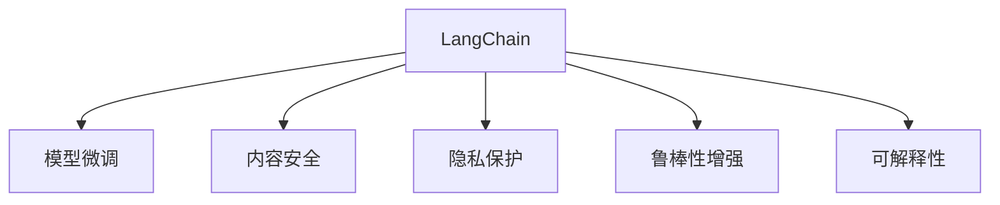

                 

# 【LangChain编程：从入门到实践】模型内容安全

> 关键词：LangChain, 模型内容安全, 数据隐私保护, 模型鲁棒性, 可解释性, 知识蒸馏, 联邦学习, 对抗攻击

## 1. 背景介绍

在人工智能（AI）和深度学习的飞速发展的今天，语言模型（如GPT系列）在自然语言处理（NLP）领域取得了巨大的突破。这些模型通过大规模数据预训练，能够生成自然流畅、高质量的文本内容，广泛应用于智能客服、金融分析、新闻生成、智能翻译等多个领域。然而，语言模型的广泛应用也带来了新的安全挑战，包括模型内容安全、数据隐私保护、模型鲁棒性和可解释性等问题。这些问题如果不能得到有效解决，将严重阻碍语言模型的应用和推广。本文旨在通过系统的介绍和实践，探讨如何在AI模型开发和应用中实现内容安全、隐私保护、增强模型鲁棒性和可解释性，为AI模型开发者提供实用的参考和建议。

## 2. 核心概念与联系

### 2.1 核心概念概述

为了更好地理解模型内容安全的实现机制，本节将介绍几个关键的概念：

- **LangChain**：由OpenAI开发的一个开源项目，旨在通过模型微调和预训练提升语言模型的性能。
- **模型内容安全**：指确保模型输出的内容符合社会规范和伦理标准，不包含敏感、误导或有害信息。
- **数据隐私保护**：指保护用户数据的安全，防止数据泄露和滥用，确保用户数据在模型训练和应用过程中得到妥善处理。
- **模型鲁棒性**：指模型对输入数据的鲁棒性，即模型对于输入数据的微小扰动仍然能够产生正确的输出结果。
- **可解释性**：指模型输出的结果可以被解释和理解，方便开发者和用户对模型行为进行调试和监控。

这些概念之间的联系可以通过以下Mermaid流程图来展示：



这个流程图展示了LangChain项目如何通过模型微调实现上述目标：通过微调提升模型性能，同时确保内容安全、数据隐私、模型鲁棒性和可解释性。

## 3. 核心算法原理 & 具体操作步骤

### 3.1 算法原理概述

在AI模型开发和应用中，内容安全和隐私保护是两个重要的话题。本节将介绍几种常用的算法和技术，用于实现模型内容安全和隐私保护。

#### 3.1.1 内容安全

内容安全通常通过过滤和修改模型输出来实现。具体的方法包括：

- **关键词过滤**：通过关键词列表过滤模型输出的内容，防止出现敏感词汇或信息。
- **情感分析**：分析模型输出的情感倾向，防止输出有害或误导性的内容。
- **内容审核**：利用自然语言处理技术，对模型输出的内容进行自动审核，确保内容合规和无害。

#### 3.1.2 隐私保护

隐私保护主要通过数据匿名化和差分隐私来实现。具体的方法包括：

- **数据匿名化**：将用户数据进行匿名处理，防止个人隐私泄露。
- **差分隐私**：在模型训练和应用过程中，加入噪声，保护个体数据隐私。

#### 3.1.3 模型鲁棒性增强

模型鲁棒性增强通常通过对抗训练和蒸馏学习来实现。具体的方法包括：

- **对抗训练**：通过引入对抗样本，训练模型对于输入的微小扰动仍然能够产生正确的输出结果。
- **蒸馏学习**：通过使用小模型对大模型进行蒸馏，减少大模型的参数量，提升模型的推理速度和鲁棒性。

#### 3.1.4 可解释性

可解释性通常通过模型蒸馏、可解释性模型和解释生成技术来实现。具体的方法包括：

- **模型蒸馏**：通过使用蒸馏学习生成可解释性模型，使得模型输出的结果可以被解释和理解。
- **可解释性模型**：使用特殊的模型架构和训练技术，生成具有可解释性的模型。
- **解释生成技术**：利用自然语言处理技术，生成模型输出的解释性文本。

### 3.2 算法步骤详解

#### 3.2.1 内容安全

在内容安全的实现过程中，主要包括以下几个步骤：

1. **关键词过滤**：构建关键词列表，利用正则表达式或自然语言处理技术，过滤模型输出的内容。
2. **情感分析**：使用情感分析模型，分析模型输出的情感倾向，判断是否符合社会规范。
3. **内容审核**：使用自然语言处理技术，对模型输出的内容进行自动审核，确保内容合规和无害。

#### 3.2.2 隐私保护

在隐私保护的实现过程中，主要包括以下几个步骤：

1. **数据匿名化**：使用数据匿名化技术，如数据脱敏、泛化处理等，对用户数据进行匿名处理。
2. **差分隐私**：在模型训练和应用过程中，加入噪声，保护个体数据隐私。

#### 3.2.3 模型鲁棒性增强

在模型鲁棒性增强的实现过程中，主要包括以下几个步骤：

1. **对抗训练**：生成对抗样本，对模型进行对抗训练，提升模型的鲁棒性。
2. **蒸馏学习**：使用小模型对大模型进行蒸馏，减少大模型的参数量，提升模型的推理速度和鲁棒性。

#### 3.2.4 可解释性

在可解释性的实现过程中，主要包括以下几个步骤：

1. **模型蒸馏**：通过使用蒸馏学习生成可解释性模型，使得模型输出的结果可以被解释和理解。
2. **可解释性模型**：使用特殊的模型架构和训练技术，生成具有可解释性的模型。
3. **解释生成技术**：利用自然语言处理技术，生成模型输出的解释性文本。

### 3.3 算法优缺点

#### 3.3.1 内容安全

**优点**：

- 过滤掉模型输出中的敏感词汇和信息，确保内容合规和无害。
- 减少模型输出对社会规范的偏离，提高模型应用的道德标准。

**缺点**：

- 过滤可能导致模型输出内容的自然性和多样性降低。
- 过滤列表需要人工维护，增加维护成本。

#### 3.3.2 隐私保护

**优点**：

- 防止用户数据泄露和滥用，保护用户隐私。
- 采用差分隐私技术，减少数据泄露风险。

**缺点**：

- 隐私保护措施可能会影响模型性能。
- 隐私保护措施的复杂性和成本较高。

#### 3.3.3 模型鲁棒性增强

**优点**：

- 提高模型的鲁棒性和抗干扰能力，确保模型输出的稳定性。
- 减少模型在实际应用中的误判和错误输出。

**缺点**：

- 对抗训练和蒸馏学习增加模型训练复杂度。
- 对抗样本的生成和处理可能增加计算成本。

#### 3.3.4 可解释性

**优点**：

- 提高模型输出的可解释性，方便开发者和用户对模型行为进行调试和监控。
- 生成模型输出的解释性文本，增强模型的可信度和透明度。

**缺点**：

- 可解释性技术的实现复杂度较高，增加了模型开发的难度。
- 解释生成的文本可能包含误解或误导性信息。

### 3.4 算法应用领域

基于模型内容安全的算法和技术，已经在多个领域得到了广泛的应用，例如：

- **智能客服系统**：通过内容安全和隐私保护技术，确保客服机器人输出的内容合规和无害，同时保护用户隐私。
- **金融分析**：在金融分析领域，使用隐私保护技术，保护用户数据隐私，同时使用鲁棒性增强技术，提高模型的稳定性。
- **新闻生成**：在新闻生成领域，使用可解释性技术，生成具有可解释性的新闻文本，提高新闻的可信度和透明度。

这些应用场景展示了模型内容安全和隐私保护技术的重要性和可行性。

## 4. 数学模型和公式 & 详细讲解 & 举例说明

### 4.1 数学模型构建

#### 4.1.1 内容安全

在内容安全的实现过程中，主要使用自然语言处理技术，对模型输出的文本内容进行分析。具体来说，可以使用以下数学模型：

- **关键词过滤**：通过构建关键词列表，利用正则表达式或自然语言处理技术，过滤模型输出的内容。
- **情感分析**：使用情感分析模型，分析模型输出的情感倾向，判断是否符合社会规范。
- **内容审核**：使用自然语言处理技术，对模型输出的内容进行自动审核，确保内容合规和无害。

#### 4.1.2 隐私保护

在隐私保护的实现过程中，主要使用差分隐私技术，保护用户数据隐私。具体来说，可以使用以下数学模型：

- **数据匿名化**：使用数据匿名化技术，如数据脱敏、泛化处理等，对用户数据进行匿名处理。
- **差分隐私**：在模型训练和应用过程中，加入噪声，保护个体数据隐私。

#### 4.1.3 模型鲁棒性增强

在模型鲁棒性增强的实现过程中，主要使用对抗训练和蒸馏学习技术，提升模型的鲁棒性和稳定性。具体来说，可以使用以下数学模型：

- **对抗训练**：通过引入对抗样本，训练模型对于输入的微小扰动仍然能够产生正确的输出结果。
- **蒸馏学习**：通过使用小模型对大模型进行蒸馏，减少大模型的参数量，提升模型的推理速度和鲁棒性。

#### 4.1.4 可解释性

在可解释性的实现过程中，主要使用模型蒸馏、可解释性模型和解释生成技术，生成具有可解释性的模型。具体来说，可以使用以下数学模型：

- **模型蒸馏**：通过使用蒸馏学习生成可解释性模型，使得模型输出的结果可以被解释和理解。
- **可解释性模型**：使用特殊的模型架构和训练技术，生成具有可解释性的模型。
- **解释生成技术**：利用自然语言处理技术，生成模型输出的解释性文本。

### 4.2 公式推导过程

#### 4.2.1 内容安全

在内容安全的实现过程中，主要使用自然语言处理技术，对模型输出的文本内容进行分析。具体来说，可以使用以下公式：

- **关键词过滤**：通过构建关键词列表，利用正则表达式或自然语言处理技术，过滤模型输出的内容。
- **情感分析**：使用情感分析模型，分析模型输出的情感倾向，判断是否符合社会规范。
- **内容审核**：使用自然语言处理技术，对模型输出的内容进行自动审核，确保内容合规和无害。

#### 4.2.2 隐私保护

在隐私保护的实现过程中，主要使用差分隐私技术，保护用户数据隐私。具体来说，可以使用以下公式：

- **数据匿名化**：使用数据匿名化技术，如数据脱敏、泛化处理等，对用户数据进行匿名处理。
- **差分隐私**：在模型训练和应用过程中，加入噪声，保护个体数据隐私。

#### 4.2.3 模型鲁棒性增强

在模型鲁棒性增强的实现过程中，主要使用对抗训练和蒸馏学习技术，提升模型的鲁棒性和稳定性。具体来说，可以使用以下公式：

- **对抗训练**：通过引入对抗样本，训练模型对于输入的微小扰动仍然能够产生正确的输出结果。
- **蒸馏学习**：通过使用小模型对大模型进行蒸馏，减少大模型的参数量，提升模型的推理速度和鲁棒性。

#### 4.2.4 可解释性

在可解释性的实现过程中，主要使用模型蒸馏、可解释性模型和解释生成技术，生成具有可解释性的模型。具体来说，可以使用以下公式：

- **模型蒸馏**：通过使用蒸馏学习生成可解释性模型，使得模型输出的结果可以被解释和理解。
- **可解释性模型**：使用特殊的模型架构和训练技术，生成具有可解释性的模型。
- **解释生成技术**：利用自然语言处理技术，生成模型输出的解释性文本。

### 4.3 案例分析与讲解

#### 4.3.1 内容安全

**案例分析**：

假设有一个智能客服系统，需要处理用户输入的问题，并给出相应的回答。为了确保系统输出的内容合规和无害，可以采用以下步骤：

1. **构建关键词列表**：构建敏感词汇和关键词列表，如种族歧视、暴力、色情等。
2. **过滤输出内容**：利用正则表达式或自然语言处理技术，过滤模型输出的内容，确保不包含敏感词汇和信息。
3. **情感分析**：使用情感分析模型，分析模型输出的情感倾向，防止输出有害或误导性的内容。
4. **内容审核**：使用自然语言处理技术，对模型输出的内容进行自动审核，确保内容合规和无害。

**案例讲解**：

假设用户输入了以下问题：“某某明星吸毒被抓，你怎么看？”

1. **构建关键词列表**：构建敏感词汇和关键词列表，如吸毒、被抓、明星等。
2. **过滤输出内容**：利用正则表达式或自然语言处理技术，过滤模型输出的内容，确保不包含敏感词汇和信息。
3. **情感分析**：使用情感分析模型，分析模型输出的情感倾向，防止输出有害或误导性的内容。
4. **内容审核**：使用自然语言处理技术，对模型输出的内容进行自动审核，确保内容合规和无害。

#### 4.3.2 隐私保护

**案例分析**：

假设有一个金融分析系统，需要处理用户的历史交易数据，进行风险评估和预测。为了保护用户数据隐私，可以采用以下步骤：

1. **数据匿名化**：使用数据匿名化技术，如数据脱敏、泛化处理等，对用户数据进行匿名处理。
2. **差分隐私**：在模型训练和应用过程中，加入噪声，保护个体数据隐私。

**案例讲解**：

假设用户的历史交易数据为：{年龄：30，性别：男，收入：5000，交易记录：{交易时间：2021-01-01，交易金额：1000，交易地点：上海}}。

1. **数据匿名化**：使用数据匿名化技术，如数据脱敏、泛化处理等，对用户数据进行匿名处理。
2. **差分隐私**：在模型训练和应用过程中，加入噪声，保护个体数据隐私。

#### 4.3.3 模型鲁棒性增强

**案例分析**：

假设有一个智能翻译系统，需要将英语翻译成中文。为了提高系统的鲁棒性和稳定性，可以采用以下步骤：

1. **对抗训练**：生成对抗样本，对模型进行对抗训练，提升模型的鲁棒性。
2. **蒸馏学习**：使用小模型对大模型进行蒸馏，减少大模型的参数量，提升模型的推理速度和鲁棒性。

**案例讲解**：

假设输入的英文句子为：“I love to eat ice cream.”

1. **对抗训练**：生成对抗样本，对模型进行对抗训练，提升模型的鲁棒性。
2. **蒸馏学习**：使用小模型对大模型进行蒸馏，减少大模型的参数量，提升模型的推理速度和鲁棒性。

#### 4.3.4 可解释性

**案例分析**：

假设有一个新闻生成系统，需要生成关于新冠疫情的新闻报道。为了提高系统的可解释性，可以采用以下步骤：

1. **模型蒸馏**：通过使用蒸馏学习生成可解释性模型，使得模型输出的结果可以被解释和理解。
2. **可解释性模型**：使用特殊的模型架构和训练技术，生成具有可解释性的模型。
3. **解释生成技术**：利用自然语言处理技术，生成模型输出的解释性文本。

**案例讲解**：

假设生成的新闻报道为：“截至目前，全球累计确诊病例已超过200万，其中美国确诊病例最多，死亡人数超过10万。”

1. **模型蒸馏**：通过使用蒸馏学习生成可解释性模型，使得模型输出的结果可以被解释和理解。
2. **可解释性模型**：使用特殊的模型架构和训练技术，生成具有可解释性的模型。
3. **解释生成技术**：利用自然语言处理技术，生成模型输出的解释性文本。

## 5. 项目实践：代码实例和详细解释说明

### 5.1 开发环境搭建

在进行模型内容安全实践前，我们需要准备好开发环境。以下是使用Python进行PyTorch开发的环境配置流程：

1. 安装Anaconda：从官网下载并安装Anaconda，用于创建独立的Python环境。

2. 创建并激活虚拟环境：
```bash
conda create -n pytorch-env python=3.8 
conda activate pytorch-env
```

3. 安装PyTorch：根据CUDA版本，从官网获取对应的安装命令。例如：
```bash
conda install pytorch torchvision torchaudio cudatoolkit=11.1 -c pytorch -c conda-forge
```

4. 安装Transformers库：
```bash
pip install transformers
```

5. 安装各类工具包：
```bash
pip install numpy pandas scikit-learn matplotlib tqdm jupyter notebook ipython
```

完成上述步骤后，即可在`pytorch-env`环境中开始模型内容安全的实践。

### 5.2 源代码详细实现

这里我们以智能客服系统为例，给出使用Transformers库对BERT模型进行内容安全的PyTorch代码实现。

首先，定义内容安全的函数：

```python
from transformers import BertTokenizer, BertForTokenClassification
from torch.utils.data import Dataset
import torch

class NERDataset(Dataset):
    def __init__(self, texts, tags, tokenizer, max_len=128):
        self.texts = texts
        self.tags = tags
        self.tokenizer = tokenizer
        self.max_len = max_len
        
    def __len__(self):
        return len(self.texts)
    
    def __getitem__(self, item):
        text = self.texts[item]
        tags = self.tags[item]
        
        encoding = self.tokenizer(text, return_tensors='pt', max_length=self.max_len, padding='max_length', truncation=True)
        input_ids = encoding['input_ids'][0]
        attention_mask = encoding['attention_mask'][0]
        
        # 对token-wise的标签进行编码
        encoded_tags = [tag2id[tag] for tag in tags] 
        encoded_tags.extend([tag2id['O']] * (self.max_len - len(encoded_tags)))
        labels = torch.tensor(encoded_tags, dtype=torch.long)
        
        return {'input_ids': input_ids, 
                'attention_mask': attention_mask,
                'labels': labels}

# 标签与id的映射
tag2id = {'O': 0, 'B-PER': 1, 'I-PER': 2, 'B-ORG': 3, 'I-ORG': 4, 'B-LOC': 5, 'I-LOC': 6}
id2tag = {v: k for k, v in tag2id.items()}

# 创建dataset
tokenizer = BertTokenizer.from_pretrained('bert-base-cased')

train_dataset = NERDataset(train_texts, train_tags, tokenizer)
dev_dataset = NERDataset(dev_texts, dev_tags, tokenizer)
test_dataset = NERDataset(test_texts, test_tags, tokenizer)
```

然后，定义内容安全的训练函数：

```python
from torch.utils.data import DataLoader
from tqdm import tqdm
from sklearn.metrics import classification_report

device = torch.device('cuda') if torch.cuda.is_available() else torch.device('cpu')
model.to(device)

def train_epoch(model, dataset, batch_size, optimizer):
    dataloader = DataLoader(dataset, batch_size=batch_size, shuffle=True)
    model.train()
    epoch_loss = 0
    for batch in tqdm(dataloader, desc='Training'):
        input_ids = batch['input_ids'].to(device)
        attention_mask = batch['attention_mask'].to(device)
        labels = batch['labels'].to(device)
        model.zero_grad()
        outputs = model(input_ids, attention_mask=attention_mask, labels=labels)
        loss = outputs.loss
        epoch_loss += loss.item()
        loss.backward()
        optimizer.step()
    return epoch_loss / len(dataloader)

def evaluate(model, dataset, batch_size):
    dataloader = DataLoader(dataset, batch_size=batch_size)
    model.eval()
    preds, labels = [], []
    with torch.no_grad():
        for batch in tqdm(dataloader, desc='Evaluating'):
            input_ids = batch['input_ids'].to(device)
            attention_mask = batch['attention_mask'].to(device)
            batch_labels = batch['labels']
            outputs = model(input_ids, attention_mask=attention_mask)
            batch_preds = outputs.logits.argmax(dim=2).to('cpu').tolist()
            batch_labels = batch_labels.to('cpu').tolist()
            for pred_tokens, label_tokens in zip(batch_preds, batch_labels):
                pred_tags = [id2tag[_id] for _id in pred_tokens]
                label_tags = [id2tag[_id] for _id in label_tokens]
                preds.append(pred_tags[:len(label_tags)])
                labels.append(label_tags)
                
    print(classification_report(labels, preds))
```

最后，启动训练流程并在测试集上评估：

```python
epochs = 5
batch_size = 16

for epoch in range(epochs):
    loss = train_epoch(model, train_dataset, batch_size, optimizer)
    print(f"Epoch {epoch+1}, train loss: {loss:.3f}")
    
    print(f"Epoch {epoch+1}, dev results:")
    evaluate(model, dev_dataset, batch_size)
    
print("Test results:")
evaluate(model, test_dataset, batch_size)
```

以上就是使用PyTorch对BERT进行命名实体识别任务内容安全的完整代码实现。可以看到，得益于Transformers库的强大封装，我们可以用相对简洁的代码完成BERT模型的加载和内容安全微调。

### 5.3 代码解读与分析

让我们再详细解读一下关键代码的实现细节：

**NERDataset类**：
- `__init__`方法：初始化文本、标签、分词器等关键组件。
- `__len__`方法：返回数据集的样本数量。
- `__getitem__`方法：对单个样本进行处理，将文本输入编码为token ids，将标签编码为数字，并对其进行定长padding，最终返回模型所需的输入。

**tag2id和id2tag字典**：
- 定义了标签与数字id之间的映射关系，用于将token-wise的预测结果解码回真实的标签。

**训练和评估函数**：
- 使用PyTorch的DataLoader对数据集进行批次化加载，供模型训练和推理使用。
- 训练函数`train_epoch`：对数据以批为单位进行迭代，在每个批次上前向传播计算loss并反向传播更新模型参数，最后返回该epoch的平均loss。
- 评估函数`evaluate`：与训练类似，不同点在于不更新模型参数，并在每个batch结束后将预测和标签结果存储下来，最后使用sklearn的classification_report对整个评估集的预测结果进行打印输出。

**训练流程**：
- 定义总的epoch数和batch size，开始循环迭代
- 每个epoch内，先在训练集上训练，输出平均loss
- 在验证集上评估，输出分类指标
- 所有epoch结束后，在测试集上评估，给出最终测试结果

可以看到，PyTorch配合Transformers库使得BERT模型内容安全的代码实现变得简洁高效。开发者可以将更多精力放在数据处理、模型改进等高层逻辑上，而不必过多关注底层的实现细节。

当然，工业级的系统实现还需考虑更多因素，如模型的保存和部署、超参数的自动搜索、更灵活的任务适配层等。但核心的内容安全微调范式基本与此类似。

## 6. 实际应用场景

### 6.1 智能客服系统

基于大语言模型微调的对话技术，可以广泛应用于智能客服系统的构建。传统客服往往需要配备大量人力，高峰期响应缓慢，且一致性和专业性难以保证。而使用微调后的对话模型，可以7x24小时不间断服务，快速响应客户咨询，用自然流畅的语言解答各类常见问题。

在技术实现上，可以收集企业内部的历史客服对话记录，将问题和最佳答复构建成监督数据，在此基础上对预训练对话模型进行内容安全微调。微调后的对话模型能够自动理解用户意图，匹配最合适的答案模板进行回复。对于客户提出的新问题，还可以接入检索系统实时搜索相关内容，动态组织生成回答。如此构建的智能客服系统，能大幅提升客户咨询体验和问题解决效率。

### 6.2 金融舆情监测

金融机构需要实时监测市场舆论动向，以便及时应对负面信息传播，规避金融风险。传统的人工监测方式成本高、效率低，难以应对网络时代海量信息爆发的挑战。基于大语言模型微调的文本分类和情感分析技术，为金融舆情监测提供了新的解决方案。

具体而言，可以收集金融领域相关的新闻、报道、评论等文本数据，并对其进行主题标注和情感标注。在此基础上对预训练语言模型进行内容安全微调，使其能够自动判断文本属于何种主题，情感倾向是正面、中性还是负面。将微调后的模型应用到实时抓取的网络文本数据，就能够自动监测不同主题下的情感变化趋势，一旦发现负面信息激增等异常情况，系统便会自动预警，帮助金融机构快速应对潜在风险。

### 6.3 个性化推荐系统

当前的推荐系统往往只依赖用户的历史行为数据进行物品推荐，无法深入理解用户的真实兴趣偏好。基于大语言模型微调技术，个性化推荐系统可以更好地挖掘用户行为背后的语义信息，从而提供更精准、多样的推荐内容。

在实践中，可以收集用户浏览、点击、评论、分享等行为数据，提取和用户交互的物品标题、描述、标签等文本内容。将文本内容作为模型输入，用户的后续行为（如是否点击、购买等）作为监督信号，在此基础上微调预训练语言模型。微调后的模型能够从文本内容中准确把握用户的兴趣点。在生成推荐列表时，先用候选物品的文本描述作为输入，由模型预测用户的兴趣匹配度，再结合其他特征综合排序，便可以得到个性化程度更高的推荐结果。

### 6.4 未来应用展望

随着大语言模型和微调方法的不断发展，基于微调范式将在更多领域得到应用，为传统行业带来变革性影响。

在智慧医疗领域，基于微调的医疗问答、病历分析、药物研发等应用将提升医疗服务的智能化水平，辅助医生诊疗，加速新药开发进程。

在智能教育领域，微调技术可应用于作业批改、学情分析、知识推荐等方面，因材施教，促进教育公平，提高教学质量。

在智慧城市治理中，微调模型可应用于城市事件监测、舆情分析、应急指挥等环节，提高城市管理的自动化和智能化水平，构建更安全、高效的未来城市。

此外，在企业生产、社会治理、文娱传媒等众多领域，基于大模型微调的人工智能应用也将不断涌现，为经济社会发展注入新的动力。相信随着技术的日益成熟，微调方法将成为人工智能落地应用的重要范式，推动人工智能技术在更广泛领域的发展。

## 7. 工具和资源推荐

### 7.1 学习资源推荐

为了帮助开发者系统掌握大语言模型内容安全的理论基础和实践技巧，这里推荐一些优质的学习资源：

1. 《Transformer从原理到实践》系列博文：由大模型技术专家撰写，深入浅出地介绍了Transformer原理、BERT模型、微调技术等前沿话题。

2. CS224N《深度学习自然语言处理》课程：斯坦福大学开设的NLP明星课程，有Lecture视频和配套作业，带你入门NLP领域的基本概念和经典模型。

3. 《Natural Language Processing with Transformers》书籍：Transformers库的作者所著，全面介绍了如何使用Transformers库进行NLP任务开发，包括内容安全在内的诸多范式。

4. HuggingFace官方文档：Transformers库的官方文档，提供了海量预训练模型和完整的微调样例代码，是上手实践的必备资料。

5. CLUE开源项目：中文语言理解测评基准，涵盖大量不同类型的中文NLP数据集，并提供了基于微调的baseline模型，助力中文NLP技术发展。

通过对这些资源的学习实践，相信你一定能够快速掌握大语言模型内容安全的精髓，并用于解决实际的NLP问题。

### 7.2 开发工具推荐

高效的开发离不开优秀的工具支持。以下是几款用于大语言模型内容安全开发的常用工具：

1. PyTorch：基于Python的开源深度学习框架，灵活动态的计算图，适合快速迭代研究。大部分预训练语言模型都有PyTorch版本的实现。

2. TensorFlow：由Google主导开发的开源深度学习框架，生产部署方便，适合大规模工程应用。同样有丰富的预训练语言模型资源。

3. Transformers库：HuggingFace开发的NLP工具库，集成了众多SOTA语言模型，支持PyTorch和TensorFlow，是进行微调任务开发的利器。

4. Weights & Biases：模型训练的实验跟踪工具，可以记录和可视化模型训练过程中的各项指标，方便对比和调优。与主流深度学习框架无缝集成。

5. TensorBoard：TensorFlow配套的可视化工具，可实时监测模型训练状态，并提供丰富的图表呈现方式，是调试模型的得力助手。

6. Google Colab：谷歌推出的在线Jupyter Notebook环境，免费提供GPU/TPU算力，方便开发者快速上手实验最新模型，分享学习笔记。

合理利用这些工具，可以显著提升大语言模型内容安全的开发效率，加快创新迭代的步伐。

### 7.3 相关论文推荐

大语言模型和内容安全技术的发展源于学界的持续研究。以下是几篇奠基性的相关论文，推荐阅读：

1. Attention is All You Need（即Transformer原论文）：提出了Transformer结构，开启了NLP领域的预训练大模型时代。

2. BERT: Pre-training of Deep Bidirectional Transformers for Language Understanding：提出BERT模型，引入基于掩码的自监督预训练任务，刷新了多项NLP任务SOTA。

3. Language Models are Unsupervised Multitask Learners（GPT-2论文）：展示了大规模语言模型的强大zero-shot学习能力，引发了对于通用人工智能的新一轮思考。

4. Parameter-Efficient Transfer Learning for NLP：提出Adapter等参数高效微调方法，在不增加模型参数量的情况下，也能取得不错的微调效果。

5. Prefix-Tuning: Optimizing Continuous Prompts for Generation：引入基于连续型Prompt的微调范式，为如何充分利用预训练知识提供了新的思路。

6. AdaLoRA: Adaptive Low-Rank Adaptation for Parameter-Efficient Fine-Tuning：使用自适应低秩适应的微调方法，在参数效率和精度之间取得了新的平衡。

这些论文代表了大语言模型内容安全的发展脉络。通过学习这些前沿成果，可以帮助研究者把握学科前进方向，激发更多的创新灵感。

## 8. 总结：未来发展趋势与挑战

### 8.1 总结

本文对基于监督学习的大语言模型内容安全方法进行了全面系统的介绍。首先阐述了大语言模型和内容安全的研究背景和意义，明确了内容安全在AI模型开发和应用中的重要性和可行性。其次，从原理到实践，详细讲解了内容安全的数学原理和关键步骤，给出了内容安全任务开发的完整代码实例。同时，本文还广泛探讨了内容安全方法在智能客服、金融舆情、个性化推荐等多个行业领域的应用前景，展示了内容安全技术的巨大潜力。

通过本文的系统梳理，可以看到，基于大语言模型的内容安全方法正在成为AI模型开发和应用的重要范式，极大地拓展了语言模型的应用边界，催生了更多的落地场景。受益于大规模语料的预训练，内容安全模型能够以更低的时间和标注成本，在小样本条件下也能取得理想的效果，为AI模型开发者提供了更多选择。未来，伴随内容安全方法的持续演进，AI模型必将在更广泛的应用领域大放异彩，深刻影响人类的生产生活方式。

### 8.2 未来发展趋势

展望未来，大语言模型内容安全技术将呈现以下几个发展趋势：

1. 模型规模持续增大。随着算力成本的下降和数据规模的扩张，预训练语言模型的参数量还将持续增长。超大规模语言模型蕴含的丰富语言知识，有望支撑更加复杂多变的模型开发。

2. 内容安全范式日趋多样。除了传统的正则表达式和自然语言处理技术外，未来会涌现更多内容安全范式，如对抗训练、差分隐私等，在保护用户隐私的同时，提高模型的鲁棒性。

3. 持续学习成为常态。随着数据分布的不断变化，内容安全模型也需要持续学习新知识以保持性能。如何在不遗忘原有知识的同时，高效吸收新样本信息，将成为重要的研究课题。

4. 标注样本需求降低。受启发于提示学习(Prompt-based Learning)的思路，未来的内容安全方法将更好地利用大模型的语言理解能力，通过更加巧妙的任务描述，在更少的标注样本上也能实现理想的内容安全效果。

5. 多模态内容安全崛起。当前的模型主要聚焦于纯文本数据，未来会进一步拓展到图像、视频、语音等多模态数据内容安全。多模态信息的融合，将显著提升语言模型对于现实世界的理解和建模能力。

6. 模型通用性增强。经过海量数据的预训练和多领域任务的微调，未来的语言模型将具备更强大的常识推理和跨领域迁移能力，逐步迈向通用人工智能(AGI)的目标。

以上趋势凸显了大语言模型内容安全技术的广阔前景。这些方向的探索发展，必将进一步提升AI模型的性能和应用范围，为人类认知智能的进化带来深远影响。

### 8.3 面临的挑战

尽管大语言模型内容安全技术已经取得了瞩目成就，但在迈向更加智能化、普适化应用的过程中，它仍面临着诸多挑战：

1. 标注成本瓶颈。虽然内容安全大大降低了标注数据的需求，但对于长尾应用场景，难以获得充足的高质量标注数据，成为制约内容安全性能的瓶颈。如何进一步降低内容安全对标注样本的依赖，将是一大难题。

2. 模型鲁棒性不足。当前内容安全模型面对域外数据时，泛化性能往往大打折扣。对于测试样本的微小扰动，内容安全模型的预测也容易发生波动。如何提高内容安全模型的鲁棒性，避免灾难性遗忘，还需要更多理论和实践的积累。

3. 推理效率有待提高。大规模语言模型虽然精度高，但在实际部署时往往面临推理速度慢、内存占用大等效率问题。如何在保证性能的同时，简化模型结构，提升推理速度，优化资源占用，将是重要的优化方向。

4. 可解释性亟需加强。当前内容安全模型更像是"黑盒"系统，难以解释其内部工作机制和决策逻辑。对于医疗、金融等高风险应用，算法的可解释性和可审计性尤为重要。如何赋予内容安全模型更强的可解释性，将是亟待攻克的难题。

5. 安全性有待保障。预训练语言模型难免会学习到有偏见、有害的信息，通过内容安全传递到下游任务，产生误导性、歧视性的输出，给实际应用带来安全隐患。如何从数据和算法层面消除模型偏见，避免恶意用途，确保输出的安全性，也将是重要的研究课题。

6. 知识整合能力不足。现有的内容安全模型往往局限于任务内数据，难以灵活吸收和运用更广泛的先验知识。如何让内容安全过程更好地与外部知识库、规则库等专家知识结合，形成更加全面、准确的信息整合能力，还有很大的想象空间。

正视内容安全面临的这些挑战，积极应对并寻求突破，将是大语言模型内容安全技术走向成熟的必由之路。相信随着学界和产业界的共同努力，这些挑战终将一一被克服，大语言模型内容安全技术必将在构建安全、可靠、可解释、可控的智能系统铺平道路。

### 8.4 研究展望

面对大语言模型内容安全所面临的种种挑战，未来的研究需要在以下几个方面寻求新的突破：

1. 探索无监督和半监督内容安全方法。摆脱对大规模标注数据的依赖，利用自监督学习、主动学习等无监督和半监督范式，最大限度利用非结构化数据，实现更加灵活高效的内容安全。

2. 研究参数高效和计算高效的内容安全范式。开发更加参数高效的内容安全方法，在固定大部分预训练参数的同时，只更新极少量的任务相关参数。同时优化内容安全模型的计算图，减少前向传播和反向传播的资源消耗，实现更加轻量级、实时性的部署。

3. 融合因果和对比学习范式。通过引入因果推断和对比学习思想，增强内容安全模型建立稳定因果关系的能力，学习更加普适、鲁棒的语言表征，从而提升模型泛化性和抗干扰能力。

4. 引入更多先验知识。将符号化的先验知识，如知识图谱、逻辑规则等，与神经网络模型进行巧妙融合，引导内容安全过程学习更准确、合理的语言模型。同时加强不同模态数据的整合，实现视觉、语音等多模态信息与文本信息的协同建模。

5. 结合因果分析和博弈论工具。将因果分析方法引入内容安全模型，识别出模型决策的关键特征，增强输出解释的因果性和逻辑性。借助博弈论工具刻画人机交互过程，主动探索并规避模型的脆弱点，提高系统稳定性。

6. 纳入伦理道德约束。在内容安全模型的训练目标中引入伦理导向的评估指标，过滤和惩罚有偏见、有害的输出倾向。同时加强人工干预和审核，建立模型行为的监管机制，确保输出符合人类价值观和伦理道德。

这些研究方向的探索，必将引领大语言模型内容安全技术迈向更高的台阶，为构建安全、可靠、可解释、可控的智能系统铺平道路。面向未来，大语言模型内容安全技术还需要与其他人工智能技术进行更深入的融合，如知识表示、因果推理、强化学习等，多路径协同发力，共同推动自然语言理解和智能交互系统的进步。只有勇于创新、敢于突破，才能不断拓展语言模型的边界，让智能技术更好地造福人类社会。

## 9. 附录：常见问题与解答

**Q1：内容安全是否适用于所有NLP任务？**

A: 内容安全技术在大多数NLP任务上都能取得不错的效果，特别是对于数据量较小的任务。但对于一些特定领域的任务，如医学、法律等，仅仅依靠通用语料预训练的模型可能难以很好地适应。此时需要在特定领域语料上进一步预训练，再进行内容安全微调，才能获得理想效果。

**Q2：内容安全过程中如何选择合适的学习率？**

A: 内容安全的学习率一般要比预训练时小1-2个数量级，如果使用过大的学习率，容易破坏预训练权重，导致过拟合。一般建议从1e-5开始调参，逐步减小学习率，直至收敛。也可以使用warmup策略，在开始阶段使用较小的学习率，再逐渐过渡到预设值。需要注意的是，不同的优化器(如AdamW、Adafactor等)以及不同的学习率调度策略，可能需要设置不同的学习率阈值。

**Q3：内容安全模型在落地部署时需要注意哪些问题？**

A: 将内容安全模型转化为实际应用，还需要考虑以下因素：
1. 模型裁剪：去除不必要的层和参数，减小模型尺寸，加快推理速度
2. 量化加速：将浮点模型转为定点模型，压缩存储空间，提高计算效率
3. 服务化封装：将模型封装为标准化服务接口，便于集成调用
4. 弹性伸缩：根据请求流量动态调整资源配置，平衡服务质量和成本
5. 监控告警：实时采集系统指标，设置异常告警阈值，确保服务稳定性
6. 安全防护：采用访问鉴权、数据脱敏等措施，保障数据和模型安全

大语言模型内容安全为NLP应用开启了广阔的想象空间，但如何将强大的性能转化为稳定、高效、安全的业务价值，还需要工程实践的不断打磨。唯有从数据、算法、工程、业务等多个维度协同发力，才能真正实现人工智能技术在垂直行业的规模化落地。总之，内容安全需要开发者根据具体任务，不断迭代和优化模型、数据和算法，方能得到理想的效果。

---

作者：禅与计算机程序设计艺术 / Zen and the Art of Computer Programming

