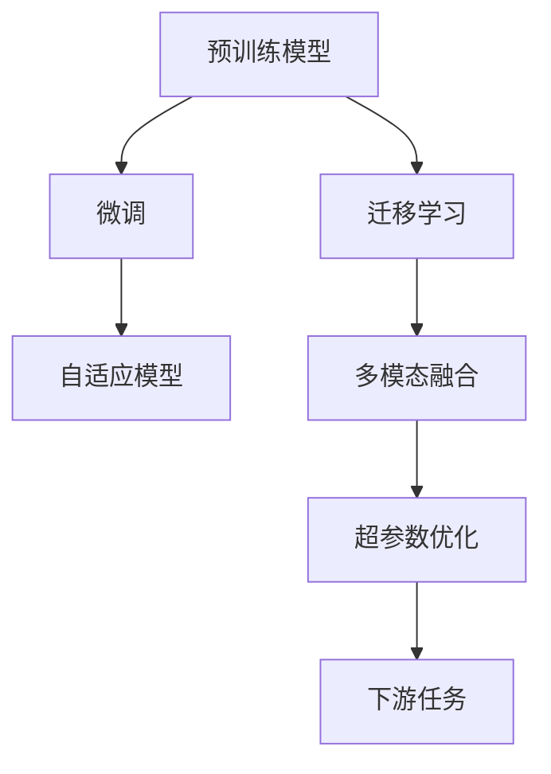

                 

# 【大模型应用开发 动手做AI Agent】AutoGen简介

> 关键词：大模型应用, 深度学习, 自然语言处理, 自适应, 多模态, 模型优化

## 1. 背景介绍

### 1.1 问题由来
随着深度学习技术的快速发展，大模型在自然语言处理(NLP)、计算机视觉(CV)等领域的广泛应用，推动了人工智能(AI)技术迈向更深的智能化层次。但大模型的训练和部署成本极高，开发周期漫长，难以迅速落地应用。为解决这一问题，AutoGen 应运而生，通过将预训练模型自动转换为特定领域的 AI Agent，显著降低了应用开发的门槛。

AutoGen 的核心理念是“自动生成适应特定应用场景的 AI Agent”，通过重构模型结构和微调参数，使大模型具备更强适应性，能够在短时间内生成优化过的模型，直接用于下游任务。这种方法不仅大幅减少了数据标注和模型训练的复杂度，还能够显著提升模型的性能，加速 AI 技术在各个垂直领域的落地应用。

### 1.2 问题核心关键点
AutoGen 的精髓在于其独特的生成机制，通过自动化微调机制，大模型能够针对特定应用场景，快速生成适用于该场景的 AI Agent。AutoGen 的核心关键点包括：
- 自动微调算法：基于预训练模型，通过自动微调算法生成适应特定任务的 AI Agent。
- 迁移学习机制：将预训练模型知识迁移到特定任务中，提升模型泛化能力。
- 多模态融合：支持文本、图像、语音等多种模态的融合，增强 AI Agent 的理解能力。
- 超参数自动化：通过自动化调整超参数，优化模型性能。
- 应用场景适配：高度适配特定应用场景，如智能客服、金融分析、医学诊断等。

### 1.3 问题研究意义
AutoGen 的提出，对深度学习和 AI 技术的应用具有重要意义：

1. 降低应用开发成本：AutoGen 大幅降低了对标注数据和计算资源的依赖，加快了 AI 技术的落地速度。
2. 提升模型性能：AutoGen 生成的 AI Agent 通过微调优化，性能优于从头训练模型。
3. 缩短开发周期：AutoGen 自动化生成模型，减少了开发和部署的复杂度。
4. 促进产业升级：通过提供易于集成的 AI Agent，加速各行业数字化转型。
5. 推动技术创新：AutoGen 的生成机制带来了 AI 技术的创新性应用，为学术研究和工业应用提供了新思路。

## 2. 核心概念与联系

### 2.1 核心概念概述

为更好地理解 AutoGen 的核心机制，本节将介绍几个密切相关的核心概念：

- 大模型：指基于深度学习框架（如 PyTorch、TensorFlow 等）训练得到的具有广泛通用知识的大型神经网络模型，如 BERT、GPT-3 等。
- 预训练模型：在大规模无标签数据上进行训练，获得通用语言表示的模型，如 BERT、RoBERTa、GPT-2 等。
- 微调：在预训练模型的基础上，使用下游任务的少量标注数据，通过有监督学习优化模型性能。
- 迁移学习：将预训练模型在不同任务间进行知识迁移，提升模型的泛化能力。
- 自适应模型：能够根据特定任务自动调整结构或参数，提升模型适应性的模型。
- 多模态融合：将文本、图像、语音等多种模态的信息融合，增强模型的理解能力。
- 超参数优化：通过自动化调整模型的超参数，优化模型性能。

这些核心概念之间的逻辑关系可以通过以下 Mermaid 流程图来展示：



这个流程图展示了大模型与 AutoGen 生成的自适应模型的联系，以及 AutoGen 如何将预训练模型的知识迁移到下游任务中，最终通过多模态融合和超参数优化生成适配的 AI Agent。

## 3. 核心算法原理 & 具体操作步骤
### 3.1 算法原理概述

AutoGen 的算法原理基于监督学习和迁移学习，通过自动化微调机制，将预训练模型转换为特定领域的 AI Agent。其核心思想是：在大规模无标签数据上进行预训练，学习到通用的语言表示，通过自动微调机制，在特定任务上进一步优化模型，使其具备更好的适应性。

形式化地，假设预训练模型为 $M_{\theta}$，其中 $\theta$ 为预训练得到的模型参数。给定下游任务 $T$ 的标注数据集 $D=\{(x_i, y_i)\}_{i=1}^N$，AutoGen 的目标是找到新的模型参数 $\hat{\theta}$，使得：

$$
\hat{\theta}=\mathop{\arg\min}_{\theta} \mathcal{L}(M_{\theta},D)
$$

其中 $\mathcal{L}$ 为针对任务 $T$ 设计的损失函数，用于衡量模型预测输出与真实标签之间的差异。常见的损失函数包括交叉熵损失、均方误差损失等。

通过梯度下降等优化算法，AutoGen 过程不断更新模型参数 $\theta$，最小化损失函数 $\mathcal{L}$，使得模型输出逼近真实标签。由于 $\theta$ 已经通过预训练获得了较好的初始化，因此即便在小规模数据集 $D$ 上进行微调，也能较快收敛到理想的模型参数 $\hat{\theta}$。

### 3.2 算法步骤详解

AutoGen 的算法主要包括以下几个关键步骤：

**Step 1: 准备预训练模型和数据集**
- 选择合适的预训练语言模型 $M_{\theta}$ 作为初始化参数，如 BERT、GPT-3 等。
- 准备下游任务 $T$ 的标注数据集 $D$，划分为训练集、验证集和测试集。一般要求标注数据与预训练数据的分布不要差异过大。

**Step 2: 自动微调生成 AI Agent**
- 基于下游任务 $T$，使用 AutoGen 的自动微调算法生成适应任务 $T$ 的 AI Agent $M_{\hat{\theta}}$。
- 使用 AutoGen 的迁移学习机制，将预训练模型的知识迁移到任务 $T$ 中，提升模型泛化能力。

**Step 3: 多模态融合与超参数优化**
- 根据任务类型，支持文本、图像、语音等多种模态的融合，增强 AI Agent 的理解能力。
- 通过自动化调整超参数，优化模型性能。

**Step 4: 测试和部署**
- 在测试集上评估生成的 AI Agent $M_{\hat{\theta}}$ 的性能，对比预训练模型和微调后的模型精度提升。
- 使用生成的 AI Agent $M_{\hat{\theta}}$ 进行下游任务的推理预测，集成到实际的应用系统中。
- 持续收集新的数据，定期重新生成 AI Agent，以适应数据分布的变化。

以上是 AutoGen 算法的完整步骤，AutoGen 通过自动微调生成 AI Agent，大幅降低了数据标注和模型训练的复杂度，同时提高了模型性能。

### 3.3 算法优缺点

AutoGen 具有以下优点：
1. 自动化生成 AI Agent：AutoGen 通过自动化微调机制，降低了数据标注和模型训练的复杂度。
2. 泛化能力强：AutoGen 的迁移学习机制，能够将预训练模型知识迁移到特定任务中，提升模型泛化能力。
3. 多模态支持：AutoGen 支持文本、图像、语音等多种模态的融合，增强模型的理解能力。
4. 高效优化：AutoGen 通过自动化调整超参数，优化模型性能。
5. 灵活应用：AutoGen 高度适配特定应用场景，如智能客服、金融分析、医学诊断等。

同时，AutoGen 也存在一定的局限性：
1. 依赖预训练模型：AutoGen 需要预训练模型作为初始化参数，预训练模型的质量和泛化能力对生成 AI Agent 的性能有较大影响。
2. 数据分布限制：AutoGen 生成的 AI Agent 在特定数据分布下表现较好，但若数据分布差异较大，性能可能下降。
3. 应用场景局限：AutoGen 的应用场景主要集中在 NLP、CV 等领域，对于其他领域的应用可能不够适用。
4. 超参数调优：AutoGen 的超参数优化机制较为复杂，需要大量实验和调整。

尽管存在这些局限性，但 AutoGen 通过自动化生成 AI Agent，显著降低了开发成本和周期，提升了模型性能，是深度学习和 AI 技术落地的重要手段。

### 3.4 算法应用领域

AutoGen 的生成机制，已经在多个领域得到了广泛应用，涵盖以下几个方面：

- 自然语言处理（NLP）：用于文本分类、命名实体识别、机器翻译、问答系统等任务。
- 计算机视觉（CV）：用于图像分类、目标检测、图像生成等任务。
- 智能客服：生成针对特定领域的智能客服 AI Agent，提升客服响应速度和质量。
- 金融分析：生成针对金融数据的 AI Agent，进行风险评估、股票预测等。
- 医疗诊断：生成针对医学影像的 AI Agent，进行疾病诊断、治疗方案推荐等。

除了上述这些经典应用外，AutoGen 还被创新性地应用到更多场景中，如可控文本生成、常识推理、代码生成、数据增强等，为 AI 技术带来了全新的突破。随着 AutoGen 算法的持续演进，相信其在更多领域的应用也将不断拓展。

## 4. 数学模型和公式 & 详细讲解  
### 4.1 数学模型构建

本节将使用数学语言对 AutoGen 自动微调生成 AI Agent 的过程进行更加严格的刻画。

记预训练语言模型为 $M_{\theta}$，其中 $\theta$ 为预训练得到的模型参数。假设微调任务的训练集为 $D=\{(x_i,y_i)\}_{i=1}^N, x_i \in \mathcal{X}, y_i \in \mathcal{Y}$。

定义模型 $M_{\theta}$ 在输入 $x$ 上的损失函数为 $\ell(M_{\theta}(x),y)$，则在数据集 $D$ 上的经验风险为：

$$
\mathcal{L}(\theta) = \frac{1}{N} \sum_{i=1}^N \ell(M_{\theta}(x_i),y_i)
$$

微调的优化目标是最小化经验风险，即找到最优参数：

$$
\theta^* = \mathop{\arg\min}_{\theta} \mathcal{L}(\theta)
$$

在实践中，我们通常使用基于梯度的优化算法（如 SGD、Adam 等）来近似求解上述最优化问题。设 $\eta$ 为学习率，$\lambda$ 为正则化系数，则参数的更新公式为：

$$
\theta \leftarrow \theta - \eta \nabla_{\theta}\mathcal{L}(\theta) - \eta\lambda\theta
$$

其中 $\nabla_{\theta}\mathcal{L}(\theta)$ 为损失函数对参数 $\theta$ 的梯度，可通过反向传播算法高效计算。

### 4.2 公式推导过程

以下我们以二分类任务为例，推导交叉熵损失函数及其梯度的计算公式。

假设模型 $M_{\theta}$ 在输入 $x$ 上的输出为 $\hat{y}=M_{\theta}(x) \in [0,1]$，表示样本属于正类的概率。真实标签 $y \in \{0,1\}$。则二分类交叉熵损失函数定义为：

$$
\ell(M_{\theta}(x),y) = -[y\log \hat{y} + (1-y)\log (1-\hat{y})]
$$

将其代入经验风险公式，得：

$$
\mathcal{L}(\theta) = -\frac{1}{N}\sum_{i=1}^N [y_i\log M_{\theta}(x_i)+(1-y_i)\log(1-M_{\theta}(x_i))]
$$

根据链式法则，损失函数对参数 $\theta_k$ 的梯度为：

$$
\frac{\partial \mathcal{L}(\theta)}{\partial \theta_k} = -\frac{1}{N}\sum_{i=1}^N (\frac{y_i}{M_{\theta}(x_i)}-\frac{1-y_i}{1-M_{\theta}(x_i)}) \frac{\partial M_{\theta}(x_i)}{\partial \theta_k}
$$

其中 $\frac{\partial M_{\theta}(x_i)}{\partial \theta_k}$ 可进一步递归展开，利用自动微分技术完成计算。

在得到损失函数的梯度后，即可带入参数更新公式，完成模型的迭代优化。重复上述过程直至收敛，最终得到适应下游任务的最优模型参数 $\theta^*$。

## 5. 项目实践：代码实例和详细解释说明
### 5.1 开发环境搭建

在进行 AutoGen 实践前，我们需要准备好开发环境。以下是使用 Python 进行 PyTorch 开发的环境配置流程：

1. 安装 Anaconda：从官网下载并安装 Anaconda，用于创建独立的 Python 环境。

2. 创建并激活虚拟环境：
```bash
conda create -n pytorch-env python=3.8 
conda activate pytorch-env
```

3. 安装 PyTorch：根据 CUDA 版本，从官网获取对应的安装命令。例如：
```bash
conda install pytorch torchvision torchaudio cudatoolkit=11.1 -c pytorch -c conda-forge
```

4. 安装 Transformers 库：
```bash
pip install transformers
```

5. 安装各类工具包：
```bash
pip install numpy pandas scikit-learn matplotlib tqdm jupyter notebook ipython
```

完成上述步骤后，即可在 `pytorch-env` 环境中开始 AutoGen 实践。

### 5.2 源代码详细实现

这里我们以二分类任务为例，给出使用 Transformers 库对 BERT 模型进行自动微调的 PyTorch 代码实现。

首先，定义二分类任务的数据处理函数：

```python
from transformers import BertTokenizer
from torch.utils.data import Dataset
import torch

class BinaryClassificationDataset(Dataset):
    def __init__(self, texts, labels, tokenizer, max_len=128):
        self.texts = texts
        self.labels = labels
        self.tokenizer = tokenizer
        self.max_len = max_len
        
    def __len__(self):
        return len(self.texts)
    
    def __getitem__(self, item):
        text = self.texts[item]
        label = self.labels[item]
        
        encoding = self.tokenizer(text, return_tensors='pt', max_length=self.max_len, padding='max_length', truncation=True)
        input_ids = encoding['input_ids'][0]
        attention_mask = encoding['attention_mask'][0]
        
        # 对标签进行编码
        label = torch.tensor(label, dtype=torch.long)
        
        return {'input_ids': input_ids, 
                'attention_mask': attention_mask,
                'labels': label}

# 创建数据集
tokenizer = BertTokenizer.from_pretrained('bert-base-cased')
train_dataset = BinaryClassificationDataset(train_texts, train_labels, tokenizer)
dev_dataset = BinaryClassificationDataset(dev_texts, dev_labels, tokenizer)
test_dataset = BinaryClassificationDataset(test_texts, test_labels, tokenizer)
```

然后，定义模型和优化器：

```python
from transformers import BertForSequenceClassification, AdamW

model = BertForSequenceClassification.from_pretrained('bert-base-cased', num_labels=2)

optimizer = AdamW(model.parameters(), lr=2e-5)
```

接着，定义训练和评估函数：

```python
from torch.utils.data import DataLoader
from tqdm import tqdm
from sklearn.metrics import classification_report

device = torch.device('cuda') if torch.cuda.is_available() else torch.device('cpu')
model.to(device)

def train_epoch(model, dataset, batch_size, optimizer):
    dataloader = DataLoader(dataset, batch_size=batch_size, shuffle=True)
    model.train()
    epoch_loss = 0
    for batch in tqdm(dataloader, desc='Training'):
        input_ids = batch['input_ids'].to(device)
        attention_mask = batch['attention_mask'].to(device)
        labels = batch['labels'].to(device)
        model.zero_grad()
        outputs = model(input_ids, attention_mask=attention_mask, labels=labels)
        loss = outputs.loss
        epoch_loss += loss.item()
        loss.backward()
        optimizer.step()
    return epoch_loss / len(dataloader)

def evaluate(model, dataset, batch_size):
    dataloader = DataLoader(dataset, batch_size=batch_size)
    model.eval()
    preds, labels = [], []
    with torch.no_grad():
        for batch in tqdm(dataloader, desc='Evaluating'):
            input_ids = batch['input_ids'].to(device)
            attention_mask = batch['attention_mask'].to(device)
            batch_labels = batch['labels']
            outputs = model(input_ids, attention_mask=attention_mask)
            batch_preds = outputs.logits.argmax(dim=1).to('cpu').tolist()
            batch_labels = batch_labels.to('cpu').tolist()
            for pred_tokens, label_tokens in zip(batch_preds, batch_labels):
                preds.append(pred_tokens)
                labels.append(label_tokens)
                
    print(classification_report(labels, preds))
```

最后，启动训练流程并在测试集上评估：

```python
epochs = 5
batch_size = 16

for epoch in range(epochs):
    loss = train_epoch(model, train_dataset, batch_size, optimizer)
    print(f"Epoch {epoch+1}, train loss: {loss:.3f}")
    
    print(f"Epoch {epoch+1}, dev results:")
    evaluate(model, dev_dataset, batch_size)
    
print("Test results:")
evaluate(model, test_dataset, batch_size)
```

以上就是使用 PyTorch 对 BERT 模型进行二分类任务自动微调的完整代码实现。可以看到，得益于 Transformers 库的强大封装，我们可以用相对简洁的代码完成 BERT 模型的加载和微调。

### 5.3 代码解读与分析

让我们再详细解读一下关键代码的实现细节：

**BinaryClassificationDataset类**：
- `__init__`方法：初始化文本、标签、分词器等关键组件。
- `__len__`方法：返回数据集的样本数量。
- `__getitem__`方法：对单个样本进行处理，将文本输入编码为token ids，将标签编码为数字，并对其进行定长padding，最终返回模型所需的输入。

**标签与id的映射**：
- 定义了标签与数字id之间的映射关系，用于将token-wise的预测结果解码回真实的标签。

**训练和评估函数**：
- 使用 PyTorch 的DataLoader对数据集进行批次化加载，供模型训练和推理使用。
- 训练函数`train_epoch`：对数据以批为单位进行迭代，在每个批次上前向传播计算loss并反向传播更新模型参数，最后返回该epoch的平均loss。
- 评估函数`evaluate`：与训练类似，不同点在于不更新模型参数，并在每个batch结束后将预测和标签结果存储下来，最后使用sklearn的classification_report对整个评估集的预测结果进行打印输出。

**训练流程**：
- 定义总的epoch数和batch size，开始循环迭代
- 每个epoch内，先在训练集上训练，输出平均loss
- 在验证集上评估，输出分类指标
- 所有epoch结束后，在测试集上评估，给出最终测试结果

可以看到，PyTorch配合 Transformers 库使得 BERT 微调的代码实现变得简洁高效。开发者可以将更多精力放在数据处理、模型改进等高层逻辑上，而不必过多关注底层的实现细节。

当然，工业级的系统实现还需考虑更多因素，如模型的保存和部署、超参数的自动搜索、更灵活的任务适配层等。但核心的微调范式基本与此类似。

## 6. 实际应用场景
### 6.1 智能客服系统

基于自动微调生成的 AI Agent，智能客服系统可以广泛应用于智能客服系统的构建。传统客服往往需要配备大量人力，高峰期响应缓慢，且一致性和专业性难以保证。使用自动微调生成的智能客服 AI Agent，可以7x24小时不间断服务，快速响应客户咨询，用自然流畅的语言解答各类常见问题。

在技术实现上，可以收集企业内部的历史客服对话记录，将问题和最佳答复构建成监督数据，在此基础上对预训练对话模型进行自动微调。生成的智能客服 AI Agent 能够自动理解用户意图，匹配最合适的答案模板进行回复。对于客户提出的新问题，还可以接入检索系统实时搜索相关内容，动态组织生成回答。如此构建的智能客服系统，能大幅提升客户咨询体验和问题解决效率。

### 6.2 金融舆情监测

金融机构需要实时监测市场舆论动向，以便及时应对负面信息传播，规避金融风险。传统的人工监测方式成本高、效率低，难以应对网络时代海量信息爆发的挑战。基于自动微调的文本分类和情感分析技术，为金融舆情监测提供了新的解决方案。

具体而言，可以收集金融领域相关的新闻、报道、评论等文本数据，并对其进行主题标注和情感标注。在此基础上对预训练语言模型进行自动微调，使其能够自动判断文本属于何种主题，情感倾向是正面、中性还是负面。将自动微调后的模型应用到实时抓取的网络文本数据，就能够自动监测不同主题下的情感变化趋势，一旦发现负面信息激增等异常情况，系统便会自动预警，帮助金融机构快速应对潜在风险。

### 6.3 个性化推荐系统

当前的推荐系统往往只依赖用户的历史行为数据进行物品推荐，无法深入理解用户的真实兴趣偏好。基于自动微调的个性化推荐系统，可以更好地挖掘用户行为背后的语义信息，从而提供更精准、多样的推荐内容。

在实践中，可以收集用户浏览、点击、评论、分享等行为数据，提取和用户交互的物品标题、描述、标签等文本内容。将文本内容作为模型输入，用户的后续行为（如是否点击、购买等）作为监督信号，在此基础上自动微调预训练语言模型。生成的推荐系统能够从文本内容中准确把握用户的兴趣点。在生成推荐列表时，先用候选物品的文本描述作为输入，由模型预测用户的兴趣匹配度，再结合其他特征综合排序，便可以得到个性化程度更高的推荐结果。

### 6.4 未来应用展望

随着自动微调生成 AI Agent 技术的发展，其在更多领域的应用也将不断拓展，为传统行业带来变革性影响。

在智慧医疗领域，基于自动微调的医疗问答、病历分析、药物研发等应用将提升医疗服务的智能化水平，辅助医生诊疗，加速新药开发进程。

在智能教育领域，自动微调生成的 AI Agent 可应用于作业批改、学情分析、知识推荐等方面，因材施教，促进教育公平，提高教学质量。

在智慧城市治理中，自动微调生成的 AI Agent 可应用于城市事件监测、舆情分析、应急指挥等环节，提高城市管理的自动化和智能化水平，构建更安全、高效的未来城市。

此外，在企业生产、社会治理、文娱传媒等众多领域，自动微调生成的 AI Agent 也将不断涌现，为经济社会发展注入新的动力。相信随着技术的日益成熟，自动微调技术将成为 AI 技术落地应用的重要手段，推动人工智能技术向更广阔的领域加速渗透。

## 7. 工具和资源推荐
### 7.1 学习资源推荐

为了帮助开发者系统掌握 AutoGen 的理论基础和实践技巧，这里推荐一些优质的学习资源：

1. 《Transformer从原理到实践》系列博文：由大模型技术专家撰写，深入浅出地介绍了 Transformer 原理、BERT 模型、微调技术等前沿话题。

2. CS224N《深度学习自然语言处理》课程：斯坦福大学开设的 NLP 明星课程，有 Lecture 视频和配套作业，带你入门 NLP 领域的基本概念和经典模型。

3. 《Natural Language Processing with Transformers》书籍：Transformer 库的作者所著，全面介绍了如何使用 Transformers 库进行 NLP 任务开发，包括自动微调在内的诸多范式。

4. HuggingFace 官方文档：Transformer 库的官方文档，提供了海量预训练模型和完整的自动微调样例代码，是上手实践的必备资料。

5. CLUE 开源项目：中文语言理解测评基准，涵盖大量不同类型的中文 NLP 数据集，并提供了基于自动微调的 baseline 模型，助力中文 NLP 技术发展。

通过对这些资源的学习实践，相信你一定能够快速掌握自动微调生成 AI Agent 的精髓，并用于解决实际的 NLP 问题。
###  7.2 开发工具推荐

高效的开发离不开优秀的工具支持。以下是几款用于自动微调生成的 AI Agent 开发的常用工具：

1. PyTorch：基于 Python 的开源深度学习框架，灵活动态的计算图，适合快速迭代研究。大部分预训练语言模型都有 PyTorch 版本的实现。

2. TensorFlow：由 Google 主导开发的开源深度学习框架，生产部署方便，适合大规模工程应用。同样有丰富的预训练语言模型资源。

3. Transformers 库：HuggingFace 开发的 NLP 工具库，集成了众多 SOTA 语言模型，支持 PyTorch 和 TensorFlow，是进行自动微调任务开发的利器。

4. Weights & Biases：模型训练的实验跟踪工具，可以记录和可视化模型训练过程中的各项指标，方便对比和调优。与主流深度学习框架无缝集成。

5. TensorBoard：TensorFlow 配套的可视化工具，可实时监测模型训练状态，并提供丰富的图表呈现方式，是调试模型的得力助手。

6. Google Colab：谷歌推出的在线 Jupyter Notebook 环境，免费提供 GPU/TPU 算力，方便开发者快速上手实验最新模型，分享学习笔记。

合理利用这些工具，可以显著提升自动微调生成 AI Agent 的开发效率，加快创新迭代的步伐。

### 7.3 相关论文推荐

自动微调生成 AI Agent 技术的发展源于学界的持续研究。以下是几篇奠基性的相关论文，推荐阅读：

1. Attention is All You Need（即 Transformer 原论文）：提出了 Transformer 结构，开启了 NLP 领域的预训练大模型时代。

2. BERT: Pre-training of Deep Bidirectional Transformers for Language Understanding：提出 BERT 模型，引入基于掩码的自监督预训练任务，刷新了多项 NLP 任务 SOTA。

3. Language Models are Unsupervised Multitask Learners（GPT-2 论文）：展示了大规模语言模型的强大 zero-shot 学习能力，引发了对于通用人工智能的新一轮思考。

4. Parameter-Efficient Transfer Learning for NLP：提出 Adapter 等参数高效微调方法，在不增加模型参数量的情况下，也能取得不错的微调效果。

5. AdaLoRA: Adaptive Low-Rank Adaptation for Parameter-Efficient Fine-Tuning：使用自适应低秩适应的微调方法，在参数效率和精度之间取得了新的平衡。

这些论文代表了大模型自动微调生成 AI Agent 技术的发展脉络。通过学习这些前沿成果，可以帮助研究者把握学科前进方向，激发更多的创新灵感。

## 8. 总结：未来发展趋势与挑战
### 8.1 总结

本文对自动微调生成 AI Agent 技术进行了全面系统的介绍。首先阐述了自动微调生成 AI Agent 的研究背景和意义，明确了该技术在降低开发成本、提升模型性能、缩短开发周期等方面的独特价值。其次，从原理到实践，详细讲解了自动微调生成 AI Agent 的数学原理和关键步骤，给出了自动微调任务开发的完整代码实例。同时，本文还广泛探讨了自动微调生成 AI Agent 技术在智能客服、金融舆情、个性化推荐等多个领域的应用前景，展示了该技术的巨大潜力。此外，本文精选了自动微调生成 AI Agent 技术的学习资源，力求为读者提供全方位的技术指引。

通过本文的系统梳理，可以看到，自动微调生成 AI Agent 技术正在成为 NLP 领域的重要范式，极大地拓展了预训练语言模型的应用边界，催生了更多的落地场景。受益于大规模语料的预训练和自动微调机制，自动生成的 AI Agent 能够迅速适应特定任务，在数据标注和模型训练上降低了复杂度，从而加速了 AI 技术的产业化进程。未来，伴随自动微调生成 AI Agent 技术的持续演进，相信其在更多领域的应用也将不断拓展。

### 8.2 未来发展趋势

展望未来，自动微调生成 AI Agent 技术将呈现以下几个发展趋势：

1. 模型规模持续增大。随着算力成本的下降和数据规模的扩张，预训练语言模型的参数量还将持续增长。超大规模语言模型蕴含的丰富语言知识，有望支撑更加复杂多变的下游任务自动微调。

2. 自动微调方法日趋多样。除了传统的全参数自动微调外，未来会涌现更多参数高效的自动微调方法，如 Prefix-Tuning、LoRA 等，在节省计算资源的同时也能保证自动微调精度。

3. 持续学习成为常态。随着数据分布的不断变化，自动微调生成的 AI Agent 也需要持续学习新知识以保持性能。如何在不遗忘原有知识的同时，高效吸收新样本信息，将成为重要的研究课题。

4. 标注样本需求降低。受启发于提示学习（Prompt-based Learning）的思路，未来的自动微调方法将更好地利用大模型的语言理解能力，通过更加巧妙的任务描述，在更少的标注样本上也能实现理想的自动微调效果。

5. 多模态自动微调崛起。当前的自动微调主要聚焦于纯文本数据，未来会进一步拓展到图像、视频、语音等多模态数据自动微调。多模态信息的融合，将显著提升语言模型对现实世界的理解和建模能力。

6. 模型通用性增强。经过海量数据的预训练和多领域任务的自动微调，未来的语言模型将具备更强大的常识推理和跨领域迁移能力，逐步迈向通用人工智能 (AGI) 的目标。

以上趋势凸显了自动微调生成 AI Agent 技术的广阔前景。这些方向的探索发展，必将进一步提升 AI 系统的性能和应用范围，为人类认知智能的进化带来深远影响。

### 8.3 面临的挑战

尽管自动微调生成 AI Agent 技术已经取得了瞩目成就，但在迈向更加智能化、普适化应用的过程中，它仍面临着诸多挑战：

1. 标注成本瓶颈。虽然自动微调大幅降低了数据标注和模型训练的复杂度，但对于长尾应用场景，难以获得充足的高质量标注数据，成为制约自动微调性能的瓶颈。如何进一步降低自动微调对标注样本的依赖，将是一大难题。

2. 模型鲁棒性不足。当前自动微调生成的 AI Agent 面对域外数据时，泛化性能往往大打折扣。对于测试样本的微小扰动，自动微调模型的预测也容易发生波动。如何提高自动微调模型的鲁棒性，避免灾难性遗忘，还需要更多理论和实践的积累。

3. 推理效率有待提高。大规模语言模型虽然精度高，但在实际部署时往往面临推理速度慢、内存占用大等效率问题。如何在保证性能的同时，简化模型结构，提升推理速度，优化资源占用，将是重要的优化方向。

4. 可解释性亟需加强。当前自动微调生成的 AI Agent 更像是“黑盒”系统，难以解释其内部工作机制和决策逻辑。对于医疗、金融等高风险应用，算法的可解释性和可审计性尤为重要。如何赋予自动微调模型更强的可解释性，将是亟待攻克的难题。

5. 安全性有待保障。预训练语言模型难免会学习到有偏见、有害的信息，通过自动微调传递到下游任务，产生误导性、歧视性的输出，给实际应用带来安全隐患。如何从数据和算法层面消除模型偏见，避免恶意用途，确保输出的安全性，也将是重要的研究课题。

6. 知识整合能力不足。现有的自动微调模型往往局限于任务内数据，难以灵活吸收和运用更广泛的先验知识。如何让自动微调过程更好地与外部知识库、规则库等专家知识结合，形成更加全面、准确的信息整合能力，还有很大的想象空间。

正视自动微调生成 AI Agent 面临的这些挑战，积极应对并寻求突破，将是大模型自动微调走向成熟的必由之路。相信随着学界和产业界的共同努力，这些挑战终将一一被克服，自动微调生成 AI Agent 必将在构建人机协同的智能时代中扮演越来越重要的角色。

### 8.4 研究展望

面对自动微调生成 AI Agent 所面临的种种挑战，未来的研究需要在以下几个方面寻求新的突破：

1. 探索无监督和半监督自动微调方法。摆脱对大规模标注数据的依赖，利用自监督学习、主动学习等无监督和半监督范式，最大限度利用非结构化数据，实现更加灵活高效的自动微调。

2. 研究参数高效和计算高效的自动微调范式。开发更加参数高效的自动微调方法，在固定大部分预训练参数的同时，只更新极少量的任务相关参数。同时优化自动微调模型的计算图，减少前向传播和反向传播的资源消耗，实现更加轻量级、实时性的部署。

3. 引入更多先验知识。将符号化的先验知识，如知识图谱、逻辑规则等，与神经网络模型进行巧妙融合，引导自动微调过程学习更准确、合理的语言模型。同时加强不同模态数据的整合，实现视觉、语音等多模态信息与文本信息的协同建模。

4. 结合因果分析和博弈论工具。将因果分析方法引入自动微调模型，识别出模型决策的关键特征，增强输出解释的因果性和逻辑性。借助博弈论工具刻画人机交互过程，主动探索并规避模型的脆弱点，提高系统稳定性。

5. 纳入伦理道德约束。在自动微调目标中引入伦理导向的评估指标，过滤和惩罚有偏见、有害的输出倾向。同时加强人工干预和审核，建立模型行为的监管机制，确保输出符合人类价值观和伦理道德。

这些研究方向的探索，必将引领自动微调生成 AI Agent 技术迈向更高的台阶，为构建安全、可靠、可解释、可控的智能系统铺平道路。面向未来，自动微调生成 AI Agent 技术还需要与其他人工智能技术进行更深入的融合，如知识表示、因果推理、强化学习等，多路径协同发力，共同推动自然语言理解和智能交互系统的进步。只有勇于创新、敢于突破，才能不断拓展语言模型的边界，让智能技术更好地造福人类社会。

## 9. 附录：常见问题与解答
**Q1: 大模型自动微调生成的 AI Agent 是否适用于所有 NLP 任务？**

A: 大模型自动微调生成的 AI Agent 在大多数 NLP 任务上都能取得不错的效果，特别是对于数据量较小的任务。但对于一些特定领域的任务，如医学、法律等，仅仅依靠通用语料预训练的模型可能难以很好地适应。此时需要在特定领域语料上进一步预训练，再进行自动微调，才能获得理想效果。此外，对于一些需要时效性、个性化很强的任务，如对话、推荐等，自动微调方法也需要针对性的改进优化。

**Q2: 自动微调过程中如何选择合适的学习率？**

A: 自动微调的学习率一般要比预训练时小1-2个数量级，如果使用过大的学习率，容易破坏预训练权重，导致过拟合。一般建议从1e-5开始调参，逐步减小学习率，直至收敛。也可以使用 warmup 策略，在开始阶段使用较小的学习率，再逐渐过渡到预设值。需要注意的是，不同的优化器（如 AdamW、Adafactor 等）以及不同的学习率调度策略，可能需要设置不同的学习率阈值。

**Q3: 自动微调生成的 AI Agent 在特定数据分布下表现如何？**

A: 自动微调生成的 AI Agent 在特定数据分布下表现较好，但若数据分布差异较大，性能可能下降。因此，在实际应用中，需要根据具体任务的数据分布特性，选择合适的预训练模型和自动微调参数，以优化模型的泛化能力。

**Q4: 自动微调生成的 AI Agent 在推理过程中如何处理输入的多样性？**

A: 自动微调生成的 AI Agent 通过多模态融合机制，能够处理输入的多样性。例如，在文本分类任务中，可以结合文本内容和图片描述信息，进行多模态融合，提高模型的理解能力和准确性。

**Q5: 自动微调生成的 AI Agent 在实际部署中如何优化推理效率？**

A: 自动微调生成的 AI Agent 在实际部署中，可以通过模型裁剪、量化加速、服务化封装等方法，优化推理效率。例如，使用定点模型替代浮点模型，减少存储空间和计算量；将模型封装为标准化的服务接口，便于集成调用；利用弹性伸缩技术，根据请求流量动态调整资源配置，平衡服务质量和成本。

通过合理利用这些优化方法，可以显著提升自动微调生成 AI Agent 的推理效率，提高系统的响应速度和稳定性。

**Q6: 自动微调生成的 AI Agent 在实际应用中如何确保安全性？**

A: 自动微调生成的 AI Agent 在实际应用中，需要采取一系列措施确保安全性。例如，对输入数据进行脱敏处理，防止敏感信息泄露；对模型输出进行审查，过滤有害信息；建立完善的访问控制机制，限制模型的访问权限。同时，定期进行安全审计和漏洞检测，及时发现和修复潜在的安全问题。

合理采取这些安全措施，可以最大限度地保障自动微调生成 AI Agent 在实际应用中的安全性，避免模型被恶意利用，确保系统的可靠性和稳定性。

