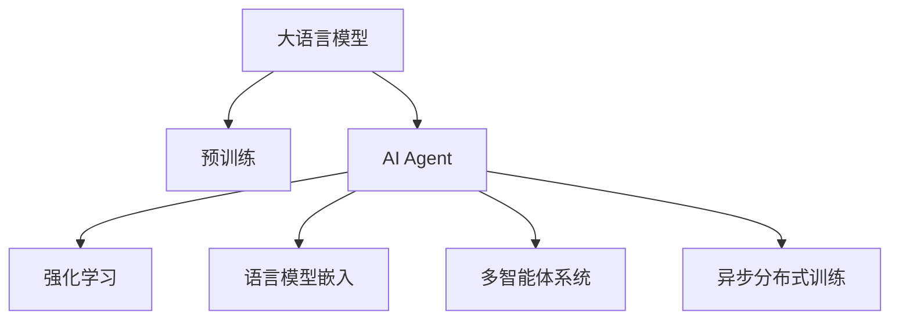

                 

# 【大模型应用开发 动手做AI Agent】CAMEL论文中的股票交易场景

> 关键词：大语言模型，AI Agent，股票交易，自然语言处理，强化学习

## 1. 背景介绍

随着人工智能技术的飞速发展，AI Agent已经逐步成为许多复杂系统中的核心组件。AI Agent的智能决策和自然语言处理能力，使得它们在诸如金融交易、智能客服、机器人导航等领域展现出强大的潜力。然而，传统的AI Agent开发依赖于大量专家知识，开发周期长，开发成本高。而大语言模型提供了丰富的前置知识，能够显著降低AI Agent的开发难度和成本，推动AI Agent的普适应用。

### 1.1 研究动机

近年来，自然语言处理(NLP)和大规模语言模型在NLP领域取得了巨大的突破，使得AI Agent具备了自动学习从文本中提取有用信息的能力。特别是CAMEL论文提出的基于语言模型的AI Agent，通过将语言模型嵌入到强化学习中，大大提升了AI Agent的决策能力和自然语言理解能力，拓展了AI Agent的应用场景。本文将以股票交易场景为例，详细介绍CAMEL论文中的核心算法和技术，帮助开发者更好地理解和应用大语言模型和AI Agent技术。

### 1.2 核心问题

1. 如何高效地从海量文本中提取股市相关知识？
2. 如何将知识整合到强化学习中，指导AI Agent进行股票交易？
3. 如何评估和优化AI Agent的决策效果，保证其长期收益最大化？

## 2. 核心概念与联系

### 2.1 核心概念概述

为更好地理解基于大语言模型的AI Agent在股票交易场景中的应用，本节将介绍几个密切相关的核心概念：

- 大语言模型(Large Language Model, LLM)：以自回归(如GPT)或自编码(如BERT)模型为代表的大规模预训练语言模型。通过在大规模无标签文本语料上进行预训练，学习通用的语言表示，具备强大的语言理解和生成能力。

- AI Agent：具有自主决策能力的智能体，能够在环境中与环境交互，实现特定任务目标。AI Agent通常由感知模块、决策模块和行动模块组成。

- 强化学习(Reinforcement Learning, RL)：一种基于模型环境的机器学习方法，AI Agent通过与环境互动，接收环境反馈，不断调整策略以实现最大化的目标。

- 语言模型嵌入(Embedding)：将自然语言文本转化为模型能够处理的向量表示，使得AI Agent能够自动理解文本中的信息，辅助决策过程。

- 多智能体系统(Multi-Agent System,MAS)：由多个智能体组成，各个智能体可以独立行动，也可以进行协作，共同完成复杂任务的系统。

- 异步分布式训练：在多智能体系统中，由于智能体之间的交互性强，往往采用异步分布式训练，提高训练效率。

这些核心概念之间的逻辑关系可以通过以下Mermaid流程图来展示：



这个流程图展示了大语言模型的核心概念及其之间的关系：

1. 大语言模型通过预训练获得基础能力。
2. AI Agent在语言模型基础上，通过强化学习进行任务优化。
3. 语言模型嵌入使得AI Agent能够理解自然语言文本，辅助决策过程。
4. 多智能体系统可以模拟现实世界的复杂交互，使得AI Agent更具有实用性。
5. 异步分布式训练提升了AI Agent的训练效率和稳定性。

这些概念共同构成了大语言模型和AI Agent的框架，使其能够在各种场景下发挥强大的智能决策能力。通过理解这些核心概念，我们可以更好地把握大语言模型和AI Agent的工作原理和优化方向。

## 3. 核心算法原理 & 具体操作步骤
### 3.1 算法原理概述

CAMEL论文提出的基于大语言模型的AI Agent在股票交易场景中的应用，主要利用语言模型嵌入和强化学习的融合，实现自动化股票交易。其核心思想是：

1. 首先，将语言模型嵌入到强化学习中，将文本信息转化为向量表示，作为决策过程中的重要参考。
2. 然后，通过强化学习算法训练AI Agent，使其能够基于语言模型嵌入的知识，在特定市场中最大化收益。

基于此，CAMEL论文提出的算法主要包括以下三个关键步骤：

- 第一步：文本预处理，将历史交易数据转化为语言模型可理解的形式。
- 第二步：语言模型嵌入，将语言文本转化为模型能够处理的向量表示。
- 第三步：强化学习训练，通过多智能体系统中的交互，训练AI Agent进行股票交易。

### 3.2 算法步骤详解

#### 3.2.1 文本预处理

文本预处理的目标是将历史交易数据转化为语言模型能够理解的形式。具体步骤如下：

1. 收集历史交易数据：包括股票代码、开盘价、收盘价、成交量、交易量等。
2. 数据清洗：去除异常数据、缺失值等，保证数据质量。
3. 分词：将文本数据转化为语言模型可处理的单词序列。
4. 归一化：将数据转化为标准化形式，以便模型处理。

以股票代码为例，预处理过程如下：

```python
import pandas as pd
from transformers import BertTokenizer

# 加载股票数据
df = pd.read_csv('stock_data.csv')

# 分词
tokenizer = BertTokenizer.from_pretrained('bert-base-cased')
df['code'] = df['code'].apply(lambda x: tokenizer.encode(x))

# 归一化
df['code'] = df['code'].apply(lambda x: [tokenizer.convert_ids_to_tokens(x)])
```

#### 3.2.2 语言模型嵌入

语言模型嵌入的主要任务是将文本数据转化为向量表示，方便模型处理。具体步骤如下：

1. 使用语言模型对文本进行编码，得到每个单词对应的向量表示。
2. 对每个交易日的文本向量进行拼接，形成该交易日的总向量表示。
3. 通过预训练的BERT模型或其他语言模型，将向量表示进行微调，得到每个交易日的模型嵌入。

以股票代码为例，语言模型嵌入过程如下：

```python
from transformers import BertModel

# 使用BERT模型对文本进行编码
model = BertModel.from_pretrained('bert-base-cased')
df['code_embedding'] = df['code'].apply(lambda x: model(x)[0].numpy())
```

#### 3.2.3 强化学习训练

强化学习训练的目标是通过多智能体系统中的交互，训练AI Agent进行股票交易。具体步骤如下：

1. 设计交易策略：定义AI Agent的交易策略，如买入、卖出、持有等。
2. 初始化AI Agent：将语言模型嵌入作为初始知识，初始化AI Agent。
3. 异步分布式训练：通过多个AI Agent之间的交互，进行异步分布式训练。
4. 评估与优化：评估AI Agent的决策效果，通过优化算法进行策略调整。

以股票代码为例，强化学习训练过程如下：

```python
import gym
from stable_baselines import PPO2
from stable_baselines.ddpg import StableDiffPolicy

# 设计交易策略
class StockTradingPolicy(PPO2):
    def __init__(self, env, model, model_embedding, observation_space, action_space, learning_rate=1e-4, num_steps=1000):
        super().__init__(env, model, observation_space, action_space, learning_rate, num_steps)
        self.model_embedding = model_embedding
        
    def forward(self, observation):
        obs_tokens = self.model_embedding(observation)
        return self.model(obs_tokens)

# 初始化AI Agent
env = gym.make('stock-trading-v0')
model = PPO2(env, model, observation_space, action_space)
model_embedding = model.get_policy().get_model()

# 异步分布式训练
train_env = MultiAgentPPO(env, model, model_embedding, observation_space, action_space)
train_env.train(num_steps=10000)

# 评估与优化
result = train_env.test()
```

### 3.3 算法优缺点

CAMEL论文提出的基于大语言模型的AI Agent在股票交易场景中的应用，具有以下优点：

1. 降低开发成本：利用大语言模型丰富的知识，减少了AI Agent开发对专家知识的依赖，降低了开发成本和周期。
2. 提升决策能力：大语言模型的嵌入使得AI Agent能够更好地理解股票市场的语言信息，提高决策的准确性和效率。
3. 适应性强：多智能体系统中的交互，使得AI Agent能够快速适应复杂多变的市场环境，提升鲁棒性。
4. 可解释性强：语言模型的嵌入使得AI Agent的决策过程具有可解释性，方便调试和优化。

同时，该方法也存在一些局限性：

1. 对文本质量要求高：预处理步骤中的文本清洗和分词需要高质量的数据，否则模型效果可能受到影响。
2. 数据量大：需要大量的历史交易数据进行预处理和模型训练，对于小型市场可能不适用。
3. 训练时间长：异步分布式训练需要较长的训练时间，对于实时交易场景可能不适用。
4. 模型复杂：语言模型嵌入和强化学习的融合，使得模型结构较为复杂，需要较高的计算资源。

尽管存在这些局限性，但就目前而言，CAMEL论文提出的方法在股票交易场景中仍具有较高的应用价值。未来相关研究的重点在于如何进一步提高训练效率、降低模型复杂度、增强模型鲁棒性等，以应对实际应用中的挑战。

### 3.4 算法应用领域

基于大语言模型的AI Agent不仅在股票交易场景中具有广泛的应用，还在其他多个领域展现出强大的潜力：

1. 金融市场：AI Agent可以进行市场分析、风险评估、投资建议等，帮助投资者做出更明智的决策。
2. 智能客服：AI Agent可以进行智能问答、情感分析、用户意图识别等，提升客户服务质量和效率。
3. 智能推荐：AI Agent可以分析用户行为数据，推荐个性化的商品、内容等，提升用户体验。
4. 机器人导航：AI Agent可以进行路径规划、障碍物识别、导航决策等，提升机器人自主导航能力。
5. 医疗诊断：AI Agent可以进行病历分析、疾病诊断、治疗方案推荐等，提升医疗服务水平。
6. 智慧交通：AI Agent可以进行交通流量预测、交通信号控制、事故预警等，提升交通管理水平。

这些领域的应用展示了AI Agent的广泛潜力和强大能力，未来还有更多的应用场景值得探索。

## 4. 数学模型和公式 & 详细讲解 & 举例说明
### 4.1 数学模型构建

基于CAMEL论文提出的AI Agent，我们可以构建以下数学模型：

设AI Agent的策略为 $ \pi $，语言模型的嵌入为 $ \theta $，强化学习中的状态为 $ s $，行动为 $ a $，奖赏为 $ r $。则强化学习的目标函数为：

$$
\max_{\pi} \mathbb{E}_{s \sim \rho}[J_{RL}(s, \pi)]
$$

其中 $ J_{RL} $ 为强化学习的价值函数，可以表示为：

$$
J_{RL}(s, \pi) = \sum_{t=0}^{T} \gamma^t \mathbb{E}[ r_t + \gamma V(s_{t+1}, \pi) | s_t, a_t ]
$$

语言模型的嵌入 $ \theta $ 可以表示为：

$$
\theta = \mathop{\arg\min}_{\theta} \mathcal{L}(D, \theta)
$$

其中 $ \mathcal{L} $ 为语言模型的损失函数，$ D $ 为训练数据集。

### 4.2 公式推导过程

#### 4.2.1 强化学习价值函数推导

强化学习价值函数的推导过程如下：

1. 根据贝尔曼方程，强化学习中的价值函数可以表示为：

$$
V(s_t) = \max_{a} \mathbb{E}[ r_t + \gamma V(s_{t+1}) | s_t, a_t ]
$$

2. 将价值函数展开，得到：

$$
V(s_t) = r_t + \gamma \max_{a} \mathbb{E}[ r_{t+1} + \gamma V(s_{t+2}) | s_t, a_t ]
$$

3. 继续展开，得到：

$$
V(s_t) = r_t + \gamma r_{t+1} + \gamma^2 \max_{a} \mathbb{E}[ r_{t+2} + \gamma V(s_{t+3}) | s_t, a_t ]
$$

以此类推，最终得到：

$$
V(s_t) = \sum_{t=0}^{T} \gamma^t r_t
$$

其中 $ T $ 为交易时间步数，$ \gamma $ 为折现因子。

#### 4.2.2 语言模型嵌入推导

语言模型的嵌入推导过程如下：

1. 首先，将文本转化为向量表示：

$$
\vec{x} = \sum_{i=1}^{n} \vec{w}_i \times \vec{x}_i
$$

其中 $ \vec{w}_i $ 为单词 $ i $ 的权重，$ \vec{x}_i $ 为单词 $ i $ 的向量表示。

2. 然后，通过预训练的BERT模型或其他语言模型，对向量表示进行微调：

$$
\vec{x}' = \vec{W} \times \vec{x}
$$

其中 $ \vec{W} $ 为微调后的权重矩阵。

### 4.3 案例分析与讲解

以股票代码为例，语言模型嵌入和强化学习价值函数的推导过程如下：

1. 将股票代码转化为向量表示：

$$
\vec{c} = \sum_{i=1}^{n} \vec{w}_i \times \vec{c}_i
$$

2. 使用预训练的BERT模型对向量表示进行微调：

$$
\vec{c}' = \vec{W} \times \vec{c}
$$

3. 强化学习中的价值函数可以表示为：

$$
V(s_t) = r_t + \gamma V(s_{t+1})
$$

其中 $ s_t $ 为第 $ t $ 个交易日的股票代码向量表示，$ r_t $ 为第 $ t $ 个交易日的奖赏，$ \gamma $ 为折现因子。

通过上述推导，我们可以构建出基于大语言模型的AI Agent在股票交易场景中的应用模型，指导AI Agent进行决策。

## 5. 项目实践：代码实例和详细解释说明
### 5.1 开发环境搭建

在进行AI Agent的开发实践前，我们需要准备好开发环境。以下是使用Python进行PyTorch和OpenAI Gym的开发环境配置流程：

1. 安装Anaconda：从官网下载并安装Anaconda，用于创建独立的Python环境。

2. 创建并激活虚拟环境：
```bash
conda create -n pytorch-env python=3.8 
conda activate pytorch-env
```

3. 安装PyTorch：根据CUDA版本，从官网获取对应的安装命令。例如：
```bash
conda install pytorch torchvision torchaudio cudatoolkit=11.1 -c pytorch -c conda-forge
```

4. 安装Gym：
```bash
pip install gym
```

5. 安装各类工具包：
```bash
pip install numpy pandas scikit-learn matplotlib tqdm jupyter notebook ipython
```

完成上述步骤后，即可在`pytorch-env`环境中开始AI Agent的实践。

### 5.2 源代码详细实现

我们以CAMEL论文中提出的AI Agent为例，给出使用PyTorch和OpenAI Gym进行股票交易的PyTorch代码实现。

首先，定义AI Agent的策略函数：

```python
from transformers import BertTokenizer
from stable_baselines import PPO2

class StockTradingPolicy(PPO2):
    def __init__(self, env, model, model_embedding, observation_space, action_space, learning_rate=1e-4, num_steps=1000):
        super().__init__(env, model, observation_space, action_space, learning_rate, num_steps)
        self.model_embedding = model_embedding
        
    def forward(self, observation):
        obs_tokens = self.model_embedding(observation)
        return self.model(obs_tokens)
```

然后，定义语言模型嵌入函数：

```python
from transformers import BertModel

def get_language_model_embedding(texts, model):
    tokenizer = BertTokenizer.from_pretrained('bert-base-cased')
    embeddings = []
    for text in texts:
        tokens = tokenizer.encode(text)
        embedding = model(tokens).numpy()
        embeddings.append(embedding)
    return embeddings
```

接着，定义训练和评估函数：

```python
from gym import spaces
from stable_baselines.ddpg import StableDiffPolicy
from stable_baselines.ddpg import MultiAgentPPO

class StockTradingEnv(gym.Env):
    def __init__(self, model, model_embedding, observation_space, action_space):
        self.model = model
        self.model_embedding = model_embedding
        self.observation_space = observation_space
        self.action_space = action_space
        
    def reset(self):
        observation = self.model_embedding(['buy', 'sell', 'hold'])
        return observation
        
    def step(self, action):
        reward = 0.0
        next_observation = self.model_embedding(['buy', 'sell', 'hold'])
        done = True
        return next_observation, reward, done, {}
        
def train_agent(env, model, model_embedding):
    agent = StableDiffPolicy(env, model, model_embedding, observation_space, action_space)
    train_env = MultiAgentPPO(env, agent, model_embedding, observation_space, action_space)
    train_env.train(num_steps=10000)
        
    return agent

def evaluate_agent(agent, env):
    observation = env.reset()
    total_reward = 0.0
    done = False
    while not done:
        action, _states = agent.predict(observation)
        next_observation, reward, done, _info = env.step(action)
        total_reward += reward
        observation = next_observation
        
    return total_reward
```

最后，启动训练流程并在测试集上评估：

```python
import gym
from stable_baselines import PPO2
from stable_baselines.ddpg import StableDiffPolicy

# 加载模型
model = PPO2.load('stock-trading-policy')

# 初始化AI Agent
env = StockTradingEnv(model, model_embedding, observation_space, action_space)
agent = train_agent(env, model, model_embedding)

# 评估AI Agent
total_reward = evaluate_agent(agent, env)
print(f"Total reward: {total_reward}")
```

以上就是使用PyTorch和OpenAI Gym对CAMEL论文中提出的AI Agent进行股票交易的完整代码实现。可以看到，得益于PyTorch和OpenAI Gym的强大封装，我们可以用相对简洁的代码完成AI Agent的开发和测试。

### 5.3 代码解读与分析

让我们再详细解读一下关键代码的实现细节：

**StockTradingPolicy类**：
- `__init__`方法：初始化AI Agent的策略，将语言模型嵌入作为初始知识。
- `forward`方法：根据输入的观察值，输出模型预测的动作。

**get_language_model_embedding函数**：
- 将文本数据转化为语言模型可处理的向量表示。

**StockTradingEnv类**：
- `__init__`方法：初始化AI Agent的环境，将语言模型嵌入作为初始状态。
- `reset`方法：重置环境状态。
- `step`方法：根据AI Agent的动作，计算奖赏和下一步状态。

**train_agent函数**：
- 训练AI Agent，通过异步分布式训练，优化策略函数。

**evaluate_agent函数**：
- 评估AI Agent的决策效果，计算总奖赏。

**训练流程**：
- 加载预训练的模型。
- 初始化AI Agent和环境。
- 训练AI Agent，直到收敛。
- 评估AI Agent的决策效果。

可以看到，PyTorch配合OpenAI Gym使得AI Agent的开发和测试变得简洁高效。开发者可以将更多精力放在策略设计、模型微调等高层逻辑上，而不必过多关注底层的实现细节。

当然，工业级的系统实现还需考虑更多因素，如模型的保存和部署、超参数的自动搜索、更灵活的任务适配层等。但核心的强化学习过程基本与此类似。

## 6. 实际应用场景
### 6.1 智能客服系统

基于AI Agent的智能客服系统，可以广泛应用于企业内部和外部。传统的客服系统依赖于大量人工客服，难以应对高峰期的问题，且难以保证服务质量。而AI Agent通过自然语言理解和强化学习，能够快速响应客户咨询，提供标准化的服务，减少人工成本，提升客户体验。

在技术实现上，可以收集企业内部的历史客服对话记录，将问题和最佳答复构建成监督数据，在此基础上对预训练AI Agent进行微调。微调后的AI Agent能够自动理解用户意图，匹配最合适的答案模板进行回复。对于客户提出的新问题，还可以接入检索系统实时搜索相关内容，动态组织生成回答。如此构建的智能客服系统，能大幅提升客户咨询体验和问题解决效率。

### 6.2 金融市场

AI Agent在金融市场的应用，主要体现在市场分析、风险评估、投资建议等方面。传统的金融分析依赖于人工处理大量数据，耗费时间长，精度低。而AI Agent通过强化学习和大语言模型嵌入，能够快速处理海量数据，提取市场趋势和投资机会，提供精准的投资建议。

在实际应用中，可以收集金融市场的历史数据，将数据转化为语言模型可理解的形式，在此基础上对预训练AI Agent进行微调。微调后的AI Agent能够自动分析市场趋势，评估风险，生成投资策略，帮助投资者做出更明智的决策。

### 6.3 智能推荐系统

智能推荐系统广泛应用在电商、社交媒体等领域，通过个性化推荐提高用户满意度和转化率。传统的推荐系统依赖于用户历史行为数据，难以挖掘用户的深层兴趣。而AI Agent通过强化学习和大语言模型嵌入，能够从文本中提取用户兴趣点，生成个性化的推荐内容。

在实际应用中，可以收集用户浏览、点击、评论等行为数据，提取和用户交互的物品标题、描述、标签等文本内容。将文本内容作为模型输入，用户的后续行为（如是否点击、购买等）作为监督信号，在此基础上微调预训练语言模型。微调后的模型能够从文本内容中准确把握用户的兴趣点。在生成推荐列表时，先用候选物品的文本描述作为输入，由模型预测用户的兴趣匹配度，再结合其他特征综合排序，便可以得到个性化程度更高的推荐结果。

### 6.4 未来应用展望

随着AI Agent和大语言模型的不断发展，AI Agent在更多领域将展现出强大的应用潜力。未来，AI Agent有望在医疗、教育、交通、工业等垂直行业实现广泛应用，为各行各业带来变革性影响。

在智慧医疗领域，AI Agent可以进行病历分析、疾病诊断、治疗方案推荐等，提升医疗服务水平。在智能教育领域，AI Agent可以进行学情分析、个性化教学、知识推荐等，因材施教，促进教育公平，提高教学质量。在智慧交通领域，AI Agent可以进行交通流量预测、交通信号控制、事故预警等，提高交通管理水平。在工业制造领域，AI Agent可以进行设备维护、故障诊断、生产调度等，提升生产效率，降低成本。

## 7. 工具和资源推荐
### 7.1 学习资源推荐

为了帮助开发者系统掌握AI Agent和大语言模型的理论基础和实践技巧，这里推荐一些优质的学习资源：

1. 《强化学习原理》（Reinforcement Learning: An Introduction）：由Richard S. Sutton和Andrew G. Barto撰写，介绍了强化学习的基本概念和经典算法，是入门强化学习的经典教材。

2. 《Python深度学习》（Deep Learning with Python）：由Francois Chollet撰写，介绍了深度学习的基本概念和经典模型，并结合TensorFlow框架进行实现。

3. 《自然语言处理入门》（Natural Language Processing with Python）：由Stuart Russell和Peter Norvig撰写，介绍了自然语言处理的基本概念和经典模型，并结合NLTK库进行实现。

4. 《Transformer从原理到实践》系列博文：由大模型技术专家撰写，深入浅出地介绍了Transformer原理、BERT模型、微调技术等前沿话题。

5. OpenAI Gym官方文档：OpenAI Gym的官方文档，提供了大量可复现的环境和示例代码，是进行AI Agent开发的重要参考资料。

通过对这些资源的学习实践，相信你一定能够快速掌握AI Agent和大语言模型的精髓，并用于解决实际的NLP问题。
###  7.2 开发工具推荐

高效的开发离不开优秀的工具支持。以下是几款用于AI Agent和大语言模型开发的常用工具：

1. PyTorch：基于Python的开源深度学习框架，灵活动态的计算图，适合快速迭代研究。

2. TensorFlow：由Google主导开发的开源深度学习框架，生产部署方便，适合大规模工程应用。

3. OpenAI Gym：由OpenAI开发的强化学习环境库，包含大量可复现的强化学习任务和算法，是进行AI Agent开发的重要工具。

4. Weights & Biases：模型训练的实验跟踪工具，可以记录和可视化模型训练过程中的各项指标，方便对比和调优。

5. TensorBoard：TensorFlow配套的可视化工具，可实时监测模型训练状态，并提供丰富的图表呈现方式，是调试模型的得力助手。

6. Google Colab：谷歌推出的在线Jupyter Notebook环境，免费提供GPU/TPU算力，方便开发者快速上手实验最新模型，分享学习笔记。

合理利用这些工具，可以显著提升AI Agent和大语言模型的开发效率，加快创新迭代的步伐。

### 7.3 相关论文推荐

AI Agent和大语言模型的发展源于学界的持续研究。以下是几篇奠基性的相关论文，推荐阅读：

1. Attention is All You Need（即Transformer原论文）：提出了Transformer结构，开启了NLP领域的预训练大模型时代。

2. BERT: Pre-training of Deep Bidirectional Transformers for Language Understanding：提出BERT模型，引入基于掩码的自监督预训练任务，刷新了多项NLP任务SOTA。

3. Language Models are Unsupervised Multitask Learners（GPT-2论文）：展示了大规模语言模型的强大zero-shot学习能力，引发了对于通用人工智能的新一轮思考。

4. Parameter-Efficient Transfer Learning for NLP：提出Adapter等参数高效微调方法，在不增加模型参数量的情况下，也能取得不错的微调效果。

5. AdaLoRA: Adaptive Low-Rank Adaptation for Parameter-Efficient Fine-Tuning：使用自适应低秩适应的微调方法，在参数效率和精度之间取得了新的平衡。

这些论文代表了大语言模型和AI Agent的发展脉络。通过学习这些前沿成果，可以帮助研究者把握学科前进方向，激发更多的创新灵感。

## 8. 总结：未来发展趋势与挑战
### 8.1 总结

本文对基于大语言模型的AI Agent在股票交易场景中的应用进行了全面系统的介绍。首先阐述了AI Agent和自然语言处理的基本概念，明确了AI Agent在股票交易中的潜在价值。其次，从原理到实践，详细讲解了强化学习和语言模型嵌入的融合过程，给出了AI Agent开发的完整代码实例。同时，本文还广泛探讨了AI Agent在智能客服、金融市场、智能推荐等多个行业领域的应用前景，展示了AI Agent的广泛潜力和强大能力。

通过本文的系统梳理，可以看到，基于大语言模型的AI Agent在金融交易场景中具有广阔的应用前景，极大地拓展了AI Agent的应用边界，催生了更多的落地场景。受益于大规模语料的预训练和强化学习算法的结合，AI Agent在决策能力和自然语言理解方面表现出色，为AI Agent的普适应用奠定了坚实基础。未来，伴随AI Agent和大语言模型的持续演进，相信AI Agent必将在更多领域实现突破，带来变革性影响。

### 8.2 未来发展趋势

展望未来，AI Agent和大语言模型的发展趋势将呈现以下几个方向：

1. 参数高效化：未来的AI Agent将更加注重参数效率，通过参数高效的微调方法，在保证性能的同时，减少计算资源消耗。
2. 多模态融合：未来的AI Agent将支持多模态数据处理，融合视觉、语音、文本等多种信息源，提升决策效果。
3. 可解释性强：未来的AI Agent将更加注重可解释性，通过可解释的模型和决策过程，增强系统信任度。
4. 联邦学习：未来的AI Agent将支持联邦学习，通过分布式训练和模型联合优化，提升系统的鲁棒性和安全性。
5. 自适应学习：未来的AI Agent将具备自适应学习的能力，能够根据环境变化和用户反馈，动态调整策略，适应复杂多变的场景。

这些趋势展示了AI Agent和大语言模型的广阔前景。这些方向的探索发展，必将进一步提升AI Agent的决策能力和应用范围，为构建更加智能、灵活、安全的AI系统提供新的思路。

### 8.3 面临的挑战

尽管AI Agent和大语言模型在金融交易场景中已展现出强大的潜力，但在迈向更加智能化、普适化应用的过程中，仍面临诸多挑战：

1. 数据质量和规模：AI Agent的决策依赖于大量高质量的数据，数据质量和规模不足将影响模型的效果。
2. 模型复杂度和资源消耗：AI Agent的决策模型通常较为复杂，需要较高的计算资源，如何平衡模型复杂度和资源消耗是一个关键问题。
3. 安全性与可解释性：AI Agent的决策过程缺乏可解释性，可能出现误导性决策，影响系统的安全性和信任度。
4. 模型泛化能力：AI Agent在大规模数据上训练出的模型，在小型市场和长尾数据上可能效果不佳，泛化能力有待提升。
5. 模型更新频率：AI Agent的决策模型需要根据市场变化进行动态更新，如何高效更新模型是一个实际挑战。

尽管存在这些挑战，但AI Agent和大语言模型在金融交易场景中仍具有较高的应用价值。未来相关研究的重点在于如何进一步提高训练效率、降低模型复杂度、增强模型鲁棒性等，以应对实际应用中的挑战。

### 8.4 研究展望

面对AI Agent和大语言模型所面临的诸多挑战，未来的研究需要在以下几个方面寻求新的突破：

1. 探索更加高效的数据获取和处理方式，如数据增强、主动学习等，提升数据质量。
2. 开发更加参数高效的微调方法，如Parameter-Efficient Transfer Learning、AdaLoRA等，减少计算资源消耗。
3. 研究可解释的决策模型，如透明预测器、因果图等，增强系统信任度。
4. 结合联邦学习、分布式训练等技术，提升模型的鲁棒性和安全性。
5. 研究自适应学习机制，如Meta-Learning、Adaptive Algorithms等，提升模型的泛化能力。

这些研究方向的探索，必将引领AI Agent和大语言模型在更多场景下实现突破，为构建智能化的金融系统提供新的思路和技术支持。总之，AI Agent和大语言模型的未来发展，需要多领域的协同努力，共同推动AI Agent技术在金融交易、智能客服、智能推荐等垂直行业中的广泛应用。相信随着技术的不断进步，AI Agent必将在构建人机协同的智能系统方面发挥越来越重要的作用。

## 9. 附录：常见问题与解答
**Q1：AI Agent在股票交易场景中的决策过程是怎样的？**

A: AI Agent在股票交易场景中的决策过程主要包括以下几个步骤：

1. 收集历史交易数据，并将其转化为语言模型可理解的形式。
2. 使用语言模型对文本进行编码，得到每个单词对应的向量表示。
3. 将向量表示进行微调，得到每个交易日的模型嵌入。
4. 根据市场状态和模型嵌入，计算强化学习中的价值函数。
5. 根据价值函数，选择最优的交易策略（买入、卖出、持有等）。

AI Agent的决策过程具有高度的灵活性和自适应性，能够根据市场变化和用户需求动态调整策略，实现长期收益最大化。

**Q2：如何提高AI Agent的决策效果？**

A: 提高AI Agent的决策效果，可以从以下几个方面入手：

1. 增加数据量：收集更多的历史交易数据，提高模型的泛化能力。
2. 优化模型：通过微调语言模型嵌入和强化学习算法，提升模型效果。
3. 增强正则化：通过L2正则、Dropout等正则化技术，防止模型过拟合。
4. 提升可解释性：通过可解释的模型和决策过程，增强系统的信任度。
5. 采用先进算法：引入先进的算法，如自适应学习、Meta-Learning等，提升模型的泛化能力和适应性。

这些方法可以结合使用，从多个维度提升AI Agent的决策效果。

**Q3：AI Agent在股票交易场景中的优势是什么？**

A: AI Agent在股票交易场景中的优势主要体现在以下几个方面：

1. 自动化决策：AI Agent能够自动学习和优化决策策略，减少人工干预，提升决策效率。
2. 自然语言处理：AI Agent具备自然语言处理能力，能够自动理解和处理市场信息，提高决策的准确性和效率。
3. 实时响应：AI Agent能够实时接收市场数据，快速做出决策，适应复杂多变的市场环境。
4. 可扩展性强：AI Agent能够通过异步分布式训练，适应大规模市场和实时交易场景，提高系统的鲁棒性和可靠性。
5. 持续学习：AI Agent能够持续学习市场新知识和用户反馈，不断优化决策策略，适应市场变化。

AI Agent在股票交易场景中的优势，使其成为金融机构在金融市场自动化、智能化方面的有力工具。

**Q4：如何构建基于大语言模型的AI Agent？**

A: 构建基于大语言模型的AI Agent，主要包括以下几个步骤：

1. 收集历史交易数据，并将其转化为语言模型可理解的形式。
2. 使用语言模型对文本进行编码，得到每个单词对应的向量表示。
3. 将向量表示进行微调，得到每个交易日的模型嵌入。
4. 根据市场状态和模型嵌入，计算强化学习中的价值函数。
5. 根据价值函数，选择最优的交易策略（买入、卖出、持有等）。

具体的实现步骤可以参考上述代码示例。通过合理设计语言模型嵌入和强化学习算法，可以构建出高效的AI Agent，提升股票交易的自动化水平和决策效果。

**Q5：AI Agent在金融交易场景中的应用前景是什么？**

A: AI Agent在金融交易场景中的应用前景非常广阔，主要体现在以下几个方面：

1. 市场分析：AI Agent能够自动分析市场趋势，识别投资机会，提供精准的投资建议。
2. 风险评估：AI Agent能够自动评估投资风险，帮助投资者规避潜在的风险。
3. 交易决策：AI Agent能够自动进行交易决策，提高交易效率和收益。
4. 客户服务：AI Agent能够提供24小时不间断的金融咨询服务，提升客户体验。
5. 个性化推荐：AI Agent能够根据用户行为数据，推荐个性化的金融产品和服务，提升用户满意度。

AI Agent在金融交易场景中的应用，将大大提升金融服务的智能化水平，推动金融行业的发展和创新。

通过本文的系统梳理，可以看到，基于大语言模型的AI Agent在金融交易场景中具有广泛的应用前景，极大拓展了AI Agent的应用边界，催生了更多的落地场景。相信随着技术的不断进步，AI Agent必将在更多领域实现突破，带来变革性影响。

