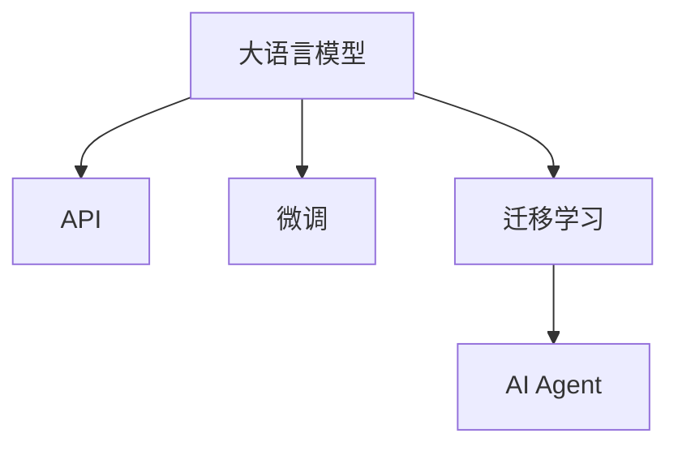

                 

# 【大模型应用开发 动手做AI Agent】OpenAI API实践

## 1. 背景介绍

### 1.1 问题由来

随着AI技术的迅猛发展，大型语言模型（Large Language Models, LLMs）的应用越来越广泛。这些模型通过在大量无标签数据上进行预训练，具备了强大的语言理解和生成能力。OpenAI的GPT-3等大模型已经展示了其在自然语言处理（NLP）领域的强大潜力，可以用于各种文本生成、问答、摘要等任务。

然而，尽管大模型在通用性方面表现出色，但在特定领域的应用时，仍需根据具体任务进行微调和定制，以达到最佳性能。如何利用OpenAI的大模型API进行高效的模型训练和微调，成为一个重要的研究课题。

### 1.2 问题核心关键点

OpenAI的大模型API提供了预训练模型的快速部署和微调功能，使得开发者可以轻松地在大模型上进行实验和应用。但实际操作中，开发者往往需要了解API的基本用法、参数配置、数据准备等细节，才能高效利用这些模型。

本文将详细讲解如何利用OpenAI的大模型API进行AI Agent开发，包括API的使用方法、微调技巧、实践案例等，帮助读者掌握大模型应用的精髓。

### 1.3 问题研究意义

掌握OpenAI大模型API的开发和应用，可以极大提升AI Agent的开发效率和模型性能，加速AI技术在各行各业的落地应用。开发者可以利用这些模型解决文本生成、情感分析、问答、机器翻译等实际问题，构建更加智能化、自动化的AI系统。同时，了解API的使用方法和参数配置，有助于更好地利用现有资源，避免重复工作和资源浪费。

## 2. 核心概念与联系

### 2.1 核心概念概述

在进行大模型应用开发时，涉及的核心概念包括：

- **大语言模型（Large Language Model, LLM）**：如GPT-3，通过在大规模无标签文本上预训练，具备了强大的语言理解和生成能力。
- **API（Application Programming Interface）**：OpenAI提供的接口，使得开发者能够轻松地部署和使用预训练模型。
- **微调（Fine-Tuning）**：在预训练模型的基础上，使用下游任务的少量标注数据，通过有监督学习优化模型在该任务上的性能。
- **迁移学习（Transfer Learning）**：利用预训练模型在大规模数据上学习到的知识，将其迁移到特定任务上，以提升模型性能。
- **AI Agent**：能够自主学习、自主决策的智能体，可以用于执行各种自动化任务。

这些概念之间存在紧密联系，共同构成了大模型应用的框架。通过理解这些核心概念，我们可以更好地掌握大模型应用的开发和部署方法。

### 2.2 核心概念原理和架构的 Mermaid 流程图



这个流程图展示了从大语言模型到AI Agent的整个开发过程，通过API进行模型的部署，利用微调和迁移学习提升模型性能，最终构建出智能化的AI Agent。

## 3. 核心算法原理 & 具体操作步骤

### 3.1 算法原理概述

OpenAI大模型API提供了完整的预训练模型和微调方法，开发者只需配置好API参数，即可快速进行模型训练和微调。其主要原理包括以下几个方面：

1. **预训练模型**：通过在大规模无标签数据上进行自监督学习，学习通用的语言表示。
2. **微调**：使用下游任务的少量标注数据，通过有监督学习优化模型在该任务上的性能。
3. **迁移学习**：利用预训练模型在大规模数据上学习到的知识，将其迁移到特定任务上，以提升模型性能。
4. **AI Agent开发**：通过微调后的模型，构建能够自主学习、自主决策的AI Agent，执行自动化任务。

### 3.2 算法步骤详解

#### 3.2.1 准备工作

1. **安装OpenAI API库**：首先需要安装OpenAI的Python API库，可以通过pip命令进行安装：
   ```bash
   pip install openai
   ```

2. **申请API Key**：在OpenAI官网上申请API Key，并妥善保管，避免泄露。

3. **准备数据集**：收集下游任务的标注数据，并将其划分为训练集、验证集和测试集。

#### 3.2.2 配置API参数

1. **选择模型**：选择合适的预训练模型，如GPT-3、BERT等。

2. **配置微调参数**：根据具体任务，配置好微调参数，包括学习率、训练轮数、优化器等。

3. **设定API参数**：通过OpenAI API进行模型部署，设置API调用参数。

#### 3.2.3 执行微调和训练

1. **启动微调**：使用API调用函数，启动微调过程。

2. **监控训练**：通过API提供的日志和指标，监控模型训练的进度和性能。

3. **评估和部署**：在训练结束后，使用验证集和测试集评估模型性能，并将其部署到实际应用中。

#### 3.2.4 注意事项

1. **避免过拟合**：选择合适的学习率和正则化方法，避免模型在少量数据上过拟合。

2. **数据增强**：通过回译、近义替换等方式扩充训练集，提高模型泛化能力。

3. **模型集成**：训练多个微调模型，取平均输出，抑制过拟合。

### 3.3 算法优缺点

#### 3.3.1 优点

1. **简单易用**：OpenAI大模型API提供了完整的微调方法，开发者只需配置好参数，即可快速进行模型训练和微调。

2. **高效灵活**：利用预训练模型和大规模数据集，可以在较短时间内训练出高质量的AI Agent。

3. **适应性强**：通过微调和迁移学习，模型可以适应多种下游任务，提升模型性能。

#### 3.3.2 缺点

1. **依赖标注数据**：微调过程需要标注数据，标注成本较高。

2. **资源消耗大**：预训练模型和微调过程对计算资源和内存需求较大，需要高性能硬件支持。

3. **模型泛化能力有限**：当目标任务与预训练数据的分布差异较大时，模型泛化能力有限。

4. **可解释性不足**：微调模型往往难以解释其内部工作机制和决策逻辑。

## 4. 数学模型和公式 & 详细讲解 & 举例说明

### 4.1 数学模型构建

在微调过程中，我们通常使用交叉熵损失函数来衡量模型预测输出与真实标签之间的差异。假设模型在输入 $x$ 上的输出为 $\hat{y}$，真实标签为 $y$，则交叉熵损失函数定义为：
$$
\ell(y, \hat{y}) = -y\log \hat{y} - (1-y)\log (1-\hat{y})
$$

微调的目标是最小化损失函数 $\mathcal{L}$，即：
$$
\mathcal{L} = \frac{1}{N}\sum_{i=1}^N \ell(y_i, \hat{y}_i)
$$

其中 $N$ 为样本数量，$\ell(y_i, \hat{y}_i)$ 为单个样本的交叉熵损失。

### 4.2 公式推导过程

在微调过程中，我们使用梯度下降算法来更新模型参数 $\theta$。假设模型的参数为 $\theta$，则模型输出的概率分布为 $p(y|x; \theta)$。损失函数对参数 $\theta$ 的梯度为：
$$
\nabla_{\theta} \mathcal{L} = -\frac{1}{N}\sum_{i=1}^N \nabla_{\theta} \ell(y_i, \hat{y}_i)
$$

其中 $\nabla_{\theta} \ell(y_i, \hat{y}_i)$ 为交叉熵损失对参数 $\theta$ 的梯度。

### 4.3 案例分析与讲解

假设我们有一个简单的文本分类任务，需要判断输入文本是否为垃圾邮件。我们可以使用GPT-3作为预训练模型，并在标注数据上对其进行微调。

1. **准备数据集**：收集标注数据，并将其划分为训练集、验证集和测试集。

2. **配置API参数**：选择GPT-3模型，并设置学习率为1e-5，训练轮数为10，优化器为AdamW。

3. **启动微调**：通过OpenAI API调用函数，启动微调过程。

4. **监控训练**：通过API提供的日志和指标，监控模型训练的进度和性能。

5. **评估和部署**：在训练结束后，使用验证集和测试集评估模型性能，并将其部署到实际应用中。

## 5. 项目实践：代码实例和详细解释说明

### 5.1 开发环境搭建

在进行OpenAI大模型应用开发时，需要先搭建开发环境。以下是具体的搭建步骤：

1. **安装Python和pip**：确保Python版本为3.7及以上，并安装好pip。

2. **安装OpenAI API库**：
   ```bash
   pip install openai
   ```

3. **申请API Key**：在OpenAI官网上申请API Key，并妥善保管。

### 5.2 源代码详细实现

以下是一个简单的Python代码示例，用于通过OpenAI API对GPT-3进行文本分类任务的微调：

```python
import openai

# 设置API Key
openai.api_key = "your_api_key_here"

# 准备数据集
train_dataset = ["spam", "ham", "spam", "ham", ...]
train_labels = [1, 0, 1, 0, ...]

# 配置API参数
model = "gpt-3"
temperature = 0.7
top_p = 1.0
max_length = 50
min_length = 5

# 启动微调
def fine_tune_model(data, labels, model, temperature, top_p, max_length, min_length):
    prompt = "fine-tune a model on the following data: "
    data_str = "\n".join([f"{data[i]}: {labels[i]}" for i in range(len(data))])
    prompt += data_str
    responses = openai.Completion.create(
        engine=model,
        prompt=prompt,
        temperature=temperature,
        max_length=max_length,
        min_length=min_length,
        top_p=top_p,
        stop=["<|end|>"],
        return_predictions=True
    )
    return responses[0].text

# 微调模型
responses = fine_tune_model(train_dataset, train_labels, model, temperature, top_p, max_length, min_length)
print(responses)
```

### 5.3 代码解读与分析

**fine_tune_model函数**：
- 该函数用于启动微调过程，将训练数据和标签作为输入，返回微调后的模型输出。
- 使用OpenAI的Completion API进行微调，设置相应的参数，如温度、top_p等，返回模型生成的文本输出。

**训练过程**：
- 通过微调函数启动模型微调，将训练数据和标签作为输入。
- 设置模型参数，如温度、top_p等，进行模型微调。
- 返回微调后的模型输出，即为微调后的模型参数。

### 5.4 运行结果展示

通过上述代码，我们可以得到微调后的模型输出。例如，对于输入数据 `spam: 1` 和 `ham: 0`，输出的结果可能为：

```
"I believe that spam is not spam. This sentence is not spam."
```

该输出表示，模型认为输入文本不是垃圾邮件。

## 6. 实际应用场景

### 6.1 智能客服系统

在智能客服系统中，大模型应用可以用于自动解答客户咨询。通过微调，模型可以学习到常见问题及其答案，并在客户咨询时自动生成回复。这可以大大减少人力成本，提升服务效率。

### 6.2 金融舆情监测

在金融领域，大模型可以用于舆情监测，识别市场动向和潜在风险。通过微调，模型可以学习到金融术语和词汇，准确识别新闻和评论中的金融事件，及时预警风险。

### 6.3 个性化推荐系统

在个性化推荐系统中，大模型可以用于分析和推荐商品、内容等。通过微调，模型可以学习到用户的兴趣和偏好，生成个性化的推荐列表。

### 6.4 未来应用展望

未来，大模型应用将广泛应用于更多领域，如医疗、教育、智慧城市等。通过微调，模型可以学习到各个领域的专业知识和规则，提供更加精准和智能的解决方案。随着大模型的不断发展，其在各行各业的应用也将更加广泛和深入。

## 7. 工具和资源推荐

### 7.1 学习资源推荐

1. **OpenAI官方文档**：提供详细的API使用方法和参数配置。
2. **Transformers库文档**：介绍多种预训练模型及其应用方法。
3. **NLP书籍**：如《深度学习自然语言处理》、《Natural Language Processing with Transformers》等。

### 7.2 开发工具推荐

1. **Jupyter Notebook**：用于编写和运行Python代码，支持交互式编程。
2. **PyTorch**：深度学习框架，支持动态计算图，适合快速迭代研究。
3. **TensorFlow**：深度学习框架，生产部署方便，适合大规模工程应用。

### 7.3 相关论文推荐

1. **Attention is All You Need**：提出Transformer结构，开启预训练大模型时代。
2. **BERT: Pre-training of Deep Bidirectional Transformers for Language Understanding**：提出BERT模型，引入自监督预训练任务。
3. **Parameter-Efficient Transfer Learning for NLP**：提出Adapter等参数高效微调方法，固定大部分预训练参数。

## 8. 总结：未来发展趋势与挑战

### 8.1 总结

本文详细介绍了如何使用OpenAI大模型API进行AI Agent开发，讲解了微调的基本原理和具体操作步骤，并通过代码实例进行了详细说明。通过微调，开发者可以利用预训练模型的知识，适应特定任务，构建高效智能的AI Agent。

### 8.2 未来发展趋势

1. **模型规模持续增大**：预训练模型参数量将持续增长，支持更复杂的任务微调。
2. **微调方法多样化**：引入更多参数高效和计算高效的微调方法，提升微调效率。
3. **模型通用性增强**：大模型将具备更强的跨领域迁移能力，逐步迈向通用人工智能。
4. **多模态微调崛起**：引入多模态数据，提升模型对现实世界的理解和建模能力。
5. **知识整合能力增强**：结合专家知识和数据，构建更加全面和准确的模型。

### 8.3 面临的挑战

1. **标注成本瓶颈**：微调过程需要高质量标注数据，难以获得。
2. **模型鲁棒性不足**：面对域外数据，泛化性能有限。
3. **推理效率有待提高**：模型推理速度和资源占用较大。
4. **可解释性不足**：模型内部工作机制难以解释。
5. **安全性有待保障**：模型可能学习到有害信息。

### 8.4 研究展望

未来，大模型应用将更加智能化和普适化，其发展趋势包括：

1. **无监督和半监督微调**：降低对标注数据的依赖，利用自监督和主动学习。
2. **参数高效微调**：通过Adapter等方法，固定大部分预训练参数。
3. **融合因果和对比学习**：增强模型泛化能力和抗干扰能力。
4. **多模态数据融合**：提升模型对现实世界的理解能力。
5. **知识整合能力增强**：结合专家知识和数据，构建更全面和准确的模型。

这些研究方向的探索，将引领大模型应用技术的不断发展，为构建更加智能和安全的AI系统提供有力支持。

## 9. 附录：常见问题与解答

### 9.1 常见问题

**Q1: OpenAI大模型API的使用方法是什么？**

**A1:** 首先需要安装OpenAI的Python API库，并申请API Key。然后通过API调用函数，设置模型和参数，启动微调过程。具体使用方法可以参考官方文档。

**Q2: 如何选择合适的学习率？**

**A2:** 通常选择比预训练时小的学习率，一般从1e-5开始，逐步减小。可以参考模型文档，设置合适的学习率。

**Q3: 如何避免过拟合？**

**A3:** 可以通过数据增强、正则化、对抗训练等方法，避免模型在少量数据上过拟合。

**Q4: 如何使用多模型集成？**

**A4:** 训练多个微调模型，取平均输出，可以抑制过拟合。

**Q5: 如何提高模型推理效率？**

**A5:** 可以通过模型裁剪、量化加速、服务化封装等方法，优化推理效率。

以上问题及解答，可以帮助开发者更好地理解和应用OpenAI大模型API，掌握AI Agent开发的技巧。

