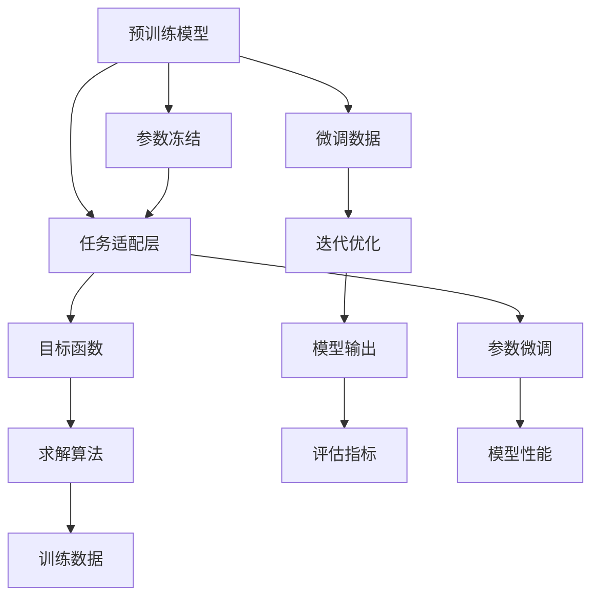

                 

# 【大模型应用开发 动手做AI Agent】Plan-and-Solve策略的提出

在人工智能领域，模型应用开发是一个日益受到关注的话题。近年来，随着大语言模型（LLM）的崛起，如何高效地将这些强大的模型应用于具体场景，成为了一个重要课题。本文将围绕大模型的应用开发，特别是Plan-and-Solve策略的提出，进行深入探讨。

## 1. 背景介绍

### 1.1 问题由来

在人工智能技术的发展过程中，模型应用开发始终是一个核心问题。特别是对于深度学习模型而言，从模型训练到实际应用的每一步都需要精心设计和优化，才能充分发挥模型的潜力。近年来，随着大语言模型的出现，如何在复杂场景中高效地应用这些模型，成为了研究者与工程师的共同挑战。

大语言模型如GPT、BERT等，通过在大规模无标签文本数据上进行预训练，获得了强大的语言理解和生成能力。然而，这些模型的通用性较强，未必能完全适配具体的下游任务，因此需要进行微调或定制化开发，以提升其在特定场景下的性能。

### 1.2 问题核心关键点

Plan-and-Solve策略的核心在于：

- **规划（Plan）**：基于当前问题构建目标函数，并选择合适的算法和数据集，以训练模型。
- **求解（Solve）**：通过迭代优化，不断调整模型参数，直至达到目标函数的最优解。

这一策略将大模型的通用性和任务定制性相结合，在提高应用效率的同时，也提升了模型的性能。

## 2. 核心概念与联系

### 2.1 核心概念概述

为了更好地理解Plan-and-Solve策略，我们首先介绍几个相关概念：

- **大语言模型（LLM）**：指在大规模无标签文本数据上进行预训练，获得强大语言表示能力的模型，如GPT、BERT等。
- **微调（Fine-Tuning）**：在预训练模型的基础上，使用下游任务的少量标注数据进行有监督学习，以优化模型在特定任务上的性能。
- **任务适配层（Task-Specific Head）**：根据具体任务，在预训练模型的顶层添加适配层，如分类器、解码器等，以实现任务特定功能的开发。
- **目标函数（Objective Function）**：在任务适配层上定义的损失函数，用于衡量模型预测输出与真实标签之间的差异。
- **求解算法（Solver）**：用于迭代优化目标函数，如梯度下降、Adam等。

这些概念共同构成了大语言模型应用开发的理论基础，是Plan-and-Solve策略得以实施的关键。

### 2.2 核心概念原理和架构的 Mermaid 流程图



这个流程图展示了从预训练模型到模型输出的整个过程。预训练模型通过微调和参数微调，适配具体任务的目标函数，并由求解算法迭代优化。模型输出的评估指标用于衡量模型的性能，并指导后续的优化。

## 3. 核心算法原理 & 具体操作步骤

### 3.1 算法原理概述

Plan-and-Solve策略的核心是构建目标函数，并选择合适的求解算法。具体来说，它包括以下几个步骤：

1. **问题建模**：将实际应用问题抽象为数学表达式，构建目标函数。
2. **数据集准备**：收集和预处理训练数据和微调数据，准备用于模型训练。
3. **模型构建**：在预训练模型的基础上，添加任务适配层，构建可用于特定任务求解的模型。
4. **求解算法选择**：选择合适的优化算法，如梯度下降、Adam等，进行模型参数的迭代优化。
5. **模型评估**：通过评估指标（如准确率、F1分数等）评估模型性能，指导后续的微调和优化。

### 3.2 算法步骤详解

以下是Plan-and-Solve策略的具体操作步骤：

1. **问题建模**：假设我们要解决的任务是情感分类。首先，将情感分类任务抽象为分类问题，构建目标函数。

   \[
   \min_{\theta} \frac{1}{N} \sum_{i=1}^N \ell(M_{\theta}(x_i), y_i)
   \]

   其中，\(M_{\theta}\) 表示模型，\(x_i\) 为输入文本，\(y_i\) 为标签（正面或负面情感），\(\ell\) 为损失函数（如交叉熵损失）。

2. **数据集准备**：收集情感分类任务的标注数据集，划分为训练集、验证集和测试集。预处理数据，包括文本清洗、分词、向量化等。

3. **模型构建**：在预训练模型BERT的顶部添加一个线性分类器，用于输出情感分类结果。

   \[
   \text{BERT} \rightarrow \text{线性分类器} \rightarrow \text{输出层}
   \]

4. **求解算法选择**：使用Adam优化算法进行模型参数的迭代优化。

   \[
   \theta \leftarrow \theta - \eta \nabla_{\theta}\mathcal{L}(\theta) - \eta\lambda\theta
   \]

   其中，\(\eta\) 为学习率，\(\lambda\) 为权重衰减系数。

5. **模型评估**：在验证集上评估模型性能，如使用准确率和F1分数，根据性能指标调整学习率和正则化强度，防止过拟合。

### 3.3 算法优缺点

Plan-and-Solve策略具有以下优点：

- **灵活性**：可以针对不同的任务灵活设计目标函数和适配层，快速适应特定场景。
- **高效性**：通过微调和参数微调，能够显著提升模型在特定任务上的性能。
- **可解释性**：目标函数和适配层的定义较为直观，有助于理解模型的工作原理。

同时，该策略也存在一些局限：

- **依赖标注数据**：微调和参数微调需要大量标注数据，对于标注成本较高的任务，可能不适用。
- **过拟合风险**：微调和参数微调容易过拟合，特别是在标注数据较少的情况下。
- **模型复杂性**：在构建适配层时，需要额外定义输出层和损失函数，增加了模型的复杂性。

### 3.4 算法应用领域

Plan-and-Solve策略可以广泛应用于各种自然语言处理（NLP）任务，例如：

- **情感分类**：通过微调BERT模型，使其适应情感分类任务，输出正面或负面情感分类结果。
- **命名实体识别**：在BERT模型的顶部添加实体识别器，识别文本中的命名实体。
- **机器翻译**：在BERT模型的顶部添加解码器，进行序列到序列的机器翻译。
- **问答系统**：使用BERT模型作为问答模型的特征提取器，通过微调适配层进行问题-答案匹配。
- **文本摘要**：在BERT模型的顶部添加摘要器，输出文本摘要。

这些任务均可以利用Plan-and-Solve策略进行高效开发。

## 4. 数学模型和公式 & 详细讲解 & 举例说明

### 4.1 数学模型构建

假设我们要解决的任务是文本分类，具体如下：

- **输入**：文本 \(x\)。
- **输出**：分类标签 \(y\)。

构建目标函数为：

\[
\min_{\theta} \frac{1}{N} \sum_{i=1}^N \ell(M_{\theta}(x_i), y_i)
\]

其中，\(M_{\theta}\) 为预训练模型BERT，\(\ell\) 为交叉熵损失函数。

### 4.2 公式推导过程

以BERT为例，假设BERT的输出层为 \[h_0, h_1, ..., h_{H}\]，其中 \(H\) 为隐层数。通过线性变换和softmax函数，可以得到分类器输出 \(p = \text{softmax}(Wp + b)\)。目标函数可以表示为：

\[
\ell(M_{\theta}(x), y) = -\sum_{i=1}^N y_i \log p_i
\]

其中，\(p_i\) 为模型对文本 \(x_i\) 输出为正类别的概率。

### 4.3 案例分析与讲解

以情感分类任务为例，假设我们收集了1000条标注数据，用于训练模型。使用Adam优化算法进行模型优化，学习率为0.001，迭代1000次。在验证集上评估模型性能，使用准确率和F1分数进行指标评估。通过调整学习率和正则化强度，可以避免过拟合，提升模型性能。

## 5. 项目实践：代码实例和详细解释说明

### 5.1 开发环境搭建

- **Python**：安装Python 3.8，使用虚拟环境。
- **PyTorch**：安装PyTorch 1.8.0，使用GPU加速。
- **BERT模型**：下载和使用BERT模型，使用huggingface库进行加载和微调。

### 5.2 源代码详细实现

以下是一个使用PyTorch进行BERT模型微调的示例代码：

```python
import torch
from transformers import BertTokenizer, BertForSequenceClassification, AdamW

# 初始化BERT模型和tokenizer
tokenizer = BertTokenizer.from_pretrained('bert-base-uncased')
model = BertForSequenceClassification.from_pretrained('bert-base-uncased', num_labels=2)

# 准备训练数据和微调数据
train_data = ['I love this movie!', 'This is a terrible movie.']
train_labels = [1, 0]

# 数据预处理
input_ids = tokenizer(train_data, return_tensors='pt', padding=True, truncation=True)['input_ids']
attention_masks = tokenizer(train_data, return_tensors='pt', padding=True, truncation=True)['attention_mask']
labels = torch.tensor(train_labels, dtype=torch.long)

# 定义优化器和训练参数
optimizer = AdamW(model.parameters(), lr=0.001)
epochs = 10

# 训练模型
for epoch in range(epochs):
    model.train()
    optimizer.zero_grad()
    outputs = model(input_ids, attention_masks=attention_masks, labels=labels)
    loss = outputs.loss
    loss.backward()
    optimizer.step()

# 在验证集上评估模型性能
model.eval()
validation_data = ['This movie is great!', 'I hate this movie.']
validation_labels = [1, 0]
validation_input_ids = tokenizer(validation_data, return_tensors='pt', padding=True, truncation=True)['input_ids']
validation_attention_masks = tokenizer(validation_data, return_tensors='pt', padding=True, truncation=True)['attention_mask']
with torch.no_grad():
    validation_outputs = model(validation_input_ids, attention_masks=validation_attention_masks)
    validation_loss = validation_outputs.loss
    validation_preds = torch.argmax(validation_outputs.logits, dim=1).tolist()

print(f'Validation loss: {validation_loss.item()}, Predictions: {validation_preds}')
```

### 5.3 代码解读与分析

- **数据预处理**：使用tokenizer将文本数据转换为模型可以处理的输入，并进行padding和truncation操作。
- **模型训练**：使用Adam优化器进行模型参数的迭代优化，并在每个epoch结束后评估模型在验证集上的性能。
- **结果展示**：输出验证集上的损失和预测结果，可以使用这些结果进行进一步的分析和优化。

## 6. 实际应用场景

### 6.1 智能客服系统

在智能客服系统中，使用BERT模型作为特征提取器，通过Plan-and-Solve策略进行微调，可以提升系统的理解能力和回答准确率。

- **问题建模**：定义问题分类函数，将用户问题和系统回答作为输入和输出。
- **数据集准备**：收集客服历史数据，标注问题和回答。
- **模型构建**：在BERT模型顶部添加分类器，输出问题分类结果。
- **求解算法选择**：使用Adam优化算法进行模型参数的迭代优化。
- **模型评估**：在验证集上评估模型性能，如准确率和召回率。

### 6.2 金融舆情监测

在金融舆情监测系统中，使用BERT模型进行情感分类，可以实时监测市场舆情，及时发现负面信息。

- **问题建模**：定义情感分类函数，将文本作为输入，输出情感分类结果。
- **数据集准备**：收集金融新闻和评论数据，标注情感。
- **模型构建**：在BERT模型顶部添加情感分类器。
- **求解算法选择**：使用Adam优化算法进行模型参数的迭代优化。
- **模型评估**：在验证集上评估模型性能，如准确率和F1分数。

### 6.3 个性化推荐系统

在个性化推荐系统中，使用BERT模型进行用户兴趣预测，可以提升推荐的准确性。

- **问题建模**：定义用户兴趣预测函数，将用户行为数据和文本数据作为输入，输出兴趣预测结果。
- **数据集准备**：收集用户行为和文本数据，标注用户兴趣。
- **模型构建**：在BERT模型顶部添加预测器，输出用户兴趣。
- **求解算法选择**：使用Adam优化算法进行模型参数的迭代优化。
- **模型评估**：在验证集上评估模型性能，如准确率和召回率。

## 7. 工具和资源推荐

### 7.1 学习资源推荐

1. **PyTorch官方文档**：PyTorch官方文档提供了丰富的教程和示例，帮助开发者快速上手。
2. **HuggingFace官方文档**：HuggingFace提供了详细的BERT模型文档和代码示例，帮助开发者构建和微调BERT模型。
3. **Coursera《自然语言处理专项课程》**：Coursera的专项课程提供了系统的自然语言处理知识体系，适合初学者和进阶者。
4. **arXiv预印本网站**：arXiv提供了大量的自然语言处理相关论文，帮助研究者了解最新进展。

### 7.2 开发工具推荐

1. **PyTorch**：Python深度学习框架，支持GPU加速，提供了丰富的预训练模型和工具。
2. **HuggingFace Transformers库**：提供了多种预训练模型和工具，支持微调和任务适配。
3. **TensorBoard**：可视化工具，帮助开发者实时监测模型训练过程。
4. **Weights & Biases**：实验跟踪工具，帮助开发者记录和分析模型训练过程。

### 7.3 相关论文推荐

1. **Attention is All You Need**：Transformer模型的原始论文，介绍了Transformer的结构和预训练过程。
2. **BERT: Pre-training of Deep Bidirectional Transformers for Language Understanding**：BERT模型的原始论文，介绍了BERT的预训练过程和微调方法。
3. **BERT: Pre-training of Deep Bidirectional Transformers for Language Understanding**：Transformer模型的原始论文，介绍了Transformer的结构和预训练过程。
4. **BERT: Pre-training of Deep Bidirectional Transformers for Language Understanding**：BERT模型的原始论文，介绍了BERT的预训练过程和微调方法。

## 8. 总结：未来发展趋势与挑战

### 8.1 研究成果总结

Plan-and-Solve策略作为一种高效的模型应用开发方法，在自然语言处理领域得到了广泛应用。通过构建目标函数和适配层，可以灵活应对各种任务，显著提升模型的性能。

### 8.2 未来发展趋势

1. **模型规模化**：随着算力的提升和数据量的增加，模型规模将进一步增大，具有更强的语言表示能力。
2. **多模态融合**：将文本与图像、语音等多种模态数据进行融合，提升模型的理解能力。
3. **自适应学习**：引入自适应学习机制，使模型能够根据任务需求动态调整参数。
4. **联邦学习**：通过联邦学习机制，在多客户端进行模型训练，提升模型的鲁棒性和泛化能力。

### 8.3 面临的挑战

1. **标注数据获取**：在标注数据较少的场景下，模型训练效果不佳。
2. **模型过拟合**：在标注数据较少的情况下，模型容易过拟合。
3. **模型解释性**：模型黑盒化严重，难以解释其内部工作机制。
4. **模型鲁棒性**：模型在面对域外数据时，泛化能力不足。

### 8.4 研究展望

未来的研究应重点关注以下几个方面：

1. **无监督学习**：利用无监督学习方法，减少对标注数据的依赖。
2. **自适应学习**：开发自适应学习算法，提升模型的动态调整能力。
3. **多模态融合**：探索文本与图像、语音等多种模态数据的融合方法，提升模型的理解能力。
4. **模型解释性**：引入可解释性技术，提升模型的可解释性和可理解性。

## 9. 附录：常见问题与解答

**Q1: Plan-and-Solve策略的实现过程包括哪些步骤？**

A: Plan-and-Solve策略的实现过程包括问题建模、数据集准备、模型构建、求解算法选择和模型评估五个步骤。具体来说，问题建模是将实际问题抽象为数学表达式，构建目标函数；数据集准备是收集和预处理训练数据和微调数据；模型构建是在预训练模型的基础上添加适配层；求解算法选择是选择合适的优化算法进行模型参数的迭代优化；模型评估是在验证集上评估模型性能，指导后续的微调和优化。

**Q2: 如何选择求解算法？**

A: 求解算法的选择应根据模型的复杂度和数据的特点进行选择。常见的求解算法包括梯度下降、Adam等。在实际应用中，可以尝试不同的求解算法，并根据性能和收敛速度进行选择。

**Q3: 如何在微调过程中避免过拟合？**

A: 在微调过程中，可以采用以下方法避免过拟合：
1. 数据增强：通过回译、近义替换等方式扩充训练集。
2. 正则化：使用L2正则、Dropout等技术防止模型过度适应小规模训练集。
3. 早停法：在验证集上监测模型性能，一旦性能不再提升，立即停止训练。
4. 参数冻结：只微调顶层，固定底层的预训练权重，减少过拟合风险。

**Q4: 如何在模型训练中平衡模型复杂性和性能？**

A: 在模型训练中，可以通过以下方法平衡模型复杂性和性能：
1. 参数微调：只调整少量参数，保持预训练权重不变，减小模型复杂性。
2. 模型压缩：通过剪枝、量化等技术，压缩模型大小，提升推理速度。
3. 混合精度训练：将模型参数转化为定点数，减小内存占用，提升训练效率。
4. 模型并行：通过分布式训练，充分利用多GPU资源，提高训练速度。

**Q5: 如何提升模型在少样本情况下的性能？**

A: 提升模型在少样本情况下的性能可以采用以下方法：
1. 数据增强：通过回译、近义替换等方式扩充训练集。
2. 自适应学习：引入自适应学习机制，根据少样本情况动态调整模型参数。
3. 迁移学习：在少样本任务上，利用预训练模型进行迁移学习，提升模型性能。
4. 模型集成：通过集成多个模型的输出，提升少样本情况下的性能。

**Q6: 在实际应用中，如何评估模型的性能？**

A: 在实际应用中，可以使用以下指标评估模型性能：
1. 准确率：模型正确预测的样本数占总样本数的比例。
2. 召回率：模型正确预测的正样本数占实际正样本数的比例。
3. F1分数：综合准确率和召回率的指标，是两者之间的调和平均数。
4. AUC-ROC曲线：绘制不同阈值下模型的准确率和召回率的曲线，评估模型性能。

通过这些指标，可以全面评估模型的性能，并指导后续的微调和优化。

---

作者：禅与计算机程序设计艺术 / Zen and the Art of Computer Programming

