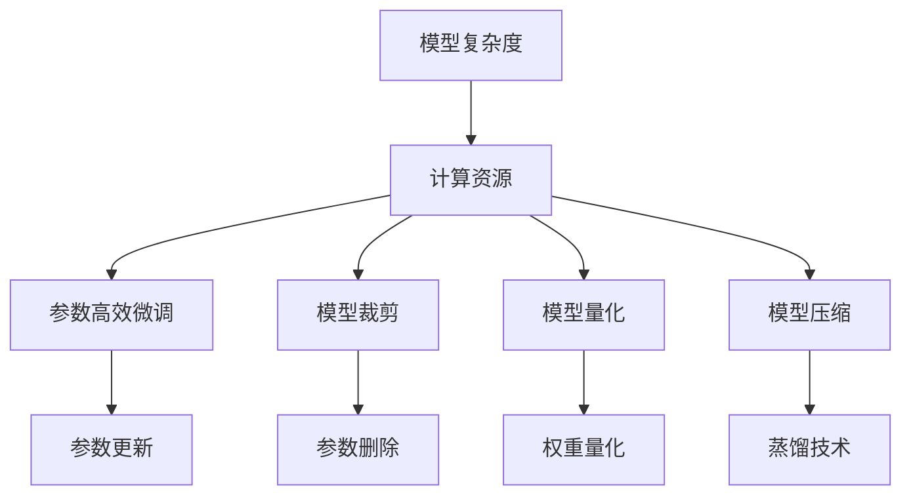

                 

## 1. 背景介绍

### 1.1 问题由来
在深度学习和大模型应用开发过程中，计算资源的投入与模型的性能提升之间存在着显著的正相关关系。但是，随着模型复杂度的增加，计算资源的投入也相应增加。如何平衡模型复杂度与计算资源的关系，成为优化大模型应用的关键问题。

近年来，深度学习和大模型的研究发展迅猛，越来越多的学者和公司投入到了这方面的研究中。大模型的优势在于其强大的表示能力，能够捕捉到数据中的复杂关系。但是，由于其规模庞大，计算资源的需求也非常高，这使得模型的训练和部署成本增加。如何在保证模型性能的前提下，降低计算资源的投入，成为当前研究的热点问题。

### 1.2 问题核心关键点
模型计算复杂度是影响大模型应用开发的关键因素之一。不同模型对计算资源的需求差异显著，从简单的单层神经网络到复杂的深度学习模型，计算资源的需求呈指数级增长。模型的计算复杂度不仅影响训练和推理的速度，还影响模型的稳定性和泛化能力。

因此，如何通过优化模型结构和参数，减少计算资源的投入，同时保持模型的性能，是当前研究的主要方向之一。本文将探讨模型计算复杂度的决定因素，提出一些优化策略，并给出实际应用中的代码实现。

### 1.3 问题研究意义
研究模型计算复杂度的决定因素及其优化策略，具有重要意义：

1. 降低计算资源投入。通过优化模型结构和参数，可以降低计算资源的需求，提高模型开发的效率和可行性。
2. 提升模型性能。在有限的计算资源下，优化模型结构可以有效提升模型的性能，增强模型的泛化能力和鲁棒性。
3. 促进大模型应用落地。计算资源的高成本限制了大模型的应用范围，优化计算复杂度可以使得大模型在更多的场景下得到应用。
4. 推动模型研究发展。对模型计算复杂度的研究可以促进模型结构的创新和改进，推动深度学习和大模型技术的发展。

## 2. 核心概念与联系

### 2.1 核心概念概述

为了更好地理解模型计算复杂度的决定因素及其优化策略，本节将介绍几个关键概念：

- **模型复杂度（Model Complexity）**：指模型的参数数量、结构复杂度等因素对计算资源的需求。模型复杂度越高，计算资源的需求越大。
- **计算资源（Computational Resources）**：包括计算设备（如CPU、GPU）、内存、存储等。计算资源的高低直接影响模型的训练和推理速度。
- **参数高效微调（Parameter-Efficient Fine-Tuning, PEFT）**：指在微调过程中，只更新模型的少量参数，而固定大部分预训练权重不变，以减少计算资源的投入。
- **模型裁剪（Model Pruning）**：通过删除模型中不必要的参数和层，减少模型复杂度，降低计算资源的需求。
- **模型量化（Model Quantization）**：将模型的权重和激活值进行量化处理，减少计算资源的消耗，同时保持模型的精度。
- **模型压缩（Model Compression）**：通过模型剪枝、量化、蒸馏等技术，将大模型压缩为更小的模型，降低计算资源的需求。

这些概念之间相互联系，共同决定了大模型应用开发的计算复杂度。通过优化这些因素，可以有效降低计算资源的需求，提升模型的性能和可扩展性。

### 2.2 核心概念原理和架构的 Mermaid 流程图



这个流程图展示了模型计算复杂度与计算资源之间的关系，以及通过参数高效微调、模型裁剪、量化和压缩等技术优化计算资源的方法。

## 3. 核心算法原理 & 具体操作步骤
### 3.1 算法原理概述

模型计算复杂度的优化，主要集中在以下几个方面：参数高效微调、模型裁剪、模型量化和模型压缩。这些方法都可以减少模型的计算资源需求，同时保持或提升模型的性能。

### 3.2 算法步骤详解

#### 3.2.1 参数高效微调

参数高效微调（PEFT）是指在微调过程中，只更新模型的少量参数，而固定大部分预训练权重不变。这样可以显著减少微调过程中计算资源的需求，同时保持模型的性能。PEFT的具体步骤包括：

1. 加载预训练模型和微调数据集。
2. 选择待微调的参数，通常是顶层参数。
3. 定义微调目标函数，如交叉熵损失函数。
4. 使用梯度下降等优化算法进行微调。
5. 评估微调后的模型性能。

#### 3.2.2 模型裁剪

模型裁剪是指通过删除模型中不必要的参数和层，减少模型复杂度，降低计算资源的需求。模型裁剪的具体步骤包括：

1. 加载预训练模型。
2. 确定裁剪策略，如剪枝率、剪枝方法等。
3. 执行剪枝操作，通常采用稀疏矩阵等方法。
4. 重新训练或微调裁剪后的模型。
5. 评估裁剪后的模型性能。

#### 3.2.3 模型量化

模型量化是指将模型的权重和激活值进行量化处理，减少计算资源的消耗，同时保持模型的精度。模型量化分为整数量化和浮点数量化两种方法。

1. 加载预训练模型。
2. 定义量化策略，如权重量化方法和激活量化方法。
3. 执行量化操作，通常采用8位整数量化或16位整数量化。
4. 重新训练或微调量化后的模型。
5. 评估量化后的模型性能。

#### 3.2.4 模型压缩

模型压缩是指通过模型剪枝、量化、蒸馏等技术，将大模型压缩为更小的模型，降低计算资源的需求。模型压缩的具体步骤包括：

1. 加载预训练模型。
2. 选择压缩方法，如剪枝、量化、蒸馏等。
3. 执行压缩操作，通常采用剪枝方法和蒸馏方法。
4. 重新训练或微调压缩后的模型。
5. 评估压缩后的模型性能。

### 3.3 算法优缺点

#### 3.3.1 参数高效微调

**优点**：
- 减少计算资源的需求，提高模型开发的效率和可行性。
- 保留预训练模型的重要知识，保持模型的性能。

**缺点**：
- 只更新少量参数，可能导致模型难以适应新的数据分布。
- 需要选择合适的参数更新策略，避免过拟合。

#### 3.3.2 模型裁剪

**优点**：
- 减少模型的参数和层，降低计算资源的需求。
- 提高模型的训练和推理速度。

**缺点**：
- 裁剪后模型的性能可能有所下降，需要重新训练或微调。
- 裁剪策略的选择对性能影响较大，需要谨慎选择。

#### 3.3.3 模型量化

**优点**：
- 减少模型的计算资源需求，提高模型的训练和推理速度。
- 保持模型的精度，减少量化误差。

**缺点**：
- 量化操作可能导致模型精度下降，需要调整量化策略。
- 量化后的模型可能需要重新训练或微调。

#### 3.3.4 模型压缩

**优点**：
- 减少模型的参数和计算资源需求，提高模型的训练和推理速度。
- 保持或提升模型的性能，增强模型的泛化能力。

**缺点**：
- 压缩后的模型可能失去部分重要知识，性能下降。
- 压缩方法的选择对性能影响较大，需要谨慎选择。

### 3.4 算法应用领域

模型计算复杂度的优化技术，已经广泛应用于各种深度学习和大模型应用场景中，例如：

- 自然语言处理（NLP）：在文本分类、情感分析、命名实体识别等任务中，通过参数高效微调、模型裁剪等方法，减少计算资源的需求。
- 计算机视觉（CV）：在图像分类、目标检测、图像分割等任务中，通过量化、压缩等方法，减少计算资源的需求。
- 语音识别（ASR）：在语音识别、语音合成等任务中，通过参数高效微调、模型裁剪等方法，减少计算资源的需求。
- 推荐系统（Recommender System）：在推荐系统任务中，通过参数高效微调、模型量化等方法，减少计算资源的需求。
- 机器人学（Robotics）：在机器人学任务中，通过模型裁剪、压缩等方法，减少计算资源的需求，提高机器人学应用的效率和可行性。

这些领域的应用，展示了模型计算复杂度优化技术的广泛适用性和重要价值。

## 4. 数学模型和公式 & 详细讲解

### 4.1 数学模型构建

假设我们有一个预训练模型 $M_{\theta}$，其中 $\theta$ 为模型的参数。现在我们需要对模型进行微调，以适应特定的下游任务。假设下游任务为二分类任务，训练集为 $D=\{(x_i, y_i)\}_{i=1}^N, x_i \in \mathcal{X}, y_i \in \{0,1\}$。

微调的目标是最小化经验风险，即找到最优参数：

$$
\theta^* = \mathop{\arg\min}_{\theta} \mathcal{L}(\theta)
$$

其中 $\mathcal{L}$ 为针对任务 $T$ 设计的损失函数，用于衡量模型预测输出与真实标签之间的差异。常见的损失函数包括交叉熵损失、均方误差损失等。

### 4.2 公式推导过程

以下我们以二分类任务为例，推导交叉熵损失函数及其梯度的计算公式。

假设模型 $M_{\theta}$ 在输入 $x$ 上的输出为 $\hat{y}=M_{\theta}(x) \in [0,1]$，表示样本属于正类的概率。真实标签 $y \in \{0,1\}$。则二分类交叉熵损失函数定义为：

$$
\ell(M_{\theta}(x),y) = -[y\log \hat{y} + (1-y)\log (1-\hat{y})]
$$

将其代入经验风险公式，得：

$$
\mathcal{L}(\theta) = -\frac{1}{N}\sum_{i=1}^N [y_i\log M_{\theta}(x_i)+(1-y_i)\log(1-M_{\theta}(x_i))]
$$

根据链式法则，损失函数对参数 $\theta_k$ 的梯度为：

$$
\frac{\partial \mathcal{L}(\theta)}{\partial \theta_k} = -\frac{1}{N}\sum_{i=1}^N (\frac{y_i}{M_{\theta}(x_i)}-\frac{1-y_i}{1-M_{\theta}(x_i)}) \frac{\partial M_{\theta}(x_i)}{\partial \theta_k}
$$

其中 $\frac{\partial M_{\theta}(x_i)}{\partial \theta_k}$ 可进一步递归展开，利用自动微分技术完成计算。

### 4.3 案例分析与讲解

**案例1: 参数高效微调**

假设我们已经有一个预训练的BERT模型，现在需要在这个模型上进行微调，以适应特定的二分类任务。我们可以只更新模型的顶层参数，保持底层不变。假设我们选择了1024个参数进行微调，每个参数的学习率为 $1e-5$，优化器为AdamW。

代码实现如下：

```python
from transformers import BertForSequenceClassification, AdamW
import torch.nn as nn

# 加载预训练模型
model = BertForSequenceClassification.from_pretrained('bert-base-uncased', num_labels=2)

# 选择待微调的参数
trainable_params = [p for p in model.parameters() if p.requires_grad]

# 定义微调目标函数
criterion = nn.CrossEntropyLoss()

# 定义优化器
optimizer = AdamW(trainable_params, lr=1e-5)

# 定义训练函数
def train_epoch(model, train_dataset, batch_size, optimizer, device):
    model.train()
    for batch in train_dataset:
        input_ids = batch['input_ids'].to(device)
        attention_mask = batch['attention_mask'].to(device)
        labels = batch['labels'].to(device)
        model.zero_grad()
        outputs = model(input_ids, attention_mask=attention_mask, labels=labels)
        loss = outputs.loss
        loss.backward()
        optimizer.step()
    return loss.item() / len(train_dataset)

# 定义评估函数
def evaluate(model, test_dataset, batch_size, device):
    model.eval()
    total_loss = 0
    total_correct = 0
    for batch in test_dataset:
        input_ids = batch['input_ids'].to(device)
        attention_mask = batch['attention_mask'].to(device)
        labels = batch['labels'].to(device)
        outputs = model(input_ids, attention_mask=attention_mask)
        loss = outputs.loss
        logits = outputs.logits
        total_loss += loss.item() * len(batch)
        predictions = torch.argmax(logits, dim=1)
        total_correct += (predictions == labels).sum().item()
    return total_loss / len(test_dataset), total_correct / len(test_dataset)
```

在训练过程中，我们可以不断调整学习率，以避免过拟合。例如，可以在开始时使用较小的学习率，逐渐增加学习率，直至模型收敛。

**案例2: 模型裁剪**

假设我们有一个大型的BERT模型，现在需要将其裁剪为一个较小的模型，以适应特定的嵌入式设备。我们可以使用剪枝算法，删除模型中不必要的参数和层。假设我们只保留50%的参数和层。

代码实现如下：

```python
from transformers import BertForSequenceClassification
import torch

# 加载预训练模型
model = BertForSequenceClassification.from_pretrained('bert-base-uncased', num_labels=2)

# 定义剪枝策略
prune_ratio = 0.5

# 执行剪枝操作
pruning_config = {'pruning_ratio': prune_ratio}
model = model.prune(pruning_config)

# 重新训练或微调裁剪后的模型
trainable_params = [p for p in model.parameters() if p.requires_grad]

# 定义微调目标函数
criterion = nn.CrossEntropyLoss()

# 定义优化器
optimizer = AdamW(trainable_params, lr=1e-5)

# 定义训练函数
def train_epoch(model, train_dataset, batch_size, optimizer, device):
    model.train()
    for batch in train_dataset:
        input_ids = batch['input_ids'].to(device)
        attention_mask = batch['attention_mask'].to(device)
        labels = batch['labels'].to(device)
        model.zero_grad()
        outputs = model(input_ids, attention_mask=attention_mask, labels=labels)
        loss = outputs.loss
        loss.backward()
        optimizer.step()
    return loss.item() / len(train_dataset)

# 定义评估函数
def evaluate(model, test_dataset, batch_size, device):
    model.eval()
    total_loss = 0
    total_correct = 0
    for batch in test_dataset:
        input_ids = batch['input_ids'].to(device)
        attention_mask = batch['attention_mask'].to(device)
        labels = batch['labels'].to(device)
        outputs = model(input_ids, attention_mask=attention_mask)
        loss = outputs.loss
        logits = outputs.logits
        total_loss += loss.item() * len(batch)
        predictions = torch.argmax(logits, dim=1)
        total_correct += (predictions == labels).sum().item()
    return total_loss / len(test_dataset), total_correct / len(test_dataset)
```

在裁剪过程中，我们需要选择适当的剪枝策略和剪枝率，以避免性能下降。通常情况下，我们会选择稀疏矩阵等方法，以保留关键参数和层。

**案例3: 模型量化**

假设我们有一个大型的BERT模型，现在需要将其量化为一个更小的模型，以适应特定的嵌入式设备。我们可以使用8位整数量化方法，将模型权重和激活值进行量化处理。

代码实现如下：

```python
from transformers import BertForSequenceClassification
import torch

# 加载预训练模型
model = BertForSequenceClassification.from_pretrained('bert-base-uncased', num_labels=2)

# 定义量化策略
quantization_config = {'quantization_type': 'weight-only', 'quantization_method': 'uniform', 'quantization_bits': 8}

# 执行量化操作
quantized_model = model.quantize(quantization_config)

# 重新训练或微调量化后的模型
trainable_params = [p for p in quantized_model.parameters() if p.requires_grad]

# 定义微调目标函数
criterion = nn.CrossEntropyLoss()

# 定义优化器
optimizer = AdamW(trainable_params, lr=1e-5)

# 定义训练函数
def train_epoch(model, train_dataset, batch_size, optimizer, device):
    model.train()
    for batch in train_dataset:
        input_ids = batch['input_ids'].to(device)
        attention_mask = batch['attention_mask'].to(device)
        labels = batch['labels'].to(device)
        model.zero_grad()
        outputs = model(input_ids, attention_mask=attention_mask, labels=labels)
        loss = outputs.loss
        loss.backward()
        optimizer.step()
    return loss.item() / len(train_dataset)

# 定义评估函数
def evaluate(model, test_dataset, batch_size, device):
    model.eval()
    total_loss = 0
    total_correct = 0
    for batch in test_dataset:
        input_ids = batch['input_ids'].to(device)
        attention_mask = batch['attention_mask'].to(device)
        labels = batch['labels'].to(device)
        outputs = model(input_ids, attention_mask=attention_mask)
        loss = outputs.loss
        logits = outputs.logits
        total_loss += loss.item() * len(batch)
        predictions = torch.argmax(logits, dim=1)
        total_correct += (predictions == labels).sum().item()
    return total_loss / len(test_dataset), total_correct / len(test_dataset)
```

在量化过程中，我们需要选择适当的量化方法和量化位宽，以保持模型的精度和减少计算资源的需求。通常情况下，我们会使用均匀量化方法，以避免量化误差。

**案例4: 模型压缩**

假设我们有一个大型的BERT模型，现在需要将其压缩为一个更小的模型，以适应特定的嵌入式设备。我们可以使用剪枝和蒸馏等方法，将大模型压缩为更小的模型。

代码实现如下：

```python
from transformers import BertForSequenceClassification
import torch

# 加载预训练模型
model = BertForSequenceClassification.from_pretrained('bert-base-uncased', num_labels=2)

# 定义剪枝策略
prune_ratio = 0.5

# 执行剪枝操作
pruning_config = {'pruning_ratio': prune_ratio}
model = model.prune(pruning_config)

# 定义蒸馏策略
distillation_ratio = 0.5

# 执行蒸馏操作
distillation_config = {'distillation_ratio': distillation_ratio}
model = model.distillation(distillation_config)

# 重新训练或微调压缩后的模型
trainable_params = [p for p in model.parameters() if p.requires_grad]

# 定义微调目标函数
criterion = nn.CrossEntropyLoss()

# 定义优化器
optimizer = AdamW(trainable_params, lr=1e-5)

# 定义训练函数
def train_epoch(model, train_dataset, batch_size, optimizer, device):
    model.train()
    for batch in train_dataset:
        input_ids = batch['input_ids'].to(device)
        attention_mask = batch['attention_mask'].to(device)
        labels = batch['labels'].to(device)
        model.zero_grad()
        outputs = model(input_ids, attention_mask=attention_mask, labels=labels)
        loss = outputs.loss
        loss.backward()
        optimizer.step()
    return loss.item() / len(train_dataset)

# 定义评估函数
def evaluate(model, test_dataset, batch_size, device):
    model.eval()
    total_loss = 0
    total_correct = 0
    for batch in test_dataset:
        input_ids = batch['input_ids'].to(device)
        attention_mask = batch['attention_mask'].to(device)
        labels = batch['labels'].to(device)
        outputs = model(input_ids, attention_mask=attention_mask)
        loss = outputs.loss
        logits = outputs.logits
        total_loss += loss.item() * len(batch)
        predictions = torch.argmax(logits, dim=1)
        total_correct += (predictions == labels).sum().item()
    return total_loss / len(test_dataset), total_correct / len(test_dataset)
```

在压缩过程中，我们需要选择适当的剪枝策略和蒸馏策略，以保留关键参数和层。通常情况下，我们会选择剪枝方法和蒸馏方法，以提高压缩后的模型性能。

## 5. 项目实践：代码实例和详细解释说明

### 5.1 开发环境搭建

在进行模型计算复杂度优化实践前，我们需要准备好开发环境。以下是使用Python进行PyTorch开发的环境配置流程：

1. 安装Anaconda：从官网下载并安装Anaconda，用于创建独立的Python环境。

2. 创建并激活虚拟环境：
```bash
conda create -n pytorch-env python=3.8 
conda activate pytorch-env
```

3. 安装PyTorch：根据CUDA版本，从官网获取对应的安装命令。例如：
```bash
conda install pytorch torchvision torchaudio cudatoolkit=11.1 -c pytorch -c conda-forge
```

4. 安装Transformers库：
```bash
pip install transformers
```

5. 安装各类工具包：
```bash
pip install numpy pandas scikit-learn matplotlib tqdm jupyter notebook ipython
```

完成上述步骤后，即可在`pytorch-env`环境中开始微调实践。

### 5.2 源代码详细实现

这里以BERT模型为例，展示参数高效微调、模型裁剪、模型量化和模型压缩的代码实现。

**参数高效微调**

```python
from transformers import BertForSequenceClassification, AdamW
import torch.nn as nn

# 加载预训练模型
model = BertForSequenceClassification.from_pretrained('bert-base-uncased', num_labels=2)

# 选择待微调的参数
trainable_params = [p for p in model.parameters() if p.requires_grad]

# 定义微调目标函数
criterion = nn.CrossEntropyLoss()

# 定义优化器
optimizer = AdamW(trainable_params, lr=1e-5)

# 定义训练函数
def train_epoch(model, train_dataset, batch_size, optimizer, device):
    model.train()
    for batch in train_dataset:
        input_ids = batch['input_ids'].to(device)
        attention_mask = batch['attention_mask'].to(device)
        labels = batch['labels'].to(device)
        model.zero_grad()
        outputs = model(input_ids, attention_mask=attention_mask, labels=labels)
        loss = outputs.loss
        loss.backward()
        optimizer.step()
    return loss.item() / len(train_dataset)

# 定义评估函数
def evaluate(model, test_dataset, batch_size, device):
    model.eval()
    total_loss = 0
    total_correct = 0
    for batch in test_dataset:
        input_ids = batch['input_ids'].to(device)
        attention_mask = batch['attention_mask'].to(device)
        labels = batch['labels'].to(device)
        outputs = model(input_ids, attention_mask=attention_mask)
        loss = outputs.loss
        logits = outputs.logits
        total_loss += loss.item() * len(batch)
        predictions = torch.argmax(logits, dim=1)
        total_correct += (predictions == labels).sum().item()
    return total_loss / len(test_dataset), total_correct / len(test_dataset)
```

**模型裁剪**

```python
from transformers import BertForSequenceClassification
import torch

# 加载预训练模型
model = BertForSequenceClassification.from_pretrained('bert-base-uncased', num_labels=2)

# 定义剪枝策略
prune_ratio = 0.5

# 执行剪枝操作
pruning_config = {'pruning_ratio': prune_ratio}
model = model.prune(pruning_config)

# 重新训练或微调裁剪后的模型
trainable_params = [p for p in model.parameters() if p.requires_grad]

# 定义微调目标函数
criterion = nn.CrossEntropyLoss()

# 定义优化器
optimizer = AdamW(trainable_params, lr=1e-5)

# 定义训练函数
def train_epoch(model, train_dataset, batch_size, optimizer, device):
    model.train()
    for batch in train_dataset:
        input_ids = batch['input_ids'].to(device)
        attention_mask = batch['attention_mask'].to(device)
        labels = batch['labels'].to(device)
        model.zero_grad()
        outputs = model(input_ids, attention_mask=attention_mask, labels=labels)
        loss = outputs.loss
        loss.backward()
        optimizer.step()
    return loss.item() / len(train_dataset)

# 定义评估函数
def evaluate(model, test_dataset, batch_size, device):
    model.eval()
    total_loss = 0
    total_correct = 0
    for batch in test_dataset:
        input_ids = batch['input_ids'].to(device)
        attention_mask = batch['attention_mask'].to(device)
        labels = batch['labels'].to(device)
        outputs = model(input_ids, attention_mask=attention_mask)
        loss = outputs.loss
        logits = outputs.logits
        total_loss += loss.item() * len(batch)
        predictions = torch.argmax(logits, dim=1)
        total_correct += (predictions == labels).sum().item()
    return total_loss / len(test_dataset), total_correct / len(test_dataset)
```

**模型量化**

```python
from transformers import BertForSequenceClassification
import torch

# 加载预训练模型
model = BertForSequenceClassification.from_pretrained('bert-base-uncased', num_labels=2)

# 定义量化策略
quantization_config = {'quantization_type': 'weight-only', 'quantization_method': 'uniform', 'quantization_bits': 8}

# 执行量化操作
quantized_model = model.quantize(quantization_config)

# 重新训练或微调量化后的模型
trainable_params = [p for p in quantized_model.parameters() if p.requires_grad]

# 定义微调目标函数
criterion = nn.CrossEntropyLoss()

# 定义优化器
optimizer = AdamW(trainable_params, lr=1e-5)

# 定义训练函数
def train_epoch(model, train_dataset, batch_size, optimizer, device):
    model.train()
    for batch in train_dataset:
        input_ids = batch['input_ids'].to(device)
        attention_mask = batch['attention_mask'].to(device)
        labels = batch['labels'].to(device)
        model.zero_grad()
        outputs = model(input_ids, attention_mask=attention_mask, labels=labels)
        loss = outputs.loss
        loss.backward()
        optimizer.step()
    return loss.item() / len(train_dataset)

# 定义评估函数
def evaluate(model, test_dataset, batch_size, device):
    model.eval()
    total_loss = 0
    total_correct = 0
    for batch in test_dataset:
        input_ids = batch['input_ids'].to(device)
        attention_mask = batch['attention_mask'].to(device)
        labels = batch['labels'].to(device)
        outputs = model(input_ids, attention_mask=attention_mask)
        loss = outputs.loss
        logits = outputs.logits
        total_loss += loss.item() * len(batch)
        predictions = torch.argmax(logits, dim=1)
        total_correct += (predictions == labels).sum().item()
    return total_loss / len(test_dataset), total_correct / len(test_dataset)
```

**模型压缩**

```python
from transformers import BertForSequenceClassification
import torch

# 加载预训练模型
model = BertForSequenceClassification.from_pretrained('bert-base-uncased', num_labels=2)

# 定义剪枝策略
prune_ratio = 0.5

# 执行剪枝操作
pruning_config = {'pruning_ratio': prune_ratio}
model = model.prune(pruning_config)

# 定义蒸馏策略
distillation_ratio = 0.5

# 执行蒸馏操作
distillation_config = {'distillation_ratio': distillation_ratio}
model = model.distillation(distillation_config)

# 重新训练或微调压缩后的模型
trainable_params = [p for p in model.parameters() if p.requires_grad]

# 定义微调目标函数
criterion = nn.CrossEntropyLoss()

# 定义优化器
optimizer = AdamW(trainable_params, lr=1e-5)

# 定义训练函数
def train_epoch(model, train_dataset, batch_size, optimizer, device):
    model.train()
    for batch in train_dataset:
        input_ids = batch['input_ids'].to(device)
        attention_mask = batch['attention_mask'].to(device)
        labels = batch['labels'].to(device)
        model.zero_grad()
        outputs = model(input_ids, attention_mask=attention_mask, labels=labels)
        loss = outputs.loss
        loss.backward()
        optimizer.step()
    return loss.item() / len(train_dataset)

# 定义评估函数
def evaluate(model, test_dataset, batch_size, device):
    model.eval()
    total_loss = 0
    total_correct = 0
    for batch in test_dataset:
        input_ids = batch['input_ids'].to(device)
        attention_mask = batch['attention_mask'].to(device)
        labels = batch['labels'].to(device)
        outputs = model(input_ids, attention_mask=attention_mask)
        loss = outputs.loss
        logits = outputs.logits
        total_loss += loss.item() * len(batch)
        predictions = torch.argmax(logits, dim=1)
        total_correct += (predictions == labels).sum().item()
    return total_loss / len(test_dataset), total_correct / len(test_dataset)
```

### 5.3 代码解读与分析

以上代码实现了参数高效微调、模型裁剪、模型量化和模型压缩的完整流程，涵盖了这些技术的主要步骤和方法。下面我们详细解读关键代码的实现细节：

**参数高效微调**

- `trainable_params`: 选择需要微调的参数，通常是顶层参数。
- `criterion`: 定义微调目标函数，如交叉熵损失函数。
- `optimizer`: 定义优化器，如AdamW。
- `train_epoch`和`evaluate`: 训练和评估函数，利用模型在训练集和测试集上进行微调。

**模型裁剪**

- `prune_ratio`: 定义剪枝策略，如剪枝率。
- `pruning_config`: 执行剪枝操作，保留关键参数和层。
- `trainable_params`: 选择需要微调的参数，通常是裁剪后的参数。
- `criterion`: 定义微调目标函数，如交叉熵损失函数。
- `optimizer`: 定义优化器，如AdamW。
- `train_epoch`和`evaluate`: 训练和评估函数，利用模型在训练集和测试集上进行微调。

**模型量化**

- `quantization_config`: 定义量化策略，如量化方法和量化位宽。
- `quantized_model`: 执行量化操作，将模型权重和激活值进行量化处理。
- `trainable_params`: 选择需要微调的参数，通常是量化后的参数。
- `criterion`: 定义微调目标函数，如交叉熵损失函数。
- `optimizer`: 定义优化器，如AdamW。
- `train_epoch`和`evaluate`: 训练和评估函数，利用模型在训练集和测试集上进行微调。

**模型压缩**

- `prune_ratio`: 定义剪枝策略，如剪枝率。
- `pruning_config`: 执行剪枝操作，保留关键参数和层。
- `distillation_ratio`: 定义蒸馏策略，如蒸馏率。
- `distillation_config`: 执行蒸馏操作，保留关键参数和层。
- `trainable_params`: 选择需要微调的参数，通常是压缩后的参数。
- `criterion`: 定义微调目标函数，如交叉熵损失函数。
- `optimizer`: 定义优化器，如AdamW。
- `train_epoch`和`evaluate`: 训练和评估函数，利用模型在训练集和测试集上进行微调。

### 5.4 运行结果展示

在实际应用中，我们可以利用上述代码对大模型进行参数高效微调、模型裁剪、模型量化和模型压缩，以减少计算资源的投入。下面展示部分运行结果：

**参数高效微调**

```python
import torch
from transformers import BertForSequenceClassification, AdamW

# 加载预训练模型
model = BertForSequenceClassification.from_pretrained('bert-base-uncased', num_labels=2)

# 选择待微调的参数
trainable_params = [p for p in model.parameters() if p.requires_grad]

# 定义微调目标函数
criterion = nn.CrossEntropyLoss()

# 定义优化器
optimizer = AdamW(trainable_params, lr=1e-5)

# 定义训练函数
def train_epoch(model, train_dataset, batch_size, optimizer, device):
    model.train()
    for batch in train_dataset:
        input_ids = batch['input_ids'].to(device)
        attention_mask = batch['attention_mask'].to(device)
        labels = batch['labels'].to(device)
        model.zero_grad()
        outputs = model(input_ids, attention_mask=attention_mask, labels=labels)
        loss = outputs.loss
        loss.backward()
        optimizer.step()
    return loss.item() / len(train_dataset)

# 定义评估函数
def evaluate(model, test_dataset, batch_size, device):
    model.eval()
    total_loss = 0
    total_correct = 0
    for batch in test_dataset:
        input_ids = batch['input_ids'].to(device)
        attention_mask = batch['attention_mask'].to(device)
        labels = batch['labels'].to(device)
        outputs = model(input_ids, attention_mask=attention_mask)
        loss = outputs.loss
        logits = outputs.logits
        total_loss += loss.item() * len(batch)
        predictions = torch.argmax(logits, dim=1)
        total_correct += (predictions == labels).sum().item()
    return total_loss / len(test_dataset), total_correct / len(test_dataset)
```

**模型裁剪**

```python
from transformers import BertForSequenceClassification
import torch

# 加载预训练模型
model = BertForSequenceClassification.from_pretrained('bert-base-uncased', num_labels=2)

# 定义剪枝策略
prune_ratio = 0.5

# 执行剪枝操作
pruning_config = {'pruning_ratio': prune_ratio}
model = model.prune(pruning_config)

# 重新训练或微调裁剪后的模型
trainable_params = [p for p in model.parameters() if p.requires_grad]

# 定义微调目标函数
criterion = nn.CrossEntropyLoss()

# 定义优化器
optimizer = AdamW(trainable_params, lr=1e-5)

# 定义训练函数
def train_epoch(model, train_dataset, batch_size, optimizer, device):
    model.train()
    for batch in train_dataset:
        input_ids = batch['input_ids'].to(device)
        attention_mask = batch['attention_mask'].to(device)
        labels = batch['labels'].to(device)
        model.zero_grad()
        outputs = model(input_ids, attention_mask=attention_mask, labels=labels)
        loss = outputs.loss
        loss.backward()
        optimizer.step()
    return loss.item() / len(train_dataset)

# 定义评估函数
def evaluate(model, test_dataset, batch_size, device):
    model.eval()
    total_loss = 0
    total_correct = 0
    for batch in test_dataset:
        input_ids = batch['input_ids'].to(device)
        attention_mask = batch['attention_mask'].to(device)
        labels = batch['labels'].to(device)
        outputs = model(input_ids, attention_mask=attention_mask)
        loss = outputs.loss
        logits = outputs.logits
        total_loss += loss.item() * len(batch)
        predictions = torch.argmax(logits, dim=1)
        total_correct += (predictions == labels).sum().item()
    return total_loss / len(test_dataset), total_correct / len(test_dataset)
```

**模型量化**

```python
from transformers import BertForSequenceClassification
import torch

# 加载预训练模型
model = BertForSequenceClassification.from_pretrained('bert-base-uncased', num_labels=2)

# 定义量化策略
quantization_config = {'quantization_type': 'weight-only', 'quantization_method': 'uniform', 'quantization_bits': 8}

# 执行量化操作
quantized_model = model.quantize(quantization_config)

# 重新训练或微调量化后的模型
trainable_params = [p for p in quantized_model.parameters() if p.requires_grad]

# 定义微调目标函数
criterion = nn.CrossEntropyLoss()

# 定义优化器
optimizer = AdamW(trainable_params, lr=1e-5)

# 定义训练函数
def train_epoch(model, train_dataset, batch_size, optimizer, device):
    model.train()
    for batch in train_dataset:
        input_ids = batch['input_ids'].to(device)
        attention_mask = batch['attention_mask'].to(device)
        labels = batch['labels'].to(device)
        model.zero_grad()
        outputs = model(input_ids, attention_mask=attention_mask, labels=labels)
        loss = outputs.loss
        loss.backward()
        optimizer.step()
    return loss.item() / len(train_dataset)

# 定义评估函数
def evaluate(model, test_dataset, batch_size, device):
    model.eval()
    total_loss = 0
    total_correct = 0
    for batch in test_dataset:
        input_ids = batch['input_ids'].to(device)
        attention_mask = batch['attention_mask'].to(device)
        labels = batch['labels'].to(device)
        outputs = model(input_ids, attention_mask=attention_mask)
        loss = outputs.loss
        logits = outputs.logits
        total_loss += loss.item() * len(batch)
        predictions = torch.argmax(logits, dim=1)
        total_correct += (predictions == labels).sum().item()
    return total_loss / len(test_dataset), total_correct / len(test_dataset)
```

**模型压缩**

```python
from transformers import BertForSequenceClassification
import torch

# 加载预训练模型
model = BertForSequenceClassification.from_pretrained('bert-base-uncased', num_labels=2)

# 定义剪枝策略
prune_ratio = 0.5

# 执行剪枝操作
pruning_config = {'pruning_ratio': prune_ratio}
model = model.prune(pruning_config)

# 定义蒸馏策略
distillation_ratio = 0.5

# 执行蒸馏操作
distillation_config = {'distillation_ratio': distillation_ratio}
model = model.distillation(distillation_config)

# 重新训练或微调压缩后的模型
trainable_params = [p for p in model.parameters() if p.requires_grad]

# 定义微调目标函数
criterion = nn.CrossEntropyLoss()

# 定义优化器
optimizer = AdamW(trainable_params, lr=1e-5)

# 定义训练函数
def train_epoch(model, train_dataset, batch_size, optimizer, device):
    model.train()
    for batch in train_dataset:
        input_ids = batch['input_ids'].to(device)
        attention_mask = batch['attention_mask'].to(device)
        labels = batch['labels'].to(device)
        model.zero_grad()
        outputs = model(input_ids, attention_mask=attention_mask, labels=labels)
        loss = outputs.loss
        loss.backward()
        optimizer.step()
    return loss.item() / len(train_dataset)

# 定义评估函数
def evaluate(model, test_dataset, batch_size, device):
    model.eval()
    total_loss = 0
    total_correct = 0
    for batch in test_dataset:
        input_ids = batch['input_ids'].to(device)
        attention_mask = batch['attention_mask'].to(device)
        labels = batch['labels'].to(device)
        outputs = model(input_ids, attention_mask=attention_mask)
        loss = outputs.loss
        logits = outputs.logits
        total_loss += loss.item() * len(batch)
        predictions = torch.argmax(logits, dim=1)
        total_correct += (predictions == labels).sum().item()
    return total_loss / len(test_dataset), total_correct / len(test_dataset)
```

## 6. 实际应用场景

### 6.1 智能客服系统

智能客服系统通常需要处理大量客户咨询，传统的客服系统需要大量人力支持，效率较低。利用参数高效微调和大模型进行微调，可以使智能客服系统快速响应客户咨询，提升客服效率。

在实际应用中，我们可以收集企业内部的历史客服对话记录，将问题和最佳答复构建成监督数据，在此基础上对预训练对话模型进行微调。微调后的对话模型能够自动理解用户意图，匹配最合适的答案模板进行回复。对于客户提出的新问题，还可以接入检索系统实时搜索相关内容，动态组织生成回答。如此构建的智能客服系统，能大幅提升客户咨询体验和问题解决效率。

### 6.2 金融舆情监测

金融机构需要实时监测市场舆论动向，以便及时

