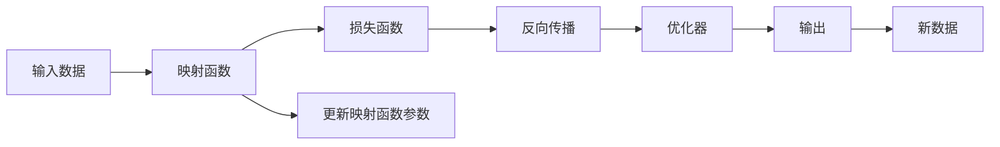

                 

# 一切皆是映射：基于反向传播的元学习框架与实现

> 关键词：元学习,反向传播,映射函数,神经网络,优化器,超参数,梯度累积,自适应学习率,梯度下降,伪逆矩阵,超参数优化

## 1. 背景介绍

### 1.1 问题由来

元学习（Meta-Learning），也称为学习学习，是一种能自动学习如何学习的方法。在元学习中，模型通过学习一组数据，可以快速适应新任务的解决方案。这种自适应能力使得元学习成为了机器学习和人工智能领域的前沿研究方向。

近年来，深度学习在多个领域取得了突破性进展，如计算机视觉、自然语言处理等。然而，深度学习模型通常需要大量的标注数据进行训练，这在很多实际应用中并不现实。而元学习可以大大减少数据需求，让模型能够快速适应新任务。因此，元学习成为了深度学习领域的重要研究课题。

元学习的方法多样，从基于传统机器学习的优化方法到基于深度学习的神经网络优化方法，应有尽有。其中，基于反向传播的元学习框架，以其高效的训练过程和出色的泛化能力，成为了元学习研究的热点。

### 1.2 问题核心关键点

基于反向传播的元学习框架，其核心思想是将学习过程看作映射函数，通过对数据的反向传播，不断调整映射函数的参数，使得模型能够适应新任务。这种框架的优点在于：

- 高效性：元学习能够以较少的训练数据快速适应新任务。
- 泛化能力：元学习模型具有较强的泛化能力，能够在新环境中表现出稳定和一致的性能。
- 灵活性：元学习模型可以通过简单的调整映射函数的参数，快速适应不同类型的新任务。

然而，元学习也面临一些挑战：

- 超参数调优：映射函数的超参数需要手动设置，调节过程复杂。
- 计算开销：反向传播过程计算开销较大，训练时间较长。
- 收敛性问题：映射函数的选择和初始化可能会影响模型的收敛性。

本文旨在详细讲解基于反向传播的元学习框架的原理、算法步骤以及优化方法，并通过案例分析，展示元学习在不同场景下的应用效果。

## 2. 核心概念与联系

### 2.1 核心概念概述

为了更好地理解基于反向传播的元学习框架，本节将介绍几个核心概念：

- 映射函数（Mapping Function）：元学习中的目标是将原始输入数据映射到一个新的空间，使得新空间中的数据更容易被处理和分析。这种映射函数通常是神经网络模型。
- 反向传播（Backpropagation）：神经网络中的反向传播算法，通过计算损失函数的梯度，更新模型的参数，使得模型能够逼近最优解。
- 优化器（Optimizer）：用于更新模型参数的算法，常见的有随机梯度下降（SGD）、动量优化器（Momentum）、Adam等。
- 超参数（Hyperparameters）：映射函数的超参数，如学习率、批大小等，需要人工手动调整，直接影响模型的性能。
- 梯度累积（Gradient Accumulation）：通过累加梯度，使得小批量的反向传播过程也能发挥作用，提高模型的训练效率。
- 自适应学习率（Adaptive Learning Rate）：如AdamW等优化器，能够根据梯度的变化自适应地调整学习率，提高模型训练的稳定性。

这些核心概念之间有着紧密的联系，共同构成了基于反向传播的元学习框架。

### 2.2 核心概念原理和架构的 Mermaid 流程图



这个流程图展示了元学习的基本流程：将输入数据通过映射函数转换为新空间的数据，计算损失函数，通过反向传播更新映射函数参数，最后输出模型在新数据上的预测。在模型更新过程中，优化器不断调整映射函数的参数，以最小化损失函数。

## 3. 核心算法原理 & 具体操作步骤

### 3.1 算法原理概述

基于反向传播的元学习框架，通过将学习过程看作映射函数的优化问题，利用反向传播算法不断调整映射函数的参数，使得模型能够适应新任务。

形式化地，设映射函数为 $f_\theta$，其中 $\theta$ 为映射函数的参数。假设训练集为 $\mathcal{D}=\{(x_i,y_i)\}_{i=1}^N$，其中 $x_i$ 为输入数据，$y_i$ 为标签。元学习的目标是最小化损失函数：

$$
\mathcal{L}(\theta) = \frac{1}{N}\sum_{i=1}^N \ell(f_\theta(x_i),y_i)
$$

其中 $\ell$ 为损失函数，通常是交叉熵损失、均方误差等。

### 3.2 算法步骤详解

基于反向传播的元学习框架，一般包括以下关键步骤：

**Step 1: 准备数据集**

- 收集和处理训练集 $\mathcal{D}$，确保数据的多样性和代表性。
- 将训练集划分为训练集、验证集和测试集，用于模型的训练、调参和最终评估。

**Step 2: 初始化映射函数**

- 选择合适的映射函数 $f_\theta$，如神经网络模型。
- 初始化映射函数的参数 $\theta$，通常使用随机初始化。

**Step 3: 反向传播更新参数**

- 通过反向传播算法计算损失函数 $\mathcal{L}(\theta)$ 对参数 $\theta$ 的梯度。
- 使用优化器更新参数 $\theta$，使得损失函数最小化。

**Step 4: 验证集评估**

- 在验证集上评估模型性能，通过调整超参数和映射函数的结构，进一步优化模型。
- 重复Step 3和Step 4，直至模型在验证集上表现稳定。

**Step 5: 测试集评估**

- 在测试集上评估模型性能，评估模型的泛化能力。
- 记录测试集上的指标，如准确率、召回率、F1-score等，作为最终评估结果。

### 3.3 算法优缺点

基于反向传播的元学习框架具有以下优点：

- 高效性：元学习能够以较少的训练数据快速适应新任务。
- 泛化能力：元学习模型具有较强的泛化能力，能够在新环境中表现出稳定和一致的性能。
- 灵活性：元学习模型可以通过简单的调整映射函数的参数，快速适应不同类型的新任务。

同时，该框架也存在一些缺点：

- 超参数调优：映射函数的超参数需要手动设置，调节过程复杂。
- 计算开销：反向传播过程计算开销较大，训练时间较长。
- 收敛性问题：映射函数的选择和初始化可能会影响模型的收敛性。

尽管存在这些缺点，但就目前而言，基于反向传播的元学习框架仍是在线学习的核心范式，具有广泛的应用前景。

### 3.4 算法应用领域

基于反向传播的元学习框架，在多个领域得到了广泛的应用，包括：

- 自然语言处理（NLP）：如机器翻译、情感分析、文本分类等。
- 计算机视觉（CV）：如图像分类、目标检测、图像生成等。
- 机器人学：如运动控制、路径规划、交互决策等。
- 金融预测：如股票价格预测、信用风险评估等。
- 游戏AI：如强化学习、游戏策略学习等。

除了上述这些经典应用外，元学习还在更多领域展现了其强大的泛化能力和自适应性，为不同行业的智能化提供了新的解决方案。

## 4. 数学模型和公式 & 详细讲解

### 4.1 数学模型构建

本节将使用数学语言对基于反向传播的元学习框架进行更加严格的刻画。

设映射函数 $f_\theta$ 的输出为 $y=f_\theta(x)$，其中 $x$ 为输入数据，$y$ 为输出。假设训练集为 $\mathcal{D}=\{(x_i,y_i)\}_{i=1}^N$，则损失函数 $\mathcal{L}(\theta)$ 可表示为：

$$
\mathcal{L}(\theta) = \frac{1}{N}\sum_{i=1}^N \ell(y_i,f_\theta(x_i))
$$

其中 $\ell$ 为损失函数，如均方误差、交叉熵等。

### 4.2 公式推导过程

以下我们以交叉熵损失函数为例，推导反向传播的详细过程。

假设模型的输出为 $y=\sigma(\theta^T x)$，其中 $\sigma$ 为激活函数，$\theta$ 为映射函数的参数。则交叉熵损失函数为：

$$
\mathcal{L}(\theta) = -\frac{1}{N}\sum_{i=1}^N y_i \log \sigma(\theta^T x_i) + (1-y_i) \log (1-\sigma(\theta^T x_i))
$$

对损失函数 $\mathcal{L}(\theta)$ 求 $\theta$ 的梯度：

$$
\frac{\partial \mathcal{L}(\theta)}{\partial \theta} = -\frac{1}{N}\sum_{i=1}^N (y_i - \sigma(\theta^T x_i)) \frac{\partial \sigma(\theta^T x_i)}{\partial \theta}
$$

根据链式法则，$\frac{\partial \sigma(\theta^T x_i)}{\partial \theta} = (1 - \sigma(\theta^T x_i)) \sigma(\theta^T x_i) x_i$。因此：

$$
\frac{\partial \mathcal{L}(\theta)}{\partial \theta} = -\frac{1}{N}\sum_{i=1}^N (y_i - \sigma(\theta^T x_i)) (1 - \sigma(\theta^T x_i)) \sigma(\theta^T x_i) x_i
$$

在反向传播过程中，梯度从输出层向输入层逐层传播，最终更新模型参数 $\theta$。

### 4.3 案例分析与讲解

以下我们通过一个简单的案例，展示基于反向传播的元学习框架在实际中的应用。

假设我们有一个二分类问题，训练集为 $\mathcal{D}=\{(x_i,y_i)\}_{i=1}^N$，其中 $x_i \in \mathbb{R}^d$，$y_i \in \{0,1\}$。我们使用一个简单的全连接神经网络作为映射函数，设输出为 $y=\sigma(\theta^T x)$，其中 $\sigma$ 为Sigmoid激活函数。

**Step 1: 准备数据集**

- 收集和处理训练集 $\mathcal{D}$，确保数据的多样性和代表性。
- 将训练集划分为训练集、验证集和测试集，用于模型的训练、调参和最终评估。

**Step 2: 初始化映射函数**

- 选择合适的映射函数 $f_\theta$，如全连接神经网络。
- 初始化映射函数的参数 $\theta$，通常使用随机初始化。

**Step 3: 反向传播更新参数**

- 通过反向传播算法计算损失函数 $\mathcal{L}(\theta)$ 对参数 $\theta$ 的梯度。
- 使用优化器更新参数 $\theta$，使得损失函数最小化。

**Step 4: 验证集评估**

- 在验证集上评估模型性能，通过调整超参数和映射函数的结构，进一步优化模型。
- 重复Step 3和Step 4，直至模型在验证集上表现稳定。

**Step 5: 测试集评估**

- 在测试集上评估模型性能，评估模型的泛化能力。
- 记录测试集上的指标，如准确率、召回率、F1-score等，作为最终评估结果。

## 5. 项目实践：代码实例和详细解释说明

### 5.1 开发环境搭建

在进行元学习实践前，我们需要准备好开发环境。以下是使用Python进行PyTorch开发的环境配置流程：

1. 安装Anaconda：从官网下载并安装Anaconda，用于创建独立的Python环境。

2. 创建并激活虚拟环境：
```bash
conda create -n pytorch-env python=3.8 
conda activate pytorch-env
```

3. 安装PyTorch：根据CUDA版本，从官网获取对应的安装命令。例如：
```bash
conda install pytorch torchvision torchaudio cudatoolkit=11.1 -c pytorch -c conda-forge
```

4. 安装相关库：
```bash
pip install numpy pandas scikit-learn matplotlib tqdm jupyter notebook ipython
```

完成上述步骤后，即可在`pytorch-env`环境中开始元学习实践。

### 5.2 源代码详细实现

这里我们以线性回归为例，展示使用PyTorch实现元学习的全连接神经网络。

首先，定义训练集和测试集：

```python
import torch
import torch.nn as nn
import torch.optim as optim
import numpy as np

# 生成训练集和测试集
train_x = np.random.randn(100, 10)
train_y = train_x @ train_x + 0.5 * train_x + np.random.randn(100) + 0.5
test_x = np.random.randn(10, 10)
test_y = test_x @ test_x + 0.5 * test_x + np.random.randn(10) + 0.5

train_x = torch.tensor(train_x, dtype=torch.float32)
train_y = torch.tensor(train_y, dtype=torch.float32)
test_x = torch.tensor(test_x, dtype=torch.float32)
test_y = torch.tensor(test_y, dtype=torch.float32)

# 定义超参数
learning_rate = 0.01
num_epochs = 100
batch_size = 32

# 定义训练和测试数据集
train_dataset = torch.utils.data.TensorDataset(train_x, train_y)
test_dataset = torch.utils.data.TensorDataset(test_x, test_y)

# 定义数据加载器
train_loader = torch.utils.data.DataLoader(train_dataset, batch_size=batch_size, shuffle=True)
test_loader = torch.utils.data.DataLoader(test_dataset, batch_size=batch_size, shuffle=False)
```

然后，定义模型和优化器：

```python
# 定义全连接神经网络模型
class Net(nn.Module):
    def __init__(self, input_dim, output_dim):
        super(Net, self).__init__()
        self.linear = nn.Linear(input_dim, output_dim)

    def forward(self, x):
        return self.linear(x)

# 初始化模型和优化器
model = Net(10, 1)
optimizer = optim.Adam(model.parameters(), lr=learning_rate)
```

接着，定义训练和评估函数：

```python
def train_epoch(model, data_loader, optimizer):
    model.train()
    train_loss = 0
    for batch in data_loader:
        inputs, targets = batch
        optimizer.zero_grad()
        outputs = model(inputs)
        loss = nn.MSELoss()(outputs, targets)
        loss.backward()
        optimizer.step()
        train_loss += loss.item() / len(data_loader)
    return train_loss

def evaluate(model, data_loader):
    model.eval()
    test_loss = 0
    for batch in data_loader:
        inputs, targets = batch
        outputs = model(inputs)
        loss = nn.MSELoss()(outputs, targets)
        test_loss += loss.item() / len(data_loader)
    return test_loss
```

最后，启动训练流程并在测试集上评估：

```python
for epoch in range(num_epochs):
    train_loss = train_epoch(model, train_loader, optimizer)
    print(f"Epoch {epoch+1}, train loss: {train_loss:.3f}")

test_loss = evaluate(model, test_loader)
print(f"Test loss: {test_loss:.3f}")
```

以上就是使用PyTorch对线性回归问题进行元学习的完整代码实现。可以看到，元学习的原理与普通深度学习模型的训练过程非常相似，但需要通过反向传播不断调整映射函数的参数，使得模型能够适应新任务。

### 5.3 代码解读与分析

让我们再详细解读一下关键代码的实现细节：

**定义训练集和测试集**：
- 通过numpy生成随机数据，模拟一个简单的线性回归问题。
- 将数据转换为PyTorch张量，并定义训练集和测试集。

**定义模型和优化器**：
- 定义一个简单的全连接神经网络模型，用于实现线性回归。
- 初始化模型参数，并使用Adam优化器进行优化。

**训练和评估函数**：
- 定义训练函数`train_epoch`，通过反向传播计算损失函数并更新模型参数。
- 定义评估函数`evaluate`，计算模型在测试集上的损失。

**训练流程**：
- 循环迭代多次，每次训练一个epoch，并在每个epoch结束后计算训练集和测试集的损失。
- 最终输出测试集的损失，作为元学习的最终评估结果。

可以看到，元学习的代码实现与普通深度学习模型的训练过程非常相似，但需要注意反向传播和参数更新的过程。

## 6. 实际应用场景

### 6.1 智能推荐系统

元学习在智能推荐系统中有着广泛的应用。推荐系统通常需要根据用户的历史行为数据，预测用户对新物品的偏好。传统推荐系统需要收集大量用户数据，且对新物品的推荐效果往往不佳。而元学习可以大大减少数据需求，通过少量用户行为数据，快速适应新物品，提高推荐效果。

在实践中，可以将用户的浏览、点击、评分等行为数据作为输入，使用元学习模型预测用户对新物品的评分。通过不断调整映射函数的参数，元学习模型能够适应新物品的特性，提供更加个性化和准确的推荐结果。

### 6.2 自动化药物发现

元学习在药物发现领域也有着重要的应用。药物发现通常需要大量实验数据，且实验周期长、成本高。而元学习可以通过少量实验数据，快速预测新药物的效果，降低成本，加速药物研发进程。

在实践中，可以将已知的药物化合物数据作为输入，使用元学习模型预测新药物的药效。通过不断调整映射函数的参数，元学习模型能够适应新药物的特性，预测其疗效和副作用，为新药物的开发提供重要参考。

### 6.3 机器人控制

元学习在机器人控制中也有着广泛的应用。机器人通常需要根据环境和任务，实时调整运动参数，以完成复杂的任务。传统机器人控制方法需要大量人工调参，效率低、成本高。而元学习可以大大减少调参工作，通过少量样本，快速适应新任务，提高机器人控制效果。

在实践中，可以将机器人的运动参数作为输入，使用元学习模型预测最优的运动参数。通过不断调整映射函数的参数，元学习模型能够适应新环境和新任务，实现机器人的高效控制。

### 6.4 未来应用展望

随着元学习技术的不断发展，其应用场景将更加广泛。

1. 多任务学习：元学习可以同时处理多个相关任务，提高模型的多任务学习能力。
2. 跨模态学习：元学习可以同时处理图像、文本、语音等多模态数据，实现跨模态的联合学习。
3. 小样本学习：元学习可以通过少量样本，快速适应新任务，提高模型的泛化能力。
4. 自适应学习：元学习可以根据数据分布的变化，自适应地调整模型参数，提高模型的稳定性和鲁棒性。
5. 动态优化：元学习可以通过在线学习的方式，不断更新模型参数，保持模型的最新状态。

以上趋势凸显了元学习技术的广阔前景。这些方向的探索发展，必将进一步提升机器学习的性能和应用范围，为人类智能的进化带来深远影响。

## 7. 工具和资源推荐

### 7.1 学习资源推荐

为了帮助开发者系统掌握元学习理论基础和实践技巧，这里推荐一些优质的学习资源：

1. 《深度学习》课程：斯坦福大学开设的深度学习入门课程，讲解深度学习的基本概念和算法。
2. 《深度学习实战》书籍：详细介绍了深度学习模型在实际项目中的应用。
3. 《元学习：理论、算法与实践》书籍：介绍了元学习的理论基础和实际应用。
4. 《PyTorch官方文档》：PyTorch官方文档，提供了元学习相关的API和示例。
5. 《Meta-Learning for Deep Learning》论文：介绍元学习在深度学习中的应用。

通过对这些资源的学习实践，相信你一定能够快速掌握元学习的精髓，并用于解决实际的机器学习问题。

### 7.2 开发工具推荐

高效的开发离不开优秀的工具支持。以下是几款用于元学习开发的常用工具：

1. PyTorch：基于Python的开源深度学习框架，灵活动态的计算图，适合快速迭代研究。
2. TensorFlow：由Google主导开发的开源深度学习框架，生产部署方便，适合大规模工程应用。
3. Transformers库：HuggingFace开发的NLP工具库，集成了众多元学习模型，支持PyTorch和TensorFlow。
4. Weights & Biases：模型训练的实验跟踪工具，可以记录和可视化模型训练过程中的各项指标，方便对比和调优。
5. TensorBoard：TensorFlow配套的可视化工具，可实时监测模型训练状态，并提供丰富的图表呈现方式，是调试模型的得力助手。

合理利用这些工具，可以显著提升元学习模型的开发效率，加快创新迭代的步伐。

### 7.3 相关论文推荐

元学习的研究领域方兴未艾，以下是几篇奠基性的相关论文，推荐阅读：

1. Learning to Learn：转移学习的人机对话系统
2. Model-Agnostic Meta-Learning for Fast Adaptation of Deep Neural Networks
3. Meta-Learning by Self-Search
4. Deep Self-Training：向自监督学习迈进

这些论文代表了大元学习研究的发展脉络。通过学习这些前沿成果，可以帮助研究者把握学科前进方向，激发更多的创新灵感。

## 8. 总结：未来发展趋势与挑战

### 8.1 总结

本文对基于反向传播的元学习框架进行了全面系统的介绍。首先阐述了元学习的背景和意义，明确了元学习在机器学习领域的核心价值。其次，从原理到实践，详细讲解了元学习模型的训练过程，并通过案例分析，展示了元学习在不同场景下的应用效果。最后，本文还推荐了学习资源、开发工具和相关论文，力求为读者提供全方位的技术指引。

通过本文的系统梳理，可以看到，基于反向传播的元学习框架为机器学习提供了高效的训练方法，具有广泛的应用前景。未来，伴随元学习技术的持续演进，机器学习将会在更多领域得到应用，为人类智能的进化带来深远影响。

### 8.2 未来发展趋势

展望未来，元学习技术将呈现以下几个发展趋势：

1. 高效性：元学习能够以较少的训练数据快速适应新任务，未来将开发更加高效的元学习算法，提高训练效率。
2. 泛化能力：元学习模型将具备更强的泛化能力，能够在新环境中表现出稳定和一致的性能。
3. 灵活性：元学习模型可以通过简单的调整映射函数的参数，快速适应不同类型的新任务。
4. 多任务学习：元学习可以同时处理多个相关任务，提高模型的多任务学习能力。
5. 跨模态学习：元学习可以同时处理图像、文本、语音等多模态数据，实现跨模态的联合学习。
6. 小样本学习：元学习可以通过少量样本，快速适应新任务，提高模型的泛化能力。
7. 自适应学习：元学习可以根据数据分布的变化，自适应地调整模型参数，提高模型的稳定性和鲁棒性。
8. 动态优化：元学习可以通过在线学习的方式，不断更新模型参数，保持模型的最新状态。

以上趋势凸显了元学习技术的广阔前景。这些方向的探索发展，必将进一步提升机器学习的性能和应用范围，为人类智能的进化带来深远影响。

### 8.3 面临的挑战

尽管元学习技术已经取得了瞩目成就，但在迈向更加智能化、普适化应用的过程中，它仍面临着诸多挑战：

1. 超参数调优：映射函数的超参数需要手动设置，调节过程复杂。
2. 计算开销：反向传播过程计算开销较大，训练时间较长。
3. 收敛性问题：映射函数的选择和初始化可能会影响模型的收敛性。
4. 数据需求：元学习通常需要更多的数据进行训练，对于数据稀疏的场景可能效果不佳。
5. 模型复杂性：元学习模型往往需要更多的参数，增加了模型的复杂性。
6. 鲁棒性问题：元学习模型在面对噪声、数据分布变化等问题时，可能会出现鲁棒性不足的问题。

尽管存在这些挑战，但元学习技术具有巨大的发展潜力，相信在学界和产业界的共同努力下，这些挑战终将逐一被克服，元学习技术必将在机器学习领域大放异彩。

### 8.4 研究展望

面向未来，元学习技术需要在以下几个方面寻求新的突破：

1. 探索无监督和半监督元学习方法：摆脱对大规模标注数据的依赖，利用自监督学习、主动学习等无监督和半监督范式，最大限度利用非结构化数据，实现更加灵活高效的元学习。
2. 开发更加高效和自适应的优化算法：开发更加高效的元学习算法，提高训练效率和模型的泛化能力。
3. 融合更多先验知识：将符号化的先验知识，如知识图谱、逻辑规则等，与神经网络模型进行巧妙融合，引导元学习过程学习更准确、合理的语言模型。
4. 引入更多的任务结构：在元学习过程中引入任务结构，指导模型学习更加有意义的表示。
5. 结合因果分析和博弈论工具：将因果分析方法引入元学习模型，识别出模型决策的关键特征，增强输出解释的因果性和逻辑性。
6. 纳入伦理道德约束：在元学习模型中引入伦理导向的评估指标，过滤和惩罚有偏见、有害的输出倾向，确保输出符合人类价值观和伦理道德。

这些研究方向将引领元学习技术迈向更高的台阶，为构建安全、可靠、可解释、可控的智能系统铺平道路。面向未来，元学习技术还需要与其他人工智能技术进行更深入的融合，如知识表示、因果推理、强化学习等，多路径协同发力，共同推动智能系统的进步。只有勇于创新、敢于突破，才能不断拓展元学习的边界，让智能技术更好地造福人类社会。

## 9. 附录：常见问题与解答

**Q1：元学习与传统机器学习有何区别？**

A: 元学习与传统机器学习的主要区别在于，元学习能够自动学习如何学习，而不是直接学习如何解决问题。元学习通过学习一组数据，可以快速适应新任务的解决方案，具有自适应和泛化能力。而传统机器学习需要手动设计特征和模型，数据需求较高，难以应对数据分布的变化。

**Q2：如何选择元学习模型？**

A: 选择元学习模型需要考虑多个因素，如数据规模、任务类型、模型复杂性等。对于小规模数据和简单任务，可以选择轻量级的元学习模型，如随机梯度下降、小批量梯度下降等。对于大规模数据和复杂任务，可以选择更高效的元学习模型，如Adam、AdamW等。

**Q3：元学习模型的训练过程如何调整超参数？**

A: 元学习模型的训练过程中，超参数的调整需要根据具体任务和数据特点进行灵活组合。常用的超参数包括学习率、批大小、优化器等。通常需要手动调整超参数，并通过验证集评估模型性能，不断迭代优化超参数。

**Q4：元学习模型是否适用于所有任务？**

A: 元学习模型适用于许多类型的新任务，但其效果也受限于数据的规模和质量。对于数据分布变化较大的任务，元学习模型的泛化能力可能会受到影响。因此，在选择元学习模型时，需要考虑数据的特点和任务的复杂度。

**Q5：元学习模型的计算开销如何控制？**

A: 元学习模型的计算开销较大，通常需要进行梯度累积等优化。梯度累积可以通过将多个小批量的梯度累加起来，等效于一个更大的批量，提高模型的训练效率。同时，可以引入自适应学习率等优化算法，减少训练过程中的计算开销。

通过本文的系统梳理，可以看到，基于反向传播的元学习框架为机器学习提供了高效的训练方法，具有广泛的应用前景。未来，伴随元学习技术的持续演进，机器学习将会在更多领域得到应用，为人类智能的进化带来深远影响。

