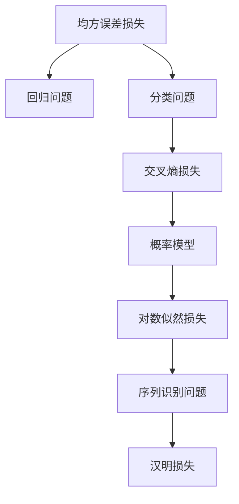

                 

## 1. 背景介绍

损失函数是机器学习领域中的一个核心概念，它定义了模型预测值与真实值之间的差距，指导模型如何从数据中学习，使得预测结果尽可能接近真实结果。在深度学习中，选择合适的损失函数对模型的训练至关重要。然而，面对复杂多样的任务，选择合适的损失函数仍然是一个挑战。本文将详细探讨损失函数的种类和选择策略，帮助读者在实际应用中做出合理的决策。

## 2. 核心概念与联系

### 2.1 核心概念概述

损失函数（Loss Function）是评估模型预测结果与真实结果之间差距的数学函数。损失函数的值越小，说明模型的预测结果与真实结果越接近。在深度学习中，常见的损失函数包括均方误差损失（Mean Squared Error, MSE）、交叉熵损失（Cross-Entropy Loss）、对数似然损失（Log-Likelihood Loss）、汉明损失（Hamming Loss）等。

这些损失函数在不同的任务和模型架构中有不同的应用。例如，均方误差损失常用于回归问题，交叉熵损失常用于分类问题，对数似然损失常用于概率模型，汉明损失常用于序列识别问题。

### 2.2 核心概念原理和架构的 Mermaid 流程图



该图展示了损失函数与不同任务和模型架构之间的映射关系。均方误差损失适用于回归问题，交叉熵损失适用于分类问题，对数似然损失适用于概率模型，汉明损失适用于序列识别问题。

## 3. 核心算法原理 & 具体操作步骤

### 3.1 算法原理概述

选择合适的损失函数，需要考虑任务的特点、模型架构以及优化算法的性质。常见的损失函数分为以下几类：

1. **回归问题损失函数**：如均方误差损失，用于评估模型预测值与真实值之间的差距。
2. **分类问题损失函数**：如交叉熵损失，用于评估模型预测值与真实标签之间的差距。
3. **序列识别问题损失函数**：如汉明损失，用于评估模型预测序列与真实序列之间的差距。
4. **概率模型损失函数**：如对数似然损失，用于评估模型预测概率分布与真实分布之间的距离。

### 3.2 算法步骤详解

选择损失函数的步骤通常包括以下几个方面：

1. **任务分析**：明确任务的性质，是回归、分类、序列识别还是概率模型。
2. **模型设计**：根据任务性质选择合适的模型架构。
3. **损失函数选择**：根据任务和模型架构选择合适的损失函数。
4. **优化算法选择**：选择合适的优化算法及其参数，如梯度下降、Adam、SGD等。
5. **训练与评估**：使用选定的损失函数和优化算法对模型进行训练，并在验证集和测试集上评估模型性能。

### 3.3 算法优缺点

不同的损失函数有不同的优缺点，需要根据具体任务和数据特点进行选择。

- **均方误差损失**：优点是简单易懂，缺点是敏感于异常值。
- **交叉熵损失**：优点是适用于多分类问题，缺点是训练时间长，容易过拟合。
- **对数似然损失**：优点是适用于概率模型，缺点是计算复杂度较高。
- **汉明损失**：优点是适用于序列识别问题，缺点是适用于二分类问题。

### 3.4 算法应用领域

不同的损失函数在不同的应用领域中有着广泛的应用。

- 在计算机视觉中，常用的损失函数包括均方误差损失、交叉熵损失、对数似然损失等。
- 在自然语言处理中，常用的损失函数包括交叉熵损失、汉明损失等。
- 在信号处理中，常用的损失函数包括均方误差损失、交叉熵损失等。

## 4. 数学模型和公式 & 详细讲解 & 举例说明

### 4.1 数学模型构建

损失函数的一般形式为：

$$
L(y,\hat{y}) = \frac{1}{N} \sum_{i=1}^N l(y_i, \hat{y}_i)
$$

其中，$N$ 是样本数量，$y$ 是真实值，$\hat{y}$ 是模型预测值，$l$ 是损失函数。

### 4.2 公式推导过程

以交叉熵损失为例，假设模型输出为 $y$，真实标签为 $t$，则交叉熵损失函数为：

$$
L(y,t) = -\frac{1}{N} \sum_{i=1}^N t_i \log y_i + (1-t_i) \log (1-y_i)
$$

其中，$t_i$ 是第 $i$ 个样本的真实标签，$y_i$ 是第 $i$ 个样本的预测值。

### 4.3 案例分析与讲解

假设有一组二分类数据，其中标签为 0 或 1，模型预测值为 $y$。则交叉熵损失函数的梯度为：

$$
\frac{\partial L(y,t)}{\partial y_i} = -\frac{t_i}{y_i} + \frac{1-t_i}{1-y_i}
$$

这意味着模型在预测错误时会受到较大的惩罚。交叉熵损失函数的这一特性使得其在二分类问题中表现出色。

## 5. 项目实践：代码实例和详细解释说明

### 5.1 开发环境搭建

在进行损失函数实践前，我们需要准备好开发环境。以下是使用Python进行TensorFlow开发的环境配置流程：

1. 安装Anaconda：从官网下载并安装Anaconda，用于创建独立的Python环境。

2. 创建并激活虚拟环境：
```bash
conda create -n tf-env python=3.8 
conda activate tf-env
```

3. 安装TensorFlow：
```bash
pip install tensorflow==2.5
```

4. 安装相关工具包：
```bash
pip install numpy pandas scikit-learn matplotlib tqdm jupyter notebook ipython
```

完成上述步骤后，即可在`tf-env`环境中开始损失函数实践。

### 5.2 源代码详细实现

下面以交叉熵损失函数的实现为例，给出使用TensorFlow进行代码实现。

```python
import tensorflow as tf
import numpy as np

# 定义交叉熵损失函数
def cross_entropy_loss(y_true, y_pred):
    y_true = tf.convert_to_tensor(y_true)
    y_pred = tf.convert_to_tensor(y_pred)
    loss = tf.reduce_mean(-tf.reduce_sum(y_true * tf.math.log(y_pred), axis=1))
    return loss

# 生成模拟数据
y_true = np.array([0, 1, 0, 1, 1, 0])
y_pred = np.array([0.1, 0.9, 0.4, 0.6, 0.8, 0.2])

# 计算交叉熵损失
loss = cross_entropy_loss(y_true, y_pred)
print("交叉熵损失：", loss.numpy())
```

### 5.3 代码解读与分析

让我们再详细解读一下关键代码的实现细节：

**cross_entropy_loss函数**：
- `y_true`和`y_pred`分别是真实标签和模型预测值，均为TensorFlow张量。
- 计算交叉熵损失，即每个样本的真实标签与模型预测值的交叉熵之和，并取平均值。

**模拟数据生成**：
- 生成二分类数据，其中真实标签为0或1，模型预测值为0到1之间的随机数。

**交叉熵损失计算**：
- 计算交叉熵损失，并输出结果。

## 6. 实际应用场景

### 6.1 图像分类

在图像分类任务中，交叉熵损失是最常用的损失函数之一。它能够有效评估模型预测值与真实标签之间的差距，从而指导模型学习。

以ImageNet数据集为例，可以使用交叉熵损失函数对卷积神经网络进行训练，使得模型能够准确分类图像。

### 6.2 自然语言处理

在自然语言处理中，交叉熵损失函数也得到了广泛应用。例如，在文本分类任务中，可以使用交叉熵损失函数对模型进行训练，使得模型能够准确预测文本的类别。

以情感分析任务为例，可以使用交叉熵损失函数对模型进行训练，使得模型能够准确预测文本的情感极性。

### 6.3 序列生成

在序列生成任务中，如机器翻译、文本生成等，汉明损失函数和交叉熵损失函数常用于评估模型生成的序列与真实序列之间的差距。

例如，在机器翻译任务中，可以使用汉明损失函数评估模型生成的翻译文本与真实翻译文本之间的差距，从而指导模型学习。

### 6.4 未来应用展望

随着深度学习技术的发展，损失函数的选择将更加多样化和灵活。未来可能会出现更多的创新型损失函数，用于解决特定的任务和问题。例如，对比损失函数（Contrastive Loss）、Focal Loss等，将为模型的训练提供新的思路和工具。

## 7. 工具和资源推荐

### 7.1 学习资源推荐

为了帮助开发者系统掌握损失函数的理论基础和实践技巧，这里推荐一些优质的学习资源：

1. 《Deep Learning》书籍：Ian Goodfellow所著，全面介绍了深度学习的理论基础和算法细节，包括损失函数等核心概念。

2. Coursera《深度学习专项课程》：由Andrew Ng主讲，涵盖深度学习的各个方面，包括损失函数的设计与选择。

3. TensorFlow官方文档：TensorFlow的官方文档，提供了丰富的教程和样例代码，帮助开发者深入理解损失函数的实现和使用。

4. PyTorch官方文档：PyTorch的官方文档，提供了丰富的教程和样例代码，帮助开发者深入理解损失函数的实现和使用。

5. Kaggle竞赛：Kaggle平台上有许多数据科学竞赛，可以实际应用损失函数来解决实际问题，积累经验。

通过对这些资源的学习实践，相信你一定能够快速掌握损失函数的精髓，并用于解决实际的深度学习问题。

### 7.2 开发工具推荐

高效的开发离不开优秀的工具支持。以下是几款用于损失函数开发的常用工具：

1. TensorFlow：由Google主导开发的深度学习框架，提供丰富的损失函数库和优化算法，适用于大规模工程应用。

2. PyTorch：由Facebook主导开发的深度学习框架，灵活动态的计算图，适合快速迭代研究。

3. Keras：基于TensorFlow和Theano的高层API，易于使用，适合初学者快速上手。

4. Weights & Biases：模型训练的实验跟踪工具，可以记录和可视化模型训练过程中的各项指标，方便对比和调优。

5. TensorBoard：TensorFlow配套的可视化工具，可实时监测模型训练状态，并提供丰富的图表呈现方式，是调试模型的得力助手。

合理利用这些工具，可以显著提升损失函数的开发效率，加快创新迭代的步伐。

### 7.3 相关论文推荐

损失函数的设计和选择是深度学习研究的热点之一，以下是几篇奠基性的相关论文，推荐阅读：

1. 《Understanding the difficulty of training deep feedforward neural networks》：研究了深度神经网络的训练难度，并提出了数据增强和权重初始化等优化策略。

2. 《Efficient Backprop》：提出反向传播算法，为深度学习的训练提供了数学基础。

3. 《ImageNet Classification with Deep Convolutional Neural Networks》：提出了使用交叉熵损失函数训练卷积神经网络，并在ImageNet数据集上取得了优异的分类结果。

4. 《Sequence to Sequence Learning with Neural Networks》：研究了使用序列生成任务训练循环神经网络，并提出了基于序列的交叉熵损失函数。

5. 《Adversarial Examples in Deep Neural Networks》：研究了对抗性样本对深度神经网络的影响，并提出了对抗性损失函数。

这些论文代表了大损失函数的发展脉络。通过学习这些前沿成果，可以帮助研究者把握学科前进方向，激发更多的创新灵感。

## 8. 总结：未来发展趋势与挑战

### 8.1 总结

本文对损失函数的概念、种类和选择策略进行了全面系统的介绍。首先阐述了损失函数在深度学习中的核心地位，明确了选择合适的损失函数对模型训练的重要性。其次，从原理到实践，详细讲解了损失函数的数学模型和实现方法，给出了损失函数实践的完整代码实例。同时，本文还探讨了损失函数在不同任务和应用领域中的应用，展示了损失函数的强大潜力。此外，本文精选了损失函数的各类学习资源，力求为读者提供全方位的技术指引。

通过本文的系统梳理，可以看到，损失函数在深度学习中具有至关重要的作用，选择合适的损失函数能够显著提升模型的训练效果。未来，随着深度学习技术的不断演进，损失函数的设计和选择将继续得到更多关注和研究。

### 8.2 未来发展趋势

展望未来，损失函数的发展趋势将呈现以下几个方面：

1. 更加多样化和灵活。随着任务的复杂化，需要设计更多样化和灵活的损失函数，以适应不同的数据分布和模型架构。
2. 更加高效和可解释。需要开发更高效的损失函数计算方法，并提高损失函数的可解释性，使得开发者更容易理解模型的训练过程。
3. 更加鲁棒和稳定。需要设计更加鲁棒和稳定的损失函数，避免过拟合和梯度消失等问题，提高模型的泛化能力。
4. 更加多模态和融合。需要设计更多模态的损失函数，并与其他领域的技术进行融合，提高模型的跨领域能力。

以上趋势凸显了损失函数在深度学习中的重要性。这些方向的探索发展，将为深度学习的训练和优化提供新的思路和工具。

### 8.3 面临的挑战

尽管损失函数的设计和选择已经取得了显著进展，但在实现高效、鲁棒、多模态的损失函数时，仍然面临诸多挑战：

1. 计算复杂度：设计高效的损失函数计算方法，避免过高的计算复杂度，成为一大难题。
2. 鲁棒性问题：设计鲁棒和稳定的损失函数，避免模型对异常值和噪声的敏感，需要更多的理论和实践积累。
3. 多模态融合：设计多模态的损失函数，并与其他领域的技术进行融合，实现跨领域能力的提升，还有很大的想象空间。

这些挑战展示了损失函数在深度学习中的复杂性和重要性。需要更多理论与实践的结合，才能实现损失函数设计的多样化和高效化。

### 8.4 研究展望

面对损失函数所面临的种种挑战，未来的研究需要在以下几个方面寻求新的突破：

1. 探索多模态损失函数。结合不同模态的数据，设计更加灵活和高效的损失函数，提高模型的跨领域能力。
2. 融合因果和对比学习。引入因果推断和对比学习思想，增强损失函数的鲁棒性和泛化能力。
3. 引入先验知识。将符号化的先验知识与神经网络模型进行融合，引导损失函数的优化过程，提高模型的性能。
4. 结合生成对抗网络（GAN）。将GAN技术引入损失函数的设计和优化中，提高模型的生成能力和稳定性。

这些研究方向的探索，将引领损失函数的发展，为深度学习的训练和优化提供新的思路和工具。面向未来，需要更多理论与实践的结合，才能实现损失函数的优化和创新。

## 9. 附录：常见问题与解答

**Q1：什么是损失函数？**

A: 损失函数是评估模型预测值与真实值之间差距的数学函数。其值越小，表示模型的预测结果与真实结果越接近。

**Q2：如何选择合适的损失函数？**

A: 选择合适的损失函数需要考虑任务的特点、模型架构以及优化算法的性质。一般来说，回归问题选择均方误差损失，分类问题选择交叉熵损失，序列识别问题选择汉明损失，概率模型选择对数似然损失等。

**Q3：损失函数在深度学习中扮演什么角色？**

A: 损失函数在深度学习中扮演着重要的角色。它定义了模型预测值与真实值之间的差距，指导模型如何从数据中学习，使得预测结果尽可能接近真实结果。

**Q4：常用的损失函数有哪些？**

A: 常用的损失函数包括均方误差损失、交叉熵损失、对数似然损失、汉明损失等。不同的损失函数适用于不同的任务和模型架构。

**Q5：如何评估损失函数的性能？**

A: 评估损失函数的性能通常使用模型在验证集和测试集上的性能指标，如准确率、召回率、F1-score等。同时，还可以观察损失函数的梯度分布和训练速度等指标。

---

作者：禅与计算机程序设计艺术 / Zen and the Art of Computer Programming

