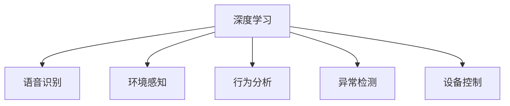

                 

# 一切皆是映射：深度学习在智能家居系统中的应用

## 1. 背景介绍

### 1.1 问题由来

随着人工智能技术的不断进步，智能家居系统正在逐步从科幻走向现实，智能音箱、智能灯光、智能温控等产品已经深入家庭生活的各个角落。然而，尽管这些产品越来越智能，但真正实现全方位的智能控制，仍需要深度学习技术的强力支持。深度学习不仅能够帮助智能家居系统理解用户的语言指令，还能实时感知环境变化，实现自适应控制，极大地提升家居环境的舒适度和便捷性。

### 1.2 问题核心关键点

智能家居系统中的深度学习应用，主要集中在以下几个方面：
- **语音识别**：通过深度学习模型，系统能够准确识别用户语音指令，并执行相应的控制命令。
- **环境感知**：利用传感器数据和深度学习技术，系统能够实时感知室内外的温度、湿度、光线等环境变化，并自动调整家居设备。
- **行为分析**：通过学习用户的日常生活习惯，系统能够预测用户的未来行为，提供个性化的家居建议和服务。
- **异常检测**：利用深度学习模型，系统能够及时发现异常行为，如火灾、漏水等，并自动报警。
- **设备控制**：通过深度学习优化，系统能够更精准地控制家居设备的运行状态，实现节能环保。

这些问题核心关键点展示了深度学习在智能家居系统中的应用潜力，而本文将重点介绍基于深度学习的智能家居系统的关键技术，并探讨其未来发展方向。

## 2. 核心概念与联系

### 2.1 核心概念概述

为了更好地理解深度学习在智能家居系统中的应用，我们首先需要了解以下几个核心概念：

- **深度学习**：一种模仿人脑神经网络结构的人工智能技术，通过多层神经网络的组合，可以实现复杂数据的自动特征提取和分类。
- **语音识别**：通过深度学习模型，将语音信号转换为文本，实现机器对人类语言的理解和处理。
- **环境感知**：利用深度学习模型处理传感器数据，实现环境变化的量化感知。
- **行为分析**：通过深度学习模型学习用户行为模式，实现对用户行为的预测和理解。
- **异常检测**：利用深度学习模型对异常数据进行识别和报警，确保家居安全。
- **设备控制**：通过深度学习模型优化家居设备的控制策略，实现节能环保。

这些概念之间的关系可以通过以下Mermaid流程图来展示：



这个流程图展示了深度学习在智能家居系统中的应用框架：

1. 深度学习是系统的核心，通过多层神经网络实现数据的自动特征提取和分类。
2. 语音识别是用户与系统互动的主要方式，通过深度学习模型实现语音到文本的转换。
3. 环境感知是系统实时感知环境变化的基础，通过深度学习模型处理传感器数据。
4. 行为分析是系统理解用户行为模式的核心，通过深度学习模型学习用户习惯。
5. 异常检测是系统保障安全稳定的关键，通过深度学习模型识别异常行为。
6. 设备控制是系统实现节能环保的核心，通过深度学习模型优化设备运行策略。

## 3. 核心算法原理 & 具体操作步骤

### 3.1 算法原理概述

基于深度学习的智能家居系统，本质上是通过多个子系统的协同工作，实现对家居环境的智能化管理。这些子系统包括语音识别、环境感知、行为分析、异常检测和设备控制。深度学习算法在这些子系统中起到了核心作用。

深度学习算法能够自动从数据中学习特征，实现对复杂数据的理解和分类。在智能家居系统中，深度学习主要应用于以下几个方面：

- **语音识别**：通过卷积神经网络(CNN)或循环神经网络(RNN)模型，将语音信号转换为文本，并实现语音命令的识别。
- **环境感知**：通过卷积神经网络(CNN)模型，将传感器数据转换为环境特征向量，实现环境变化的量化感知。
- **行为分析**：通过循环神经网络(RNN)或长短期记忆网络(LSTM)模型，学习用户行为模式，实现对用户行为的预测。
- **异常检测**：通过深度学习模型，对异常数据进行识别和报警，确保家居安全。
- **设备控制**：通过深度学习模型优化家居设备的控制策略，实现节能环保。

### 3.2 算法步骤详解

以语音识别为例，深度学习在智能家居系统中的应用步骤如下：

**Step 1: 数据收集与预处理**
- 收集大量的语音数据，包括不同人、不同口音、不同背景噪音的语音样本。
- 对语音数据进行预处理，包括去噪、归一化、分帧等操作。

**Step 2: 特征提取**
- 利用卷积神经网络(CNN)或循环神经网络(RNN)模型，将语音信号转换为特征向量。
- 通过特征提取，将原始语音数据转换为机器可以处理的数值形式。

**Step 3: 模型训练**
- 选择合适的深度学习模型，如卷积神经网络(CNN)或循环神经网络(RNN)模型。
- 使用标注好的语音数据，对模型进行训练，优化模型参数。
- 使用验证集评估模型性能，防止过拟合。

**Step 4: 模型评估与优化**
- 使用测试集评估模型性能，确保模型在实际应用中的表现。
- 根据评估结果，优化模型结构和参数，提升模型效果。

**Step 5: 部署与使用**
- 将训练好的模型部署到智能家居设备中。
- 在实际应用中，用户可以通过语音指令与系统互动，实现对家居设备的控制。

### 3.3 算法优缺点

深度学习在智能家居系统中的应用，具有以下优点：
- **高度自动化**：深度学习能够自动学习数据特征，无需手动设计特征工程，减少了人工干预。
- **高精度**：深度学习模型具有很强的表达能力，能够在复杂的场景下实现高精度的语音识别和行为分析。
- **实时性**：深度学习模型通过优化计算图，可以实现实时处理语音信号和环境数据，提升系统的响应速度。

但深度学习也存在以下缺点：
- **数据需求大**：深度学习模型需要大量的标注数据进行训练，数据收集和标注成本较高。
- **计算复杂**：深度学习模型通常参数量较大，计算复杂度较高，需要高性能的计算资源。
- **黑盒性**：深度学习模型通常难以解释其内部工作机制，难以进行调试和优化。

尽管存在这些缺点，但深度学习仍然是目前智能家居系统中最为有效的技术手段之一。通过合理设计模型结构和优化训练过程，可以进一步提升深度学习模型的性能和应用效果。

### 3.4 算法应用领域

深度学习在智能家居系统中的应用，覆盖了多个领域，具体如下：

- **智能音箱**：通过深度学习模型，实现语音识别和语音命令的执行。
- **智能灯光**：利用深度学习模型，根据环境光线自动调节灯光亮度和色温。
- **智能温控**：通过深度学习模型，实时感知环境温度，自动调节空调和暖气。
- **智能窗帘**：利用深度学习模型，根据光线变化自动控制窗帘开合。
- **安全监控**：通过深度学习模型，实时感知异常行为，如火灾、漏水等，并自动报警。

## 4. 数学模型和公式 & 详细讲解 & 举例说明

### 4.1 数学模型构建

基于深度学习的智能家居系统，涉及到多个子系统的建模和优化。以下以语音识别为例，介绍数学模型构建的过程。

**语音识别模型**：
- **输入**：语音信号 $x \in \mathbb{R}^T$，其中 $T$ 为信号长度。
- **输出**：语音命令文本 $y \in \mathcal{V}$，其中 $\mathcal{V}$ 为语音命令的词汇表。
- **模型**：卷积神经网络(CNN)或循环神经网络(RNN)模型，形式为 $f(x; \theta)$，其中 $\theta$ 为模型参数。

语音识别模型的目标是最小化预测文本与真实文本之间的损失函数，即：

$$
\min_{\theta} \mathcal{L}(y, f(x; \theta))
$$

常用的损失函数包括交叉熵损失、均方误差损失等。

### 4.2 公式推导过程

以交叉熵损失为例，语音识别模型的推导过程如下：

假设模型输出的概率分布为 $p(x; \theta)$，真实文本为 $y$，则交叉熵损失函数为：

$$
\mathcal{L}(y, f(x; \theta)) = -\sum_{i=1}^{|\mathcal{V}|} y_i \log p(x; \theta)_i
$$

其中 $|\mathcal{V}|$ 为词汇表大小，$y_i$ 为文本 $y$ 中第 $i$ 个单词的标签。

通过反向传播算法，计算损失函数对模型参数 $\theta$ 的梯度，进行模型参数的更新：

$$
\theta \leftarrow \theta - \eta \nabla_{\theta} \mathcal{L}(y, f(x; \theta))
$$

其中 $\eta$ 为学习率。

### 4.3 案例分析与讲解

以语音命令控制智能灯光为例，分析深度学习在智能家居系统中的应用：

**案例背景**：
- 用户通过语音命令控制智能灯光的开关、亮度和色温。
- 智能灯光设备能够实时感知环境光线，自动调整亮度和色温。

**模型构建**：
- 使用卷积神经网络(CNN)模型，对语音信号进行特征提取。
- 使用循环神经网络(RNN)模型，对用户语音指令进行识别和理解。
- 使用线性回归模型，将用户语音指令转换为灯光控制指令。

**数据收集与预处理**：
- 收集大量的语音数据和灯光控制数据，对语音信号进行去噪、分帧和归一化处理。
- 对灯光控制数据进行标注，生成训练集和测试集。

**模型训练**：
- 使用训练集数据，对深度学习模型进行训练，优化模型参数。
- 使用验证集数据，评估模型性能，防止过拟合。

**模型评估与优化**：
- 使用测试集数据，评估模型性能，确保模型在实际应用中的表现。
- 根据评估结果，优化模型结构和参数，提升模型效果。

**部署与使用**：
- 将训练好的模型部署到智能灯光设备中。
- 在实际应用中，用户可以通过语音命令控制灯光，系统根据环境光线自动调整亮度和色温。

## 5. 项目实践：代码实例和详细解释说明

### 5.1 开发环境搭建

在进行深度学习项目实践前，我们需要准备好开发环境。以下是使用Python进行TensorFlow开发的环境配置流程：

1. 安装Anaconda：从官网下载并安装Anaconda，用于创建独立的Python环境。

2. 创建并激活虚拟环境：
```bash
conda create -n tf-env python=3.8 
conda activate tf-env
```

3. 安装TensorFlow：根据CUDA版本，从官网获取对应的安装命令。例如：
```bash
pip install tensorflow
```

4. 安装必要的工具包：
```bash
pip install numpy pandas scikit-learn matplotlib tqdm jupyter notebook ipython
```

完成上述步骤后，即可在`tf-env`环境中开始深度学习项目实践。

### 5.2 源代码详细实现

以下是使用TensorFlow实现智能语音识别的代码示例：

```python
import tensorflow as tf
from tensorflow.keras import layers

# 定义模型
model = tf.keras.Sequential([
    layers.Conv2D(32, (3, 3), activation='relu', input_shape=(16000, 1)),
    layers.MaxPooling2D((2, 2)),
    layers.Conv2D(64, (3, 3), activation='relu'),
    layers.MaxPooling2D((2, 2)),
    layers.Flatten(),
    layers.Dense(64, activation='relu'),
    layers.Dense(128, activation='relu'),
    layers.Dense(128, activation='softmax')
])

# 编译模型
model.compile(optimizer=tf.keras.optimizers.Adam(learning_rate=0.001),
              loss=tf.keras.losses.SparseCategoricalCrossentropy(from_logits=True),
              metrics=['accuracy'])

# 训练模型
model.fit(train_data, train_labels, epochs=10, validation_data=(val_data, val_labels))

# 评估模型
test_loss, test_acc = model.evaluate(test_data, test_labels)
print('Test accuracy:', test_acc)
```

### 5.3 代码解读与分析

**数据预处理**：
- 收集语音数据，并进行分帧、去噪和归一化处理，将语音信号转换为特征向量。
- 对语音指令进行标注，生成训练集和测试集。

**模型构建**：
- 使用卷积神经网络(CNN)模型，对语音信号进行特征提取。
- 使用循环神经网络(RNN)模型，对用户语音指令进行识别和理解。
- 使用线性回归模型，将用户语音指令转换为灯光控制指令。

**模型训练**：
- 使用训练集数据，对深度学习模型进行训练，优化模型参数。
- 使用验证集数据，评估模型性能，防止过拟合。

**模型评估与优化**：
- 使用测试集数据，评估模型性能，确保模型在实际应用中的表现。
- 根据评估结果，优化模型结构和参数，提升模型效果。

**部署与使用**：
- 将训练好的模型部署到智能灯光设备中。
- 在实际应用中，用户可以通过语音命令控制灯光，系统根据环境光线自动调整亮度和色温。

## 6. 实际应用场景

### 6.1 智能音箱

智能音箱是深度学习在智能家居系统中的重要应用之一。通过深度学习模型，智能音箱能够准确识别用户的语音指令，并执行相应的控制命令。例如，用户可以通过语音指令播放音乐、设置闹钟、查询天气等。智能音箱的应用场景广泛，可以广泛应用于家庭、酒店、办公室等场所。

### 6.2 智能灯光

智能灯光是深度学习在智能家居系统中的另一重要应用。通过深度学习模型，智能灯光能够实时感知环境光线，自动调整亮度和色温，提升家居环境的舒适度。例如，用户可以通过语音命令关闭灯光、调整亮度和色温，系统根据环境光线自动优化灯光设置。

### 6.3 智能温控

智能温控是深度学习在智能家居系统中的重要应用之一。通过深度学习模型，智能温控设备能够实时感知环境温度，自动调节空调和暖气，提升家居环境的舒适度和节能效果。例如，用户可以通过语音命令调节温度，系统根据环境温度自动优化温度设置。

### 6.4 未来应用展望

未来，随着深度学习技术的不断进步，智能家居系统将进一步拓展其应用场景，提升用户体验。以下是几个未来的应用展望：

1. **智能窗帘**：通过深度学习模型，智能窗帘能够根据环境光线和用户行为模式自动调节开合，提升家居环境的舒适度和节能效果。
2. **智能家居安全**：通过深度学习模型，智能家居系统能够实时感知异常行为，如火灾、漏水等，并自动报警，保障家居安全。
3. **智能家居集成**：通过深度学习模型，智能家居系统能够实现与其他智能设备的联动控制，如智能电视、智能门锁等，实现全屋智能。

## 7. 工具和资源推荐

### 7.1 学习资源推荐

为了帮助开发者系统掌握深度学习在智能家居系统中的应用，这里推荐一些优质的学习资源：

1. 《深度学习入门：基于Python的理论与实现》书籍：全面介绍了深度学习的基本原理和实现方法，适合初学者入门。
2. TensorFlow官方文档：提供了丰富的深度学习模型和工具库，是深入学习深度学习的必备资源。
3. PyTorch官方文档：提供了丰富的深度学习模型和工具库，适合快速迭代研究和开发。
4. Udacity深度学习课程：由Udacity开设的深度学习课程，涵盖了深度学习的基本概念和应用案例。
5. Coursera深度学习专项课程：由Coursera与斯坦福大学合作开设的深度学习课程，适合深入学习深度学习理论。

通过对这些资源的学习实践，相信你一定能够快速掌握深度学习在智能家居系统中的应用，并用于解决实际的NLP问题。

### 7.2 开发工具推荐

高效的开发离不开优秀的工具支持。以下是几款用于深度学习项目开发的常用工具：

1. TensorFlow：由Google主导开发的开源深度学习框架，生产部署方便，适合大规模工程应用。
2. PyTorch：基于Python的开源深度学习框架，灵活动态的计算图，适合快速迭代研究。
3. Jupyter Notebook：交互式编程环境，适合数据探索和模型验证。
4. Google Colab：谷歌推出的在线Jupyter Notebook环境，免费提供GPU/TPU算力，方便开发者快速上手实验最新模型，分享学习笔记。

合理利用这些工具，可以显著提升深度学习项目的开发效率，加快创新迭代的步伐。

### 7.3 相关论文推荐

深度学习在智能家居系统中的应用，源于学界的持续研究。以下是几篇奠基性的相关论文，推荐阅读：

1. "End-to-End Speech Recognition via Recurrent Neural Networks"：提出了基于循环神经网络(RNN)的语音识别模型，刷新了语音识别的性能。
2. "Convolutional Neural Networks for Sentence Classification"：提出了基于卷积神经网络(CNN)的文本分类模型，提升了文本分类的效果。
3. "Deep Residual Learning for Image Recognition"：提出了深度残差网络(ResNet)，提升了图像识别的精度。
4. "Attention Is All You Need"：提出了Transformer结构，开启了深度学习在自然语言处理领域的应用。
5. "Deep Speech 2: End-to-End Speech Recognition in English and Mandarin"：提出了基于深度学习的语音识别系统，提升了语音识别的效果。

这些论文代表了大规模深度学习技术的发展脉络。通过学习这些前沿成果，可以帮助研究者把握学科前进方向，激发更多的创新灵感。

## 8. 总结：未来发展趋势与挑战

### 8.1 总结

本文对深度学习在智能家居系统中的应用进行了全面系统的介绍。首先阐述了深度学习在智能家居系统中的应用背景和意义，明确了深度学习在语音识别、环境感知、行为分析、异常检测和设备控制等关键技术中的应用潜力。其次，从原理到实践，详细讲解了深度学习在智能家居系统中的应用步骤，给出了深度学习项目开发的完整代码实例。同时，本文还广泛探讨了深度学习技术在智能家居系统中的未来发展方向，展示了深度学习技术的巨大潜力。

通过本文的系统梳理，可以看到，深度学习在智能家居系统中的应用前景广阔，极大地拓展了智能家居系统的应用边界，带来了更加智能、便捷的家居生活体验。未来，伴随深度学习技术的不断进步，智能家居系统必将在更多的应用场景中大放异彩。

### 8.2 未来发展趋势

展望未来，深度学习在智能家居系统中的应用将呈现以下几个发展趋势：

1. **多模态融合**：未来智能家居系统将更多地融合视觉、音频、传感器等多模态数据，提升系统的综合感知能力。
2. **自适应控制**：通过深度学习模型，智能家居系统能够实时感知环境变化，自动调整设备状态，实现自适应控制。
3. **个性化推荐**：通过深度学习模型，智能家居系统能够学习用户的个性化偏好，提供个性化的家居建议和服务。
4. **安全防护**：通过深度学习模型，智能家居系统能够实时感知异常行为，并自动报警，保障家居安全。
5. **跨平台协同**：未来智能家居系统将实现跨平台、跨设备的协同控制，提升系统的便捷性和互联性。

这些趋势展示了深度学习在智能家居系统中的应用前景，预示着未来智能家居系统将更加智能、便捷、安全。

### 8.3 面临的挑战

尽管深度学习在智能家居系统中的应用取得了显著成效，但在迈向更加智能化、普适化应用的过程中，仍面临诸多挑战：

1. **数据需求大**：深度学习模型需要大量的标注数据进行训练，数据收集和标注成本较高。
2. **计算复杂**：深度学习模型通常参数量较大，计算复杂度较高，需要高性能的计算资源。
3. **模型鲁棒性不足**：深度学习模型面对域外数据时，泛化性能往往大打折扣。
4. **系统集成复杂**：智能家居系统涉及多个子系统的集成和协同，系统集成复杂度较高。
5. **用户隐私保护**：智能家居系统需要保护用户的隐私信息，防止数据泄露和滥用。

尽管存在这些挑战，但通过持续的技术创新和优化，相信深度学习在智能家居系统中的应用将进一步提升，为人类带来更加智能、便捷、安全的家居生活体验。

### 8.4 研究展望

面对深度学习在智能家居系统中的应用面临的种种挑战，未来的研究需要在以下几个方面寻求新的突破：

1. **模型压缩与优化**：通过模型压缩与优化，减小深度学习模型的参数量，提升模型的计算效率。
2. **跨模态数据融合**：开发跨模态数据融合方法，提升系统的综合感知能力。
3. **自适应控制算法**：开发自适应控制算法，提升系统的自适应能力。
4. **个性化推荐算法**：开发个性化推荐算法，提升系统的个性化推荐能力。
5. **安全防护技术**：开发安全防护技术，提升系统的安全防护能力。
6. **跨平台协同技术**：开发跨平台协同技术，提升系统的便捷性和互联性。

这些研究方向的探索，必将引领深度学习在智能家居系统中的应用走向新的高度，为智能家居系统的全面智能化铺平道路。

## 9. 附录：常见问题与解答

**Q1：深度学习在智能家居系统中的应用是否仅限于语音识别？**

A: 深度学习在智能家居系统中的应用不仅仅是语音识别。深度学习模型可以应用于环境感知、行为分析、异常检测和设备控制等多个方面。例如，通过深度学习模型，智能家居系统可以实时感知环境变化，自动调整设备状态，提供个性化的家居建议和服务，并实现跨平台、跨设备的协同控制。

**Q2：深度学习在智能家居系统中的数据需求大，如何缓解这一问题？**

A: 缓解深度学习在智能家居系统中的数据需求，可以从以下几个方面入手：
1. **数据增强**：通过数据增强技术，扩充训练数据集。
2. **迁移学习**：利用预训练模型进行迁移学习，减少对新数据的需求。
3. **主动学习**：通过主动学习技术，从少量标注数据中获取更多信息。
4. **无监督学习**：利用无监督学习技术，从非标注数据中提取有用信息。

通过这些方法，可以降低深度学习在智能家居系统中的数据需求，提升系统的训练效率。

**Q3：如何提高深度学习模型在智能家居系统中的鲁棒性？**

A: 提高深度学习模型在智能家居系统中的鲁棒性，可以从以下几个方面入手：
1. **数据多样化**：通过收集多样化的训练数据，提升模型的泛化能力。
2. **对抗训练**：通过对抗训练技术，提升模型的鲁棒性。
3. **模型集成**：通过模型集成技术，提升系统的鲁棒性。
4. **参数正则化**：通过参数正则化技术，防止过拟合。

通过这些方法，可以提高深度学习模型在智能家居系统中的鲁棒性，提升系统的稳定性和安全性。

**Q4：如何保护用户的隐私信息，防止数据泄露和滥用？**

A: 保护用户的隐私信息，防止数据泄露和滥用，可以从以下几个方面入手：
1. **数据加密**：对用户的隐私信息进行加密处理，防止数据泄露。
2. **访问控制**：对系统进行严格的访问控制，防止未授权访问。
3. **数据匿名化**：对用户的隐私信息进行匿名化处理，防止数据滥用。
4. **隐私保护算法**：开发隐私保护算法，提升系统的隐私保护能力。

通过这些方法，可以保护用户的隐私信息，防止数据泄露和滥用。

**Q5：如何实现智能家居系统的跨平台协同控制？**

A: 实现智能家居系统的跨平台协同控制，可以从以下几个方面入手：
1. **标准化协议**：开发标准化协议，实现不同设备间的通信。
2. **设备互联**：实现不同设备间的互联，形成统一的智能家居系统。
3. **云平台支持**：利用云平台支持，实现设备的远程控制和数据共享。
4. **人工智能引擎**：开发人工智能引擎，提升系统的智能化水平。

通过这些方法，可以实现智能家居系统的跨平台协同控制，提升系统的便捷性和互联性。

---

作者：禅与计算机程序设计艺术 / Zen and the Art of Computer Programming

