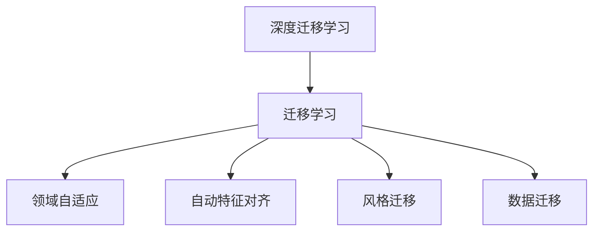
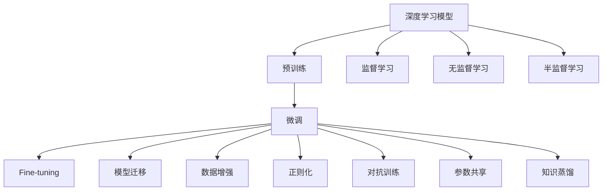

                 

# 一切皆是映射：深度迁移学习：AI在不同域间的知识转移

> 关键词：深度迁移学习,知识转移,迁移学习,神经网络,领域自适应,自动特征对齐,风格迁移,数据迁移

## 1. 背景介绍

### 1.1 问题由来
随着人工智能技术的发展，深度学习模型在计算机视觉、自然语言处理、语音识别等多个领域取得了显著的突破。这些模型通常需要大量的标注数据进行训练，才能获得较好的泛化能力。然而，在实际应用中，获取大规模标注数据的成本往往非常高昂。同时，不同领域的数据分布可能存在较大差异，使得通用模型在不同领域的应用效果并不理想。

为解决这些问题，研究人员提出了迁移学习(Transfer Learning)的概念，即利用已有的知识，在不同任务或领域之间进行知识的迁移。迁移学习不仅可以提高模型的泛化能力，还能降低标注数据的成本。近年来，迁移学习已经成为深度学习领域的一大热门研究方向，并在计算机视觉、自然语言处理等多个领域得到了广泛应用。

## 2. 核心概念与联系

### 2.1 核心概念概述
为更好地理解深度迁移学习，我们首先介绍一些核心概念：

- **深度迁移学习**：利用已有知识在不同任务或领域之间的迁移学习过程，以提高模型在新任务上的性能。深度迁移学习可以应用于同一模态内（如图像、文本、语音），也可以应用于不同模态之间的迁移。

- **迁移学习**：将在一个任务或领域上训练得到的知识，迁移到另一个任务或领域上，以提高新任务或领域的性能。迁移学习是一种通用的学习方法，可以应用于不同的深度学习模型和任务。

- **领域自适应**：指将模型从一个领域适应到另一个领域，以提高在新领域上的性能。领域自适应是迁移学习中的一种重要方法，通过调整模型参数，使得模型能够更好地适应目标领域的特征。

- **自动特征对齐**：指在不同领域之间，对模型提取的特征进行对齐，使得特征在两个领域中具有相似的表达。自动特征对齐是实现领域自适应的关键技术。

- **风格迁移**：指将输入数据从一种风格转换为另一种风格，如将照片转换为绘画风格。风格迁移通常使用神经网络模型实现，可以通过迁移学习实现风格迁移任务。

- **数据迁移**：指将数据从一种分布迁移到另一种分布，以提高模型在新数据分布上的性能。数据迁移通常使用迁移学习实现，可以通过调整模型参数来提高在新数据分布上的表现。

这些核心概念之间的逻辑关系可以通过以下Mermaid流程图来展示：



### 2.2 核心概念原理和架构的 Mermaid 流程图


## 3. 核心算法原理 & 具体操作步骤

### 3.1 算法原理概述
深度迁移学习的核心思想是利用已有知识，在不同任务或领域之间进行知识的迁移。具体来说，深度迁移学习通过预训练和微调两个步骤，将预训练模型迁移到新任务上。

预训练阶段，将大规模无标签数据输入模型进行训练，学习到通用的特征表示。微调阶段，将预训练模型迁移到新任务上，通过有限的数据进行进一步训练，获得新任务的特征表示。最终，微调后的模型在新任务上能够取得较好的性能。

### 3.2 算法步骤详解

#### 3.2.1 预训练阶段
预训练阶段的目标是学习到通用的特征表示。常用的预训练方法包括：

- 自监督学习：使用无标签数据进行训练，学习到数据的内部表示。如AutoEncoder、Siamese Network等。

- 自回归学习：使用无标签数据进行训练，学习到数据的生成分布。如Language Modeling、Image Captioning等。

- 对比学习：通过将模型输出的表示映射到不同的空间，学习到数据的相似性和区分性。如SimCLR、Moco等。

常用的预训练模型包括：

- 自编码器：如VGG、ResNet等。
- 自回归模型：如BERT、GPT等。
- 对比学习模型：如SimCLR、MoCo等。

#### 3.2.2 微调阶段
微调阶段的目标是利用预训练模型的知识，在特定任务上进一步训练，获得更好的性能。常用的微调方法包括：

- Fine-tuning：将预训练模型迁移到特定任务上，通过有限的数据进行进一步训练，获得新任务的特征表示。

- 参数共享：只微调模型的一部分参数，其余参数保持不变，以提高模型的泛化能力。

- 知识蒸馏：利用预训练模型的知识，通过教师模型指导学生模型进行训练。

#### 3.2.3 算法步骤总结
深度迁移学习的算法步骤如下：

1. 准备数据集：准备预训练和微调所需的训练集和测试集，包括标签和特征。
2. 选择模型：选择适合预训练和微调的深度学习模型。
3. 预训练：在大规模无标签数据上对模型进行预训练。
4. 微调：在特定任务上对预训练模型进行微调，获得新任务的特征表示。
5. 评估：在测试集上评估微调后的模型性能。

### 3.3 算法优缺点

#### 3.3.1 优点
- 泛化能力强：预训练模型学习到通用的特征表示，能够在不同的任务上获得较好的性能。
- 降低成本：通过迁移学习，可以利用已有知识，降低标注数据的成本。
- 灵活性强：可以通过参数共享和知识蒸馏等方法，对模型进行灵活调整，适应不同的任务和领域。

#### 3.3.2 缺点
- 数据分布差异：预训练模型和微调模型数据分布的差异可能会影响迁移效果。
- 过拟合风险：微调模型可能会过拟合于特定任务，降低泛化能力。
- 模型复杂度高：预训练和微调过程需要大量的时间和计算资源，模型复杂度高。

### 3.4 算法应用领域

深度迁移学习在计算机视觉、自然语言处理、语音识别等多个领域得到了广泛应用。以下是几个典型的应用场景：

- 计算机视觉：图像分类、目标检测、图像分割等任务。预训练模型如ResNet、VGG等，微调模型如Fine-tuning、参数共享等。
- 自然语言处理：机器翻译、文本分类、情感分析等任务。预训练模型如BERT、GPT等，微调模型如Fine-tuning、知识蒸馏等。
- 语音识别：语音识别、语音情感分析等任务。预训练模型如DeepSpeech、Wav2Letter等，微调模型如Fine-tuning、参数共享等。
- 医疗领域：医疗影像分析、病理诊断等任务。预训练模型如ResNet、VGG等，微调模型如Fine-tuning、参数共享等。
- 金融领域：金融数据分析、股票预测等任务。预训练模型如BERT、GPT等，微调模型如Fine-tuning、参数共享等。

## 4. 数学模型和公式 & 详细讲解

### 4.1 数学模型构建
深度迁移学习的数学模型可以表示为：

$$
y = f_{\theta}(x)
$$

其中，$y$ 表示模型输出，$x$ 表示输入，$f_{\theta}$ 表示参数为 $\theta$ 的模型函数。在预训练阶段，$x$ 表示大规模无标签数据，$f_{\theta}$ 表示预训练模型。在微调阶段，$x$ 表示特定任务的数据集，$f_{\theta}$ 表示微调后的模型。

### 4.2 公式推导过程
预训练阶段的目标是最大化模型在无标签数据上的表现。常用的预训练任务包括自回归和自监督学习。这里以自监督学习中的Language Modeling为例，进行公式推导：

假设模型在输入 $x$ 上的输出为 $\hat{y}=M_{\theta}(x) \in [0,1]$，表示样本属于正类的概率。真实标签 $y \in \{0,1\}$。则二分类交叉熵损失函数定义为：

$$
\ell(M_{\theta}(x),y) = -[y\log \hat{y} + (1-y)\log (1-\hat{y})]
$$

预训练的目标是最大化在无标签数据上的似然函数：

$$
L_{\text{pre}} = -\frac{1}{N}\sum_{i=1}^N \sum_{j=1}^M \ell(M_{\theta}(x_i),y_j)
$$

其中 $M$ 表示分类数目。

微调阶段的目标是最大化模型在特定任务上的表现。常用的微调任务包括分类、回归、生成等。这里以分类任务为例，进行公式推导：

假设模型在输入 $x$ 上的输出为 $\hat{y}=M_{\theta}(x) \in [0,1]$，表示样本属于正类的概率。真实标签 $y \in \{0,1\}$。则二分类交叉熵损失函数定义为：

$$
\ell(M_{\theta}(x),y) = -[y\log \hat{y} + (1-y)\log (1-\hat{y})]
$$

微调的目标是最大化在特定任务数据上的似然函数：

$$
L_{\text{fine}} = -\frac{1}{N}\sum_{i=1}^N \sum_{j=1}^M \ell(M_{\theta}(x_i),y_j)
$$

### 4.3 案例分析与讲解
这里以一个简单的图像分类任务为例，进行深度迁移学习的案例分析。

假设我们有一个图像分类任务，需要将图像分为狗和猫两类。我们准备了一个包含5万张图像的训练集，其中3万张为狗，2万张为猫。我们选择了ResNet模型作为预训练模型，从ImageNet数据集上进行预训练。在预训练完成后，我们将图像分类任务的数据集分为训练集和验证集，并在验证集上进行微调。

微调阶段，我们将训练集输入微调后的ResNet模型中，得到图像的特征表示。然后，我们将特征表示输入到一个全连接层中，得到模型的分类概率。我们定义二分类交叉熵损失函数，进行梯度下降优化，最小化损失函数。

在微调过程中，我们发现，由于图像分类任务的特征与ImageNet数据集的特征差异较大，模型的性能并没有得到显著提升。为了解决这个问题，我们可以采用以下方法：

- 数据增强：通过旋转、翻转、裁剪等方法，增加训练集的多样性。
- 参数共享：只微调ResNet模型的全连接层，其余参数保持不变，以提高模型的泛化能力。
- 知识蒸馏：利用预训练模型（如ImageNet数据集上训练的ResNet模型）指导微调模型的训练，提高微调模型的性能。

## 5. 项目实践：代码实例和详细解释说明

### 5.1 开发环境搭建

在进行深度迁移学习项目开发前，我们需要准备好开发环境。以下是使用Python进行TensorFlow开发的环境配置流程：

1. 安装Anaconda：从官网下载并安装Anaconda，用于创建独立的Python环境。

2. 创建并激活虚拟环境：
```bash
conda create -n tf-env python=3.8 
conda activate tf-env
```

3. 安装TensorFlow：根据CUDA版本，从官网获取对应的安装命令。例如：
```bash
conda install tensorflow -c conda-forge -c pytorch -c anaconda -c anaconda
```

4. 安装相关库：
```bash
pip install numpy scipy pandas scikit-learn matplotlib tqdm jupyter notebook ipython
```

完成上述步骤后，即可在`tf-env`环境中开始深度迁移学习项目开发。

### 5.2 源代码详细实现

这里我们以一个简单的图像分类任务为例，给出使用TensorFlow对ResNet模型进行深度迁移学习的代码实现。

首先，定义数据预处理函数：

```python
import tensorflow as tf
from tensorflow.keras.datasets import mnist
from tensorflow.keras.utils import to_categorical

def load_data(batch_size=64):
    (x_train, y_train), (x_test, y_test) = mnist.load_data()
    x_train = x_train / 255.0
    x_test = x_test / 255.0
    y_train = to_categorical(y_train, 10)
    y_test = to_categorical(y_test, 10)
    train_dataset = tf.data.Dataset.from_tensor_slices((x_train, y_train)).shuffle(5000).batch(batch_size)
    test_dataset = tf.data.Dataset.from_tensor_slices((x_test, y_test)).batch(batch_size)
    return train_dataset, test_dataset
```

然后，定义ResNet模型：

```python
from tensorflow.keras.applications import ResNet50
from tensorflow.keras.layers import Dense, GlobalAveragePooling2D

def build_model(input_shape):
    model = ResNet50(include_top=False, input_shape=input_shape)
    model.add(GlobalAveragePooling2D())
    model.add(Dense(10, activation='softmax'))
    return model
```

接着，定义模型训练函数：

```python
from tensorflow.keras.optimizers import Adam

def train(model, train_dataset, test_dataset, epochs=10, batch_size=64, learning_rate=1e-3):
    model.compile(optimizer=Adam(learning_rate), loss='categorical_crossentropy', metrics=['accuracy'])
    history = model.fit(train_dataset, epochs=epochs, batch_size=batch_size, validation_data=test_dataset)
    return history
```

最后，启动深度迁移学习流程：

```python
(x_train, y_train), (x_test, y_test) = load_data(batch_size=64)
model = build_model(input_shape=(28, 28, 1))
history = train(model, train_dataset=train_dataset, test_dataset=test_dataset, epochs=10, batch_size=64, learning_rate=1e-3)
```

以上就是使用TensorFlow进行ResNet模型深度迁移学习的完整代码实现。可以看到，TensorFlow提供了丰富的工具和组件，使得深度迁移学习的实现变得简单高效。

### 5.3 代码解读与分析

让我们再详细解读一下关键代码的实现细节：

**load_data函数**：
- 加载MNIST数据集，将像素值归一化到0-1之间。
- 将标签进行one-hot编码。
- 定义训练集和测试集的批次大小。

**build_model函数**：
- 使用ResNet50模型作为预训练模型。
- 添加全局平均池化和全连接层，得到分类概率。

**train函数**：
- 编译模型，使用Adam优化器，交叉熵损失函数。
- 在训练集上训练模型，在验证集上评估模型。
- 返回训练历史。

**深度迁移学习流程**：
- 加载数据集。
- 构建ResNet模型。
- 在训练集上训练模型，在测试集上评估模型。

可以看到，TensorFlow提供了一站式的深度学习开发平台，开发者可以轻松地实现深度迁移学习任务。

## 6. 实际应用场景

### 6.1 计算机视觉领域

深度迁移学习在计算机视觉领域有着广泛的应用。以下是几个典型的应用场景：

- **目标检测**：在预训练阶段，使用大规模的标注数据集（如ImageNet）进行预训练。在微调阶段，利用特定的目标检测数据集（如PASCAL VOC）进行微调，得到在目标检测任务上的高性能模型。

- **图像分割**：在预训练阶段，使用大规模的标注数据集（如ImageNet）进行预训练。在微调阶段，利用特定的图像分割数据集（如PASCAL VOC）进行微调，得到在图像分割任务上的高性能模型。

- **人脸识别**：在预训练阶段，使用大规模的人脸数据集（如LFW）进行预训练。在微调阶段，利用特定的人脸识别数据集（如CelebA）进行微调，得到在人脸识别任务上的高性能模型。

### 6.2 自然语言处理领域

深度迁移学习在自然语言处理领域也有广泛的应用。以下是几个典型的应用场景：

- **机器翻译**：在预训练阶段，使用大规模的文本数据集（如WMT）进行预训练。在微调阶段，利用特定的机器翻译数据集（如WMT）进行微调，得到在机器翻译任务上的高性能模型。

- **文本分类**：在预训练阶段，使用大规模的文本数据集（如IMDB）进行预训练。在微调阶段，利用特定的文本分类数据集（如IMDB）进行微调，得到在文本分类任务上的高性能模型。

- **情感分析**：在预训练阶段，使用大规模的文本数据集（如Yelp）进行预训练。在微调阶段，利用特定的情感分析数据集（如Yelp）进行微调，得到在情感分析任务上的高性能模型。

### 6.3 其他领域

除了计算机视觉和自然语言处理领域，深度迁移学习在其他领域也有广泛的应用。以下是几个典型的应用场景：

- **医学影像分析**：在预训练阶段，使用大规模的医学影像数据集（如医学影像Net）进行预训练。在微调阶段，利用特定的医学影像分析数据集（如MURA）进行微调，得到在医学影像分析任务上的高性能模型。

- **金融数据分析**：在预训练阶段，使用大规模的金融数据集（如Kaggle）进行预训练。在微调阶段，利用特定的金融数据分析数据集（如Kaggle）进行微调，得到在金融数据分析任务上的高性能模型。

## 7. 工具和资源推荐

### 7.1 学习资源推荐

为了帮助开发者系统掌握深度迁移学习的理论基础和实践技巧，这里推荐一些优质的学习资源：

1. 《深度迁移学习：理论与实践》系列博文：由大模型技术专家撰写，深入浅出地介绍了深度迁移学习的原理和实践技巧。

2. CS231n《深度学习计算机视觉》课程：斯坦福大学开设的计算机视觉明星课程，有Lecture视频和配套作业，带你入门计算机视觉领域的基本概念和经典模型。

3. 《迁移学习》书籍：斯坦福大学出版社出版的迁移学习经典教材，全面介绍了迁移学习的理论基础和应用方法。

4. PyTorch官方文档：PyTorch深度学习框架的官方文档，提供了海量预训练模型和完整的迁移学习样例代码，是上手实践的必备资料。

5. Weights & Biases：模型训练的实验跟踪工具，可以记录和可视化模型训练过程中的各项指标，方便对比和调优。与主流深度学习框架无缝集成。

6. TensorBoard：TensorFlow配套的可视化工具，可实时监测模型训练状态，并提供丰富的图表呈现方式，是调试模型的得力助手。

通过对这些资源的学习实践，相信你一定能够快速掌握深度迁移学习的精髓，并用于解决实际的深度学习问题。

### 7.2 开发工具推荐

高效的开发离不开优秀的工具支持。以下是几款用于深度迁移学习开发的常用工具：

1. PyTorch：基于Python的开源深度学习框架，灵活动态的计算图，适合快速迭代研究。大部分深度学习模型都有PyTorch版本的实现。

2. TensorFlow：由Google主导开发的开源深度学习框架，生产部署方便，适合大规模工程应用。同样有丰富的预训练模型资源。

3. Keras：高层次的深度学习框架，易于上手，支持多种后端（如TensorFlow、Theano等）。

4. Weights & Biases：模型训练的实验跟踪工具，可以记录和可视化模型训练过程中的各项指标，方便对比和调优。与主流深度学习框架无缝集成。

5. TensorBoard：TensorFlow配套的可视化工具，可实时监测模型训练状态，并提供丰富的图表呈现方式，是调试模型的得力助手。

6. Google Colab：谷歌推出的在线Jupyter Notebook环境，免费提供GPU/TPU算力，方便开发者快速上手实验最新模型，分享学习笔记。

合理利用这些工具，可以显著提升深度迁移学习的开发效率，加快创新迭代的步伐。

### 7.3 相关论文推荐

深度迁移学习的研究源于学界的持续研究。以下是几篇奠基性的相关论文，推荐阅读：

1. AlexNet：计算机视觉领域的经典模型，开创了深度学习在计算机视觉中的先河。

2. ResNet：深度残差网络，通过残差连接解决了深层网络的退化问题。

3. InceptionNet：通过多层次的卷积核，提高了模型的表现能力。

4. BERT：大规模预训练语言模型，在自然语言处理领域取得了突破性的进展。

5. GPT-2：基于自回归的语言模型，展示了大规模语言模型的强大零样本学习能力。

6. SimCLR：基于自监督学习的图像表示学习模型，通过对比学习提高了模型的泛化能力。

这些论文代表了大深度迁移学习的研究脉络。通过学习这些前沿成果，可以帮助研究者把握学科前进方向，激发更多的创新灵感。

## 8. 总结：未来发展趋势与挑战

### 8.1 研究成果总结

深度迁移学习已经成为深度学习领域的一个重要研究方向，并在计算机视觉、自然语言处理等多个领域得到了广泛应用。目前，深度迁移学习的研究已经从简单的微调范式，逐步拓展到领域自适应、自动特征对齐、知识蒸馏等更加复杂的技术。

### 8.2 未来发展趋势

展望未来，深度迁移学习将呈现以下几个发展趋势：

1. 自适应算法：通过改进自适应算法，提高模型在不同领域之间的迁移能力。自适应算法的研究将是大深度迁移学习的一个重要方向。

2. 自动特征对齐：通过改进自动特征对齐方法，提高模型在不同领域之间的特征表示的一致性。自动特征对齐的研究将是大深度迁移学习的另一个重要方向。

3. 知识蒸馏：通过改进知识蒸馏方法，提高学生模型的性能。知识蒸馏的研究将是大深度迁移学习的另一个重要方向。

4. 多模态迁移：通过引入多模态数据，提高模型的泛化能力。多模态迁移的研究将是大深度迁移学习的另一个重要方向。

5. 跨领域迁移：通过改进跨领域迁移方法，提高模型在不同领域之间的迁移能力。跨领域迁移的研究将是大深度迁移学习的另一个重要方向。

### 8.3 面临的挑战

尽管深度迁移学习已经取得了瞩目成就，但在迈向更加智能化、普适化应用的过程中，它仍面临着诸多挑战：

1. 数据分布差异：深度迁移学习依赖于预训练和微调数据分布的一致性。当预训练和微调数据分布差异较大时，迁移效果会受到影响。

2. 模型鲁棒性不足：深度迁移学习模型可能对噪声、扰动等异常情况敏感，导致性能下降。

3. 过拟合风险：深度迁移学习模型可能对特定数据集过拟合，导致泛化能力下降。

4. 模型复杂度高：深度迁移学习模型通常具有较高的复杂度，训练和推理时间较长。

5. 可解释性不足：深度迁移学习模型通常是"黑盒"系统，难以解释其内部工作机制和决策逻辑。

6. 安全性有待保障：深度迁移学习模型可能学习到有害、有害的信息，导致安全问题。

### 8.4 研究展望

面对深度迁移学习所面临的挑战，未来的研究需要在以下几个方面寻求新的突破：

1. 探索更加高效的自适应算法，提高模型在不同领域之间的迁移能力。

2. 改进自动特征对齐方法，提高模型在不同领域之间的特征表示的一致性。

3. 改进知识蒸馏方法，提高学生模型的性能。

4. 引入多模态数据，提高模型的泛化能力。

5. 改进跨领域迁移方法，提高模型在不同领域之间的迁移能力。

6. 纳入伦理道德约束，避免有害信息的输出。

这些研究方向的探索，必将引领深度迁移学习技术迈向更高的台阶，为构建安全、可靠、可解释、可控的智能系统铺平道路。

## 9. 附录：常见问题与解答

**Q1：什么是深度迁移学习？**

A: 深度迁移学习是指利用已有知识，在不同任务或领域之间进行知识的迁移。其核心思想是使用预训练模型在大规模数据上进行学习，然后将其迁移到特定任务上进行微调，从而提高模型在新任务上的性能。

**Q2：深度迁移学习与传统迁移学习有什么区别？**

A: 深度迁移学习与传统迁移学习的主要区别在于其使用的模型和数据。深度迁移学习使用深度学习模型在大规模数据上进行预训练，然后将其迁移到特定任务上进行微调。而传统迁移学习通常使用浅层模型或统计学习模型进行迁移学习，数据量相对较少。

**Q3：深度迁移学习有哪些优势？**

A: 深度迁移学习有以下几个优势：
1. 泛化能力强：预训练模型学习到通用的特征表示，能够在不同的任务上获得较好的性能。
2. 降低成本：通过迁移学习，可以利用已有知识，降低标注数据的成本。
3. 灵活性强：可以通过参数共享和知识蒸馏等方法，对模型进行灵活调整，适应不同的任务和领域。

**Q4：深度迁移学习有哪些挑战？**

A: 深度迁移学习面临以下挑战：
1. 数据分布差异：预训练和微调数据分布的差异可能会影响迁移效果。
2. 模型鲁棒性不足：深度迁移学习模型可能对噪声、扰动等异常情况敏感，导致性能下降。
3. 过拟合风险：深度迁移学习模型可能对特定数据集过拟合，导致泛化能力下降。
4. 模型复杂度高：深度迁移学习模型通常具有较高的复杂度，训练和推理时间较长。
5. 可解释性不足：深度迁移学习模型通常是"黑盒"系统，难以解释其内部工作机制和决策逻辑。
6. 安全性有待保障：深度迁移学习模型可能学习到有害、有害的信息，导致安全问题。

**Q5：深度迁移学习有哪些应用场景？**

A: 深度迁移学习在计算机视觉、自然语言处理、语音识别等多个领域得到了广泛应用。具体应用场景包括：
1. 计算机视觉：目标检测、图像分割、人脸识别等任务。
2. 自然语言处理：机器翻译、文本分类、情感分析等任务。
3. 语音识别：语音识别、语音情感分析等任务。
4. 医学影像分析：医学影像分析、病理诊断等任务。
5. 金融数据分析：金融数据分析、股票预测等任务。

以上是深度迁移学习的核心概念、算法原理、具体操作步骤和实际应用场景的详细讲解。希望这些内容能对你深入理解深度迁移学习有所帮助。

---

作者：禅与计算机程序设计艺术 / Zen and the Art of Computer Programming

