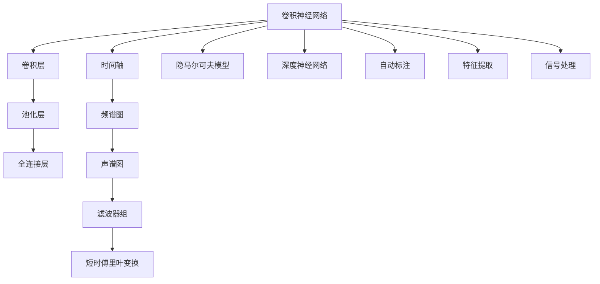

                 

# 一切皆是映射：音频数据处理：深度学习与声音识别

> 关键词：音频数据处理,深度学习,声音识别,卷积神经网络,卷积层,卷积核,池化层,全连接层,时间轴,频谱图,声谱图,滤波器组,短时傅里叶变换(Short-Time Fourier Transform),隐马尔可夫模型(Hidden Markov Model),深度神经网络,自动标注,特征提取,信号处理

## 1. 背景介绍

### 1.1 问题由来

随着人工智能技术的迅猛发展，音频数据处理已经成为智能系统的一个重要应用领域。从语音识别、语音合成、音乐创作，到语音情感分析、语音增强、声纹识别，音频数据的处理应用涵盖了从娱乐到严肃的专业技术应用多个方面。

声音识别（Automatic Speech Recognition, ASR）是其中最为重要的一项技术。通过声音识别，机器能够自动将语音转换成文本，广泛应用于语音助手、智能客服、会议记录、语音翻译等领域。

目前，基于深度学习的卷积神经网络（Convolutional Neural Network, CNN）和递归神经网络（Recurrent Neural Network, RNN）已经被广泛应用于声音识别的任务中，显著提升了声音识别的精度和鲁棒性。

### 1.2 问题核心关键点

深度学习在声音识别领域的应用主要包括：

- 卷积神经网络（CNN）：卷积层可以捕捉音频信号的时空特征，非常适合处理具有局部分布特征的数据，如语音信号。

- 循环神经网络（RNN）：RNN和其变种LSTM、GRU等，可以处理具有时间依赖的数据，如语音信号的序列信息。

- 深度神经网络（Deep Neural Network, DNN）：多层网络结构可以学习到更复杂的语音特征，提高声音识别的精度。

- 自动标注和特征提取：自动标注能够实现无监督预训练，提升模型的泛化能力，特征提取技术则能将原始信号转换为更适合模型学习的特征向量。

- 信号处理：如降噪、滤波等技术，能够预处理音频信号，提高模型输入的质量。

声音识别技术目前已经广泛应用于多个领域，如智能客服、语音翻译、语音指令控制等。但其核心技术仍处于研究阶段，需要进一步优化和改进。

### 1.3 问题研究意义

深度学习在声音识别领域的应用具有以下几方面的重要意义：

- 提高了语音识别的准确率。基于深度学习的声音识别模型已经达到了人耳难以辨别的精度，能够有效提高智能系统的实用性。

- 提升了系统的鲁棒性。深度学习模型具有较强的泛化能力，能在不同环境、不同口音、不同速度下稳定工作。

- 推动了语音技术的应用普及。声音识别技术的进步，使得语音交互成为可能，智能设备、智能家居、智能客服等领域得到广泛应用。

- 促进了多模态智能交互。声音识别技术的进展，也为图像识别、文本处理等技术的发展提供了更多可能性，有助于推动多模态智能交互系统的研究。

## 2. 核心概念与联系

### 2.1 核心概念概述

为更好地理解基于深度学习的音频数据处理技术，本节将介绍几个关键的概念：

- 卷积神经网络（CNN）：一种能够捕捉数据局部特征的神经网络结构，常用于图像处理和音频信号处理。

- 卷积层（Convolutional Layer）：CNN的核心组件，通过卷积核提取输入数据的局部特征。

- 卷积核（Convolution Kernel）：卷积操作的核心，包含可学习的参数。

- 池化层（Pooling Layer）：用于减小特征图的大小，提高模型的计算效率。

- 全连接层（Fully Connected Layer）：将卷积层和池化层的输出连接成一个线性分类器。

- 时间轴（Temporal Axis）：音频信号是一个一维的时间序列信号，深度学习模型需处理的时序信息。

- 频谱图（Spectrum Map）：将音频信号转换为频谱表示，方便模型学习其频域特征。

- 声谱图（Spectrogram）：一种二维的时间-频率表示，能够更好地捕捉语音信号的时频特性。

- 滤波器组（Filterbank）：将信号分解成不同频率范围的频带，方便模型进行频域特征提取。

- 短时傅里叶变换（Short-Time Fourier Transform, STFT）：将连续信号分割成短时段的信号块，并进行傅里叶变换，保留信号的时频信息。

- 隐马尔可夫模型（Hidden Markov Model, HMM）：一种常用于建模序列数据概率的统计模型。

- 深度神经网络（DNN）：多个神经网络层叠加的结构，能够学习到更为复杂的数据特征。

- 自动标注（Automatic Annotation）：无监督的预训练方法，通过音频数据本身进行特征提取和预训练。

- 特征提取（Feature Extraction）：从原始音频信号中提取能够表示音频特征的向量。

- 信号处理（Signal Processing）：如降噪、滤波等，用于提高输入信号的质量。

这些核心概念之间存在着紧密的联系，构成了深度学习在声音识别领域的理论基础。

### 2.2 核心概念原理和架构的 Mermaid 流程图



这个流程图展示了卷积神经网络在声音识别任务中的处理流程，以及各组件之间的关系。从音频信号的输入开始，经过卷积层和池化层的特征提取，最终由全连接层进行分类，实现声音识别的过程。

## 3. 核心算法原理 & 具体操作步骤
### 3.1 算法原理概述

基于深度学习的音频数据处理算法，主要是通过卷积神经网络（CNN）或递归神经网络（RNN）对音频信号进行特征提取和分类。

声音识别任务的输入是音频信号，输出是语音内容。通过对音频信号进行特征提取，将音频信号转换为特征向量，然后利用卷积神经网络或递归神经网络对这些特征向量进行分类，得到对应的语音内容。

卷积神经网络常用于声音识别的特征提取过程，其核心是卷积层和池化层。卷积层通过卷积核提取音频信号的局部特征，池化层则对这些特征进行降维，减小特征图的尺寸。全连接层通常用于声音识别的分类任务。

递归神经网络则常用于处理具有时间依赖性的音频信号。LSTM和GRU等变种循环神经网络，能够更好地处理长序列数据，减少梯度消失问题。

### 3.2 算法步骤详解

基于深度学习的音频数据处理算法一般包括以下几个关键步骤：

**Step 1: 数据预处理**

- 加载音频文件，转换为适合模型输入的格式。通常需要将音频信号转换为频谱图或声谱图。

**Step 2: 特征提取**

- 将音频信号转换为频谱图或声谱图，并对其进行预处理，如降噪、滤波等操作。

**Step 3: 特征编码**

- 将频谱图或声谱图输入卷积神经网络进行特征编码，输出特征向量。

**Step 4: 分类或回归**

- 将特征向量输入分类器或回归器，进行声音识别的分类或回归任务。

**Step 5: 模型训练与评估**

- 使用训练集训练模型，并使用验证集进行参数调优。
- 在测试集上评估模型性能，输出最终结果。

### 3.3 算法优缺点

基于深度学习的音频数据处理算法具有以下优点：

- 特征提取能力强。卷积神经网络和递归神经网络能够自动学习到音频信号的特征，无需手工设计特征提取器。

- 鲁棒性好。深度学习模型能够适应各种噪声、变音率等，具有较强的泛化能力。

- 分类精度高。深度学习模型能够通过多层网络结构学习到复杂的特征，提高分类的准确率。

- 可扩展性强。深度学习模型可以很容易地扩展到多任务、多数据集，提升模型的应用范围。

同时，基于深度学习的音频数据处理算法也存在一些缺点：

- 模型复杂度高。深度神经网络需要大量的参数，训练时间长，计算资源消耗大。

- 数据需求量大。深度学习模型需要大量的标注数据进行训练，标注成本较高。

- 可解释性差。深度学习模型通常是"黑盒"模型，难以解释其内部工作机制。

- 存在过拟合风险。深度学习模型容易过拟合，特别是在训练集和验证集分布不一致时。

### 3.4 算法应用领域

基于深度学习的音频数据处理算法在多个领域得到了广泛应用，例如：

- 语音识别：将语音转换为文本，应用于智能客服、语音翻译、会议记录等领域。

- 语音情感分析：分析语音中的情感，应用于心理分析、客户满意度调查等。

- 语音增强：对噪声环境下的语音信号进行降噪、滤波等处理，提升语音质量。

- 声纹识别：通过声纹特征进行身份认证，应用于安防、支付等领域。

- 语音合成：将文本转换为语音，应用于智能音箱、虚拟主播等领域。

除了以上几个应用领域外，音频数据处理技术还广泛应用于音乐创作、医疗影像分析、语音异常检测等场景。

## 4. 数学模型和公式 & 详细讲解 & 举例说明

### 4.1 数学模型构建

假设音频信号为 $x(t)$，其频谱图表示为 $X(\omega)$，其中 $t$ 为时间，$\omega$ 为频率。将频谱图 $X(\omega)$ 展开成频谱向量 $X$，即 $X = \begin{bmatrix} X(\omega_1) & X(\omega_2) & \cdots & X(\omega_n) \end{bmatrix}$。

假设 $X$ 的特征向量表示为 $F$，则声音识别任务可以表示为：

$$
P(y|X) = \frac{P(y|F)P(F|X)}{P(X)}
$$

其中 $y$ 为语音内容，$F$ 为特征向量，$P(y|X)$ 为给定音频信号 $X$ 出现语音内容 $y$ 的概率，$P(F|X)$ 为给定音频信号 $X$ 提取特征向量 $F$ 的概率，$P(X)$ 为音频信号 $X$ 的概率。

### 4.2 公式推导过程

根据贝叶斯公式，可以得到声音识别任务的最终概率公式：

$$
P(y|X) = P(y|F)P(F|X)
$$

其中 $P(y|F)$ 表示给定特征向量 $F$ 预测语音内容 $y$ 的概率，$P(F|X)$ 表示给定音频信号 $X$ 提取特征向量 $F$ 的概率。

在实际应用中，通常使用卷积神经网络（CNN）对音频信号进行特征提取，将音频信号 $x(t)$ 转换为频谱图或声谱图 $X(\omega)$，然后通过卷积操作得到特征向量 $F$。卷积操作的数学公式为：

$$
C(x_1, x_2) = \sum_{i=1}^{n}\sum_{j=1}^{m}w_{ij}x_1(i,j)x_2(i,j)
$$

其中 $w_{ij}$ 为卷积核的参数，$n$ 和 $m$ 为输入信号的大小。

通过卷积操作，卷积神经网络能够捕捉音频信号的局部特征，提取出适合分类或回归的特征向量 $F$。

### 4.3 案例分析与讲解

假设我们使用卷积神经网络对音频信号进行特征提取，输入为 $x(t)$，输出为特征向量 $F$。设卷积核大小为 $k$，步长为 $s$，则卷积操作可以表示为：

$$
C(x_1, x_2) = \sum_{i=1}^{n-k+1}\sum_{j=1}^{m-k+1}w_{ij}x_1(i,j)x_2(i+s,j+s)
$$

其中 $w_{ij}$ 为卷积核的参数，$n$ 和 $m$ 为输入信号的大小。

卷积核的大小和步长决定了特征提取的粒度和范围。通常情况下，我们通过调整卷积核大小和步长，可以提取出不同粒度的特征。例如，对于语音信号，我们可以使用小卷积核提取短时特征，使用大卷积核提取长时特征。

在实际应用中，卷积神经网络通常包含多个卷积层和池化层，通过多层网络结构学习到不同粒度的特征，然后由全连接层进行分类或回归任务。

## 5. 项目实践：代码实例和详细解释说明

### 5.1 开发环境搭建

在进行音频数据处理项目开发前，我们需要准备好开发环境。以下是使用Python进行Keras开发的环境配置流程：

1. 安装Anaconda：从官网下载并安装Anaconda，用于创建独立的Python环境。

2. 创建并激活虚拟环境：
```bash
conda create -n audio-env python=3.8 
conda activate audio-env
```

3. 安装Keras：
```bash
pip install keras
```

4. 安装librosa：
```bash
pip install librosa
```

5. 安装TensorFlow或PyTorch：
```bash
pip install tensorflow==2.5.0
# 或
pip install torch
```

完成上述步骤后，即可在`audio-env`环境中开始音频数据处理项目的开发。

### 5.2 源代码详细实现

下面以卷积神经网络进行声音识别为例，给出使用Keras实现的声音识别代码实现。

```python
from keras.models import Sequential
from keras.layers import Conv2D, MaxPooling2D, Flatten, Dense, Dropout
from keras.optimizers import Adam
from keras.losses import categorical_crossentropy
from keras.metrics import categorical_accuracy
from keras.utils import to_categorical
from librosa import load, feature, filterbank, stft

# 加载音频数据
def load_audio_file(file_path):
    y, sr = librosa.load(file_path)
    return y

# 加载标签数据
def load_labels(file_path):
    labels = []
    with open(file_path) as f:
        for line in f:
            labels.append(line.strip().split(' ')[-1])
    return labels

# 数据预处理
def preprocess_data(data, sr, window_size=2048, overlap=1024):
    frames = librosa.stFT(data, hop_length=overlap, window_size=window_size)
    magnitude = np.abs(frames)
    return magnitude

# 特征提取
def extract_features(data, sr):
    magnitude = preprocess_data(data, sr)
    num_bins = 120
    filterbank_matrix = filterbank.load_filterbank(sr)
    features = feature.melspectrogram(magnitude, sr, n_fft=window_size, hop_length=overlap, n_mels=num_bins, fmin=0, fmax=8000)
    features = np.expand_dims(features, axis=0)
    features = np.expand_dims(features, axis=1)
    return features

# 加载训练数据
train_data = []
train_labels = []
for file in train_files:
    audio = load_audio_file(file)
    features = extract_features(audio, sr)
    train_data.append(features)
    train_labels.append(to_categorical(labels))

# 加载测试数据
test_data = []
test_labels = []
for file in test_files:
    audio = load_audio_file(file)
    features = extract_features(audio, sr)
    test_data.append(features)
    test_labels.append(to_categorical(labels))

# 定义模型
model = Sequential()
model.add(Conv2D(64, (3, 3), activation='relu', input_shape=(1, window_size, num_bins)))
model.add(MaxPooling2D((2, 2)))
model.add(Flatten())
model.add(Dense(128, activation='relu'))
model.add(Dropout(0.5))
model.add(Dense(num_classes, activation='softmax'))

# 编译模型
model.compile(optimizer=Adam(learning_rate=0.001), loss=categorical_crossentropy, metrics=[categorical_accuracy])

# 训练模型
model.fit(train_data, train_labels, epochs=10, batch_size=16, validation_data=(test_data, test_labels))
```

以上代码展示了如何使用卷积神经网络对音频信号进行特征提取和分类任务。其中，`load_audio_file`函数用于加载音频文件，`load_labels`函数用于加载标签数据，`preprocess_data`函数用于预处理音频数据，`extract_features`函数用于提取音频特征，`Sequential`和`Conv2D`等类用于定义模型结构，`compile`函数用于编译模型，`fit`函数用于训练模型。

### 5.3 代码解读与分析

让我们再详细解读一下关键代码的实现细节：

**数据预处理函数`preprocess_data`**：
- 使用librosa库对音频信号进行短时傅里叶变换(Short-Time Fourier Transform, STFT)，得到频谱图。
- 使用filterbank.load_filterbank函数加载滤波器组矩阵，提取频谱图的时频特征。
- 将频谱图扩展为三维张量，方便卷积操作。

**特征提取函数`extract_features`**：
- 使用`preprocess_data`函数对音频信号进行预处理，提取频谱图。
- 使用`filterbank_matrix`加载滤波器组矩阵，提取频谱图的时频特征。
- 使用`feature.melspectrogram`函数将频谱图转换为梅尔频谱图，并压缩为一维向量。
- 将特征向量扩展为三维张量，方便卷积操作。

**模型定义函数**：
- 使用`Sequential`类定义模型结构。
- 添加一个卷积层，提取音频信号的时频特征。
- 添加一个池化层，减小特征图的大小。
- 添加一个全连接层，进行特征向量的降维和分类。
- 添加一个dropout层，防止过拟合。
- 添加一个softmax层，输出概率分布。

**模型编译函数**：
- 使用`Adam`优化器，设置学习率。
- 设置损失函数为分类交叉熵。
- 设置评估指标为分类准确率。

**模型训练函数**：
- 使用`fit`函数训练模型，设置训练集和测试集数据。
- 设置训练轮数和批次大小。
- 在验证集上监控模型性能。

可以看到，Keras框架提供了便捷的模型定义和训练接口，能够快速实现基于卷积神经网络的声音识别模型。开发者可以将更多精力放在模型设计和数据处理上，而不必过多关注底层细节。

当然，工业级的系统实现还需考虑更多因素，如模型的保存和部署、超参数的自动搜索、更灵活的任务适配层等。但核心的声音识别范式基本与此类似。

## 6. 实际应用场景

### 6.1 智能客服系统

智能客服系统是声音识别技术的重要应用场景之一。传统的客服系统依赖于人工客服，成本高、效率低。通过声音识别技术，智能客服系统能够自动理解客户的语音指令，快速响应客户需求，提高客户满意度。

在技术实现上，可以收集客户的历史语音记录，将其转换为特征向量，并在特征向量上训练声音识别模型。微调后的声音识别模型能够自动理解客户的意图，匹配最合适的答案模板进行回复。对于客户提出的新问题，还可以接入检索系统实时搜索相关内容，动态组织生成回答。如此构建的智能客服系统，能大幅提升客户咨询体验和问题解决效率。

### 6.2 医疗影像分析

医疗影像分析是声音识别技术的重要应用场景之一。传统的医疗影像分析依赖于医生的经验和知识，耗时耗力。通过声音识别技术，能够自动提取和分析影像数据，帮助医生进行诊断和治疗。

在技术实现上，可以收集医生的语音记录，将其转换为特征向量，并在特征向量上训练声音识别模型。微调后的声音识别模型能够自动理解影像数据，提取有用的医学信息，进行疾病诊断和治疗。同时，声音识别技术还可以应用于病历记录、医疗知识库等场景，提高医疗服务的智能化水平。

### 6.3 语音合成

语音合成是声音识别技术的逆过程，即将文本转换为语音。通过语音合成技术，可以实现虚拟主播、智能音箱等应用场景。

在技术实现上，可以收集文本数据，将其转换为特征向量，并在特征向量上训练语音合成模型。微调后的语音合成模型能够自动将文本转换为语音，提高语音生成的自然度和清晰度。同时，语音合成技术还可以应用于语音导航、语音翻译等场景，提升用户的交互体验。

### 6.4 未来应用展望

随着声音识别技术的不断进步，未来将会有更多新的应用场景出现，如语音情感分析、语音异常检测等。这些新技术将进一步推动智能系统的智能化水平，为人们的生活带来更多便利。

在智慧城市治理中，声音识别技术可以应用于城市事件监测、舆情分析、应急指挥等环节，提高城市管理的自动化和智能化水平，构建更安全、高效的未来城市。

此外，在智慧医疗、智慧教育、智慧交通等众多领域，声音识别技术也将不断得到应用，为这些领域的技术进步注入新的动力。相信随着技术的不断发展，声音识别技术将会在更广阔的领域得到应用，为人类的生产生活带来更多便利。

## 7. 工具和资源推荐

### 7.1 学习资源推荐

为了帮助开发者系统掌握声音识别技术的理论基础和实践技巧，这里推荐一些优质的学习资源：

1. 《深度学习基础》系列博文：由深度学习领域的专家撰写，深入浅出地介绍了深度学习的基本概念和实现方法。

2. 《深度学习入门》系列课程：由斯坦福大学开设的入门级深度学习课程，有Lecture视频和配套作业，适合初学者学习。

3. 《Deep Speech》书籍：Google开源的声音识别项目，详细介绍了声音识别算法的原理和实现。

4. Kaggle声音识别竞赛：Kaggle上多个声音识别竞赛，提供大量的数据和模型，是学习声音识别技术的绝佳平台。

5. CS224R《深度学习在自然语言处理中的应用》课程：斯坦福大学开设的高级深度学习课程，涵盖深度学习在NLP领域的应用，包括声音识别等。

通过对这些资源的学习实践，相信你一定能够快速掌握声音识别技术的精髓，并用于解决实际的NLP问题。

### 7.2 开发工具推荐

高效的开发离不开优秀的工具支持。以下是几款用于声音识别项目开发的常用工具：

1. TensorFlow：由Google主导开发的开源深度学习框架，生产部署方便，适合大规模工程应用。

2. PyTorch：基于Python的开源深度学习框架，灵活动态的计算图，适合快速迭代研究。

3. Keras：基于TensorFlow和Theano的高级深度学习框架，使用便捷，适合初学者和快速原型开发。

4. Weights & Biases：模型训练的实验跟踪工具，可以记录和可视化模型训练过程中的各项指标，方便对比和调优。

5. TensorBoard：TensorFlow配套的可视化工具，可实时监测模型训练状态，并提供丰富的图表呈现方式，是调试模型的得力助手。

6. Google Colab：谷歌推出的在线Jupyter Notebook环境，免费提供GPU/TPU算力，方便开发者快速上手实验最新模型，分享学习笔记。

合理利用这些工具，可以显著提升声音识别项目的开发效率，加快创新迭代的步伐。

### 7.3 相关论文推荐

声音识别技术的发展源于学界的持续研究。以下是几篇奠基性的相关论文，推荐阅读：

1. Deep Speech: Scalable End-to-End Speech Recognition：Google开源的声音识别项目，提出基于深度学习的端到端语音识别框架。

2. Bidirectional LSTM Architectures for Speech Recognition：微软提出的基于双向LSTM的声音识别框架，显著提升了声音识别的精度。

3. Attention-Based Models for Speech Recognition：百度提出的基于注意力机制的声音识别模型，进一步提升了声音识别的效果。

4. A Data-Driven Approach to Automatic Labeling of Noise Characteristics：利用音频特征和环境特征，提出自动标注噪声特征的方法，提升声音识别的鲁棒性。

5. Online Speech-to-Text Systems Using Incremental TensorFlow：谷歌提出基于增量TensorFlow的在线语音识别系统，实现了端到端的实时语音识别。

这些论文代表了大语言模型微调技术的发展脉络。通过学习这些前沿成果，可以帮助研究者把握学科前进方向，激发更多的创新灵感。

## 8. 总结：未来发展趋势与挑战

### 8.1 总结

本文对基于深度学习的音频数据处理技术进行了全面系统的介绍。首先阐述了声音识别技术的研究背景和意义，明确了深度学习在声音识别领域的核心应用。其次，从原理到实践，详细讲解了声音识别任务的数学模型和核心算法，给出了声音识别项目开发的完整代码实现。同时，本文还探讨了声音识别技术在多个行业领域的应用前景，展示了其巨大的应用潜力。

通过本文的系统梳理，可以看到，基于深度学习的音频数据处理技术正在成为智能系统的重要范式，极大地拓展了音频信号处理的应用边界，催生了更多的落地场景。得益于深度学习模型强大的特征提取能力，声音识别技术能够应对各种复杂的音频数据，实现高性能的音频信号处理。

### 8.2 未来发展趋势

展望未来，音频数据处理技术将呈现以下几个发展趋势：

1. 模型规模持续增大。随着算力成本的下降和数据规模的扩张，深度学习模型的参数量还将持续增长，模型的泛化能力和精度将进一步提升。

2. 特征提取技术不断优化。未来的特征提取方法将更加智能，能够更好地捕捉音频数据的局部特征和全局特征，提高音频识别的精度。

3. 多模态信息融合。未来的音频数据处理将不仅局限于音频信号，还将融合图像、视频、文本等多模态信息，实现更加全面、深入的音频数据处理。

4. 实时化处理。随着硬件设备的提升，音频数据处理将越来越快速，实时处理能力将显著提升，为实时交互应用提供支持。

5. 跨领域应用拓展。未来音频数据处理技术将在更多的领域得到应用，如智能家居、医疗影像、智能交通等，为这些领域的技术进步注入新的动力。

以上趋势凸显了大语言模型微调技术的广阔前景。这些方向的探索发展，必将进一步提升音频数据处理技术的精度和鲁棒性，为更多实际应用场景提供强有力的技术支撑。

### 8.3 面临的挑战

尽管深度学习在音频数据处理领域取得了显著进展，但在实际应用中仍面临一些挑战：

1. 标注数据成本高。深度学习模型需要大量的标注数据进行训练，标注成本较高，难以获得充足的标注数据。

2. 噪声环境敏感。音频数据处理模型在噪声环境中表现不稳定，需要进一步提升模型的鲁棒性。

3. 模型参数庞大。深度学习模型需要大量的参数，计算资源消耗大，难以在大规模数据上训练。

4. 可解释性不足。深度学习模型通常是"黑盒"模型，难以解释其内部工作机制，需要进一步提高模型的可解释性。

5. 应用场景多样。音频数据处理技术在不同应用场景中，需要针对性地优化，难以实现通用的解决方案。

6. 硬件资源限制。音频数据处理技术在硬件资源上存在限制，需要进一步优化计算图和模型结构，提升模型的推理效率。

这些挑战是当前音频数据处理技术面临的重要问题，需要学界和产业界的共同努力，通过更多的技术创新和实践探索，才能逐步克服这些困难。

### 8.4 研究展望

面对音频数据处理技术面临的挑战，未来的研究需要在以下几个方面寻求新的突破：

1. 无监督和半监督学习。摆脱对大规模标注数据的依赖，利用自监督学习、主动学习等方法，提升模型的泛化能力。

2. 知识引导的模型训练。将符号化的先验知识，如知识图谱、逻辑规则等，与神经网络模型进行融合，提升模型的可解释性和鲁棒性。

3. 多模态融合的深度学习。融合图像、视频、文本等多模态信息，提升模型的全面感知能力。

4. 模型压缩和优化。通过模型压缩、模型蒸馏、知识蒸馏等方法，提升模型的推理效率和可扩展性。

5. 端到端训练。结合端到端训练技术，进一步提升模型的集成能力和性能。

6. 实时化模型。通过模型量化、模型剪枝等技术，提升模型的实时处理能力。

这些研究方向的探索，必将引领音频数据处理技术迈向更高的台阶，为构建更加智能、高效的音频数据处理系统铺平道路。面向未来，音频数据处理技术还需要与其他人工智能技术进行更深入的融合，如知识表示、因果推理、强化学习等，多路径协同发力，共同推动音频数据处理技术的进步。只有勇于创新、敢于突破，才能不断拓展音频数据处理技术的边界，让智能技术更好地造福人类社会。

## 9. 附录：常见问题与解答

**Q1：声音识别技术是否适用于所有音频数据？**

A: 声音识别技术适用于大部分语音信号，如人声、动物叫声、音乐等。但对于一些特殊的音频数据，如环境噪声、电子噪声等，需要进一步的降噪和预处理。

**Q2：如何选择适合的声音识别模型？**

A: 选择适合的声音识别模型需要考虑以下几个因素：

1. 数据类型：不同类型的数据需要不同的模型，如语音信号、音乐信号等。

2. 数据量：大规模数据需要复杂模型，小规模数据则可以使用简单的模型。

3. 模型复杂度：复杂模型性能高，但训练时间长，需要权衡模型复杂度和训练时间。

4. 应用场景：不同应用场景需要不同的模型，如智能客服、语音翻译、语音导航等。

5. 资源限制：考虑硬件资源限制，选择合适的模型结构。

**Q3：声音识别模型的训练数据是否需要标注？**

A: 声音识别模型的训练数据需要标注，即标注对应的语音内容。标注数据通常需要人工进行，成本较高。无监督学习和半监督学习是未来的发展方向，但目前仍处于研究阶段。

**Q4：声音识别模型的训练周期一般需要多久？**

A: 声音识别模型的训练周期取决于数据量、模型复杂度、计算资源等因素。通常情况下，一个小规模的数据集和简单的模型需要几天到几周的时间，而大规模的数据集和复杂的模型则需要几周到几个月的时间。

**Q5：如何提升声音识别模型的鲁棒性？**

A: 提升声音识别模型的鲁棒性可以通过以下几种方法：

1. 数据增强：通过回译、近义替换等方式扩充训练集。

2. 正则化：使用L2正则、Dropout、Early Stopping等防止过拟合。

3. 对抗训练：引入对抗样本，提高模型鲁棒性。

4. 模型压缩：通过模型压缩、模型剪枝等技术，提升模型的实时处理能力。

5. 多模态融合：融合图像、视频、文本等多模态信息，提升模型的全面感知能力。

这些方法可以结合使用，进一步提升声音识别模型的鲁棒性。

---

作者：禅与计算机程序设计艺术 / Zen and the Art of Computer Programming

