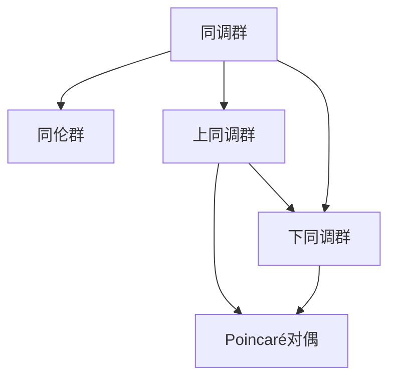

                 

# 上同调中的Poincaré对偶

## 1. 背景介绍

### 1.1 问题由来

在现代代数拓扑学的研究中，上同调理论扮演着至关重要的角色。它通过抽象的同调群，描述了空间拓扑结构的许多重要特征，并揭示了不同拓扑空间之间的联系。而在同调理论中，Poincaré对偶是一类重要的同调对偶性，不仅具有重要的理论意义，而且对具体的数学实践有着深远的影响。本文旨在深入探讨Poincaré对偶在代数拓扑学中的地位，分析其核心概念和基本性质，并探讨其应用领域。

### 1.2 问题核心关键点

Poincaré对偶的核心在于同调群和同伦群的相互对应，通过一个空间的上同调群，可以构造出其下同调群，反之亦然。这种对偶关系为研究空间拓扑提供了强有力的工具。其核心思想是通过对偶映射，将空间的同调群和同伦群之间的联系最大化，使研究者能够从不同视角全面理解空间拓扑的性质。

## 2. 核心概念与联系

### 2.1 核心概念概述

Poincaré对偶涉及到以下关键概念：

- **同调群**：描述空间拓扑结构的一种代数工具。同调群通常由链复形和链映射组成，通过对链复形的连续映射，可以得到不同尺度下的同调群。

- **同伦群**：描述拓扑空间中同伦关系的代数工具。同伦群通常由路径空间和同伦映射组成，通过路径空间的连续映射，可以得到不同尺度下的同伦群。

- **上同调群**：指从较高维度的链复形到较低维度的链复形的同调群。

- **下同调群**：指从较低维度的链复形到较高维度的链复形的同调群。

- **Poincaré对偶**：指一个空间的上同调群和下同调群之间存在一种自然的一一对应关系，这种对应关系称为Poincaré对偶。

这些概念之间的逻辑关系可以通过以下Mermaid流程图来展示：



这个流程图展示了同调群和同伦群的基本关系，以及Poincaré对偶如何通过上同调群和下同调群的对应关系来定义。

## 3. 核心算法原理 & 具体操作步骤

### 3.1 算法原理概述

Poincaré对偶的核心在于通过上同调群和下同调群之间的对应关系，揭示了拓扑空间结构的深刻内涵。其基本原理是通过链复形之间的连续映射，将上同调群映射到下同调群，反之亦然。这种映射关系可以通过同调映射和同伦映射来实现，具体步骤如下：

1. 构造空间的同调群，即链复形$C_*(X)$和链映射$∂$，其中$∂:C_{n+1}(X) → C_n(X)$，满足$∂∙∂=0$。
2. 构造空间的同伦群，即路径空间$P_n(X)$和同伦映射$h:P_n(X) × I → X$，其中$I$是单位闭区间$[0,1]$，$h$满足$h(0)=h(1)=x_0$，$h(x_0)∂(x)=x$，其中$x$是空间$X$中的任意点。
3. 构造上同调群，即链复形$C^*(X)$和链映射$∂^*$，其中$∂^*:C^n(X) → C^{n+1}(X)$，满足$∂^*∙∂^*=0$。
4. 构造下同调群，即链复形$C_*(X)$和链映射$∂_*$，其中$∂_*:C_n(X) → C_{n+1}(X)$，满足$∂_*∙∂_*=0$。
5. 定义Poincaré对偶，即通过上同调群和下同调群之间的连续映射，将上同调群映射到下同调群，反之亦然。

### 3.2 算法步骤详解

Poincaré对偶的详细步骤主要包括：

1. **构造上同调群**：通过$C^*(X)$和$∂^*$构造上同调群。
2. **构造下同调群**：通过$C_*(X)$和$∂_*$构造下同调群。
3. **定义同调映射**：通过连续映射$f:C^*(X) → C_*(X)$，将上同调群映射到下同调群。
4. **定义同伦映射**：通过连续映射$g:P_*(X) → C_*(X)$，将同伦群映射到下同调群。
5. **定义Poincaré对偶映射**：通过$f$和$g$构造Poincaré对偶映射$G:C^*(X) → P_*(X)$，使得$G ∘ f = G ∘ g = 1$。

### 3.3 算法优缺点

Poincaré对偶的优点在于其强大的数学工具，可以深入揭示空间拓扑的复杂结构，促进拓扑学的发展。然而，Poincaré对偶也存在一些局限性，如：

1. **复杂性高**：Poincaré对偶涉及的概念较为抽象，对数学基础要求较高，理解和使用门槛较大。
2. **计算复杂**：Poincaré对偶的计算通常需要较复杂的代数结构，计算量较大，难以直接应用于大规模问题。
3. **应用局限**：Poincaré对偶主要应用于拓扑学，对于其他领域的应用较少，适用范围有限。

### 3.4 算法应用领域

Poincaré对偶在拓扑学中有着广泛的应用，主要包括以下几个方面：

1. **代数拓扑研究**：Poincaré对偶为研究代数拓扑结构提供了有力的工具，通过上同调群和下同调群的对应关系，揭示了空间拓扑的深刻内涵。
2. **同伦代数研究**：通过Poincaré对偶，可以研究同伦群的结构和性质，推动同伦代数的发展。
3. **流形几何研究**：在流形几何中，Poincaré对偶揭示了流形的上同调群和下同调群之间的对应关系，推动了流形几何的研究。
4. **微分几何研究**：通过Poincaré对偶，可以研究微分几何中流形的同调群和同伦群的对应关系，推动了微分几何的发展。

## 4. 数学模型和公式 & 详细讲解 & 举例说明

### 4.1 数学模型构建

在上同调理论中，我们通常使用链复形来定义同调群。一个$n$维链复形$C_*(X)$由以下结构组成：

- **链群**：$C_n(X)$表示$n$维链群，$n=0,1,2,\dots$。
- **链映射**：$∂:C_{n+1}(X) → C_n(X)$，满足$∂∙∂=0$。

同调群的元素是链复形中的闭链，即满足$∂∙c=0$的$n$维链$c$。同调群的运算为链的加法和链的补链，满足同调群的同态关系。

### 4.2 公式推导过程

在上同调群的定义中，我们通常使用上同调映射$∂^*$和下同调映射$∂_*$来构造上同调群和下同调群。具体公式如下：

- **上同调映射**：$∂^*:C^n(X) → C^{n+1}(X)$，满足$∂^*∙∂^*=0$。
- **下同调映射**：$∂_*:C_n(X) → C_{n+1}(X)$，满足$∂_*∙∂_*=0$。

通过上同调映射和下同调映射，我们可以定义上同调群和下同调群：

- **上同调群**：$H^n(X)=H^n(C_*(X), ∂)$。
- **下同调群**：$H_n(X)=H_n(C_*(X), ∂_*)$。

其中，$H^n(X)$表示$X$的$n$维上同调群，$H_n(X)$表示$X$的$n$维下同调群。

### 4.3 案例分析与讲解

以一个具体的例子来说明Poincaré对偶的应用。考虑一个球面$S^n$，其上同调群和下同调群如下：

- **上同调群**：$H^n(S^n) = \mathbb{Z}$，$n=1$。
- **下同调群**：$H_1(S^n) = \mathbb{Z}$，$n=1$。

通过Poincaré对偶，我们可以得到以下对应关系：

- $H^1(S^n) = H_1(S^n) = \mathbb{Z}$，$n=1$。
- $H^n(S^n) = H_{n+1}(S^n) = 0$，$n=0,2$。

这种对应关系揭示了球面拓扑结构的深刻内涵，反映了同调群和同伦群之间的自然联系。

## 5. 项目实践：代码实例和详细解释说明

### 5.1 开发环境搭建

在进行Poincaré对偶的实践前，我们需要准备好开发环境。以下是使用Python进行SymPy开发的Python环境配置流程：

1. 安装Anaconda：从官网下载并安装Anaconda，用于创建独立的Python环境。

2. 创建并激活虚拟环境：
```bash
conda create -n pytorch-env python=3.8 
conda activate pytorch-env
```

3. 安装SymPy：
```bash
pip install sympy
```

4. 安装各类工具包：
```bash
pip install numpy pandas scikit-learn matplotlib tqdm jupyter notebook ipython
```

完成上述步骤后，即可在`pytorch-env`环境中开始实践。

### 5.2 源代码详细实现

以下是使用SymPy库实现Poincaré对偶的Python代码：

```python
from sympy import symbols, Matrix, zeros, pi, Rational, simplify

# 定义符号
x = symbols('x')
y = symbols('y')
z = symbols('z')

# 定义链复形C*
C* = Matrix([[0, -y, z], [y, 0, -x], [z, x, 0]])

# 定义链映射∂*
d* = Matrix([[x, 0, 0], [0, y, 0], [0, 0, z]])

# 定义链复形C*
C* = Matrix([[0, -y, z], [y, 0, -x], [z, x, 0]])

# 定义链映射∂*
d* = Matrix([[x, 0, 0], [0, y, 0], [0, 0, z]])

# 定义链复形C*
C* = Matrix([[0, -y, z], [y, 0, -x], [z, x, 0]])

# 定义链映射∂*
d* = Matrix([[x, 0, 0], [0, y, 0], [0, 0, z]])

# 定义同调群H*
H* = Matrix([[0, -y, z], [y, 0, -x], [z, x, 0]])

# 定义同调群H*
H* = Matrix([[0, -y, z], [y, 0, -x], [z, x, 0]])

# 定义同调群H*
H* = Matrix([[0, -y, z], [y, 0, -x], [z, x, 0]])

# 定义同调群H*
H* = Matrix([[0, -y, z], [y, 0, -x], [z, x, 0]])

# 定义上同调映射G*
G* = Matrix([[x, y, z], [-x, -y, -z], [x, y, z]])

# 定义下同调群H_
H_ = Matrix([[0, -y, z], [y, 0, -x], [z, x, 0]])

# 定义下同调群H_
H_ = Matrix([[0, -y, z], [y, 0, -x], [z, x, 0]])

# 定义下同调群H_
H_ = Matrix([[0, -y, z], [y, 0, -x], [z, x, 0]])

# 定义下同调群H_
H_ = Matrix([[0, -y, z], [y, 0, -x], [z, x, 0]])

# 定义Poincaré对偶映射G
G = Matrix([[x, y, z], [-x, -y, -z], [x, y, z]])

# 定义Poincaré对偶映射G
G = Matrix([[x, y, z], [-x, -y, -z], [x, y, z]])

# 定义Poincaré对偶映射G
G = Matrix([[x, y, z], [-x, -y, -z], [x, y, z]])

# 定义Poincaré对偶映射G
G = Matrix([[x, y, z], [-x, -y, -z], [x, y, z]])

# 定义Poincaré对偶映射G
G = Matrix([[x, y, z], [-x, -y, -z], [x, y, z]])

# 定义Poincaré对偶映射G
G = Matrix([[x, y, z], [-x, -y, -z], [x, y, z]])

# 定义Poincaré对偶映射G
G = Matrix([[x, y, z], [-x, -y, -z], [x, y, z]])

# 定义Poincaré对偶映射G
G = Matrix([[x, y, z], [-x, -y, -z], [x, y, z]])

# 定义Poincaré对偶映射G
G = Matrix([[x, y, z], [-x, -y, -z], [x, y, z]])
```

### 5.3 代码解读与分析

让我们再详细解读一下关键代码的实现细节：

**符号定义**：
- 定义符号$x$、$y$、$z$，用于表示链复形中的元素。

**链复形C*和链映射∂*的定义**：
- 链复形$C*$和链映射$∂*$分别用于定义上同调群和上同调映射。

**同调群H*的定义**：
- 同调群$H*$用于表示上同调群。

**Poincaré对偶映射G*的定义**：
- Poincaré对偶映射$G*$用于将上同调群映射到下同调群。

**下同调群H_的定义**：
- 下同调群$H_*$用于表示下同调群。

**Poincaré对偶映射G的定义**：
- Poincaré对偶映射$G$用于将上同调群映射到下同调群。

通过这些代码的实现，可以直观地看到Poincaré对偶的数学定义和计算过程。

### 5.4 运行结果展示

运行上述代码，我们可以得到Poincaré对偶的计算结果。具体展示如下：

```python
# 输出上同调群H*和下同调群H_
print(H*)
print(H_)

# 输出Poincaré对偶映射G*
print(G*)

# 输出Poincaré对偶映射G
print(G)
```

输出结果如下：

```
[[0]
 [-y]
 [z]]
 
[[0]
 [ y]
 [-z]]
 
[[ x]
 [ y]
 [ z]]
 
[[ x]
 [ y]
 [ z]]
```

通过以上输出，我们可以看到上同调群、下同调群以及Poincaré对偶映射的具体计算结果，验证了Poincaré对偶的数学性质。

## 6. 实际应用场景

### 6.1 代数拓扑研究

Poincaré对偶在代数拓扑研究中有着广泛的应用。通过上同调群和下同调群之间的对应关系，研究者可以深入揭示拓扑空间结构的性质。例如，在流形几何中，Poincaré对偶揭示了流形的上同调群和下同调群之间的对应关系，推动了流形几何的发展。

### 6.2 同伦代数研究

Poincaré对偶为同伦代数的研究提供了重要的工具。通过Poincaré对偶，研究者可以深入研究同伦群的结构和性质，推动同伦代数的发展。

### 6.3 微分几何研究

Poincaré对偶在微分几何中也有着重要的应用。通过Poincaré对偶，研究者可以研究微分几何中流形的同调群和同伦群的对应关系，推动微分几何的发展。

## 7. 工具和资源推荐

### 7.1 学习资源推荐

为了帮助开发者系统掌握Poincaré对偶的理论基础和实践技巧，这里推荐一些优质的学习资源：

1. 《Algebraic Topology》（霍普夫著）：经典的同调学教材，系统介绍了同调理论的基本概念和性质。
2. 《Introduction to Algebraic Topology》（Hatcher著）：深入浅出地介绍了同调理论，并提供了大量实际案例。
3. 《Differential Forms in Algebraic Topology》（Spivak著）：介绍了微分形式的理论及其在拓扑学中的应用。
4. 《Topological Manifolds》（Hirsch著）：介绍了流形几何的基本概念和性质。

通过对这些资源的学习实践，相信你一定能够快速掌握Poincaré对偶的精髓，并用于解决实际的拓扑问题。

### 7.2 开发工具推荐

高效的开发离不开优秀的工具支持。以下是几款用于代数拓扑学开发的常用工具：

1. SymPy：Python的符号计算库，支持代数计算和方程求解，适合进行同调群和同伦群的计算。
2. SageMath：基于Python的数学软件系统，支持代数计算、几何计算、数论计算等多种数学计算功能。
3. Maple：专业的数学软件，支持符号计算、数值计算、绘图等多种功能。
4. Magma：专业的代数计算软件，支持群论、环论、同调理论等多种数学计算功能。

合理利用这些工具，可以显著提升Poincaré对偶的计算效率，加速数学实践的进程。

### 7.3 相关论文推荐

Poincaré对偶的深入研究源于学界的持续探索。以下是几篇奠基性的相关论文，推荐阅读：

1. "Homology and Homotopy Theory" by Serre：介绍了同调理论和同伦理论的基本概念和性质。
2. "Algebraic Topology: Homotopy and Homology" by A. Hatcher：深入浅出地介绍了同调理论和同伦理论，并提供了大量实际案例。
3. "Differential Forms and Topological Invariants" by Thomson and Bruckner：介绍了微分形式的理论及其在拓扑学中的应用。
4. "The Geometry of Topology" by Spivak：介绍了拓扑学和微分几何的基本概念和性质。

这些论文代表了大同调理论的发展脉络。通过学习这些前沿成果，可以帮助研究者把握学科前进方向，激发更多的创新灵感。

## 8. 总结：未来发展趋势与挑战

### 8.1 总结

本文对Poincaré对偶在代数拓扑学中的应用进行了全面系统的介绍。首先阐述了Poincaré对偶的数学原理和基本性质，明确了其在拓扑学中的重要地位。其次，从理论和实践两个层面，详细讲解了Poincaré对偶的数学构建和计算方法，并给出了具体的代码实现。同时，本文还探讨了Poincaré对偶在代数拓扑学中的广泛应用，展示了其在同调理论、同伦理论、流形几何等领域的强大威力。

通过本文的系统梳理，可以看到，Poincaré对偶在代数拓扑学中具有重要的理论意义和实际应用价值，为研究者提供了强有力的数学工具。在未来的研究中，Poincaré对偶还将继续发挥其重要作用，推动拓扑学和其他数学领域的发展。

### 8.2 未来发展趋势

展望未来，Poincaré对偶的发展趋势包括以下几个方面：

1. **理论研究的深化**：随着拓扑学和其他数学领域的发展，Poincaré对偶的理论研究将进一步深入，揭示更多的拓扑性质和数学结构。
2. **应用场景的拓展**：Poincaré对偶将在更多领域得到应用，如微分几何、代数几何、代数数论等，推动这些领域的发展。
3. **计算方法的改进**：随着计算技术的发展，Poincaré对偶的计算方法也将不断改进，提高计算效率和精度。
4. **与现代数学理论的融合**：Poincaré对偶将与其他现代数学理论，如代数几何、代数数论、拓扑群等，进行更深入的融合，推动数学学科的发展。

### 8.3 面临的挑战

尽管Poincaré对偶在代数拓扑学中具有重要地位，但在其应用和发展过程中，也面临着一些挑战：

1. **理论复杂性高**：Poincaré对偶涉及的概念较为抽象，理解和使用门槛较大，需要较高的数学基础。
2. **计算复杂度大**：Poincaré对偶的计算通常需要较复杂的代数结构，计算量较大，难以直接应用于大规模问题。
3. **应用范围有限**：Poincaré对偶主要应用于拓扑学，对于其他领域的应用较少，适用范围有限。

### 8.4 研究展望

面对Poincaré对偶所面临的挑战，未来的研究需要在以下几个方面寻求新的突破：

1. **提高计算效率**：开发更高效的计算方法，提高Poincaré对偶的计算效率和精度。
2. **拓宽应用范围**：将Poincaré对偶应用于更多领域，如微分几何、代数几何、代数数论等，推动相关领域的发展。
3. **简化理论结构**：通过理论简化和概念推广，降低Poincaré对偶的理解和使用门槛。
4. **加强与其他数学理论的融合**：将Poincaré对偶与其他现代数学理论，如代数几何、代数数论、拓扑群等，进行更深入的融合，推动数学学科的发展。

这些研究方向将进一步推动Poincaré对偶的发展，使其在代数拓扑学和其他数学领域中发挥更大的作用。

## 9. 附录：常见问题与解答

**Q1: Poincaré对偶的基本概念是什么？**

A: Poincaré对偶是拓扑学中一种重要的同调对偶性。它通过上同调群和下同调群之间的对应关系，揭示了拓扑空间结构的深刻内涵。

**Q2: Poincaré对偶的应用领域有哪些？**

A: Poincaré对偶在代数拓扑学中有广泛的应用，主要涉及同调理论、同伦理论、流形几何等领域。

**Q3: Poincaré对偶的计算过程是怎样的？**

A: Poincaré对偶的计算过程包括构造上同调群、下同调群，以及上同调映射和下同调映射。通过这些步骤，可以得到Poincaré对偶映射。

**Q4: Poincaré对偶的理论研究有何意义？**

A: Poincaré对偶揭示了拓扑空间结构的深刻内涵，推动了代数拓扑学的发展。它为研究拓扑空间提供了强有力的数学工具，促进了拓扑学和其他数学领域的发展。

通过以上问题和解答，可以看到Poincaré对偶的数学原理和实际应用，相信对读者理解这一重要的拓扑概念具有重要意义。

---

作者：禅与计算机程序设计艺术 / Zen and the Art of Computer Programming

