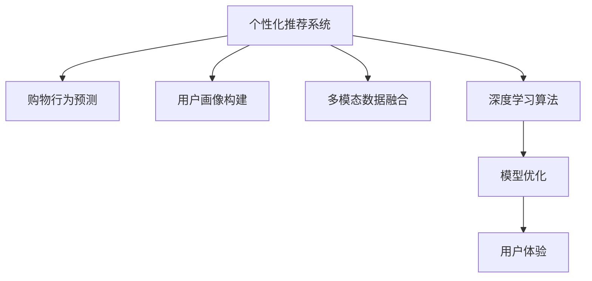

                 

# 个性化购物体验的提升方法

> 关键词：个性化推荐,购物行为预测,用户画像构建,多模态数据融合,深度学习算法,模型优化,用户体验

## 1. 背景介绍

### 1.1 问题由来

随着电商行业的快速发展，个性化推荐已成为提升用户体验和商家盈利的核心手段。传统的推荐系统往往依赖用户的浏览历史和购买记录，难以精准捕捉用户偏好。而基于深度学习技术的大模型推荐方法，通过分析用户的历史行为和实时反馈，能够动态更新推荐列表，提供更加精准、多样、个性化的购物体验。

但在大模型推荐实践中，常常会遇到一些挑战，如模型泛化能力不足、个性化推荐效果不理想、推荐结果与实际需求不符等问题。如何构建更加有效的推荐系统，提升个性化购物体验，成为电商领域的重要课题。

### 1.2 问题核心关键点

个性化推荐系统的核心在于准确预测用户的行为和偏好，从而提供个性化的购物建议。其关键点包括：

- 数据采集与预处理：收集用户的行为数据和上下文信息，构建高质量的训练集。
- 用户画像构建：分析用户的行为特征，挖掘其潜在需求。
- 多模态数据融合：将不同来源的数据（如文本、图像、时间序列等）进行融合，提升推荐模型的表现。
- 深度学习算法：选择合适的深度学习模型，进行特征提取和行为预测。
- 模型优化：通过超参数调整、正则化、集成学习等方法，优化模型的泛化能力和性能。
- 用户反馈循环：利用用户对推荐结果的反馈，进行模型再训练，不断迭代优化推荐策略。

### 1.3 问题研究意义

个性化推荐技术的提升，对于电商平台的竞争力至关重要。通过更精准的个性化推荐，商家可以提升用户体验，提高转化率和客户粘性，增加销售额和市场份额。同时，用户也能获得更符合自身需求的购物建议，减少筛选成本，提升购物效率和满意度。

## 2. 核心概念与联系

### 2.1 核心概念概述

本节将介绍几个密切相关的核心概念：

- 个性化推荐系统(Personalized Recommendation System, PReS)：通过分析用户历史行为和实时反馈，动态生成个性化推荐列表的系统。
- 购物行为预测(Shopping Behavior Prediction)：利用用户的历史数据，预测其在未来某一时间点购买某个商品的概率。
- 用户画像(User Profile)：从用户行为数据中提取特征，刻画用户偏好、兴趣、需求等个性信息，用于指导推荐策略。
- 多模态数据融合(Multimodal Data Fusion)：将文本、图像、时间序列等多源数据融合，形成更加全面、准确的特征表示。
- 深度学习算法(Deep Learning Algorithm)：如神经网络、Transformer等，用于从海量数据中提取高层次特征。
- 模型优化(Model Optimization)：如超参数调整、正则化、集成学习等，提升模型泛化能力和性能。
- 用户体验(User Experience)：包括推荐结果的准确性、多样性、时效性、可解释性等方面，是评价推荐系统的重要指标。

这些核心概念之间的逻辑关系可以通过以下Mermaid流程图来展示：



这个流程图展示了个性化推荐系统的核心概念及其之间的关系：

1. 个性化推荐系统通过购物行为预测获取用户偏好，结合用户画像和多模态数据融合，利用深度学习算法提取高层次特征，并通过模型优化提升泛化能力和性能。
2. 用户体验是评价推荐系统的重要指标，包含推荐结果的准确性、多样性、时效性、可解释性等方面。

## 3. 核心算法原理 & 具体操作步骤
### 3.1 算法原理概述

基于深度学习的个性化推荐系统，通过分析用户的历史行为和实时反馈，预测其在未来某一时间点购买某商品的概率。核心思想是：将用户与商品之间的交互关系，转化为向量表示，并通过训练模型，学习用户对商品的兴趣权重，生成推荐列表。

具体而言，推荐系统包含两个部分：召回和排序。召回部分根据用户的特征向量和商品向量之间的相似度，选择可能感兴趣的潜在商品；排序部分通过训练好的模型，对召回的候选商品进行评分排序，生成最终推荐结果。

### 3.2 算法步骤详解

基于深度学习的个性化推荐系统，一般包括以下几个关键步骤：

**Step 1: 数据采集与预处理**

1. 收集用户的行为数据，如浏览历史、购买记录、搜索记录、评价评论等。
2. 对数据进行清洗、去重、归一化等预处理，形成可用的训练数据集。
3. 将文本、图像、时间序列等不同模态的数据转化为向量表示，用于模型训练。

**Step 2: 用户画像构建**

1. 利用用户的特征数据，如年龄、性别、地域、兴趣等，提取特征向量。
2. 结合用户的行为数据，如浏览、点击、购买、收藏等，动态更新用户画像。
3. 将用户画像转化为全局向量和局部向量，用于表示用户的整体偏好和局部行为。

**Step 3: 多模态数据融合**

1. 通过编码器将不同模态的数据（如文本、图像、时间序列）转换为向量表示。
2. 利用注意力机制（Attention Mechanism）融合不同模态的信息，形成高层次特征。
3. 将融合后的特征输入深度学习模型进行训练和预测。

**Step 4: 深度学习算法选择与训练**

1. 选择适合的深度学习模型，如序列模型（RNN、LSTM）、卷积神经网络（CNN）、Transformer等。
2. 利用用户画像和融合后的多模态数据，训练模型，学习用户对商品的兴趣权重。
3. 通过交叉验证等方法，选择合适的超参数和优化器，提高模型的泛化能力。

**Step 5: 模型优化与评估**

1. 对训练好的模型进行正则化、集成学习等优化，提高模型的泛化能力和性能。
2. 利用用户对推荐结果的反馈，进行在线学习（Online Learning），不断迭代优化模型。
3. 在测试集上评估推荐模型的准确性、多样性、时效性、可解释性等指标，进行性能调优。

### 3.3 算法优缺点

基于深度学习的个性化推荐系统具有以下优点：

- 能够捕捉用户的深度行为特征，提供更加精准的个性化推荐。
- 利用多模态数据融合，提升推荐模型的表现。
- 通过模型优化，提升泛化能力和性能。
- 通过用户反馈循环，不断优化推荐策略，提高用户体验。

但该方法也存在一定的局限性：

- 对标注数据的依赖较大，需要大量高质量的用户行为数据。
- 模型复杂度高，训练和推理成本较高。
- 对数据的质量和多样性要求较高，数据不足可能导致推荐效果不理想。
- 模型对新用户的冷启动问题，需要特别的处理策略。

尽管存在这些局限性，但就目前而言，基于深度学习的个性化推荐方法仍是最主流范式。未来相关研究的重点在于如何进一步降低推荐对标注数据的依赖，提高模型的少样本学习和跨领域迁移能力，同时兼顾可解释性和伦理安全性等因素。

### 3.4 算法应用领域

基于深度学习的个性化推荐系统，已经在电商、视频、新闻、社交网络等多个领域得到了广泛应用，具体包括：

- 电子商务：如淘宝、京东等电商平台，通过个性化推荐提升用户的购物体验和销售额。
- 视频流媒体：如Netflix、YouTube等平台，根据用户观看历史推荐相关影片。
- 新闻推送：如今日头条、腾讯新闻等，根据用户阅读习惯推荐新闻内容。
- 社交网络：如微信、微博等，根据用户交互行为推荐新好友、兴趣群组。
- 旅游推荐：如携程、马蜂窝等，根据用户的旅游历史和兴趣推荐景点和行程。
- 教育学习：如Coursera、Udacity等，根据学生的学习历史和反馈推荐课程和资源。

除了上述这些经典应用外，个性化推荐技术还被创新性地应用到更多场景中，如智能家居、智能健康、智能交通等，为不同行业提供个性化的产品和服务。随着深度学习模型和推荐算法的不断进步，相信个性化推荐技术将在更广泛的领域大放异彩，赋能更多传统行业数字化转型升级。

## 4. 数学模型和公式 & 详细讲解  
### 4.1 数学模型构建

本节将使用数学语言对基于深度学习的个性化推荐系统进行更加严格的刻画。

记用户画像为 $U$，商品特征向量为 $I$，用户对商品的评分向量为 $R$，设用户画像和商品特征向量的矩阵表示为 $\mathbf{X}=[\mathbf{U}, \mathbf{I}] \in \mathbb{R}^{N\times F}$，其中 $N$ 为用户数，$F$ 为特征维度。用户画像 $U$ 和商品特征 $I$ 的关系可以表示为：

$$
U = \mathbf{W}_U \mathbf{X} + \mathbf{b}_U
$$

设用户对商品 $i$ 的评分向量为 $R_i \in \mathbb{R}^{N}$，则推荐系统目标为最大化用户对商品的评分，即：

$$
\max_{\mathbf{W}_U, \mathbf{W}_I} \sum_{i=1}^M R_i^\top \mathbf{W}_I \mathbf{X} + \mathbf{b}_U + \mathbf{b}_I
$$

其中 $\mathbf{W}_U$, $\mathbf{W}_I$ 为权重矩阵，$\mathbf{b}_U$, $\mathbf{b}_I$ 为偏置向量。

### 4.2 公式推导过程

以上目标函数是一个优化问题，可以使用梯度下降等优化算法求解。具体而言，将目标函数对 $\mathbf{W}_U$, $\mathbf{W}_I$ 求偏导，得：

$$
\nabla_{\mathbf{W}_U} \mathcal{L} = \sum_{i=1}^M R_i (\mathbf{X}^\top \mathbf{W}_I^\top \mathbf{W}_U \mathbf{X} + \mathbf{b}_U) - \mathbf{R}^\top \mathbf{W}_I^\top \mathbf{W}_U \mathbf{X} + \mathbf{b}_I
$$

$$
\nabla_{\mathbf{W}_I} \mathcal{L} = \sum_{i=1}^M R_i \mathbf{X} (\mathbf{X}^\top \mathbf{W}_I^\top \mathbf{W}_U \mathbf{X} + \mathbf{b}_U) - \mathbf{R}^\top \mathbf{X} \mathbf{W}_I
$$

其中 $\mathcal{L}$ 为损失函数，$\mathbf{R}$ 为所有用户对商品的评分向量。根据上述偏导数，可以使用梯度下降等优化算法求解。

### 4.3 案例分析与讲解

假设用户画像和商品特征向量分别为 $U$ 和 $I$，用户对商品 $i$ 的评分向量为 $R_i$。在神经网络中，可以使用多层感知器（MLP）或神经网络（NN）进行推荐模型的训练。以MLP为例，推荐模型可以表示为：

$$
\mathbf{Y} = \sigma (\mathbf{W}_U \mathbf{X} + \mathbf{b}_U + \mathbf{W}_I \mathbf{X} + \mathbf{b}_I)
$$

其中 $\sigma$ 为激活函数，$\mathbf{W}_U$, $\mathbf{W}_I$ 为权重矩阵，$\mathbf{b}_U$, $\mathbf{b}_I$ 为偏置向量。

在模型训练时，将用户对商品 $i$ 的评分向量 $R_i$ 作为监督信号，训练推荐模型 $\mathbf{Y}$。训练过程可以表示为：

$$
\min_{\mathbf{W}_U, \mathbf{W}_I} \frac{1}{2} \sum_{i=1}^M ||\mathbf{Y}_i - R_i||^2
$$

其中 $\mathbf{Y}_i$ 表示模型预测的用户对商品 $i$ 的评分。

通过上述推导和分析，可以看到，基于深度学习的个性化推荐系统通过神经网络模型捕捉用户与商品之间的交互关系，利用多模态数据融合和用户画像构建，训练出高精度的推荐模型，提供了个性化、多样化的购物体验。

## 5. 项目实践：代码实例和详细解释说明
### 5.1 开发环境搭建

在进行推荐系统实践前，我们需要准备好开发环境。以下是使用Python进行PyTorch开发的环境配置流程：

1. 安装Anaconda：从官网下载并安装Anaconda，用于创建独立的Python环境。

2. 创建并激活虚拟环境：
```bash
conda create -n pytorch-env python=3.8 
conda activate pytorch-env
```

3. 安装PyTorch：根据CUDA版本，从官网获取对应的安装命令。例如：
```bash
conda install pytorch torchvision torchaudio cudatoolkit=11.1 -c pytorch -c conda-forge
```

4. 安装TensorBoard：
```bash
pip install tensorboard
```

5. 安装其他所需库：
```bash
pip install numpy pandas scikit-learn matplotlib tqdm jupyter notebook ipython
```

完成上述步骤后，即可在`pytorch-env`环境中开始推荐系统开发。

### 5.2 源代码详细实现

这里我们以基于序列模型的个性化推荐系统为例，给出使用PyTorch进行推荐系统开发的代码实现。

首先，定义推荐模型类：

```python
import torch
import torch.nn as nn
import torch.nn.functional as F

class RecommendationModel(nn.Module):
    def __init__(self, n_users, n_items, n_features):
        super(RecommendationModel, self).__init__()
        self.n_users = n_users
        self.n_items = n_items
        self.n_features = n_features
        
        self.emb_user = nn.Embedding(n_users, n_features)
        self.emb_item = nn.Embedding(n_items, n_features)
        
        self.fc1 = nn.Linear(n_features * 2, 64)
        self.fc2 = nn.Linear(64, 1)
        
    def forward(self, user, item):
        user_emb = self.emb_user(user)
        item_emb = self.emb_item(item)
        emb = torch.cat([user_emb, item_emb], dim=1)
        hidden = F.relu(self.fc1(emb))
        logit = self.fc2(hidden)
        return logit
```

然后，定义损失函数和优化器：

```python
from torch.optim import Adam

def mse_loss(y_true, y_pred):
    return nn.MSELoss()(y_true, y_pred)
```

```python
optimizer = Adam(model.parameters(), lr=0.01)
```

接着，定义训练和评估函数：

```python
from torch.utils.data import DataLoader
from tqdm import tqdm
import numpy as np

def train_epoch(model, data_loader, optimizer):
    model.train()
    total_loss = 0
    for batch in data_loader:
        user, item, y = batch
        optimizer.zero_grad()
        logit = model(user, item)
        loss = mse_loss(y, logit)
        loss.backward()
        optimizer.step()
        total_loss += loss.item()
    return total_loss / len(data_loader)

def evaluate(model, data_loader):
    model.eval()
    total_loss = 0
    for batch in data_loader:
        user, item, y = batch
        logit = model(user, item)
        loss = mse_loss(y, logit)
        total_loss += loss.item()
    return total_loss / len(data_loader)
```

最后，启动训练流程并在测试集上评估：

```python
epochs = 10
batch_size = 32

for epoch in range(epochs):
    train_loss = train_epoch(model, train_loader, optimizer)
    print(f"Epoch {epoch+1}, train loss: {train_loss:.3f}")
    
    print(f"Epoch {epoch+1}, test loss: {evaluate(model, test_loader):.3f}")
    
print("Training complete.")
```

以上就是使用PyTorch对基于序列模型的推荐系统进行训练的完整代码实现。可以看到，利用深度学习框架，推荐系统模型搭建和训练变得简洁高效。

### 5.3 代码解读与分析

让我们再详细解读一下关键代码的实现细节：

**RecommendationModel类**：
- `__init__`方法：初始化模型参数，包括用户嵌入矩阵、商品嵌入矩阵、全连接层等。
- `forward`方法：定义前向传播过程，输入用户和商品ID，输出模型预测的评分向量。

**mse_loss函数**：
- 定义均方误差损失函数，用于计算模型预测和真实标签之间的差异。

**训练和评估函数**：
- `train_epoch`函数：对数据以批为单位进行迭代，在每个批次上前向传播计算损失并反向传播更新模型参数。
- `evaluate`函数：与训练类似，不同点在于不更新模型参数，而是在每个batch结束后将预测和标签结果存储下来，最后计算平均损失。

**训练流程**：
- 定义总的epoch数和batch size，开始循环迭代。
- 每个epoch内，先在训练集上训练，输出平均loss。
- 在测试集上评估，输出平均loss。
- 所有epoch结束后，训练完成。

可以看到，PyTorch配合TensorBoard使得推荐系统模型训练的代码实现变得简洁高效。开发者可以将更多精力放在数据处理、模型改进等高层逻辑上，而不必过多关注底层的实现细节。

当然，工业级的系统实现还需考虑更多因素，如模型的保存和部署、超参数的自动搜索、更灵活的任务适配层等。但核心的推荐算法基本与此类似。

## 6. 实际应用场景
### 6.1 智能客服系统

基于深度学习的个性化推荐系统，可以广泛应用于智能客服系统的构建。传统客服往往需要配备大量人力，高峰期响应缓慢，且一致性和专业性难以保证。而使用基于推荐系统的智能客服，可以7x24小时不间断服务，快速响应客户咨询，用自然流畅的语言解答各类常见问题。

在技术实现上，可以收集企业内部的历史客服对话记录，将问题和最佳答复构建成监督数据，在此基础上对预训练推荐模型进行微调。微调后的推荐系统能够自动理解用户意图，匹配最合适的答复模板进行回复。对于客户提出的新问题，还可以接入检索系统实时搜索相关内容，动态组织生成回答。如此构建的智能客服系统，能大幅提升客户咨询体验和问题解决效率。

### 6.2 金融舆情监测

金融机构需要实时监测市场舆论动向，以便及时应对负面信息传播，规避金融风险。传统的人工监测方式成本高、效率低，难以应对网络时代海量信息爆发的挑战。基于深度学习技术的推荐系统，可以用于金融舆情监测。

具体而言，可以收集金融领域相关的新闻、报道、评论等文本数据，并对其进行主题标注和情感标注。在此基础上对预训练推荐模型进行微调，使其能够自动判断文本属于何种主题，情感倾向是正面、中性还是负面。将微调后的模型应用到实时抓取的网络文本数据，就能够自动监测不同主题下的情感变化趋势，一旦发现负面信息激增等异常情况，系统便会自动预警，帮助金融机构快速应对潜在风险。

### 6.3 个性化推荐系统

当前的推荐系统往往只依赖用户的历史行为数据进行物品推荐，无法深入理解用户的真实兴趣偏好。基于深度学习技术的推荐系统，能够从用户的社交网络、搜索历史、行为数据等多维度信息中提取特征，构建更加全面的用户画像，提供更精准、多样、个性化的购物推荐。

在技术实现上，可以收集用户浏览、点击、购买、评价等行为数据，提取和用户交互的物品标题、描述、标签等文本内容。将文本内容作为模型输入，用户的后续行为（如是否点击、购买等）作为监督信号，在此基础上微调预训练推荐模型。微调后的模型能够从文本内容中准确把握用户的兴趣点。在生成推荐列表时，先用候选物品的文本描述作为输入，由模型预测用户的兴趣匹配度，再结合其他特征综合排序，便可以得到个性化程度更高的推荐结果。

### 6.4 未来应用展望

随着深度学习模型和推荐算法的不断进步，基于深度学习的个性化推荐技术将拓展到更多领域，带来深刻的变革。

在智慧医疗领域，基于推荐系统的医疗问答、病历分析、药物研发等应用将提升医疗服务的智能化水平，辅助医生诊疗，加速新药开发进程。

在智能教育领域，推荐系统可应用于作业批改、学情分析、知识推荐等方面，因材施教，促进教育公平，提高教学质量。

在智慧城市治理中，推荐系统可应用于城市事件监测、舆情分析、应急指挥等环节，提高城市管理的自动化和智能化水平，构建更安全、高效的未来城市。

此外，在企业生产、社会治理、文娱传媒等众多领域，基于深度学习的推荐技术也将不断涌现，为各行各业提供智能化的解决方案，推动社会进步和经济发展。

## 7. 工具和资源推荐
### 7.1 学习资源推荐

为了帮助开发者系统掌握深度学习推荐系统的理论基础和实践技巧，这里推荐一些优质的学习资源：

1. 《深度学习推荐系统：理论与实践》书籍：全面介绍深度学习推荐系统的理论基础、模型选择、训练和优化方法，适合深度学习初学者入门。
2. CS231n《深度学习视觉识别与神经网络》课程：斯坦福大学开设的计算机视觉课程，提供丰富的推荐系统相关内容，适合对视觉数据感兴趣的研究者。
3. CS448N《深度学习推荐系统》课程：斯坦福大学开设的推荐系统课程，讲解从基础到高级的推荐系统算法，适合想要深入学习推荐系统的研究人员。
4. DeepLearning.AI《深度学习推荐系统》课程：DeepLearning.AI的推荐系统专项课程，涵盖推荐系统的理论和实践，适合有一定基础的研究人员。
5. HuggingFace官方文档：推荐系统常用的预训练模型和工具库，提供丰富的样例代码和教程。
6. Kaggle推荐系统竞赛：参与推荐系统竞赛，通过实践积累经验，提高实战能力。

通过对这些资源的学习实践，相信你一定能够快速掌握深度学习推荐系统的精髓，并用于解决实际的推荐问题。

### 7.2 开发工具推荐

高效的开发离不开优秀的工具支持。以下是几款用于深度学习推荐系统开发的常用工具：

1. PyTorch：基于Python的开源深度学习框架，灵活动态的计算图，适合快速迭代研究。推荐系统常用的深度学习模型，如序列模型、卷积神经网络、Transformer等，都有PyTorch版本的实现。
2. TensorFlow：由Google主导开发的开源深度学习框架，生产部署方便，适合大规模工程应用。推荐系统常用的深度学习模型，如TensorFlow实现，并提供丰富的优化算法和调度策略。
3. HuggingFace Transformers库：用于自然语言处理的工具库，提供多种预训练模型和推荐系统算法，便于快速开发和部署。
4. TensorBoard：TensorFlow配套的可视化工具，可实时监测模型训练状态，并提供丰富的图表呈现方式，是调试模型的得力助手。
5. Weights & Biases：模型训练的实验跟踪工具，可以记录和可视化模型训练过程中的各项指标，方便对比和调优。
6. ELI5：解释工具，帮助理解模型的决策过程和特征重要性，增强模型的可解释性。

合理利用这些工具，可以显著提升深度学习推荐系统的开发效率，加快创新迭代的步伐。

### 7.3 相关论文推荐

深度学习推荐系统的研究源于学界的持续研究。以下是几篇奠基性的相关论文，推荐阅读：

1. matrix factorization techniques for recommender systems：提出基于矩阵分解的推荐算法，广泛应用于推荐系统领域。
2. collaborative filtering for implicit feedback datasets：提出基于协同过滤的推荐算法，广泛应用于电商、视频等推荐系统。
3. deep learning for recommendation systems：提出基于深度学习的推荐系统，利用神经网络模型捕捉用户与商品之间的交互关系，开创了深度推荐的新时代。
4. self-attention mechanisms in recommendation systems：提出基于自注意力机制的推荐算法，利用Transformer模型捕捉用户与商品之间的隐式关系，提升了推荐系统的表现。
5. item-based collaborative filtering with adaptive elementwise normalization：提出基于自适应元素归一化的协同过滤算法，提高推荐模型的鲁棒性和泛化能力。
6. neural collaborative filtering：提出基于神经网络的协同过滤算法，进一步提升推荐模型的表现和效率。

这些论文代表了大模型推荐系统的发展脉络。通过学习这些前沿成果，可以帮助研究者把握学科前进方向，激发更多的创新灵感。

## 8. 总结：未来发展趋势与挑战

### 8.1 总结

本文对基于深度学习的个性化推荐系统进行了全面系统的介绍。首先阐述了推荐系统的核心思想和研究背景，明确了深度学习推荐系统的独特价值。其次，从原理到实践，详细讲解了推荐系统的数学模型和关键步骤，给出了推荐系统开发的完整代码实例。同时，本文还广泛探讨了推荐系统在电商、金融、医疗等众多领域的应用前景，展示了推荐系统的广阔应用场景。

通过本文的系统梳理，可以看到，基于深度学习的个性化推荐系统能够提供更加精准、个性化、多样化的购物体验，提升用户满意度，增加商家销售额，成为电商领域的重要技术手段。未来，伴随深度学习模型和推荐算法的不断进步，推荐系统将在更多领域得到应用，为各行各业提供智能化的解决方案，推动社会进步和经济发展。

### 8.2 未来发展趋势

展望未来，深度学习推荐系统将呈现以下几个发展趋势：

1. 模型规模持续增大。随着算力成本的下降和数据规模的扩张，深度学习推荐模型的参数量还将持续增长。超大规模推荐模型蕴含的丰富知识，有望支撑更加复杂多变的推荐场景。
2. 推荐方法日趋多样。除了传统的协同过滤、基于深度学习的推荐方法，未来会涌现更多推荐方法，如知识图谱推荐、混合推荐、元推荐等，提升推荐系统的表现。
3. 跨领域推荐能力增强。推荐系统将更注重跨领域的数据融合，提升推荐模型的泛化能力和泛用性。
4. 推荐结果可解释性提升。通过引入因果分析、可解释性技术，提升推荐结果的透明度，增强用户对系统的信任。
5. 推荐系统与物联网、区块链等新兴技术的结合。深度学习推荐系统将与其他新兴技术进行深度融合，提升推荐系统的稳定性和安全性。
6. 推荐系统与人类协同工作的智能推荐系统。结合人类的辅助与干预，提升推荐系统的智能性和人性化。

以上趋势凸显了深度学习推荐系统的广阔前景。这些方向的探索发展，必将进一步提升推荐系统的性能和应用范围，为推荐系统的落地应用带来更多可能性。

### 8.3 面临的挑战

尽管深度学习推荐系统已经取得了显著成效，但在迈向更加智能化、普适化应用的过程中，它仍面临诸多挑战：

1. 数据隐私和安全性问题。用户行为数据的隐私保护和安全性问题，成为推荐系统应用中的重要挑战。如何在保护用户隐私的前提下，提高推荐系统的性能，是一个亟需解决的问题。
2. 冷启动问题。新用户的推荐效果较差，需要特别的处理策略。如何提高新用户的推荐精度，降低冷启动的负面影响，是一个重要的研究方向。
3. 跨领域推荐困难。不同领域的数据结构和用户需求差异较大，推荐系统难以进行跨领域推荐。如何提高推荐系统的泛化能力，是未来的一个重要研究方向。
4. 数据质量和多样性问题。推荐系统的性能很大程度上依赖于数据的质量和多样性。如何构建高质量、多源异构的数据，是提高推荐系统性能的关键。
5. 推荐结果的公平性和稳定性。推荐系统可能存在算法偏见，导致推荐结果不公平。如何确保推荐系统的公平性和稳定性，是一个亟需解决的问题。

尽管存在这些挑战，但通过学界和产业界的共同努力，未来推荐的突破仍可期。相信随着技术的不断进步和应用的深入，深度学习推荐系统将能够更好地服务于社会，为电商、金融、医疗等诸多行业带来变革性的影响。

### 8.4 研究展望

面对深度学习推荐系统所面临的种种挑战，未来的研究需要在以下几个方面寻求新的突破：

1. 引入多模态数据融合技术，提升推荐模型的泛化能力和泛用性。通过融合文本、图像、时间序列等多模态数据，构建更加全面、准确的用户画像。
2. 开发更加高效的推荐算法，提升推荐系统的性能和效率。利用图神经网络、神经协同过滤、元推荐等新方法，提高推荐模型的表现。
3. 结合因果分析、可解释性技术，提升推荐结果的透明度和可解释性，增强用户对系统的信任。
4. 引入区块链、物联网等新兴技术，提升推荐系统的稳定性和安全性。通过区块链技术保障数据隐私和安全，通过物联网技术获取实时数据，提升推荐系统的实时性和个性化。
5. 结合人类的辅助与干预，开发智能推荐系统。通过引入人类的辅助与干预，提升推荐系统的智能性和人性化。
6. 开发推荐系统的公平性算法，提升推荐系统的公平性和稳定性。通过引入公平性算法，确保推荐系统对所有用户的公平性。

这些研究方向的探索，必将引领深度学习推荐系统技术迈向更高的台阶，为推荐系统的落地应用带来更多可能性。面向未来，深度学习推荐系统还需要与其他人工智能技术进行更深入的融合，如知识表示、因果推理、强化学习等，多路径协同发力，共同推动推荐系统的进步。只有勇于创新、敢于突破，才能不断拓展推荐系统的边界，让推荐系统更好地服务于社会。

## 9. 附录：常见问题与解答

**Q1：深度学习推荐系统是否适用于所有推荐场景？**

A: 深度学习推荐系统在大多数推荐场景上都能取得不错的效果，特别是对于数据量较大的推荐场景。但对于一些特定领域的推荐场景，如推荐新电影、推荐新闻等，深度学习推荐系统可能面临推荐冷启动等问题，需要进行特别的处理策略。

**Q2：推荐系统在处理多模态数据时需要注意哪些问题？**

A: 多模态数据融合是推荐系统中的重要环节，需要注意以下问题：
1. 数据对齐：不同模态的数据需要对齐，确保时间序列等维度一致。
2. 特征融合：多模态数据融合需要选择合适的特征表示，利用注意力机制等方法，提升特征表示的质量。
3. 模型选择：选择适合多模态数据的深度学习模型，如序列模型、卷积神经网络、Transformer等。

**Q3：如何评估推荐系统的性能？**

A: 推荐系统的性能评估包括准确性、多样性、时效性、可解释性等方面，常用的指标包括：
1. 准确性指标：如精确率、召回率、F1-score等。
2. 多样性指标：如覆盖率、多样性指标等。
3 时效性指标：如响应时间、系统负载等。
4 可解释性指标：如可解释性算法、特征重要性等。

**Q4：推荐系统在实际应用中需要注意哪些问题？**

A: 推荐系统在实际应用中需要注意以下问题：
1. 数据隐私和安全：保护用户隐私，确保数据安全。
2. 推荐冷启动：对新用户进行特别的处理策略，提升推荐精度。
3 数据质量和多样性：构建高质量、多源异构的数据。
4 推荐结果的公平性和稳定性：确保推荐系统的公平性和稳定性。
5 系统可扩展性：确保推荐系统能够适应高并发、高负载的业务场景。

通过本文的系统梳理，可以看到，基于深度学习的个性化推荐系统通过神经网络模型捕捉用户与商品之间的交互关系，利用多模态数据融合和用户画像构建，训练出高精度的推荐模型，提供了个性化、多样化的购物体验。未来，伴随深度学习模型和推荐算法的不断进步，推荐系统将在更多领域得到应用，为各行各业提供智能化的解决方案，推动社会进步和经济发展。

