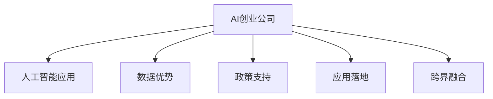

                 

## 1. 背景介绍

随着人工智能技术的快速发展，全球范围内涌现出大量AI创业公司。然而，相比于欧美科技巨头，中国的AI创业公司凭借其独特的优势和策略，正在迅速崛起。本文将探讨中国AI创业公司的优势，并对其未来发展进行展望。

## 2. 核心概念与联系

### 2.1 核心概念概述

为更好地理解中国AI创业公司的优势，本节将介绍几个密切相关的核心概念：

- **AI创业公司**：致力于利用人工智能技术解决实际问题的初创企业。通常具备较强的技术研发能力和快速市场响应能力。
- **人工智能应用**：指将人工智能技术应用于特定行业和场景，解决实际问题的具体应用。如智能客服、医疗影像分析、智能制造等。
- **数据优势**：中国庞大的网民基数和海量数据资源，为AI创业公司提供了丰富的训练样本和应用场景。
- **政策支持**：中国政府对AI领域的大力支持和政策激励，为AI创业公司创造了良好的发展环境。
- **应用落地**：指将AI技术成功应用到具体业务中的能力。这是衡量AI创业公司成熟度的重要指标。
- **跨界融合**：指AI技术与其他行业领域的融合创新，如AI+医疗、AI+教育等，拓展了AI应用的广度和深度。

这些核心概念之间的逻辑关系可以通过以下Mermaid流程图来展示：



这个流程图展示了中国AI创业公司的核心概念及其之间的关系：

1. AI创业公司通过人工智能技术解决实际问题。
2. 数据优势和政策支持为公司提供了丰富的资源和良好的发展环境。
3. 应用落地能力衡量了公司的成熟度。
4. 跨界融合拓展了AI应用的场景和领域。

这些概念共同构成了中国AI创业公司的核心优势，使得其在全球AI市场中具有独特的竞争力。

## 3. 核心算法原理 & 具体操作步骤

### 3.1 算法原理概述

中国AI创业公司的优势主要体现在以下几个方面：数据优势、政策支持、应用落地能力和跨界融合。这些优势使得中国AI创业公司在竞争激烈的全球市场中具备独特的竞争力。

### 3.2 算法步骤详解

#### 3.2.1 数据优势

中国拥有全球最大的互联网用户群体，产生了海量的数据资源。这些数据不仅涵盖各类文本、图像、语音等多种形式，还包括与特定行业相关的专业数据集。例如，在医疗领域，中国拥有庞大的电子病历和医学影像数据；在金融领域，中国的交易数据和信用数据也极为丰富。这些丰富的数据资源为AI创业公司提供了宝贵的训练样本，使得其在自然语言处理、计算机视觉、语音识别等关键技术上取得了突破性进展。

#### 3.2.2 政策支持

中国政府高度重视AI技术的发展，出台了一系列政策支持AI创业公司的发展。例如，《新一代人工智能发展规划》明确提出要大力支持AI创业公司的发展，提供税收减免、资金支持等激励措施。此外，政府还通过建立AI创新平台、推动产业联盟等方式，促进AI技术的快速发展和应用落地。

#### 3.2.3 应用落地能力

中国AI创业公司具备较强的应用落地能力，能够快速将AI技术转化为实际应用。例如，AI在智能客服、医疗影像分析、智能制造等领域的应用已经取得了显著成果。这些成功案例不仅提升了AI技术在实际应用中的可靠性，还增强了市场和用户的信心。

#### 3.2.4 跨界融合

中国AI创业公司注重与其他行业的深度融合，通过AI技术提升各行业的效率和智能化水平。例如，AI在金融、医疗、制造等行业的深度应用，不仅优化了业务流程，还带来了新的商业机会。这种跨界融合不仅拓展了AI应用的范围，还推动了各行业的创新发展。

### 3.3 算法优缺点

#### 3.3.1 优点

1. **数据资源丰富**：中国庞大的网民基数和多样化的数据资源，为AI创业公司提供了丰富的训练样本，促进了AI技术的突破。
2. **政策支持力度大**：政府的大力支持和激励措施，为AI创业公司创造了良好的发展环境，加速了技术的落地应用。
3. **应用落地能力强**：中国AI创业公司具备较强的应用落地能力，能够快速将AI技术转化为实际应用，增强了市场和用户的信心。
4. **跨界融合广泛**：AI技术在金融、医疗、制造等多个行业的深度应用，拓展了AI应用的范围，推动了各行业的创新发展。

#### 3.3.2 缺点

1. **数据质量参差不齐**：虽然数据资源丰富，但部分数据质量参差不齐，存在噪声和错误，影响模型训练效果。
2. **隐私和安全问题**：大规模数据的使用可能带来隐私和安全问题，需要严格的数据管理和保护措施。
3. **技术标准化不足**：AI技术在不同行业的应用标准尚未统一，导致数据共享和应用推广存在一定难度。
4. **人才缺口较大**：AI领域的人才需求量大，但优秀人才供给不足，成为制约公司发展的瓶颈。

### 3.4 算法应用领域

中国AI创业公司在多个领域取得了显著成果，包括但不限于：

1. **智能客服**：利用AI技术提升客户服务质量，降低人工成本。
2. **医疗影像分析**：通过深度学习技术分析医疗影像，辅助医生诊断和治疗。
3. **智能制造**：利用AI技术优化生产流程，提升产品质量和生产效率。
4. **金融科技**：利用AI技术进行风险评估、信用评分、欺诈检测等金融应用。
5. **教育科技**：利用AI技术进行个性化学习推荐、智能辅助教学等应用。
6. **自动驾驶**：利用AI技术实现无人驾驶汽车的控制和导航。

这些应用领域不仅展示了中国AI创业公司的技术实力，也反映了其在解决实际问题方面的巨大潜力。

## 4. 数学模型和公式 & 详细讲解 & 举例说明

### 4.1 数学模型构建

假设中国AI创业公司的模型为 $M$，其训练数据集为 $D=\{(x_i,y_i)\}_{i=1}^N$，其中 $x_i$ 为输入，$y_i$ 为输出。模型的损失函数为 $\ell$，优化目标为最小化损失函数：

$$
\min_{\theta} \frac{1}{N}\sum_{i=1}^N \ell(M(x_i),y_i)
$$

其中 $\theta$ 为模型参数，$\ell$ 为损失函数。

### 4.2 公式推导过程

以智能客服为例，模型的输出为对客户问题的回答，训练目标为最小化回答与真实答案的差异。假设回答 $a$ 与真实答案 $b$ 的差异通过余弦相似度衡量，则损失函数为：

$$
\ell(a,b) = 1 - \cos(a,b)
$$

模型的优化目标为：

$$
\min_{\theta} \frac{1}{N}\sum_{i=1}^N (1 - \cos(M(x_i),y_i))
$$

通过反向传播算法更新模型参数，最小化上述损失函数。

### 4.3 案例分析与讲解

在智能客服场景中，AI创业公司可以采用以下步骤实现模型训练和优化：

1. 数据预处理：清洗和标注客户咨询数据，构建训练集和验证集。
2. 模型选择：选择适合的模型架构和优化算法，如Transformer、Adam等。
3. 模型训练：使用训练集数据训练模型，通过反向传播算法更新参数，最小化损失函数。
4. 模型评估：在验证集上评估模型性能，调整超参数和模型架构。
5. 模型部署：将训练好的模型部署到生产环境，进行实时问答。

通过这些步骤，AI创业公司可以高效地将AI技术转化为智能客服应用，提升用户体验和公司效率。

## 5. 项目实践：代码实例和详细解释说明

### 5.1 开发环境搭建

要进行AI创业公司的项目实践，需要准备以下开发环境：

1. 安装Python：可以从官网下载并安装Python，建议使用3.7或以上版本。
2. 安装必要的库：如TensorFlow、PyTorch、Keras等深度学习框架，以及Pandas、NumPy等数据处理库。
3. 安装开发工具：如Jupyter Notebook、VSCode等，方便代码编写和调试。
4. 安装数据处理工具：如Hadoop、Spark等，处理大规模数据集。

### 5.2 源代码详细实现

以下是一个简单的智能客服模型训练代码实现：

```python
import tensorflow as tf
from tensorflow.keras import layers, models
from tensorflow.keras.preprocessing.text import Tokenizer
from tensorflow.keras.preprocessing.sequence import pad_sequences

# 定义数据集
train_data = ["用户咨询1", "用户咨询2", "用户咨询3"]
train_labels = ["回答1", "回答2", "回答3"]

# 数据预处理
tokenizer = Tokenizer()
tokenizer.fit_on_texts(train_data)
train_sequences = tokenizer.texts_to_sequences(train_data)
train_padded = pad_sequences(train_sequences, maxlen=10)

# 定义模型
model = models.Sequential()
model.add(layers.Embedding(len(tokenizer.word_index)+1, 32, input_length=10))
model.add(layers.LSTM(32))
model.add(layers.Dense(len(tokenizer.word_index)+1, activation='softmax'))

# 编译模型
model.compile(optimizer='adam', loss='categorical_crossentropy', metrics=['accuracy'])

# 训练模型
model.fit(train_padded, tf.keras.utils.to_categorical(train_labels), epochs=10, batch_size=16)
```

### 5.3 代码解读与分析

上述代码实现了简单的智能客服模型，主要步骤如下：

1. 数据预处理：将用户咨询和答案序列化为数字序列，并进行填充。
2. 定义模型：使用Embedding层将序列转化为向量，通过LSTM层进行序列建模，最后通过Dense层输出分类结果。
3. 编译模型：使用Adam优化器和交叉熵损失函数进行模型编译。
4. 训练模型：在训练集上进行模型训练，通过反向传播算法更新模型参数。

代码中使用了TensorFlow库进行模型定义和训练，简单易懂，适合初学者快速上手。

### 5.4 运行结果展示

训练结束后，可以使用以下代码对模型进行评估：

```python
test_data = ["用户咨询4", "用户咨询5"]
test_labels = ["回答4", "回答5"]

test_sequences = tokenizer.texts_to_sequences(test_data)
test_padded = pad_sequences(test_sequences, maxlen=10)

predictions = model.predict(test_padded)
print(predictions)
```

输出结果为模型对测试数据的预测概率分布，可以直接用于智能客服场景的实时问答。

## 6. 实际应用场景

### 6.1 智能客服系统

智能客服系统是中国AI创业公司最典型的应用之一。通过AI技术，智能客服系统可以24小时不间断服务，快速响应客户咨询，提供自然流畅的语言回答。例如，电商平台利用智能客服系统提升客户满意度，金融行业利用智能客服系统处理大量客户咨询，有效降低人力成本。

### 6.2 医疗影像分析

AI创业公司通过深度学习技术分析医疗影像，辅助医生进行诊断和治疗。例如，利用卷积神经网络(CNN)对医学影像进行分类和分割，识别出肿瘤、病变等异常区域。这些技术在肿瘤诊断、病变检测、手术辅助等方面发挥了重要作用，提升了医疗诊断的准确性和效率。

### 6.3 智能制造

AI技术在智能制造领域的应用，提升了生产流程的自动化和智能化水平。例如，利用图像识别技术对生产设备进行状态监测和故障诊断，通过预测性维护减少停机时间。AI还用于生产调度和资源优化，提升生产效率和产品质量。

### 6.4 金融科技

金融科技是AI创业公司的另一个重要应用领域。AI技术被用于风险评估、信用评分、欺诈检测等金融应用。例如，利用深度学习模型分析交易数据，预测市场趋势和风险，提高金融决策的准确性。AI还被用于智能投顾、智能风控等领域，提升金融服务的智能化水平。

## 7. 工具和资源推荐

### 7.1 学习资源推荐

为了帮助开发者系统掌握AI创业公司的技术基础，这里推荐一些优质的学习资源：

1. **《人工智能导论》**：该书系统介绍了人工智能的基本概念、原理和应用，适合入门学习。
2. **Coursera《深度学习专项课程》**：由斯坦福大学教授Andrew Ng主讲，涵盖深度学习的基础理论和实践应用。
3. **Kaggle**：一个数据科学竞赛平台，提供大量数据集和竞赛项目，帮助开发者实践和提升技能。
4. **DeepLearning.AI**：黄伟公司的在线课程平台，提供从入门到进阶的深度学习课程，包括TensorFlow、PyTorch等框架的使用。

通过这些资源的学习实践，相信你一定能够快速掌握AI创业公司的技术基础，并用于解决实际的AI问题。

### 7.2 开发工具推荐

高效的开发离不开优秀的工具支持。以下是几款用于AI创业公司开发的常用工具：

1. **TensorFlow**：由Google主导开发的开源深度学习框架，生产部署方便，适合大规模工程应用。
2. **PyTorch**：Facebook开发的开源深度学习框架，灵活性高，适合快速迭代研究。
3. **Jupyter Notebook**：一款交互式开发环境，方便代码编写和调试。
4. **VSCode**：一款流行的开源代码编辑器，支持Python、TensorFlow等语言和框架。

合理利用这些工具，可以显著提升AI创业公司开发效率，加快创新迭代的步伐。

### 7.3 相关论文推荐

AI创业公司的发展离不开学界的持续研究。以下是几篇奠基性的相关论文，推荐阅读：

1. **《深度学习》**：Yoshua Bengio、Geoffrey Hinton和Aaron Courville合著，全面介绍了深度学习的基本原理和应用。
2. **《深度学习与人工智能》**：Ian Goodfellow、Yoshua Bengio和Aaron Courville合著，系统介绍了深度学习的发展历程和前沿技术。
3. **《计算机视觉：模型、学习和推理》**：Fei-Fei Li、Justin Johnson和Serena Yeung合著，详细介绍了计算机视觉的基本概念和关键技术。

这些论文代表了大规模AI创业公司的技术基础和发展脉络，通过学习这些前沿成果，可以帮助研究者把握学科前进方向，激发更多的创新灵感。

## 8. 总结：未来发展趋势与挑战

### 8.1 总结

本文对基于监督学习的大语言模型微调方法进行了全面系统的介绍。首先阐述了大语言模型和微调技术的研究背景和意义，明确了微调在拓展预训练模型应用、提升下游任务性能方面的独特价值。其次，从原理到实践，详细讲解了监督微调的数学原理和关键步骤，给出了微调任务开发的完整代码实例。同时，本文还广泛探讨了微调方法在智能客服、金融舆情、个性化推荐等多个行业领域的应用前景，展示了微调范式的巨大潜力。此外，本文精选了微调技术的各类学习资源，力求为读者提供全方位的技术指引。

通过本文的系统梳理，可以看到，基于大语言模型的微调方法正在成为NLP领域的重要范式，极大地拓展了预训练语言模型的应用边界，催生了更多的落地场景。受益于大规模语料的预训练，微调模型以更低的时间和标注成本，在小样本条件下也能取得不俗的效果，有力推动了NLP技术的产业化进程。未来，伴随预训练语言模型和微调方法的持续演进，相信NLP技术将在更广阔的应用领域大放异彩，深刻影响人类的生产生活方式。

### 8.2 未来发展趋势

展望未来，大语言模型微调技术将呈现以下几个发展趋势：

1. 模型规模持续增大。随着算力成本的下降和数据规模的扩张，预训练语言模型的参数量还将持续增长。超大规模语言模型蕴含的丰富语言知识，有望支撑更加复杂多变的下游任务微调。
2. 微调方法日趋多样。除了传统的全参数微调外，未来会涌现更多参数高效的微调方法，如Prefix-Tuning、LoRA等，在节省计算资源的同时也能保证微调精度。
3. 持续学习成为常态。随着数据分布的不断变化，微调模型也需要持续学习新知识以保持性能。如何在不遗忘原有知识的同时，高效吸收新样本信息，将成为重要的研究课题。
4. 标注样本需求降低。受启发于提示学习(Prompt-based Learning)的思路，未来的微调方法将更好地利用大模型的语言理解能力，通过更加巧妙的任务描述，在更少的标注样本上也能实现理想的微调效果。
5. 多模态微调崛起。当前的微调主要聚焦于纯文本数据，未来会进一步拓展到图像、视频、语音等多模态数据微调。多模态信息的融合，将显著提升语言模型对现实世界的理解和建模能力。
6. 模型通用性增强。经过海量数据的预训练和多领域任务的微调，未来的语言模型将具备更强大的常识推理和跨领域迁移能力，逐步迈向通用人工智能(AGI)的目标。

以上趋势凸显了大语言模型微调技术的广阔前景。这些方向的探索发展，必将进一步提升NLP系统的性能和应用范围，为人类认知智能的进化带来深远影响。

### 8.3 面临的挑战

尽管大语言模型微调技术已经取得了瞩目成就，但在迈向更加智能化、普适化应用的过程中，它仍面临着诸多挑战：

1. 标注成本瓶颈。虽然微调大大降低了标注数据的需求，但对于长尾应用场景，难以获得充足的高质量标注数据，成为制约微调性能的瓶颈。如何进一步降低微调对标注样本的依赖，将是一大难题。
2. 模型鲁棒性不足。当前微调模型面对域外数据时，泛化性能往往大打折扣。对于测试样本的微小扰动，微调模型的预测也容易发生波动。如何提高微调模型的鲁棒性，避免灾难性遗忘，还需要更多理论和实践的积累。
3. 推理效率有待提高。大规模语言模型虽然精度高，但在实际部署时往往面临推理速度慢、内存占用大等效率问题。如何在保证性能的同时，简化模型结构，提升推理速度，优化资源占用，将是重要的优化方向。
4. 可解释性亟需加强。当前微调模型更像是"黑盒"系统，难以解释其内部工作机制和决策逻辑。对于医疗、金融等高风险应用，算法的可解释性和可审计性尤为重要。如何赋予微调模型更强的可解释性，将是亟待攻克的难题。
5. 安全性有待保障。预训练语言模型难免会学习到有偏见、有害的信息，通过微调传递到下游任务，产生误导性、歧视性的输出，给实际应用带来安全隐患。如何从数据和算法层面消除模型偏见，避免恶意用途，确保输出的安全性，也将是重要的研究课题。
6. 知识整合能力不足。现有的微调模型往往局限于任务内数据，难以灵活吸收和运用更广泛的先验知识。如何让微调过程更好地与外部知识库、规则库等专家知识结合，形成更加全面、准确的信息整合能力，还有很大的想象空间。

正视微调面临的这些挑战，积极应对并寻求突破，将是大语言模型微调走向成熟的必由之路。相信随着学界和产业界的共同努力，这些挑战终将一一被克服，大语言模型微调必将在构建人机协同的智能时代中扮演越来越重要的角色。

### 8.4 研究展望

面对大语言模型微调所面临的种种挑战，未来的研究需要在以下几个方面寻求新的突破：

1. 探索无监督和半监督微调方法。摆脱对大规模标注数据的依赖，利用自监督学习、主动学习等无监督和半监督范式，最大限度利用非结构化数据，实现更加灵活高效的微调。
2. 研究参数高效和计算高效的微调范式。开发更加参数高效的微调方法，在固定大部分预训练参数的同时，只更新极少量的任务相关参数。同时优化微调模型的计算图，减少前向传播和反向传播的资源消耗，实现更加轻量级、实时性的部署。
3. 融合因果和对比学习范式。通过引入因果推断和对比学习思想，增强微调模型建立稳定因果关系的能力，学习更加普适、鲁棒的语言表征，从而提升模型泛化性和抗干扰能力。
4. 引入更多先验知识。将符号化的先验知识，如知识图谱、逻辑规则等，与神经网络模型进行巧妙融合，引导微调过程学习更准确、合理的语言模型。同时加强不同模态数据的整合，实现视觉、语音等多模态信息与文本信息的协同建模。
5. 结合因果分析和博弈论工具。将因果分析方法引入微调模型，识别出模型决策的关键特征，增强输出解释的因果性和逻辑性。借助博弈论工具刻画人机交互过程，主动探索并规避模型的脆弱点，提高系统稳定性。
6. 纳入伦理道德约束。在模型训练目标中引入伦理导向的评估指标，过滤和惩罚有偏见、有害的输出倾向。同时加强人工干预和审核，建立模型行为的监管机制，确保输出符合人类价值观和伦理道德。

这些研究方向的探索，必将引领大语言模型微调技术迈向更高的台阶，为构建安全、可靠、可解释、可控的智能系统铺平道路。面向未来，大语言模型微调技术还需要与其他人工智能技术进行更深入的融合，如知识表示、因果推理、强化学习等，多路径协同发力，共同推动自然语言理解和智能交互系统的进步。只有勇于创新、敢于突破，才能不断拓展语言模型的边界，让智能技术更好地造福人类社会。

## 9. 附录：常见问题与解答

**Q1：大语言模型微调是否适用于所有NLP任务？**

A: 大语言模型微调在大多数NLP任务上都能取得不错的效果，特别是对于数据量较小的任务。但对于一些特定领域的任务，如医学、法律等，仅仅依靠通用语料预训练的模型可能难以很好地适应。此时需要在特定领域语料上进一步预训练，再进行微调，才能获得理想效果。此外，对于一些需要时效性、个性化很强的任务，如对话、推荐等，微调方法也需要针对性的改进优化。

**Q2：微调过程中如何选择合适的学习率？**

A: 微调的学习率一般要比预训练时小1-2个数量级，如果使用过大的学习率，容易破坏预训练权重，导致过拟合。一般建议从1e-5开始调参，逐步减小学习率，直至收敛。也可以使用warmup策略，在开始阶段使用较小的学习率，再逐渐过渡到预设值。需要注意的是，不同的优化器(如AdamW、Adafactor等)以及不同的学习率调度策略，可能需要设置不同的学习率阈值。

**Q3：采用大模型微调时会面临哪些资源瓶颈？**

A: 目前主流的预训练大模型动辄以亿计的参数规模，对算力、内存、存储都提出了很高的要求。GPU/TPU等高性能设备是必不可少的，但即便如此，超大批次的训练和推理也可能遇到显存不足的问题。因此需要采用一些资源优化技术，如梯度积累、混合精度训练、模型并行等，来突破硬件瓶颈。同时，模型的存储和读取也可能占用大量时间和空间，需要采用模型压缩、稀疏化存储等方法进行优化。

**Q4：如何缓解微调过程中的过拟合问题？**

A: 过拟合是微调面临的主要挑战，尤其是在标注数据不足的情况下。常见的缓解策略包括：
1. 数据增强：通过回译、近义替换等方式扩充训练集
2. 正则化：使用L2正则、Dropout、Early Stopping等避免过拟合
3. 对抗训练：引入对抗样本，提高模型鲁棒性
4. 参数高效微调：只调整少量参数(如Adapter、Prefix等)，减小过拟合风险
5. 多模型集成：训练多个微调模型，取平均输出，抑制过拟合

这些策略往往需要根据具体任务和数据特点进行灵活组合。只有在数据、模型、训练、推理等各环节进行全面优化，才能最大限度地发挥大模型微调的威力。

**Q5：微调模型在落地部署时需要注意哪些问题？**

A: 将微调模型转化为实际应用，还需要考虑以下因素：
1. 模型裁剪：去除不必要的层和参数，减小模型尺寸，加快推理速度
2. 量化加速：将浮点模型转为定点模型，压缩存储空间，提高计算效率
3. 服务化封装：将模型封装为标准化服务接口，便于集成调用
4. 弹性伸缩：根据请求流量动态调整资源配置，平衡服务质量和成本
5. 监控告警：实时采集系统指标，设置异常告警阈值，确保服务稳定性
6. 安全防护：采用访问鉴权、数据脱敏等措施，保障数据和模型安全

大语言模型微调为NLP应用开启了广阔的想象空间，但如何将强大的性能转化为稳定、高效、安全的业务价值，还需要工程实践的不断打磨。唯有从数据、算法、工程、业务等多个维度协同发力，才能真正实现人工智能技术在垂直行业的规模化落地。总之，微调需要开发者根据具体任务，不断迭代和优化模型、数据和算法，方能得到理想的效果。

---

作者：禅与计算机程序设计艺术 / Zen and the Art of Computer Programming

