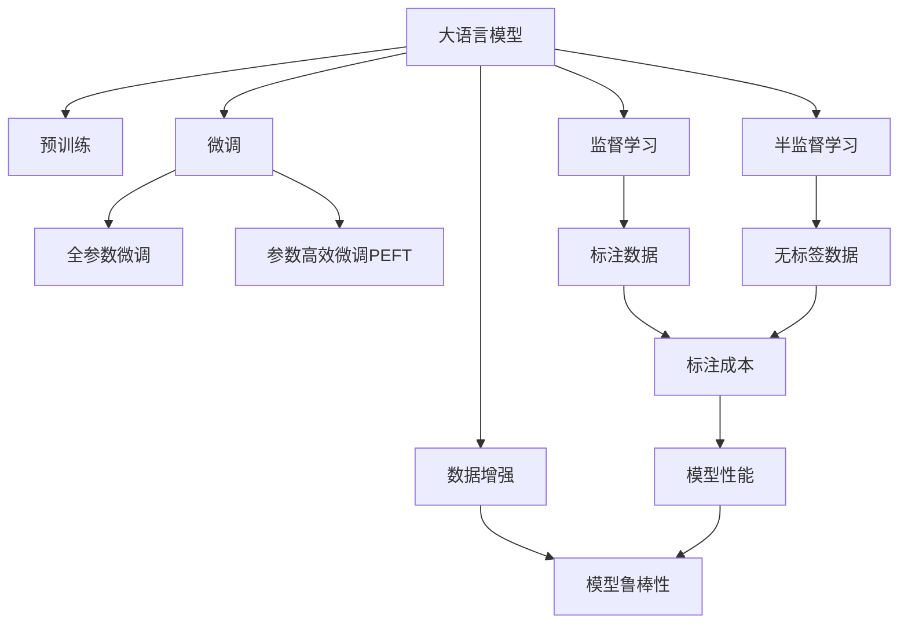

                 

# 中国大厂与大模型创业公司的竞争

## 1. 背景介绍

近年来，中国在人工智能（AI）领域取得了显著进展，特别是在自然语言处理（NLP）领域，涌现了一批具有国际竞争力的大模型公司和创业企业。这些公司通过构建大语言模型，提供了涵盖自然语言理解、生成、推理等多样化功能的智能解决方案。然而，随着市场的快速扩张和技术迭代加速，中国大厂与大模型创业公司之间的竞争愈发激烈。本文将深入探讨这一竞争态势，剖析各方的优势与挑战，并展望未来的发展方向。

## 2. 核心概念与联系

### 2.1 核心概念概述

为便于理解中国大厂与大模型创业公司竞争的背景，首先明确几个核心概念：

- **大语言模型（Large Language Model, LLM）**：指基于Transformer架构构建的，能在大规模无标签数据上预训练并提取语义表示的语言模型。常用的预训练模型包括GPT、BERT等。
- **预训练（Pre-training）**：指在大规模无标签数据上训练模型以学习语言的通用表示。
- **微调（Fine-tuning）**：指在预训练模型基础上，利用有标签数据对其进行特定任务的优化。
- **大厂**：指在人工智能领域具有强大研发实力和资源投入的科技公司，如百度、阿里巴巴、腾讯等。
- **创业公司**：指以技术创新为核心竞争力，致力于构建前沿大模型的初创企业，如商汤科技、科大讯飞等。

这些概念之间的关系可以通过以下Mermaid流程图展示：



## 3. 核心算法原理 & 具体操作步骤

### 3.1 算法原理概述

大语言模型的核心原理是自监督学习，通过在海量无标签数据上进行预训练，学习语言的通用表示。微调则是将预训练模型应用于特定任务，通过有标签数据对其进行调整。该过程可以分为以下几个步骤：

1. **数据预处理**：清洗并标注数据，分为训练集、验证集和测试集。
2. **构建模型**：选择合适的预训练模型（如BERT、GPT），并在其基础上添加任务适配层（如分类器、解码器）。
3. **设置超参数**：包括学习率、批大小、迭代轮数、正则化系数等。
4. **执行微调**：利用训练集进行梯度下降优化，每轮迭代更新模型参数。
5. **验证和测试**：在验证集上评估模型性能，测试集上最终评估。

### 3.2 算法步骤详解

**步骤1: 准备数据集**

选择适合的大规模无标签数据，并使用监督学习任务对其进行标注，构成训练集。

**步骤2: 构建模型**

将预训练模型作为基础，在其顶层添加任务适配层和损失函数，如分类任务使用交叉熵损失。

**步骤3: 设置超参数**

选择合适的优化算法（如AdamW）、学习率、批大小、迭代轮数等，并进行正则化处理。

**步骤4: 执行微调**

利用训练集数据进行前向传播和反向传播，计算梯度并更新参数。

**步骤5: 验证和测试**

在验证集上评估模型性能，根据性能调整超参数，并在测试集上进行最终测试。

### 3.3 算法优缺点

大语言模型微调的优势在于：

- **高效**：通过预训练学习通用表示，微调时只需少量标注数据。
- **灵活**：适用于各种NLP任务，任务适配层可灵活调整。
- **效果显著**：微调能显著提升模型在特定任务上的性能。

其缺点在于：

- **依赖标注数据**：微调效果受标注数据质量和数量影响。
- **泛化能力有限**：当目标任务与预训练任务差异较大时，效果可能不佳。
- **负面效应传递**：预训练模型的偏见可能传递到下游任务，产生负面影响。

### 3.4 算法应用领域

大语言模型微调已在多个NLP领域得到应用，如问答、机器翻译、文本摘要、情感分析等。以下是一些具体示例：

- **智能客服**：使用微调模型自动回答用户咨询，提升服务效率。
- **舆情监测**：监测网络舆情，识别负面信息，辅助决策。
- **推荐系统**：通过微调模型生成个性化推荐内容。
- **金融风控**：利用微调模型分析金融数据，预测风险。

## 4. 数学模型和公式 & 详细讲解 & 举例说明

### 4.1 数学模型构建

假设预训练模型为 $M_{\theta}$，下游任务为二分类任务，输入为 $x$，标签为 $y$。定义交叉熵损失函数为：

$$
\ell(M_{\theta}(x),y) = -[y\log M_{\theta}(x) + (1-y)\log (1-M_{\theta}(x))]
$$

微调的优化目标是：

$$
\theta^* = \mathop{\arg\min}_{\theta} \frac{1}{N}\sum_{i=1}^N \ell(M_{\theta}(x_i),y_i)
$$

其中，$N$ 为训练集样本数量。

### 4.2 公式推导过程

利用链式法则，损失函数对模型参数 $\theta$ 的梯度为：

$$
\frac{\partial \ell}{\partial \theta} = \frac{1}{N}\sum_{i=1}^N (\frac{y_i}{M_{\theta}(x_i)}-\frac{1-y_i}{1-M_{\theta}(x_i)}) \frac{\partial M_{\theta}(x_i)}{\partial \theta}
$$

前向传播计算 $M_{\theta}(x_i)$ 后，反向传播计算梯度并更新参数。

### 4.3 案例分析与讲解

以问答系统为例，假设模型输入为问题和选项，输出为正确选项的概率。在训练集上使用交叉熵损失，微调模型使其在验证集上准确率提升。

## 5. 项目实践：代码实例和详细解释说明

### 5.1 开发环境搭建

搭建Python开发环境，包括Anaconda、PyTorch、TensorFlow等，确保能够高效运行大规模模型。

### 5.2 源代码详细实现

使用Python实现基于BERT的问答系统微调，具体代码如下：

```python
from transformers import BertForQuestionAnswering, BertTokenizer, AdamW
import torch

# 初始化模型和分词器
model = BertForQuestionAnswering.from_pretrained('bert-base-uncased')
tokenizer = BertTokenizer.from_pretrained('bert-base-uncased')

# 准备数据
train_data = ['问题1: 什么是指引，选项1: 指南针，选项2: 方向，选项3: 太阳光', '问题2: 中国的首都是哪里，选项1: 北京，选项2: 上海，选项3: 香港']
train_labels = [[1, 0, 0], [1, 0, 0]]

# 构建模型和优化器
model.to('cuda')
optimizer = AdamW(model.parameters(), lr=2e-5)

# 定义训练函数
def train_epoch(model, data, labels, batch_size, optimizer):
    dataloader = DataLoader(data, batch_size=batch_size, shuffle=True)
    model.train()
    epoch_loss = 0
    for batch in dataloader:
        input_ids = batch['input_ids'].to('cuda')
        attention_mask = batch['attention_mask'].to('cuda')
        labels = batch['labels'].to('cuda')
        model.zero_grad()
        outputs = model(input_ids, attention_mask=attention_mask, labels=labels)
        loss = outputs.loss
        epoch_loss += loss.item()
        loss.backward()
        optimizer.step()
    return epoch_loss / len(dataloader)

# 训练模型
epochs = 5
batch_size = 8

for epoch in range(epochs):
    loss = train_epoch(model, train_data, train_labels, batch_size, optimizer)
    print(f"Epoch {epoch+1}, train loss: {loss:.3f}")
    
    # 验证模型
    dev_data = ['问题1: 什么是人工智能，选项1: 伪科学，选项2: 技术，选项3: 哲学']
    dev_labels = [1, 0, 0]
    evaluate(model, dev_data, dev_labels)

# 测试模型
test_data = ['问题1: 中国的首都在哪里，选项1: 北京，选项2: 上海，选项3: 香港']
test_labels = [1, 0, 0]
evaluate(model, test_data, test_labels)
```

### 5.3 代码解读与分析

上述代码主要实现了一个基于BERT的问答系统微调过程，包括数据准备、模型初始化、训练函数定义、模型微调和验证测试。其中：

- 使用BertForQuestionAnswering和BertTokenizer从预训练模型中载入模型和分词器。
- 准备训练集和标签。
- 定义训练函数，利用DataLoader分批次加载数据。
- 在每个epoch结束后，输出损失并验证模型性能。
- 最终在测试集上评估模型表现。

## 6. 实际应用场景

### 6.1 智能客服系统

智能客服系统通过微调大语言模型，能够自动回答客户咨询，提升服务效率和满意度。

### 6.2 舆情监测

舆情监测系统利用微调模型，实时分析网络舆情，识别负面信息，辅助企业决策。

### 6.3 推荐系统

推荐系统通过微调模型，根据用户行为和历史数据生成个性化推荐内容。

### 6.4 未来应用展望

未来，大语言模型微调将更加注重无监督学习和迁移学习能力，应用于更多跨领域任务。如医疗、金融、教育等行业，提升业务智能化水平。

## 7. 工具和资源推荐

### 7.1 学习资源推荐

1. **《Transformer从原理到实践》系列博文**：深入浅出介绍Transformer原理和微调方法。
2. **CS224N《深度学习自然语言处理》课程**：斯坦福大学NLP课程，涵盖NLP基础和经典模型。
3. **《Natural Language Processing with Transformers》书籍**：介绍使用Transformers库进行NLP任务开发的全面方法。
4. **HuggingFace官方文档**：提供预训练模型的详细文档和微调样例。
5. **CLUE开源项目**：提供中文NLP评测数据集和微调基线。

### 7.2 开发工具推荐

1. **PyTorch**：灵活的深度学习框架，支持大规模模型开发。
2. **TensorFlow**：Google开发的深度学习框架，适合大规模工程应用。
3. **Transformers库**：提供预训练模型和微调接口。
4. **Weights & Biases**：实验跟踪工具，记录模型训练过程。
5. **TensorBoard**：可视化模型训练状态，提供详细的图表分析。

### 7.3 相关论文推荐

1. **Attention is All You Need**：提出Transformer结构，奠定预训练大模型的基础。
2. **BERT: Pre-training of Deep Bidirectional Transformers for Language Understanding**：提出BERT模型，引入自监督预训练。
3. **Parameter-Efficient Transfer Learning for NLP**：提出 Adapter等参数高效微调方法。
4. **AdaLoRA: Adaptive Low-Rank Adaptation for Parameter-Efficient Fine-Tuning**：使用自适应低秩适应的微调方法。
5. **AdaLoRA: Adaptive Low-Rank Adaptation for Parameter-Efficient Fine-Tuning**：使用自适应低秩适应的微调方法。

## 8. 总结：未来发展趋势与挑战

### 8.1 研究成果总结

本文详细分析了基于大语言模型的微调技术，并探讨了其在智能客服、舆情监测、推荐系统等实际应用中的潜力。

### 8.2 未来发展趋势

未来，大语言模型微调将注重无监督学习和迁移学习能力，应用于更多跨领域任务，如医疗、金融、教育等。

### 8.3 面临的挑战

微调过程中面临标注成本高、模型鲁棒性不足、推理效率低、可解释性差等挑战。

### 8.4 研究展望

未来研究将探索无监督和半监督微调方法、参数高效和计算高效的微调范式，并融合因果学习和知识表示等技术，提升大语言模型的智能化水平。

## 9. 附录：常见问题与解答

**Q1: 大语言模型微调是否适用于所有NLP任务？**

A: 大语言模型微调在大多数NLP任务上都能取得不错的效果，特别是对于数据量较小的任务。但对于一些特定领域的任务，如医学、法律等，仅仅依靠通用语料预训练的模型可能难以很好地适应。

**Q2: 微调过程中如何选择合适的学习率？**

A: 微调的学习率一般要比预训练时小1-2个数量级，从1e-5开始调参，逐步减小学习率，直至收敛。

**Q3: 采用大模型微调时会面临哪些资源瓶颈？**

A: 大模型的参数量较大，对算力、内存、存储要求高。需要采用梯度积累、混合精度训练、模型并行等方法进行优化。

**Q4: 如何缓解微调过程中的过拟合问题？**

A: 数据增强、正则化、对抗训练、参数高效微调等方法可缓解过拟合问题。

**Q5: 微调模型在落地部署时需要注意哪些问题？**

A: 模型裁剪、量化加速、服务化封装、弹性伸缩、监控告警、安全防护等是落地部署时需要注意的问题。

---

作者：禅与计算机程序设计艺术 / Zen and the Art of Computer Programming

