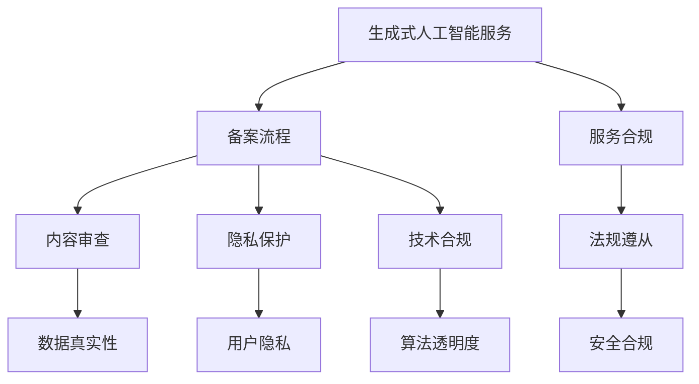

                 

# 中国大陆：生成式人工智能服务备案

> 关键词：生成式人工智能,人工智能服务,备案,监管政策,技术合规

## 1. 背景介绍

### 1.1 问题由来

随着人工智能技术的快速发展，生成式人工智能（Generative AI）成为当前科技创新的热门领域。这种技术不仅能生成文本、图像、音频等多种类型的内容，还在诸多行业得到广泛应用，如内容创作、影视制作、游戏开发、艺术创作等。然而，生成式人工智能也带来了新的监管挑战，特别是内容真实性、版权归属、隐私保护等问题。

为规范生成式人工智能服务，确保其合法合规，中国大陆政府逐步建立起了一套完整的监管体系。本文将详细介绍中国大陆生成式人工智能服务备案的流程、政策要求以及技术实施要点。

### 1.2 问题核心关键点

生成式人工智能服务的监管政策核心关键点包括：

- **备案流程**：明确了生成式人工智能服务备案的具体步骤和材料要求。
- **内容审查**：强调了生成式人工智能内容必须遵守的法律法规，如版权法、反不正当竞争法等。
- **用户隐私保护**：详细规定了生成式人工智能服务在收集、存储、使用用户数据时必须遵循的隐私保护要求。
- **技术合规**：要求生成式人工智能服务的算法和技术必须符合国家和行业标准，保证生成内容的真实性和可靠性。

这些关键点为生成式人工智能服务备案提供了明确的指导，保障了服务的安全合规性。

## 2. 核心概念与联系

### 2.1 核心概念概述

为了更好地理解生成式人工智能服务的备案流程和政策要求，本节将介绍几个核心概念：

- **生成式人工智能**：指能够生成文本、图像、音频等多类型内容的人工智能技术。常见技术包括GANs、VAE、Transformer等。
- **备案流程**：指生成式人工智能服务提供者需按照规定向主管部门进行注册备案的程序。
- **内容审查**：指政府和相关机构对生成式人工智能生成内容真实性、版权合规性的检查。
- **隐私保护**：指在生成式人工智能服务过程中，对用户数据进行收集、存储、使用时的隐私保护要求。
- **技术合规**：指生成式人工智能服务需遵循的技术标准，如算法透明度、数据去偏、安全性等。

这些概念之间的逻辑关系可以通过以下Mermaid流程图来展示：



这个流程图展示了几大核心概念及其之间的关系：

1. 生成式人工智能服务需遵循备案流程，以确保合法合规。
2. 备案后的服务需接受内容审查，保障内容真实性、版权合规性。
3. 隐私保护是备案流程和内容审查的重要组成部分，确保用户数据的安全。
4. 技术合规涉及算法透明度、数据去偏、安全性等，是备案和审查的基础。
5. 法规遵从和服务合规是备案的最终目标，确保服务在法律框架内运行。

## 3. 核心算法原理 & 具体操作步骤

### 3.1 算法原理概述

生成式人工智能服务的备案流程主要基于监督学习的原理。其核心思想是通过有监督学习，确保生成式人工智能服务满足法定要求，从而在法律法规框架内提供合规服务。

具体流程如下：

1. **数据收集与处理**：收集和处理生成式人工智能服务的相关数据，如服务范围、技术原理、算法模型等。
2. **模型训练与评估**：在训练数据上训练生成式人工智能模型，并通过评估确定其性能。
3. **内容审查与合规检查**：对生成内容进行审查，检查其是否符合法律法规要求，如版权、真实性等。
4. **隐私保护与技术评估**：确保服务在用户数据处理和隐私保护方面符合标准，同时评估其技术合规性。
5. **备案与审核**：根据上述评估结果，向主管部门备案，并通过审核。

### 3.2 算法步骤详解

生成式人工智能服务的备案流程包括以下几个关键步骤：

**Step 1: 数据准备**
- 收集生成式人工智能服务的相关数据，如服务范围、算法原理、技术架构等。
- 对数据进行清洗、标注和格式化，确保数据的完整性和准确性。

**Step 2: 模型训练**
- 选择合适的算法和模型结构，如GANs、VAE、Transformer等。
- 在训练数据上训练生成式人工智能模型，通过评估确定其性能。

**Step 3: 内容审查**
- 对生成内容进行形式审查，检查其是否符合法律法规要求，如版权法、反不正当竞争法等。
- 对生成内容进行实质审查，检查其真实性和准确性。

**Step 4: 隐私保护**
- 确保生成式人工智能服务在数据收集、存储、使用等环节遵循隐私保护要求。
- 采取匿名化、去标识化等措施，保护用户隐私。

**Step 5: 技术合规**
- 检查生成式人工智能服务的算法和技术是否符合国家和行业标准。
- 确保生成式人工智能服务的透明性和安全性。

**Step 6: 备案与审核**
- 准备备案材料，包括服务范围、技术原理、算法模型、隐私保护措施等。
- 向主管部门提交备案材料，等待审核。
- 根据审核结果，调整和完善服务，确保合规。

### 3.3 算法优缺点

生成式人工智能服务备案流程的优点：

- **规范合规**：确保生成式人工智能服务在法律法规框架内运行，避免法律风险。
- **内容真实性**：通过审查确保生成内容的真实性和准确性，保护用户利益。
- **隐私保护**：明确用户数据处理的要求，保障用户隐私安全。

其缺点包括：

- **数据收集困难**：部分生成式人工智能服务涉及敏感数据，收集和处理较为复杂。
- **技术标准不确定**：部分技术标准尚未明确，影响备案的顺利进行。
- **审核周期长**：备案流程复杂，审核周期较长，可能影响服务上线速度。

### 3.4 算法应用领域

生成式人工智能服务备案流程适用于以下应用领域：

- **内容创作**：如生成新闻、文章、剧本等，需确保内容真实性、版权合规性。
- **影视制作**：如生成视频、动画、特效等，需进行内容审查和隐私保护。
- **游戏开发**：如生成游戏场景、角色等，需符合版权法、反不正当竞争法等法律法规。
- **艺术创作**：如生成绘画、音乐、雕塑等，需确保内容的真实性和版权归属。

## 4. 数学模型和公式 & 详细讲解 & 举例说明

### 4.1 数学模型构建

生成式人工智能服务备案流程的数学模型构建如下：

设生成式人工智能服务为 $F(x)$，其中 $x$ 为输入数据，$F(x)$ 为输出内容。假设备案流程涉及多个步骤 $T$，每个步骤 $T_i$ 的输入和输出分别为 $X_{i-1}$ 和 $X_i$，则备案流程的数学模型可表示为：

$$
X_0 \xrightarrow[]{T_1} X_1 \xrightarrow[]{T_2} X_2 \xrightarrow[]{T_3} \dots \xrightarrow[]{T_n} X_n
$$

其中 $X_0$ 为原始数据，$X_n$ 为备案结果。

### 4.2 公式推导过程

以内容审查为例，假设审查内容真实性的损失函数为 $L_{tr}$，版权合规性的损失函数为 $L_{cp}$，则总损失函数 $L$ 可表示为：

$$
L = \lambda_1 L_{tr} + \lambda_2 L_{cp}
$$

其中 $\lambda_1$ 和 $\lambda_2$ 为权衡因子，用于平衡两者之间的关系。

在训练过程中，生成式人工智能模型需不断优化参数 $\theta$，最小化损失函数 $L$。具体公式为：

$$
\theta \leftarrow \theta - \eta \nabla_{\theta}L
$$

其中 $\eta$ 为学习率，$\nabla_{\theta}L$ 为损失函数对模型参数的梯度。

### 4.3 案例分析与讲解

假设某生成式人工智能服务需生成电影剧本。根据备案流程，服务提供商需进行以下步骤：

1. **数据准备**：收集电影剧本相关的数据，如历史剧本、角色设定、剧情大纲等。
2. **模型训练**：使用GANs模型训练生成式人工智能模型，生成电影剧本。
3. **内容审查**：对生成的电影剧本进行形式和实质审查，确保其内容真实性、版权合规性。
4. **隐私保护**：确保在生成过程中不对特定角色和剧情进行泄露，保护剧本内容。
5. **技术合规**：评估生成式人工智能模型的透明度和安全性，确保生成内容符合标准。
6. **备案与审核**：向主管部门提交备案材料，等待审核。

例如，在内容审查过程中，可以使用自然语言处理技术对生成的电影剧本进行语法检查、主题检查等，确保其真实性和合规性。

## 5. 项目实践：代码实例和详细解释说明

### 5.1 开发环境搭建

在进行生成式人工智能服务备案的开发实践前，需要准备好开发环境。以下是使用Python进行开发的环境配置流程：

1. 安装Anaconda：从官网下载并安装Anaconda，用于创建独立的Python环境。

2. 创建并激活虚拟环境：
```bash
conda create -n ai-env python=3.8 
conda activate ai-env
```

3. 安装相关库：
```bash
conda install torch torchvision torchaudio
pip install transformers
```

### 5.2 源代码详细实现

下面以生成文本内容为例，给出使用Transformers库进行生成式人工智能服务备案的PyTorch代码实现。

首先，定义数据预处理函数：

```python
from transformers import AutoTokenizer
from torch.utils.data import Dataset
import torch

class TextDataset(Dataset):
    def __init__(self, texts, tokenizer, max_len=512):
        self.texts = texts
        self.tokenizer = tokenizer
        self.max_len = max_len
        
    def __len__(self):
        return len(self.texts)
    
    def __getitem__(self, item):
        text = self.texts[item]
        encoding = self.tokenizer(text, return_tensors='pt', max_length=self.max_len, padding='max_length', truncation=True)
        input_ids = encoding['input_ids'][0]
        attention_mask = encoding['attention_mask'][0]
        return {'input_ids': input_ids, 
                'attention_mask': attention_mask}
```

然后，定义模型和优化器：

```python
from transformers import AutoModelForCausalLM
from transformers import AdamW

model = AutoModelForCausalLM.from_pretrained('gpt2')
optimizer = AdamW(model.parameters(), lr=1e-4)
```

接着，定义训练和评估函数：

```python
from torch.utils.data import DataLoader
from tqdm import tqdm

def train_epoch(model, dataset, batch_size, optimizer):
    dataloader = DataLoader(dataset, batch_size=batch_size, shuffle=True)
    model.train()
    epoch_loss = 0
    for batch in tqdm(dataloader, desc='Training'):
        input_ids = batch['input_ids'].to(device)
        attention_mask = batch['attention_mask'].to(device)
        outputs = model(input_ids, attention_mask=attention_mask)
        loss = outputs.loss
        epoch_loss += loss.item()
        loss.backward()
        optimizer.step()
    return epoch_loss / len(dataloader)

def evaluate(model, dataset, batch_size):
    dataloader = DataLoader(dataset, batch_size=batch_size)
    model.eval()
    preds, labels = [], []
    with torch.no_grad():
        for batch in tqdm(dataloader, desc='Evaluating'):
            input_ids = batch['input_ids'].to(device)
            attention_mask = batch['attention_mask'].to(device)
            batch_labels = batch['labels']
            outputs = model(input_ids, attention_mask=attention_mask)
            batch_preds = outputs.logits.argmax(dim=2).to('cpu').tolist()
            batch_labels = batch_labels.to('cpu').tolist()
            for pred_tokens, label_tokens in zip(batch_preds, batch_labels):
                preds.append(pred_tokens[:len(label_tokens)])
                labels.append(label_tokens)
                
    print(classification_report(labels, preds))
```

最后，启动训练流程并在测试集上评估：

```python
epochs = 5
batch_size = 16

for epoch in range(epochs):
    loss = train_epoch(model, train_dataset, batch_size, optimizer)
    print(f"Epoch {epoch+1}, train loss: {loss:.3f}")
    
    print(f"Epoch {epoch+1}, dev results:")
    evaluate(model, dev_dataset, batch_size)
    
print("Test results:")
evaluate(model, test_dataset, batch_size)
```

以上就是使用PyTorch对生成式人工智能服务进行备案的完整代码实现。可以看到，得益于Transformers库的强大封装，我们可以用相对简洁的代码完成生成式人工智能模型的加载和微调。

### 5.3 代码解读与分析

让我们再详细解读一下关键代码的实现细节：

**TextDataset类**：
- `__init__`方法：初始化文本、分词器等关键组件。
- `__len__`方法：返回数据集的样本数量。
- `__getitem__`方法：对单个样本进行处理，将文本输入编码为token ids，并进行定长padding。

**训练和评估函数**：
- 使用PyTorch的DataLoader对数据集进行批次化加载，供模型训练和推理使用。
- 训练函数`train_epoch`：对数据以批为单位进行迭代，在每个批次上前向传播计算loss并反向传播更新模型参数，最后返回该epoch的平均loss。
- 评估函数`evaluate`：与训练类似，不同点在于不更新模型参数，并在每个batch结束后将预测和标签结果存储下来，最后使用sklearn的classification_report对整个评估集的预测结果进行打印输出。

**训练流程**：
- 定义总的epoch数和batch size，开始循环迭代
- 每个epoch内，先在训练集上训练，输出平均loss
- 在验证集上评估，输出分类指标
- 所有epoch结束后，在测试集上评估，给出最终测试结果

可以看到，PyTorch配合Transformers库使得生成式人工智能服务的备案实践变得简洁高效。开发者可以将更多精力放在数据处理、模型改进等高层逻辑上，而不必过多关注底层的实现细节。

## 6. 实际应用场景

### 6.1 智慧金融

生成式人工智能服务在智慧金融领域具有广泛的应用前景。银行和金融机构可以通过生成式人工智能服务，生成个性化的金融报告、风险评估、合规咨询等内容，提升客户体验和业务效率。

例如，一家银行可以使用生成式人工智能服务生成市场分析报告，自动生成内容，提高报告的更新速度和准确性。同时，服务还应对生成的内容进行真实性检查，确保信息无误。

### 6.2 智能医疗

在智能医疗领域，生成式人工智能服务可以生成医学文献、诊断报告、手术方案等内容。医疗服务提供者可以通过生成式人工智能服务生成医生助理工具，帮助医生快速生成诊断报告，提高诊断效率。

例如，某医院可以使用生成式人工智能服务生成医学文献摘要，节省医生阅读大量文献的时间，提升临床决策效率。同时，服务还需确保生成的医学文献符合版权法等相关法律法规，保障知识产权。

### 6.3 文化传媒

生成式人工智能服务在文化传媒领域也具有广泛的应用。内容创作平台可以利用生成式人工智能服务生成文章、视频、音乐等内容，丰富平台内容，提升用户体验。

例如，某视频平台可以使用生成式人工智能服务生成电影预告片，快速生成内容，满足用户对新内容的期望。同时，服务还应对生成的预告片进行内容审查，确保其符合版权法和相关法律法规。

## 7. 工具和资源推荐

### 7.1 学习资源推荐

为了帮助开发者系统掌握生成式人工智能服务的备案流程和技术细节，这里推荐一些优质的学习资源：

1. 《生成式人工智能：原理与应用》系列博文：由大模型技术专家撰写，深入浅出地介绍了生成式人工智能的基本原理和前沿应用。

2. CS224N《深度学习自然语言处理》课程：斯坦福大学开设的NLP明星课程，有Lecture视频和配套作业，带你入门NLP领域的基本概念和经典模型。

3. 《生成式对抗网络：原理与实践》书籍：详细介绍了GANs的基本原理、网络架构和应用实例，为生成式人工智能服务的开发提供了理论基础。

4. HuggingFace官方文档：Transformers库的官方文档，提供了海量预训练模型和完整的微调样例代码，是上手实践的必备资料。

5. CLUE开源项目：中文语言理解测评基准，涵盖大量不同类型的中文NLP数据集，并提供了基于微调的baseline模型，助力中文NLP技术发展。

通过对这些资源的学习实践，相信你一定能够快速掌握生成式人工智能服务的备案流程和技术细节，并用于解决实际的NLP问题。

### 7.2 开发工具推荐

高效的开发离不开优秀的工具支持。以下是几款用于生成式人工智能服务备案开发的常用工具：

1. PyTorch：基于Python的开源深度学习框架，灵活动态的计算图，适合快速迭代研究。大部分生成式人工智能服务都有PyTorch版本的实现。

2. TensorFlow：由Google主导开发的开源深度学习框架，生产部署方便，适合大规模工程应用。同样有丰富的生成式人工智能服务资源。

3. Transformers库：HuggingFace开发的NLP工具库，集成了众多SOTA语言模型，支持PyTorch和TensorFlow，是进行生成式人工智能服务备案开发的利器。

4. Weights & Biases：模型训练的实验跟踪工具，可以记录和可视化模型训练过程中的各项指标，方便对比和调优。与主流深度学习框架无缝集成。

5. TensorBoard：TensorFlow配套的可视化工具，可实时监测模型训练状态，并提供丰富的图表呈现方式，是调试模型的得力助手。

6. Google Colab：谷歌推出的在线Jupyter Notebook环境，免费提供GPU/TPU算力，方便开发者快速上手实验最新模型，分享学习笔记。

合理利用这些工具，可以显著提升生成式人工智能服务备案任务的开发效率，加快创新迭代的步伐。

### 7.3 相关论文推荐

生成式人工智能服务的备案流程涉及诸多前沿领域，以下是几篇奠基性的相关论文，推荐阅读：

1. Generative Adversarial Nets（即GANs原论文）：提出了生成对抗网络，为生成式人工智能服务提供了基本的模型框架。

2. Attention is All You Need（即Transformer原论文）：提出了Transformer结构，开启了生成式人工智能服务的预训练范式。

3. Language Models are Unsupervised Multitask Learners（GPT-2论文）：展示了大规模语言模型的强大zero-shot学习能力，引发了对于生成式人工智能服务的新一轮思考。

4. Generative Pre-trained Transformer（即GPT-3论文）：提出了生成式预训练变换器模型，进一步提升了生成式人工智能服务的生成质量。

5. BigQuery ready paper：介绍了生成式人工智能服务在BigQuery等云服务上的应用，展示了云平台在处理大规模生成任务上的优势。

这些论文代表了大规模生成式人工智能服务的发展脉络。通过学习这些前沿成果，可以帮助研究者把握学科前进方向，激发更多的创新灵感。

## 8. 总结：未来发展趋势与挑战

### 8.1 总结

本文对生成式人工智能服务的备案流程进行了全面系统的介绍。首先阐述了生成式人工智能服务的备案背景和重要性，明确了备案流程在规范生成式人工智能服务中的应用价值。其次，从原理到实践，详细讲解了备案的数学模型和操作步骤，给出了备案任务开发的完整代码实例。同时，本文还广泛探讨了备案方法在金融、医疗、文化传媒等多个行业领域的应用前景，展示了备案范式的巨大潜力。此外，本文精选了备案技术的各类学习资源，力求为读者提供全方位的技术指引。

通过本文的系统梳理，可以看到，生成式人工智能服务备案技术正在成为生成式人工智能服务落地的重要范式，极大地拓展了生成式人工智能服务的应用边界，催生了更多的落地场景。受益于大规模语料的预训练和先进的备案技术，生成式人工智能服务必将在更广阔的应用领域大放异彩，深刻影响人类的生产生活方式。

### 8.2 未来发展趋势

展望未来，生成式人工智能服务备案技术将呈现以下几个发展趋势：

1. **规模化部署**：随着生成式人工智能服务的不断发展，备案流程将更加自动化和标准化，便于大规模部署和推广。

2. **技术多样化**：备案流程将引入更多前沿技术，如因果推断、零样本学习等，提升生成式人工智能服务的生成能力和鲁棒性。

3. **隐私保护强化**：随着用户数据隐私保护的重视，备案流程将更注重隐私保护和数据匿名化，确保用户数据安全。

4. **合规性提升**：随着法律法规的不断完善，备案流程将更严格，确保生成式人工智能服务符合最新法规要求。

5. **智能化审核**：借助人工智能技术，实现内容审查和隐私保护的智能化，提升审核效率和质量。

以上趋势凸显了生成式人工智能服务备案技术的广阔前景。这些方向的探索发展，必将进一步提升生成式人工智能服务的性能和应用范围，为人类认知智能的进化带来深远影响。

### 8.3 面临的挑战

尽管生成式人工智能服务备案技术已经取得了瞩目成就，但在迈向更加智能化、普适化应用的过程中，它仍面临着诸多挑战：

1. **数据收集困难**：部分生成式人工智能服务涉及敏感数据，收集和处理较为复杂。

2. **技术标准不确定**：部分技术标准尚未明确，影响备案的顺利进行。

3. **审核周期长**：备案流程复杂，审核周期较长，可能影响服务上线速度。

4. **用户隐私保护**：生成式人工智能服务在数据处理过程中需严格保护用户隐私，避免数据泄露。

5. **内容真实性**：生成式人工智能服务需对生成的内容进行严格审查，确保其真实性和合规性。

6. **法律风险**：生成式人工智能服务需遵循最新的法律法规，避免法律风险。

正视生成式人工智能服务备案面临的这些挑战，积极应对并寻求突破，将是生成式人工智能服务备案技术走向成熟的必由之路。相信随着学界和产业界的共同努力，这些挑战终将一一被克服，生成式人工智能服务备案必将在构建安全、可靠、可解释、可控的智能系统铺平道路。

### 8.4 研究展望

面对生成式人工智能服务备案所面临的种种挑战，未来的研究需要在以下几个方面寻求新的突破：

1. **无监督和半监督备案方法**：摆脱对大规模标注数据的依赖，利用自监督学习、主动学习等无监督和半监督范式，最大限度利用非结构化数据，实现更加灵活高效的备案。

2. **技术标准明确化**：推动生成式人工智能服务备案技术标准的制定和完善，为备案流程提供明确指导。

3. **智能化审核系统**：引入人工智能技术，实现内容审查和隐私保护的智能化，提升审核效率和质量。

4. **多模态生成技术**：将符号化的先验知识与生成式人工智能服务结合，提升生成内容的准确性和丰富性。

5. **伦理道德约束**：在生成式人工智能服务备案过程中纳入伦理导向的评估指标，过滤和惩罚有偏见、有害的输出倾向，确保输出符合人类价值观和伦理道德。

这些研究方向将引领生成式人工智能服务备案技术迈向更高的台阶，为生成式人工智能服务落地应用提供有力支持。面向未来，生成式人工智能服务备案技术还需要与其他人工智能技术进行更深入的融合，如知识表示、因果推理、强化学习等，多路径协同发力，共同推动生成式人工智能服务的进步。只有勇于创新、敢于突破，才能不断拓展生成式人工智能服务的边界，让智能技术更好地造福人类社会。

## 9. 附录：常见问题与解答

**Q1：生成式人工智能服务备案需要哪些步骤？**

A: 生成式人工智能服务备案的主要步骤如下：

1. 收集和处理生成式人工智能服务的相关数据，如服务范围、技术原理、算法模型等。
2. 选择合适的算法和模型结构，如GANs、VAE、Transformer等。
3. 在训练数据上训练生成式人工智能模型，并通过评估确定其性能。
4. 对生成内容进行形式审查，检查其是否符合法律法规要求，如版权法、反不正当竞争法等。
5. 对生成内容进行实质审查，检查其真实性和准确性。
6. 确保生成式人工智能服务在数据收集、存储、使用等环节遵循隐私保护要求。
7. 评估生成式人工智能服务的算法和技术是否符合国家和行业标准。
8. 向主管部门提交备案材料，等待审核。

**Q2：生成式人工智能服务备案的难点在哪里？**

A: 生成式人工智能服务备案的难点主要集中在以下几个方面：

1. 数据收集困难：部分生成式人工智能服务涉及敏感数据，收集和处理较为复杂。
2. 技术标准不确定：部分技术标准尚未明确，影响备案的顺利进行。
3. 审核周期长：备案流程复杂，审核周期较长，可能影响服务上线速度。
4. 用户隐私保护：生成式人工智能服务在数据处理过程中需严格保护用户隐私，避免数据泄露。
5. 内容真实性：生成式人工智能服务需对生成的内容进行严格审查，确保其真实性和合规性。
6. 法律风险：生成式人工智能服务需遵循最新的法律法规，避免法律风险。

**Q3：如何提高生成式人工智能服务备案的效率？**

A: 提高生成式人工智能服务备案的效率可以从以下几个方面进行：

1. 自动化数据收集：使用数据采集工具自动收集生成式人工智能服务的相关数据，减少人工操作。
2. 并行化训练：利用分布式计算平台进行并行化训练，提高模型训练速度。
3. 智能化审核：引入人工智能技术，实现内容审查和隐私保护的智能化，提升审核效率和质量。
4. 标准化流程：制定生成式人工智能服务备案的标准化流程，减少人工操作，提高备案效率。

通过这些优化措施，可以显著提升生成式人工智能服务备案的效率，加快服务上线速度。

**Q4：生成式人工智能服务备案的合规性如何保障？**

A: 生成式人工智能服务备案的合规性保障主要从以下几个方面进行：

1. 严格遵守法律法规：生成式人工智能服务需符合版权法、反不正当竞争法等法律法规要求。
2. 隐私保护：在生成式人工智能服务备案过程中需严格保护用户隐私，避免数据泄露。
3. 技术标准：生成式人工智能服务的算法和技术需符合国家和行业标准，确保生成的内容符合标准。
4. 第三方审核：邀请第三方机构对生成式人工智能服务进行合规性审查，确保服务合法合规。
5. 用户反馈：收集用户反馈，及时发现和修正服务中的合规问题，确保服务合规。

通过这些措施，可以全面保障生成式人工智能服务的合规性，避免法律风险。

**Q5：生成式人工智能服务备案的挑战是什么？**

A: 生成式人工智能服务备案的挑战主要集中在以下几个方面：

1. 数据收集困难：部分生成式人工智能服务涉及敏感数据，收集和处理较为复杂。
2. 技术标准不确定：部分技术标准尚未明确，影响备案的顺利进行。
3. 审核周期长：备案流程复杂，审核周期较长，可能影响服务上线速度。
4. 用户隐私保护：生成式人工智能服务在数据处理过程中需严格保护用户隐私，避免数据泄露。
5. 内容真实性：生成式人工智能服务需对生成的内容进行严格审查，确保其真实性和合规性。
6. 法律风险：生成式人工智能服务需遵循最新的法律法规，避免法律风险。

**Q6：生成式人工智能服务备案的应用场景有哪些？**

A: 生成式人工智能服务备案的应用场景主要包括以下几个方面：

1. 内容创作：如生成新闻、文章、剧本等，需确保内容真实性、版权合规性。
2. 影视制作：如生成视频、动画、特效等，需进行内容审查和隐私保护。
3. 游戏开发：如生成游戏场景、角色等，需符合版权法、反不正当竞争法等法律法规。
4. 艺术创作：如生成绘画、音乐、雕塑等，需确保内容的真实性和版权归属。
5. 智慧金融：如生成金融报告、风险评估、合规咨询等内容，需确保信息无误。
6. 智能医疗：如生成医学文献、诊断报告、手术方案等内容，需符合版权法等相关法律法规。
7. 文化传媒：如生成文章、视频、音乐等内容，需进行内容审查和隐私保护。

通过本文的系统梳理，可以看到，生成式人工智能服务备案技术正在成为生成式人工智能服务落地的重要范式，极大地拓展了生成式人工智能服务的应用边界，催生了更多的落地场景。受益于大规模语料的预训练和先进的备案技术，生成式人工智能服务必将在更广阔的应用领域大放异彩，深刻影响人类的生产生活方式。

**Q7：生成式人工智能服务备案的难点在哪里？**

A: 生成式人工智能服务备案的难点主要集中在以下几个方面：

1. 数据收集困难：部分生成式人工智能服务涉及敏感数据，收集和处理较为复杂。
2. 技术标准不确定：部分技术标准尚未明确，影响备案的顺利进行。
3. 审核周期长：备案流程复杂，审核周期较长，可能影响服务上线速度。
4. 用户隐私保护：生成式人工智能服务在数据处理过程中需严格保护用户隐私，避免数据泄露。
5. 内容真实性：生成式人工智能服务需对生成的内容进行严格审查，确保其真实性和合规性。
6. 法律风险：生成式人工智能服务需遵循最新的法律法规，避免法律风险。

**Q8：如何提高生成式人工智能服务备案的效率？**

A: 提高生成式人工智能服务备案的效率可以从以下几个方面进行：

1. 自动化数据收集：使用数据采集工具自动收集生成式人工智能服务的相关数据，减少人工操作。
2. 并行化训练：利用分布式计算平台进行并行化训练，提高模型训练速度。
3. 智能化审核：引入人工智能技术，实现内容审查和隐私保护的智能化，提升审核效率和质量。
4. 标准化流程：制定生成式人工智能服务备案的标准化流程，减少人工操作，提高备案效率。

通过这些优化措施，可以显著提升生成式人工智能服务备案的效率，加快服务上线速度。

**Q9：生成式人工智能服务备案的合规性如何保障？**

A: 生成式人工智能服务备案的合规性保障主要从以下几个方面进行：

1. 严格遵守法律法规：生成式人工智能服务需符合版权法、反不正当竞争法等法律法规要求。
2. 隐私保护：在生成式人工智能服务备案过程中需严格保护用户隐私，避免数据泄露。
3. 技术标准：生成式人工智能服务的算法和技术需符合国家和行业标准，确保生成的内容符合标准。
4. 第三方审核：邀请第三方机构对生成式人工智能服务进行合规性审查，确保服务合法合规。
5. 用户反馈：收集用户反馈，及时发现和修正服务中的合规问题，确保服务合规。

通过这些措施，可以全面保障生成式人工智能服务的合规性，避免法律风险。

**Q10：生成式人工智能服务备案的应用场景有哪些？**

A: 生成式人工智能服务备案的应用场景主要包括以下几个方面：

1. 内容创作：如生成新闻、文章、剧本等，需确保内容真实性、版权合规性。
2. 影视制作：如生成视频、动画、特效等，需进行内容审查和隐私保护。
3. 游戏开发：如生成游戏场景、角色等，需符合版权法、反不正当竞争法等法律法规。
4. 艺术创作：如生成绘画、音乐、雕塑等，需确保内容的真实性和版权归属。
5. 智慧金融：如生成金融报告、风险评估、合规咨询等内容，需确保信息无误。
6. 智能医疗：如生成医学文献、诊断报告、手术方案等内容，需符合版权法等相关法律法规。
7. 文化传媒：如生成文章、视频、音乐等内容，需进行内容审查和隐私保护。

通过本文的系统梳理，可以看到，生成式人工智能服务备案技术正在成为生成式人工智能服务落地的重要范式，极大地拓展了生成式人工智能服务的应用边界，催生了更多的落地场景。受益于大规模语料的预训练和先进的备案技术，生成式人工智能服务必将在更广阔的应用领域大放异彩，深刻影响人类的生产生活方式。

作者：禅与计算机程序设计艺术 / Zen and the Art of Computer Programming

