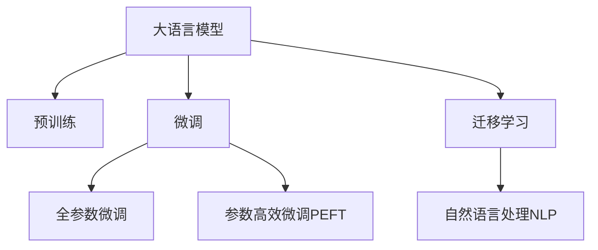

                 

## 1. 背景介绍

在生物医药领域，临床试验是确保新药安全性和有效性的关键环节。传统的临床试验依赖大量人力物力，周期长、成本高，且存在诸多不确定性。近年来，人工智能和大语言模型（Large Language Models, LLM）的兴起，为临床试验带来了新的可能。大语言模型具有强大的自然语言处理能力，可以自动化地处理文本数据、生成临床报告、分析研究结果，极大地提高了临床试验的效率和安全性。

### 1.1 问题由来

在传统的临床试验中，研究人员需要手动收集、整理和分析大量文本数据。这不仅耗费大量时间和人力，还容易出现数据录入错误和分析偏差。尤其是在跨国多中心临床试验中，数据收集和处理流程复杂，不同国家和机构的报告格式和内容也存在差异，增加了工作难度。此外，传统的临床试验方法依赖经验丰富的专家进行决策，容易受到主观偏见的影响，导致结果的不确定性。

### 1.2 问题核心关键点

为了解决这些问题，大语言模型被引入临床试验中。其核心关键点在于：
- **自动化文本处理**：利用自然语言处理能力，自动处理和分析临床试验中的各种文本数据，如研究报告、病例报告、病例摘要等。
- **快速生成报告**：根据输入数据，自动生成符合规范格式的临床报告，提高报告撰写效率。
- **数据一致性**：通过标准化报告格式和内容，确保不同中心间数据的一致性，提高数据质量。
- **辅助决策**：利用数据分析结果，辅助临床试验设计、病例选择和结果分析等决策过程，提升决策准确性和科学性。

### 1.3 问题研究意义

研究大语言模型在临床试验中的应用，对于提升临床试验的效率和安全性，减少试验成本和时间，具有重要意义：

1. **提高效率**：利用自动化技术减少人工操作，降低工作量和时间成本。
2. **提高准确性**：减少人工错误，提高数据处理和分析的准确性。
3. **支持复杂分析**：处理复杂数据和场景，提供更深入的分析结果。
4. **减少偏见**：通过客观数据分析，减少人为偏见对决策的影响。
5. **增强透明度**：自动生成的报告和分析结果，提高了临床试验的透明度和可追溯性。
6. **推动创新**：提供快速反馈和支持，加速新药研发进程。

## 2. 核心概念与联系

### 2.1 核心概念概述

为更好地理解大语言模型在临床试验中的应用，本节将介绍几个密切相关的核心概念：

- **大语言模型**：以自回归或自编码模型为代表的大规模预训练语言模型。通过在海量无标签文本数据上进行预训练，学习通用的语言表示，具备强大的语言理解和生成能力。
- **预训练(Pre-training)**：指在大规模无标签文本语料上，通过自监督学习任务训练通用语言模型的过程。常见的预训练任务包括言语建模、掩码语言模型等。
- **微调(Fine-tuning)**：指在预训练模型的基础上，使用下游任务的少量标注数据，通过有监督学习优化模型在特定任务上的性能。通常只需要调整顶层分类器或解码器，并以较小的学习率更新全部或部分的模型参数。
- **迁移学习(Transfer Learning)**：指将一个领域学习到的知识，迁移应用到另一个不同但相关的领域的学习范式。大模型的预训练-微调过程即是一种典型的迁移学习方式。
- **自然语言处理(NLP)**：利用计算机技术处理、分析和生成自然语言的能力，涵盖文本分类、情感分析、命名实体识别、关系抽取等多种任务。

这些核心概念之间的逻辑关系可以通过以下Mermaid流程图来展示：



这个流程图展示了大语言模型的核心概念及其之间的关系：

1. 大语言模型通过预训练获得基础能力。
2. 微调是对预训练模型进行任务特定的优化，可以分为全参数微调和参数高效微调（PEFT）。
3. 自然语言处理是利用大语言模型处理自然语言数据的过程，涵盖多种NLP任务。
4. 迁移学习是连接预训练模型与下游任务的桥梁，可以通过微调或迁移学习来实现。

这些概念共同构成了大语言模型在临床试验中的应用框架，使其能够在各种场景下发挥强大的自然语言理解和生成能力。

## 3. 核心算法原理 & 具体操作步骤
### 3.1 算法原理概述

基于大语言模型在临床试验中的应用，本质上是一个有监督的细粒度迁移学习过程。其核心思想是：将大语言模型视作一个强大的"文本处理工具"，通过在临床试验数据上进行有监督的微调，使得模型能够自动处理和分析临床试验中的各种文本数据，生成规范化的报告，辅助决策过程，从而提高临床试验的效率和安全性。

形式化地，假设大语言模型为 $M_{\theta}$，其中 $\theta$ 为预训练得到的模型参数。给定临床试验任务的标注数据集 $D=\{(x_i, y_i)\}_{i=1}^N$，微调的目标是找到新的模型参数 $\hat{\theta}$，使得：

$$
\hat{\theta}=\mathop{\arg\min}_{\theta} \mathcal{L}(M_{\theta},D)
$$

其中 $\mathcal{L}$ 为针对任务 $T$ 设计的损失函数，用于衡量模型预测输出与真实标签之间的差异。常见的损失函数包括交叉熵损失、均方误差损失等。

通过梯度下降等优化算法，微调过程不断更新模型参数 $\theta$，最小化损失函数 $\mathcal{L}$，使得模型输出逼近真实标签。由于 $\theta$ 已经通过预训练获得了较好的初始化，因此即便在临床试验数据集 $D$ 上进行微调，也能较快收敛到理想的模型参数 $\hat{\theta}$。

### 3.2 算法步骤详解

基于大语言模型在临床试验中的应用，一般包括以下几个关键步骤：

**Step 1: 准备预训练模型和数据集**
- 选择合适的预训练语言模型 $M_{\theta}$ 作为初始化参数，如 BERT、GPT等。
- 准备临床试验任务的标注数据集 $D$，划分为训练集、验证集和测试集。一般要求标注数据与预训练数据的分布不要差异过大。

**Step 2: 添加任务适配层**
- 根据任务类型，在预训练模型顶层设计合适的输出层和损失函数。
- 对于文本分类任务，通常在顶层添加线性分类器和交叉熵损失函数。
- 对于生成任务，通常使用语言模型的解码器输出概率分布，并以负对数似然为损失函数。

**Step 3: 设置微调超参数**
- 选择合适的优化算法及其参数，如 AdamW、SGD 等，设置学习率、批大小、迭代轮数等。
- 设置正则化技术及强度，包括权重衰减、Dropout、Early Stopping等。
- 确定冻结预训练参数的策略，如仅微调顶层，或全部参数都参与微调。

**Step 4: 执行梯度训练**
- 将训练集数据分批次输入模型，前向传播计算损失函数。
- 反向传播计算参数梯度，根据设定的优化算法和学习率更新模型参数。
- 周期性在验证集上评估模型性能，根据性能指标决定是否触发 Early Stopping。
- 重复上述步骤直到满足预设的迭代轮数或 Early Stopping 条件。

**Step 5: 测试和部署**
- 在测试集上评估微调后模型 $M_{\hat{\theta}}$ 的性能，对比微调前后的精度提升。
- 使用微调后的模型对新样本进行推理预测，集成到实际的应用系统中。
- 持续收集新的数据，定期重新微调模型，以适应数据分布的变化。

以上是基于大语言模型在临床试验中的应用的一般流程。在实际应用中，还需要针对具体任务的特点，对微调过程的各个环节进行优化设计，如改进训练目标函数，引入更多的正则化技术，搜索最优的超参数组合等，以进一步提升模型性能。

### 3.3 算法优缺点

基于大语言模型在临床试验中的应用方法具有以下优点：
1. **自动化处理**：自动化处理文本数据，减少人工操作，提高工作效率。
2. **一致性保障**：通过标准化报告格式和内容，确保不同中心间数据的一致性，提高数据质量。
3. **辅助决策**：利用数据分析结果，辅助临床试验设计、病例选择和结果分析等决策过程，提升决策准确性和科学性。
4. **支持复杂分析**：处理复杂数据和场景，提供更深入的分析结果。
5. **降低成本**：减少人工错误，提高数据处理和分析的准确性，降低成本和时间。

同时，该方法也存在一定的局限性：
1. **依赖标注数据**：微调的效果很大程度上取决于标注数据的质量和数量，获取高质量标注数据的成本较高。
2. **迁移能力有限**：当目标任务与预训练数据的分布差异较大时，微调的性能提升有限。
3. **模型鲁棒性**：面对临床试验中的噪声和异常数据，微调模型的鲁棒性仍需进一步提高。
4. **可解释性不足**：微调模型的决策过程通常缺乏可解释性，难以对其推理逻辑进行分析和调试。

尽管存在这些局限性，但就目前而言，基于大语言模型的微调方法仍是在临床试验中最主流范式。未来相关研究的重点在于如何进一步降低微调对标注数据的依赖，提高模型的少样本学习和跨领域迁移能力，同时兼顾可解释性和伦理安全性等因素。

### 3.4 算法应用领域

基于大语言模型在临床试验中的应用方法，在生物医药领域已经得到了广泛的应用，覆盖了几乎所有常见任务，例如：

- **病例报告生成**：自动生成符合规范格式的病例报告，提高报告撰写效率。
- **数据清洗与整理**：自动化处理和分析临床试验中的各种文本数据，如研究报告、病例报告、病例摘要等。
- **结果分析**：利用数据分析结果，辅助临床试验设计、病例选择和结果分析等决策过程，提升决策准确性和科学性。
- **知识整合**：将临床试验中的各种文本数据进行整合和关联，构建全面的临床知识库。
- **多中心协作**：支持多中心临床试验中的数据共享和分析，促进跨国合作。
- **实时监测**：自动监测临床试验中的数据变化，及时预警异常情况。

除了上述这些经典任务外，大语言模型在临床试验中的应用还包括新药研发、医疗影像分析、药物副作用监测等，为临床试验提供了新的技术和手段，提升了试验的效率和安全性。

## 4. 数学模型和公式 & 详细讲解 & 举例说明

### 4.1 数学模型构建

本节将使用数学语言对大语言模型在临床试验中的应用过程进行更加严格的刻画。

记大语言模型为 $M_{\theta}$，其中 $\theta$ 为模型参数。假设临床试验任务的标注数据集为 $D=\{(x_i,y_i)\}_{i=1}^N, x_i \in \mathcal{X}, y_i \in \mathcal{Y}$。

定义模型 $M_{\theta}$ 在数据样本 $(x,y)$ 上的损失函数为 $\ell(M_{\theta}(x),y)$，则在数据集 $D$ 上的经验风险为：

$$
\mathcal{L}(\theta) = \frac{1}{N} \sum_{i=1}^N \ell(M_{\theta}(x_i),y_i)
$$

微调的优化目标是最小化经验风险，即找到最优参数：

$$
\theta^* = \mathop{\arg\min}_{\theta} \mathcal{L}(\theta)
$$

在实践中，我们通常使用基于梯度的优化算法（如SGD、Adam等）来近似求解上述最优化问题。设 $\eta$ 为学习率，$\lambda$ 为正则化系数，则参数的更新公式为：

$$
\theta \leftarrow \theta - \eta \nabla_{\theta}\mathcal{L}(\theta) - \eta\lambda\theta
$$

其中 $\nabla_{\theta}\mathcal{L}(\theta)$ 为损失函数对参数 $\theta$ 的梯度，可通过反向传播算法高效计算。

### 4.2 公式推导过程

以下我们以文本分类任务为例，推导交叉熵损失函数及其梯度的计算公式。

假设模型 $M_{\theta}$ 在输入 $x$ 上的输出为 $\hat{y}=M_{\theta}(x) \in [0,1]$，表示样本属于正类的概率。真实标签 $y \in \{0,1\}$。则二分类交叉熵损失函数定义为：

$$
\ell(M_{\theta}(x),y) = -[y\log \hat{y} + (1-y)\log (1-\hat{y})]
$$

将其代入经验风险公式，得：

$$
\mathcal{L}(\theta) = -\frac{1}{N}\sum_{i=1}^N [y_i\log M_{\theta}(x_i)+(1-y_i)\log(1-M_{\theta}(x_i))]
$$

根据链式法则，损失函数对参数 $\theta_k$ 的梯度为：

$$
\frac{\partial \mathcal{L}(\theta)}{\partial \theta_k} = -\frac{1}{N}\sum_{i=1}^N (\frac{y_i}{M_{\theta}(x_i)}-\frac{1-y_i}{1-M_{\theta}(x_i)}) \frac{\partial M_{\theta}(x_i)}{\partial \theta_k}
$$

其中 $\frac{\partial M_{\theta}(x_i)}{\partial \theta_k}$ 可进一步递归展开，利用自动微分技术完成计算。

在得到损失函数的梯度后，即可带入参数更新公式，完成模型的迭代优化。重复上述过程直至收敛，最终得到适应临床试验任务的最优模型参数 $\theta^*$。

## 5. 项目实践：代码实例和详细解释说明

### 5.1 开发环境搭建

在进行大语言模型在临床试验中的应用实践前，我们需要准备好开发环境。以下是使用Python进行PyTorch开发的环境配置流程：

1. 安装Anaconda：从官网下载并安装Anaconda，用于创建独立的Python环境。

2. 创建并激活虚拟环境：
```bash
conda create -n pytorch-env python=3.8 
conda activate pytorch-env
```

3. 安装PyTorch：根据CUDA版本，从官网获取对应的安装命令。例如：
```bash
conda install pytorch torchvision torchaudio cudatoolkit=11.1 -c pytorch -c conda-forge
```

4. 安装Transformers库：
```bash
pip install transformers
```

5. 安装各类工具包：
```bash
pip install numpy pandas scikit-learn matplotlib tqdm jupyter notebook ipython
```

完成上述步骤后，即可在`pytorch-env`环境中开始大语言模型在临床试验中的应用实践。

### 5.2 源代码详细实现

这里我们以文本分类任务为例，给出使用Transformers库对BERT模型进行微调的PyTorch代码实现。

首先，定义文本分类任务的数据处理函数：

```python
from transformers import BertTokenizer
from torch.utils.data import Dataset
import torch

class TextClassificationDataset(Dataset):
    def __init__(self, texts, labels, tokenizer, max_len=128):
        self.texts = texts
        self.labels = labels
        self.tokenizer = tokenizer
        self.max_len = max_len
        
    def __len__(self):
        return len(self.texts)
    
    def __getitem__(self, item):
        text = self.texts[item]
        label = self.labels[item]
        
        encoding = self.tokenizer(text, return_tensors='pt', max_length=self.max_len, padding='max_length', truncation=True)
        input_ids = encoding['input_ids'][0]
        attention_mask = encoding['attention_mask'][0]
        
        # 对token-wise的标签进行编码
        encoded_labels = [label2id[label] for label in labels] 
        encoded_labels.extend([label2id['O']] * (self.max_len - len(encoded_labels)))
        labels = torch.tensor(encoded_labels, dtype=torch.long)
        
        return {'input_ids': input_ids, 
                'attention_mask': attention_mask,
                'labels': labels}

# 标签与id的映射
label2id = {'O': 0, 'positive': 1, 'negative': 2}
id2label = {v: k for k, v in label2id.items()}

# 创建dataset
tokenizer = BertTokenizer.from_pretrained('bert-base-cased')

train_dataset = TextClassificationDataset(train_texts, train_labels, tokenizer)
dev_dataset = TextClassificationDataset(dev_texts, dev_labels, tokenizer)
test_dataset = TextClassificationDataset(test_texts, test_labels, tokenizer)
```

然后，定义模型和优化器：

```python
from transformers import BertForTokenClassification, AdamW

model = BertForTokenClassification.from_pretrained('bert-base-cased', num_labels=len(label2id))

optimizer = AdamW(model.parameters(), lr=2e-5)
```

接着，定义训练和评估函数：

```python
from torch.utils.data import DataLoader
from tqdm import tqdm
from sklearn.metrics import classification_report

device = torch.device('cuda') if torch.cuda.is_available() else torch.device('cpu')
model.to(device)

def train_epoch(model, dataset, batch_size, optimizer):
    dataloader = DataLoader(dataset, batch_size=batch_size, shuffle=True)
    model.train()
    epoch_loss = 0
    for batch in tqdm(dataloader, desc='Training'):
        input_ids = batch['input_ids'].to(device)
        attention_mask = batch['attention_mask'].to(device)
        labels = batch['labels'].to(device)
        model.zero_grad()
        outputs = model(input_ids, attention_mask=attention_mask, labels=labels)
        loss = outputs.loss
        epoch_loss += loss.item()
        loss.backward()
        optimizer.step()
    return epoch_loss / len(dataloader)

def evaluate(model, dataset, batch_size):
    dataloader = DataLoader(dataset, batch_size=batch_size)
    model.eval()
    preds, labels = [], []
    with torch.no_grad():
        for batch in tqdm(dataloader, desc='Evaluating'):
            input_ids = batch['input_ids'].to(device)
            attention_mask = batch['attention_mask'].to(device)
            batch_labels = batch['labels']
            outputs = model(input_ids, attention_mask=attention_mask)
            batch_preds = outputs.logits.argmax(dim=2).to('cpu').tolist()
            batch_labels = batch_labels.to('cpu').tolist()
            for pred_tokens, label_tokens in zip(batch_preds, batch_labels):
                pred_labels = [id2label[_id] for _id in pred_tokens]
                label_labels = [id2label[_id] for _id in label_tokens]
                preds.append(pred_labels[:len(label_labels)])
                labels.append(label_labels)
                
    print(classification_report(labels, preds))
```

最后，启动训练流程并在测试集上评估：

```python
epochs = 5
batch_size = 16

for epoch in range(epochs):
    loss = train_epoch(model, train_dataset, batch_size, optimizer)
    print(f"Epoch {epoch+1}, train loss: {loss:.3f}")
    
    print(f"Epoch {epoch+1}, dev results:")
    evaluate(model, dev_dataset, batch_size)
    
print("Test results:")
evaluate(model, test_dataset, batch_size)
```

以上就是使用PyTorch对BERT进行文本分类任务微调的完整代码实现。可以看到，得益于Transformers库的强大封装，我们可以用相对简洁的代码完成BERT模型的加载和微调。

### 5.3 代码解读与分析

让我们再详细解读一下关键代码的实现细节：

**TextClassificationDataset类**：
- `__init__`方法：初始化文本、标签、分词器等关键组件。
- `__len__`方法：返回数据集的样本数量。
- `__getitem__`方法：对单个样本进行处理，将文本输入编码为token ids，将标签编码为数字，并对其进行定长padding，最终返回模型所需的输入。

**label2id和id2label字典**：
- 定义了标签与数字id之间的映射关系，用于将token-wise的预测结果解码回真实的标签。

**训练和评估函数**：
- 使用PyTorch的DataLoader对数据集进行批次化加载，供模型训练和推理使用。
- 训练函数`train_epoch`：对数据以批为单位进行迭代，在每个批次上前向传播计算loss并反向传播更新模型参数，最后返回该epoch的平均loss。
- 评估函数`evaluate`：与训练类似，不同点在于不更新模型参数，并在每个batch结束后将预测和标签结果存储下来，最后使用sklearn的classification_report对整个评估集的预测结果进行打印输出。

**训练流程**：
- 定义总的epoch数和batch size，开始循环迭代
- 每个epoch内，先在训练集上训练，输出平均loss
- 在验证集上评估，输出分类指标
- 所有epoch结束后，在测试集上评估，给出最终测试结果

可以看到，PyTorch配合Transformers库使得BERT微调的代码实现变得简洁高效。开发者可以将更多精力放在数据处理、模型改进等高层逻辑上，而不必过多关注底层的实现细节。

当然，工业级的系统实现还需考虑更多因素，如模型的保存和部署、超参数的自动搜索、更灵活的任务适配层等。但核心的微调范式基本与此类似。

## 6. 实际应用场景

### 6.1 临床试验报告自动生成

在大规模临床试验中，研究者需要撰写详细的试验报告，描述试验设计、方法、结果和讨论。这些报告通常包含大量文本信息，手动编写既耗时又容易出错。使用微调后的文本生成模型，可以自动生成规范化的试验报告，显著提高报告撰写效率。

具体实现上，将临床试验中的各项数据输入模型，输出符合标准格式的试验报告。在生成过程中，模型会自动格式化文本，确保报告的一致性和可读性。这不仅节省了大量时间和人力，还减少了因手动编写报告而产生的错误和遗漏。

### 6.2 数据清洗与整理

临床试验数据通常包含大量文本信息，如研究报告、病例报告、病例摘要等。这些文本数据格式和内容各异，数据清洗和整理工作繁琐且容易出错。通过微调后的文本处理模型，可以自动化地处理和分析这些数据，提高数据质量和处理效率。

具体实现上，将文本数据输入模型，自动进行分词、实体识别、关系抽取等处理，将结构化数据和非结构化数据整合在一起，构建统一的临床数据仓库。这不仅减少了人工操作，还提高了数据的一致性和完整性。

### 6.3 结果分析与可视化

临床试验结果的分析通常需要大量文本信息，如实验方法、结果描述、统计分析等。手动分析这些文本信息既费时又容易出错。通过微调后的文本分析模型，可以自动化地处理和分析这些文本信息，生成详细的分析报告和图表，帮助研究者快速理解和应用试验结果。

具体实现上，将文本数据输入模型，自动进行文本分类、情感分析、知识图谱构建等处理，生成分析报告和可视化图表，帮助研究者更直观地理解试验结果。这不仅提高了分析效率，还减少了分析中的主观偏差。

### 6.4 未来应用展望

随着大语言模型在临床试验中的应用不断发展，其在医疗行业的广泛应用前景将更加广阔。未来，大语言模型将进一步拓展到医疗影像分析、药物副作用监测、疾病预测等领域，为医疗健康事业带来更多创新和突破。

在智慧医疗领域，基于大语言模型的医疗问答、病历分析、药物研发等应用将提升医疗服务的智能化水平，辅助医生诊疗，加速新药研发进程。

在智能健康领域，大语言模型可以用于患者健康监测、疾病预测、个性化医疗等领域，提高医疗服务的精准度和效率。

在公共卫生领域，大语言模型可以用于疾病监测、疫情预警、健康宣传等领域，支持公共卫生应急响应和决策支持。

未来，大语言模型将在医疗健康领域发挥更大的作用，为人类健康事业带来更多创新和突破。相信随着技术的不断成熟，大语言模型在医疗健康领域的应用将更加广泛和深入。

## 7. 工具和资源推荐
### 7.1 学习资源推荐

为了帮助开发者系统掌握大语言模型在临床试验中的应用理论基础和实践技巧，这里推荐一些优质的学习资源：

1. 《Transformer from Reasoning to Optimization》系列博文：由大模型技术专家撰写，深入浅出地介绍了Transformer原理、BERT模型、微调技术等前沿话题。

2. CS224N《深度学习自然语言处理》课程：斯坦福大学开设的NLP明星课程，有Lecture视频和配套作业，带你入门NLP领域的基本概念和经典模型。

3. 《Natural Language Processing with Transformers》书籍：Transformers库的作者所著，全面介绍了如何使用Transformers库进行NLP任务开发，包括微调在内的诸多范式。

4. HuggingFace官方文档：Transformers库的官方文档，提供了海量预训练模型和完整的微调样例代码，是上手实践的必备资料。

5. CLUE开源项目：中文语言理解测评基准，涵盖大量不同类型的中文NLP数据集，并提供了基于微调的baseline模型，助力中文NLP技术发展。

通过对这些资源的学习实践，相信你一定能够快速掌握大语言模型在临床试验中的应用精髓，并用于解决实际的NLP问题。
###  7.2 开发工具推荐

高效的开发离不开优秀的工具支持。以下是几款用于大语言模型在临床试验中的应用开发的常用工具：

1. PyTorch：基于Python的开源深度学习框架，灵活动态的计算图，适合快速迭代研究。大部分预训练语言模型都有PyTorch版本的实现。

2. TensorFlow：由Google主导开发的开源深度学习框架，生产部署方便，适合大规模工程应用。同样有丰富的预训练语言模型资源。

3. Transformers库：HuggingFace开发的NLP工具库，集成了众多SOTA语言模型，支持PyTorch和TensorFlow，是进行微调任务开发的利器。

4. Weights & Biases：模型训练的实验跟踪工具，可以记录和可视化模型训练过程中的各项指标，方便对比和调优。与主流深度学习框架无缝集成。

5. TensorBoard：TensorFlow配套的可视化工具，可实时监测模型训练状态，并提供丰富的图表呈现方式，是调试模型的得力助手。

6. Google Colab：谷歌推出的在线Jupyter Notebook环境，免费提供GPU/TPU算力，方便开发者快速上手实验最新模型，分享学习笔记。

合理利用这些工具，可以显著提升大语言模型在临床试验中的应用开发效率，加快创新迭代的步伐。

### 7.3 相关论文推荐

大语言模型和微调技术的发展源于学界的持续研究。以下是几篇奠基性的相关论文，推荐阅读：

1. Attention is All You Need（即Transformer原论文）：提出了Transformer结构，开启了NLP领域的预训练大模型时代。

2. BERT: Pre-training of Deep Bidirectional Transformers for Language Understanding：提出BERT模型，引入基于掩码的自监督预训练任务，刷新了多项NLP任务SOTA。

3. Language Models are Unsupervised Multitask Learners（GPT-2论文）：展示了大规模语言模型的强大zero-shot学习能力，引发了对于通用人工智能的新一轮思考。

4. Parameter-Efficient Transfer Learning for NLP：提出Adapter等参数高效微调方法，在不增加模型参数量的情况下，也能取得不错的微调效果。

5. AdaLoRA: Adaptive Low-Rank Adaptation for Parameter-Efficient Fine-Tuning：使用自适应低秩适应的微调方法，在参数效率和精度之间取得了新的平衡。

这些论文代表了大语言模型在临床试验中的应用技术的发展脉络。通过学习这些前沿成果，可以帮助研究者把握学科前进方向，激发更多的创新灵感。

## 8. 总结：未来发展趋势与挑战

### 8.1 总结

本文对基于大语言模型在临床试验中的应用方法进行了全面系统的介绍。首先阐述了大语言模型和微调技术的研究背景和意义，明确了微调在提升临床试验效率和安全性方面的独特价值。其次，从原理到实践，详细讲解了微调数学原理和关键步骤，给出了微调任务开发的完整代码实例。同时，本文还广泛探讨了微调方法在临床试验中的多个应用场景，展示了微调范式的巨大潜力。此外，本文精选了微调技术的各类学习资源，力求为读者提供全方位的技术指引。

通过本文的系统梳理，可以看到，基于大语言模型的微调方法正在成为NLP应用的重要范式，极大地拓展了预训练语言模型的应用边界，催生了更多的落地场景。受益于大规模语料的预训练，微调模型以更低的时间和标注成本，在小样本条件下也能取得理想的微调效果，有力推动了NLP技术的产业化进程。未来，伴随预训练语言模型和微调方法的持续演进，相信NLP技术将在更广阔的应用领域大放异彩，深刻影响人类的生产生活方式。

### 8.2 未来发展趋势

展望未来，大语言模型在临床试验中的应用方法将呈现以下几个发展趋势：

1. **模型规模持续增大**：随着算力成本的下降和数据规模的扩张，预训练语言模型的参数量还将持续增长。超大规模语言模型蕴含的丰富语言知识，有望支撑更加复杂多变的临床试验微调。

2. **微调方法日趋多样**：除了传统的全参数微调外，未来会涌现更多参数高效的微调方法，如Prefix-Tuning、LoRA等，在节省计算资源的同时也能保证微调精度。

3. **持续学习成为常态**：随着数据分布的不断变化，微调模型也需要持续学习新知识以保持性能。如何在不遗忘原有知识的同时，高效吸收新样本信息，将成为重要的研究课题。

4. **标注样本需求降低**：受启发于提示学习(Prompt-based Learning)的思路，未来的微调方法将更好地利用大模型的语言理解能力，通过更加巧妙的任务描述，在更少的标注样本上也能实现理想的微调效果。

5. **模型鲁棒性提升**：面对临床试验中的噪声和异常数据，微调模型的鲁棒性仍需进一步提高。如何提高模型的泛化能力和抗干扰能力，是未来研究的重要方向。

6. **可解释性增强**：当前微调模型通常缺乏可解释性，难以对其内部工作机制和决策逻辑进行解释。如何赋予微调模型更强的可解释性，是未来研究的重要方向。

7. **多模态融合**：未来的微调模型将不仅仅是文本处理工具，还将融合视觉、语音等多种模态，实现多模态信息的协同建模，提高模型的综合理解和应用能力。

以上趋势凸显了大语言模型在临床试验中的应用方法的广阔前景。这些方向的探索发展，必将进一步提升临床试验的效率和安全性，推动医学科学的发展。

### 8.3 面临的挑战

尽管大语言模型在临床试验中的应用方法已经取得了瞩目成就，但在迈向更加智能化、普适化应用的过程中，它仍面临着诸多挑战：

1. **标注成本瓶颈**：尽管微调方法降低了标注数据的需求，但对于长尾应用场景，难以获得充足的高质量标注数据，成为制约微调性能的瓶颈。如何进一步降低微调对标注样本的依赖，将是一大难题。

2. **模型鲁棒性不足**：面对临床试验中的噪声和异常数据，微调模型的鲁棒性仍需进一步提高。如何提高模型的泛化能力和抗干扰能力，是未来研究的重要方向。

3. **推理效率有待提高**：大规模语言模型虽然精度高，但在实际部署时往往面临推理速度慢、内存占用大等效率问题。如何在保证性能的同时，简化模型结构，提升推理速度，优化资源占用，将是重要的优化方向。

4. **可解释性亟需加强**：当前微调模型通常缺乏可解释性，难以对其内部工作机制和决策逻辑进行解释。如何赋予微调模型更强的可解释性，是未来研究的重要方向。

5. **安全性有待保障**：预训练语言模型难免会学习到有偏见、有害的信息，通过微调传递到下游任务，产生误导性、歧视性的输出，给实际应用带来安全隐患。如何从数据和算法层面消除模型偏见，避免恶意用途，确保输出的安全性，也将是重要的研究课题。

6. **知识整合能力不足**：现有的微调模型往往局限于任务内数据，难以灵活吸收和运用更广泛的先验知识。如何让微调过程更好地与外部知识库、规则库等专家知识结合，形成更加全面、准确的信息整合能力，还有很大的想象空间。

正视微调面临的这些挑战，积极应对并寻求突破，将是大语言模型在临床试验中应用的必由之路。相信随着学界和产业界的共同努力，这些挑战终将一一被克服，大语言模型在临床试验中的应用必将在构建安全、可靠、可解释、可控的智能系统铺平道路。

### 8.4 研究展望

面对大语言模型在临床试验中的应用方法所面临的挑战，未来的研究需要在以下几个方面寻求新的突破：

1. **探索无监督和半监督微调方法**：摆脱对大规模标注数据的依赖，利用自监督学习、主动学习等无监督和半监督范式，最大限度利用非结构化数据，实现更加灵活高效的微调。

2. **研究参数高效和计算高效的微调范式**：开发更加参数高效的微调方法，在固定大部分预训练参数的同时，只更新极少量的任务相关参数。同时优化微调模型的计算图，减少前向传播和反向传播的资源消耗，实现更加轻量级、实时性的部署。

3. **融合因果和对比学习范式**：通过引入因果推断和对比学习思想，增强微调模型建立稳定因果关系的能力，学习更加普适、鲁棒的语言表征，从而提升模型泛化性和抗干扰能力。

4. **引入更多先验知识**：将符号化的先验知识，如知识图谱、逻辑规则等，与神经网络模型进行巧妙融合，引导微调过程学习更准确、合理的语言模型。同时加强不同模态数据的整合，实现视觉、语音等多模态信息与文本信息的协同建模。

5. **结合因果分析和博弈论工具**：将因果分析方法引入微调模型，识别出模型决策的关键特征，增强输出解释的因果性和逻辑性。借助博弈论工具刻画人机交互过程，主动探索并规避模型的脆弱点，提高系统稳定性。

6. **纳入伦理道德约束**：在模型训练目标中引入伦理导向的评估指标，过滤和惩罚有偏见、有害的输出倾向。同时加强人工干预和审核，建立模型行为的监管机制，确保输出符合人类价值观和伦理道德。

这些研究方向的探索，必将引领大语言模型在临床试验中的应用方法迈向更高的台阶，为构建安全、可靠、可解释、可控的智能系统铺平道路。面向未来，大语言模型在临床试验中的应用方法还需要与其他人工智能技术进行更深入的融合，如知识表示、因果推理、强化学习等，多路径协同发力，共同推动自然语言理解和智能交互系统的进步。只有勇于创新、敢于突破，才能不断拓展语言模型的边界，让智能技术更好地造福人类社会。

## 9. 附录：常见问题与解答

**Q1：大语言模型在临床试验中如何降低标注成本？**

A: 大语言模型可以通过以下方式降低标注成本：
1. **无监督学习和半监督学习**：利用大规模未标注数据进行预训练，减少对标注数据的依赖。
2. **主动学习**：通过模型主动选择最有代表性的样本进行标注，最大化训练数据的信息利用率。
3. **少样本学习**：通过在少量标注样本上训练模型，通过微调或提示学习等方式提高模型的泛化能力。
4. **跨模态学习**：利用图像、音频等多模态数据进行预训练，提高模型的感知能力，减少对文本数据的依赖。

**Q2：大语言模型在临床试验中如何提高模型鲁棒性？**

A: 大语言模型可以通过以下方式提高模型鲁棒性：
1. **数据增强**：通过数据扩充、回译等方式丰富训练集多样性，增强模型的泛化能力。
2. **对抗训练**：引入对抗样本，训练模型对抗扰动，提高模型的鲁棒性和鲁棒性。
3. **正则化技术**：使用L2正则、Dropout等技术，防止模型过拟合，增强模型的鲁棒性。
4. **参数高效微调**：只更新少量的模型参数，固定大部分预训练权重，减少过拟合风险。
5. **集成学习**：将多个微调模型集成，取平均输出，抑制过拟合，提高模型鲁棒性。

**Q3：大语言模型在临床试验中如何进行少样本学习？**

A: 大语言模型可以通过以下方式进行少样本学习：
1. **提示学习(Prompt-based Learning)**：通过精心设计输入文本的格式，引导模型按期望方式输出，减少微调参数。
2. **转移学习(Transfer Learning)**：利用预训练模型在相关领域进行微调，提升少样本学习效果。
3. **模型压缩和稀疏化**：通过模型压缩和稀疏化技术，减少模型参数，提高少样本学习效率。
4. **零样本学习(Zero-shot Learning)**：通过任务描述和预训练模型的知识，进行推理和生成，无需任何标注样本。

**Q4：大语言模型在临床试验中如何进行跨模态融合？**

A: 大语言模型可以通过以下方式进行跨模态融合：
1. **多模态预训练**：利用图像、音频等多模态数据进行预训练，提高模型的感知能力。
2. **多模态微调**：在预训练模型的基础上，对多模态数据进行微调，提升模型的综合理解和应用能力。
3. **跨模态特征对齐**：通过多模态特征对齐技术，将不同模态的数据映射到统一的空间，增强模型的跨模态处理能力。
4. **跨模态推理**：利用跨模态推理技术，将不同模态的数据进行联合推理，提高模型的综合推理能力。

这些技术手段将帮助大语言模型在临床试验中更好地融合多模态数据，提升模型的综合应用能力。

---

作者：禅与计算机程序设计艺术 / Zen and the Art of Computer Programming

