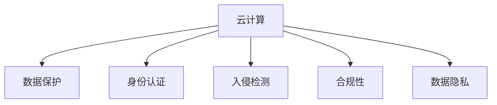

                 

# 云计算安全：保护云端数据

> 关键词：云计算安全,数据保护,加密技术,身份认证,入侵检测,合规性,数据隐私,合规监管

## 1. 背景介绍

### 1.1 问题由来
随着云计算技术的快速发展，越来越多的企业和组织将数据和应用部署在云端，享受云服务带来的便利性和扩展性。然而，云计算环境下的复杂性也带来了新的安全挑战。如何确保云计算环境的安全，保护云端数据不受未经授权的访问、篡改和泄露，成为了企业面临的重要问题。

### 1.2 问题核心关键点
云计算安全主要涉及以下几个方面：

- **数据保护**：确保数据在传输、存储和处理过程中不被窃取、篡改或泄露。
- **身份认证**：确保只有授权用户能够访问云资源和数据。
- **入侵检测**：实时监控云环境中的异常行为，及时发现并阻止潜在威胁。
- **合规性**：确保云环境符合相关的法律、法规和行业标准，如GDPR、HIPAA等。
- **数据隐私**：保护用户隐私数据，避免数据滥用和非法交易。

### 1.3 问题研究意义
云计算安全研究具有重要意义：

- **保障业务连续性**：确保云计算环境的安全稳定，防止业务中断和数据丢失。
- **提升用户信任度**：保护用户数据安全，增强用户对云服务的信任和依赖。
- **降低法律风险**：符合法律法规要求，避免因数据泄露等事件引发的法律责任。
- **增强竞争力**：通过先进的安全技术，提升企业的市场竞争力。

## 2. 核心概念与联系

### 2.1 核心概念概述

为更好地理解云计算安全，本节将介绍几个关键概念：

- **云计算**：基于互联网的计算服务，包括基础设施即服务(IaaS)、平台即服务(PaaS)和软件即服务(SaaS)等。
- **数据保护**：通过加密、备份等手段确保数据在传输和存储过程中的安全性。
- **身份认证**：验证用户身份，确保只有授权用户能够访问云资源。
- **入侵检测**：实时监控云环境，及时发现和阻止恶意行为。
- **合规性**：确保云服务符合相关的法律、法规和行业标准。
- **数据隐私**：保护用户隐私数据，避免数据滥用和非法交易。

这些概念之间的逻辑关系可以通过以下Mermaid流程图来展示：



这个流程图展示了云计算安全的核心概念及其相互关系：

1. 云计算提供基础环境，涉及到数据保护、身份认证、入侵检测和数据隐私等多个方面。
2. 数据保护、身份认证、入侵检测和合规性是保障云计算安全的关键手段。
3. 数据隐私是保护用户数据的基本原则。

## 3. 核心算法原理 & 具体操作步骤
### 3.1 算法原理概述

云计算安全的主要算法原理包括数据加密、身份认证、入侵检测和合规性管理等。这些算法通过不同的技术手段，共同构建起一个多层次、多维度的安全防护体系。

- **数据加密**：使用加密算法对数据进行加密，确保数据在传输和存储过程中不被窃取或篡改。
- **身份认证**：通过密码、令牌、生物特征等多种方式验证用户身份，确保只有授权用户能够访问云资源。
- **入侵检测**：实时监控云环境，检测异常行为，及时阻止潜在威胁。
- **合规性管理**：通过定期审计、日志记录等方式，确保云服务符合相关法规和标准。

### 3.2 算法步骤详解

云计算安全的具体操作步骤如下：

**Step 1: 选择合适的加密算法和密钥管理方案**
- 选择适合的加密算法（如AES、RSA等）对数据进行加密。
- 设计密钥管理策略，确保密钥的安全性，如密钥轮换、密钥分割等。

**Step 2: 实施数据保护措施**
- 对数据进行加密，确保数据在传输和存储过程中的安全性。
- 实施备份和恢复机制，防止数据丢失。
- 使用访问控制列表(ACL)、数据分级等手段保护敏感数据。

**Step 3: 设计身份认证方案**
- 采用多因素身份认证(MFA)，如密码、短信验证码、指纹识别等。
- 实施角色基于访问控制(RBAC)，确保用户只能访问其权限内的资源。
- 使用单点登录(SSO)技术简化登录流程，提高用户体验。

**Step 4: 部署入侵检测系统**
- 实时监控云环境，检测异常行为，如非法登录、异常访问等。
- 分析日志记录，识别潜在威胁。
- 使用入侵防御系统(IPS)，阻止恶意流量和攻击。

**Step 5: 实施合规性管理**
- 定期审计云环境，确保符合相关法规和标准。
- 记录和保留日志，以备审计和调查。
- 使用第三方安全评估工具，评估安全漏洞和风险。

### 3.3 算法优缺点

云计算安全算法的主要优点包括：

1. **全面防护**：涵盖数据保护、身份认证、入侵检测和合规性管理等多个方面，提供多层次的防护。
2. **灵活性高**：可以根据具体业务需求，选择不同的技术手段和工具，灵活配置安全策略。
3. **自动化管理**：通过自动化工具和流程，提高安全管理的效率和准确性。

同时，这些算法也存在一定的缺点：

1. **复杂度高**：涉及多个技术领域，实施和管理复杂。
2. **成本高**：高级的安全技术往往需要投入较高的成本。
3. **依赖性高**：安全策略的成功依赖于系统的可靠性和员工的执行力度。

### 3.4 算法应用领域

云计算安全技术广泛应用于以下几个领域：

- **企业云环境**：保护企业云平台和应用数据，确保业务连续性和用户隐私。
- **政府云平台**：确保政府数据和服务的机密性、完整性和可用性。
- **医疗云系统**：保护患者健康数据，符合HIPAA等法规要求。
- **金融云服务**：保护客户数据和交易记录，符合PCI DSS等标准。
- **教育云平台**：保护学生数据和教学资源，确保数据隐私和安全。

## 4. 数学模型和公式 & 详细讲解 & 举例说明

### 4.1 数学模型构建

本节将使用数学语言对云计算安全的关键算法进行更加严格的刻画。

- **数据加密模型**：假设要加密的数据为 $M$，加密密钥为 $K$，加密算法为 $E$，则加密后的密文为 $C=E(M, K)$。
- **身份认证模型**：用户输入的凭证为 $P$，验证算法为 $V$，系统生成的令牌为 $T$，则身份认证流程为 $V(P, T)$。
- **入侵检测模型**：监控数据为 $D$，入侵检测算法为 $ID$，威胁记录为 $R$，则检测流程为 $ID(D)$。
- **合规性管理模型**：合规性检查算法为 $C$，日志数据为 $L$，合规性评估结果为 $R$，则评估流程为 $C(L)$。

### 4.2 公式推导过程

以下我们以AES加密算法为例，推导加密和解密的数学公式。

假设明文为 $M$，密钥为 $K$，使用AES加密算法，则加密过程的数学公式为：

$$
C = AES_K(M) = F(K, M)
$$

其中 $F$ 表示AES算法的加密函数。解密过程的数学公式为：

$$
M = AES_K^{-1}(C) = F(K^{-1}, C)
$$

解密函数 $AES_K^{-1}$ 是加密函数 $F$ 的反函数，密钥 $K$ 和 $C$ 是解密函数的输入。

### 4.3 案例分析与讲解

以一个企业云环境为例，分析云计算安全的实施过程：

1. **数据加密**：企业将敏感数据存储在云端，使用AES算法进行加密，确保数据在传输和存储过程中不被窃取或篡改。
2. **身份认证**：员工登录时，通过多因素身份认证(MFA)，输入密码和指纹，系统验证通过后生成令牌，确保只有授权用户能够访问云资源。
3. **入侵检测**：云平台部署入侵检测系统(IDS)，实时监控网络流量，检测异常行为，如非法登录尝试、异常访问等，并生成威胁记录。
4. **合规性管理**：定期审计云平台，记录和保留日志，使用第三方安全评估工具，确保符合GDPR等法规要求。

## 5. 项目实践：代码实例和详细解释说明

### 5.1 开发环境搭建

在进行云计算安全项目实践前，我们需要准备好开发环境。以下是使用Python进行OpenSSL开发的Python环境配置流程：

1. 安装OpenSSL库：使用pip安装OpenSSL库，可以从Python官方文档或OpenSSL官网获取安装命令。
```bash
pip install OpenSSL
```

2. 安装PyCryptodome：这是一个Python加密库，支持AES、RSA等多种加密算法。
```bash
pip install pycryptodome
```

3. 安装Fernet库：这是一个基于AES加密算法的库，用于简单加密数据的存储。
```bash
pip install ferment
```

4. 安装Jupyter Notebook：一个强大的交互式开发环境，适合编写和调试加密算法。
```bash
pip install jupyter
```

5. 安装相关依赖库：
```bash
pip install numpy pandas scikit-learn
```

完成上述步骤后，即可在Python环境中开始加密算法的开发。

### 5.2 源代码详细实现

下面以AES加密算法为例，给出使用Python和PyCryptodome库进行数据加密的代码实现。

```python
from Crypto.Cipher import AES
from Crypto.Random import get_random_bytes
import base64

# 生成16字节的随机密钥
key = get_random_bytes(16)

# 加密函数
def encrypt(data):
    cipher = AES.new(key, AES.MODE_EAX)
    ciphertext, tag = cipher.encrypt_and_digest(data.encode())
    return base64.b64encode(ciphertext), base64.b64encode(tag)

# 解密函数
def decrypt(ciphertext, tag):
    cipher = AES.new(key, AES.MODE_EAX, tag=tag)
    plaintext = cipher.decrypt_and_verify(ciphertext, base64.b64decode(tag))
    return plaintext.decode()

# 测试
plaintext = "这是一段要加密的文本。"
ciphertext, tag = encrypt(plaintext)
decrypted = decrypt(ciphertext, tag)
print("原始文本：", plaintext)
print("加密后文本：", ciphertext.decode())
print("解密后文本：", decrypted)
```

### 5.3 代码解读与分析

让我们再详细解读一下关键代码的实现细节：

**加密函数**：
- 使用 `get_random_bytes` 生成一个16字节的随机密钥。
- 创建AES加密对象，使用CBC模式和随机IV。
- 调用 `encrypt_and_digest` 方法加密数据，并返回密文和认证标签。
- 使用 `base64.b64encode` 对密文和认证标签进行编码，便于存储和传输。

**解密函数**：
- 创建AES解密对象，使用CBC模式和认证标签。
- 调用 `decrypt_and_verify` 方法解密数据，并验证认证标签。
- 使用 `base64.b64decode` 对密文和认证标签进行解码，还原原始数据。

**测试**：
- 使用 `encrypt` 函数对明文进行加密，获取密文和认证标签。
- 使用 `decrypt` 函数对密文和认证标签进行解密，还原原始文本。

## 6. 实际应用场景
### 6.1 智能客服系统

智能客服系统是云计算安全的一个重要应用场景。传统的客服系统依赖人工处理客户咨询，效率低下，且难以满足复杂和多变的客户需求。通过部署基于云计算安全的智能客服系统，可以大幅提升服务效率和质量。

在实际应用中，可以部署在云端的多层安全防护体系，保护客服系统的数据和功能。具体而言，可以采用以下措施：

- **数据加密**：对客户敏感信息进行加密，确保数据在传输和存储过程中的安全性。
- **身份认证**：对客户和客服人员进行身份验证，确保只有授权用户能够访问系统。
- **入侵检测**：实时监控客服系统，检测异常行为，防止恶意攻击和数据泄露。
- **合规性管理**：确保客服系统符合GDPR等法规要求，保护客户隐私。

### 6.2 金融服务系统

金融服务系统是另一个重要的云计算安全应用场景。金融数据具有高度敏感性和复杂性，需要严格的数据保护和身份认证措施。

具体而言，可以采用以下措施：

- **数据加密**：对客户交易记录、账户信息等敏感数据进行加密，确保数据在传输和存储过程中的安全性。
- **身份认证**：采用多因素身份认证，确保只有授权用户能够访问金融系统。
- **入侵检测**：实时监控金融系统，检测异常行为，防止恶意攻击和数据泄露。
- **合规性管理**：确保金融系统符合PCI DSS等法规要求，保护客户隐私。

### 6.3 政府云平台

政府云平台需要保护大量敏感数据和政府事务信息，保障数据安全和业务连续性。

具体而言，可以采用以下措施：

- **数据加密**：对政府数据进行加密，确保数据在传输和存储过程中的安全性。
- **身份认证**：采用多因素身份认证，确保只有授权用户能够访问政府云平台。
- **入侵检测**：实时监控政府云平台，检测异常行为，防止恶意攻击和数据泄露。
- **合规性管理**：确保政府云平台符合GDPR等法规要求，保护公民隐私。

## 7. 工具和资源推荐
### 7.1 学习资源推荐

为了帮助开发者系统掌握云计算安全理论基础和实践技巧，这里推荐一些优质的学习资源：

1. **《云计算安全原理与实践》**：这本书详细介绍了云计算安全的原理、技术和实践，适合初学者和高级开发者参考。
2. **CSAF安全认证培训**：这是一个权威的云计算安全认证培训课程，涵盖了云计算安全的各个方面，适合希望系统学习云计算安全的人士。
3. **《数据加密与保护技术》**：这本书深入讲解了数据加密和保护技术，适合深入研究数据加密算法的开发者。
4. **OpenSSL官方文档**：这是OpenSSL库的官方文档，提供了详细的API和使用示例，适合开发者学习和实践。
5. **PyCryptodome官方文档**：这是PyCryptodome库的官方文档，提供了详细的API和使用示例，适合开发者学习和实践。

### 7.2 开发工具推荐

高效的开发离不开优秀的工具支持。以下是几款用于云计算安全开发的常用工具：

1. **OpenSSL**：一个强大的开源加密库，支持多种加密算法和协议。
2. **PyCryptodome**：一个Python加密库，支持AES、RSA等多种加密算法。
3. **Fernet**：一个基于AES加密算法的库，用于简单加密数据的存储。
4. **Jupyter Notebook**：一个强大的交互式开发环境，适合编写和调试加密算法。
5. **Docker**：一个容器化平台，方便部署和管理云环境。

### 7.3 相关论文推荐

云计算安全研究源于学界的持续研究。以下是几篇奠基性的相关论文，推荐阅读：

1. **《云计算安全架构设计》**：提出了一种基于云架构的安全设计模型，适合研究和应用云计算安全的人士参考。
2. **《基于云的安全身份认证机制》**：提出了一种基于云架构的身份认证机制，适合研究和应用身份认证技术的人士参考。
3. **《云平台的安全审计与合规性管理》**：提出了一种云平台的安全审计和合规性管理方法，适合研究和应用合规性管理技术的人士参考。

## 8. 总结：未来发展趋势与挑战
### 8.1 总结

本文对云计算安全的核心概念、算法原理和操作步骤进行了全面系统的介绍。首先阐述了云计算安全的研究背景和意义，明确了云计算安全的多层次防护目标。其次，从原理到实践，详细讲解了数据加密、身份认证、入侵检测和合规性管理等关键算法的数学模型和公式推导，给出了具体的代码实现。同时，本文还广泛探讨了云计算安全在智能客服、金融服务、政府云平台等实际应用场景中的应用前景，展示了云计算安全的广泛应用价值。

通过对这些核心概念和算法的深入解析，相信读者已经能够系统掌握云计算安全的技术要点和应用方法。

### 8.2 未来发展趋势

展望未来，云计算安全技术将呈现以下几个发展趋势：

1. **自动化和智能化**：通过自动化工具和智能化算法，提高云计算安全的防护能力和效率。
2. **零信任架构**：基于零信任架构的安全模型，假设所有用户都是潜在威胁，实施严格的访问控制和身份认证。
3. **数据隐私保护**：采用先进的隐私保护技术，确保数据在传输和存储过程中的隐私性和安全性。
4. **区块链技术**：利用区块链技术，实现数据和交易的不可篡改性和透明性。
5. **人工智能**：通过人工智能技术，提升入侵检测和异常行为的识别能力。

以上趋势凸显了云计算安全技术的广阔前景。这些方向的探索发展，必将进一步提升云计算环境的安全性和可靠性，保障数据和业务的安全。

### 8.3 面临的挑战

尽管云计算安全技术已经取得了一定进展，但在迈向更加智能化和自动化的过程中，仍然面临诸多挑战：

1. **成本高昂**：高级的安全技术往往需要投入较高的成本，中小企业难以承受。
2. **技术复杂**：云计算安全的防护体系涉及多个技术领域，实施和管理复杂。
3. **缺乏标准化**：缺乏统一的云计算安全标准和规范，各云平台之间的互操作性差。
4. **人为因素**：系统的安全性依赖于员工的执行力度，缺乏系统性的培训和管理。
5. **法规不完善**：现有的法律法规对云计算安全的规定还不够完善，存在法律风险。

### 8.4 研究展望

针对这些挑战，未来的研究需要在以下几个方面寻求新的突破：

1. **降低成本**：开发低成本、高效能的云计算安全解决方案，降低中小企业的使用门槛。
2. **简化管理**：开发易用、易维护的安全工具和流程，降低管理和操作的复杂度。
3. **标准化**：推动云计算安全标准的制定和实施，提高各云平台之间的互操作性。
4. **培训教育**：加强安全意识和技能培训，提高员工的安全防护能力。
5. **法律完善**：完善法律法规，明确云计算安全的责任和义务，减少法律风险。

这些研究方向将推动云计算安全技术的持续进步，保障云计算环境的稳定性和安全性，提升用户的信任度和依赖度。

## 9. 附录：常见问题与解答

**Q1：如何选择合适的加密算法？**

A: 选择合适的加密算法应考虑以下几个因素：

1. **安全性**：选择安全性高的加密算法，如AES、RSA等。
2. **效率**：选择效率高的加密算法，如AES、CHACHA等。
3. **兼容性**：选择支持主流平台和系统的加密算法，如Python、Java等。
4. **易用性**：选择易用、易维护的加密库，如PyCryptodome、OpenSSL等。

**Q2：如何保障云环境的安全？**

A: 保障云环境的安全可以从以下几个方面入手：

1. **数据加密**：对数据进行加密，确保数据在传输和存储过程中的安全性。
2. **身份认证**：对用户和设备进行身份验证，确保只有授权用户和设备能够访问云资源。
3. **入侵检测**：实时监控云环境，检测异常行为，及时阻止潜在威胁。
4. **合规性管理**：确保云服务符合相关法规和标准，定期审计和评估安全状态。

**Q3：如何应对云环境的安全威胁？**

A: 应对云环境的安全威胁可以从以下几个方面入手：

1. **定期审计**：定期审计云环境，发现和修复安全漏洞。
2. **日志记录**：记录和保留日志，分析异常行为，及时发现和处理威胁。
3. **入侵防御**：部署入侵防御系统(IDS)，阻止恶意流量和攻击。
4. **应急响应**：制定应急响应计划，及时应对安全事件。

**Q4：云计算安全与传统安全有哪些区别？**

A: 云计算安全与传统安全的区别主要在于：

1. **环境复杂**：云计算环境比传统环境更复杂，涉及更多的用户、设备和资源。
2. **安全责任**：云计算安全涉及到云服务提供商和用户两方面，责任划分更加复杂。
3. **数据共享**：云计算环境中的数据共享和访问更加频繁，安全风险增加。
4. **自动化管理**：云计算安全更多地依赖自动化工具和流程，提升效率和准确性。

**Q5：如何确保合规性？**

A: 确保合规性可以从以下几个方面入手：

1. **合规审计**：定期进行合规审计，确保符合相关法规和标准。
2. **日志记录**：记录和保留日志，确保审计和调查的透明性和可追溯性。
3. **第三方评估**：使用第三方安全评估工具，评估安全漏洞和风险。
4. **员工培训**：加强员工的安全意识和技能培训，提升安全防护能力。

总之，云计算安全是一个复杂而重要的领域，需要从多个角度入手，综合运用各种技术手段，才能确保云环境的安全和可靠。

---

作者：禅与计算机程序设计艺术 / Zen and the Art of Computer Programming

