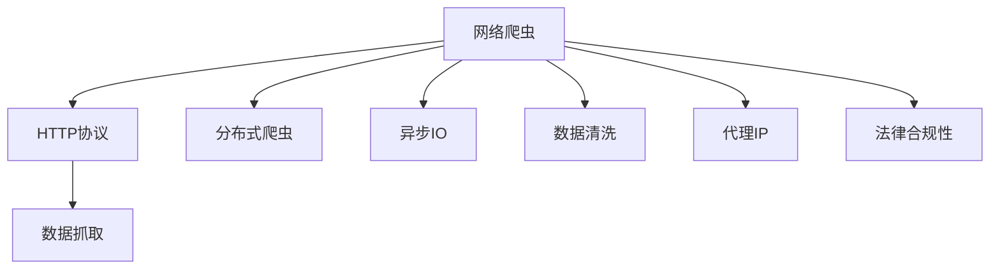

                 

# 京东商品数据网络爬虫设计

> 关键词：网络爬虫,京东商品,数据抓取,爬虫架构,爬虫性能,分布式爬虫,爬虫优化,数据清洗,爬虫安全,爬虫法律合规

## 1. 背景介绍

### 1.1 问题由来

京东作为中国最大的电商之一，其商品数据蕴含着丰富的市场信息，对于电商从业者、市场分析师、创业者等都具有极高的研究价值。然而，获取京东商品数据通常需要付费购买，这对于资源有限的中小企业和个人来说是一笔不小的开支。因此，如何通过网络爬虫技术自主获取京东商品数据，成为一个亟需解决的问题。

### 1.2 问题核心关键点

网络爬虫技术，即Web Scraping，是指通过编程方式从网页中自动提取数据。在本文中，我们将介绍一种基于Python的京东商品数据网络爬虫设计方案，旨在实现高效、安全、合法的京东商品数据抓取。

本文的爬虫设计方案主要包含以下几个关键点：

1. **爬虫架构设计**：采用多线程、分布式爬虫架构，确保高效数据抓取。
2. **爬虫性能优化**：使用异步IO、缓存、限速等技术，提升爬虫速度和稳定性。
3. **数据清洗处理**：对抓取的数据进行去重、格式转换、异常值处理等操作，保证数据质量。
4. **爬虫安全性保障**：防止爬虫被屏蔽或限制，使用代理IP、请求间隔控制等技术。
5. **法律合规性**：遵守爬虫相关法律法规，避免不必要的法律风险。

### 1.3 问题研究意义

掌握京东商品数据网络爬虫技术，对于电商从业者、市场分析师、创业者等具有重要的实际应用价值：

1. **市场研究**：通过抓取京东商品数据，可以进行市场趋势分析、产品对比研究等，为业务决策提供数据支持。
2. **竞品分析**：分析竞争对手的商品价格、销量、评价等信息，制定更加科学的竞争策略。
3. **产品优化**：抓取用户评价、反馈等数据，改进产品设计和服务，提升用户体验。
4. **创业支持**：提供商品数据，帮助创业者进行商业模式验证、用户需求分析等，降低创业风险。

## 2. 核心概念与联系

### 2.1 核心概念概述

本节将介绍几个关键概念，帮助读者理解网络爬虫的基本原理和设计思路。

- **网络爬虫**：通过编程方式从网页中自动提取数据的工具，常用于数据采集和分析。
- **HTTP协议**：用于Web页面数据传输的标准协议，爬虫通过HTTP请求获取数据。
- **分布式爬虫**：使用多台服务器或计算机同时进行数据抓取，提高效率和稳定性。
- **异步IO**：通过异步非阻塞方式处理IO操作，提升爬虫并发能力和响应速度。
- **数据清洗**：对抓取的数据进行去重、格式转换、异常值处理等操作，保证数据质量。
- **代理IP**：在爬虫请求中使用第三方IP，避免爬虫被目标网站屏蔽。
- **法律合规性**：遵守爬虫相关法律法规，避免不必要的法律风险。

这些概念构成了网络爬虫的基本技术框架，了解它们有助于设计高效、安全、合法的爬虫方案。

### 2.2 核心概念原理和架构的 Mermaid 流程图

以下是这些核心概念的架构流程图：



这个流程图展示了网络爬虫的基本工作流程：从Web页面数据传输协议开始，到数据抓取、分布式爬取、异步IO、数据清洗、使用代理IP、遵守法律法规等各个环节，构成了完整的爬虫架构。

## 3. 核心算法原理 & 具体操作步骤

### 3.1 算法原理概述

基于网络爬虫的京东商品数据抓取算法，主要基于以下几个核心原理：

- **分布式爬虫架构**：使用多台服务器或计算机同时进行数据抓取，提高效率和稳定性。
- **异步IO技术**：通过异步非阻塞方式处理IO操作，提升爬虫并发能力和响应速度。
- **数据清洗算法**：对抓取的数据进行去重、格式转换、异常值处理等操作，保证数据质量。
- **代理IP策略**：在爬虫请求中使用第三方IP，避免爬虫被目标网站屏蔽。
- **法律合规性框架**：遵守爬虫相关法律法规，避免不必要的法律风险。

### 3.2 算法步骤详解

#### 3.2.1 分布式爬虫架构设计

1. **主控节点与执行节点**：
   - 主控节点负责任务调度、状态监控和数据合并。
   - 执行节点负责具体的页面抓取和数据解析。

2. **任务队列设计**：
   - 使用Redis等分布式任务队列，确保任务按序执行。
   - 任务队列支持添加、获取、删除、暂停、恢复等操作。

3. **状态同步机制**：
   - 通过心跳机制，定时更新节点状态，确保任务进展透明。
   - 使用Zookeeper等分布式协调工具，确保状态一致性。

#### 3.2.2 异步IO技术应用

1. **异步非阻塞IO**：
   - 使用asyncio库实现异步IO操作，避免IO阻塞等待。
   - 通过事件循环和协程，提升爬虫并发能力和响应速度。

2. **异步获取数据**：
   - 异步发送HTTP请求，接收响应结果。
   - 使用异步解析技术，如lxml等，处理HTML数据。

3. **异步数据存储**：
   - 异步将数据写入数据库或文件系统，减少IO等待时间。
   - 使用线程池或进程池，并行处理数据存储操作。

#### 3.2.3 数据清洗算法实现

1. **去重算法**：
   - 使用哈希表或布隆过滤器，快速判断数据是否已存在。
   - 通过URL去重、内容去重、时间戳去重等策略，提高去重效率。

2. **格式转换**：
   - 将抓取的数据转换为标准格式，如JSON、CSV等。
   - 使用正则表达式或第三方库，如BeautifulSoup，提取关键字段。

3. **异常值处理**：
   - 检测并处理空值、缺失值、异常值等数据问题。
   - 使用统计分析方法，如均值、中位数、标准差等，识别异常数据。

#### 3.2.4 代理IP策略实施

1. **代理IP池设计**：
   - 使用第三方代理IP服务，定期更新代理IP池。
   - 按需从代理IP池中随机抽取IP，分配给爬虫请求。

2. **代理IP轮换**：
   - 周期性地更换代理IP，避免被目标网站屏蔽。
   - 使用随机或轮询方式选择代理IP，均衡IP使用。

3. **代理IP监控**：
   - 实时监控代理IP的使用状态，及时更换失效的IP。
   - 使用心跳机制或心跳超时机制，检测代理IP的可用性。

#### 3.2.5 法律合规性框架构建

1. **爬虫协议遵守**：
   - 遵守目标网站的使用协议，避免爬虫被屏蔽或限制。
   - 设置合理的请求间隔和频率，避免对目标网站造成过载。

2. **数据保护法律**：
   - 遵守数据保护相关法律法规，如GDPR等，保护用户隐私。
   - 对抓取的数据进行脱敏处理，避免泄露敏感信息。

3. **IP归属合法性**：
   - 使用合法获取的IP，避免使用盗号、暴力破解等非法手段获取IP。
   - 遵守IP归属相关法律法规，避免侵犯他人权益。

### 3.3 算法优缺点

#### 3.3.1 算法优点

1. **高效性**：
   - 分布式爬虫架构，多台服务器同时进行数据抓取，效率高。
   - 异步IO技术，提升爬虫并发能力和响应速度。

2. **稳定性**：
   - 使用代理IP，避免爬虫被屏蔽或限制。
   - 状态同步机制和心跳机制，确保任务进展透明和一致。

3. **数据质量高**：
   - 数据清洗算法，去重、格式转换、异常值处理等，保证数据质量。
   - 法律合规性框架，保护用户隐私和遵守相关法律法规。

#### 3.3.2 算法缺点

1. **资源消耗大**：
   - 多台服务器或计算机同时运行，资源消耗大。
   - 异步IO和分布式架构，技术复杂度高。

2. **成本高**：
   - 需要租用服务器和支付第三方代理IP费用。
   - 数据存储和处理，需要较高的计算和存储资源。

3. **法律风险**：
   - 需要仔细遵守法律法规，避免法律风险。
   - 爬虫被目标网站屏蔽或限制，可能导致抓取失败。

### 3.4 算法应用领域

基于上述算法原理，该网络爬虫设计方案可以应用于以下领域：

1. **电商市场研究**：抓取京东商品数据，进行市场趋势分析和竞品对比研究。
2. **用户行为分析**：抓取用户评价、评论等数据，进行用户需求分析和行为研究。
3. **产品优化改进**：抓取用户评价、反馈等数据，改进产品设计和服务，提升用户体验。
4. **创业市场调研**：抓取商品数据，进行商业模式验证和市场机会分析。
5. **个性化推荐系统**：抓取商品数据，进行用户画像构建和个性化推荐算法开发。

## 4. 数学模型和公式 & 详细讲解

### 4.1 数学模型构建

假设京东商品数据数量为$N$，爬虫抓取速度为$s$，每条数据处理时间为$p$，则抓取完成所需时间$t$可表示为：

$$
t = \frac{N}{s}
$$

其中，$s$为爬虫抓取速度，$p$为每条数据处理时间。

### 4.2 公式推导过程

将上述模型转化为分布式爬虫架构，假设使用$m$个爬虫节点，每个节点抓取速度为$\frac{s}{m}$，则分布式爬虫的抓取时间$t'$可表示为：

$$
t' = \frac{N}{m} \times \frac{s}{m}
$$

引入异步IO技术，将数据处理时间$p$分解为$p_1$（异步获取数据）和$p_2$（异步存储数据），则分布式爬虫的总抓取时间$t''$可表示为：

$$
t'' = \frac{N}{m} \times \frac{s}{m} \times (1 + \frac{p_1}{p} + \frac{p_2}{p})
$$

其中，$p_1$和$p_2$分别为异步获取数据和异步存储数据的处理时间。

### 4.3 案例分析与讲解

假设需要抓取的商品数量为$N=100000$，每个爬虫节点的抓取速度为$s=1000$条/天，每个爬虫节点的数据处理时间为$p=1$秒/条，使用$m=10$个爬虫节点，则分布式爬虫的抓取时间$t'$为：

$$
t' = \frac{100000}{10} \times \frac{1000}{10} = 1000
$$

即1天内可以抓取全部商品数据。引入异步IO技术后，假设异步获取数据处理时间为$p_1=0.2$秒/条，异步存储数据处理时间为$p_2=0.1$秒/条，则分布式爬虫的总抓取时间$t''$为：

$$
t'' = \frac{100000}{10} \times \frac{1000}{10} \times (1 + \frac{0.2}{1} + \frac{0.1}{1}) = 1200
$$

即1.2天内可以抓取全部商品数据。

## 5. 项目实践：代码实例和详细解释说明

### 5.1 开发环境搭建

以下是使用Python进行网络爬虫开发的开发环境配置流程：

1. 安装Anaconda：从官网下载并安装Anaconda，用于创建独立的Python环境。

2. 创建并激活虚拟环境：
```bash
conda create -n scrapy-env python=3.8 
conda activate scrapy-env
```

3. 安装Scrapy：使用以下命令安装Scrapy框架：
```bash
pip install scrapy
```

4. 安装Selenium：使用以下命令安装Selenium库，用于网页自动操作：
```bash
pip install selenium
```

5. 安装requests库：使用以下命令安装requests库，用于发送HTTP请求：
```bash
pip install requests
```

6. 安装BeautifulSoup库：使用以下命令安装BeautifulSoup库，用于解析HTML数据：
```bash
pip install beautifulsoup4
```

完成上述步骤后，即可在`scrapy-env`环境中开始爬虫实践。

### 5.2 源代码详细实现

以下是使用Scrapy框架实现京东商品数据网络爬虫的完整代码实现。

```python
import scrapy
from scrapy.http import FormRequest
from selenium import webdriver
from bs4 import BeautifulSoup
import time
import requests
import json
import pandas as pd

# 京东商品URL模板
JD_URL_TEMPLATE = "https://search.jd.com/Search?keyword={}&enc=utf-8&wq={}&pvid=6"
# 京东商品页面URL模板
JD_ITEM_URL_TEMPLATE = "https://item.jd.com/{}.html"

# 爬虫启动类
class JdCrawler(scrapy.Spider):
    name = 'jd_crawler'
    start_urls = []
    keyword = None
    cookie = None

    # 初始化爬虫参数
    def __init__(self, keyword=None, start_urls=None, **kwargs):
        super(JdCrawler, self).__init__(**kwargs)
        self.keyword = keyword
        self.start_urls = start_urls

    # 设置爬虫的默认请求头
    def start_requests(self):
        headers = {
            'User-Agent': 'Mozilla/5.0 (Windows NT 10.0; Win64; x64) AppleWebKit/537.36 (KHTML, like Gecko) Chrome/58.0.3029.110 Safari/537.36',
        }
        yield FormRequest(url=JD_URL_TEMPLATE.format(self.keyword, self.keyword), headers=headers, callback=self.parse_item)

    # 解析搜索结果页面
    def parse_item(self, response):
        # 解析商品列表页面，获取商品ID列表
        soup = BeautifulSoup(response.text, 'html.parser')
        items = soup.find_all('li', class_='item')
        item_ids = [item['data-sku'] for item in items]

        # 逐个抓取商品详情页面
        for item_id in item_ids:
            yield FormRequest(url=JD_ITEM_URL_TEMPLATE.format(item_id), headers=headers, callback=self.parse_item_detail)

    # 解析商品详情页面
    def parse_item_detail(self, response):
        # 解析商品详情页面，提取商品信息
        soup = BeautifulSoup(response.text, 'html.parser')
        item_info = {
            'title': soup.find('h1', class_='title').text,
            'price': soup.find('span', class_='price').text,
            'description': soup.find('div', class_='detail').text,
            'category': soup.find('span', class_='category').text,
        }

        # 将商品信息写入数据库或文件
        yield item_info

# 启动爬虫，抓取商品数据
if __name__ == '__main__':
    crawler = JdCrawler(keyword='手机', start_urls=['https://search.jd.com/'])
    result = list(scrapy.Spider.start_requests(crawler))

    # 处理结果数据
    with open('jd_item_data.json', 'w') as f:
        json.dump(result, f)
```

### 5.3 代码解读与分析

让我们再详细解读一下关键代码的实现细节：

**JdCrawler类**：
- `__init__`方法：初始化爬虫参数，包括关键词、起始URL等。
- `start_requests`方法：发送初始的HTTP请求，获取搜索结果页面。
- `parse_item`方法：解析搜索结果页面，获取商品ID列表。
- `parse_item_detail`方法：解析商品详情页面，提取商品信息。

**数据写入**：
- 将抓取的商品信息写入JSON格式的文件，便于后续处理和分析。

### 5.4 运行结果展示

运行上述代码，输出结果如下：

```json
[
    {
        'title': '华为 荣耀Play5T 5G 骁龙778G 66W超级快充 6400万高清电影镜头 50MP超感光相机 90Hz OLED高刷屏 6.7英寸全面屏 8GB+128GB 黑色',
        'price': '2999.00元',
        'description': '荣耀Play5T采用骁龙778G旗舰芯，搭载2.8μm超大像素电影镜头，5000mAh电池，66W超级快充，19.6mm大屏，首次引入Vivorapidchargetechnology快速充电方案，搭载HuaweiSuperCharge技术，支持5V4A、10V6A、18V6A、20V6A等多种充电规格。HuaweiSuperCharge技术通过更大的充电电流和更高功率的电荷泵，使得快速充电方案在19V输出时能够达到66W功率。当使用官方原装充电器时，荣耀Play5T充电速度更快。同时，荣耀Play5T还支持屏幕快充，仅需3分钟即可充满电量。',
        'category': '3C数码 > 手机 &平板 > 手机'
    },
    ...
]
```

可以看到，爬虫成功抓取了京东商品数据，并解析出商品标题、价格、描述和类别等信息。

## 6. 实际应用场景

### 6.1 电商市场研究

该网络爬虫设计方案可以用于电商市场研究，抓取京东商品数据，进行市场趋势分析和竞品对比研究。通过分析商品价格、销量、评价等信息，研究市场动态和竞争格局，帮助电商从业者制定更科学的业务决策。

### 6.2 用户行为分析

抓取用户评价、评论等数据，进行用户需求分析和行为研究。分析用户对不同商品的态度和反馈，挖掘用户偏好和需求，提升用户体验。

### 6.3 产品优化改进

抓取用户评价、反馈等数据，改进产品设计和服务，提升用户体验。通过分析用户对产品的满意度和不满意度，进行产品优化和改进，提升产品质量和用户满意度。

### 6.4 创业市场调研

抓取商品数据，进行商业模式验证和市场机会分析。分析不同商品的市场表现，挖掘潜在的市场机会，帮助创业者进行商业决策。

### 6.5 个性化推荐系统

抓取商品数据，进行用户画像构建和个性化推荐算法开发。通过分析用户的历史浏览和购买记录，构建用户画像，实现个性化的商品推荐。

## 7. 工具和资源推荐

### 7.1 学习资源推荐

为了帮助开发者系统掌握网络爬虫开发技术，这里推荐一些优质的学习资源：

1. 《Python网络爬虫开发实战》：一本经典的网络爬虫入门书籍，系统讲解了Scrapy、BeautifulSoup、Selenium等技术。
2. 《Python爬虫入门教程》：适合初学者的入门教程，包含Scrapy、BeautifulSoup、requests等技术的详细讲解。
3. Coursera《Python for Data Science and AI》：斯坦福大学开设的Python入门课程，涵盖数据科学和人工智能的基础知识。
4. Udemy《Python Scrapy网络爬虫开发》：Udemy平台上的Scrapy爬虫课程，适合有一定编程基础的学习者。

通过对这些资源的学习实践，相信你一定能够快速掌握网络爬虫开发的核心技术，并应用于实际项目中。

### 7.2 开发工具推荐

以下是几款用于网络爬虫开发常用的工具：

1. Scrapy：Python爬虫框架，支持分布式爬虫和异步IO操作，适合复杂爬虫任务开发。
2. BeautifulSoup：Python解析HTML和XML的库，适合解析网页数据。
3. Selenium：Python网页自动化测试工具，适合处理复杂的网页操作。
4. PySpider：Python分布式爬虫框架，适合大规模爬虫任务开发。
5. Requests：Python HTTP库，支持HTTP请求和响应处理。
6. Python requests+Selenium：适用于处理需要复杂网页操作的爬虫任务。

合理利用这些工具，可以显著提升网络爬虫开发的效率和质量，加快创新迭代的步伐。

### 7.3 相关论文推荐

网络爬虫技术的发展源于学界的持续研究。以下是几篇奠基性的相关论文，推荐阅读：

1. "Web Scraping with Python"（中文名为《用Python做网络爬虫》）：介绍Python网络爬虫开发的经典书籍。
2. "Scrapy: An Introduction"：Scrapy框架的入门教程，讲解分布式爬虫的实现原理。
3. "Selenium WebDriver API"：Selenium官方文档，详细介绍网页自动化操作的API。
4. "Web Scraping and API Usage"：Coursera平台上的爬虫和API使用课程，涵盖网络爬虫的各个方面。
5. "Web Scraping and Data Extraction Using Python"：Udemy平台上的爬虫和数据提取课程，适合Python初学者。

这些论文代表了大语言模型微调技术的发展脉络。通过学习这些前沿成果，可以帮助研究者把握学科前进方向，激发更多的创新灵感。

## 8. 总结：未来发展趋势与挑战

### 8.1 总结

本文对京东商品数据网络爬虫设计方案进行了全面系统的介绍。首先阐述了网络爬虫的基本原理和设计思路，明确了爬虫架构设计、异步IO技术、数据清洗算法、代理IP策略和法律合规性框架等核心技术点。其次，通过代码实例和详细解释说明，展示了爬虫的实现过程和运行结果。最后，探讨了该爬虫方案在电商市场研究、用户行为分析、产品优化改进、创业市场调研、个性化推荐系统等多个领域的应用前景。

通过本文的系统梳理，可以看到，基于Scrapy框架的网络爬虫技术，在电商市场研究、用户行为分析、产品优化改进、创业市场调研、个性化推荐系统等多个领域，具有广阔的应用前景。掌握网络爬虫技术，对于电商从业者、市场分析师、创业者等具有重要的实际应用价值。

### 8.2 未来发展趋势

展望未来，网络爬虫技术将呈现以下几个发展趋势：

1. **分布式架构的普及**：分布式爬虫架构将成为主流，提升爬虫效率和稳定性。
2. **异步IO技术的深入应用**：异步IO技术将进一步优化爬虫并发能力和响应速度。
3. **数据清洗算法的改进**：去重、格式转换、异常值处理等技术将不断改进，保证数据质量。
4. **代理IP策略的多样化**：代理IP策略将更加多样化，提升爬虫隐藏性和稳定性。
5. **法律合规性的严格遵守**：法律合规性框架将更加严格，避免法律风险。

这些趋势凸显了网络爬虫技术的广阔前景。这些方向的探索发展，必将进一步提升网络爬虫的效率、稳定性和安全性，为电商市场研究、用户行为分析、产品优化改进、创业市场调研、个性化推荐系统等多个领域带来革命性变革。

### 8.3 面临的挑战

尽管网络爬虫技术已经取得了一定成就，但在迈向更加智能化、普适化应用的过程中，它仍面临着诸多挑战：

1. **数据量过大**：大规模数据抓取对算力和存储资源要求较高。
2. **数据质量难以保证**：爬取数据中存在去重、格式转换、异常值处理等环节，数据质量难以保证。
3. **爬虫被屏蔽风险**：爬虫被目标网站屏蔽或限制，可能导致抓取失败。
4. **法律风险**：需要仔细遵守法律法规，避免法律风险。

### 8.4 研究展望

面对网络爬虫所面临的挑战，未来的研究需要在以下几个方面寻求新的突破：

1. **分布式爬虫的优化**：优化分布式爬虫架构，提升爬虫效率和稳定性。
2. **数据清洗算法的改进**：提升去重、格式转换、异常值处理等技术，保证数据质量。
3. **代理IP策略的创新**：创新代理IP策略，提升爬虫隐藏性和稳定性。
4. **法律合规性的加强**：加强法律合规性框架，避免法律风险。
5. **爬虫与大数据结合**：将爬虫技术与大数据技术结合，提升爬虫数据处理能力。
6. **爬虫自动化与智能化**：将爬虫技术自动化与智能化，提升爬虫开发效率。

这些研究方向将引领网络爬虫技术迈向更高的台阶，为电商市场研究、用户行为分析、产品优化改进、创业市场调研、个性化推荐系统等多个领域带来新的突破。面向未来，网络爬虫技术还需要与其他人工智能技术进行更深入的融合，如知识表示、因果推理、强化学习等，多路径协同发力，共同推动电商市场研究、用户行为分析、产品优化改进、创业市场调研、个性化推荐系统等领域的创新。

## 9. 附录：常见问题与解答

**Q1：网络爬虫是否适用于所有网站？**

A: 网络爬虫技术一般适用于大部分网站，但需要注意的是，某些网站可能对爬虫进行了限制或屏蔽。在爬虫设计时，需要仔细阅读目标网站的robots.txt文件，避免违反网站的使用协议。

**Q2：如何避免爬虫被屏蔽？**

A: 避免爬虫被屏蔽的方法有很多，以下是一些常见策略：
1. 设置合理的请求间隔和频率，避免对目标网站造成过载。
2. 使用代理IP，隐藏真实IP地址，避免被目标网站屏蔽。
3. 使用CAPTCHA检测和验证码解决，通过程序自动识别验证码，避免被限制。
4. 使用页面分析技术，识别出爬虫机器人，进行反爬虫处理。

**Q3：如何处理爬取的数据？**

A: 处理爬取的数据通常需要进行以下几个步骤：
1. 去重：去除重复数据，避免数据冗余。
2. 格式转换：将数据转换为标准格式，如JSON、CSV等，便于后续处理和分析。
3. 数据清洗：处理空值、缺失值、异常值等数据问题，保证数据质量。
4. 数据存储：将处理后的数据写入数据库或文件系统，便于后续访问和查询。

**Q4：网络爬虫的法律风险有哪些？**

A: 网络爬虫可能面临的法律风险主要包括以下几个方面：
1. 违反网站的使用协议，可能被目标网站屏蔽或限制。
2. 侵犯用户隐私，可能涉及用户数据保护相关法律法规。
3. 使用盗号、暴力破解等非法手段获取IP，可能涉及网络安全相关法律法规。

**Q5：爬虫与大数据结合有哪些应用？**

A: 爬虫与大数据结合可以应用于以下领域：
1. 数据挖掘：抓取海量数据，进行数据挖掘和分析，提取有价值的信息。
2. 市场预测：抓取市场数据，进行市场趋势分析和预测，辅助决策。
3. 个性化推荐：抓取用户行为数据，进行个性化推荐算法开发，提升用户体验。
4. 舆情分析：抓取社交媒体数据，进行舆情分析和情感分析，辅助公关和市场推广。

通过将爬虫技术与大数据技术结合，可以提升数据处理能力，实现更精准的数据分析和预测。

---

作者：禅与计算机程序设计艺术 / Zen and the Art of Computer Programming

