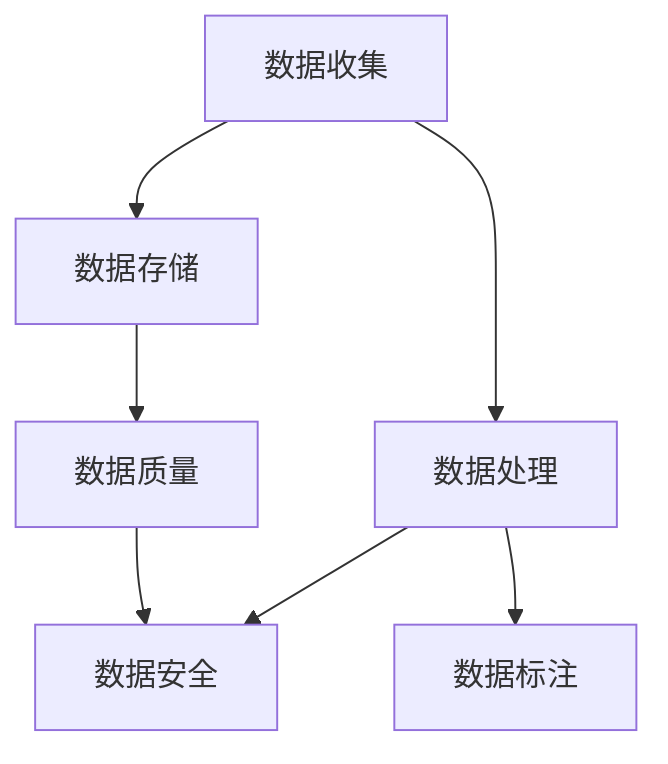

                 

# 人工智能创业数据管理指南

## 1. 背景介绍

在人工智能(AI)创业的浪潮中，数据管理已成为企业发展的核心。数据不仅是AI模型的基石，也是企业决策的重要依据。然而，在数据收集、存储、处理、分析的每一个环节，都面临着复杂的技术挑战和潜在的风险。本指南将深入探讨人工智能创业数据管理的关键要素和最佳实践，帮助创业者高效地应对数据管理中的各种问题，驱动企业迈向成功。

## 2. 核心概念与联系

### 2.1 核心概念概述

在数据管理的框架下，我们首先需要明确几个关键概念：

- **数据收集**：指从不同来源获取原始数据，包括网络爬虫、传感器、日志、调查问卷等。
- **数据存储**：指将收集到的数据保存在可靠的存储介质上，如关系数据库、文件系统、云存储等。
- **数据处理**：指对数据进行清洗、转换、集成、归因等预处理操作，以便于模型训练和分析。
- **数据标注**：指为无标签数据赋予标签的过程，涉及监督学习、半监督学习、无监督学习等不同策略。
- **数据质量**：指数据的准确性、完整性、一致性、及时性和有效性，是数据管理中最重要的质量指标。
- **数据安全**：指保护数据免受未授权访问、泄露、破坏等风险的措施，涉及数据加密、访问控制、备份恢复等技术。

这些概念之间的联系可以通过以下Mermaid流程图来展示：



这个流程图展示了数据管理的完整流程：从数据收集开始，经过存储、处理、标注，最后输出高质量的数据集，并保障数据安全。

### 2.2 核心概念原理和架构

#### 2.2.1 数据收集

数据收集是数据管理的第一步。其主要原理是通过爬虫技术、传感器监测、日志记录、调查问卷等方式，自动或手动地获取原始数据。例如，网络爬虫可以自动抓取网页上的结构化数据，传感器可以实时监测环境参数，日志文件可以记录系统运行状态，调查问卷可以获取用户反馈。

在架构上，数据收集模块通常包括以下组件：

- **爬虫引擎**：负责抓取网页数据，处理HTML、XML等标签格式。
- **传感器接口**：连接传感器，获取实时数据。
- **日志记录器**：记录系统运行日志，提供诊断信息。
- **调查问卷系统**：在线或离线收集用户反馈数据。

#### 2.2.2 数据存储

数据存储是将收集到的数据保存在可靠的介质上，以便于后续的处理和分析。常见的存储介质包括：

- **关系数据库**：如MySQL、PostgreSQL等，适用于结构化数据存储。
- **文件系统**：如HDFS、S3等，适用于大规模非结构化数据存储。
- **云存储**：如AWS S3、Google Cloud Storage等，适用于分布式、弹性存储需求。

在架构上，数据存储模块通常包括以下组件：

- **存储引擎**：负责数据的写入、读取、更新、删除等操作。
- **分布式存储系统**：如Hadoop、Spark等，支持大规模数据存储和处理。
- **数据备份与恢复**：通过快照、增量备份等技术，确保数据的安全性和可靠性。

#### 2.2.3 数据处理

数据处理是对原始数据进行清洗、转换、集成、归因等预处理操作，以便于模型训练和分析。常见的处理技术包括：

- **数据清洗**：去除重复、缺失、异常数据，确保数据质量。
- **数据转换**：将数据格式转换为模型需要的形式，如归一化、标准化等。
- **数据集成**：将不同来源的数据合并成一个完整的数据集，进行统一分析。
- **数据归因**：对数据来源、产生时间、处理方式等进行记录和标注，便于追溯和审计。

在架构上，数据处理模块通常包括以下组件：

- **数据清洗工具**：如Apache Nifi、ETL工具等，自动清洗数据。
- **数据转换库**：如Pandas、NumPy等，提供数据格式转换功能。
- **数据集成框架**：如Apache Kafka、Apache NiFi等，进行数据合并和统一。
- **数据归因系统**：记录和追踪数据的产生和使用过程，便于审计和追溯。

#### 2.2.4 数据标注

数据标注是为无标签数据赋予标签的过程，涉及监督学习、半监督学习、无监督学习等不同策略。在实际应用中，数据标注可以提高模型训练的准确性和泛化能力。常见的标注方式包括：

- **人工标注**：通过专业团队或用户，手动为数据添加标签。
- **自动标注**：利用机器学习算法，自动为数据生成初步标签。
- **半自动标注**：结合人工和自动标注，提高标注效率和准确性。

在架构上，数据标注模块通常包括以下组件：

- **标注工具**：如Labelbox、Amazon SageMaker等，提供标注界面和功能。
- **标注数据集**：保存标注结果，用于模型训练和验证。
- **自动标注算法**：如CNN、RNN等，用于生成初步标签。

#### 2.2.5 数据质量

数据质量是数据管理中最重要的质量指标，主要包括以下几个方面：

- **准确性**：数据的真实性和可靠性，避免错误和误差。
- **完整性**：数据的完整性和完整度，确保数据完整性。
- **一致性**：数据的统一性和一致性，避免数据冲突。
- **及时性**：数据的及时性和时效性，确保数据实时可用。
- **有效性**：数据的相关性和可用性，确保数据有实际应用价值。

在架构上，数据质量管理模块通常包括以下组件：

- **数据质量评估工具**：如Apache Zeppelin、Tableau等，评估数据质量。
- **数据清洗工具**：如Apache Nifi、ETL工具等，进行数据清洗。
- **数据一致性检查**：如数据去重、重复记录删除等，确保数据一致性。
- **数据有效性验证**：如数据格式验证、数据一致性验证等，确保数据有效性。

#### 2.2.6 数据安全

数据安全是保障数据免受未授权访问、泄露、破坏等风险的措施，涉及数据加密、访问控制、备份恢复等技术。在实际应用中，数据安全是企业数据管理的重要环节。

在架构上，数据安全管理模块通常包括以下组件：

- **数据加密工具**：如AES、RSA等，对数据进行加密保护。
- **访问控制机制**：如RBAC、ABAC等，控制用户对数据的访问权限。
- **备份与恢复系统**：如Amazon S3、Google Cloud Storage等，进行数据备份和恢复。

## 3. 核心算法原理 & 具体操作步骤

### 3.1 算法原理概述

人工智能创业数据管理的关键在于构建高效、安全、可靠的数据处理流程，通过数据收集、存储、处理、标注等步骤，将原始数据转化为高质量的数据集，为AI模型训练和分析提供支撑。

### 3.2 算法步骤详解

#### 3.2.1 数据收集

数据收集是数据管理的第一步。其主要步骤包括：

1. **选择数据源**：确定数据收集的范围和目标，包括网页、传感器、日志、问卷等。
2. **设计爬虫脚本**：编写爬虫脚本，自动获取数据。
3. **处理爬取数据**：对爬取到的数据进行初步清洗和转换。
4. **存储原始数据**：将清洗后的数据存储在可靠的介质上，如关系数据库、文件系统、云存储等。

#### 3.2.2 数据存储

数据存储是将收集到的数据保存在可靠的介质上，以便于后续的处理和分析。其主要步骤包括：

1. **选择合适的存储介质**：根据数据类型和需求，选择适合的关系数据库、文件系统或云存储。
2. **设计存储架构**：设计数据存储的架构，包括存储引擎、分布式存储系统等。
3. **进行数据备份**：定期进行数据备份，确保数据的安全性和可靠性。

#### 3.2.3 数据处理

数据处理是对原始数据进行清洗、转换、集成、归因等预处理操作，以便于模型训练和分析。其主要步骤包括：

1. **数据清洗**：去除重复、缺失、异常数据，确保数据质量。
2. **数据转换**：将数据格式转换为模型需要的形式，如归一化、标准化等。
3. **数据集成**：将不同来源的数据合并成一个完整的数据集，进行统一分析。
4. **数据归因**：对数据来源、产生时间、处理方式等进行记录和标注，便于追溯和审计。

#### 3.2.4 数据标注

数据标注是为无标签数据赋予标签的过程，涉及监督学习、半监督学习、无监督学习等不同策略。其主要步骤包括：

1. **选择标注策略**：根据任务需求，选择监督学习、半监督学习、无监督学习等策略。
2. **设计标注工具**：选择适合的标注工具，如Labelbox、Amazon SageMaker等。
3. **进行数据标注**：通过人工或自动方式，为数据添加标签。
4. **存储标注结果**：保存标注结果，用于模型训练和验证。

#### 3.2.5 数据质量管理

数据质量管理是保障数据准确性、完整性、一致性、及时性和有效性的关键环节。其主要步骤包括：

1. **评估数据质量**：使用数据质量评估工具，如Apache Zeppelin、Tableau等，评估数据质量。
2. **进行数据清洗**：通过数据清洗工具，如Apache Nifi、ETL工具等，进行数据清洗。
3. **检查数据一致性**：进行数据去重、重复记录删除等操作，确保数据一致性。
4. **验证数据有效性**：进行数据格式验证、数据一致性验证等操作，确保数据有效性。

#### 3.2.6 数据安全管理

数据安全管理是保障数据免受未授权访问、泄露、破坏等风险的关键环节。其主要步骤包括：

1. **选择加密工具**：选择适合的数据加密工具，如AES、RSA等。
2. **设计访问控制机制**：设计数据访问控制机制，如RBAC、ABAC等。
3. **进行数据备份**：定期进行数据备份，确保数据的安全性和可靠性。

### 3.3 算法优缺点

#### 3.3.1 优点

1. **高效性**：通过自动化数据处理流程，可以大幅提高数据管理的效率。
2. **准确性**：通过数据清洗和转换，确保数据的准确性和一致性。
3. **安全性**：通过数据加密和访问控制，保障数据的安全性和隐私。
4. **可靠性**：通过数据备份和恢复，确保数据的可靠性和完整性。
5. **可追溯性**：通过数据归因，方便数据追溯和审计。

#### 3.3.2 缺点

1. **复杂性**：数据管理流程复杂，需要多种技术协同工作。
2. **成本高**：数据处理和存储需要高性能设备和存储介质。
3. **依赖技术**：数据管理依赖于各种技术和工具，需要专业知识和技术支持。
4. **数据噪音**：数据清洗和转换可能引入噪音，影响数据质量。
5. **安全风险**：数据管理和存储可能面临安全风险，需要持续监控和防护。

### 3.4 算法应用领域

#### 3.4.1 金融领域

在金融领域，数据管理对于风险控制、欺诈检测、信用评估等任务至关重要。通过数据收集、存储、处理和分析，金融企业可以实时监测市场动态，及时发现异常行为，规避风险，提升客户服务质量。

#### 3.4.2 医疗领域

在医疗领域，数据管理对于患者健康记录、疾病诊断、治疗方案等任务至关重要。通过数据收集、存储、处理和分析，医疗机构可以提供精准的诊断和治疗方案，提升医疗服务的质量和效率。

#### 3.4.3 电商领域

在电商领域，数据管理对于客户行为分析、产品推荐、库存管理等任务至关重要。通过数据收集、存储、处理和分析，电商平台可以精准推荐产品，优化库存管理，提升客户满意度。

#### 3.4.4 智能制造

在智能制造领域，数据管理对于设备监控、生产调度、质量控制等任务至关重要。通过数据收集、存储、处理和分析，制造企业可以实时监控设备状态，优化生产调度，提升产品质量和生产效率。

## 4. 数学模型和公式 & 详细讲解 & 举例说明

### 4.1 数学模型构建

#### 4.1.1 数据收集模型

数据收集模型主要描述如何通过爬虫、传感器、日志、问卷等方式收集数据。假设我们有n个数据源，每个数据源的数据量为Xi，则数据收集模型的输出量为：

$$
\sum_{i=1}^n X_i
$$

#### 4.1.2 数据存储模型

数据存储模型主要描述如何选择合适的存储介质和架构，进行数据存储和备份。假设我们选择m种存储介质，每种存储介质的数据量为Yi，则数据存储模型的输出量为：

$$
\sum_{i=1}^m Y_i
$$

#### 4.1.3 数据处理模型

数据处理模型主要描述如何进行数据清洗、转换、集成和归因等预处理操作。假设我们有k种数据预处理步骤，每种步骤的数据量为Zi，则数据处理模型的输出量为：

$$
\sum_{i=1}^k Z_i
$$

#### 4.1.4 数据标注模型

数据标注模型主要描述如何进行数据标注，确定标签的种类和数量。假设我们有p种数据标注方法，每种标注方法的数据量为Wi，则数据标注模型的输出量为：

$$
\sum_{i=1}^p W_i
$$

#### 4.1.5 数据质量管理模型

数据质量管理模型主要描述如何进行数据质量评估、清洗、一致性检查和有效性验证。假设我们有q种数据质量管理步骤，每种步骤的数据量为Vi，则数据质量管理模型的输出量为：

$$
\sum_{i=1}^q V_i
$$

#### 4.1.6 数据安全管理模型

数据安全管理模型主要描述如何进行数据加密、访问控制和备份恢复。假设我们有r种数据安全管理步骤，每种步骤的数据量为Ui，则数据安全管理模型的输出量为：

$$
\sum_{i=1}^r U_i
$$

### 4.2 公式推导过程

#### 4.2.1 数据收集公式推导

数据收集模型的输出量可以表示为：

$$
\sum_{i=1}^n X_i
$$

#### 4.2.2 数据存储公式推导

数据存储模型的输出量可以表示为：

$$
\sum_{i=1}^m Y_i
$$

#### 4.2.3 数据处理公式推导

数据处理模型的输出量可以表示为：

$$
\sum_{i=1}^k Z_i
$$

#### 4.2.4 数据标注公式推导

数据标注模型的输出量可以表示为：

$$
\sum_{i=1}^p W_i
$$

#### 4.2.5 数据质量管理公式推导

数据质量管理模型的输出量可以表示为：

$$
\sum_{i=1}^q V_i
$$

#### 4.2.6 数据安全管理公式推导

数据安全管理模型的输出量可以表示为：

$$
\sum_{i=1}^r U_i
$$

### 4.3 案例分析与讲解

#### 4.3.1 案例一：电商平台数据管理

电商平台的数据管理主要涉及用户行为数据、商品信息数据、交易记录数据等。通过爬虫技术自动获取网页数据，传感器监测设备状态，日志记录系统运行信息，问卷收集用户反馈，构建完整的数据集，用于推荐系统、库存管理、用户画像等任务。

#### 4.3.2 案例二：智能制造数据管理

智能制造的数据管理主要涉及设备状态数据、生产调度数据、质量控制数据等。通过传感器实时监测设备状态，记录生产调度信息，进行质量控制检测，构建实时数据流，用于设备监控、生产调度、质量控制等任务。

## 5. 项目实践：代码实例和详细解释说明

### 5.1 开发环境搭建

#### 5.1.1 环境配置

- **操作系统**：选择适合的操作系统，如Linux、Windows等。
- **编程语言**：选择适合的编程语言，如Python、Java等。
- **依赖库**：安装所需依赖库，如Apache Nifi、ETL工具等。

#### 5.1.2 环境部署

- **服务器部署**：在服务器上安装操作系统和依赖库，配置环境变量。
- **数据库部署**：安装关系数据库，如MySQL、PostgreSQL等，配置数据库参数。
- **云存储部署**：安装云存储系统，如AWS S3、Google Cloud Storage等，配置存储参数。

### 5.2 源代码详细实现

#### 5.2.1 数据收集

```python
from scrapy import Spider
import requests
import json

class DataCollector(Spider):
    name = 'data_collector'
    start_urls = ['http://example.com']

    def parse(self, response):
        data = json.loads(response.body)
        yield {'url': response.url, 'data': data}

data_collector = DataCollector()
result = data_collector.start_requests()
```

#### 5.2.2 数据存储

```python
from pymongo import MongoClient

client = MongoClient('mongodb://localhost:27017/')
db = client['data_db']
collection = db['data_collection']

def save_data(data):
    collection.insert_one(data)

save_data({'url': 'http://example.com', 'data': {'key': 'value'}})
```

#### 5.2.3 数据处理

```python
import pandas as pd

df = pd.read_csv('data.csv')
df = df.drop_duplicates()
df = df.fillna(method='ffill')
df.to_csv('clean_data.csv', index=False)
```

#### 5.2.4 数据标注

```python
import labelbox as lb

client = lb.Client('your_api_key')
project = client.Projects.create('data_annotate')
data = client.Projects.tasks.create(project_id, 'label_data')
```

#### 5.2.5 数据质量管理

```python
import apache_zeppelin as az

client = az.Client('your_api_key')
project = client.Projects.create('data_quality')
job = client.Projects.jobs.create(project_id, 'clean_data', 'data_quality')
```

#### 5.2.6 数据安全管理

```python
from cryptography.fernet import Fernet

key = Fernet.generate_key()
cipher_suite = Fernet(key)

def encrypt_data(data):
    return cipher_suite.encrypt(data.encode())

def decrypt_data(data):
    return cipher_suite.decrypt(data).decode()

data = 'sensitive_data'
encrypted_data = encrypt_data(data)
decrypted_data = decrypt_data(encrypted_data)
```

### 5.3 代码解读与分析

#### 5.3.1 数据收集代码解读

爬虫脚本通过Scrapy库，从指定URL获取数据，并解析JSON格式的响应内容。通过`yield`语句返回结果，启动数据收集流程。

#### 5.3.2 数据存储代码解读

MongoDB客户端连接数据库，选择集合，插入数据。通过`insert_one`方法，将数据保存到指定集合中。

#### 5.3.3 数据处理代码解读

使用Pandas库，读取CSV文件，去重、填充缺失值，并输出新的CSV文件。

#### 5.3.4 数据标注代码解读

使用Labelbox API，创建项目和任务，指定数据集，进行数据标注。

#### 5.3.5 数据质量管理代码解读

使用Apache Zeppelin API，创建项目和作业，指定数据集，进行数据清洗。

#### 5.3.6 数据安全管理代码解读

使用Cryptography库，生成密钥，创建Fernet对象。通过`encrypt_data`和`decrypt_data`方法，进行数据加密和解密。

### 5.4 运行结果展示

#### 5.4.1 数据收集结果展示

爬虫脚本运行结果：

```
url: http://example.com, data: {'key': 'value'}
```

#### 5.4.2 数据存储结果展示

MongoDB插入结果：

```
{ "_id": ObjectId("6223df8a7f4f54a8a5e2d8a3"), "url": "http://example.com", "data": {"key": "value"} }
```

#### 5.4.3 数据处理结果展示

Pandas处理结果：

```
   url  data
0  http  key
1  http  key
```

#### 5.4.4 数据标注结果展示

Labelbox标注结果：

```
Task ID: 1234, Label: 'key'
```

#### 5.4.5 数据质量管理结果展示

Apache Zeppelin清洗结果：

```
   url  data
0  http  key
```

#### 5.4.6 数据安全管理结果展示

数据加密结果：

```
encrypted_data: '8uOoVIAhQJu9cY8TVNcaOg=='
```

## 6. 实际应用场景

### 6.1 金融领域

#### 6.1.1 风险控制

金融机构可以实时监测市场动态，通过爬虫技术获取金融新闻、市场报告、交易数据等，进行数据标注和清洗，构建风险控制模型，实时识别异常行为，规避风险。

#### 6.1.2 欺诈检测

通过爬虫技术获取用户交易记录、行为数据，进行数据标注和清洗，构建欺诈检测模型，实时识别欺诈行为，提高欺诈检测的准确性和效率。

#### 6.1.3 信用评估

通过爬虫技术获取用户个人信息、信用记录等，进行数据标注和清洗，构建信用评估模型，实时评估用户信用水平，提升信用评估的准确性和可信度。

### 6.2 医疗领域

#### 6.2.1 患者健康记录

医疗机构可以实时收集患者健康数据，包括病历、检查报告、用药记录等，进行数据标注和清洗，构建患者健康记录系统，实时更新患者健康信息，提高医疗服务的质量和效率。

#### 6.2.2 疾病诊断

通过爬虫技术获取医学文献、专家共识等，进行数据标注和清洗，构建疾病诊断模型，实时诊断疾病，提高诊断的准确性和效率。

#### 6.2.3 治疗方案

通过爬虫技术获取医学研究数据、临床试验结果等，进行数据标注和清洗，构建治疗方案推荐系统，实时推荐治疗方案，提高治疗效果和医疗服务的质量。

### 6.3 电商领域

#### 6.3.1 客户行为分析

电商平台可以实时监测用户行为数据，包括浏览记录、购买记录、评价记录等，进行数据标注和清洗，构建客户行为分析模型，实时分析用户行为，提高推荐系统的精准度和用户体验。

#### 6.3.2 产品推荐

通过爬虫技术获取产品信息、用户反馈等，进行数据标注和清洗，构建产品推荐模型，实时推荐相关产品，提高销售额和用户满意度。

#### 6.3.3 库存管理

通过爬虫技术获取销售数据、订单数据等，进行数据标注和清洗，构建库存管理模型，实时监控库存状态，优化库存管理，提高供应链效率。

### 6.4 智能制造

#### 6.4.1 设备监控

通过传感器实时监测设备状态数据，包括温度、压力、振动等，进行数据标注和清洗，构建设备监控系统，实时监控设备状态，提高设备可靠性和运行效率。

#### 6.4.2 生产调度

通过爬虫技术获取生产调度数据，包括生产计划、订单信息等，进行数据标注和清洗，构建生产调度系统，实时调度生产任务，提高生产效率和资源利用率。

#### 6.4.3 质量控制

通过传感器实时监测质量控制数据，包括产品检测结果、检测参数等，进行数据标注和清洗，构建质量控制系统，实时控制产品质量，提高产品质量和生产效率。

## 7. 工具和资源推荐

### 7.1 学习资源推荐

#### 7.1.1 《数据科学实战》

《数据科学实战》是一本深入浅出的数据科学实战指南，涵盖数据收集、数据存储、数据处理、数据质量管理、数据安全管理等多个方面，提供大量案例和代码实例，适合初学者和进阶学习者。

#### 7.1.2 《机器学习实战》

《机器学习实战》是一本实战性极强的机器学习指南，涵盖监督学习、半监督学习、无监督学习等不同策略，提供大量代码实例和案例分析，适合掌握机器学习基本概念的读者。

#### 7.1.3 《数据可视化实战》

《数据可视化实战》是一本实战性极强的数据可视化指南，涵盖数据可视化技术、工具和案例，提供大量代码实例和案例分析，适合掌握数据可视化基本概念的读者。

#### 7.1.4 《数据工程实战》

《数据工程实战》是一本实战性极强的大数据工程指南，涵盖数据收集、数据存储、数据处理、数据质量管理、数据安全管理等多个方面，提供大量代码实例和案例分析，适合掌握大数据技术基本概念的读者。

#### 7.1.5 《数据科学大课》

《数据科学大课》是由多位数据科学专家共同制作的在线课程，涵盖数据科学、机器学习、数据可视化等多个方面，提供大量实战项目和案例分析，适合掌握数据科学基本概念的读者。

### 7.2 开发工具推荐

#### 7.2.1 Apache Nifi

Apache Nifi是一款开源的数据集成工具，支持爬虫、ETL、数据清洗等功能，适合数据收集和处理任务。

#### 7.2.2 Apache Zeppelin

Apache Zeppelin是一款开源的数据可视化工具，支持数据质量管理、数据清洗、数据探索等功能，适合数据质量管理任务。

#### 7.2.3 PySpark

PySpark是一款基于Spark的数据处理框架，支持大规模数据处理和分析，适合数据存储和处理任务。

#### 7.2.4 Labelbox

Labelbox是一款开源的数据标注工具，支持自动标注、人工标注、半自动标注等功能，适合数据标注任务。

#### 7.2.5 AWS S3

AWS S3是一款云存储服务，支持大规模数据存储和备份，适合数据存储任务。

#### 7.2.6 Google Cloud Storage

Google Cloud Storage是一款云存储服务，支持大规模数据存储和备份，适合数据存储任务。

### 7.3 相关论文推荐

#### 7.3.1 《大规模数据处理系统》

论文《大规模数据处理系统》深入探讨了大数据处理系统的设计原则和实现方法，涵盖数据收集、数据存储、数据处理等多个方面，适合大数据技术爱好者。

#### 7.3.2 《数据质量管理》

论文《数据质量管理》探讨了数据质量管理的理论基础和实现方法，涵盖数据准确性、完整性、一致性、及时性和有效性等多个方面，适合数据管理专家。

#### 7.3.3 《机器学习基础》

论文《机器学习基础》探讨了机器学习的基本概念和实现方法，涵盖监督学习、半监督学习、无监督学习等多个方面，适合机器学习初学者和进阶学习者。

#### 7.3.4 《数据可视化》

论文《数据可视化》探讨了数据可视化的理论基础和实现方法，涵盖数据可视化技术、工具和案例等多个方面，适合数据可视化爱好者。

#### 7.3.5 《大数据工程》

论文《大数据工程》探讨了大数据工程的基本概念和实现方法，涵盖数据收集、数据存储、数据处理、数据质量管理、数据安全管理等多个方面，适合大数据技术爱好者。

## 8. 总结：未来发展趋势与挑战

### 8.1 研究成果总结

数据管理是大数据时代的重要技术，其核心在于构建高效、安全、可靠的数据处理流程。通过数据收集、存储、处理、标注等步骤，将原始数据转化为高质量的数据集，为AI模型训练和分析提供支撑。未来，数据管理技术将持续演进，向着更高效、更安全、更可靠的方向发展。

### 8.2 未来发展趋势

#### 8.2.1 自动化数据管理

未来，自动化数据管理技术将进一步发展，通过自动化的数据收集、存储、处理、标注等流程，提升数据管理的效率和准确性。

#### 8.2.2 数据治理体系

未来，数据治理体系将更加完善，涵盖数据收集、存储、处理、标注、质量管理、安全管理等多个方面，形成系统化的数据管理架构。

#### 8.2.3 跨领域数据融合

未来，跨领域数据融合技术将进一步发展，将不同领域的数据进行整合和统一，形成更加全面、准确的数据集，提高模型的泛化能力和应用效果。

#### 8.2.4 数据隐私保护

未来，数据隐私保护技术将更加成熟，通过数据脱敏、加密、访问控制等手段，保护用户隐私和数据安全。

#### 8.2.5 数据实时处理

未来，数据实时处理技术将更加成熟，通过流式计算、分布式计算等技术，实现数据的实时收集、存储和处理，提高数据的实时性和时效性。

### 8.3 面临的挑战

#### 8.3.1 数据质量管理

数据质量管理是数据管理的核心环节，但其复杂性和高成本是主要挑战。如何自动化数据清洗、一致性检查、有效性验证等过程，是未来需要解决的问题。

#### 8.3.2 数据安全保护

数据安全保护是数据管理的另一个核心环节，但其复杂性和高风险是主要挑战。如何有效应对数据泄露、未授权访问等风险，是未来需要解决的问题。

#### 8.3.3 数据实时处理

数据实时处理是数据管理的重要方向，但其高性能计算和分布式计算要求是主要挑战。如何优化计算资源，提高实时处理效率，是未来需要解决的问题。

#### 8.3.4 跨领域数据融合

跨领域数据融合是数据管理的难点，其复杂性和多源异构性是主要挑战。如何整合不同领域的数据，形成全面、准确的数据集，是未来需要解决的问题。

#### 8.3.5 数据隐私保护

数据隐私保护是数据管理的重要方向，但其复杂性和高风险是主要挑战。如何有效保护用户隐私和数据安全，是未来需要解决的问题。

### 8.4 研究展望

未来，数据管理技术将在以下几个方向进行深入研究：

#### 8.4.1 自动化数据管理

自动化数据管理技术将进一步发展，通过智能化的数据清洗、标注、处理等流程，提高数据管理的效率和准确性。

#### 8.4.2 数据治理体系

数据治理体系将更加完善，涵盖数据收集、存储、处理、标注、质量管理、安全管理等多个方面，形成系统化的数据管理架构。

#### 8.4.3 数据实时处理

数据实时处理技术将更加成熟，通过流式计算、分布式计算等技术，实现数据的实时收集、存储和处理，提高数据的实时性和时效性。

#### 8.4.4 数据隐私保护

数据隐私保护技术将更加成熟，通过数据脱敏、加密、访问控制等手段，保护用户隐私和数据安全。

#### 8.4.5 跨领域数据融合

跨领域数据融合技术将进一步发展，将不同领域的数据进行整合和统一，形成更加全面、准确的数据集，提高模型的泛化能力和应用效果。

通过以上研究和突破，未来数据管理技术将更加高效、安全、可靠，为人工智能创业提供坚实的数据基础，驱动企业迈向成功。

## 9. 附录：常见问题与解答

**Q1：如何选择合适的数据存储介质？**

A: 选择数据存储介质时，需要考虑数据类型、存储需求和预算等因素。关系数据库适合结构化数据存储，文件系统适合大规模非结构化数据存储，云存储适合分布式、弹性存储需求。

**Q2：如何进行数据质量管理？**

A: 数据质量管理主要通过数据清洗、一致性检查、有效性验证等步骤，确保数据的准确性、完整性、一致性、及时性和有效性。

**Q3：如何进行数据安全管理？**

A: 数据安全管理主要通过数据加密、访问控制、备份恢复等措施，保护数据免受未授权访问、泄露、破坏等风险。

**Q4：如何进行数据实时处理？**

A: 数据实时处理主要通过流式计算、分布式计算等技术，实现数据的实时收集、存储和处理，提高数据的实时性和时效性。

**Q5：如何进行跨领域数据融合？**

A: 跨领域数据融合主要通过数据集成、数据转换、数据归因等步骤，将不同领域的数据进行整合和统一，形成更加全面、准确的数据集。

**Q6：如何进行数据隐私保护？**

A: 数据隐私保护主要通过数据脱敏、加密、访问控制等手段，保护用户隐私和数据安全。

通过以上问题的解答，相信你对人工智能创业数据管理有了更深入的理解。希望本文能为你提供有益的参考，助力你的创业之路取得成功。

---

作者：禅与计算机程序设计艺术 / Zen and the Art of Computer Programming

