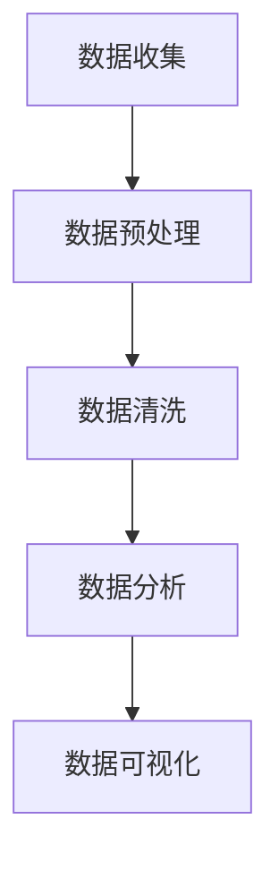

                 

# 人工智能创业：数据管理的技巧

> 关键词：人工智能,数据管理,创业,策略,技术,实践

## 1. 背景介绍

### 1.1 问题由来

人工智能（AI）正迅速改变全球经济和社会结构，越来越多的创业公司正努力利用AI技术进行创新。然而，一个常被忽略的事实是，无论你的AI产品有多好，如果数据管理不善，其表现和价值都会大打折扣。在AI创业的旅程中，数据管理能力成为了一项基础但至关重要的技巧。

### 1.2 问题核心关键点

本文将详细探讨数据管理在AI创业中的关键作用，包括数据收集、存储、预处理、清洗和分析等各个环节的技术和策略。通过理解这些核心概念，可以帮助创业者更好地利用数据，加速AI产品的研发和部署。

### 1.3 问题研究意义

有效管理数据是AI创业成功的关键。通过高质量的数据，AI模型可以更准确地学习和预测，从而提供更好的服务和产品。此外，合理的数据管理还能确保模型的鲁棒性和公平性，避免潜在的数据偏见和错误。因此，掌握数据管理的技巧对于AI创业公司的长期发展和用户信任至关重要。

## 2. 核心概念与联系

### 2.1 核心概念概述

为更好地理解AI创业中的数据管理技巧，本节将介绍几个关键概念：

- 数据收集：获取数据的过程，包括数据源的选择、数据采集方法和工具等。
- 数据存储：数据的长期保存和维护，需要考虑数据安全、备份和恢复等问题。
- 数据预处理：清洗、转换、归一化等操作，以提升数据质量。
- 数据清洗：去除噪声、处理缺失值等，确保数据的一致性和完整性。
- 数据分析：对数据进行统计分析、挖掘和可视化，以发现数据中的模式和规律。

这些核心概念之间存在密切联系，共同构成数据管理的完整流程。通过这一流程，创业者可以有效地收集、处理和分析数据，为AI模型提供高质量的输入。

### 2.2 核心概念原理和架构的 Mermaid 流程图



### 2.3 核心概念之间的联系

数据管理是一个循环迭代的过程，包括数据收集、预处理、清洗和分析等多个环节。在数据管理流程中，每个环节相互依赖、相互促进，共同推动数据质量的提升和AI模型的优化。

- **数据收集**：提供数据输入的源头。高质量的数据源和采集方法能够减少后续处理的复杂性和成本。
- **数据预处理**：对数据进行初步清洗和转换，提升数据标准化程度，减少模型训练中的噪声干扰。
- **数据清洗**：通过处理缺失值、异常值等，提高数据完整性和一致性。
- **数据分析**：揭示数据背后的模式和趋势，为模型训练提供指导和优化方向。
- **数据可视化**：直观展示数据特征和分析结果，帮助理解数据和模型的表现。

通过合理规划和执行这些步骤，可以实现数据的高效管理和深度利用。

## 3. 核心算法原理 & 具体操作步骤
### 3.1 算法原理概述

数据管理涉及到一系列技术手段和策略，其核心目标是确保数据的完整性、一致性和可用性。这些技术手段包括但不限于：

- **数据清洗**：通过算法和工具去除重复、噪声、异常等数据，提高数据质量。
- **数据标准化**：通过数据转换和归一化，使数据格式和单位统一，便于模型处理。
- **数据增强**：通过数据扩充、增广等技术，提升模型的泛化能力和鲁棒性。
- **数据压缩**：通过算法优化，减少数据存储和传输的成本和延迟。

### 3.2 算法步骤详解

数据管理的具体步骤包括：

1. **数据收集**：选择合适的数据源，采用爬虫、API等方法获取数据。
2. **数据预处理**：使用Pandas、NumPy等工具进行数据格式转换、归一化等操作。
3. **数据清洗**：应用规则引擎或机器学习算法处理缺失值、异常值、重复数据等。
4. **数据分析**：利用统计学、机器学习等技术分析数据特征、模式和趋势。
5. **数据可视化**：使用Matplotlib、Seaborn等工具进行数据可视化，帮助理解数据和模型表现。

### 3.3 算法优缺点

数据管理的关键算法具有以下优缺点：

- **优点**：
  - 提升数据质量和模型的准确性，确保数据分析结果的可靠性。
  - 优化数据存储和传输效率，降低成本和延迟。
  - 提高模型的泛化能力和鲁棒性，增强系统的稳定性和适应性。

- **缺点**：
  - 数据管理涉及的技术复杂，需要专业知识和技术积累。
  - 数据清洗和预处理过程可能耗费大量时间和资源。
  - 数据分析和可视化需要较强的数据科学背景，对人员要求较高。

### 3.4 算法应用领域

数据管理技术广泛应用于多个领域，如金融、医疗、电商、物流等。以下是一些典型的应用场景：

- **金融领域**：数据管理在风险评估、信用评分、欺诈检测等方面具有重要应用。
- **医疗领域**：数据管理用于电子病历管理、疾病预测、基因组学研究等。
- **电商领域**：数据管理支持客户行为分析、推荐系统、广告定向等。
- **物流领域**：数据管理优化路径规划、库存管理、客户服务等问题。

## 4. 数学模型和公式 & 详细讲解 & 举例说明

### 4.1 数学模型构建

数据管理涉及的数学模型包括但不限于统计模型、机器学习模型等。这些模型通过数学公式来描述和分析数据特征。

以简单的线性回归模型为例，其数学公式为：

$$
y = \beta_0 + \beta_1 x_1 + \beta_2 x_2 + \cdots + \beta_n x_n + \epsilon
$$

其中，$y$ 为因变量，$x_1, x_2, \cdots, x_n$ 为自变量，$\beta_0, \beta_1, \cdots, \beta_n$ 为回归系数，$\epsilon$ 为随机误差项。

### 4.2 公式推导过程

线性回归模型的推导过程如下：

1. **模型假设**：假设数据生成过程遵循线性关系，即存在一组回归系数使得误差项的条件期望为零。
2. **最小二乘法**：通过最小化残差平方和来求解回归系数。
3. **模型优化**：通过梯度下降等方法优化模型参数，使模型能够最好地拟合数据。

### 4.3 案例分析与讲解

以电商领域的销售预测为例，我们可以使用线性回归模型来分析销售量与多个自变量之间的关系，如季节性因素、节假日影响、促销活动等。通过统计分析，我们可以发现这些自变量对销售量的影响程度，并据此进行预测和优化。

## 5. 项目实践：代码实例和详细解释说明

### 5.1 开发环境搭建

在开始数据管理实践之前，我们需要准备好开发环境。以下是使用Python进行Pandas开发的环境配置流程：

1. 安装Anaconda：从官网下载并安装Anaconda，用于创建独立的Python环境。
2. 创建并激活虚拟环境：
```bash
conda create -n pydata-env python=3.8 
conda activate pydata-env
```
3. 安装Pandas：
```bash
pip install pandas
```

完成上述步骤后，即可在`pydata-env`环境中开始数据管理实践。

### 5.2 源代码详细实现

以下是一个使用Pandas进行数据预处理的Python代码示例：

```python
import pandas as pd
import numpy as np

# 读取数据
df = pd.read_csv('data.csv')

# 数据预处理
# 删除缺失值
df = df.dropna()

# 数据清洗
# 处理异常值
df = df[(df['price'] > 0) & (df['price'] < 1000000)]

# 数据转换
# 将类别型变量转换为数值型变量
df['category'] = df['category'].astype('category').cat.codes

# 数据标准化
# 使用标准化方法归一化数值型变量
from sklearn.preprocessing import StandardScaler
scaler = StandardScaler()
df['size'] = scaler.fit_transform(df['size'].values.reshape(-1, 1))

# 数据可视化
# 使用Matplotlib绘制直方图
import matplotlib.pyplot as plt
plt.hist(df['price'], bins=50, edgecolor='black')
plt.xlabel('Price')
plt.ylabel('Frequency')
plt.title('Price Distribution')
plt.show()
```

### 5.3 代码解读与分析

让我们再详细解读一下关键代码的实现细节：

**读取数据**：
- `pd.read_csv()`函数用于读取CSV文件，将数据存储为Pandas DataFrame对象。

**数据预处理**：
- `df.dropna()`函数用于删除包含缺失值的行，保证数据完整性。
- `df[(df['price'] > 0) & (df['price'] < 1000000)]`用于删除价格异常的数据点，确保数据的一致性。

**数据清洗**：
- `df['category'].astype('category').cat.codes`用于将类别型变量转换为数值型变量，方便模型处理。
- `scaler.fit_transform()`用于标准化数值型变量，使数据服从正态分布，便于模型学习。

**数据可视化**：
- `plt.hist()`函数用于绘制直方图，帮助理解数据的分布情况。

这些操作展示了数据预处理的常用步骤和工具。通过合理使用Pandas等数据处理库，可以有效提升数据质量，为AI模型提供可靠的输入。

### 5.4 运行结果展示

运行上述代码后，会得到一个预处理后的数据集，可以用于后续的机器学习模型训练和评估。

```python
# 数据检查
print(df.head())
print(df.info())
```

## 6. 实际应用场景

### 6.1 金融风险评估

在金融领域，数据管理在风险评估和信用评分中扮演着重要角色。通过对历史交易数据进行清洗和预处理，可以构建有效的信用评分模型，评估客户的信用风险。

### 6.2 医疗疾病预测

在医疗领域，数据管理用于电子病历管理、疾病预测等。通过清洗和分析患者数据，可以发现潜在的疾病模式，预测疾病发展趋势，提升医疗服务质量。

### 6.3 电商推荐系统

在电商领域，数据管理支持推荐系统优化和广告定向。通过对用户行为数据进行分析和清洗，可以提升推荐算法的准确性和用户满意度。

### 6.4 未来应用展望

随着数据管理技术的不断进步，未来数据管理的深度和广度将进一步扩展，推动更多领域的AI应用发展。例如，在自动驾驶、智能制造、智慧城市等新兴领域，数据管理将为AI系统的部署和优化提供强有力的支持。

## 7. 工具和资源推荐

### 7.1 学习资源推荐

为了帮助开发者掌握数据管理的技巧，以下是一些优质的学习资源：

1. 《Python数据科学手册》：由Jake VanderPlas编写，全面介绍了使用Python进行数据处理和分析的各个方面。
2. Coursera的《数据科学与机器学习》课程：由Johns Hopkins大学提供，涵盖数据清洗、特征工程、模型训练等重要主题。
3. Kaggle的“Data Science for All”系列教程：提供实践性强、面向初学者的数据管理教程，涵盖数据预处理、可视化等。
4. O'Reilly的《Data Science for Business》一书：介绍了数据管理在商业决策中的应用，提供丰富的案例和实战经验。

通过这些资源的学习，可以系统掌握数据管理的各个方面，为AI创业提供坚实的数据基础。

### 7.2 开发工具推荐

以下是一些常用的数据管理工具：

1. Pandas：开源数据分析库，提供数据处理和清洗功能。
2. NumPy：开源数值计算库，提供高效的数据操作和数学运算功能。
3. Matplotlib：开源绘图库，用于数据可视化。
4. Seaborn：基于Matplotlib的高级绘图库，提供美观的统计图表。
5. Apache Spark：开源大数据处理框架，支持分布式数据处理和分析。

这些工具可以显著提升数据管理的效率和效果，帮助创业者快速实现数据处理需求。

### 7.3 相关论文推荐

以下是几篇具有代表性的数据管理论文，推荐阅读：

1. “Data Cleaning and Data Preprocessing” by Jiang, X., and Zhao, J. (2017)：探讨数据清洗和预处理的重要性，提出多种数据处理技术。
2. “Anomaly Detection in Big Data” by Kou, C., et al. (2015)：介绍大数据中的异常检测方法，包括离群值检测和异常检测算法。
3. “Dimensionality Reduction Techniques in Data Mining” by Aalim, M. et al. (2012)：介绍数据降维技术，包括主成分分析、PCA等。

这些论文代表了大数据管理的前沿进展，通过学习这些文献，可以深入理解数据管理的各种技术和方法。

## 8. 总结：未来发展趋势与挑战

### 8.1 总结

本文对AI创业中数据管理的技巧进行了详细探讨。通过系统梳理数据管理的各个环节，提供了实用的技术指引和案例分析，帮助创业者更好地管理和利用数据。通过高质量的数据，AI模型能够提供更准确、更可靠的服务和产品，提升用户体验和系统效率。

### 8.2 未来发展趋势

展望未来，数据管理技术将继续向智能化、自动化方向发展，具体趋势包括：

1. **自动化数据清洗**：利用机器学习算法自动识别和处理数据异常，减少人工干预。
2. **数据联邦学习**：在分布式环境中，多个机构联合训练模型，避免数据泄露和隐私风险。
3. **数据隐私保护**：采用加密和匿名化技术，确保数据在传输和存储过程中的安全性。
4. **数据质量评估**：通过自动化工具和指标评估数据质量，提供数据处理效果反馈。

这些趋势将进一步提升数据管理的效率和效果，推动AI技术在更多领域的应用。

### 8.3 面临的挑战

尽管数据管理技术取得了长足进展，但仍面临诸多挑战：

1. **数据质量差异**：不同领域的数据质量存在差异，如何统一和标准化数据，是数据管理的难点之一。
2. **数据安全和隐私**：在数据共享和分析过程中，如何保护用户隐私和数据安全，是一个重要问题。
3. **计算资源限制**：数据管理需要大量的计算资源，如何优化资源使用，降低计算成本，是未来研究的重要方向。
4. **数据治理**：如何建立统一的数据标准和治理框架，确保数据管理的一致性和可追溯性，需要更多的机制和政策支持。

### 8.4 研究展望

未来，数据管理技术需要在以下几个方面进行进一步研究：

1. **数据治理平台**：开发统一的数据治理平台，规范数据管理流程，提高数据管理效率。
2. **自动化数据清洗工具**：研发更加智能化的数据清洗工具，减少人工干预和错误。
3. **跨领域数据融合**：探索如何跨领域整合数据，形成更全面、更深入的数据洞察。
4. **数据质量评估指标**：研究并定义数据质量评估指标，提供科学的评估方法。

通过不断探索和创新，相信数据管理技术将为AI创业公司提供更强有力的支持，推动AI技术的广泛应用和发展。

## 9. 附录：常见问题与解答

**Q1：数据管理中常见的数据清洗技术有哪些？**

A: 数据清洗包括去除噪声、处理缺失值、异常值等。常见的数据清洗技术包括：

1. **去重**：去除重复记录。
2. **缺失值处理**：填补缺失值或删除缺失记录。
3. **异常值处理**：识别并处理异常值，如使用箱线图、Z-score等方法。
4. **数据类型转换**：将数据类型转换为合适的格式，如将字符串转换为数值型数据。

**Q2：如何选择数据源？**

A: 选择数据源时，需要考虑以下几个因素：

1. **数据质量**：优先选择数据质量高的数据源，避免因数据问题影响AI模型的性能。
2. **数据可用性**：选择可获取且易于处理的数据源，避免因数据获取问题影响项目进度。
3. **数据相关性**：选择与项目需求紧密相关的数据源，确保数据的有用性。
4. **数据合法性**：确保数据源的使用合法合规，避免法律风险。

**Q3：如何进行数据可视化？**

A: 数据可视化可以帮助理解数据特征和模型表现，常用的工具和方法包括：

1. **Matplotlib**：绘制各类图表，如折线图、散点图、柱状图等。
2. **Seaborn**：基于Matplotlib的高级绘图库，提供更美观的统计图表。
3. **Tableau**：商业智能工具，提供直观的数据探索和可视化功能。
4. **Power BI**：微软的商业智能工具，支持数据可视化、报表生成等功能。

这些工具和方法可以显著提升数据可视化的效果，帮助更好地理解和利用数据。

**Q4：如何应对数据质量问题？**

A: 数据质量问题是数据管理中的常见挑战，应对策略包括：

1. **数据预处理**：通过数据清洗、转换等操作，提升数据质量。
2. **数据验证**：定期验证数据质量，使用自动化工具检测和修复问题。
3. **数据治理**：建立数据治理框架，规范数据管理流程，提高数据质量。
4. **数据反馈**：收集数据使用者的反馈，及时发现和解决数据质量问题。

这些策略可以帮助应对数据质量问题，提升数据管理的整体水平。

**Q5：数据管理在AI创业中的重要性如何？**

A: 数据管理在AI创业中至关重要，主要体现在以下几个方面：

1. **数据质量**：高质量的数据是AI模型可靠性和有效性的基础。
2. **模型优化**：数据管理能够提升模型的训练效果和预测准确性。
3. **业务决策**：通过数据管理，可以获得更加全面和深入的业务洞察，辅助决策制定。
4. **用户体验**：高质量的数据管理能够提升用户满意度，增强用户信任。

总之，数据管理是AI创业成功的关键，必须得到足够的重视和投入。

---

作者：禅与计算机程序设计艺术 / Zen and the Art of Computer Programming

