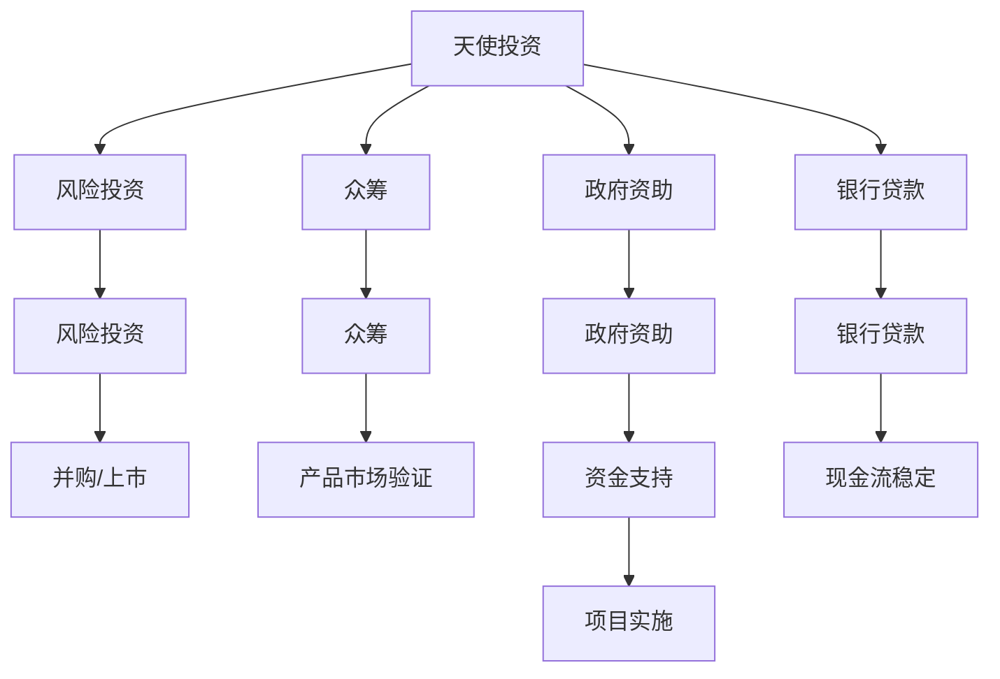

                 

# 人工智能创业：选择融资渠道

## 1. 背景介绍

在当今快速发展的技术环境中，人工智能（AI）技术正逐渐成为各行各业的重要驱动力。对于初创企业而言，如何将这一技术商业化并创造价值，是一个亟待解决的问题。特别是对于人工智能领域的创业公司，选择合适的融资渠道尤为重要。

### 1.1 融资的重要性

融资对于任何初创企业而言都至关重要。它不仅能够提供必要的资金支持，确保技术研发和产品开发的顺利进行，还能够帮助企业扩大市场影响力，吸引优秀人才，加速业务扩展。然而，不同融资渠道的特点和要求各不相同，企业需要根据自身情况和市场环境，选择最合适的融资方式。

### 1.2 融资渠道的分类

常见的融资渠道包括天使投资、风险投资（VC）、众筹、政府资助等。每种融资渠道都有其特点和优势，适用于不同的企业和市场阶段。了解这些融资渠道的特点，可以帮助创业者更好地选择和利用融资资源。

## 2. 核心概念与联系

### 2.1 核心概念概述

为更好地理解如何选择合适的融资渠道，本节将介绍几个关键概念：

- **天使投资**：由个人提供的一种早期投资形式，通常面向种子阶段或早期初创企业。天使投资人往往不仅是资金提供者，还能为企业提供宝贵的行业经验和人脉资源。

- **风险投资**：由专业投资机构或基金提供的一种中后期投资形式，通常面向已经有一定市场基础的创业公司。VC不仅提供资金支持，还能为企业提供专业的管理咨询和市场拓展资源。

- **众筹**：通过网络平台向大众募集资金的一种方式，通常面向产品原型或初步市场验证阶段的企业。众筹平台能够帮助企业扩大曝光度和社区影响力，同时降低资金压力。

- **政府资助**：由政府机构提供的资金支持，通常面向具有社会公益价值或国家战略意义的项目。政府资助往往需要满足一定的条件和标准，包括技术创新、社会效益等。

- **银行贷款**：通过银行或其他金融机构提供的贷款服务，通常面向已经有一定市场规模和稳定现金流的企业。银行贷款通常要求较高的财务指标和担保条件。

这些融资渠道之间既有共性也有差异，本节将通过Mermaid流程图来展示它们之间的联系和区别。



这个流程图展示了不同融资渠道的连接和转换路径，帮助创业者理解融资渠道的选择和后续发展方向。

## 3. 核心算法原理 & 具体操作步骤

### 3.1 算法原理概述

在选择融资渠道时，企业需要综合考虑自身的技术成熟度、市场潜力、财务状况、战略目标等因素。不同融资渠道有不同的投资要求和退出机制，企业需要根据这些特点进行选择和规划。

### 3.2 算法步骤详解

以下是选择融资渠道的关键步骤：

**Step 1: 评估企业现状**

1. 确定企业当前的财务状况、技术成熟度和市场潜力。
2. 分析企业的优势、劣势和市场机会。

**Step 2: 确定融资需求**

1. 明确所需资金的用途和金额。
2. 分析融资需求的时效性和紧急性。

**Step 3: 筛选潜在投资方**

1. 根据企业的市场定位和融资需求，筛选合适的投资方。
2. 研究潜在投资方的投资偏好、投资阶段和退出策略。

**Step 4: 制定融资计划**

1. 制定详细的融资计划，包括资金用途、融资方式和投资回报等。
2. 准备融资所需的文件和资料，如商业计划书、财务报表等。

**Step 5: 进行融资谈判**

1. 与潜在投资方进行谈判，明确投资条款和条件。
2. 签订投资协议，确保各方利益得到保障。

**Step 6: 融资后管理**

1. 按照投资协议进行资金使用和项目实施。
2. 定期向投资方汇报项目进展和财务状况。

### 3.3 算法优缺点

选择合适的融资渠道，既能有效支持企业的快速发展，又能避免资金使用不当带来的风险。以下是常见融资渠道的优缺点分析：

**天使投资**

**优点**：
- 资金灵活，投资期限较长。
- 提供行业经验和人脉资源。
- 投资门槛较低，适合早期项目。

**缺点**：
- 天使投资人数量有限，竞争激烈。
- 投资金额相对较小，难以满足长期需求。
- 投资回报压力较大。

**风险投资**

**优点**：
- 资金充足，能够满足长期需求。
- 提供专业的管理咨询和市场拓展资源。
- 投资门槛较高，投资周期较长。

**缺点**：
- 投资回报压力较大。
- 对企业的估值和盈利能力有较高要求。
- 投资退出方式有限，主要通过并购或上市实现。

**众筹**

**优点**：
- 资金来源于大众，增加曝光度和社区影响力。
- 投资门槛较低，适合产品原型和初步市场验证。
- 风险分散，不会对企业造成资金压力。

**缺点**：
- 众筹回报率较低，主要通过产品销售或服务获得收益。
- 融资成功率较低，需要面对市场的不确定性。
- 需要投入大量时间和精力进行宣传和推广。

**政府资助**

**优点**：
- 资金支持有保障，无需偿还。
- 满足社会公益价值或国家战略意义的项目更有可能获得资助。
- 提供技术支持和市场推广资源。

**缺点**：
- 申请条件严格，需要满足多项技术和社会标准。
- 资金使用受到限制，需按照规定用途使用。
- 资金使用效率较低，可能存在监管问题。

**银行贷款**

**优点**：
- 资金来源稳定，银行信用较高。
- 还款方式灵活，可根据企业现金流情况进行调整。
- 无股权稀释风险。

**缺点**：
- 要求较高的财务指标和担保条件。
- 贷款期限较短，难以满足长期需求。
- 需要承担一定的利息负担。

### 3.4 算法应用领域

融资渠道的选择不仅影响企业的财务状况，还会对企业的战略规划和市场布局产生深远影响。因此，融资渠道的选择适用于所有创业公司和人工智能企业。无论企业的技术成熟度和市场潜力如何，选择合适的融资渠道都是实现快速发展的关键。

## 4. 数学模型和公式 & 详细讲解 & 举例说明

### 4.1 数学模型构建

在进行融资渠道选择时，企业需要建立一系列数学模型来量化和评估不同的融资方案。这些模型包括成本-收益分析、投资回报率计算、资金使用效率评估等。以下是一个简单的成本-收益分析模型的构建过程。

假设企业需要融资$X$元，其中$Y$元用于项目研发，$Z$元用于市场推广和运营，剩余部分用于日常开支。设项目的预期收益为$R$元，年利率为$i$，则企业的净收益$N$可表示为：

$$
N = R - (X - Y - Z) \times i
$$

### 4.2 公式推导过程

上式中，$X$为总融资额，$Y$为项目研发投入，$Z$为市场推广和运营投入，$i$为年利率。通过这个模型，可以计算出不同融资方案下的净收益，帮助企业进行合理决策。

### 4.3 案例分析与讲解

以一家初创企业为例，假设其需要融资100万元，其中60万元用于项目研发，20万元用于市场推广，20万元用于日常开支。假设项目的预期收益为150万元，年利率为5%，则其净收益计算如下：

$$
N = 150 - (100 - 60 - 20) \times 0.05 = 100万元
$$

这意味着企业需要支付5万元的利息，但整体净收益为100万元，投资回报率为200%。这个案例说明了成本-收益分析在融资决策中的重要性。

## 5. 项目实践：代码实例和详细解释说明

### 5.1 开发环境搭建

在进行融资渠道选择时，开发环境搭建同样重要。以下是使用Python和Jupyter Notebook进行融资渠道选择的开发环境配置流程：

1. 安装Anaconda：从官网下载并安装Anaconda，用于创建独立的Python环境。
2. 创建并激活虚拟环境：
```bash
conda create -n finance-env python=3.8 
conda activate finance-env
```
3. 安装相关库：
```bash
pip install pandas numpy matplotlib scipy scikit-learn statsmodels jupyter notebook ipython
```

完成上述步骤后，即可在`finance-env`环境中进行融资渠道选择的开发。

### 5.2 源代码详细实现

下面以成本-收益分析为例，给出使用Python进行融资渠道选择的代码实现。

```python
import pandas as pd
import numpy as np
from scipy.optimize import minimize

# 融资需求
total_fund = 100  # 总融资额
research_fund = 60  # 项目研发投入
marketing_fund = 20  # 市场推广投入
operational_fund = 20  # 日常开支投入

# 预期收益
expected_revenue = 150  # 预期收益
interest_rate = 0.05  # 年利率

# 构建成本-收益模型
def cost_benefit_analysis(fund, interest_rate=interest_rate):
    return expected_revenue - (fund - research_fund - marketing_fund - operational_fund) * interest_rate

# 计算最优融资额
optimal_fund = minimize(cost_benefit_analysis, total_fund, bounds=[(0, total_fund)], method='BFGS').x[0]

# 输出最优融资额和净收益
print("最优融资额：", optimal_fund)
print("净收益：", cost_benefit_analysis(optimal_fund))
```

### 5.3 代码解读与分析

**成本-收益分析函数**：
- 定义`cost_benefit_analysis`函数，输入融资额`fund`和年利率`interest_rate`，返回净收益。
- 通过预期收益减去融资成本，计算出净收益。

**优化函数**：
- 使用`minimize`函数，最小化成本-收益分析函数，找到最优融资额。
- 设置优化范围为总融资额，使用`BFGS`算法进行优化。

**结果输出**：
- 输出最优融资额和净收益，帮助企业进行决策。

## 6. 实际应用场景

### 6.1 智能医疗

在智能医疗领域，选择合适的融资渠道可以帮助企业快速获取资金，加速医疗设备和技术的发展。例如，一家专注于智能穿戴设备的企业，可以通过风险投资获取足够的资金支持，进行技术研发和市场推广。

### 6.2 自动驾驶

自动驾驶技术需要大量的研发投入和测试成本，通过天使投资和风险投资，企业可以快速积累资金，进行技术验证和市场推广。例如，一家自动驾驶汽车初创公司，可以通过风险投资获取数百万美元的资金支持，进行大规模道路测试和市场推广。

### 6.3 金融科技

金融科技企业需要面对高昂的技术研发和市场推广成本，通过政府资助和银行贷款，企业可以获取低成本资金，进行技术开发和市场扩展。例如，一家金融科技初创公司，可以通过政府资助获得研发资金，同时通过银行贷款解决市场推广资金需求。

### 6.4 未来应用展望

随着人工智能技术的不断发展和成熟，融资渠道的选择将更加多样化，融资方式也会更加灵活和高效。未来，企业将有更多的机会通过多样化的融资渠道，加速技术研发和市场扩展。

## 7. 工具和资源推荐

### 7.1 学习资源推荐

为了帮助创业者更好地掌握融资渠道的选择方法，以下是一些优质的学习资源：

1. **《创业融资指南》**：详细介绍了创业融资的各个环节和要点，包括天使投资、风险投资、众筹等。
2. **《融资渠道选择》**：提供了详细的融资渠道选择方法和案例分析，帮助创业者进行合理决策。
3. **《金融市场入门》**：介绍了金融市场的运作机制和投资工具，帮助创业者理解融资渠道背后的市场逻辑。

### 7.2 开发工具推荐

融资渠道的选择离不开有效的工具支持。以下是几款用于融资渠道选择的常用工具：

1. **Python**：强大的数据分析和计算工具，适用于融资渠道选择模型的构建和分析。
2. **Jupyter Notebook**：交互式编程环境，便于进行数据分析和展示。
3. **Excel**：简单易用的电子表格工具，适用于财务数据的处理和分析。
4. **Tableau**：数据可视化工具，帮助创业者直观展示融资数据和分析结果。

### 7.3 相关论文推荐

融资渠道的选择涉及多种学科的知识，以下是几篇奠基性的相关论文，推荐阅读：

1. **《创业融资的数学模型》**：提出了融资决策的数学模型和优化方法，为融资渠道选择提供了理论基础。
2. **《风险投资与企业成长》**：研究了风险投资对企业成长的影响，帮助创业者理解风险投资的战略意义。
3. **《金融市场与融资渠道选择》**：介绍了金融市场的运作机制和融资渠道的特点，帮助创业者理解融资渠道背后的市场逻辑。

## 8. 总结：未来发展趋势与挑战

### 8.1 总结

本文对人工智能创业的融资渠道选择进行了全面系统的介绍。首先阐述了融资渠道对创业的重要性，明确了不同融资渠道的特点和优势。其次，从原理到实践，详细讲解了融资渠道选择的方法和步骤，提供了融资渠道选择的完整代码实例。同时，本文还探讨了融资渠道在实际应用中的多种场景，展示了融资渠道选择的多样化应用。

通过本文的系统梳理，可以看到，选择合适的融资渠道对于人工智能创业企业至关重要。融资渠道的选择不仅能有效支持企业的技术研发和市场扩展，还能帮助企业规避风险，实现快速健康发展。未来，随着融资渠道的不断发展和创新，人工智能创业企业将有更多机会获取资金支持，加速技术创新和市场扩展。

### 8.2 未来发展趋势

展望未来，融资渠道的选择将呈现以下几个发展趋势：

1. **多样化和灵活化**：融资渠道将更加多样化，企业将有更多机会选择适合自己的融资方式。同时，融资渠道的选择也将更加灵活，企业可以根据自身需求和市场环境进行动态调整。
2. **智能化和自动化**：融资渠道的选择将更多地借助人工智能和大数据分析技术，进行智能化的评估和决策。例如，通过机器学习算法进行融资渠道的推荐和风险评估。
3. **全球化和国际化**：融资渠道的选择将更加全球化，企业将有机会通过国际融资市场获取资金支持。例如，通过国际风险投资、跨国众筹等方式，扩大融资渠道。
4. **绿色化和可持续发展**：融资渠道的选择将更加注重绿色和可持续发展，企业将有机会通过绿色融资、社会责任投资等方式，获得资金支持。例如，通过ESG（环境、社会和治理）投资者的支持，推动企业的可持续发展。

以上趋势凸显了融资渠道选择的广阔前景。这些方向的探索发展，必将进一步推动人工智能创业企业的快速成长，为经济社会的发展注入新的动力。

### 8.3 面临的挑战

尽管融资渠道的选择技术日益成熟，但在实际操作过程中，仍面临诸多挑战：

1. **信息不对称**：融资方和投资方之间存在信息不对称，企业难以准确把握投资方的需求和期望。
2. **市场不确定性**：市场需求和市场趋势的不确定性，增加了融资决策的风险。
3. **法律法规限制**：融资渠道的选择受到法律法规的限制，企业需要遵守相关法律和规定。
4. **资金使用效率**：融资获得的资金能否有效使用，直接影响企业的成长和发展。
5. **企业治理风险**：融资渠道的选择和资金使用，可能对企业的治理结构和公司治理产生影响。

这些挑战需要企业在融资过程中，充分准备、谨慎决策，才能最大限度地利用融资渠道，实现企业的快速成长。

### 8.4 研究展望

面对融资渠道选择所面临的挑战，未来的研究需要在以下几个方面寻求新的突破：

1. **数据驱动的融资决策**：利用大数据和机器学习算法，进行智能化的融资渠道选择和风险评估，提高决策的准确性和效率。
2. **多元化融资渠道的优化**：研究多种融资渠道的结合使用，优化融资组合，提高融资效率和效果。
3. **融资渠道与市场环境的匹配**：研究融资渠道与市场环境的匹配策略，制定动态调整的融资计划，确保融资的持续性和稳定性。
4. **融资渠道与企业发展的协同**：研究融资渠道与企业发展的协同机制，探索融资渠道对企业战略和市场布局的影响，确保融资决策与企业发展目标一致。

这些研究方向将进一步推动融资渠道选择技术的进步，为人工智能创业企业的健康发展提供有力支持。

## 9. 附录：常见问题与解答

**Q1：企业如何选择合适的融资渠道？**

A: 企业应综合考虑自身技术成熟度、市场潜力、财务状况等因素，根据融资需求和市场环境，选择最合适的融资渠道。例如，早期项目可以选择天使投资或众筹，中后期项目可以选择风险投资，具有社会公益价值的项目可以选择政府资助。

**Q2：融资渠道的选择对企业有何影响？**

A: 融资渠道的选择对企业的财务状况、市场布局、战略发展具有深远影响。正确的融资渠道选择，可以加速企业的技术研发和市场扩展，提高企业竞争力。错误的融资渠道选择，可能导致资金使用不当，甚至对企业的治理结构和公司发展产生负面影响。

**Q3：融资渠道的选择过程中需要注意哪些问题？**

A: 融资渠道的选择需要充分了解投资方的需求和期望，确保融资条款符合企业利益。同时，需要制定详细的融资计划和资金使用计划，确保资金使用的效率和效果。此外，需要关注法律法规对融资渠道的限制，确保融资活动合法合规。

**Q4：融资渠道的选择对企业的长期发展有何影响？**

A: 融资渠道的选择直接影响企业的长期发展。正确的融资渠道选择，可以为企业提供持续的资金支持，加速技术研发和市场扩展，推动企业的持续增长。错误的融资渠道选择，可能导致企业陷入资金困境，影响企业的长期发展。

**Q5：融资渠道的选择对企业的治理结构和公司发展有何影响？**

A: 融资渠道的选择和资金使用，可能对企业的治理结构和公司发展产生影响。例如，通过银行贷款进行融资，可能会增加企业的负债率和财务风险，影响公司的治理结构和财务稳定。因此，企业需要充分考虑融资渠道对公司治理和发展的潜在影响，确保融资决策与企业发展目标一致。

---

作者：禅与计算机程序设计艺术 / Zen and the Art of Computer Programming

