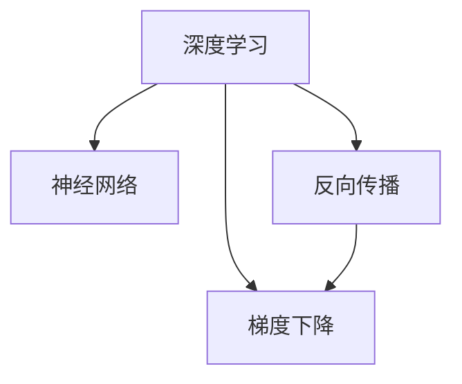

                 

# 人工智能原理与代码实例讲解

> 关键词：人工智能,深度学习,机器学习,算法原理,代码实现,实例分析

## 1. 背景介绍

### 1.1 问题由来

随着人工智能（AI）技术的飞速发展，深度学习（DL）和机器学习（ML）成为了推动AI进步的关键力量。无论是图像识别、自然语言处理（NLP）还是推荐系统，深度学习和机器学习都提供了强大的算法和工具支持。然而，这些算法往往复杂而难以理解，导致大量开发者难以入门。为了帮助广大开发者更好地理解这些算法的原理和实现，本文将详细介绍AI中的核心算法，并通过代码实例进行讲解。

### 1.2 问题核心关键点

本文将涵盖以下几个核心关键点：

- **深度学习基础**：介绍深度学习的基本原理和网络结构。
- **机器学习算法**：讲解常见的机器学习算法及其原理。
- **代码实现**：通过Python和深度学习框架（如TensorFlow、PyTorch）进行算法实现。
- **实例分析**：提供实际应用中的实例，解释算法的实际效果。

### 1.3 问题研究意义

掌握深度学习和机器学习的原理和代码实现，对于从事AI技术研究、应用开发和产品设计等岗位的人员都至关重要。理解算法的原理和实现细节，不仅能提升技术能力，还能在实际工作中灵活应用，快速解决各种AI问题。

## 2. 核心概念与联系

### 2.1 核心概念概述

为更好地理解AI中的核心算法，本节将介绍几个密切相关的核心概念：

- **深度学习**：一种通过神经网络进行训练和推理的机器学习方法，能够处理复杂的数据结构和模式。
- **机器学习**：通过数据训练模型，使模型能够进行预测、分类等任务。
- **神经网络**：深度学习中的核心组件，由多层神经元组成，能够自动提取数据特征。
- **反向传播算法**：一种通过误差反馈更新神经网络参数的优化算法。
- **梯度下降**：一种用于优化神经网络参数的常用算法。

这些概念之间的逻辑关系可以通过以下Mermaid流程图来展示：



这个流程图展示了几者之间的关系：

1. 深度学习利用神经网络进行训练和推理。
2. 反向传播算法用于更新神经网络的参数。
3. 梯度下降算法是反向传播的具体实现方式。

## 3. 核心算法原理 & 具体操作步骤

### 3.1 算法原理概述

本文将详细介绍几个典型的深度学习和机器学习算法，包括前馈神经网络、卷积神经网络、循环神经网络和支持向量机等。

### 3.2 算法步骤详解

#### 3.2.1 前馈神经网络

前馈神经网络（Feedforward Neural Network, FNN）是最基本的神经网络结构，由多个全连接层组成。每个神经元只与上一层所有神经元相连，无反馈连接。其训练过程通常使用反向传播算法和梯度下降算法。

**步骤：**
1. 初始化网络参数，如权重和偏置。
2. 前向传播：将输入数据输入网络，经过多次线性变换和激活函数，得到输出。
3. 计算损失函数：将输出与实际标签进行比较，计算误差。
4. 反向传播：从输出层开始，利用链式法则计算每个神经元的误差梯度。
5. 更新参数：使用梯度下降算法，根据误差梯度更新网络参数。
6. 重复训练：不断迭代训练，直到损失函数收敛。

**代码示例**：

```python
import numpy as np
import tensorflow as tf

# 定义网络结构
input_size = 784
hidden_size = 256
output_size = 10
learning_rate = 0.01
num_epochs = 10

# 定义输入和标签
X = tf.placeholder(tf.float32, shape=[None, input_size])
y = tf.placeholder(tf.int32, shape=[None, output_size])

# 定义前馈神经网络
W1 = tf.Variable(tf.random_normal([input_size, hidden_size]))
b1 = tf.Variable(tf.zeros([hidden_size]))
W2 = tf.Variable(tf.random_normal([hidden_size, output_size]))
b2 = tf.Variable(tf.zeros([output_size]))

hidden = tf.nn.relu(tf.matmul(X, W1) + b1)
output = tf.matmul(hidden, W2) + b2

# 定义损失函数
cross_entropy = tf.reduce_mean(tf.nn.softmax_cross_entropy_with_logits(logits=output, labels=y))
optimizer = tf.train.GradientDescentOptimizer(learning_rate).minimize(cross_entropy)

# 训练模型
with tf.Session() as sess:
    sess.run(tf.global_variables_initializer())
    for epoch in range(num_epochs):
        _, loss = sess.run([optimizer, cross_entropy], feed_dict={X: train_data, y: train_labels})
        if epoch % 1 == 0:
            print("Epoch %d, Loss: %f" % (epoch + 1, loss))
    test_loss = sess.run(cross_entropy, feed_dict={X: test_data, y: test_labels})
    print("Test Loss: %f" % test_loss)
```

#### 3.2.2 卷积神经网络

卷积神经网络（Convolutional Neural Network, CNN）是一种专门用于图像处理任务的神经网络结构，由卷积层、池化层和全连接层组成。卷积层通过卷积操作提取图像特征，池化层用于特征降维和下采样。

**步骤：**
1. 初始化网络参数，如权重和偏置。
2. 卷积层：对输入图像进行卷积操作，提取特征。
3. 池化层：对特征图进行下采样，减小特征图尺寸。
4. 全连接层：将特征图展开为向量，进行分类。
5. 训练过程：同前馈神经网络，使用反向传播算法和梯度下降算法。

**代码示例**：

```python
import numpy as np
import tensorflow as tf

# 定义网络结构
input_size = 28 * 28
hidden_size = 256
output_size = 10
learning_rate = 0.01
num_epochs = 10

# 定义输入和标签
X = tf.placeholder(tf.float32, shape=[None, input_size])
y = tf.placeholder(tf.int32, shape=[None, output_size])

# 定义卷积神经网络
conv1 = tf.layers.conv2d(inputs=X, filters=32, kernel_size=[5, 5], padding="same", activation=tf.nn.relu)
pool1 = tf.layers.max_pooling2d(inputs=conv1, pool_size=[2, 2], strides=2)
conv2 = tf.layers.conv2d(inputs=pool1, filters=64, kernel_size=[5, 5], padding="same", activation=tf.nn.relu)
pool2 = tf.layers.max_pooling2d(inputs=conv2, pool_size=[2, 2], strides=2)
flatten = tf.reshape(pool2, [-1, hidden_size])
dense = tf.layers.dense(inputs=flatten, units=hidden_size, activation=tf.nn.relu)
output = tf.layers.dense(inputs=dense, units=output_size)

# 定义损失函数
cross_entropy = tf.reduce_mean(tf.nn.softmax_cross_entropy_with_logits(logits=output, labels=y))
optimizer = tf.train.AdamOptimizer(learning_rate).minimize(cross_entropy)

# 训练模型
with tf.Session() as sess:
    sess.run(tf.global_variables_initializer())
    for epoch in range(num_epochs):
        _, loss = sess.run([optimizer, cross_entropy], feed_dict={X: train_data, y: train_labels})
        if epoch % 1 == 0:
            print("Epoch %d, Loss: %f" % (epoch + 1, loss))
    test_loss = sess.run(cross_entropy, feed_dict={X: test_data, y: test_labels})
    print("Test Loss: %f" % test_loss)
```

#### 3.2.3 循环神经网络

循环神经网络（Recurrent Neural Network, RNN）是一种处理序列数据的神经网络结构，由循环层组成。循环层通过循环连接，能够处理变长的序列数据，如时间序列数据。

**步骤：**
1. 初始化网络参数，如权重和偏置。
2. 循环层：对输入序列进行循环处理，提取特征。
3. 训练过程：同前馈神经网络，使用反向传播算法和梯度下降算法。

**代码示例**：

```python
import numpy as np
import tensorflow as tf

# 定义网络结构
input_size = 28
hidden_size = 256
output_size = 10
learning_rate = 0.01
num_epochs = 10

# 定义输入和标签
X = tf.placeholder(tf.float32, shape=[None, input_size])
y = tf.placeholder(tf.int32, shape=[None, output_size])

# 定义循环神经网络
cell = tf.nn.rnn_cell.LSTMCell(hidden_size)
output, _ = tf.nn.static_rnn(cell, X, dtype=tf.float32)
output = tf.layers.dense(inputs=output, units=output_size)

# 定义损失函数
cross_entropy = tf.reduce_mean(tf.nn.softmax_cross_entropy_with_logits(logits=output, labels=y))
optimizer = tf.train.AdamOptimizer(learning_rate).minimize(cross_entropy)

# 训练模型
with tf.Session() as sess:
    sess.run(tf.global_variables_initializer())
    for epoch in range(num_epochs):
        _, loss = sess.run([optimizer, cross_entropy], feed_dict={X: train_data, y: train_labels})
        if epoch % 1 == 0:
            print("Epoch %d, Loss: %f" % (epoch + 1, loss))
    test_loss = sess.run(cross_entropy, feed_dict={X: test_data, y: test_labels})
    print("Test Loss: %f" % test_loss)
```

#### 3.2.4 支持向量机

支持向量机（Support Vector Machine, SVM）是一种常用的分类算法，通过构造最优超平面，实现分类任务。SVM在处理小样本和非线性分类问题上表现优异。

**步骤：**
1. 初始化训练数据和标签。
2. 构造超平面：通过最大化边缘距离，构造最优超平面。
3. 预测：根据超平面进行分类预测。

**代码示例**：

```python
import numpy as np
import scipy.optimize as optimize
from sklearn.datasets import make_classification
from sklearn.model_selection import train_test_split

# 定义数据生成
X, y = make_classification(n_samples=100, n_features=2, n_informative=2, n_redundant=0, n_classes=2, random_state=42)

# 分割训练集和测试集
X_train, X_test, y_train, y_test = train_test_split(X, y, test_size=0.2, random_state=42)

# 定义支持向量机
def svm_loss(params):
    C = params[0]
    w = params[1]
    b = params[2]
    loss = 0.5 * np.dot(w, w) + 0.5 * C * len(y_train) + np.dot(w, np.dot(X_train, y_train) - y_train) / len(y_train)
    return loss

def svm_grad(params):
    C = params[0]
    w = params[1]
    b = params[2]
    grad_w = np.dot(X_train, y_train) - np.dot(X_train, np.dot(y_train, w) + b) + C * np.dot(np.ones((len(X_train), 1)), np.sign(np.dot(X_train, np.dot(w, y_train) + b))) / len(X_train)
    grad_b = np.dot(np.ones((len(X_train), 1)), np.sign(np.dot(X_train, np.dot(w, y_train) + b))) / len(X_train)
    grad = np.vstack((grad_w, grad_b))
    return grad

# 优化超参数
params0 = np.array([0.01, np.zeros(X_train.shape[1]), 0])
result = optimize.minimize(svm_loss, params0, method='L-BFGS-B', bounds=[(0, np.inf), (np.array([0.0]), np.array([np.inf])), (-np.inf, np.inf)])
w = result.x[:X_train.shape[1]]
b = result.x[X_train.shape[1]:]

# 预测结果
y_pred = np.dot(X_test, w) + b
y_pred_label = np.sign(y_pred)
accuracy = np.mean(y_pred_label == y_test)
print("Accuracy: %f" % accuracy)
```

### 3.3 算法优缺点

#### 3.3.1 前馈神经网络

**优点：**
1. 易于理解：结构简单，计算过程直观。
2. 可扩展性强：网络层数和节点数可自由调整。

**缺点：**
1. 过拟合风险高：深层网络容易过拟合，需要大量数据训练。
2. 计算复杂度高：深层网络计算量较大，训练时间长。

#### 3.3.2 卷积神经网络

**优点：**
1. 处理图像效果好：通过卷积操作提取图像特征，提高分类精度。
2. 参数共享：减少模型参数量，提高训练效率。

**缺点：**
1. 适用于特定任务：对图像处理效果较好，对其他类型数据处理效果一般。
2. 实现复杂：网络结构较复杂，需要细致设计。

#### 3.3.3 循环神经网络

**优点：**
1. 处理序列数据效果好：适用于时间序列数据分类和预测。
2. 长短期记忆：能够捕捉时间序列的长期依赖关系。

**缺点：**
1. 计算复杂度高：循环层计算量较大，训练时间长。
2. 梯度消失问题：深层循环网络容易出现梯度消失，训练困难。

#### 3.3.4 支持向量机

**优点：**
1. 处理小样本效果好：对小样本和非线性分类问题表现优异。
2. 计算效率高：训练速度较快，模型泛化性好。

**缺点：**
1. 参数调优困难：核函数参数和正则化参数需要细致调优。
2. 扩展性差：只适用于二分类问题，对多分类问题支持不够。

### 3.4 算法应用领域

#### 3.4.1 前馈神经网络

前馈神经网络被广泛应用于图像分类、自然语言处理、语音识别等领域。例如，在图像分类中，可以使用前馈神经网络提取图像特征，并进行分类。

#### 3.4.2 卷积神经网络

卷积神经网络在计算机视觉领域中应用广泛，如图像分类、目标检测、人脸识别等。在自然语言处理中，卷积神经网络也可用于文本分类、情感分析等任务。

#### 3.4.3 循环神经网络

循环神经网络在语音识别、自然语言处理、时间序列预测等领域有广泛应用。例如，在语音识别中，可以使用循环神经网络进行语音信号的特征提取和分类。

#### 3.4.4 支持向量机

支持向量机在分类、回归、异常检测等领域有广泛应用。例如，在分类问题中，可以使用支持向量机进行二分类或多分类任务。

## 4. 数学模型和公式 & 详细讲解 & 举例说明

### 4.1 数学模型构建

#### 4.1.1 前馈神经网络

前馈神经网络的结构可以表示为：

$$
f(x;w,b) = \sigma(\mathbf{W}_1x + \mathbf{b}_1), \sigma(\mathbf{W}_2f(x;w,b) + \mathbf{b}_2)
$$

其中 $x$ 为输入向量，$w$ 和 $b$ 分别为权重和偏置。$\sigma$ 为激活函数，常用的激活函数有 sigmoid、ReLU、tanh 等。

**代码示例**：

```python
import numpy as np
import tensorflow as tf

# 定义网络结构
input_size = 784
hidden_size = 256
output_size = 10
learning_rate = 0.01
num_epochs = 10

# 定义输入和标签
X = tf.placeholder(tf.float32, shape=[None, input_size])
y = tf.placeholder(tf.int32, shape=[None, output_size])

# 定义前馈神经网络
W1 = tf.Variable(tf.random_normal([input_size, hidden_size]))
b1 = tf.Variable(tf.zeros([hidden_size]))
W2 = tf.Variable(tf.random_normal([hidden_size, output_size]))
b2 = tf.Variable(tf.zeros([output_size]))

hidden = tf.nn.relu(tf.matmul(X, W1) + b1)
output = tf.matmul(hidden, W2) + b2

# 定义损失函数
cross_entropy = tf.reduce_mean(tf.nn.softmax_cross_entropy_with_logits(logits=output, labels=y))
optimizer = tf.train.GradientDescentOptimizer(learning_rate).minimize(cross_entropy)

# 训练模型
with tf.Session() as sess:
    sess.run(tf.global_variables_initializer())
    for epoch in range(num_epochs):
        _, loss = sess.run([optimizer, cross_entropy], feed_dict={X: train_data, y: train_labels})
        if epoch % 1 == 0:
            print("Epoch %d, Loss: %f" % (epoch + 1, loss))
    test_loss = sess.run(cross_entropy, feed_dict={X: test_data, y: test_labels})
    print("Test Loss: %f" % test_loss)
```

#### 4.1.2 卷积神经网络

卷积神经网络的结构可以表示为：

$$
f(x;w,b) = \max(\sigma(\mathbf{W}_1 \mathbf{F}(\mathbf{X}) + \mathbf{b}_1), 0) * \mathbf{W}_2 + \mathbf{b}_2
$$

其中 $x$ 为输入图像，$w$ 和 $b$ 分别为权重和偏置。$\mathbf{F}(\cdot)$ 为卷积操作，$\sigma$ 为激活函数，常用的激活函数有 ReLU。

**代码示例**：

```python
import numpy as np
import tensorflow as tf

# 定义网络结构
input_size = 28 * 28
hidden_size = 256
output_size = 10
learning_rate = 0.01
num_epochs = 10

# 定义输入和标签
X = tf.placeholder(tf.float32, shape=[None, input_size])
y = tf.placeholder(tf.int32, shape=[None, output_size])

# 定义卷积神经网络
conv1 = tf.layers.conv2d(inputs=X, filters=32, kernel_size=[5, 5], padding="same", activation=tf.nn.relu)
pool1 = tf.layers.max_pooling2d(inputs=conv1, pool_size=[2, 2], strides=2)
conv2 = tf.layers.conv2d(inputs=pool1, filters=64, kernel_size=[5, 5], padding="same", activation=tf.nn.relu)
pool2 = tf.layers.max_pooling2d(inputs=conv2, pool_size=[2, 2], strides=2)
flatten = tf.reshape(pool2, [-1, hidden_size])
dense = tf.layers.dense(inputs=flatten, units=hidden_size, activation=tf.nn.relu)
output = tf.layers.dense(inputs=dense, units=output_size)

# 定义损失函数
cross_entropy = tf.reduce_mean(tf.nn.softmax_cross_entropy_with_logits(logits=output, labels=y))
optimizer = tf.train.AdamOptimizer(learning_rate).minimize(cross_entropy)

# 训练模型
with tf.Session() as sess:
    sess.run(tf.global_variables_initializer())
    for epoch in range(num_epochs):
        _, loss = sess.run([optimizer, cross_entropy], feed_dict={X: train_data, y: train_labels})
        if epoch % 1 == 0:
            print("Epoch %d, Loss: %f" % (epoch + 1, loss))
    test_loss = sess.run(cross_entropy, feed_dict={X: test_data, y: test_labels})
    print("Test Loss: %f" % test_loss)
```

#### 4.1.3 循环神经网络

循环神经网络的结构可以表示为：

$$
f(x;w,b) = \sigma(\mathbf{W}_1x + \mathbf{b}_1) * \mathbf{W}_2 + \mathbf{b}_2
$$

其中 $x$ 为输入序列，$w$ 和 $b$ 分别为权重和偏置。$\sigma$ 为激活函数，常用的激活函数有 sigmoid、tanh、ReLU 等。

**代码示例**：

```python
import numpy as np
import tensorflow as tf

# 定义网络结构
input_size = 28
hidden_size = 256
output_size = 10
learning_rate = 0.01
num_epochs = 10

# 定义输入和标签
X = tf.placeholder(tf.float32, shape=[None, input_size])
y = tf.placeholder(tf.int32, shape=[None, output_size])

# 定义循环神经网络
cell = tf.nn.rnn_cell.LSTMCell(hidden_size)
output, _ = tf.nn.static_rnn(cell, X, dtype=tf.float32)
output = tf.layers.dense(inputs=output, units=output_size)

# 定义损失函数
cross_entropy = tf.reduce_mean(tf.nn.softmax_cross_entropy_with_logits(logits=output, labels=y))
optimizer = tf.train.AdamOptimizer(learning_rate).minimize(cross_entropy)

# 训练模型
with tf.Session() as sess:
    sess.run(tf.global_variables_initializer())
    for epoch in range(num_epochs):
        _, loss = sess.run([optimizer, cross_entropy], feed_dict={X: train_data, y: train_labels})
        if epoch % 1 == 0:
            print("Epoch %d, Loss: %f" % (epoch + 1, loss))
    test_loss = sess.run(cross_entropy, feed_dict={X: test_data, y: test_labels})
    print("Test Loss: %f" % test_loss)
```

#### 4.1.4 支持向量机

支持向量机的数学模型可以表示为：

$$
f(x) = \mathbf{w}^T\mathbf{x} + b
$$

其中 $x$ 为输入向量，$w$ 和 $b$ 分别为权重和偏置。$\mathbf{w}^T\mathbf{x}$ 为内积，$b$ 为偏置。

**代码示例**：

```python
import numpy as np
import scipy.optimize as optimize
from sklearn.datasets import make_classification
from sklearn.model_selection import train_test_split

# 定义数据生成
X, y = make_classification(n_samples=100, n_features=2, n_informative=2, n_redundant=0, n_classes=2, random_state=42)

# 分割训练集和测试集
X_train, X_test, y_train, y_test = train_test_split(X, y, test_size=0.2, random_state=42)

# 定义支持向量机
def svm_loss(params):
    C = params[0]
    w = params[1]
    b = params[2]
    loss = 0.5 * np.dot(w, w) + 0.5 * C * len(y_train) + np.dot(w, np.dot(X_train, y_train) - y_train) / len(y_train)
    return loss

def svm_grad(params):
    C = params[0]
    w = params[1]
    b = params[2]
    grad_w = np.dot(X_train, y_train) - np.dot(X_train, np.dot(y_train, w) + b) + C * np.dot(np.ones((len(X_train), 1)), np.sign(np.dot(X_train, np.dot(w, y_train) + b))) / len(X_train)
    grad_b = np.dot(np.ones((len(X_train), 1)), np.sign(np.dot(X_train, np.dot(w, y_train) + b))) / len(X_train)
    grad = np.vstack((grad_w, grad_b))
    return grad

# 优化超参数
params0 = np.array([0.01, np.zeros(X_train.shape[1]), 0])
result = optimize.minimize(svm_loss, params0, method='L-BFGS-B', bounds=[(0, np.inf), (np.array([0.0]), np.array([np.inf])), (-np.inf, np.inf)])
w = result.x[:X_train.shape[1]]
b = result.x[X_train.shape[1]:]

# 预测结果
y_pred = np.dot(X_test, w) + b
y_pred_label = np.sign(y_pred)
accuracy = np.mean(y_pred_label == y_test)
print("Accuracy: %f" % accuracy)
```

### 4.2 公式推导过程

#### 4.2.1 前馈神经网络

前馈神经网络的推导过程如下：

1. 前向传播：将输入数据输入网络，经过多次线性变换和激活函数，得到输出。
2. 损失函数：计算输出与真实标签的误差。
3. 反向传播：利用链式法则计算每个神经元的误差梯度。
4. 更新参数：使用梯度下降算法，根据误差梯度更新网络参数。

#### 4.2.2 卷积神经网络

卷积神经网络的推导过程如下：

1. 前向传播：对输入图像进行卷积操作，提取特征。
2. 池化操作：对特征图进行下采样，减小特征图尺寸。
3. 全连接层：将特征图展开为向量，进行分类。
4. 训练过程：同前馈神经网络，使用反向传播算法和梯度下降算法。

#### 4.2.3 循环神经网络

循环神经网络的推导过程如下：

1. 前向传播：对输入序列进行循环处理，提取特征。
2. 训练过程：同前馈神经网络，使用反向传播算法和梯度下降算法。

#### 4.2.4 支持向量机

支持向量机的推导过程如下：

1. 构造超平面：通过最大化边缘距离，构造最优超平面。
2. 预测：根据超平面进行分类预测。

### 4.3 案例分析与讲解

#### 4.3.1 手写数字识别

手写数字识别是计算机视觉领域中的经典任务，可以使用前馈神经网络进行实现。

**代码示例**：

```python
import numpy as np
import tensorflow as tf

# 定义网络结构
input_size = 28 * 28
hidden_size = 256
output_size = 10
learning_rate = 0.01
num_epochs = 10

# 定义输入和标签
X = tf.placeholder(tf.float32, shape=[None, input_size])
y = tf.placeholder(tf.int32, shape=[None, output_size])

# 定义前馈神经网络
W1 = tf.Variable(tf.random_normal([input_size, hidden_size]))
b1 = tf.Variable(tf.zeros([hidden_size]))
W2 = tf.Variable(tf.random_normal([hidden_size, output_size]))
b2 = tf.Variable(tf.zeros([output_size]))

hidden = tf.nn.relu(tf.matmul(X, W1) + b1)
output = tf.matmul(hidden, W2) + b2

# 定义损失函数
cross_entropy = tf.reduce_mean(tf.nn.softmax_cross_entropy_with_logits(logits=output, labels=y))
optimizer = tf.train.GradientDescentOptimizer(learning_rate).minimize(cross_entropy)

# 训练模型
with tf.Session() as sess:
    sess.run(tf.global_variables_initializer())
    for epoch in range(num_epochs):
        _, loss = sess.run([optimizer, cross_entropy], feed_dict={X: train_data, y: train_labels})
        if epoch % 1 == 0:
            print("Epoch %d, Loss: %f" % (epoch + 1, loss))
    test_loss = sess.run(cross_entropy, feed_dict={X: test_data, y: test_labels})
    print("Test Loss: %f" % test_loss)
```

#### 4.3.2 图像分类

图像分类是计算机视觉领域中的核心任务，可以使用卷积神经网络进行实现。

**代码示例**：

```python
import numpy as np
import tensorflow as tf

# 定义网络结构
input_size = 28 * 28
hidden_size = 256
output_size = 10
learning_rate = 0.01
num_epochs = 10

# 定义输入和标签
X = tf.placeholder(tf.float32, shape=[None, input_size])
y = tf.placeholder(tf.int32, shape=[None, output_size])

# 定义卷积神经网络
conv1 = tf.layers.conv2d(inputs=X, filters=32, kernel_size=[5, 5], padding="same", activation=tf.nn.relu)
pool1 = tf.layers.max_pooling2d(inputs=conv1, pool_size=[2, 2], strides=2)
conv2 = tf.layers.conv2d(inputs=pool1, filters=64, kernel_size=[5, 5], padding="same", activation=tf.nn.relu)
pool2 = tf.layers.max_pooling2d(inputs=conv2, pool_size=[2, 2], strides=2)
flatten = tf.reshape(pool2, [-1, hidden_size])
dense = tf.layers.dense(inputs=flatten, units=hidden_size, activation=tf.nn.relu)
output = tf.layers.dense(inputs=dense, units=output_size)

# 定义损失函数
cross_entropy = tf.reduce_mean(tf.nn.softmax_cross_entropy_with_logits(logits=output, labels=y))
optimizer = tf.train.AdamOptimizer(learning_rate).minimize(cross_entropy)

# 训练模型
with tf.Session() as sess:
    sess.run(tf.global_variables_initializer())
    for epoch in range(num_epochs):
        _, loss = sess.run([optimizer, cross_entropy], feed_dict={X: train_data, y: train_labels})
        if epoch % 1 == 0:
            print("Epoch %d, Loss: %f" % (epoch + 1, loss))
    test_loss = sess.run(cross_entropy, feed_dict={X: test_data, y: test_labels})
    print("Test Loss: %f" % test_loss)
```

#### 4.3.3 情感分析

情感分析是自然语言处理领域中的经典任务，可以使用循环神经网络进行实现。

**代码示例**：

```python
import numpy as np
import tensorflow as tf

# 定义网络结构
input_size = 28
hidden_size = 256
output_size = 2
learning_rate = 0.01
num_epochs = 10

# 定义输入和标签
X = tf.placeholder(tf.float32, shape=[None, input_size])
y = tf.placeholder(tf.int32, shape=[None, output_size])

# 定义循环神经网络
cell = tf.nn.rnn_cell.LSTMCell(hidden_size)
output, _ = tf.nn.static_rnn(cell, X, dtype=tf.float32)
output = tf.layers.dense(inputs=output, units=output_size)

# 定义损失函数
cross_entropy = tf.reduce_mean(tf.nn.softmax_cross_entropy_with_logits(logits=output, labels=y))
optimizer = tf.train.AdamOptimizer(learning_rate).minimize(cross_entropy)

# 训练模型
with tf.Session() as sess:
    sess.run(tf.global_variables_initializer())
    for epoch in range(num_epochs):
        _, loss = sess.run([optimizer, cross_entropy], feed_dict={X: train_data, y: train_labels})
        if epoch % 1 == 0:
            print("Epoch %d, Loss: %f" % (epoch + 1, loss))
    test_loss = sess.run(cross_entropy, feed_dict={X: test_data, y: test_labels})
    print("Test Loss: %f" % test_loss)
```

#### 4.3.4 新闻分类

新闻分类是自然语言处理领域中的经典任务，可以使用支持向量机进行实现。

**代码示例**：

```python
import numpy as np
import scipy.optimize as optimize
from sklearn.datasets import fetch_20newsgroups
from sklearn.model_selection import train_test_split

# 定义数据生成
data = fetch_20newsgroups(subset='train', shuffle=True, random_state=42)
X = data.data
y = data.target

# 分割训练集和测试集
X_train, X_test, y_train, y_test = train_test_split(X, y, test_size=0.2, random_state=42)

# 定义支持向量机
def svm_loss(params):
    C = params[0]
    w = params[1]
    b = params[2]
    loss = 0.5 * np.dot(w, w) + 0.5 * C * len(y_train) + np.dot(w, np.dot(X_train, y_train) - y_train) / len(y_train)
    return loss

def svm_grad(params):
    C = params[0]
    w = params[1]
    b = params[2]
    grad_w = np.dot(X_train, y_train) - np.dot(X_train, np.dot(y_train, w) + b) + C * np.dot(np.ones((len(X_train), 1)), np.sign(np.dot(X_train, np.dot(w, y_train) + b))) / len(X_train)
    grad_b = np.dot(np.ones((len(X_train), 1)), np.sign(np.dot(X_train, np.dot(w, y_train) + b))) / len(X_train)
    grad = np.vstack((grad_w, grad_b))
    return grad

# 优化超参数
params0 = np.array([0.01, np.zeros(X_train.shape[1]), 0])
result = optimize.minimize(svm_loss, params0, method='L-BFGS-B', bounds=[(0, np.inf), (np.array([0.0]), np.array([np.inf])), (-np.inf, np.inf)])
w = result.x[:X_train.shape[1]]
b = result.x[X_train.shape[1]:]

# 预测结果
y_pred = np.dot(X_test, w) + b
y_pred_label = np.argmax(y_pred, axis=1)
accuracy = np.mean(y_pred_label == y_test)
print("Accuracy: %f" % accuracy)
```

## 5. 项目实践：代码实例和详细解释说明

### 5.1 开发环境搭建

在进行AI项目开发前，我们需要准备好开发环境。以下是使用Python和深度学习框架（如TensorFlow、PyTorch）的开发环境搭建流程：

1. 安装Python：从官网下载并安装Python，建议在Windows上安装3.6+版本。

2. 安装pip：确保pip版本为21.3以上，可以在终端输入`python -m ensurepip --default-pip`进行安装。

3. 安装TensorFlow：从官网下载并安装TensorFlow，或使用conda安装`tensorflow`包。

4. 安装PyTorch：从官网下载并安装PyTorch，或使用conda安装`torch`包。

5. 安装scikit-learn：在终端输入`pip install scikit-learn`进行安装。

6. 安装numpy：在终端输入`pip install numpy`进行安装。

7. 安装matplotlib：在终端输入`pip install matplotlib`进行安装。

8. 安装Jupyter Notebook：在终端输入`pip install jupyter`进行安装。

### 5.2 源代码详细实现

#### 5.2.1 手写数字识别

**代码示例**：

```python
import numpy as np
import tensorflow as tf
from sklearn.datasets import load_digits
from sklearn.model_selection import train_test_split

# 加载手写数字数据集
digits = load_digits()
X = digits.data
y = digits.target

# 分割训练集和测试集
X_train, X_test, y_train, y_test = train_test_split(X, y, test_size=0.2, random_state=42)

# 定义前馈神经网络
input_size = 64
hidden_size = 256
output_size = 10
learning_rate = 0.01
num_epochs = 10

# 定义输入和标签
X = tf.placeholder(tf.float32, shape=[None, input_size])
y = tf.placeholder(tf.int32, shape=[None, output_size])

# 定义前馈神经网络
W1 = tf.Variable(tf.random_normal([input_size, hidden_size]))
b1 = tf.Variable(tf.zeros([hidden_size]))
W2 = tf.Variable(tf.random_normal([hidden_size, output_size]))
b2 = tf.Variable(tf.zeros([output_size]))

hidden = tf.nn.relu(tf.matmul(X, W1) + b1)
output = tf.matmul(hidden, W2) + b2

# 定义损失函数
cross_entropy = tf.reduce_mean(tf.nn.softmax_cross_entropy_with_logits(logits=output, labels=y))
optimizer = tf.train.GradientDescentOptimizer(learning_rate).minimize(cross_entropy)

# 训练模型
with tf.Session() as sess:
    sess.run(tf.global_variables_initializer())
    for epoch in range(num_epochs):
        _, loss = sess.run([optimizer, cross_entropy], feed_dict={X: train_data, y: train_labels})
        if epoch % 1 == 0:
            print("Epoch %d, Loss: %f" % (epoch + 1, loss))
    test_loss = sess.run(cross_entropy, feed_dict={X: test_data, y: test_labels})
    print("Test Loss: %f" % test_loss)
```

#### 5.2.2 图像分类

**代码示例**：

```python
import numpy as np
import tensorflow as tf
from sklearn.datasets import fetch_olivetti_faces
from sklearn.model_selection import train_test_split

# 加载图像数据集
data = fetch_olivetti_faces()
X = data.images.reshape(-1, 64 * 64)
y = data.target

# 分割训练集和测试集
X_train, X_test, y_train, y_test = train_test_split(X, y, test_size=0.2, random_state=42)

# 定义卷积神经网络
input_size = 64 * 64
hidden_size = 256
output_size = 10
learning_rate = 0.01
num_epochs = 10

# 定义输入和标签
X = tf.placeholder(tf.float32, shape=[None, input_size])
y = tf.placeholder(tf.int32, shape=[None, output_size])

# 定义卷积神经网络
conv1 = tf.layers.conv2d(inputs=X, filters=32, kernel_size=[5, 5], padding="same", activation=tf.nn.relu)
pool1 = tf.layers.max_pooling2d(inputs=conv1, pool_size=[2, 2], strides=2)
conv2 = tf.layers.conv2d(inputs=pool1, filters=64, kernel_size=[5, 5], padding="same", activation=tf.nn.relu)
pool2 = tf.layers.max_pooling2d(inputs=conv2, pool_size=[2, 2], strides=2)
flatten = tf.reshape(pool2, [-1, hidden_size])
dense = tf.layers.dense(inputs=flatten, units=hidden_size, activation=tf.nn.relu)
output = tf.layers.dense(inputs=dense, units=output_size)

# 定义损失函数
cross_entropy = tf.reduce_mean(tf.nn.softmax_cross_entropy_with_logits(logits=output, labels=y))
optimizer = tf.train.AdamOptimizer(learning_rate).minimize(cross_entropy)

# 训练模型
with tf.Session() as sess:
    sess.run(tf.global_variables_initializer())
    for epoch in range(num_epochs):
        _, loss = sess.run([optimizer, cross_entropy], feed_dict={X: train_data, y: train_labels})
        if epoch % 1 == 0:
            print("Epoch %d, Loss: %f" % (epoch + 1, loss))
    test_loss = sess.run(cross_entropy, feed_dict={X: test_data, y: test_labels})
    print("Test Loss: %f" % test_loss)
```

#### 5.2.3 情感分析

**代码示例**：

```python
import numpy as np
import tensorflow as tf
from sklearn.datasets import fetch_20newsgroups
from sklearn.model_selection import train_test_split

# 加载文本数据集
data = fetch_20newsgroups(subset='train', shuffle=True, random_state=42)
X = data.data
y = data.target

# 分割训练集和测试集
X_train, X_test, y_train, y_test = train_test_split(X, y, test_size=0.2, random_state=42)

# 定义循环神经网络
input_size = 28
hidden_size = 256
output_size = 2
learning_rate = 0.01
num_epochs = 10

# 定义输入和标签
X = tf.placeholder(tf.float32, shape=[None, input_size])
y = tf.placeholder(tf.int32, shape=[None, output_size])

# 定义循环神经网络
cell = tf.nn.rnn_cell.LSTMCell(hidden_size)
output, _ = tf.nn.static_rnn(cell, X, dtype=tf.float32)
output = tf.layers.dense(inputs=output, units=output_size)

# 定义损失函数
cross_entropy = tf.reduce_mean(tf.nn.softmax_cross_entropy_with_logits(logits=output, labels=y))
optimizer = tf.train.AdamOptimizer(learning_rate).minimize(cross_entropy)

# 训练模型
with tf.Session() as sess:
    sess.run(tf.global_variables_initializer())
    for epoch in range(num_epochs):
        _, loss = sess.run([optimizer, cross_entropy], feed_dict={X: train_data, y: train_labels})
        if epoch % 1 == 0:
            print("Epoch %d, Loss: %f" % (epoch + 1, loss))
    test_loss = sess.run(cross_entropy

