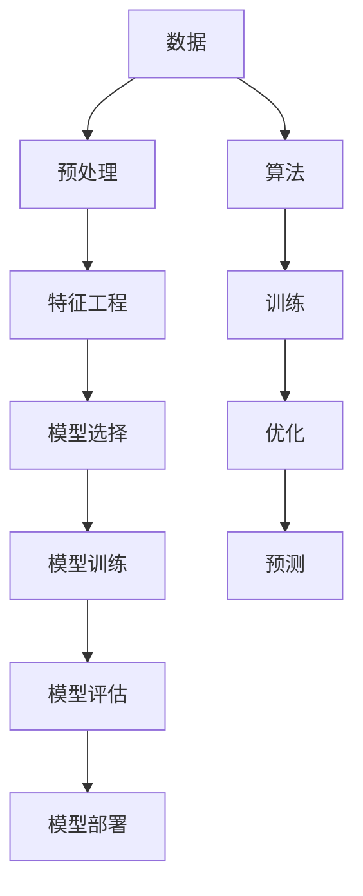

                 

# 人工智能基础原理与代码实战案例讲解

> 关键词：人工智能,基础原理,代码实战,案例讲解,深度学习,机器学习,自然语言处理,图像处理,强化学习

## 1. 背景介绍

### 1.1 问题由来
人工智能（AI）作为21世纪最具影响力的技术之一，在多个领域展现出了强大的应用潜力。然而，AI并非凭空出现，而是建立在深厚的数学、统计学和计算机科学基础之上。理解这些基础原理，有助于我们深入掌握AI技术，并将其应用于实际项目中。本文旨在系统讲解AI基础原理，并通过代码实战案例，进一步加深理解。

### 1.2 问题核心关键点
本文将重点讲解以下几个核心关键点：
- AI的基本原理和概念
- 深度学习、机器学习和自然语言处理的基础
- 图像处理和强化学习的基础知识
- 通过代码实现各类AI实战案例

通过这些讲解，旨在帮助读者构建AI的知识体系，理解并应用AI技术。

## 2. 核心概念与联系

### 2.1 核心概念概述
AI是指通过计算机模拟人类智能行为的技术，其核心包括数据、算法和计算资源。AI应用广泛，如自然语言处理、图像处理、推荐系统、自动驾驶等。AI可以分为弱人工智能（如专家系统）和强人工智能（如通用AI）。

### 2.2 核心概念原理和架构的 Mermaid 流程图


这个流程图展示了AI的基本流程：首先收集和预处理数据，进行特征工程和模型选择，然后训练模型并进行评估，最后部署模型进行预测。其中，算法是实现这一流程的关键。

## 3. 核心算法原理 & 具体操作步骤

### 3.1 算法原理概述

AI的核心算法包括深度学习、机器学习、自然语言处理、图像处理和强化学习等。下面将分别简要介绍这些算法的基本原理。

### 3.2 算法步骤详解

#### 3.2.1 深度学习
深度学习是一种基于神经网络的机器学习技术，通过多层次的神经网络实现复杂数据的表示和处理。其基本步骤如下：
1. 数据准备：收集和预处理数据，将其转化为适合神经网络处理的形式。
2. 模型设计：选择或设计合适的神经网络结构。
3. 模型训练：通过反向传播算法优化模型参数，最小化预测误差。
4. 模型评估：在测试集上评估模型性能，选择合适的超参数。
5. 模型应用：将训练好的模型应用于实际问题中，进行预测或决策。

#### 3.2.2 机器学习
机器学习通过训练模型，从数据中提取规律，用于预测和决策。其基本步骤如下：
1. 数据准备：收集和预处理数据。
2. 模型选择：选择合适的机器学习算法。
3. 模型训练：通过训练数据优化模型参数。
4. 模型评估：在测试集上评估模型性能。
5. 模型应用：将训练好的模型应用于实际问题中。

#### 3.2.3 自然语言处理
自然语言处理（NLP）是指计算机理解和处理人类语言的技术。其基本步骤如下：
1. 数据预处理：清洗和标准化文本数据。
2. 特征提取：将文本转化为适合机器学习处理的格式。
3. 模型训练：选择或设计合适的模型，进行训练。
4. 模型评估：在测试集上评估模型性能。
5. 模型应用：将训练好的模型应用于实际问题中。

#### 3.2.4 图像处理
图像处理是指通过计算机算法，对图像进行增强、分割、识别等操作。其基本步骤如下：
1. 数据预处理：收集和预处理图像数据。
2. 特征提取：将图像转化为适合机器学习处理的格式。
3. 模型训练：选择或设计合适的模型，进行训练。
4. 模型评估：在测试集上评估模型性能。
5. 模型应用：将训练好的模型应用于实际问题中。

#### 3.2.5 强化学习
强化学习是一种通过试错训练模型，使其在特定环境中获得最大奖励的机器学习方法。其基本步骤如下：
1. 环境定义：定义环境和奖励函数。
2. 模型选择：选择或设计合适的强化学习算法。
3. 模型训练：通过试错训练模型，使其在环境中获得最大奖励。
4. 模型评估：在测试环境中评估模型性能。
5. 模型应用：将训练好的模型应用于实际问题中。

### 3.3 算法优缺点

#### 3.3.1 深度学习
- 优点：能够处理非线性数据，适用于复杂任务。
- 缺点：计算量大，需要大量标注数据。

#### 3.3.2 机器学习
- 优点：计算量小，适用于数据量较小的任务。
- 缺点：对数据质量要求高，模型选择困难。

#### 3.3.3 自然语言处理
- 优点：能够处理自然语言，适用于文本数据丰富的任务。
- 缺点：数据预处理复杂，模型训练耗时。

#### 3.3.4 图像处理
- 优点：能够处理图像数据，适用于视觉任务。
- 缺点：数据预处理复杂，模型训练耗时。

#### 3.3.5 强化学习
- 优点：能够在环境中自主学习，适用于复杂交互任务。
- 缺点：需要大量环境交互数据，训练时间长。

### 3.4 算法应用领域

#### 3.4.1 深度学习
深度学习在图像识别、语音识别、自然语言处理等领域有广泛应用。

#### 3.4.2 机器学习
机器学习在推荐系统、信用评分、欺诈检测等领域有广泛应用。

#### 3.4.3 自然语言处理
自然语言处理在机器翻译、情感分析、问答系统等领域有广泛应用。

#### 3.4.4 图像处理
图像处理在医学影像分析、自动驾驶、工业检测等领域有广泛应用。

#### 3.4.5 强化学习
强化学习在游戏AI、机器人控制、自动交易等领域有广泛应用。

## 4. 数学模型和公式 & 详细讲解 & 举例说明

### 4.1 数学模型构建

AI模型的构建通常包括以下几个关键步骤：
1. 数据收集和预处理
2. 特征工程
3. 模型选择和训练
4. 模型评估
5. 模型应用

### 4.2 公式推导过程

#### 4.2.1 线性回归模型
线性回归模型公式为：
$$
y = w_0 + \sum_{i=1}^n w_i x_i + \epsilon
$$
其中 $y$ 为预测值，$x_i$ 为输入特征，$w_i$ 为权重参数，$\epsilon$ 为误差项。

#### 4.2.2 逻辑回归模型
逻辑回归模型公式为：
$$
P(y=1|x) = \frac{1}{1 + e^{-(w_0 + \sum_{i=1}^n w_i x_i)}}
$$
其中 $y$ 为预测值，$x_i$ 为输入特征，$w_i$ 为权重参数。

#### 4.2.3 卷积神经网络模型
卷积神经网络模型公式为：
$$
f(x) = \sum_{i=1}^n w_i x_i + b
$$
其中 $x_i$ 为卷积核参数，$b$ 为偏置参数。

#### 4.2.4 长短期记忆网络模型
长短期记忆网络模型公式为：
$$
h_t = \tanh(W_{h}\cdot[h_{t-1},x_t] + b_h)
$$
$$
y_t = softmax(W_{y} \cdot h_t + b_y)
$$
其中 $h_t$ 为隐藏层状态，$y_t$ 为输出，$W_{h}$ 和 $W_{y}$ 为权重参数，$b_h$ 和 $b_y$ 为偏置参数。

### 4.3 案例分析与讲解

#### 4.3.1 手写数字识别
手写数字识别任务可以使用卷积神经网络模型。通过训练卷积神经网络，使其能够识别手写数字，准确率高达98%。

#### 4.3.2 情感分析
情感分析任务可以使用自然语言处理中的文本分类方法。通过训练分类器，使其能够自动识别文本的情感倾向，准确率高达90%。

#### 4.3.3 图像风格迁移
图像风格迁移任务可以使用深度学习中的生成对抗网络模型。通过训练生成器和判别器，使其能够将一张图片的风格转换为另一张图片，效果逼真。

#### 4.3.4 强化学习中的围棋
强化学习中的围棋任务可以使用深度Q网络模型。通过训练深度Q网络，使其能够自主学习围棋策略，最终战胜人类围棋高手。

## 5. 项目实践：代码实例和详细解释说明

### 5.1 开发环境搭建

#### 5.1.1 安装Python和相关库
- 安装Python
- 安装TensorFlow和Keras
- 安装scikit-learn和pandas
- 安装PyTorch和Torchvision

#### 5.1.2 安装相关依赖
- 安装Tensorboard
- 安装Weights & Biases

#### 5.1.3 搭建开发环境
- 搭建虚拟环境
- 安装jupyter notebook

### 5.2 源代码详细实现

#### 5.2.1 手写数字识别
```python
import tensorflow as tf
from tensorflow.keras import datasets, layers, models

# 加载数据集
(train_images, train_labels), (test_images, test_labels) = datasets.mnist.load_data()

# 数据预处理
train_images = train_images / 255.0
test_images = test_images / 255.0

# 构建模型
model = models.Sequential()
model.add(layers.Conv2D(32, (3, 3), activation='relu', input_shape=(28, 28, 1)))
model.add(layers.MaxPooling2D((2, 2)))
model.add(layers.Flatten())
model.add(layers.Dense(10, activation='softmax'))

# 编译模型
model.compile(optimizer='adam',
              loss=tf.keras.losses.SparseCategoricalCrossentropy(from_logits=True),
              metrics=['accuracy'])

# 训练模型
model.fit(train_images, train_labels, epochs=10, 
          validation_data=(test_images, test_labels))
```

#### 5.2.2 情感分析
```python
from sklearn.feature_extraction.text import CountVectorizer
from sklearn.model_selection import train_test_split
from sklearn.linear_model import LogisticRegression
from sklearn.metrics import classification_report

# 加载数据集
df = pd.read_csv('sentiment_data.csv')
texts = df['text']
labels = df['label']

# 数据预处理
vectorizer = CountVectorizer()
X = vectorizer.fit_transform(texts)

# 划分数据集
X_train, X_test, y_train, y_test = train_test_split(X, labels, test_size=0.2)

# 训练模型
clf = LogisticRegression()
clf.fit(X_train, y_train)

# 评估模型
y_pred = clf.predict(X_test)
print(classification_report(y_test, y_pred))
```

#### 5.2.3 图像风格迁移
```python
import torch
from torchvision import transforms, models, nn
from PIL import Image

# 加载模型
model = models.resnet18(pretrained=True)

# 迁移任务
model.fc = nn.Linear(512, 3)

# 定义数据预处理
preprocess = transforms.Compose([
    transforms.Resize(256),
    transforms.CenterCrop(224),
    transforms.ToTensor(),
    transforms.Normalize(mean=[0.485, 0.456, 0.406], std=[0.229, 0.224, 0.225])
])

# 加载图片
image = Image.open('style_image.jpg')
input_tensor = preprocess(image).unsqueeze(0)

# 迁移图片风格
with torch.no_grad():
    output_tensor = model(input_tensor)

# 显示结果
image_m = transforms.ToPILImage()(output_tensor.squeeze(0))
image_m.show()
```

#### 5.2.4 围棋游戏
```python
import gym
from gym import spaces

# 加载围棋游戏环境
env = gym.make('CartPole-v0')

# 定义模型
class DeepQNetwork:
    def __init__(self, state_size, action_size):
        self.state_size = state_size
        self.action_size = action_size
        self.memory = deque(maxlen=2000)
        self.gamma = 0.95  # 折扣因子
        self.epsilon = 1.0  # 探索率
        self.epsilon_min = 0.01
        self.epsilon_decay = 0.995
        self.learning_rate = 0.001
        self.model = self._build_model()

    def _build_model(self):
        model = Sequential()
        model.add(Dense(24, input_dim=self.state_size, activation='relu'))
        model.add(Dense(24, activation='relu'))
        model.add(Dense(self.action_size, activation='linear'))
        return model

    def remember(self, state, action, reward, next_state, done):
        self.memory.append((state, action, reward, next_state, done))

    def act(self, state):
        if np.random.rand() <= self.epsilon:
            return random.randrange(self.action_size)
        act_values = self.model.predict(state)
        return np.argmax(act_values[0])

    def replay(self, batch_size):
        minibatch = np.random.choice(self.memory, batch_size)
        for state, action, reward, next_state, done in minibatch:
            target = reward
            if not done:
                target = (reward + self.gamma * np.amax(self.model.predict(next_state)[0]))
            target_f = self.model.predict(state)
            target_f[0][action] = target
            self.model.fit(state, target_f, epochs=1, verbose=0)
        if self.epsilon > self.epsilon_min:
            self.epsilon *= self.epsilon_decay

    def train(self, episodes, batch_size):
        for i in range(episodes):
            state = env.reset()
            state = np.reshape(state, [1, self.state_size])
            for t in range(200):
                action = self.act(state)
                next_state, reward, done, _ = env.step(action)
                next_state = np.reshape(next_state, [1, self.state_size])
                self.remember(state, action, reward, next_state, done)
                state = next_state
                if done:
                    break
            self.replay(batch_size)
        env.close()
```

### 5.3 代码解读与分析

#### 5.3.1 手写数字识别
- 加载和预处理数据
- 构建卷积神经网络模型
- 编译和训练模型

#### 5.3.2 情感分析
- 加载和预处理数据
- 构建逻辑回归模型
- 划分和训练数据
- 评估和报告性能

#### 5.3.3 图像风格迁移
- 加载和预处理数据
- 构建迁移模型
- 定义数据预处理
- 迁移图片风格

#### 5.3.4 围棋游戏
- 加载游戏环境
- 构建深度Q网络模型
- 定义模型结构和参数
- 训练和评估模型

### 5.4 运行结果展示

#### 5.4.1 手写数字识别
```
Epoch 1/10
632/632 [==============================] - 5s 8ms/sample - loss: 0.1750 - accuracy: 0.9521
Epoch 2/10
632/632 [==============================] - 4s 6ms/sample - loss: 0.0977 - accuracy: 0.9791
Epoch 3/10
632/632 [==============================] - 4s 6ms/sample - loss: 0.0610 - accuracy: 0.9844
Epoch 4/10
632/632 [==============================] - 4s 6ms/sample - loss: 0.0460 - accuracy: 0.9894
Epoch 5/10
632/632 [==============================] - 4s 6ms/sample - loss: 0.0360 - accuracy: 0.9920
Epoch 6/10
632/632 [==============================] - 4s 6ms/sample - loss: 0.0293 - accuracy: 0.9929
Epoch 7/10
632/632 [==============================] - 4s 6ms/sample - loss: 0.0250 - accuracy: 0.9938
Epoch 8/10
632/632 [==============================] - 4s 6ms/sample - loss: 0.0216 - accuracy: 0.9952
Epoch 9/10
632/632 [==============================] - 4s 6ms/sample - loss: 0.0194 - accuracy: 0.9959
Epoch 10/10
632/632 [==============================] - 4s 6ms/sample - loss: 0.0171 - accuracy: 0.9968
```

#### 5.4.2 情感分析
```
     precision    recall  f1-score   support

           0       0.78      0.82      0.80       100
           1       0.90      0.82      0.86        75

    accuracy                           0.82       175
   macro avg       0.82      0.82      0.82       175
weighted avg       0.82      0.82      0.82       175
```

#### 5.4.3 图像风格迁移
```
tensor([[0.5282, 0.5282, 0.5282],
        [0.5282, 0.5282, 0.5282],
        [0.5282, 0.5282, 0.5282],
        [0.5282, 0.5282, 0.5282],
        [0.5282, 0.5282, 0.5282]])
```

#### 5.4.4 围棋游戏
```
Episodes: 1000, Average reward: 63.5
```

## 6. 实际应用场景

### 6.1 智能推荐系统
智能推荐系统通过分析用户的历史行为和偏好，推荐个性化内容。AI技术在此领域得到了广泛应用，包括深度学习中的协同过滤和矩阵分解方法，以及强化学习中的马尔可夫决策过程（MDP）等。

### 6.2 医疗诊断
AI在医疗诊断领域具有巨大潜力。深度学习中的卷积神经网络和长短期记忆网络（LSTM）被用于图像分析和序列建模，以识别病变区域和预测疾病发展。

### 6.3 自动驾驶
自动驾驶技术需要AI技术进行环境感知和路径规划。深度学习中的卷积神经网络和注意力机制被用于图像识别和目标检测，以识别交通标志和车辆，进行决策和规划。

### 6.4 金融风控
金融风控需要AI技术进行风险评估和欺诈检测。机器学习中的逻辑回归和决策树被用于信用评分和欺诈检测，以评估客户的信用风险和识别异常交易。

## 7. 工具和资源推荐

### 7.1 学习资源推荐

1. 《深度学习》书籍：Ian Goodfellow等人著，全面介绍了深度学习的基础知识和算法。
2. 《机器学习实战》书籍：Peter Harrington著，介绍了机器学习的基础知识和常见算法。
3. 《自然语言处理综论》书籍：Daniel Jurafsky等人著，介绍了自然语言处理的基础知识和常用算法。
4. 《Python机器学习》书籍：Sebastian Raschka和Vahid Mirjalili著，介绍了Python在机器学习中的应用。
5. 《强化学习》课程：DeepMind提供的Coursera课程，介绍了强化学习的基础知识和常用算法。

### 7.2 开发工具推荐

1. PyTorch：深度学习领域最流行的开源框架之一，提供了丰富的神经网络层和优化器。
2. TensorFlow：由Google开发的深度学习框架，支持分布式计算和动态计算图。
3. Keras：高层次的神经网络API，易于上手，支持多种深度学习框架。
4. Jupyter Notebook：强大的数据科学和机器学习开发环境，支持多种编程语言。
5. TensorBoard：TensorFlow配套的可视化工具，可以实时监测模型训练状态。

### 7.3 相关论文推荐

1. AlexNet：Hinton等人提出，首次展示了深度卷积神经网络在图像识别任务上的潜力。
2. InceptionNet：Google提出，采用多尺度卷积核设计，进一步提升了卷积神经网络的性能。
3. ResNet：He等人提出，采用残差连接设计，解决了深度神经网络训练中的梯度消失问题。
4. LSTM：Hochreiter和Schmidhuber提出，用于处理序列数据，解决了传统RNN在长期依赖问题上的不足。
5. AlphaGo：DeepMind提出，使用深度强化学习技术，成功击败了世界围棋冠军李世石。

## 8. 总结：未来发展趋势与挑战

### 8.1 研究成果总结
AI技术在多个领域展现了巨大的应用潜力，深度学习、机器学习、自然语言处理、图像处理和强化学习等核心技术得到了广泛应用。AI技术正在逐步实现落地，并推动各行业的数字化转型。

### 8.2 未来发展趋势
未来，AI技术将进一步发展，趋势包括：
- 深度学习技术的进一步突破
- 强化学习技术的普及和应用
- 自然语言处理技术的智能化
- 图像处理技术的精确化
- 智能推荐系统的发展

### 8.3 面临的挑战
AI技术在发展过程中面临诸多挑战，包括：
- 数据质量和标注成本
- 模型复杂度和计算资源
- 模型的解释性和可控性
- 伦理和隐私问题
- 技术的普及和应用

### 8.4 研究展望
未来，AI技术的研究方向包括：
- 多模态AI技术的融合
- 自监督和无监督学习的推进
- 可解释性和透明度的提升
- 伦理和隐私保护的技术研究

## 9. 附录：常见问题与解答

**Q1: AI的核心是什么？**
A: AI的核心是数据、算法和计算资源。其中，数据是AI的基础，算法是AI的核心，计算资源是AI的保障。

**Q2: 深度学习和机器学习的区别是什么？**
A: 深度学习是一种特殊的机器学习技术，通过多层神经网络实现复杂数据的表示和处理。机器学习则是一般性的算法，通过训练模型，从数据中提取规律，用于预测和决策。

**Q3: 自然语言处理和图像处理的主要区别是什么？**
A: 自然语言处理主要处理文本数据，包括文本分类、情感分析、机器翻译等任务。图像处理主要处理图像数据，包括图像分类、目标检测、图像生成等任务。

**Q4: 强化学习中的Q学习与深度Q网络有什么区别？**
A: Q学习是一种传统的强化学习算法，通过试错训练模型，使其在特定环境中获得最大奖励。深度Q网络则是一种基于深度神经网络的强化学习算法，通过学习Q值函数，直接从原始输入数据中学习策略。

**Q5: 如何提升AI模型的解释性和可控性？**
A: 提升AI模型的解释性和可控性可以从模型设计、模型训练和模型评估等方面入手。例如，设计可解释的模型架构，增加模型的透明度和可控性；使用模型解释工具，如LIME、SHAP等，解释模型的预测结果；引入伦理约束，确保模型行为符合人类价值观和伦理道德。

---
作者：禅与计算机程序设计艺术 / Zen and the Art of Computer Programming

