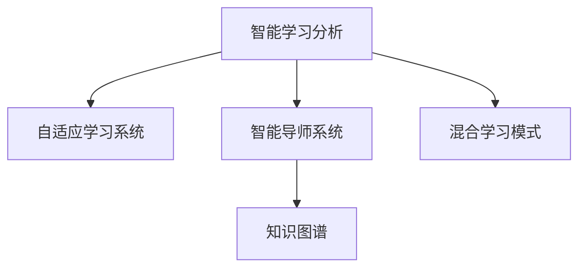

                 

# 人工智能：教育变革的催化剂

> 关键词：人工智能(AI), 教育技术(EdTech), 学习分析, 个性化教育, 自适应学习系统, 知识图谱, 混合学习, 智能导师, 教育数据挖掘

## 1. 背景介绍

### 1.1 问题由来

在21世纪的今天，随着信息技术的迅猛发展，教育领域也迎来了深刻变革。传统的教育模式以教师讲授为主，难以满足个性化学习的需求。而人工智能技术，特别是智能教育技术，为个性化学习和因材施教提供了新的可能。

当前，全球正处于“人工智能+教育”融合发展的关键时期。教育界普遍认为，人工智能有望推动教育理念、教学方法、管理模式等的全面创新，使教育更具普及性、公平性和高效性。如何在教育中引入AI，发挥其催化作用，成为教育工作者和研究者共同关注的焦点。

### 1.2 问题核心关键点

人工智能在教育领域的应用，主要集中在以下几个方面：

- **智能学习分析**：通过收集和分析学生学习数据，提供个性化推荐和学习路径。
- **自适应学习系统**：根据学生的学习进度和理解情况，动态调整教学内容和难度。
- **智能导师系统**：借助AI技术，为学生提供智能化的指导和反馈，提高学习效率。
- **知识图谱和资源推荐**：利用知识图谱技术，构建学科知识网络，为学生提供丰富的学习资源。
- **混合学习模式**：结合线上线下资源，打破时间和空间的限制，实现灵活学习。

这些应用方向，均涉及到对学生学习数据的大规模分析，以及对教学过程的智能化优化。本文将围绕这些核心概念，系统介绍人工智能在教育领域的应用，并探讨其对教育变革的深远影响。

## 2. 核心概念与联系

### 2.1 核心概念概述

为更好地理解人工智能在教育中的应用，本节将介绍几个密切相关的核心概念：

- **智能学习分析**：通过收集和分析学生的学习数据，如成绩、答题时间、视频观看时长等，来了解学习行为和效果，并提供个性化推荐和改进建议。

- **自适应学习系统**：利用AI算法，根据学生的学习进度和理解情况，动态调整学习内容和学习方式，以适应每个学生的个体差异。

- **智能导师系统**：使用自然语言处理(NLP)、机器学习等技术，为学生提供智能化的指导和反馈，如自动批改作业、答疑解惑等。

- **知识图谱**：构建学科知识网络，以节点和边的形式表示概念之间的关联，用于知识搜索、推荐等应用。

- **混合学习模式**：结合线上和线下资源，通过多种教学手段，提升学习效果，适应不同学习场景。

这些核心概念之间的逻辑关系可以通过以下Mermaid流程图来展示：



这个流程图展示了一组智能教育技术之间的关系：

1. 智能学习分析通过数据收集和分析，为自适应学习系统和智能导师系统提供输入。
2. 自适应学习系统根据学习分析的结果，动态调整教学内容和学习方式。
3. 智能导师系统通过自然语言处理等技术，提供个性化的指导和反馈。
4. 知识图谱提供丰富的学习资源，辅助学生理解和应用知识。
5. 混合学习模式通过线上线下资源的结合，提升学习效率和灵活性。

这些概念共同构成了智能教育技术的学习框架，为个性化学习和因材施教提供了技术支撑。通过理解这些核心概念，我们可以更好地把握人工智能在教育中的应用价值。

## 3. 核心算法原理 & 具体操作步骤

### 3.1 算法原理概述

人工智能在教育中的应用，本质上是一种以数据为驱动的教学优化过程。其核心思想是利用机器学习、自然语言处理、数据挖掘等技术，分析学生的学习行为和效果，从而提供个性化教学和智能化指导。

形式化地，假设学生集合为 $S$，每个学生的学习行为和效果数据为 $D_i$，教育目标为 $T$。智能教育系统的目标是通过分析 $D_i$，找到最优的教学策略 $S^*$，满足 $S^*$ 能够最大化学生达到教育目标 $T$ 的可能性。

具体来说，可以构建一个优化问题：

$$
\min_{S^*} \mathcal{L}(S^*,D) \\
s.t. \quad S^* \in S \\
\quad S^* 满足 T
$$

其中 $\mathcal{L}(S^*,D)$ 为学习分析模块的损失函数，用于衡量教学策略 $S^*$ 与数据 $D$ 的拟合程度。

### 3.2 算法步骤详解

人工智能在教育中的应用，一般包括以下几个关键步骤：

**Step 1: 数据收集与预处理**
- 收集学生的学习数据，包括在线作业、测试成绩、视频观看记录等。
- 对数据进行清洗和预处理，如去除噪声、填补缺失值、归一化等。

**Step 2: 特征提取与建模**
- 利用自然语言处理技术，提取学生学习行为的特征向量。
- 使用机器学习算法，构建学生行为和效果的预测模型，如线性回归、决策树、神经网络等。

**Step 3: 自适应学习策略设计**
- 根据预测模型的输出，设计动态调整学习内容的策略。
- 根据学生的理解情况，动态调整教学难度和内容，如实时推送个性化习题、调整讲解视频等。

**Step 4: 智能导师系统实现**
- 使用自然语言处理技术，构建智能导师系统。
- 系统能够自动批改作业，识别学生答疑需求，并生成个性化反馈。

**Step 5: 知识图谱构建与查询**
- 构建学科知识图谱，表示概念之间的关联。
- 使用图谱技术，提供学生知识搜索、推荐等应用。

**Step 6: 混合学习模式实施**
- 结合线上和线下资源，设计灵活的学习模式。
- 利用智能推荐系统，辅助学生选择最合适的学习材料。

### 3.3 算法优缺点

人工智能在教育中的应用，具有以下优点：

1. **个性化学习**：根据学生个体差异，提供个性化的学习建议，提升学习效果。
2. **自适应教学**：动态调整教学内容和难度，使学习过程更加贴合学生的认知水平。
3. **智能化反馈**：提供即时化的智能反馈，帮助学生及时纠正错误，提高学习效率。
4. **混合学习模式**：结合线上线下资源，打破时间和空间的限制，提高学习灵活性。

同时，该方法也存在一些局限性：

1. **数据隐私问题**：学生学习数据的收集和分析涉及隐私保护，需要严格的数据管理措施。
2. **模型复杂度**：高复杂度的模型可能导致过拟合问题，需要合理选择模型和优化算法。
3. **技术门槛高**：开发和实施智能教育系统需要较高的技术水平，可能涉及跨学科知识。
4. **资源需求大**：高质量的数据和强大的计算能力，是实现智能教育的基础条件。

尽管存在这些局限性，但就目前而言，人工智能在教育中的应用已经成为一种趋势，值得我们深入探索和实践。

### 3.4 算法应用领域

人工智能在教育领域的应用，已经覆盖了从幼儿教育到高等教育，从基础学科到艺术类课程的各个方面。具体应用包括：

- **K-12教育**：通过智能学习分析，提供个性化的学习建议和测评报告。
- **高等教育**：利用自适应学习系统，提高专业课程的学习效果。
- **职业培训**：结合行业知识图谱，提供定制化的职业技能培训。
- **语言学习**：使用智能导师系统，提供实时化的语言指导和反馈。
- **在线教育平台**：结合混合学习模式，提供灵活的学习路径和丰富的学习资源。

这些应用方向，展示了人工智能在教育领域广阔的发展前景，也为未来的教育变革提供了新的方向和机遇。

## 4. 数学模型和公式 & 详细讲解

### 4.1 数学模型构建

本节将使用数学语言对智能教育系统中的核心算法进行更加严格的刻画。

假设学生的学习行为数据为 $D_i=\{x_i,y_i\}$，其中 $x_i$ 为特征向量，$y_i$ 为学习效果。设机器学习模型的预测函数为 $f(x_i;\theta)$，其中 $\theta$ 为模型参数。智能教育系统的目标是最小化损失函数 $\mathcal{L}(D)$，即：

$$
\min_{\theta} \mathcal{L}(D) = \sum_{i=1}^N (y_i - f(x_i;\theta))^2
$$

使用随机梯度下降等优化算法，模型参数 $\theta$ 的更新公式为：

$$
\theta \leftarrow \theta - \eta \nabla_{\theta} \mathcal{L}(D)
$$

其中 $\eta$ 为学习率。

### 4.2 公式推导过程

以下我们以线性回归为例，推导智能教育系统中的预测函数及其梯度的计算公式。

设 $f(x_i;\theta) = \theta^T x_i$，其中 $\theta$ 为模型参数向量，$x_i$ 为特征向量。则损失函数为：

$$
\mathcal{L}(D) = \frac{1}{2N} \sum_{i=1}^N (y_i - f(x_i;\theta))^2
$$

使用梯度下降算法，损失函数对参数 $\theta$ 的梯度为：

$$
\nabla_{\theta} \mathcal{L}(D) = \frac{1}{N} \sum_{i=1}^N (y_i - f(x_i;\theta)) x_i
$$

在得到梯度后，即可带入参数更新公式，完成模型的迭代优化。重复上述过程直至收敛，最终得到能够预测学生学习效果的模型。

### 4.3 案例分析与讲解

我们以一个智能学习分析的案例，来说明其基本流程和关键点。

假设有一批学生在准备某项考试，通过收集他们在题库上的答题情况和学习时间，构建一个特征向量 $x_i$。目标是预测学生在考试中的分数 $y_i$。

**Step 1: 数据收集与预处理**
- 收集学生的答题数据，包括题目难度、答题时间等。
- 对数据进行清洗和预处理，如去除噪声、填补缺失值、归一化等。

**Step 2: 特征提取与建模**
- 利用自然语言处理技术，提取学生答题行为的特征向量。
- 使用线性回归模型，构建预测学生考试分数的模型。

**Step 3: 分析与反馈**
- 根据预测模型的输出，分析学生的学习情况和考试难度。
- 提供个性化的学习建议，如针对弱项提供额外练习，建议合理分配学习时间。

## 5. 项目实践：代码实例和详细解释说明

### 5.1 开发环境搭建

在进行智能教育系统开发前，我们需要准备好开发环境。以下是使用Python进行PyTorch开发的环境配置流程：

1. 安装Anaconda：从官网下载并安装Anaconda，用于创建独立的Python环境。

2. 创建并激活虚拟环境：
```bash
conda create -n pytorch-env python=3.8 
conda activate pytorch-env
```

3. 安装PyTorch：根据CUDA版本，从官网获取对应的安装命令。例如：
```bash
conda install pytorch torchvision torchaudio cudatoolkit=11.1 -c pytorch -c conda-forge
```

4. 安装必要的Python包：
```bash
pip install pandas numpy scikit-learn matplotlib seaborn jupyter notebook ipython
```

完成上述步骤后，即可在`pytorch-env`环境中开始智能教育系统的开发。

### 5.2 源代码详细实现

这里我们以一个简单的线性回归模型为例，进行智能学习分析的代码实现。

```python
import numpy as np
from sklearn.linear_model import LinearRegression

# 构建训练数据
X = np.array([[1, 2], [2, 4], [3, 6], [4, 8], [5, 10]])
y = np.array([2, 4, 6, 8, 10])

# 训练模型
model = LinearRegression()
model.fit(X, y)

# 预测新样本
X_new = np.array([[6, 12]])
y_pred = model.predict(X_new)

print("预测值:", y_pred)
```

在实际应用中，需要根据具体问题，选择合适的模型和算法。但以上示例代码展示了智能学习分析的基本流程和关键点，值得借鉴。

### 5.3 代码解读与分析

让我们再详细解读一下关键代码的实现细节：

**训练数据构建**
- 使用NumPy库构建训练数据集 $X$ 和目标值 $y$。

**模型训练**
- 使用scikit-learn库的LinearRegression模型进行训练，通过fit方法拟合数据。

**预测新样本**
- 使用训练好的模型对新样本 $X_{new}$ 进行预测，输出预测值。

可以看到，智能学习分析的基本流程包括数据收集、特征提取、模型训练和预测输出。通过以上步骤，可以构建一个初步的智能教育系统，辅助学生学习。

当然，实际应用中还需要更多的功能和模块，如自适应学习策略设计、智能导师系统实现等。但核心的算法框架基本与此类似。

## 6. 实际应用场景

### 6.1 智能学习分析

智能学习分析可以通过收集和分析学生的学习数据，提供个性化的学习建议和改进建议。例如，通过分析学生的答题情况和学习时间，可以识别出学生的薄弱知识点，推荐针对性的习题和视频，帮助学生克服学习障碍。

在技术实现上，可以利用机器学习算法，如决策树、随机森林、神经网络等，构建学生学习行为的预测模型。通过模型输出，分析学生的学习进度和理解情况，并给出个性化推荐。

### 6.2 自适应学习系统

自适应学习系统可以根据学生的学习进度和理解情况，动态调整教学内容和难度。例如，通过分析学生在题库上的答题情况和学习时间，智能系统可以推荐难度适中的题目，逐步提高学生的学习难度。

在技术实现上，可以使用自适应学习算法，如增量式学习、贝叶斯网络等，动态调整教学内容和难度。通过学习分析模块，获取学生的学习进度和理解情况，智能系统可以实时调整学习路径和内容，使学习过程更加贴合学生的认知水平。

### 6.3 智能导师系统

智能导师系统可以提供个性化的指导和反馈，帮助学生提高学习效率。例如，智能系统可以自动批改作业，识别学生答疑需求，并生成个性化反馈。

在技术实现上，可以使用自然语言处理技术，构建智能导师系统。系统能够自动批改作业，识别学生答疑需求，并生成个性化反馈。通过学习分析模块，获取学生的学习进度和理解情况，智能系统可以提供个性化的指导和反馈，如自动批改作业、答疑解惑等。

### 6.4 知识图谱与混合学习模式

知识图谱和混合学习模式可以提供丰富的学习资源，辅助学生理解和应用知识。例如，通过构建学科知识图谱，学生可以更方便地进行知识搜索和推荐。

在技术实现上，可以使用图谱技术，构建学科知识图谱，表示概念之间的关联。通过知识图谱，学生可以更方便地进行知识搜索和推荐。结合线上线下资源，设计灵活的学习模式，利用智能推荐系统，辅助学生选择最合适的学习材料。

## 7. 工具和资源推荐

### 7.1 学习资源推荐

为了帮助开发者系统掌握人工智能在教育中的应用，这里推荐一些优质的学习资源：

1. **Coursera《AI for Everyone》课程**：由Andrew Ng教授主讲，适合对人工智能感兴趣的初学者，系统介绍AI的基本概念和应用。

2. **EdTech评论**：专注于教育技术领域的新闻和分析，涵盖AI在教育中的应用案例和未来趋势。

3. **《机器学习与人工智能在教育中的应用》书籍**：详细介绍了机器学习和AI在教育中的应用，包括智能学习分析、自适应学习系统等。

4. **Kaggle数据集**：提供大量教育领域的数据集和竞赛任务，可供学习和实践。

5. **Transformers库**：HuggingFace开发的NLP工具库，集成了许多预训练模型和微调样例代码。

通过对这些资源的学习实践，相信你一定能够快速掌握人工智能在教育中的应用精髓，并用于解决实际的教育问题。

### 7.2 开发工具推荐

高效的开发离不开优秀的工具支持。以下是几款用于人工智能教育系统开发的常用工具：

1. **Jupyter Notebook**：免费的交互式编程环境，支持代码编写、数据可视化、文档记录等功能。

2. **TensorFlow**：由Google主导开发的深度学习框架，生产部署方便，支持分布式训练。

3. **PyTorch**：基于Python的开源深度学习框架，灵活动态的计算图，适合快速迭代研究。

4. **Scikit-learn**：Python的机器学习库，提供多种机器学习算法和工具。

5. **Seaborn**：基于matplotlib的数据可视化库，提供更高级的数据可视化功能。

6. **Kaggle**：提供Kaggle竞赛平台和数据集，用于学习和实践。

合理利用这些工具，可以显著提升人工智能教育系统的开发效率，加快创新迭代的步伐。

### 7.3 相关论文推荐

人工智能在教育领域的应用，源于学界的持续研究。以下是几篇奠基性的相关论文，推荐阅读：

1. **"Machine Learning in Education: A Review of the Literature"**：系统总结了机器学习在教育领域的应用，包括智能学习分析、自适应学习系统等。

2. **"Personalized Learning with Predictive Analytics: An Empirical Study"**：通过实验，展示了智能学习分析对学习效果的影响，提供了实践数据和案例。

3. **"An Overview of AI Applications in K-12 Education"**：介绍了AI在K-12教育中的应用案例，包括智能学习分析、自适应学习系统等。

4. **"Transformers in Education: Current Applications and Future Directions"**：详细介绍了Transformer技术在教育领域的应用，包括自然语言处理、知识图谱等。

这些论文代表了大规模学习分析技术的发展脉络。通过学习这些前沿成果，可以帮助研究者把握学科前进方向，激发更多的创新灵感。

## 8. 总结：未来发展趋势与挑战

### 8.1 总结

本文对人工智能在教育领域的应用进行了全面系统的介绍。首先阐述了AI在教育中的研究背景和意义，明确了其对教育变革的深远影响。其次，从原理到实践，详细讲解了智能教育系统的数学原理和关键步骤，给出了系统开发的完整代码实例。同时，本文还广泛探讨了智能教育系统在多个教育场景中的应用，展示了AI技术的广泛应用前景。

通过本文的系统梳理，可以看到，人工智能在教育中的应用已经成为一种趋势，正在推动教育理念、教学方法、管理模式等的全面创新。未来，伴随AI技术的持续演进，智能教育系统将带来更加个性化、高效、灵活的学习体验，为教育公平和效率提供新的保障。

### 8.2 未来发展趋势

展望未来，人工智能在教育中的应用将呈现以下几个发展趋势：

1. **个性化学习**：随着机器学习、深度学习等技术的发展，智能教育系统将能够提供更加个性化的学习建议和路径，适应每个学生的个体差异。

2. **自适应教学**：结合自适应学习算法，智能教育系统将能够动态调整教学内容和难度，使学习过程更加贴合学生的认知水平。

3. **智能导师系统**：借助自然语言处理和机器学习技术，智能导师系统将能够提供更加智能化、个性化的指导和反馈，提高学习效率。

4. **混合学习模式**：结合线上和线下资源，利用智能推荐系统，智能教育系统将能够提供更加灵活、高效的学习模式。

5. **智能评测系统**：通过分析学生的学习行为和效果，智能评测系统将能够提供更加客观、全面的评估报告，帮助教师和学生了解学习情况。

6. **跨领域知识图谱**：结合跨领域知识图谱技术，智能教育系统将能够提供更加丰富、全面的学习资源，帮助学生更好地理解和应用知识。

以上趋势凸显了人工智能在教育领域广阔的应用前景，也为未来的教育变革提供了新的方向和机遇。

### 8.3 面临的挑战

尽管人工智能在教育中的应用已经取得了显著进展，但在迈向更加智能化、普适化应用的过程中，它仍面临着诸多挑战：

1. **数据隐私问题**：学生学习数据的收集和分析涉及隐私保护，需要严格的数据管理措施。如何保护学生隐私，成为智能教育系统面临的重要挑战。

2. **技术门槛高**：开发和实施智能教育系统需要较高的技术水平，可能涉及跨学科知识。如何降低技术门槛，推广AI在教育中的应用，也是未来需要解决的问题。

3. **资源需求大**：高质量的数据和强大的计算能力，是实现智能教育的基础条件。如何降低资源需求，提高系统效率，是未来需要解决的问题。

4. **教育公平问题**：如何确保智能教育系统能够公平地服务于所有学生，特别是弱势群体，也是未来需要关注的重要问题。

5. **伦理道德问题**：如何确保AI系统的决策过程透明、公正，避免产生偏见和歧视，也是未来需要解决的问题。

6. **教育变革的适应性**：如何确保智能教育系统能够适应不同的教育环境和需求，避免过度依赖技术，也是未来需要解决的问题。

### 8.4 研究展望

面对人工智能在教育领域面临的挑战，未来的研究需要在以下几个方面寻求新的突破：

1. **隐私保护技术**：研究如何保护学生学习数据的隐私，确保数据安全。

2. **跨学科合作**：推动教育学、心理学、计算机科学等领域的合作，共同推进智能教育系统的研究和应用。

3. **资源优化技术**：研究如何降低智能教育系统的资源需求，提高系统效率。

4. **公平性研究**：研究如何确保智能教育系统能够公平地服务于所有学生，特别是弱势群体。

5. **伦理道德研究**：研究如何确保AI系统的决策过程透明、公正，避免产生偏见和歧视。

6. **教育变革的适应性研究**：研究如何确保智能教育系统能够适应不同的教育环境和需求，避免过度依赖技术。

这些研究方向的探索，必将引领智能教育系统迈向更高的台阶，为构建安全、可靠、可解释、可控的智能教育系统铺平道路。面向未来，智能教育系统还需要与其他教育技术进行更深入的融合，如知识表示、因果推理、强化学习等，多路径协同发力，共同推动教育公平和效率。

## 9. 附录：常见问题与解答

**Q1：智能教育系统如何处理学生的隐私数据？**

A: 智能教育系统在处理学生的隐私数据时，需要采取严格的数据管理措施，如数据匿名化、加密、访问控制等。同时，还需要明确数据使用的目的和范围，确保数据的使用符合伦理和法律要求。

**Q2：智能教育系统的开发需要哪些技术栈？**

A: 智能教育系统的开发需要多种技术的支持，包括机器学习、自然语言处理、数据可视化等。常用的技术栈包括Python、PyTorch、TensorFlow、Scikit-learn等。

**Q3：智能教育系统的应用效果如何评价？**

A: 智能教育系统的应用效果可以从多个方面进行评价，如学生的学习效果、教师的使用反馈、系统的稳定性和可靠性等。可以通过定期测评和用户调查等方式，评估系统的应用效果。

**Q4：智能教育系统如何应对教育公平问题？**

A: 智能教育系统可以通过设计公平的学习路径、提供个性化学习建议等方式，帮助弱势群体更好地适应教育环境。同时，可以通过培训和支持教师等方式，确保系统的公平性。

**Q5：智能教育系统如何处理教学中的多样性问题？**

A: 智能教育系统可以通过设计多样化的学习资源和路径，适应不同学生的学习需求。同时，可以通过自适应学习算法，动态调整教学内容和难度，使学习过程更加贴合学生的认知水平。

这些问答展示了智能教育系统在应用中面临的常见问题及其应对策略，希望能为智能教育系统的开发者和使用者提供参考。

---

作者：禅与计算机程序设计艺术 / Zen and the Art of Computer Programming

