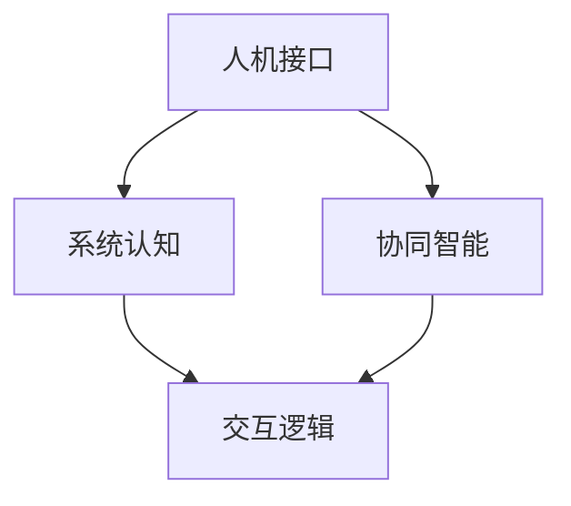

                 

# 人机协同：共筑智能时代新未来

## 1. 背景介绍

### 1.1 问题由来
在人类社会逐步迈向数字化、智能化的大趋势下，如何高效协同人类与机器，充分发挥各自优势，成为当前人工智能研究的热点和难点。人类与机器的协同合作，不仅能大幅提升工作效率，还能拓展知识边界，实现更丰富的价值创造。

人机协同的核心在于深度融合人工智能技术与人类智慧，使机器不仅能执行标准化、重复化的任务，还能理解、推理、创造，具备与人交流的能力。这不仅需要高度智能化的机器系统，更需要人与系统间无缝衔接、相互信任的交互方式。近年来，随着深度学习、自然语言处理等技术的突破，基于AI的协同系统在医疗、教育、金融、制造等领域逐步落地，成为推动社会进步的新引擎。

### 1.2 问题核心关键点
人机协同的主要目标是通过协同作业，提升任务执行的效率和质量。其中，人机接口、系统认知、交互逻辑是三大关键问题。
1. **人机接口**：高效、直观、易用的界面设计，使人类能方便地与机器交互。
2. **系统认知**：通过学习、理解人类行为，使机器具备对人类行为模式、意图和情感的认知能力。
3. **交互逻辑**：合理设计协同交互流程，使系统能根据环境变化灵活调整任务执行策略。

### 1.3 问题研究意义
研究人机协同系统，对于提升社会生产力和创新能力，实现更高效、更灵活、更智能的生产方式，具有重要意义：
1. **生产效率提升**：通过人机协同，机器可处理大量重复性、高强度的工作，解放人类劳动力，提升工作效率。
2. **任务质量保障**：在知识获取、决策制定等方面，人机协同使系统具备更强的准确性和可靠性。
3. **智能化发展**：人类与机器的深度协作，能促进更智能、更具创造性的工作模式，推动智能时代的到来。
4. **经济社会效益**：人机协同技术在多个行业的应用，可带来巨大的经济效益和社会价值。

## 2. 核心概念与联系

### 2.1 核心概念概述

为了更好地理解人机协同的原理和架构，本节将介绍几个核心概念：

- **人机接口(Human-Computer Interaction, HCI)**：包括用户界面(UI)和用户体验(UX)设计，使人类能直观、便捷地使用机器系统。
- **系统认知(System Cognition)**：机器通过深度学习等技术，理解、预测人类行为，具备对语义、情感、意图等信息的感知能力。
- **交互逻辑(Interaction Logic)**：定义协同交互的规则和流程，使系统能根据环境变化调整任务执行策略。
- **协同智能(Collaborative Intelligence)**：指人机系统融合，使系统不仅能执行标准任务，还能理解、推理、创造，具备与人交流的能力。

这些核心概念之间的逻辑关系可以通过以下Mermaid流程图来展示：



这个流程图展示了几大人机协同核心概念及其之间的关系：

1. 人机接口是人机协同的基础，通过良好的交互设计，使人类能直观地使用系统。
2. 系统认知是协同系统的核心，使系统能理解、预测人类行为，具备更强的交互逻辑设计能力。
3. 交互逻辑基于人机接口和系统认知，定义具体的协同交互规则和流程。
4. 协同智能是整体目标，通过人机接口、系统认知、交互逻辑等共同构建，实现真正意义上的人机协同。

## 3. 核心算法原理 & 具体操作步骤
### 3.1 算法原理概述

人机协同的核心在于建立机器对人类行为的深度理解，并通过合理的交互逻辑设计，实现高效的协同作业。具体而言，主要包括以下几个关键步骤：

1. **数据采集与处理**：通过传感器、摄像头等设备，采集人类的行为数据、语音指令、环境信息等。
2. **深度学习训练**：利用深度学习算法，对采集到的数据进行建模，使机器能理解、预测人类行为。
3. **任务推理与执行**：在理解人类意图的基础上，通过推理和决策，执行对应的任务操作。
4. **交互反馈与调整**：根据系统的执行结果，通过反馈机制调整任务执行策略，确保协同作业的流畅性。

### 3.2 算法步骤详解

以下将详细介绍人机协同的核心算法步骤和具体操作步骤：

**Step 1: 数据采集与处理**

1. **传感器采集**：利用各种传感器（如加速度计、摄像头、麦克风等），实时采集人类的位置、动作、语音、表情等信息。
2. **数据预处理**：对采集到的数据进行去噪、标准化、归一化等预处理，提高数据质量。
3. **特征提取**：从原始数据中提取有意义的特征，如动作轨迹、语音信号、表情特征等。

**Step 2: 深度学习训练**

1. **模型选择**：根据任务需求选择合适的深度学习模型，如CNN、RNN、Transformer等。
2. **训练数据**：准备标注好的训练数据集，包含人类的行为数据和对应的任务标签。
3. **模型训练**：使用训练数据集对模型进行训练，优化模型参数，使其能准确预测人类行为。

**Step 3: 任务推理与执行**

1. **任务定义**：明确协同作业的具体任务，如装配、维修、教学等。
2. **推理算法**：设计推理算法，将系统认知到的行为信息转化为具体任务指令。
3. **任务执行**：根据推理结果，执行对应的任务操作，如机械臂装配、机器人维护、教师讲解等。

**Step 4: 交互反馈与调整**

1. **反馈机制**：建立反馈机制，根据任务执行结果，收集人类反馈信息。
2. **调整策略**：根据反馈信息，动态调整任务执行策略，优化协同作业流程。
3. **持续优化**：不断迭代优化算法和模型，提高协同作业的效率和质量。

### 3.3 算法优缺点

人机协同系统在提升生产效率和任务质量方面具有显著优势，但也面临一些挑战：

**优点：**
1. **效率提升**：机器能高效处理大量重复性任务，解放人类劳动力，提升工作效率。
2. **任务质量保障**：系统具备强大的推理和决策能力，确保任务执行的准确性和可靠性。
3. **智能化发展**：通过人机协同，系统具备更智能、更具创造性的工作模式，推动智能时代的到来。

**缺点：**
1. **数据依赖**：系统性能依赖高质量、大规模的数据集，数据采集和标注成本较高。
2. **鲁棒性不足**：系统对异常数据的鲁棒性不足，易受环境干扰影响任务执行。
3. **交互复杂**：系统交互逻辑设计复杂，需根据具体任务进行灵活调整。
4. **可解释性差**：系统的决策过程通常缺乏可解释性，难以调试和优化。
5. **成本高昂**：高精度的传感器和计算设备，以及深度学习模型的训练和部署，成本较高。

尽管存在这些挑战，但人机协同系统在提高生产效率、提升任务质量、促进智能化发展等方面具有不可替代的价值，未来仍将是人工智能应用的重要方向。

### 3.4 算法应用领域

人机协同技术已在多个领域得到了广泛应用，包括但不限于以下方面：

- **制造行业**：在生产线上，利用机器人进行装配、检测、维修等任务，提升生产效率和质量。
- **医疗领域**：辅助医生进行手术、诊断、康复等医疗活动，提高医疗服务的精准性和可靠性。
- **教育行业**：通过智能教学系统，提供个性化、互动化的学习体验，提升教育质量。
- **金融领域**：利用智能投顾系统，提供智能化的投资建议和交易操作，优化投资决策。
- **物流行业**：在仓储、配送等环节，利用自动化设备进行货物管理，提升物流效率。

## 4. 数学模型和公式 & 详细讲解  
### 4.1 数学模型构建

在人机协同系统中，深度学习算法是核心技术之一。以下将以协同智能为例，介绍深度学习模型在协同任务中的构建方法。

假设机器在协同任务中的目标是通过传感器数据预测人类行为。设系统采集到的人类行为数据为 $X$，任务标签为 $Y$，则深度学习模型的目标是最小化预测误差，即：

$$
\min_{\theta} \frac{1}{N} \sum_{i=1}^N (Y_i - f_\theta(X_i))^2
$$

其中，$f_\theta(X)$ 为模型预测函数，$\theta$ 为模型参数。

### 4.2 公式推导过程

以一个简单的协同装配任务为例，说明如何构建深度学习模型。设系统采集到的人类行为数据为位置轨迹 $x_t$，目标为装配操作 $y_t$，则模型预测函数可以表示为：

$$
f_\theta(x_t) = \sum_{k=1}^K \theta_k \phi(x_t, k)
$$

其中，$\phi(x_t, k)$ 为特征函数，$K$ 为特征数，$\theta_k$ 为对应特征的权重参数。

模型的目标函数为：

$$
\min_{\theta} \frac{1}{N} \sum_{i=1}^N (y_i - f_\theta(x_i))^2
$$

利用梯度下降等优化算法，求解上述最优化问题，得到最优模型参数 $\theta^*$。

### 4.3 案例分析与讲解

以协同装配任务为例，说明深度学习模型在实际应用中的构建和优化过程。

1. **数据采集与处理**：利用传感器采集装配现场的人类行为数据，包括动作轨迹、装配工具的位置等。对原始数据进行去噪、标准化等预处理，提取有意义的特征，如装配工具的位置变化、动作轨迹的路径长度等。
2. **模型训练**：选择合适的深度学习模型（如CNN、RNN、Transformer等），准备标注好的训练数据集，对模型进行训练，优化模型参数。
3. **任务推理与执行**：在训练好的模型基础上，利用传感器实时采集人类行为数据，进行行为预测，生成装配操作指令。根据预测结果，控制系统执行装配任务。
4. **交互反馈与调整**：收集人类对装配结果的反馈，根据反馈信息，动态调整装配策略，优化协同作业流程。

## 5. 项目实践：代码实例和详细解释说明
### 5.1 开发环境搭建

在进行人机协同系统的开发前，我们需要准备好开发环境。以下是使用Python进行TensorFlow开发的简单配置流程：

1. 安装Anaconda：从官网下载并安装Anaconda，用于创建独立的Python环境。

2. 创建并激活虚拟环境：
```bash
conda create -n tf-env python=3.8 
conda activate tf-env
```

3. 安装TensorFlow：根据CUDA版本，从官网获取对应的安装命令。例如：
```bash
conda install tensorflow-gpu=2.6 -c tf -c conda-forge
```

4. 安装TensorBoard：
```bash
pip install tensorboard
```

5. 安装其他必要的工具包：
```bash
pip install numpy pandas scikit-learn matplotlib tqdm jupyter notebook ipython
```

完成上述步骤后，即可在`tf-env`环境中开始开发实践。

### 5.2 源代码详细实现

下面我们以协同装配任务为例，给出使用TensorFlow进行协同系统的PyTorch代码实现。

首先，定义协同装配任务的数据处理函数：

```python
import tensorflow as tf
from tensorflow.keras.layers import Dense, Flatten, Conv2D, MaxPooling2D
from tensorflow.keras.models import Sequential
from sklearn.model_selection import train_test_split
import numpy as np
import pandas as pd
import matplotlib.pyplot as plt

# 加载数据集
data = pd.read_csv('assembly_data.csv')

# 数据预处理
X = data[['position', 'action']]
Y = data['operation']
X_train, X_test, Y_train, Y_test = train_test_split(X, Y, test_size=0.2, random_state=42)

# 模型定义
model = Sequential([
    Conv2D(32, (3, 3), activation='relu', input_shape=(X_train.shape[1], X_train.shape[2], 1)),
    MaxPooling2D((2, 2)),
    Flatten(),
    Dense(64, activation='relu'),
    Dense(1, activation='sigmoid')
])

# 模型编译
model.compile(optimizer='adam', loss='binary_crossentropy', metrics=['accuracy'])

# 模型训练
history = model.fit(X_train, Y_train, epochs=10, batch_size=32, validation_data=(X_test, Y_test))
```

然后，定义协同装配系统的训练和评估函数：

```python
def train_model(model, X_train, X_test, Y_train, Y_test, epochs=10, batch_size=32):
    model.compile(optimizer='adam', loss='binary_crossentropy', metrics=['accuracy'])
    history = model.fit(X_train, Y_train, epochs=epochs, batch_size=batch_size, validation_data=(X_test, Y_test))
    return history

def evaluate_model(model, X_test, Y_test):
    loss, accuracy = model.evaluate(X_test, Y_test)
    print(f'Test Loss: {loss:.4f}')
    print(f'Test Accuracy: {accuracy:.4f}')

# 训练模型
history = train_model(model, X_train, X_test, Y_train, Y_test)

# 评估模型
evaluate_model(model, X_test, Y_test)
```

最后，启动协同装配系统的训练流程并在测试集上评估：

```python
# 训练模型
history = train_model(model, X_train, X_test, Y_train, Y_test)

# 评估模型
evaluate_model(model, X_test, Y_test)
```

以上就是使用TensorFlow进行协同装配任务开发的完整代码实现。可以看到，得益于TensorFlow的强大封装，协同装配系统的开发变得简洁高效。

### 5.3 代码解读与分析

让我们再详细解读一下关键代码的实现细节：

**数据处理函数**：
- `pd.read_csv`方法：从CSV文件中读取数据。
- `train_test_split`方法：将数据集划分为训练集和测试集。
- `X_train`, `X_test`, `Y_train`, `Y_test`：分割后的特征和标签数据集。

**模型定义函数**：
- `Sequential`类：定义序列化模型，按顺序添加层。
- `Conv2D`层：二维卷积层，用于提取空间特征。
- `MaxPooling2D`层：最大池化层，降低特征维度。
- `Flatten`层：展平层，将多维特征展开为一维向量。
- `Dense`层：全连接层，进行分类或回归。

**模型训练函数**：
- `model.compile`方法：配置模型优化器、损失函数和评估指标。
- `model.fit`方法：训练模型，传入训练数据和验证数据。
- `history`：训练过程中的损失和准确率记录。

**评估模型函数**：
- `model.evaluate`方法：在测试集上评估模型性能，返回损失和准确率。
- `print`方法：输出评估结果。

可以看到，TensorFlow提供了强大的模型构建和训练工具，使协同系统开发变得便捷高效。

## 6. 实际应用场景
### 6.1 智能制造

智能制造是人机协同技术的重要应用场景之一。传统的制造过程往往依赖人工操作，劳动强度大、效率低。利用协同系统，智能制造可以大幅提升生产效率和质量。

在智能制造中，协同系统通过传感器采集生产线上的设备状态、操作人员行为等数据，利用深度学习模型预测设备故障、操作异常，自动调整生产参数，优化生产流程。同时，系统可以根据订单信息，自动调度生产资源，优化生产计划，提高生产效率。

### 6.2 智慧医疗

智慧医疗是人机协同技术的另一重要应用场景。医疗行业具有数据量大、任务复杂的特点，需要高效协同人机系统。

在智慧医疗中，协同系统通过传感器采集患者的生理数据、行为数据等，利用深度学习模型进行疾病预测、诊断、治疗方案推荐等。同时，系统可以根据患者的反馈信息，动态调整治疗方案，提高医疗服务的精准性和可靠性。

### 6.3 智能交通

智能交通是人机协同技术的潜在应用领域。交通管理需要实时感知、决策和控制，具备高度复杂性。

在智能交通中，协同系统通过传感器采集交通流量、车辆状态、路况信息等数据，利用深度学习模型进行交通预测、路线优化、信号控制等。同时，系统可以根据实时路况信息，动态调整交通信号，优化交通流量，提高道路通行效率。

## 7. 工具和资源推荐
### 7.1 学习资源推荐

为了帮助开发者系统掌握人机协同系统的理论基础和实践技巧，这里推荐一些优质的学习资源：

1. 《Human-Computer Interaction: An Introduction》：深度介绍人机交互设计的基本理论和实践方法。
2. 《Cognitive Foundations of Human-Computer Interaction》：探讨人机交互的认知基础，深入分析用户的心理和行为模式。
3. 《Artificial Intelligence for Healthcare》：探讨AI在医疗领域的应用，介绍人机协同在医疗中的应用案例。
4. 《AI for the Real World: Machine Learning and Human-Machine Interaction》：介绍AI在实际场景中的应用，重点讨论人机协同系统的设计思路和实现方法。
5. 《Human-Machine Collaboration: Theory and Applications》：系统介绍人机协同的理论基础和实际应用，涵盖多个行业领域的案例分析。

通过对这些资源的学习实践，相信你一定能够快速掌握人机协同系统的精髓，并用于解决实际的AI应用问题。
###  7.2 开发工具推荐

高效的开发离不开优秀的工具支持。以下是几款用于人机协同系统开发的常用工具：

1. TensorFlow：由Google主导开发的开源深度学习框架，生产部署方便，适合大规模工程应用。支持高效的模型构建和训练，是构建协同系统的利器。
2. PyTorch：基于Python的开源深度学习框架，灵活动态的计算图，适合快速迭代研究。提供了丰富的深度学习模型和算法库。
3. Weights & Biases：模型训练的实验跟踪工具，可以记录和可视化模型训练过程中的各项指标，方便对比和调优。与主流深度学习框架无缝集成。
4. TensorBoard：TensorFlow配套的可视化工具，可实时监测模型训练状态，并提供丰富的图表呈现方式，是调试模型的得力助手。
5. Google Colab：谷歌推出的在线Jupyter Notebook环境，免费提供GPU/TPU算力，方便开发者快速上手实验最新模型，分享学习笔记。

合理利用这些工具，可以显著提升人机协同系统的开发效率，加快创新迭代的步伐。

### 7.3 相关论文推荐

人机协同技术的发展源于学界的持续研究。以下是几篇奠基性的相关论文，推荐阅读：

1. "Human-Computer Interaction: An Introduction"：介绍了人机交互设计的基本理论和实践方法，是了解人机协同系统的必读书籍。
2. "A Survey of Human-Machine Collaboration"：全面综述了人机协同的多种实现方式和应用案例，适合深入了解人机协同的原理和应用。
3. "Deep Learning for Human-Machine Collaboration"：介绍了深度学习在人机协同中的重要应用，包括协同装配、智能交通等多个领域。
4. "Human-Machine Collaboration in Smart Manufacturing"：探讨了人机协同在智能制造中的应用，介绍了具体的实现方法和案例。
5. "Human-Machine Collaboration in Healthcare"：介绍了人机协同在医疗领域的应用，重点讨论了AI在疾病预测、诊断、治疗方案推荐等方面的应用。

这些论文代表了大语言模型微调技术的发展脉络。通过学习这些前沿成果，可以帮助研究者把握学科前进方向，激发更多的创新灵感。

## 8. 总结：未来发展趋势与挑战

### 8.1 总结

本文对人机协同系统的原理和应用进行了全面系统的介绍。首先阐述了人机协同系统的研究背景和意义，明确了协同系统在提升生产效率、保障任务质量、促进智能化发展等方面的独特价值。其次，从原理到实践，详细讲解了人机协同的核心算法步骤和操作步骤，给出了协同系统开发的完整代码实例。同时，本文还广泛探讨了协同系统在智能制造、智慧医疗、智能交通等多个领域的应用前景，展示了协同范式的广阔潜力。此外，本文精选了协同系统的各类学习资源，力求为读者提供全方位的技术指引。

通过本文的系统梳理，可以看到，人机协同技术正在成为人工智能应用的重要方向，极大地拓展了机器系统的应用边界，催生了更多的落地场景。受益于深度学习、自然语言处理等技术的突破，人机协同系统具备更强的感知、理解、推理能力，将在更多领域大放异彩。

### 8.2 未来发展趋势

展望未来，人机协同系统将呈现以下几个发展趋势：

1. **智能化水平提升**：随着深度学习、自然语言处理等技术的不断进步，人机协同系统的智能化水平将进一步提升，具备更强的决策能力和创造力。
2. **自动化程度提高**：通过自主学习、自适应控制等技术，协同系统将具备更强的自主决策和优化能力，实现更加灵活、智能的生产和协作。
3. **多模态融合**：未来的人机协同系统将不仅仅依赖单一模态数据，而是结合视觉、听觉、触觉等多种模态信息，构建更全面、复杂的人机交互体验。
4. **人机边界模糊**：随着技术的发展，人机协同系统将逐步模糊人类与机器的边界，使机器具备更强的理解能力和创造力，成为人类助手和伙伴。
5. **跨领域应用扩展**：人机协同技术将逐步拓展到更多领域，如教育、金融、交通等，为各行各业带来变革性影响。

以上趋势凸显了人机协同系统的广阔前景。这些方向的探索发展，必将进一步提升协同系统的性能和应用范围，为人机协同的未来发展注入新的动力。

### 8.3 面临的挑战

尽管人机协同系统在提升生产效率、保障任务质量、促进智能化发展等方面具有重要价值，但在迈向更加智能化、普适化应用的过程中，它仍面临诸多挑战：

1. **数据质量依赖**：系统性能依赖高质量、大规模的数据集，数据采集和标注成本较高。
2. **系统鲁棒性不足**：系统对异常数据的鲁棒性不足，易受环境干扰影响任务执行。
3. **交互复杂性**：系统交互逻辑设计复杂，需根据具体任务进行灵活调整。
4. **可解释性差**：系统的决策过程通常缺乏可解释性，难以调试和优化。
5. **成本高昂**：高精度的传感器和计算设备，以及深度学习模型的训练和部署，成本较高。
6. **安全性和隐私保护**：协同系统中涉及大量敏感数据，如何保障数据安全、隐私保护，是亟待解决的问题。

正视协同系统面临的这些挑战，积极应对并寻求突破，将是人机协同技术走向成熟的必由之路。相信随着学界和产业界的共同努力，这些挑战终将一一被克服，人机协同系统必将在构建人机协同的智能时代中扮演越来越重要的角色。

### 8.4 研究展望

面对人机协同系统所面临的挑战，未来的研究需要在以下几个方面寻求新的突破：

1. **数据增强与合成**：开发更多的数据增强和合成技术，提升数据多样性，降低数据依赖。
2. **鲁棒性提升**：引入鲁棒性设计，提高系统对异常数据的适应能力，增强系统稳定性。
3. **交互逻辑优化**：设计更高效、更灵活的交互逻辑，使系统能适应更多复杂、多样化的任务。
4. **可解释性增强**：引入可解释性设计，使系统的决策过程透明化、可解释化，提高系统的可信度和可调优性。
5. **成本优化**：通过硬件优化、模型压缩等技术，降低系统开发和部署成本。
6. **安全性保障**：引入安全性和隐私保护机制，确保协同系统的安全性和用户隐私。

这些研究方向将引领人机协同系统向更高层次发展，使系统具备更强的自主性、智能性和安全性，真正实现人机深度协同。面向未来，人机协同系统需要在多个维度协同发力，才能推动智能化社会的全面建设。

## 9. 附录：常见问题与解答

**Q1：人机协同系统中，如何确保系统的安全性？**

A: 人机协同系统中，确保安全性是至关重要的。以下是一些常见的安全措施：

1. **数据加密**：对敏感数据进行加密，防止数据泄露。
2. **访问控制**：通过身份验证、权限管理等手段，限制系统访问权限，防止未授权访问。
3. **异常检测**：利用异常检测技术，及时发现和应对异常行为，防止恶意攻击。
4. **隐私保护**：通过数据脱敏、差分隐私等技术，保护用户隐私，防止数据滥用。
5. **安全审计**：定期对系统进行安全审计，检查系统漏洞，确保系统安全。

这些措施可以显著提升协同系统的安全性，保障系统的可靠性和用户隐私。

**Q2：人机协同系统中，如何处理异常数据？**

A: 异常数据是人机协同系统中常见的挑战之一。以下是一些常见的处理方法：

1. **数据清洗**：通过数据清洗技术，去除噪声和异常数据，提高数据质量。
2. **异常检测**：利用异常检测算法，识别和处理异常数据，减少其对系统的影响。
3. **鲁棒性设计**：通过鲁棒性设计，使系统具备更强的对异常数据的适应能力，确保系统稳定运行。
4. **反馈机制**：建立反馈机制，根据系统执行结果，动态调整任务策略，减少异常数据的影响。

通过这些措施，可以有效地处理异常数据，确保系统的稳定性和可靠性。

**Q3：人机协同系统中，如何实现高效的交互逻辑？**

A: 高效的交互逻辑是人机协同系统的核心。以下是一些常见的设计方法：

1. **任务驱动设计**：根据具体任务需求，设计合适的交互逻辑，使系统能快速响应任务需求。
2. **上下文感知**：通过上下文感知技术，使系统能理解当前任务的背景信息和上下文环境，做出更合理的决策。
3. **自适应控制**：设计自适应控制算法，使系统能根据环境变化动态调整任务执行策略，提高系统的灵活性和适应性。
4. **协同合作**：通过协同合作机制，使系统能根据任务需求分配任务，优化任务执行效率。

这些方法可以使系统具备更高效、更灵活的交互逻辑，提升人机协同系统的性能和用户体验。

**Q4：人机协同系统中，如何确保系统的可解释性？**

A: 系统的可解释性是人机协同系统的重要特性。以下是一些常见的实现方法：

1. **可解释性设计**：在系统设计和开发阶段，引入可解释性设计，使系统的决策过程透明化、可解释化。
2. **规则引擎**：设计规则引擎，将系统的决策过程转换为一系列规则，方便解释和调试。
3. **解释性输出**：通过解释性输出技术，将系统的决策过程和结果进行可视化展示，帮助用户理解系统的行为。
4. **用户反馈**：建立用户反馈机制，根据用户反馈，不断优化系统的决策过程，提高系统的可解释性和可信度。

这些措施可以显著提升系统的可解释性，增强系统的可信度和可调优性。

**Q5：人机协同系统中，如何确保系统的成本效益？**

A: 系统的成本效益是人机协同系统的重要考虑因素。以下是一些常见的优化方法：

1. **硬件优化**：通过硬件优化技术，提升系统的计算效率，降低能耗和硬件成本。
2. **模型压缩**：通过模型压缩技术，减少模型参数量和计算资源，降低模型的存储和部署成本。
3. **云平台部署**：利用云平台部署技术，按需扩展计算资源，降低硬件和运维成本。
4. **协同设计**：通过协同设计，使系统的各个组件互相协作，优化资源利用率，降低总体成本。

这些方法可以显著提升系统的成本效益，使系统在经济上具备更高的竞争力和可行性。

---

作者：禅与计算机程序设计艺术 / Zen and the Art of Computer Programming

