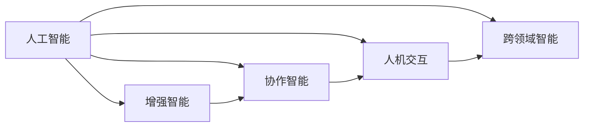

                 

## 1. 背景介绍

在数字化时代，人工智能（AI）正迅速改变各行各业，而人类与AI的协作将成为未来发展的重要趋势。本文将探讨这一趋势，分析其背后的原理和联系，并预测其对社会的深远影响和潜在机遇。

## 2. 核心概念与联系

### 2.1 核心概念概述

为了理解人类与AI协作的趋势，我们需要先掌握几个核心概念：

- **人工智能（AI）**：通过算法、数据和计算，使机器模拟人类智能的技术。
- **增强智能（Augmented Intelligence）**：通过将AI技术整合到人类工作中，提高人类工作效率和决策能力的概念。
- **协作智能（Collaborative Intelligence）**：指AI与人类的相互配合，共同解决复杂问题。
- **人机交互（Human-Computer Interaction, HCI）**：研究人类如何与计算机交互，提升用户体验的技术。
- **跨领域智能（Cross-Domain Intelligence）**：AI在多个领域（如医疗、金融、教育等）的交叉应用。

### 2.2 核心概念原理和架构的 Mermaid 流程图



这个图展示了AI技术如何通过增强智能、协作智能、人机交互和跨领域智能，实现其对人类潜能的提升。

## 3. 核心算法原理 & 具体操作步骤

### 3.1 算法原理概述

基于增强智能和协作智能，AI可以大幅提升人类工作的效率和质量。其原理主要包括以下几个方面：

1. **数据处理和分析**：AI可以处理大量复杂的数据，从中提取有价值的信息，辅助人类做出更准确的决策。
2. **任务自动化**：AI可以执行重复性高、风险大的任务，让人类专注于更具创造性的工作。
3. **实时反馈和优化**：AI可以提供实时的反馈和优化建议，帮助人类及时调整和改进工作流程。

### 3.2 算法步骤详解

人类与AI协作的过程大致可以分为以下步骤：

1. **需求识别**：识别具体任务和目标，确定需要AI协助的环节。
2. **数据准备**：收集和整理数据，确保数据质量和完整性。
3. **模型选择和训练**：选择合适的AI模型，根据数据进行训练和调优。
4. **集成部署**：将训练好的AI模型集成到实际应用中，确保与现有系统的兼容。
5. **监测和迭代**：持续监测AI的表现，根据反馈进行迭代优化。

### 3.3 算法优缺点

增强智能和协作智能的优势在于其可以大幅提升工作效率和质量，减少错误和失误。缺点主要体现在以下几个方面：

1. **技术依赖性**：依赖于高质量的数据和算法，数据偏差可能导致结果偏差。
2. **成本投入**：初期开发和部署AI系统需要较大的资金和技术投入。
3. **隐私和安全**：AI处理敏感数据时，存在隐私泄露和数据安全风险。
4. **人机协作难度**：需要设计良好的人机交互界面，确保用户友好。

### 3.4 算法应用领域

人类与AI协作技术已广泛应用于多个领域，例如：

- **医疗**：AI辅助诊断、治疗方案推荐、患者监护等。
- **金融**：风险评估、投资策略优化、客户服务自动化等。
- **制造**：智能工厂、质量控制、供应链优化等。
- **教育**：个性化学习、自动评分、智能辅导等。
- **零售**：推荐系统、库存管理、客户服务自动化等。

## 4. 数学模型和公式 & 详细讲解 & 举例说明

### 4.1 数学模型构建

基于增强智能和协作智能的模型构建主要包括以下步骤：

1. **需求建模**：定义问题和目标，确定数据和算法的需求。
2. **数据预处理**：数据清洗、特征提取、数据增强等。
3. **模型选择**：选择合适的机器学习算法（如回归、分类、聚类等）。
4. **模型训练和调优**：使用数据训练模型，调整超参数和优化算法。
5. **模型评估和部署**：评估模型性能，部署到实际应用中。

### 4.2 公式推导过程

以一个简单的分类问题为例，假设输入特征为 $x_1, x_2, ..., x_n$，输出为 $y$。使用逻辑回归模型，公式如下：

$$
y = \sigma(\theta_0 + \sum_{i=1}^{n} \theta_i x_i)
$$

其中，$\sigma$ 为sigmoid函数，$\theta$ 为模型参数。

### 4.3 案例分析与讲解

假设某家医院希望使用AI辅助诊断乳腺癌。首先，收集大量患者的乳腺影像和诊断结果作为数据集。然后，选择合适的分类模型（如随机森林、支持向量机等），使用数据训练模型，并对模型进行调优。最后，部署模型到医院的诊断系统中，实时辅助医生诊断。

## 5. 项目实践：代码实例和详细解释说明

### 5.1 开发环境搭建

为了进行项目实践，需要搭建一个包含AI库和工具的环境。以下是一个示例配置：

1. **Python**：选择Python作为开发语言，因其生态丰富，易于上手。
2. **深度学习框架**：使用TensorFlow或PyTorch等深度学习框架，支持各种AI模型。
3. **数据处理工具**：使用Pandas、NumPy等库，处理和清洗数据。
4. **可视化工具**：使用Matplotlib、Seaborn等库，可视化模型和数据。

### 5.2 源代码详细实现

以一个简单的分类模型为例，以下是使用TensorFlow构建和训练模型的示例代码：

```python
import tensorflow as tf
from sklearn.datasets import load_iris
from sklearn.model_selection import train_test_split

# 加载鸢尾花数据集
iris = load_iris()
X = iris.data
y = iris.target

# 分割训练集和测试集
X_train, X_test, y_train, y_test = train_test_split(X, y, test_size=0.3, random_state=42)

# 定义模型
model = tf.keras.Sequential([
    tf.keras.layers.Dense(32, activation='relu', input_shape=(4,)),
    tf.keras.layers.Dense(3, activation='softmax')
])

# 编译模型
model.compile(optimizer='adam', loss='sparse_categorical_crossentropy', metrics=['accuracy'])

# 训练模型
model.fit(X_train, y_train, epochs=10, batch_size=32)

# 评估模型
test_loss, test_acc = model.evaluate(X_test, y_test)
print('Test accuracy:', test_acc)
```

### 5.3 代码解读与分析

这段代码首先加载鸢尾花数据集，然后分割成训练集和测试集。定义了一个简单的神经网络模型，包含一个全连接层和一个输出层，使用ReLU激活函数。接着，编译模型并使用Adam优化器和交叉熵损失函数训练模型。最后，在测试集上评估模型的准确率。

## 6. 实际应用场景

### 6.1 医疗诊断

AI在医疗领域的应用，可以通过增强智能和协作智能，大幅提升诊断效率和准确性。例如，AI可以通过图像识别技术，辅助医生识别肿瘤、心脏病等疾病，提高诊断速度和准确性。

### 6.2 金融投资

金融领域中，AI可以用于风险评估、投资策略优化和客户服务自动化。例如，AI可以通过分析市场数据，预测股票价格走势，辅助投资决策。

### 6.3 制造业

AI在制造业中的应用，可以优化生产流程、提高产品质量和生产效率。例如，AI可以通过预测性维护，减少设备故障率，降低维护成本。

### 6.4 教育培训

AI在教育领域的应用，可以个性化学习、自动评分和智能辅导。例如，AI可以通过分析学生的学习数据，提供个性化的学习方案，提高学习效率和成绩。

### 6.5 智能家居

AI在智能家居中的应用，可以提升生活便利性和舒适度。例如，AI可以通过语音识别和自然语言处理，实现智能控制灯光、温度、音乐等。

## 7. 工具和资源推荐

### 7.1 学习资源推荐

为了学习增强智能和协作智能，推荐以下资源：

1. **《人工智能基础》**：斯坦福大学CS231n课程，系统介绍了AI的基本概念和算法。
2. **《深度学习》**：Ian Goodfellow等人的经典教材，深入讲解了深度学习的基本原理和应用。
3. **Coursera和edX**：提供大量AI相关的课程，涵盖从入门到高级的各种内容。
4. **GitHub和Kaggle**：丰富的开源项目和竞赛平台，提供大量实战练习机会。

### 7.2 开发工具推荐

以下是一些常用的AI开发工具：

1. **TensorFlow**：Google开源的深度学习框架，支持分布式计算和GPU加速。
2. **PyTorch**：Facebook开源的深度学习框架，易于上手，支持动态图和静态图。
3. **Keras**：高层API，可以简化模型构建和训练过程。
4. **Jupyter Notebook**：交互式开发环境，方便编写和调试代码。
5. **Anaconda**：Python发行版，支持科学计算和数据处理。

### 7.3 相关论文推荐

以下是一些关于增强智能和协作智能的重要论文：

1. **《Deep Learning》**：Ian Goodfellow等人的经典教材，详细介绍了深度学习的基本概念和算法。
2. **《Collaborative Filtering for Recommender Systems》**：使用协同过滤算法推荐系统，解决了信息过载问题。
3. **《Augmented Intelligence in Healthcare》**：探讨了AI在医疗领域的增强智能应用。
4. **《Human-AI Collaboration: Trends, Challenges, and Opportunities》**：讨论了人机协作的未来发展趋势和挑战。

## 8. 总结：未来发展趋势与挑战

### 8.1 研究成果总结

增强智能和协作智能在多个领域取得了显著成果，显著提高了工作效率和决策质量。但技术依赖性、成本投入、隐私安全和人机协作难度等挑战仍然存在。

### 8.2 未来发展趋势

未来，增强智能和协作智能将更加普及，并应用于更多的领域。其发展趋势主要体现在以下几个方面：

1. **技术进步**：AI算法和模型将不断进步，提升计算效率和精度。
2. **跨领域应用**：AI将在更多领域（如医疗、金融、教育等）得到应用，提升各行业的智能化水平。
3. **人机协作**：人机交互界面将更加友好，提升用户体验和系统可用性。
4. **伦理和隐私**：随着AI应用范围的扩大，伦理和隐私问题将更加受到重视。

### 8.3 面临的挑战

尽管增强智能和协作智能带来了许多机遇，但仍面临一些挑战：

1. **技术依赖性**：对高质量数据和算法的依赖，可能导致结果偏差。
2. **成本投入**：初期开发和部署AI系统需要较大的资金和技术投入。
3. **隐私和安全**：AI处理敏感数据时，存在隐私泄露和数据安全风险。
4. **人机协作难度**：需要设计良好的人机交互界面，确保用户友好。

### 8.4 研究展望

未来，需要进一步研究增强智能和协作智能的实现机制和技术路径，同时解决面临的挑战。具体研究方向包括：

1. **跨领域智能**：研究AI在多个领域的应用，提升各行业的智能化水平。
2. **伦理和隐私**：研究AI应用的伦理和隐私问题，确保技术应用符合人类价值观。
3. **人机协作**：研究人机协作的实现机制，提升用户体验和系统可用性。
4. **技术进步**：研究AI算法和模型的进步，提升计算效率和精度。

## 9. 附录：常见问题与解答

**Q1：人类与AI协作是否适用于所有领域？**

A: 人类与AI协作适用于大多数领域，但在某些领域（如法律、伦理等）需要谨慎应用。

**Q2：如何选择合适的AI模型和算法？**

A: 选择AI模型和算法需要考虑数据特点、任务需求和计算资源等因素。可以使用交叉验证等方法，评估不同模型的性能。

**Q3：AI模型部署时需要注意哪些问题？**

A: AI模型部署时需要注意数据安全和隐私保护，确保模型透明和可解释，避免恶意使用。

**Q4：如何提高AI系统的鲁棒性和泛化能力？**

A: 可以通过数据增强、对抗训练和模型集成等方法，提高AI系统的鲁棒性和泛化能力。

**Q5：未来AI技术将如何影响人类社会？**

A: AI技术将大幅提升工作效率和决策质量，推动社会进步。但也需注意其伦理和隐私问题，确保技术应用符合人类价值观。

作者：禅与计算机程序设计艺术 / Zen and the Art of Computer Programming

