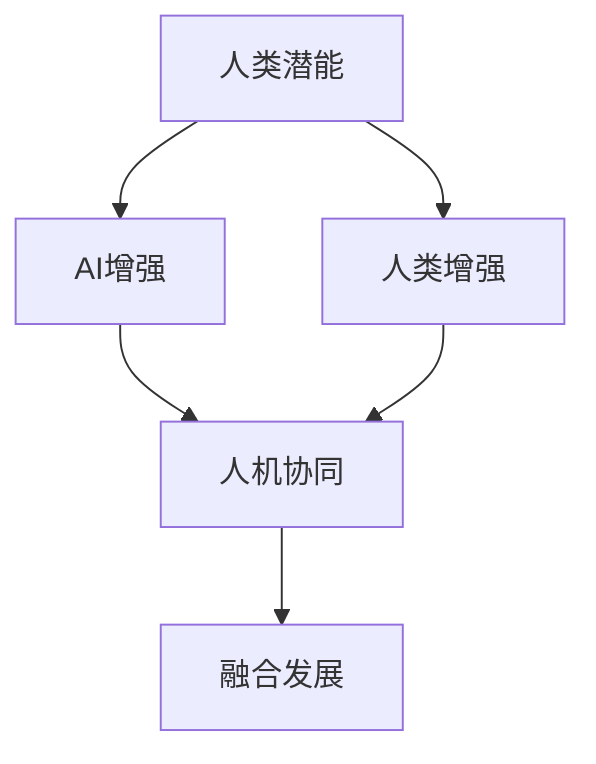

                 

## 1. 背景介绍

### 1.1 问题由来

人工智能（AI）技术自1956年问世以来，在过去几十年里取得了翻天覆地的进步。从最早的逻辑推理、专家系统到后来的机器学习、深度学习，再到当前的智能决策、自主学习等，AI已经从单一的任务解决工具演变成了复杂系统的组成部分。如今，AI技术已经成为驱动经济、社会和科技发展的关键力量。

然而，随着AI技术的迅速发展，也引发了一些新的挑战和问题。一方面，AI在处理大数据、复杂任务、自适应学习等方面的能力日益增强，极大地提升了人类生活和工作的效率。另一方面，AI技术的强大也带来了一些伦理、隐私、安全等方面的担忧。例如，AI的自动化可能导致大规模失业，AI的偏见可能加剧社会不平等，AI的安全漏洞可能导致严重的安全事故等。

在这样的背景下，如何充分利用AI技术，同时避免其负面影响，成为当前亟需解决的问题。人类-AI协作的融合发展，便是一种有效的解决方案。通过结合人类的创造性、推理能力和AI的计算、数据处理能力，可以增强人类的潜能，拓展AI的能力，实现更高效、更安全的协作方式。

### 1.2 问题核心关键点

人类-AI协作的核心在于将AI技术与人类的知识、情感、决策等能力相结合，实现协作增强的效果。其关键点包括：

- **人类潜能的增强**：AI可以处理大量数据、优化复杂系统、提高工作效率，帮助人类在科学研究、医疗诊断、金融分析等高强度任务中发挥更大的作用。
- **AI能力的提升**：AI通过与人类协作，能够更好地理解和利用人类知识，提升其自学习、自主决策的能力，从而更好地应对未知问题。
- **系统效能的提升**：AI与人类的协作，可以实现更高的系统效能和鲁棒性，例如在医疗诊断中，AI可以辅助医生进行更准确的诊断，提高诊断效率和准确性。

这些关键点共同构成了人类-AI协作的基础，并通过不断的技术创新和应用实践，逐渐形成了一个崭新的发展趋势。

### 1.3 问题研究意义

研究人类-AI协作的融合发展，具有重要的理论和实践意义：

1. **提高工作效率**：AI可以处理和分析海量数据，提高工作效率和决策质量，特别是在数据分析、医疗诊断、金融分析等领域。
2. **改善人机交互**：AI能够理解人类语言和情感，提高人机交互的自然性和流畅性，提升用户体验。
3. **促进创新发展**：AI技术可以支持人类创新思维，帮助发现新知识、新技术，推动科学和社会进步。
4. **增强社会福祉**：通过AI与人类协作，可以改善医疗服务、教育、交通等社会福祉领域，提升社会生活质量。
5. **应对伦理挑战**：通过合理设计AI系统的伦理框架，可以更好地应对AI技术的伦理问题，如数据隐私、决策透明等。

研究人类-AI协作，不仅有助于推动AI技术的广泛应用，还能帮助人类更好地应对AI带来的挑战和问题，促进人机协同的可持续发展。

## 2. 核心概念与联系

### 2.1 核心概念概述

人类-AI协作的核心概念包括：

- **AI增强**：通过AI技术，增强人类在处理复杂任务、分析数据、优化系统等方面的能力。
- **人类增强**：通过人类的知识和情感，提升AI的自学习、自主决策能力，使其能够更好地理解人类需求和行为。
- **人机协同**：AI与人类在各自优势领域协作，实现系统效能的提升。
- **融合发展**：AI与人类在技术和应用层面进行深度融合，共同推动社会和科技的进步。

这些核心概念共同构成了人类-AI协作的基础，并通过以下联系和协同，形成了一个完整的融合发展框架：

1. **技术融合**：AI技术（如机器学习、深度学习、自然语言处理等）与人类的知识（如专业知识、经验、直觉等）相结合，实现技术和知识的双向增强。
2. **应用融合**：AI与人类在实际应用场景中协同工作，提升系统效能和用户体验，例如在医疗诊断中，AI辅助医生进行诊断和治疗。
3. **伦理融合**：AI与人类在伦理道德层面进行协作，共同制定合理的伦理框架，避免AI技术的负面影响。

这些联系和协同，推动了人类-AI协作的深度融合，使其在多个领域产生了显著的实际效果。

### 2.2 核心概念原理和架构的 Mermaid 流程图



这个流程图展示了人类-AI协作的核心概念及其联系。人类潜能通过AI增强得到提升，同时AI能力也通过人类增强得到提升，两者通过人机协同实现系统效能的增强，最终形成融合发展的成果。

## 3. 核心算法原理 & 具体操作步骤

### 3.1 算法原理概述

人类-AI协作的核心算法原理基于人机协同的增强，即将AI技术与人类知识、情感等能力相结合，实现系统效能的提升。其核心算法包括：

- **数据增强**：通过数据扩充、数据清洗等技术，提高AI系统的数据质量，增强其泛化能力。
- **知识融合**：将人类的专业知识和经验融入AI系统，提升AI的决策质量和自学习能力。
- **情感识别**：通过AI技术理解人类的情感和需求，提高人机交互的自然性和高效性。
- **协同决策**：在决策过程中，AI与人类协同工作，利用各自的优势，提升决策的准确性和效率。

这些核心算法原理，通过不断的技术创新和应用实践，形成了当前人类-AI协作的主要技术路径。

### 3.2 算法步骤详解

人类-AI协作的具体操作步骤包括以下几个关键步骤：

**Step 1: 数据收集与预处理**
- 收集与任务相关的数据，并进行清洗和标注。
- 对数据进行标准化和归一化处理，提高数据质量。
- 使用数据增强技术，扩充训练数据集，提高模型的泛化能力。

**Step 2: 模型设计与训练**
- 选择合适的AI模型（如深度学习模型、决策树模型等）。
- 设计知识融合策略，将人类知识融入模型中。
- 使用协同决策算法，提升模型的决策质量。
- 在数据集上训练模型，优化模型参数。

**Step 3: 人机交互与反馈**
- 将训练好的模型应用于实际任务中，进行人机交互。
- 收集用户反馈，进行模型优化和调整。
- 根据反馈不断调整AI与人类协作的方式，提升系统效能。

**Step 4: 系统部署与评估**
- 将优化后的模型部署到实际应用系统中。
- 在系统运行过程中，持续监控和评估系统性能。
- 根据评估结果进行进一步优化，提升系统效能和用户体验。

### 3.3 算法优缺点

人类-AI协作的算法具有以下优点：

1. **高效性**：AI技术可以处理大量数据和复杂任务，提高工作效率和决策质量。
2. **灵活性**：通过知识融合和情感识别，AI能够更好地理解人类需求和行为，提升人机交互的自然性和高效性。
3. **自适应性**：协同决策算法使AI能够不断学习和适应新的环境和任务，提升系统的适应性和鲁棒性。

同时，该算法也存在一些缺点：

1. **数据依赖**：AI系统需要大量高质量的数据进行训练，数据质量差可能导致模型性能下降。
2. **知识融入难度**：将人类知识融入AI模型需要专业知识，对于复杂的任务可能需要较长时间和资源。
3. **安全与隐私问题**：人机协同过程中涉及大量个人数据，需要严格保护数据隐私和系统安全。
4. **技术复杂性**：人类-AI协作技术复杂，需要跨领域的专业知识，可能面临技术实现上的挑战。

尽管存在这些缺点，但通过合理的技术设计和应用实践，人类-AI协作仍然具有巨大的应用前景和潜在的优势。

### 3.4 算法应用领域

人类-AI协作的应用领域非常广泛，涵盖了多个行业和领域，包括但不限于：

- **医疗诊断**：AI辅助医生进行诊断和治疗，提升诊断准确性和治疗效果。
- **金融分析**：AI帮助分析师进行数据分析和决策，提高投资回报率和风险控制能力。
- **智能制造**：AI与人类协同工作，提升生产效率和产品质量，优化生产流程。
- **教育培训**：AI辅助教师进行个性化教学，提升学生学习效果和教育质量。
- **智能交通**：AI与人类协同管理交通系统，提高交通效率和安全性。
- **智能客服**：AI辅助客服进行智能问答，提升客户服务体验和满意度。

这些应用领域展示了人类-AI协作的广泛应用和巨大潜力，未来将进一步拓展到更多领域，推动社会和科技的进步。

## 4. 数学模型和公式 & 详细讲解 & 举例说明

### 4.1 数学模型构建

人类-AI协作的数学模型构建，主要基于以下三个方面的考虑：

1. **数据增强模型**：通过数据扩充、数据清洗等技术，提高数据质量，增强模型的泛化能力。
2. **知识融合模型**：将人类知识融入模型中，提升模型的决策质量和自学习能力。
3. **协同决策模型**：通过协同决策算法，提升模型的决策质量和效率。

### 4.2 公式推导过程

#### 4.2.1 数据增强模型

数据增强是提高模型泛化能力的关键技术之一。假设我们有原始数据集 $\{(x_i,y_i)\}_{i=1}^N$，其中 $x_i$ 为输入特征，$y_i$ 为标签。数据增强的目标是生成更多样化的数据，增强模型的泛化能力。常用的数据增强方法包括：

- 数据扩充：通过对原始数据进行旋转、缩放、裁剪等变换，生成新的数据样本。
- 数据扩充后的数据集为 $\{(x_i',y_i')\}_{i=1}^M$，其中 $M>N$。

数据增强模型的优化目标为：

$$
\min_{\theta} \frac{1}{M}\sum_{i=1}^M \ell(M_{\theta}(x_i'),y_i')
$$

其中 $\theta$ 为模型的参数，$\ell$ 为损失函数。

#### 4.2.2 知识融合模型

知识融合是将人类知识融入AI系统的重要手段。假设我们有人类专家的知识库 $K$，知识库中的每个知识 $k$ 可以表示为 $k=(k_1,k_2,\dots,k_n)$，其中 $k_1$ 为知识类型，$k_2,\dots,k_n$ 为知识的具体内容。知识融合的目标是利用知识库中的知识，提升模型的决策质量和自学习能力。

知识融合模型的优化目标为：

$$
\min_{\theta} \frac{1}{N}\sum_{i=1}^N \ell(M_{\theta}(x_i),y_i)+\lambda R(\theta)
$$

其中 $R(\theta)$ 为知识融合的正则项，$\lambda$ 为正则项的权重。正则项 $R(\theta)$ 的计算公式为：

$$
R(\theta) = \sum_{k \in K} w_k \max_{i} |M_{\theta}(x_i) - \hat{y}_i^k|
$$

其中 $\hat{y}_i^k$ 为人类专家对输入 $x_i$ 的预测结果，$w_k$ 为知识 $k$ 的权重。

#### 4.2.3 协同决策模型

协同决策是提升系统决策质量和效率的重要手段。假设我们有 $n$ 个决策者 $D_1,\dots,D_n$，每个决策者可以表示为 $D_j=(d_j,p_j)$，其中 $d_j$ 为决策者 $D_j$ 的决策结果，$p_j$ 为决策者 $D_j$ 的决策概率。协同决策的目标是利用各个决策者的优势，提升系统决策的准确性和效率。

协同决策模型的优化目标为：

$$
\min_{d_1,\dots,d_n} \sum_{i=1}^N \ell(d_i,y_i)
$$

其中 $\ell$ 为损失函数。

### 4.3 案例分析与讲解

#### 4.3.1 医疗诊断中的数据增强

在医疗诊断中，数据增强技术可以大大提升模型的泛化能力。例如，对于肺部X光片诊断任务，可以通过旋转、缩放等变换生成更多的样本。这些变换后的样本可以更好地覆盖不同角度和尺度的疾病特征，提高模型的泛化能力。

#### 4.3.2 金融分析中的知识融合

在金融分析中，知识融合技术可以提升模型的决策质量和自学习能力。例如，金融分析师可以提供关于特定股票的知识，包括历史价格、市场趋势、公司基本面等信息。这些知识可以融入AI模型中，提升模型的预测准确性和自学习能力。

#### 4.3.3 智能制造中的协同决策

在智能制造中，协同决策技术可以提升生产效率和产品质量。例如，在汽车制造过程中，工程师可以与AI系统协同工作，利用各自的优势进行决策。工程师可以提供关于生产流程、设备状态等专业知识，AI系统可以处理大量的数据，优化生产流程和设备调整，提高生产效率和产品质量。

## 5. 项目实践：代码实例和详细解释说明

### 5.1 开发环境搭建

在进行人类-AI协作的实践前，我们需要准备好开发环境。以下是使用Python进行TensorFlow开发的环境配置流程：

1. 安装Anaconda：从官网下载并安装Anaconda，用于创建独立的Python环境。

2. 创建并激活虚拟环境：
```bash
conda create -n ai-env python=3.8 
conda activate ai-env
```

3. 安装TensorFlow：根据CUDA版本，从官网获取对应的安装命令。例如：
```bash
conda install tensorflow -c pytorch -c conda-forge
```

4. 安装Keras：
```bash
pip install keras
```

5. 安装各类工具包：
```bash
pip install numpy pandas scikit-learn matplotlib tqdm jupyter notebook ipython
```

完成上述步骤后，即可在`ai-env`环境中开始实践。

### 5.2 源代码详细实现

这里我们以金融分析中的协同决策为例，给出使用TensorFlow和Keras进行协同决策模型开发的PyTorch代码实现。

首先，定义协同决策模型的输入和输出：

```python
from keras.layers import Input, Dense, Dropout, LSTM
from keras.models import Model

# 定义输入层
input_1 = Input(shape=(features_dim,), name='input_1')
input_2 = Input(shape=(features_dim,), name='input_2')

# 定义决策者的决策函数
def decision_function(input):
    x = Dense(64, activation='relu')(input)
    x = Dropout(0.5)(x)
    x = Dense(1, activation='sigmoid')(x)
    return x

# 定义协同决策模型
output = decision_function(input_1) + decision_function(input_2)
model = Model(inputs=[input_1, input_2], outputs=output)
```

然后，定义损失函数和优化器：

```python
from keras.losses import binary_crossentropy
from keras.optimizers import Adam

# 定义损失函数
loss = binary_crossentropy

# 定义优化器
optimizer = Adam(lr=0.001)
```

接着，定义训练和评估函数：

```python
from keras.utils import to_categorical

# 定义训练函数
def train_model(model, train_data, train_labels, epochs=10, batch_size=32):
    model.compile(optimizer=optimizer, loss=loss, metrics=['accuracy'])
    model.fit(train_data, train_labels, epochs=epochs, batch_size=batch_size, validation_split=0.2)

# 定义评估函数
def evaluate_model(model, test_data, test_labels):
    model.evaluate(test_data, test_labels)
```

最后，启动训练流程并在测试集上评估：

```python
# 准备训练数据和标签
train_data = np.random.rand(100, features_dim)
train_labels = np.random.randint(2, size=(100, 1))
test_data = np.random.rand(100, features_dim)
test_labels = np.random.randint(2, size=(100, 1))

# 训练模型
train_model(model, train_data, train_labels)

# 评估模型
evaluate_model(model, test_data, test_labels)
```

以上就是使用TensorFlow和Keras进行协同决策模型开发的完整代码实现。可以看到，Keras的简洁语法和高级API使得模型开发变得相对简单，同时TensorFlow提供的高效计算能力，也大大提高了训练和推理的效率。

### 5.3 代码解读与分析

让我们再详细解读一下关键代码的实现细节：

**协同决策模型类**：
- `Input`层：用于定义输入层，支持多输入。
- `Dense`层：用于定义全连接层，可以设置激活函数。
- `Dropout`层：用于防止过拟合，随机丢弃一部分神经元。
- `Model`类：用于组合模型，定义模型的输入和输出。

**训练函数**：
- `compile`方法：用于配置模型参数，包括优化器、损失函数等。
- `fit`方法：用于训练模型，设置训练轮数和批次大小。
- `validation_split`参数：用于在训练集上进行数据拆分，设置验证集比例。

**评估函数**：
- `evaluate`方法：用于评估模型，计算模型在测试集上的损失和精度。

**训练流程**：
- 定义模型输入层和决策函数。
- 定义协同决策模型，将两个决策器的输出相加。
- 定义损失函数和优化器。
- 在训练集上训练模型，设置训练轮数和批次大小。
- 在验证集上评估模型，计算模型在测试集上的损失和精度。

可以看到，TensorFlow和Keras的简洁语法和高级API使得协同决策模型的代码实现变得相对简单，开发者可以将更多精力放在模型设计和优化上。

当然，工业级的系统实现还需考虑更多因素，如模型的保存和部署、超参数的自动搜索、更灵活的决策器等。但核心的协同决策范式基本与此类似。

## 6. 实际应用场景

### 6.1 智能客服系统

基于人类-AI协作的智能客服系统，可以广泛应用于客户服务领域。传统客服往往需要配备大量人力，高峰期响应缓慢，且一致性和专业性难以保证。而使用协同决策模型，可以7x24小时不间断服务，快速响应客户咨询，用自然流畅的语言解答各类常见问题。

在技术实现上，可以收集企业内部的历史客服对话记录，将问题和最佳答复构建成监督数据，在此基础上对协同决策模型进行训练。协同决策模型能够自动理解用户意图，匹配最合适的答复模板进行回复。对于客户提出的新问题，还可以接入检索系统实时搜索相关内容，动态组织生成回答。如此构建的智能客服系统，能大幅提升客户咨询体验和问题解决效率。

### 6.2 金融舆情监测

金融机构需要实时监测市场舆论动向，以便及时应对负面信息传播，规避金融风险。传统的人工监测方式成本高、效率低，难以应对网络时代海量信息爆发的挑战。基于协同决策模型的文本分类和情感分析技术，为金融舆情监测提供了新的解决方案。

具体而言，可以收集金融领域相关的新闻、报道、评论等文本数据，并对其进行主题标注和情感标注。在此基础上对协同决策模型进行微调，使其能够自动判断文本属于何种主题，情感倾向是正面、中性还是负面。将协同决策模型应用到实时抓取的网络文本数据，就能够自动监测不同主题下的情感变化趋势，一旦发现负面信息激增等异常情况，系统便会自动预警，帮助金融机构快速应对潜在风险。

### 6.3 个性化推荐系统

当前的推荐系统往往只依赖用户的历史行为数据进行物品推荐，无法深入理解用户的真实兴趣偏好。基于协同决策模型的个性化推荐系统，可以更好地挖掘用户行为背后的语义信息，从而提供更精准、多样的推荐内容。

在实践中，可以收集用户浏览、点击、评论、分享等行为数据，提取和用户交互的物品标题、描述、标签等文本内容。将文本内容作为模型输入，用户的后续行为（如是否点击、购买等）作为监督信号，在此基础上微调协同决策模型。协同决策模型能够从文本内容中准确把握用户的兴趣点。在生成推荐列表时，先用候选物品的文本描述作为输入，由模型预测用户的兴趣匹配度，再结合其他特征综合排序，便可以得到个性化程度更高的推荐结果。

### 6.4 未来应用展望

随着协同决策模型的不断发展，基于人类-AI协作的融合发展将呈现以下几个发展趋势：

1. **模型规模持续增大**：伴随算力成本的下降和数据规模的扩张，协同决策模型的参数量还将持续增长。超大规模语言模型蕴含的丰富语言知识，有望支撑更加复杂多变的任务微调。
2. **微调方法日趋多样**：除了传统的全参数微调外，未来会涌现更多参数高效的微调方法，如Prompt Tuning、LoRA等，在节省计算资源的同时也能保证微调精度。
3. **持续学习成为常态**：随着数据分布的不断变化，协同决策模型也需要持续学习新知识以保持性能。如何在不遗忘原有知识的同时，高效吸收新样本信息，将成为重要的研究课题。
4. **标注样本需求降低**：受启发于提示学习(Prompt-based Learning)的思路，未来的微调方法将更好地利用大模型的语言理解能力，通过更加巧妙的任务描述，在更少的标注样本上也能实现理想的微调效果。
5. **多模态微调崛起**：当前的微调主要聚焦于纯文本数据，未来会进一步拓展到图像、视频、语音等多模态数据微调。多模态信息的融合，将显著提升语言模型对现实世界的理解和建模能力。
6. **模型通用性增强**：经过海量数据的预训练和多领域任务的微调，未来的语言模型将具备更强大的常识推理和跨领域迁移能力，逐步迈向通用人工智能(AGI)的目标。

以上趋势凸显了人类-AI协作的广阔前景。这些方向的探索发展，必将进一步提升系统性能和应用范围，为人类认知智能的进化带来深远影响。

## 7. 工具和资源推荐
### 7.1 学习资源推荐

为了帮助开发者系统掌握人类-AI协作的理论基础和实践技巧，这里推荐一些优质的学习资源：

1. **《人工智能：一种现代方法》**：斯坦福大学AI课程的核心教材，涵盖人工智能的基本概念和算法。
2. **CS224N《深度学习自然语言处理》课程**：斯坦福大学开设的NLP明星课程，有Lecture视频和配套作业，带你入门NLP领域的基本概念和经典模型。
3. **《深度学习》**：Ian Goodfellow等撰写的深度学习教材，系统介绍深度学习的理论和实践。
4. **《TensorFlow官方文档》**：TensorFlow的官方文档，提供详尽的API说明和实例代码。
5. **Kaggle平台**：提供丰富的数据集和竞赛任务，可以帮助开发者实践和提升AI技术。

通过对这些资源的学习实践，相信你一定能够快速掌握人类-AI协作的精髓，并用于解决实际的AI问题。
###  7.2 开发工具推荐

高效的开发离不开优秀的工具支持。以下是几款用于人类-AI协作开发的常用工具：

1. **TensorFlow**：由Google主导开发的开源深度学习框架，生产部署方便，适合大规模工程应用。
2. **PyTorch**：基于Python的开源深度学习框架，灵活动态的计算图，适合快速迭代研究。
3. **Keras**：基于TensorFlow和Theano的高级API，提供简单易用的API，适合初学者和研究人员。
4. **Jupyter Notebook**：一个交互式的网页应用程序，支持在Python环境中进行数据处理、模型训练和可视化。
5. **Kaggle平台**：提供丰富的数据集和竞赛任务，可以帮助开发者实践和提升AI技术。

合理利用这些工具，可以显著提升人类-AI协作任务的开发效率，加快创新迭代的步伐。

### 7.3 相关论文推荐

人类-AI协作的研究源于学界的持续研究。以下是几篇奠基性的相关论文，推荐阅读：

1. **DeepMind的AlphaGo**：AlphaGo的胜利标志着AI在复杂策略游戏中的突破，展示了人类与AI协作的潜力。
2. **Google的BERT模型**：BERT的提出标志着预训练大模型时代的到来，展示了人类与AI协同处理文本的能力。
3. **OpenAI的GPT系列模型**：GPT系列模型的发展展示了AI在自然语言生成和理解方面的进步，展示了人类与AI协同生成文本的能力。
4. **Facebook的C3PO模型**：C3PO模型的提出展示了AI在知识图谱构建和推理方面的进展，展示了人类与AI协同构建知识图谱的能力。
5. **Amazon的SageMaker**：SageMaker平台展示了人类与AI协同进行数据处理和模型训练的能力，展示了人类与AI协同进行模型训练的能力。

这些论文代表了大模型微调技术的发展脉络。通过学习这些前沿成果，可以帮助研究者把握学科前进方向，激发更多的创新灵感。

## 8. 总结：未来发展趋势与挑战

### 8.1 总结

本文对基于协同决策的人类-AI协作的融合发展进行了全面系统的介绍。首先阐述了人类-AI协作的背景和意义，明确了人类-AI协作在提升工作效率、改善人机交互、促进创新发展、增强社会福祉等方面的价值。其次，从原理到实践，详细讲解了协同决策的数学模型和关键步骤，给出了协同决策任务开发的完整代码实例。同时，本文还广泛探讨了协同决策在智能客服、金融舆情、个性化推荐等多个行业领域的应用前景，展示了协同决策范式的巨大潜力。此外，本文精选了协同决策技术的各类学习资源，力求为读者提供全方位的技术指引。

通过本文的系统梳理，可以看到，基于协同决策的人类-AI协作技术正在成为AI技术的核心范式，极大地拓展了AI系统的应用边界，催生了更多的落地场景。受益于协同决策技术的发展，AI系统在处理复杂任务、分析数据、优化系统等方面的能力得到了显著提升，极大地推动了社会和科技的进步。未来，伴随协同决策技术的不断进步，基于人类-AI协作的融合发展必将在更多领域产生深远影响。

### 8.2 未来发展趋势

展望未来，基于协同决策的人类-AI协作技术将呈现以下几个发展趋势：

1. **技术融合深化**：伴随AI技术的不断进步，人类-AI协作技术将更加深入，通过更高效的数据增强、知识融合和协同决策，提升系统的性能和鲁棒性。
2. **应用领域扩展**：随着技术的发展，人类-AI协作技术将拓展到更多领域，如智能制造、智能交通、智能医疗等，推动更多行业的智能化转型。
3. **伦理框架完善**：随着AI技术的广泛应用，伦理问题日益突出，人类-AI协作技术需要在伦理框架方面进行深入研究，确保系统的公平、透明和可解释性。
4. **跨领域融合**：未来，人类-AI协作技术将与大数据、物联网、区块链等技术进行深度融合，推动更多领域的智能化发展。
5. **智能生态建设**：人类-AI协作技术将与其他智能技术（如机器人、自动驾驶等）进行协同工作，构建更加智能化的生态系统。

以上趋势凸显了人类-AI协作的广阔前景。这些方向的探索发展，必将进一步提升系统性能和应用范围，为人类认知智能的进化带来深远影响。

### 8.3 面临的挑战

尽管人类-AI协作技术已经取得了显著成果，但在迈向更加智能化、普适化应用的过程中，它仍面临着诸多挑战：

1. **数据依赖问题**：协同决策模型需要大量高质量的数据进行训练，数据质量差可能导致模型性能下降。如何获取高质量的数据，并有效利用数据，是一个重要的挑战。
2. **知识融合难度**：将人类知识融入AI系统需要专业知识，对于复杂的任务可能需要较长时间和资源。如何高效地融合知识，提升模型的决策质量，是一个重要的挑战。
3. **伦理与隐私问题**：人机协同过程中涉及大量个人数据，需要严格保护数据隐私和系统安全。如何设计合理的伦理框架，确保数据隐私和安全，是一个重要的挑战。
4. **技术实现复杂**：人类-AI协作技术复杂，需要跨领域的专业知识，可能面临技术实现上的挑战。如何提高技术的可解释性和可扩展性，是一个重要的挑战。
5. **系统稳定性问题**：协同决策模型可能受到数据扰动和系统故障的影响，如何设计稳定的系统架构，提高系统的鲁棒性，是一个重要的挑战。

尽管存在这些挑战，但通过合理的技术设计和应用实践，人类-AI协作仍然具有巨大的应用前景和潜在的优势。未来需要更多研究者和实践者共同努力，不断克服这些挑战，推动人类-AI协作技术的不断进步。

### 8.4 研究展望

面向未来，人类-AI协作技术的研究需要在以下几个方面寻求新的突破：

1. **数据增强技术优化**：通过更高效的数据增强方法，提升模型的泛化能力和鲁棒性。
2. **知识融合技术改进**：通过更高效的知识融合方法，提升模型的决策质量和自学习能力。
3. **协同决策算法创新**：通过更高效的协同决策算法，提升模型的决策效率和鲁棒性。
4. **伦理与隐私保护**：设计合理的伦理框架，确保数据隐私和安全，避免伦理问题的产生。
5. **技术实现简化**：提高技术的可解释性和可扩展性，简化技术实现过程，提高系统的可操作性。
6. **系统稳定性提升**：设计稳定的系统架构，提高系统的鲁棒性和可维护性。

这些研究方向的探索，必将引领人类-AI协作技术的不断进步，推动社会和科技的进一步发展。

## 9. 附录：常见问题与解答

**Q1：人类-AI协作是否适用于所有AI应用场景？**

A: 人类-AI协作在大多数AI应用场景中都能取得显著效果，特别是在复杂任务处理、数据分析、决策优化等领域。但对于一些简单、标准化的任务，如数据清洗、批量处理等，可能不需要人类介入。

**Q2：如何选择合适的人类-AI协作技术？**

A: 选择合适的协作技术需要考虑以下几个因素：
1. **任务复杂度**：对于复杂任务，需要更高效的数据增强、知识融合和协同决策技术。
2. **数据质量**：需要大量高质量的数据进行训练，数据质量差可能导致模型性能下降。
3. **系统稳定性**：需要设计稳定的系统架构，提高系统的鲁棒性和可维护性。
4. **技术实现难度**：需要考虑技术的复杂度和实现难度，选择适合的技术实现方案。

**Q3：人类-AI协作技术如何保证数据隐私和伦理安全？**

A: 保证数据隐私和伦理安全需要从以下几个方面进行：
1. **数据匿名化**：对数据进行匿名化处理，确保数据隐私。
2. **伦理框架设计**：设计合理的伦理框架，确保系统的公平、透明和可解释性。
3. **隐私保护技术**：采用隐私保护技术，如差分隐私、联邦学习等，保护数据隐私。
4. **用户同意机制**：确保用户对数据使用知情同意，保护用户隐私权益。

**Q4：人类-AI协作技术在未来有哪些应用前景？**

A: 未来，人类-AI协作技术将在更多领域得到应用，如智能制造、智能交通、智能医疗等，推动更多行业的智能化转型。此外，随着技术的不断发展，人类-AI协作技术还将与大数据、物联网、区块链等技术进行深度融合，推动更多领域的智能化发展。

总之，人类-AI协作技术正在成为AI技术的核心范式，极大地拓展了AI系统的应用边界，催生了更多的落地场景。未来，伴随技术的不断进步，人类-AI协作技术必将在更多领域产生深远影响，推动社会和科技的进步。

---

作者：禅与计算机程序设计艺术 / Zen and the Art of Computer Programming

