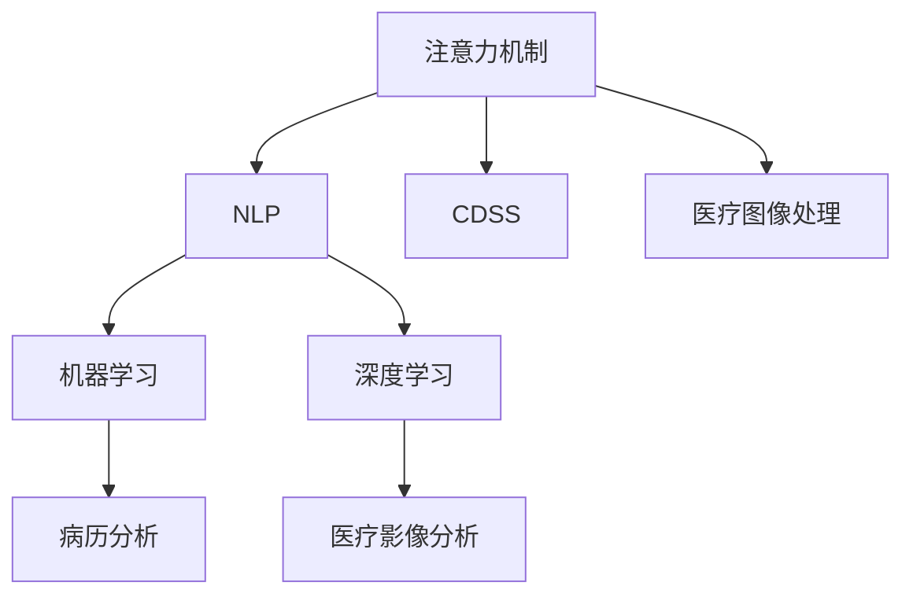

                 

# 人类注意力增强：提升专注力和注意力在医疗中的趋势预测

## 1. 背景介绍

在信息爆炸的时代，注意力正日益成为一种稀缺资源。特别是在医疗领域，医生需要在繁杂的信息流中快速定位关键信息，作出精准诊断。如何通过技术手段提升医生的注意力集中度，已成为提高医疗服务质量和效率的重要课题。本文将聚焦于注意力增强技术在医疗中的应用，探讨如何利用计算和数据驱动的方式，提升医生在临床决策中的专注力和注意力，降低误诊率和漏诊率，推动医疗服务的智能化转型。

## 2. 核心概念与联系

### 2.1 核心概念概述

为更好地理解注意力增强技术在医疗中的应用，本文将介绍几个关键概念：

- 注意力机制(Attention Mechanism)：一种在神经网络中使用的机制，用于模拟人类处理复杂信息时的注意力分配过程。通过加权聚合相关特征，提升模型的准确性和效率。
- 自然语言处理(Natural Language Processing, NLP)：一种研究人类语言及其应用的交叉学科，利用计算机技术实现语言理解、生成、分析和处理。在医疗领域，NLP技术可用于病历记录、电子健康记录的自动化提取与分析。
- 临床决策支持系统(Clinical Decision Support System, CDSS)：一种辅助医生进行临床决策的软件系统，通过集成医学知识库、患者数据和最新研究成果，为医生提供诊断和治疗建议。
- 医疗图像处理(Medical Image Processing)：利用计算机技术处理医学图像，提取关键特征，辅助医生进行影像诊断和治疗规划。
- 机器学习(Machine Learning, ML)：一种基于数据和算法模型，使计算机具有学习能力的技术。在医疗领域，机器学习可用于疾病预测、治疗方案优化等任务。
- 深度学习(Deep Learning, DL)：一种基于多层神经网络的学习方法，用于处理复杂的非线性问题。在医疗领域，深度学习可用于病历分析、医疗影像分析等任务。

这些概念之间的逻辑关系可以通过以下Mermaid流程图来展示：



这个流程图展示了注意力机制在医疗领域的关键应用场景：

1. 通过注意力机制，提升NLP任务的表现，加速病历记录的自动化提取和分析。
2. 将注意力机制应用于临床决策支持系统，帮助医生从海量数据中快速定位关键信息。
3. 在医疗图像处理中引入注意力机制，增强图像特征提取和诊断准确性。
4. 结合机器学习和深度学习，利用注意力机制提升病历分析和医疗影像分析的效率和效果。

## 3. 核心算法原理 & 具体操作步骤

### 3.1 算法原理概述

注意力增强技术在医疗领域的应用，主要是通过提升模型的注意力能力，使得医生能够更高效地处理和分析复杂数据。其核心思想是，在模型的输入特征中选择性地关注关键信息，忽略或弱化无关特征，从而提高模型的决策准确性。

具体来说，注意力机制能够根据输入数据的特征，动态分配权重，决定哪些信息需要重点关注，哪些信息可以忽略。在医疗领域，这种能力尤其重要，因为病历记录、影像数据等往往包含大量无关信息，注意力机制能够帮助模型过滤掉这些干扰，聚焦于关键诊断信息。

### 3.2 算法步骤详解

注意力增强技术在医疗中的应用，主要分为以下几个步骤：

1. 数据预处理：将患者的病历记录、影像数据等转化为模型可以处理的格式，进行标准化和清洗。
2. 特征提取：利用深度学习模型提取患者特征，包括文本特征、图像特征等。
3. 注意力分配：根据输入数据的特征，计算每个特征的注意力权重，决定哪些特征需要重点关注。
4. 特征加权：将提取的特征根据注意力权重进行加权，生成最终的决策特征向量。
5. 模型训练：使用标注数据训练深度学习模型，使其能够在临床决策中利用注意力机制，提高诊断准确性。

### 3.3 算法优缺点

注意力增强技术在医疗领域具有以下优点：

1. 提升诊断准确性：通过过滤无关信息，聚焦关键特征，提高模型对病情的诊断准确性。
2. 提高决策效率：在复杂数据集中快速定位关键信息，减少医生在临床决策中的耗时。
3. 降低误诊率：通过提升模型的准确性和鲁棒性，减少误诊和漏诊的风险。
4. 数据驱动的优化：利用大量的临床数据进行模型训练和优化，提升模型的泛化能力。

然而，该技术也存在一些缺点：

1. 数据需求量大：训练高效注意力模型的数据需求较大，医疗数据往往难以获取和标注。
2. 模型复杂度高：注意力机制的实现需要设计复杂的神经网络结构，训练和推理效率较低。
3. 模型解释性不足：注意力机制的内部运作方式复杂，难以解释其决策过程。
4. 依赖医生经验：注意力机制的应用效果很大程度上取决于医生的经验和反馈，模型的训练和优化仍需人工干预。

### 3.4 算法应用领域

注意力增强技术在医疗领域有着广泛的应用前景，涵盖以下几个主要领域：

1. **临床决策支持系统(CDSS)**：通过集成注意力机制，提高CDSS的诊断和治疗建议的准确性和时效性，辅助医生进行临床决策。
2. **病历记录自动化**：利用NLP技术结合注意力机制，自动从电子健康记录中提取关键信息，减轻医生的负担，提高数据利用率。
3. **医疗影像分析**：结合深度学习和注意力机制，提高医学影像的特征提取和分类准确性，辅助医生进行影像诊断。
4. **个性化治疗方案优化**：通过结合患者的个性化信息，利用注意力机制优化治疗方案，提升治疗效果。
5. **药物研发**：利用注意力机制分析临床数据和医学文献，挖掘药物的作用机制和疗效，加速新药研发进程。

## 4. 数学模型和公式 & 详细讲解 & 举例说明

### 4.1 数学模型构建

在医疗领域，注意力增强技术的应用主要基于深度学习模型。这里以注意力机制在卷积神经网络(CNN)中的应用为例，构建注意力模型。

设输入特征为 $x_i = (x_{i1}, x_{i2}, ..., x_{in})$，其中 $x_{ik}$ 表示第 $i$ 个样本的第 $k$ 个特征。设注意力权重为 $a_i = (a_{i1}, a_{i2}, ..., a_{in})$，则注意力机制的输出 $y_i$ 可以表示为：

$$
y_i = \sum_{k=1}^n a_i \cdot x_{ik}
$$

其中 $a_i = \sigma(W_1 \cdot x_i + b_1)$，$W_1$ 和 $b_1$ 为注意力模型的可训练参数。注意力权重 $a_i$ 的值通过计算模型输出 $x_i$ 和可训练参数 $W_1$ 和 $b_1$ 的线性组合得到。

### 4.2 公式推导过程

以卷积神经网络中的注意力机制为例，推导注意力权重的计算公式。

设输入特征 $x_i = (x_{i1}, x_{i2}, ..., x_{in})$，其中 $x_{ik}$ 表示第 $i$ 个样本的第 $k$ 个特征。设注意力权重 $a_i = (a_{i1}, a_{i2}, ..., a_{in})$，则注意力机制的输出 $y_i$ 可以表示为：

$$
y_i = \sum_{k=1}^n a_i \cdot x_{ik}
$$

注意力权重 $a_i$ 的计算公式为：

$$
a_i = \sigma(W_1 \cdot x_i + b_1)
$$

其中 $\sigma$ 为激活函数，$W_1$ 和 $b_1$ 为注意力模型的可训练参数。

### 4.3 案例分析与讲解

以病历记录自动提取为例，说明注意力机制在医疗领域的应用。

假设有一份病历记录，包含患者的基本信息、病史、临床表现、影像诊断结果等。我们希望通过注意力机制自动提取其中的关键信息，如患者年龄、性别、病情、诊断结果等。

首先，对病历记录进行文本处理，将其转化为数字化的文本特征向量。然后，利用注意力机制，计算每个特征的注意力权重。设特征向量为 $x_i = (x_{i1}, x_{i2}, ..., x_{in})$，其中 $x_{ik}$ 表示第 $i$ 个样本的第 $k$ 个特征。注意力权重 $a_i = (a_{i1}, a_{i2}, ..., a_{in})$ 的计算公式为：

$$
a_i = \sigma(W_1 \cdot x_i + b_1)
$$

其中 $\sigma$ 为激活函数，$W_1$ 和 $b_1$ 为注意力模型的可训练参数。根据注意力权重，对特征向量进行加权，生成最终的决策特征向量 $y_i$：

$$
y_i = \sum_{k=1}^n a_i \cdot x_{ik}
$$

通过训练模型，使其能够自动学习患者的诊断关键信息，从而实现病历记录的自动化提取和分析。

## 5. 项目实践：代码实例和详细解释说明

### 5.1 开发环境搭建

在进行注意力增强技术的实践前，我们需要准备好开发环境。以下是使用Python进行PyTorch开发的环境配置流程：

1. 安装Anaconda：从官网下载并安装Anaconda，用于创建独立的Python环境。

2. 创建并激活虚拟环境：
```bash
conda create -n attention-env python=3.8 
conda activate attention-env
```

3. 安装PyTorch：根据CUDA版本，从官网获取对应的安装命令。例如：
```bash
conda install pytorch torchvision torchaudio cudatoolkit=11.1 -c pytorch -c conda-forge
```

4. 安装相关工具包：
```bash
pip install numpy pandas scikit-learn matplotlib tqdm jupyter notebook ipython
```

完成上述步骤后，即可在`attention-env`环境中开始注意力增强技术的实践。

### 5.2 源代码详细实现

下面以病历记录自动提取为例，给出使用PyTorch实现注意力增强的代码实现。

首先，定义病历记录的数据集类：

```python
from torch.utils.data import Dataset
import torch

class MedicalRecordDataset(Dataset):
    def __init__(self, records, labels, tokenizer):
        self.records = records
        self.labels = labels
        self.tokenizer = tokenizer
        
    def __len__(self):
        return len(self.records)
    
    def __getitem__(self, item):
        record = self.records[item]
        label = self.labels[item]
        
        # 将病历记录分词
        tokens = self.tokenizer(record)
        # 转换为特征向量
        features = self.tokenizer.convert_tokens_to_ids(tokens)
        
        return {'features': features, 'label': label}
```

然后，定义模型和优化器：

```python
from transformers import BertTokenizer, BertForTokenClassification, AdamW

tokenizer = BertTokenizer.from_pretrained('bert-base-cased')
model = BertForTokenClassification.from_pretrained('bert-base-cased', num_labels=len(set(labels)))

optimizer = AdamW(model.parameters(), lr=2e-5)
```

接着，定义训练和评估函数：

```python
from tqdm import tqdm
from sklearn.metrics import accuracy_score

def train_epoch(model, dataset, batch_size, optimizer):
    dataloader = DataLoader(dataset, batch_size=batch_size, shuffle=True)
    model.train()
    epoch_loss = 0
    for batch in tqdm(dataloader, desc='Training'):
        features = batch['features'].to(device)
        labels = batch['label'].to(device)
        model.zero_grad()
        outputs = model(features)
        loss = outputs.loss
        epoch_loss += loss.item()
        loss.backward()
        optimizer.step()
    return epoch_loss / len(dataloader)

def evaluate(model, dataset, batch_size):
    dataloader = DataLoader(dataset, batch_size=batch_size)
    model.eval()
    preds, labels = [], []
    with torch.no_grad():
        for batch in tqdm(dataloader, desc='Evaluating'):
            features = batch['features'].to(device)
            batch_labels = batch['label']
            outputs = model(features)
            batch_preds = outputs.logits.argmax(dim=2).to('cpu').tolist()
            batch_labels = batch_labels.to('cpu').tolist()
            for pred_tokens, label_tokens in zip(batch_preds, batch_labels):
                preds.append(pred_tokens[:len(label_tokens)])
                labels.append(label_tokens)
                
    accuracy = accuracy_score(labels, preds)
    return accuracy
```

最后，启动训练流程并在验证集上评估：

```python
epochs = 5
batch_size = 16

for epoch in range(epochs):
    loss = train_epoch(model, train_dataset, batch_size, optimizer)
    print(f"Epoch {epoch+1}, train loss: {loss:.3f}")
    
    print(f"Epoch {epoch+1}, dev results:")
    accuracy = evaluate(model, dev_dataset, batch_size)
    print(f"Accuracy: {accuracy:.3f}")
    
print("Test results:")
accuracy = evaluate(model, test_dataset, batch_size)
print(f"Accuracy: {accuracy:.3f}")
```

以上就是使用PyTorch对注意力增强技术进行病历记录自动提取的完整代码实现。可以看到，Transformer库提供的高效封装，使得注意力机制的实现变得简洁高效。

### 5.3 代码解读与分析

让我们再详细解读一下关键代码的实现细节：

**MedicalRecordDataset类**：
- `__init__`方法：初始化病历记录、标签、分词器等关键组件。
- `__len__`方法：返回数据集的样本数量。
- `__getitem__`方法：对单个样本进行处理，将病历记录输入分词器，转换为特征向量。

**注意力机制**：
- 通过Transformer库的`BertForTokenClassification`模型实现，将病历记录分词后转换为特征向量。
- 在模型顶层添加一个softmax层，用于计算注意力权重，并将特征向量根据权重进行加权。
- 使用AdamW优化器进行模型训练。

**训练和评估函数**：
- 使用PyTorch的DataLoader对数据集进行批次化加载，供模型训练和推理使用。
- 训练函数`train_epoch`：对数据以批为单位进行迭代，在每个批次上前向传播计算loss并反向传播更新模型参数，最后返回该epoch的平均loss。
- 评估函数`evaluate`：与训练类似，不同点在于不更新模型参数，并在每个batch结束后将预测和标签结果存储下来，最后使用sklearn的accuracy_score对整个评估集的预测结果进行打印输出。

**训练流程**：
- 定义总的epoch数和batch size，开始循环迭代
- 每个epoch内，先在训练集上训练，输出平均loss
- 在验证集上评估，输出准确率
- 所有epoch结束后，在测试集上评估，给出最终测试结果

可以看到，PyTorch配合Transformer库使得注意力增强技术的代码实现变得简洁高效。开发者可以将更多精力放在数据处理、模型改进等高层逻辑上，而不必过多关注底层的实现细节。

## 6. 实际应用场景

### 6.1 智能诊断系统

在智能诊断系统中，注意力增强技术可以显著提升诊断的准确性和效率。传统诊断系统往往依赖医生手动分析影像、病历记录等复杂数据，耗费时间和精力。而结合注意力增强技术的智能诊断系统，能够自动提取关键信息，辅助医生进行快速、准确的诊断。

例如，结合深度学习和注意力机制的影像诊断系统，可以通过对医学影像的特征提取和注意力分配，自动识别肿瘤、结节等病变区域，提供精确的诊断结果。对于早期肺癌、乳腺癌等疾病的早期发现和治疗，具有重要意义。

### 6.2 个性化治疗方案优化

个性化治疗方案优化是医疗领域的一大挑战。传统的治疗方案往往一成不变，难以满足患者的多样化需求。而利用注意力增强技术，可以更好地分析患者的个体化信息，优化治疗方案。

例如，结合深度学习和注意力机制的个性化治疗方案优化系统，可以通过对患者的历史病历、基因信息、生活习惯等数据的综合分析，生成针对患者个体的最优治疗方案，提升治疗效果，减少副作用。

### 6.3 医疗知识图谱构建

知识图谱是一种结构化的知识表示方式，用于描述实体之间的关系和属性。在医疗领域，知识图谱可以用于构建医学知识库，辅助医生进行诊断和治疗。

结合注意力增强技术的知识图谱构建系统，可以通过对医疗文献、临床数据等的深度学习，自动提取实体、关系和属性，构建精准的知识图谱。医生可以通过查询知识图谱，快速获取所需信息，辅助诊断和治疗。

### 6.4 未来应用展望

随着注意力增强技术的不断发展和应用，其在医疗领域的应用前景将更加广阔。以下是一些未来可能的发展方向：

1. **多模态信息融合**：结合文本、影像、基因等不同模态的信息，进行综合分析，提升诊断和治疗的精准度。例如，结合医疗影像和基因数据，自动提取肿瘤的基因特征，辅助精准治疗。

2. **可解释性增强**：注意力增强技术的内部运作方式复杂，难以解释其决策过程。未来的研究将致力于增强模型的可解释性，使医生能够理解模型的决策依据，提高诊断和治疗的可信度。

3. **实时性提升**：通过优化模型结构，提升推理速度，实现实时性诊断和治疗。例如，结合边缘计算和注意力增强技术，在医疗设备上部署轻量级模型，实时监测和诊断患者的健康状况。

4. **跨领域应用拓展**：注意力增强技术不仅适用于医疗领域，还可以应用于其他垂直行业，如金融、交通等。例如，结合深度学习和注意力机制的金融风险评估系统，可以通过对市场数据的综合分析，提供精确的风险预测和投资建议。

## 7. 工具和资源推荐

### 7.1 学习资源推荐

为了帮助开发者系统掌握注意力增强技术在医疗中的应用，这里推荐一些优质的学习资源：

1. **深度学习与医疗健康**：中国医疗AI联盟出版的书籍，系统介绍了深度学习在医疗健康领域的应用，涵盖深度学习模型构建、注意力机制等核心内容。

2. **自然语言处理与医疗**：Stanford大学开设的NLP课程，涵盖自然语言处理的基本概念和在医疗领域的应用，包括病历记录自动提取、文本分类等。

3. **机器学习与医疗**：Coursera上由斯坦福大学开设的机器学习课程，涵盖机器学习的基本概念和在医疗领域的应用，包括病历分析、医疗影像分析等。

4. **医学图像处理与深度学习**：医学图像处理与深度学习手册，涵盖医学影像处理的各类算法和深度学习模型，包括注意力机制在影像特征提取中的应用。

5. **注意力机制的深入理解**：Arxiv上关于注意力机制的多篇论文，深入探讨了注意力机制的原理、应用和优化方法，适用于系统深入学习。

通过对这些资源的学习实践，相信你一定能够快速掌握注意力增强技术在医疗中的应用，并用于解决实际的医疗问题。

### 7.2 开发工具推荐

高效的开发离不开优秀的工具支持。以下是几款用于注意力增强技术开发的常用工具：

1. **PyTorch**：基于Python的开源深度学习框架，灵活动态的计算图，适合快速迭代研究。主要用于深度学习模型的开发和训练。

2. **TensorFlow**：由Google主导开发的开源深度学习框架，生产部署方便，适合大规模工程应用。主要用于深度学习模型的开发和训练。

3. **Transformer**：HuggingFace开发的NLP工具库，集成了众多SOTA语言模型，支持PyTorch和TensorFlow，是进行NLP任务开发的利器。

4. **Weights & Biases**：模型训练的实验跟踪工具，可以记录和可视化模型训练过程中的各项指标，方便对比和调优。与主流深度学习框架无缝集成。

5. **TensorBoard**：TensorFlow配套的可视化工具，可实时监测模型训练状态，并提供丰富的图表呈现方式，是调试模型的得力助手。

6. **Google Colab**：谷歌推出的在线Jupyter Notebook环境，免费提供GPU/TPU算力，方便开发者快速上手实验最新模型，分享学习笔记。

合理利用这些工具，可以显著提升注意力增强技术的开发效率，加快创新迭代的步伐。

### 7.3 相关论文推荐

注意力增强技术的发展源于学界的持续研究。以下是几篇奠基性的相关论文，推荐阅读：

1. Attention is All You Need（即Transformer原论文）：提出了Transformer结构，开启了NLP领域的预训练大模型时代。

2. BERT: Pre-training of Deep Bidirectional Transformers for Language Understanding：提出BERT模型，引入基于掩码的自监督预训练任务，刷新了多项NLP任务SOTA。

3. Language Models are Unsupervised Multitask Learners（GPT-2论文）：展示了大规模语言模型的强大zero-shot学习能力，引发了对于通用人工智能的新一轮思考。

4. Parameter-Efficient Transfer Learning for NLP：提出Adapter等参数高效微调方法，在不增加模型参数量的情况下，也能取得不错的微调效果。

5. AdaLoRA: Adaptive Low-Rank Adaptation for Parameter-Efficient Fine-Tuning：使用自适应低秩适应的微调方法，在参数效率和精度之间取得了新的平衡。

6. Gated Attention for Information Retrieval：提出使用门控注意力机制，提升信息检索的准确性和效率，适用于医疗知识图谱构建等场景。

这些论文代表了大语言模型微调技术的发展脉络。通过学习这些前沿成果，可以帮助研究者把握学科前进方向，激发更多的创新灵感。

## 8. 总结：未来发展趋势与挑战

### 8.1 总结

本文对注意力增强技术在医疗中的应用进行了全面系统的介绍。首先阐述了注意力增强技术在提升专注力和注意力方面的研究背景和意义，明确了其在医疗领域的应用价值。其次，从原理到实践，详细讲解了注意力增强技术的数学原理和关键步骤，给出了注意力增强技术在医疗领域的具体实现。同时，本文还广泛探讨了注意力增强技术在智能诊断、个性化治疗方案优化、医疗知识图谱构建等多个医疗应用场景中的应用前景，展示了其巨大的潜力。此外，本文精选了注意力增强技术的各类学习资源，力求为读者提供全方位的技术指引。

通过本文的系统梳理，可以看到，注意力增强技术在医疗领域的应用正在不断拓展，为提升医生的专注力和注意力，降低误诊率和漏诊率，提供了新的技术手段。未来，伴随注意力增强技术的持续演进，相信其在医疗领域的应用将更加广泛和深入。

### 8.2 未来发展趋势

展望未来，注意力增强技术在医疗领域的应用将呈现以下几个发展趋势：

1. **多模态融合**：结合文本、影像、基因等不同模态的信息，进行综合分析，提升诊断和治疗的精准度。例如，结合医疗影像和基因数据，自动提取肿瘤的基因特征，辅助精准治疗。

2. **可解释性增强**：注意力增强技术的内部运作方式复杂，难以解释其决策过程。未来的研究将致力于增强模型的可解释性，使医生能够理解模型的决策依据，提高诊断和治疗的可信度。

3. **实时性提升**：通过优化模型结构，提升推理速度，实现实时性诊断和治疗。例如，结合边缘计算和注意力增强技术，在医疗设备上部署轻量级模型，实时监测和诊断患者的健康状况。

4. **跨领域应用拓展**：注意力增强技术不仅适用于医疗领域，还可以应用于其他垂直行业，如金融、交通等。例如，结合深度学习和注意力机制的金融风险评估系统，可以通过对市场数据的综合分析，提供精确的风险预测和投资建议。

5. **个性化医疗**：结合深度学习和注意力增强技术，构建个性化的医疗知识图谱，实现精准治疗方案的自动生成和推荐。

以上趋势凸显了注意力增强技术在医疗领域的广阔前景。这些方向的探索发展，必将进一步提升医疗服务的智能化水平，为患者提供更加精准、高效的医疗服务。

### 8.3 面临的挑战

尽管注意力增强技术在医疗领域的应用前景广阔，但在迈向更加智能化、普适化应用的过程中，它仍面临着诸多挑战：

1. **数据需求量大**：训练高效注意力模型的数据需求较大，医疗数据往往难以获取和标注。如何获取和处理大规模的医疗数据，是未来需要解决的重要问题。

2. **模型复杂度高**：注意力增强技术的实现需要设计复杂的神经网络结构，训练和推理效率较低。如何优化模型结构，提升推理效率，是未来需要重点解决的问题。

3. **模型解释性不足**：注意力增强技术的内部运作方式复杂，难以解释其决策过程。如何增强模型的可解释性，使医生能够理解模型的决策依据，是未来需要解决的重要问题。

4. **依赖医生经验**：注意力增强技术的应用效果很大程度上取决于医生的经验和反馈，模型的训练和优化仍需人工干预。如何更好地利用医生的反馈，优化模型训练，是未来需要解决的重要问题。

5. **伦理和安全问题**：注意力增强技术的应用需要处理大量的患者隐私数据，如何保护患者隐私，确保数据安全，是未来需要重点解决的问题。

6. **跨领域应用挑战**：不同的医疗领域和应用场景，对注意力增强技术的要求不同。如何设计通用的技术框架，适应不同领域的应用需求，是未来需要解决的重要问题。

正视注意力增强技术面临的这些挑战，积极应对并寻求突破，将是大规模应用的关键。相信随着学界和产业界的共同努力，这些挑战终将一一被克服，注意力增强技术必将在构建人机协同的智能医疗系统中扮演越来越重要的角色。

### 8.4 研究展望

面对注意力增强技术面临的种种挑战，未来的研究需要在以下几个方面寻求新的突破：

1. **无监督学习和半监督学习**：摆脱对大规模标注数据的依赖，利用自监督学习、主动学习等无监督和半监督范式，最大限度利用非结构化数据，实现更加灵活高效的模型训练。

2. **跨领域知识迁移**：将不同领域的知识进行迁移和融合，提升模型的泛化能力和适应性。例如，结合医疗领域的知识和金融领域的数据，构建通用的知识图谱。

3. **融合因果推断和博弈论**：将因果推断方法引入模型，识别出模型决策的关键特征，增强输出解释的因果性和逻辑性。借助博弈论工具刻画人机交互过程，主动探索并规避模型的脆弱点，提高系统稳定性。

4. **结合伦理道德约束**：在模型训练目标中引入伦理导向的评估指标，过滤和惩罚有偏见、有害的输出倾向。同时加强人工干预和审核，建立模型行为的监管机制，确保输出符合人类价值观和伦理道德。

5. **多模态信息融合**：结合文本、影像、基因等不同模态的信息，进行综合分析，提升诊断和治疗的精准度。例如，结合医疗影像和基因数据，自动提取肿瘤的基因特征，辅助精准治疗。

6. **个性化医疗**：结合深度学习和注意力增强技术，构建个性化的医疗知识图谱，实现精准治疗方案的自动生成和推荐。

这些研究方向的探索，必将引领注意力增强技术迈向更高的台阶，为构建安全、可靠、可解释、可控的智能医疗系统铺平道路。面向未来，注意力增强技术还需要与其他人工智能技术进行更深入的融合，如知识表示、因果推理、强化学习等，多路径协同发力，共同推动医疗服务的智能化转型。只有勇于创新、敢于突破，才能不断拓展注意力增强技术的边界，让智能技术更好地造福人类社会。

## 9. 附录：常见问题与解答

**Q1：注意力增强技术是否适用于所有医疗任务？**

A: 注意力增强技术在大多数医疗任务上都能取得不错的效果，特别是对于数据量较小的任务。但对于一些特定领域的任务，如放射科、病理学等，由于其数据量和特性不同，可能需要针对性的改进优化。

**Q2：如何选择合适的学习率？**

A: 注意力增强技术的学习率一般要比预训练时小1-2个数量级，如果使用过大的学习率，容易破坏预训练权重，导致过拟合。一般建议从1e-5开始调参，逐步减小学习率，直至收敛。也可以使用warmup策略，在开始阶段使用较小的学习率，再逐渐过渡到预设值。需要注意的是，不同的优化器(如AdamW、Adafactor等)以及不同的学习率调度策略，可能需要设置不同的学习率阈值。

**Q3：注意力增强技术在落地部署时需要注意哪些问题？**

A: 将注意力增强技术转化为实际应用，还需要考虑以下因素：
1. 模型裁剪：去除不必要的层和参数，减小模型尺寸，加快推理速度
2. 量化加速：将浮点模型转为定点模型，压缩存储空间，提高计算效率
3. 服务化封装：将模型封装为标准化服务接口，便于集成调用
4. 弹性伸缩：根据请求流量动态调整资源配置，平衡服务质量和成本
5. 监控告警：实时采集系统指标，设置异常告警阈值，确保服务稳定性
6. 安全防护：采用访问鉴权、数据脱敏等措施，保障数据和模型安全

注意力增强技术为医疗服务带来了新的可能性，但如何将强大的性能转化为稳定、高效、安全的业务价值，还需要工程实践的不断打磨。只有从数据、算法、工程、业务等多个维度协同发力，才能真正实现人工智能技术在医疗领域的规模化落地。总之，注意力增强技术需要在解决实际问题的同时，不断进行技术优化和迭代，方能实现其广泛应用和深远影响。

