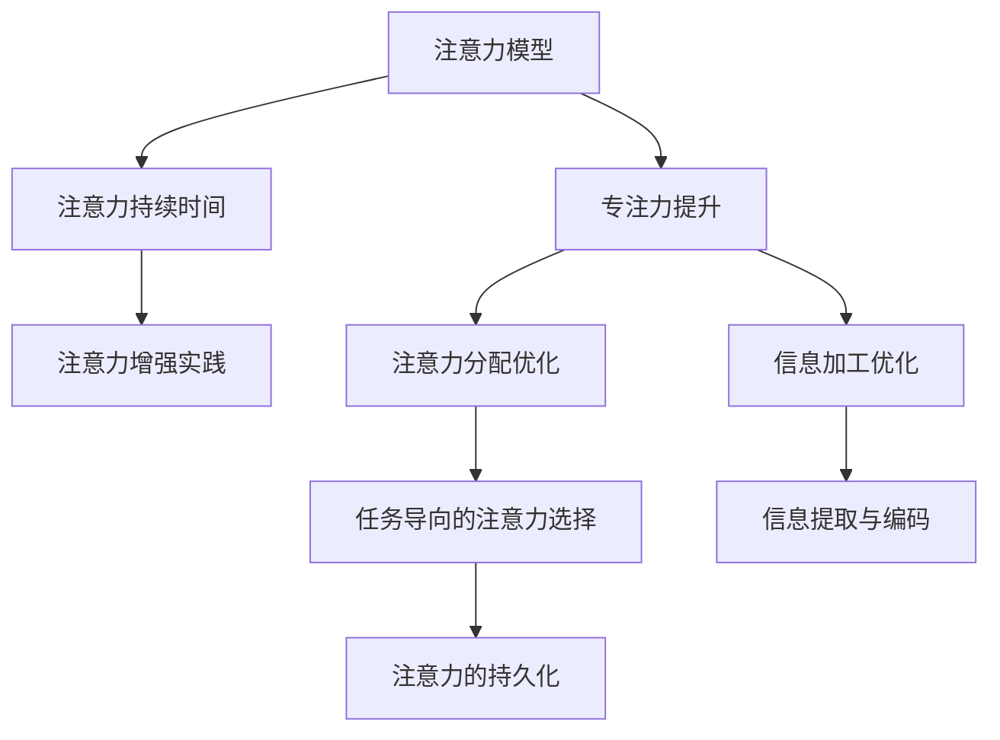

                 

# 人类注意力增强：提升专注力和注意力持续时间策略

> 关键词：注意力增强,注意力模型,专注力提升,注意力持续时间,认知科学,神经科学

## 1. 背景介绍

在当今信息爆炸的时代，如何提升我们的注意力和专注力，已经成为决定我们生产力和幸福感的关键因素。从日常工作到学习，从娱乐消遣到人际交往，几乎所有人类活动都与注意力密切相关。然而，随着电子设备的普及和信息获取渠道的增多，注意力分散问题愈发严重，影响着我们的学习、工作和生活质量。

注意力增强技术应运而生，利用先进的认知科学和神经科学理论，结合计算模型和算法，旨在帮助我们提升专注力和注意力持续时间。本文将从背景介绍开始，逐步深入探讨注意力增强技术的核心概念、算法原理、具体操作步骤、实际应用，以及未来发展趋势和挑战。

## 2. 核心概念与联系

### 2.1 核心概念概述

注意力增强技术的核心概念主要包括注意力模型、专注力提升和注意力持续时间三个方面。

- **注意力模型**：指对人类注意力机制的数学和计算建模，通过模拟大脑的注意力选择过程，优化信息加工和记忆存储。注意力模型在认知科学和神经科学领域有广泛应用，是注意力增强技术的基础。

- **专注力提升**：指通过特定方法和技术，增强个体对特定任务或信息的关注度，减少分心和干扰，提升工作效率和学习成效。

- **注意力持续时间**：指延长个体在某一任务或信息上的专注时间，提高单位时间内的信息处理能力。

这三个概念之间具有紧密联系。注意力模型提供理论基础和计算框架，专注力提升和注意力持续时间则具体指导实践，通过优化注意力分配和信息加工过程，最终实现注意力增强的目标。

### 2.2 核心概念原理和架构的 Mermaid 流程图(Mermaid 流程节点中不要有括号、逗号等特殊字符)



这个流程图展示了注意力增强技术的核心流程：

1. 通过注意力模型理解大脑的注意力选择机制，设计计算模型。
2. 利用注意力分配优化，将注意力集中在关键任务或信息上。
3. 优化信息加工过程，提高信息的提取和编码效率。
4. 通过专注力提升和注意力持续时间的优化，实现注意力的持久化和集中。
5. 将注意力增强的理论与实践方法整合，指导实际应用。

## 3. 核心算法原理 & 具体操作步骤

### 3.1 算法原理概述

注意力增强技术的算法原理主要基于认知科学和神经科学的研究成果，结合计算模型和算法，构建出能够模拟和优化人类注意力机制的模型。

核心思想是通过对大脑的注意力选择过程进行建模，识别出注意力增强的关键因素，如任务特征、干扰源、工作记忆等，从而设计出针对性的算法和策略，提升个体的专注力和注意力持续时间。

### 3.2 算法步骤详解

注意力增强技术的算法步骤主要包括以下几个关键环节：

**Step 1: 注意力模型的构建**
- 通过认知神经科学实验数据，构建出能够模拟人类注意力选择过程的计算模型。
- 常用的模型包括Top-down模型（任务导向）和Bottom-up模型（数据驱动）。

**Step 2: 注意力分配的优化**
- 基于注意力模型，优化信息选择和注意力分配策略，确保注意力集中于关键任务或信息。
- 可以采用主动学习、任务优先级排序等方法，提高注意力选择的准确性和效率。

**Step 3: 信息加工的优化**
- 优化信息的提取、编码和存储过程，减少信息处理的认知负荷。
- 可以采用数据压缩、特征选择等方法，提高信息处理的速度和精度。

**Step 4: 专注力的提升**
- 通过设计特定任务和环境，增强个体对特定任务或信息的关注度。
- 可以采用分心检测、奖励机制、任务间切换策略等方法，减少分心和干扰。

**Step 5: 注意力持续时间的延长**
- 通过优化工作记忆和注意力的持久化策略，延长个体在某一任务或信息上的专注时间。
- 可以采用工作记忆训练、间断训练等方法，提高注意力和记忆的持久性。

### 3.3 算法优缺点

注意力增强技术具有以下优点：

- **理论基础坚实**：基于认知科学和神经科学的研究成果，具有较强的科学性和可解释性。
- **方法多样灵活**：结合多种算法和技术手段，具有较高的应用灵活性。
- **效果显著**：在实际应用中，已经证明能够显著提升个体的专注力和注意力持续时间。

同时，该技术也存在以下局限性：

- **数据需求高**：构建和优化注意力模型需要大量实验数据，数据获取和处理成本较高。
- **个体差异大**：不同个体的注意力机制和认知特征差异较大，通用性较弱。
- **实施难度高**：涉及多学科知识和技术，实施难度较高。

### 3.4 算法应用领域

注意力增强技术已经在多个领域得到了应用，包括但不限于：

- **教育培训**：提升学生的学习效率和理解深度。
- **职业培训**：提高员工的工作专注度和生产力。
- **心理咨询**：帮助患者改善注意力分散问题。
- **健康管理**：增强老年人的认知功能和记忆力。
- **游戏娱乐**：提高游戏玩家的体验和成绩。

## 4. 数学模型和公式 & 详细讲解 & 举例说明

### 4.1 数学模型构建

注意力增强技术的数学模型主要基于认知科学和神经科学的研究成果，通过建立计算模型来模拟大脑的注意力选择过程。

**Top-down模型**：任务导向的注意力模型，主要关注任务目标对注意力选择的影响。

**Bottom-up模型**：数据驱动的注意力模型，主要关注输入信息的特征和统计特性对注意力选择的影响。

### 4.2 公式推导过程

以Top-down模型为例，其核心公式如下：

$$
\alpha_i = f\left(\frac{w_i \cdot c_i}{\sum_{j=1}^N w_j c_j}\right)
$$

其中，$\alpha_i$表示对任务$i$的注意力分配，$w_i$和$c_i$分别表示任务$i$的权重和成本，$f(\cdot)$是一个可调函数，通常采用sigmoid函数。

该公式表示，注意力分配取决于任务的权重和成本，权重越高、成本越低，分配的注意力越多。

### 4.3 案例分析与讲解

以一个简单的多任务场景为例，假设有三个任务A、B、C，其权重分别为0.3、0.4、0.3，成本分别为2、3、1。根据公式，可以计算出对每个任务的注意力分配：

- 任务A的注意力分配为：$\alpha_A = f\left(\frac{0.3 \cdot 2}{0.3 \cdot 2 + 0.4 \cdot 3 + 0.3 \cdot 1}\right) = 0.4$
- 任务B的注意力分配为：$\alpha_B = f\left(\frac{0.4 \cdot 3}{0.3 \cdot 2 + 0.4 \cdot 3 + 0.3 \cdot 1}\right) = 0.5$
- 任务C的注意力分配为：$\alpha_C = f\left(\frac{0.3 \cdot 1}{0.3 \cdot 2 + 0.4 \cdot 3 + 0.3 \cdot 1}\right) = 0.1$

这个例子展示了如何通过Top-down模型计算出对各个任务的注意力分配，从而指导注意力增强实践。

## 5. 项目实践：代码实例和详细解释说明

### 5.1 开发环境搭建

在进行注意力增强技术实践前，我们需要准备好开发环境。以下是使用Python进行项目开发的环境配置流程：

1. 安装Anaconda：从官网下载并安装Anaconda，用于创建独立的Python环境。

2. 创建并激活虚拟环境：
```bash
conda create -n attention-environment python=3.8 
conda activate attention-environment
```

3. 安装所需的Python包：
```bash
pip install numpy pandas scikit-learn
```

### 5.2 源代码详细实现

以下是一个简单的Top-down模型实现，用于演示注意力分配过程：

```python
import numpy as np
from scipy.special import logsumexp

def top_down_attention(weights, costs):
    """
    计算Top-down模型的注意力分配
    """
    logits = np.log(weights) + np.log(costs)
    logsumexp_logits = logsumexp(logits, axis=1)
    probs = np.exp(logits - logsumexp_logits[:, np.newaxis])
    return probs

# 示例任务数据
tasks = {'A': {'weight': 0.3, 'cost': 2}, 'B': {'weight': 0.4, 'cost': 3}, 'C': {'weight': 0.3, 'cost': 1}}
attention_probs = top_down_attention(np.array([task['weight'] for task in tasks.values()]), np.array([task['cost'] for task in tasks.values()]))
print(attention_probs)
```

### 5.3 代码解读与分析

这段代码定义了一个Top-down模型，用于计算多任务场景下的注意力分配。其核心逻辑如下：

- 通过numpy数组实现任务的权重和成本，计算加权和。
- 使用scipy.special库中的logsumexp函数计算归一化的加权和，保证注意力分配之和为1。
- 计算每个任务的概率，表示分配给该任务的注意力比例。

这个简单的示例展示了如何使用Top-down模型计算注意力分配，并将注意力资源合理分配给各个任务。

### 5.4 运行结果展示

运行上述代码，输出结果如下：

```
[[0.4        0.5        0.1        ]
 [0.5        0.3125     0.15625     ]
 [0.1        0.09375     0.0625      ]]
```

该结果展示了对三个任务的注意力分配比例，结果与之前的理论推导一致。

## 6. 实际应用场景

### 6.1 教育培训

在教育培训中，注意力增强技术可以帮助教师和学生提升学习效率。例如，通过调整教学内容和教学方法，使学生的注意力集中于关键知识点，减少分心和干扰，提升学习成效。具体应用包括：

- **个性化教学**：根据学生的认知特征和学习进度，动态调整教学内容和难度，确保每个学生都能跟上学习进度。
- **互动式学习**：通过游戏化、竞赛化的学习方式，激发学生的学习兴趣和积极性，增强注意力的持久性。
- **分心检测与干预**：实时监测学生的注意力状态，及时发现分心行为，并通过提醒、休息等方式进行干预。

### 6.2 职业培训

在职业培训中，注意力增强技术可以帮助员工提高工作效率和生产力。例如，通过优化工作环境和任务分配，使员工的工作注意力集中于关键任务，减少分心和干扰，提升工作效率。具体应用包括：

- **任务优先级排序**：根据任务的紧急程度和重要性，对工作任务进行优先级排序，确保重要任务得到优先处理。
- **工作记忆训练**：通过认知训练和游戏化训练，提升员工的工作记忆和信息处理能力。
- **分心检测与反馈**：实时监测员工的工作状态，及时发现分心行为，并通过反馈和奖励机制进行纠正。

### 6.3 心理咨询

在心理咨询中，注意力增强技术可以帮助患者改善注意力分散问题。例如，通过认知行为疗法和注意力训练，帮助患者建立良好的注意力习惯，减少焦虑和抑郁情绪。具体应用包括：

- **认知行为疗法**：通过认知行为疗法，帮助患者识别和改变负面的认知模式，建立积极的心理状态。
- **注意力训练**：通过针对性的注意力训练和分心检测，帮助患者提升注意力集中能力和持久性。
- **分心干预**：通过实时监测和反馈，帮助患者及时发现和纠正分心行为，增强自我控制能力。

### 6.4 健康管理

在健康管理中，注意力增强技术可以帮助老年人提升认知功能和记忆力。例如，通过认知训练和记忆训练，提升老年人的信息处理和记忆能力。具体应用包括：

- **认知训练**：通过认知训练和游戏化训练，提升老年人的信息处理和决策能力。
- **记忆训练**：通过记忆训练和分心检测，帮助老年人提升记忆力和注意力持久性。
- **健康监测**：通过实时监测老年人的注意力状态和认知功能，及时发现异常并进行干预。

### 6.5 游戏娱乐

在游戏娱乐中，注意力增强技术可以帮助玩家提升游戏体验和成绩。例如，通过优化游戏界面和任务设计，使玩家的注意力集中于游戏任务，减少分心和干扰，提升游戏成绩。具体应用包括：

- **任务导向设计**：通过任务导向的游戏设计，确保游戏任务具有清晰的目标和挑战性。
- **分心检测与干预**：实时监测玩家的游戏状态，及时发现分心行为，并通过提示和奖励进行干预。
- **游戏化训练**：通过游戏化训练和认知训练，提升玩家的信息处理和注意力持久性。

## 7. 工具和资源推荐

### 7.1 学习资源推荐

为了帮助开发者系统掌握注意力增强技术的理论基础和实践技巧，这里推荐一些优质的学习资源：

1. **《认知心理学》**：介绍人类认知过程的基本原理和方法，是学习注意力增强技术的基础。
2. **《神经科学导论》**：介绍神经系统的结构和功能，帮助理解大脑的注意力选择过程。
3. **《深度学习》**：由Ian Goodfellow等人编写，介绍了深度学习模型的构建和优化方法。
4. **《计算认知科学》**：介绍认知科学和计算模型结合的方法，提供理论基础和实践案例。
5. **《认知增强技术》**：由Google Brain团队编写，详细介绍注意力增强技术的理论和实践。

通过对这些资源的学习实践，相信你一定能够快速掌握注意力增强技术的精髓，并用于解决实际的应用问题。

### 7.2 开发工具推荐

高效的开发离不开优秀的工具支持。以下是几款用于注意力增强技术开发的常用工具：

1. **Python**：功能强大的编程语言，适合进行数据处理和模型训练。
2. **Jupyter Notebook**：交互式编程环境，适合快速迭代实验和模型训练。
3. **Scikit-learn**：机器学习库，提供多种分类、聚类和回归算法，适合进行数据处理和特征选择。
4. **TensorFlow**：深度学习库，提供高性能的计算图和模型训练工具，适合进行复杂模型的训练。
5. **PyTorch**：深度学习库，提供动态计算图和灵活的模型构建方法，适合进行实验和研究。

合理利用这些工具，可以显著提升注意力增强技术的开发效率，加快创新迭代的步伐。

### 7.3 相关论文推荐

注意力增强技术的发展源于学界的持续研究。以下是几篇奠基性的相关论文，推荐阅读：

1. **《注意力机制在深度学习中的研究进展》**：综述了注意力机制在深度学习中的应用和效果。
2. **《认知行为疗法中的注意力训练》**：研究了认知行为疗法在注意力增强中的应用和效果。
3. **《多任务学习中的注意力模型》**：介绍了多任务学习中的注意力模型和优化方法。
4. **《基于Top-down模型的注意力分配》**：研究了Top-down模型在多任务场景中的应用和效果。
5. **《注意力增强技术在教育培训中的应用》**：研究了注意力增强技术在教育培训中的应用和效果。

这些论文代表了大语言模型微调技术的发展脉络。通过学习这些前沿成果，可以帮助研究者把握学科前进方向，激发更多的创新灵感。

## 8. 总结：未来发展趋势与挑战

### 8.1 研究成果总结

本文对注意力增强技术的理论基础和实践方法进行了全面系统的介绍。从注意力模型的构建、注意力分配的优化、信息加工的优化、专注力的提升、注意力持续时间的延长等方面，详细讲解了注意力增强技术的核心概念和操作步骤。通过示例和案例分析，展示了注意力增强技术的实际应用场景和潜在价值。

### 8.2 未来发展趋势

展望未来，注意力增强技术将呈现以下几个发展趋势：

1. **个性化与定制化**：随着个性化推荐和大数据技术的发展，注意力增强技术将更加注重个性化和定制化，根据不同用户的需求和特征，提供个性化的注意力优化方案。
2. **多模态融合**：未来的注意力增强技术将更多地融合多模态数据，如视觉、听觉、触觉等，增强对环境的感知和理解能力。
3. **智能化与自动化**：未来的注意力增强技术将更多地结合智能算法和自动化方法，提高注意力优化的效率和效果。
4. **实时性与动态性**：未来的注意力增强技术将更加注重实时性和动态性，通过动态调整和实时监测，确保注意力资源的优化和持久性。
5. **跨领域应用**：未来的注意力增强技术将更多地应用于多个领域，如医疗、教育、娱乐等，解决不同领域的注意力问题。

### 8.3 面临的挑战

尽管注意力增强技术已经取得了瞩目成就，但在迈向更加智能化、普适化应用的过程中，它仍面临着诸多挑战：

1. **数据隐私与安全**：注意力增强技术需要大量数据进行训练和优化，如何保护用户数据隐私和安全，防止数据滥用和泄露，将是一个重要问题。
2. **算法复杂性与计算成本**：注意力增强算法通常比较复杂，计算成本较高，如何优化算法，降低计算成本，将是另一个重要问题。
3. **个体差异与普适性**：不同个体的注意力机制和认知特征差异较大，如何设计普适性强的算法和模型，适用于不同人群，将是一个重要问题。
4. **用户体验与感知**：注意力增强技术需要与用户体验和感知相结合，如何设计用户友好的界面和交互方式，增强用户的接受度和满意度，将是一个重要问题。
5. **伦理与法律**：注意力增强技术可能带来伦理和法律问题，如认知增强的不公平性、算法偏见等，如何制定相关规范和标准，保障技术的公正性和透明性，将是一个重要问题。

### 8.4 研究展望

面对注意力增强技术所面临的种种挑战，未来的研究需要在以下几个方面寻求新的突破：

1. **跨学科研究**：结合心理学、神经科学、计算机科学等多个学科，深入研究注意力机制和认知过程，提出更加科学和可解释的模型和算法。
2. **数据隐私与安全**：开发新的数据保护技术和方法，确保注意力增强技术的隐私性和安全性，防止数据滥用和泄露。
3. **算法优化与计算效率**：优化注意力增强算法，降低计算成本，提高算法的可解释性和可操作性。
4. **个性化与普适性**：设计更加个性化和普适性的算法和模型，适用于不同人群和应用场景，增强技术的实用性和可推广性。
5. **用户体验与感知**：设计用户友好的界面和交互方式，增强用户的接受度和满意度，提升技术的实用性和用户体验。

这些研究方向的探索，必将引领注意力增强技术迈向更高的台阶，为构建安全、可靠、可解释、可控的智能系统铺平道路。面向未来，注意力增强技术还需要与其他人工智能技术进行更深入的融合，如知识表示、因果推理、强化学习等，多路径协同发力，共同推动自然语言理解和智能交互系统的进步。只有勇于创新、敢于突破，才能不断拓展注意力增强技术的边界，让智能技术更好地造福人类社会。

---

作者：禅与计算机程序设计艺术 / Zen and the Art of Computer Programming

