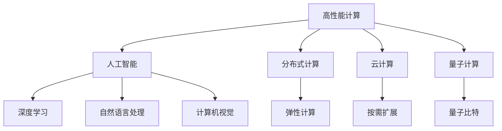
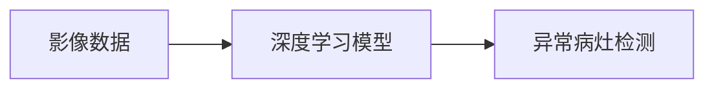
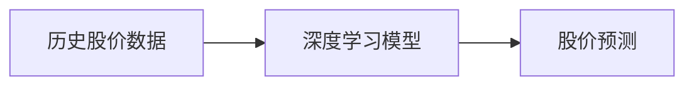
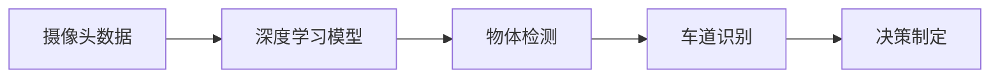

                 

# 人类计算的未来：趋势、机遇与挑战

## 1. 背景介绍

### 1.1 问题由来

近年来，随着计算技术的飞速发展，特别是高性能计算和人工智能的突破，人类计算进入了新的历史阶段。从最初的电子管计算到后来晶体管、集成电路的兴起，再到现代多核处理器、GPU和TPU的广泛应用，计算能力有了质的飞跃。同时，人工智能技术的崛起，尤其是深度学习和机器学习算法的发展，赋予了计算机新的智能特性，使得计算机不仅能够处理大规模数据，还能够进行复杂的逻辑推理和判断。

在这一背景下，人类计算的方式、结构、应用场景都发生了深刻变化。如何在计算能力增强的同时，充分利用计算机的智能特性，提升人类计算的效率和效果，成为一个亟待解决的问题。本文将围绕人类计算的未来趋势、机遇与挑战进行深入探讨。

### 1.2 问题核心关键点

人类计算的未来主要涉及以下几个核心关键点：

- 计算能力的持续提升：硬件和算法的不断优化，使得计算能力有了质的飞跃。
- 人工智能的融合应用：将人工智能技术与计算能力相结合，实现更为复杂的数据处理和智能决策。
- 计算范式的转变：从传统的基于规则的计算向基于数据驱动和智能算法的计算转变。
- 计算系统的分布式化：计算资源分布在全球各地，通过互联网连接和协同计算。
- 计算伦理和安全性的考量：计算过程中需考虑数据隐私、算法透明、伦理道德等因素。
- 计算对社会生活的影响：计算技术将如何改变社会结构、经济模式、教育方式等。

理解这些关键点，有助于我们把握人类计算未来的发展方向和潜在挑战。

## 2. 核心概念与联系

### 2.1 核心概念概述

为更好地理解人类计算的未来趋势，我们首先介绍几个关键概念：

- 高性能计算（High-Performance Computing, HPC）：指使用高性能计算机进行复杂计算和科学模拟的过程。HPC涵盖了从传统的超级计算机到现代的GPU和TPU集群等硬件和软件系统。
- 人工智能（Artificial Intelligence, AI）：通过计算机模拟人类的智能行为，实现机器的自主学习和推理。主要包括机器学习、深度学习、自然语言处理等子领域。
- 分布式计算（Distributed Computing）：将计算任务分布到多台计算机上协同完成，提高计算效率和扩展性。常见的分布式计算框架包括Apache Hadoop、Spark等。
- 云计算（Cloud Computing）：通过互联网提供计算资源和服务，实现按需扩展和弹性计算。云计算平台如AWS、Azure等，为大规模数据处理和应用提供了强大支持。
- 量子计算（Quantum Computing）：利用量子叠加和纠缠等特性，实现比传统计算更高效的计算过程。量子计算在密码学、优化问题等领域有重要应用前景。

这些概念之间的逻辑关系可以通过以下Mermaid流程图来展示：



这个流程图展示了几大关键概念之间的联系：

1. 高性能计算为人工智能提供了基础计算能力。
2. 人工智能技术包括深度学习、自然语言处理等，为高性能计算注入了智能特性。
3. 分布式计算和云计算技术提高了计算的分布式化和扩展性。
4. 量子计算为计算能力的突破提供了新方向。

## 3. 核心算法原理 & 具体操作步骤

### 3.1 算法原理概述

人类计算的未来趋势和机遇，离不开算法的驱动。目前，深度学习和大数据算法是推动人类计算前进的核心力量。其基本原理是将大量数据通过模型训练和优化，使得模型能够从数据中提取规律和特征，实现智能推理和决策。

深度学习算法主要基于神经网络结构，通过多层非线性变换，捕捉数据中的复杂关系。其核心在于模型参数的优化，通过反向传播算法和梯度下降方法，不断调整模型权重，使得模型输出与真实结果尽可能接近。

### 3.2 算法步骤详解

基于深度学习算法的人类计算步骤通常包括以下几个关键步骤：

**Step 1: 数据准备**

- 收集和预处理数据集，确保数据的质量和多样性。
- 对数据进行分割，分为训练集、验证集和测试集。
- 对数据进行标准化和归一化，以保证模型训练的稳定性。

**Step 2: 模型选择和设计**

- 选择合适的深度学习模型结构，如卷积神经网络（CNN）、循环神经网络（RNN）、变换器（Transformer）等。
- 确定模型的超参数，如学习率、批大小、迭代轮数等。
- 设计模型损失函数，选择合适的优化算法。

**Step 3: 模型训练**

- 将数据集加载到模型中，进行前向传播和计算损失函数。
- 通过反向传播算法计算梯度，并使用优化算法更新模型参数。
- 在验证集上评估模型性能，调整超参数以避免过拟合。

**Step 4: 模型评估和部署**

- 在测试集上对模型进行最终评估，计算精度、召回率、F1分数等指标。
- 将模型部署到实际应用场景中，进行持续监控和优化。
- 根据业务需求和数据变化，对模型进行重新训练和微调。

### 3.3 算法优缺点

深度学习算法在人类计算中具有以下优点：

1. 强大的数据处理能力：能够处理大规模数据集，从中提取复杂模式。
2. 灵活的模型结构：通过深度神经网络实现端到端的处理，减少人工干预。
3. 优秀的泛化能力：在多样化的数据上表现良好，能够适应新场景和新问题。

然而，深度学习算法也存在以下缺点：

1. 高计算资源需求：需要大量计算资源进行模型训练和优化。
2. 过拟合风险：在数据量不足的情况下，容易发生过拟合。
3. 模型解释性差：深度学习模型复杂，难以解释其内部决策过程。
4. 算法黑箱问题：模型参数较多，难以理解其深层机制。

## 4. 数学模型和公式 & 详细讲解

### 4.1 数学模型构建

深度学习模型的核心是神经网络结构。以下以一个简单的神经网络模型为例，介绍深度学习模型的数学构建过程。

假设输入为 $x$，输出为 $y$，模型参数为 $\theta$，神经网络结构如图1所示：


神经网络包含一个输入层、一个或多个隐藏层和一个输出层。每个神经元接收前一层神经元的输出，通过加权和和非线性变换生成当前层的输出。隐藏层的加权和可以通过矩阵乘法和向量乘法表示：

$$
z = Wx + b
$$

其中 $W$ 为权重矩阵，$b$ 为偏置向量。非线性变换通常采用ReLU、Sigmoid等激活函数，如ReLU激活函数：

$$
a = max(0, z)
$$

输出层的计算公式类似：

$$
y = W'a + b'
$$

其中 $W'$ 和 $b'$ 为输出层的权重矩阵和偏置向量。

模型的损失函数 $L$ 通常采用交叉熵损失函数，表示模型输出与真实标签之间的差异：

$$
L = -\frac{1}{N}\sum_{i=1}^N \log p(y_i|x_i)
$$

其中 $p(y_i|x_i)$ 为模型在输入 $x_i$ 下的输出概率。

### 4.2 公式推导过程

深度学习模型的训练过程包括前向传播和反向传播两个阶段。以下以一个简单的二分类任务为例，推导反向传播过程。

假设模型在输入 $x$ 上的输出为 $y$，真实标签为 $t$，模型的交叉熵损失函数为 $L$。前向传播计算模型的输出概率 $p$：

$$
p = sigmoid(Wx + b)
$$

其中 sigmoid 函数为：

$$
sigmoid(z) = \frac{1}{1+e^{-z}}
$$

损失函数 $L$ 可以表示为：

$$
L = -\frac{1}{N}\sum_{i=1}^N (t_i\log p_i + (1-t_i)\log (1-p_i))
$$

对损失函数 $L$ 对模型参数 $\theta$ 求导，得到梯度 $\frac{\partial L}{\partial \theta}$：

$$
\frac{\partial L}{\partial \theta} = -\frac{1}{N}\sum_{i=1}^N (t_i-p_i)(\frac{\partial p_i}{\partial \theta})
$$

对输出概率 $p_i$ 对参数 $\theta$ 求导，得到：

$$
\frac{\partial p_i}{\partial \theta} = sigmoid(z)\frac{\partial z}{\partial \theta}
$$

其中 $z$ 的计算公式为：

$$
z = Wx + b
$$

因此，梯度 $\frac{\partial z}{\partial \theta}$ 可以表示为：

$$
\frac{\partial z}{\partial \theta} = W
$$

将上述公式代入梯度 $\frac{\partial L}{\partial \theta}$ 的计算中，得到：

$$
\frac{\partial L}{\partial \theta} = -\frac{1}{N}\sum_{i=1}^N (t_i-p_i) sigmoid(z) W
$$

通过反向传播算法，将梯度 $\frac{\partial L}{\partial \theta}$ 反传回网络各层，更新模型参数。

### 4.3 案例分析与讲解

以图像识别为例，深度学习模型可以通过卷积神经网络（CNN）结构实现。CNN的卷积层、池化层和全连接层能够有效地提取图像特征，并进行分类。如图2所示：


卷积层通过卷积核对输入图像进行卷积操作，提取图像的局部特征。池化层通过对卷积层输出进行下采样，减少计算量。全连接层将池化层输出进行线性变换，并使用softmax函数输出分类概率。

## 5. 项目实践：代码实例和详细解释说明

### 5.1 开发环境搭建

在实际应用中，深度学习模型的开发环境需要满足以下几个条件：

1. 高性能计算资源：使用GPU或TPU进行模型训练和推理。
2. 深度学习框架：选择TensorFlow、PyTorch、Keras等深度学习框架。
3. 数据预处理工具：如Pandas、NumPy等数据处理库。
4. 模型可视化工具：如TensorBoard、Netron等。

以下以PyTorch框架为例，介绍深度学习模型的开发环境搭建。

1. 安装Anaconda和Python：
```bash
conda install anaconda python=3.7
```

2. 创建虚拟环境：
```bash
conda create --name myenv python=3.7
source activate myenv
```

3. 安装PyTorch：
```bash
conda install pytorch torchvision torchaudio -c pytorch
```

4. 安装相关库：
```bash
pip install numpy pandas matplotlib scikit-learn
```

5. 设置GPU加速：
```python
import torch
device = torch.device('cuda' if torch.cuda.is_available() else 'cpu')
model.to(device)
```

### 5.2 源代码详细实现

以下以手写数字识别为例，使用PyTorch框架实现深度学习模型的开发。

```python
import torch
import torch.nn as nn
import torch.optim as optim
import torchvision.datasets as dset
import torchvision.transforms as transforms

# 定义模型结构
class Net(nn.Module):
    def __init__(self):
        super(Net, self).__init__()
        self.conv1 = nn.Conv2d(1, 10, kernel_size=5)
        self.conv2 = nn.Conv2d(10, 20, kernel_size=5)
        self.fc1 = nn.Linear(320, 50)
        self.fc2 = nn.Linear(50, 10)

    def forward(self, x):
        x = F.relu(F.max_pool2d(self.conv1(x), 2))
        x = F.relu(F.max_pool2d(self.conv2(x), 2))
        x = x.view(-1, 320)
        x = F.relu(self.fc1(x))
        x = self.fc2(x)
        return x

# 加载数据集
train_data = dset.MNIST(root='./data', train=True, transform=transforms.ToTensor(), download=True)
test_data = dset.MNIST(root='./data', train=False, transform=transforms.ToTensor(), download=True)

# 定义数据加载器
train_loader = torch.utils.data.DataLoader(train_data, batch_size=64, shuffle=True)
test_loader = torch.utils.data.DataLoader(test_data, batch_size=64, shuffle=False)

# 定义模型、损失函数和优化器
model = Net()
criterion = nn.CrossEntropyLoss()
optimizer = optim.SGD(model.parameters(), lr=0.001, momentum=0.9)

# 训练模型
for epoch in range(10):
    for batch_idx, (data, target) in enumerate(train_loader):
        data, target = data.to(device), target.to(device)
        optimizer.zero_grad()
        output = model(data)
        loss = criterion(output, target)
        loss.backward()
        optimizer.step()
        if batch_idx % 100 == 99:
            print('Train Epoch: {} [{}/{} ({:.0f}%)]\tLoss: {:.6f}'.format(
                epoch, batch_idx * len(data), len(train_loader.dataset),
                100. * batch_idx / len(train_loader), loss.item()))

# 评估模型
correct = 0
total = 0
with torch.no_grad():
    for data, target in test_loader:
        data, target = data.to(device), target.to(device)
        output = model(data)
        _, predicted = torch.max(output.data, 1)
        total += target.size(0)
        correct += (predicted == target).sum().item()

print('Accuracy of the network on the 10000 test images: {} %'.format(100 * correct / total))
```

### 5.3 代码解读与分析

以上代码实现了简单的手写数字识别模型，通过卷积神经网络结构对输入图像进行特征提取和分类。以下是关键代码的解读与分析：

**Net类**：定义了模型的结构，包含卷积层、池化层和全连接层。

**数据加载器**：使用PyTorch的DataLoader对数据集进行批量处理和加载，确保训练和测试过程中的数据流顺畅。

**模型训练**：通过循环遍历训练集数据，在每个批次上进行前向传播和反向传播，更新模型参数。

**模型评估**：在测试集上对模型进行最终评估，计算分类准确率。

## 6. 实际应用场景

### 6.1 医疗诊断

深度学习在医疗诊断领域有广泛应用，能够辅助医生进行病情诊断和预测。例如，深度学习模型可以通过影像数据进行疾病分类、病理分析等任务。如图3所示，深度学习模型能够自动分析影像数据，检测异常病灶，辅助医生进行诊断：



### 6.2 金融风险预测

深度学习在金融领域主要用于风险预测和市场分析。例如，深度学习模型可以通过历史数据进行股票价格预测、信用评估等任务。如图4所示，深度学习模型能够根据历史股价数据，预测未来的股价变化：



### 6.3 自动驾驶

深度学习在自动驾驶领域主要用于环境感知和决策制定。例如，深度学习模型可以通过摄像头数据进行物体检测、车道识别等任务。如图5所示，深度学习模型能够自动感知环境，并进行安全驾驶决策：



### 6.4 未来应用展望

未来，深度学习技术将在更多领域得到应用，进一步提升人类计算的智能化水平。以下是一些潜在的应用方向：

1. 智能制造：通过深度学习优化生产流程，提高生产效率和产品质量。
2. 智慧城市：通过深度学习进行城市交通、安防、环境监测等任务。
3. 教育辅助：通过深度学习进行个性化教学、知识推荐等任务。
4. 金融量化：通过深度学习进行量化交易、风险管理等任务。

## 7. 工具和资源推荐

### 7.1 学习资源推荐

为帮助开发者系统掌握深度学习技术，以下推荐一些优质的学习资源：

1. 《深度学习》书籍：Ian Goodfellow等著，全面介绍了深度学习的基本原理和算法。
2. 《动手学深度学习》：由李沐等作者编写，提供了丰富的代码实例和实验环境。
3. 《PyTorch官方文档》：提供了PyTorch的全面介绍和代码示例。
4. 《TensorFlow官方文档》：提供了TensorFlow的全面介绍和代码示例。
5. 在线课程：如Coursera、edX等平台提供的深度学习课程。

### 7.2 开发工具推荐

深度学习开发需要高性能计算资源和深度学习框架。以下是一些推荐的开发工具：

1. PyTorch：基于Python的开源深度学习框架，易于使用和扩展。
2. TensorFlow：由Google主导开发的深度学习框架，支持分布式计算和GPU加速。
3. Keras：高层API，易于上手，支持TensorFlow、Theano等多种后端。
4. Jupyter Notebook：交互式代码编辑器，支持实时展示和调试。
5. Google Colab：Google提供的在线Jupyter Notebook环境，免费提供GPU和TPU计算资源。

### 7.3 相关论文推荐

深度学习技术的发展离不开学界的持续研究。以下是一些奠基性的相关论文，推荐阅读：

1. AlexNet：Hinton等，2012年NIPS会议，提出AlexNet模型，开创深度学习在大规模图像识别上的先河。
2. ResNet：He等，2015年ICCV会议，提出ResNet模型，解决了深度网络退化问题，提升了模型深度和性能。
3. InceptionNet：Szegedy等，2014年NIPS会议，提出Inception模型，优化了网络结构，提升了模型效率。
4. VGGNet：Simonyan等，2014年ICLR会议，提出VGG模型，展示了多层次卷积和池化操作的优越性。
5. YOLO：Redmon等，2016年CVPR会议，提出YOLO模型，实现了实时目标检测。

这些论文代表了深度学习技术的发展脉络，通过学习这些前沿成果，可以帮助研究者把握学科前进方向，激发更多的创新灵感。

## 8. 总结：未来发展趋势与挑战

### 8.1 研究成果总结

本文详细介绍了深度学习在人类计算中的广泛应用，涵盖了高性能计算、人工智能、分布式计算和云计算等关键技术。通过案例分析和代码实现，展示了深度学习模型的开发流程和应用场景。同时，介绍了深度学习在医疗诊断、金融风险预测、自动驾驶等领域的应用前景，展望了未来发展趋势。

### 8.2 未来发展趋势

未来深度学习技术将继续发展，以下趋势值得关注：

1. 模型规模的不断增大：随着算力的提升，深度学习模型将进一步扩展到更大规模和更深层。
2. 算法的不断优化：基于新理论和新技术，深度学习算法将不断优化，提高模型效率和效果。
3. 应用场景的不断扩展：深度学习技术将在更多领域得到应用，推动各行各业的智能化升级。
4. 数据量的不断增长：海量数据将为深度学习提供更多训练样本，提升模型泛化能力。
5. 跨领域技术的融合：深度学习将与其他技术如量子计算、自然语言处理等进行深度融合，提升整体能力。

### 8.3 面临的挑战

尽管深度学习技术取得了重大进展，但在实际应用中仍面临诸多挑战：

1. 数据隐私和安全问题：深度学习模型需要大量数据训练，涉及数据隐私和安全风险。
2. 算法透明性和可解释性问题：深度学习模型复杂，难以解释其内部决策过程。
3. 计算资源和成本问题：深度学习需要大量计算资源，成本较高。
4. 模型过拟合问题：深度学习模型容易发生过拟合，影响泛化能力。
5. 算法偏见问题：深度学习模型可能学习到数据中的偏见，影响公平性和鲁棒性。

### 8.4 研究展望

为应对未来挑战，深度学习研究需要从以下几个方面进行突破：

1. 数据隐私和安全技术：研究数据加密、隐私保护等技术，保障数据隐私和安全。
2. 模型透明性和可解释性技术：研究模型的解释性技术，提升模型的透明性和可解释性。
3. 高效计算技术：研究高效的计算算法和硬件设备，降低计算成本。
4. 泛化能力提升技术：研究泛化能力提升技术，提高模型泛化能力。
5. 公平性技术：研究算法公平性技术，消除数据中的偏见，提升模型公平性。

## 9. 附录：常见问题与解答

**Q1: 深度学习算法的优点和缺点是什么？**

A: 深度学习算法具有强大的数据处理能力和优秀的泛化能力，能够处理大规模数据并从中提取复杂模式。但同时，深度学习算法需要大量计算资源进行模型训练和优化，容易发生过拟合，模型复杂难以解释，存在算法黑箱问题。

**Q2: 如何提高深度学习模型的泛化能力？**

A: 提高深度学习模型的泛化能力可以从以下几个方面入手：
1. 数据增强：通过数据增强技术，丰富训练集的多样性，提升模型泛化能力。
2. 正则化：通过L2正则、Dropout等方法，避免过拟合，提高模型泛化能力。
3. 迁移学习：通过迁移学习，利用预训练模型的知识，提升模型的泛化能力。
4. 模型简化：通过简化模型结构，减少过拟合风险，提高模型泛化能力。

**Q3: 深度学习算法的计算资源需求高，如何优化计算效率？**

A: 优化深度学习算法的计算效率可以从以下几个方面入手：
1. 模型剪枝：通过剪枝技术，去除不必要的参数和结构，减小模型尺寸。
2. 量化加速：通过量化技术，将浮点模型转为定点模型，减少计算量和存储空间。
3. 分布式计算：通过分布式计算技术，将计算任务分布在多台计算机上协同完成，提高计算效率。
4. 模型并行：通过模型并行技术，将计算任务并行处理，提高计算效率。

**Q4: 深度学习算法的黑箱问题如何解决？**

A: 解决深度学习算法的黑箱问题可以从以下几个方面入手：
1. 模型解释性技术：通过模型解释性技术，提升模型的透明性和可解释性。
2. 可视化技术：通过可视化技术，展示模型内部决策过程，帮助理解模型行为。
3. 知识蒸馏：通过知识蒸馏技术，将模型知识提取并传递给简化模型，提高模型解释性。
4. 符号化模型：通过符号化模型，将深度学习模型转化为符号表示形式，提升模型透明性。

**Q5: 深度学习算法在实际应用中如何保障数据隐私和安全？**

A: 保障深度学习算法在实际应用中的数据隐私和安全，可以从以下几个方面入手：
1. 数据加密：通过数据加密技术，保护数据隐私和安全。
2. 联邦学习：通过联邦学习技术，在保证数据隐私的前提下，进行分布式模型训练。
3. 差分隐私：通过差分隐私技术，在保护数据隐私的同时，提升模型的泛化能力。
4. 模型蒸馏：通过模型蒸馏技术，保护数据隐私和安全。

**Q6: 深度学习算法在实际应用中如何避免偏见和歧视？**

A: 避免深度学习算法在实际应用中的偏见和歧视，可以从以下几个方面入手：
1. 数据公平性：通过数据公平性技术，消除数据中的偏见和歧视。
2. 模型公平性：通过模型公平性技术，消除模型中的偏见和歧视。
3. 监督学习：通过监督学习技术，避免模型学习到数据中的偏见和歧视。
4. 对抗训练：通过对抗训练技术，提升模型的鲁棒性和公平性。

**Q7: 深度学习算法在实际应用中如何处理大规模数据？**

A: 处理大规模数据可以从以下几个方面入手：
1. 数据分区：通过数据分区技术，将大规模数据划分为多个子集，分批次处理。
2. 分布式计算：通过分布式计算技术，将计算任务分布在多台计算机上协同完成，处理大规模数据。
3. 模型并行：通过模型并行技术，将计算任务并行处理，处理大规模数据。
4. 数据压缩：通过数据压缩技术，减小数据存储空间，处理大规模数据。

通过这些方法，深度学习算法可以更好地处理大规模数据，提升模型性能和效率。

---

作者：禅与计算机程序设计艺术 / Zen and the Art of Computer Programming

