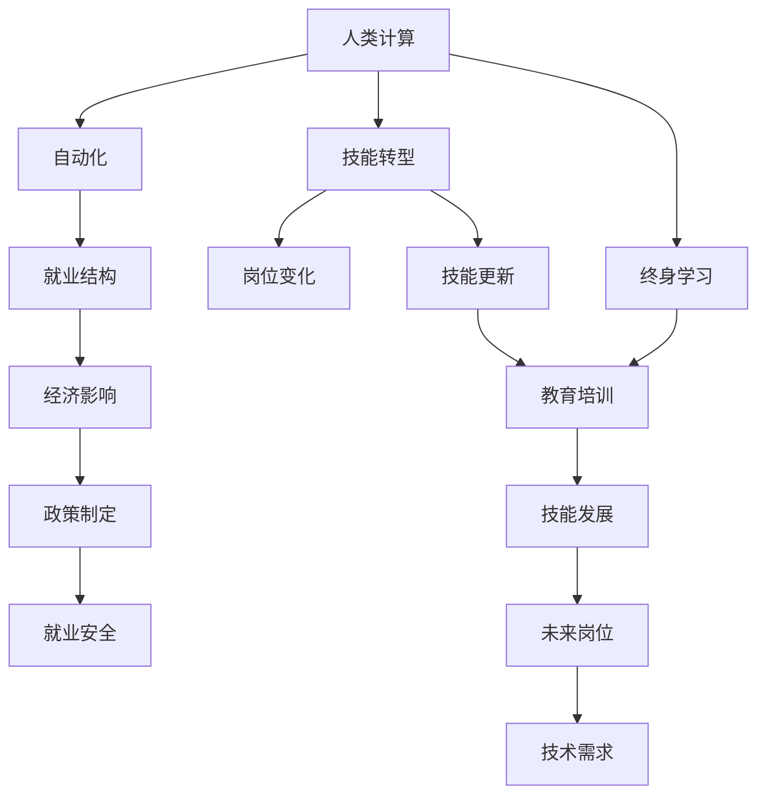

                 

## 1. 背景介绍

### 1.1 问题由来
人工智能(AI)技术在过去几年中取得了显著的进展，引发了关于未来就业市场和技能培训需求的大讨论。随着自动化和智能化的发展，传统的劳动力市场结构正在发生深刻的变化。AI和大数据技术正在重塑工作岗位，推动劳动生产力的提升。然而，这些技术的发展也带来了新的挑战：如何在提高生产效率的同时，保障社会公平、就业安全，以及培训人员的适应能力？

### 1.2 问题核心关键点
AI技术迅猛发展，自动化取代传统人力密集型岗位已成趋势。此变革不仅影响传统制造业和农业，还涉及更广泛的商务、金融、医疗等多个领域。新岗位与老岗位之间的巨大鸿沟、技能要求的不断变化、以及终身学习的紧迫性，使得对未来的就业市场趋势和技能培训需求进行深入分析变得尤为重要。

### 1.3 问题研究意义
理解AI时代下的就业市场趋势，有助于政策制定者、教育机构和企业制定更为科学、前瞻性的培训计划和招聘策略。同时，也有助于个人理解技术变革对就业的影响，明确未来发展方向，进行积极应对和准备。

## 2. 核心概念与联系

### 2.1 核心概念概述

为更好地理解AI时代下的就业市场变化和技能培训需求，本节将介绍几个关键概念：

- **人类计算(Human Computing)**：指人类使用计算机辅助完成计算、数据处理、信息分析等任务的过程。AI技术发展将更多地替代机械性、重复性、危险性的工作，而人类将转向更复杂、需要创造性和策略性的计算任务。
- **自动化**：指机器或软件自动执行原本由人类完成的任务。随着AI的进步，自动化在各行各业逐渐普及，影响着岗位变迁和技能需求。
- **技能转型**：指在自动化和智能化过程中，现有技能可能变得不再适用，需要重新学习和培训以适应新的技术环境。
- **终身学习**：指在整个职业生涯中，持续进行技能培训和知识更新，以适应快速变化的技术和工作环境。
- **AI伦理**：涉及AI在发展过程中如何确保其安全性、公平性、透明性及符合伦理道德的问题，对就业市场有重要影响。

这些核心概念之间存在紧密联系，共同构成AI时代下就业市场和技能培训的复杂体系。

### 2.2 核心概念原理和架构的 Mermaid 流程图



这个流程图展示了人类计算与AI发展下的岗位变化、技能更新、教育培训和政策调整之间的逻辑关系：

1. **人类计算**：基础的计算需求通过AI技术得到自动化解决。
2. **自动化**：自动化导致岗位需求减少，尤其是重复性工作。
3. **技能转型**：因自动化而需求降低的技能需要重新培训，形成新的技能需求。
4. **终身学习**：为了适应技术变化，必须持续学习新技能。
5. **技能更新**：教育培训机构需要调整培训计划，以适应新的技能需求。
6. **岗位变化**：新兴岗位产生，对新的技能需求增加。
7. **就业结构**：就业结构发生重大调整，影响经济和社会。
8. **政策制定**：政府和行业需制定政策保障就业安全。
9. **就业安全**：确保失业人员得到培训和再就业。

## 3. 核心算法原理 & 具体操作步骤

### 3.1 算法原理概述

AI时代下的就业市场变化与技能培训需求分析，主要涉及以下几个方面的计算和推理：

1. **岗位变迁预测**：通过分析自动化技术的发展趋势和已有数据，预测哪些岗位将受到自动化影响。
2. **技能需求分析**：结合岗位变迁预测结果，分析未来岗位所需的技能和知识。
3. **教育培训规划**：根据技能需求分析结果，制定培训计划和课程内容。
4. **就业安全保障**：制定政策确保劳动者能够在岗位变动中获得充分培训和再就业机会。

这些计算和推理过程可以用数学模型和算法进行量化和优化。

### 3.2 算法步骤详解

**Step 1: 岗位变迁预测**

1. 收集自动化影响的相关数据，如自动化技术的普及率、工作流程的机械化程度、人工与自动化的生产成本等。
2. 对数据进行清洗和处理，构建历史和当前岗位的分布模型。
3. 使用统计学和机器学习方法，如回归分析、时间序列分析等，预测未来岗位变迁趋势。

**Step 2: 技能需求分析**

1. 对预测出的岗位变迁进行分类和分解，确定哪些岗位将被自动化取代，哪些岗位将产生新的需求。
2. 根据岗位需求，分析未来所需的关键技能和知识，包括编程、数据分析、机器学习、自然语言处理等。
3. 通过调研和专家访谈，获取行业内人士的见解和建议。

**Step 3: 教育培训规划**

1. 根据技能需求分析结果，确定培训课程内容，包括理论知识、实操技能和案例分析等。
2. 结合在线教育和传统教育，设计灵活的培训方式，适应不同年龄段和知识背景的受训者。
3. 组织行业内企业合作，开展联合培训项目，提升培训的实用性和就业导向。

**Step 4: 就业安全保障**

1. 制定就业保障政策，确保劳动者在岗位变化中有充分的培训机会。
2. 设立专项基金，支持劳动者转岗培训和创业支持。
3. 建立职业指导和咨询服务体系，帮助劳动者顺利过渡到新岗位。

### 3.3 算法优缺点

**优点**：
1. 可量化预测未来岗位变迁，有助于提前规划和调整培训计划。
2. 结合机器学习和统计学方法，预测结果更科学和可靠。
3. 教育培训规划更具前瞻性和针对性，能够培养符合未来需求的劳动力。

**缺点**：
1. 预测模型可能存在偏差，尤其是在数据不足或技术进步迅速的情况下。
2. 培训内容可能难以涵盖所有未来需求，培训效果有限。
3. 就业保障政策需要充分考虑社会经济因素，实施难度较大。

### 3.4 算法应用领域

这些算法和计算过程在多个领域有广泛的应用：

- **政策制定**：政府和企业需根据岗位变迁预测和技能需求分析，制定相应的政策。
- **教育培训**：教育机构需根据技能需求调整课程设置，提升教学内容的前瞻性和实用性。
- **人力资源管理**：企业需关注岗位变化趋势，制定灵活的人力资源策略，为员工提供培训和职业发展机会。
- **经济分析**：经济学研究需考虑技术变革对就业结构的影响，预测经济增长趋势。

## 4. 数学模型和公式 & 详细讲解 & 举例说明

### 4.1 数学模型构建

本节使用数学语言对AI时代下就业市场趋势和技能培训需求进行量化分析。

假设岗位数量为 $N$，自动化影响程度为 $A_i$，技能需求为 $S_j$，教育培训成本为 $C_k$，政府支持力度为 $G_l$。则岗位变迁预测、技能需求分析、教育培训规划和就业安全保障的数学模型可以表示为：

$$
\begin{aligned}
&\text{岗位变迁预测模型} & & \quad f_i = \sum_{i} \alpha_i A_i \\
&\text{技能需求分析模型} & & \quad g_j = \sum_{j} \beta_j S_j \\
&\text{教育培训规划模型} & & \quad h_k = \sum_{k} \gamma_k C_k \\
&\text{就业安全保障模型} & & \quad i_l = \sum_{l} \delta_l G_l
\end{aligned}
$$

其中 $\alpha_i, \beta_j, \gamma_k, \delta_l$ 为模型参数。

### 4.2 公式推导过程

以岗位变迁预测模型为例，推导其中心思想：

1. **线性回归模型**：
   $$
   y = \sum_{i=1}^n \beta_i x_i + \epsilon
   $$
   其中 $y$ 为预测值，$x_i$ 为自变量，$\beta_i$ 为回归系数，$\epsilon$ 为随机误差。

2. **特征选择和权重优化**：
   $$
   \hat{\beta} = (X^T X)^{-1} X^T Y
   $$
   其中 $X$ 为特征矩阵，$Y$ 为目标变量，$\hat{\beta}$ 为优化后的权重。

3. **模型评估和优化**：
   $$
   R^2 = 1 - \frac{\sum_{i=1}^n (y_i - \hat{y}_i)^2}{\sum_{i=1}^n (y_i - \bar{y})^2}
   $$
   其中 $R^2$ 为模型决定系数，$\hat{y}_i$ 为预测值，$\bar{y}$ 为平均预测值。

通过以上步骤，可以得到一个较为准确的岗位变迁预测模型。

### 4.3 案例分析与讲解

**案例1：制造业自动化**

假设某制造企业有 $N = 1000$ 个岗位，其中 500 个岗位可以通过自动化技术替代。对于这 500 个岗位，有 50% 岗位要求编程技能，30% 岗位需要数据分析技能，20% 岗位要求机器学习技能。

使用上述模型，可以计算出自动化对岗位的影响程度为 $A_{500} = 0.5 \times 50\% + 0.3 \times 30\% + 0.2 \times 20\% = 0.6$。

这意味着，该企业有 60% 的岗位将受到自动化影响。

## 5. 项目实践：代码实例和详细解释说明

### 5.1 开发环境搭建

本节介绍使用 Python 进行数据分析和机器学习的开发环境搭建。

1. 安装 Python 和相关包：
```bash
sudo apt-get update
sudo apt-get install python3 python3-pip
pip install numpy pandas scikit-learn matplotlib seaborn
```

2. 准备数据集：
```bash
wget https://www.kaggle.com/c/house-prices-advanced-regression-techniques/data
```

3. 创建虚拟环境：
```bash
python -m venv myenv
source myenv/bin/activate
```

4. 安装模型和工具包：
```bash
pip install scikit-learn tensorflow pandas
```

完成上述步骤后，即可开始使用 Python 进行数据分析和机器学习项目开发。

### 5.2 源代码详细实现

以下是一个使用 Python 进行岗位变迁预测的示例代码，具体实现步骤包括数据预处理、特征工程、模型训练和预测等：

```python
import pandas as pd
from sklearn.linear_model import LinearRegression
from sklearn.metrics import r2_score

# 加载数据
data = pd.read_csv('house-prices-advanced-regression-techniques/data/housing.csv')

# 特征选择和数据预处理
features = data[['GrLivArea', 'ScreenPorch', 'LotFrontage', 'LowQualFinSF', 'FullBath', 'YearRemodAdd', 'TotRmsAbvGrd', 'YearBuilt', 'FullBath', 'GarageCars', 'YearRemodAdd']
target = data['SalePrice']

# 标准化特征
from sklearn.preprocessing import StandardScaler
scaler = StandardScaler()
features = scaler.fit_transform(features)

# 划分训练集和测试集
from sklearn.model_selection import train_test_split
X_train, X_test, y_train, y_test = train_test_split(features, target, test_size=0.2, random_state=42)

# 模型训练
model = LinearRegression()
model.fit(X_train, y_train)

# 模型预测
y_pred = model.predict(X_test)

# 模型评估
r2 = r2_score(y_test, y_pred)
print(f"R^2 Score: {r2}")
```

### 5.3 代码解读与分析

这段代码展示了如何使用 Python 和 Scikit-Learn 库进行简单的线性回归模型预测。主要步骤包括：

1. **数据加载**：使用 pandas 库从文件中读取数据集。
2. **特征选择**：选择了 GrLivArea（生活面积）、ScreenPorch（阳台面积）、LotFrontage（地块前部宽度）等与房屋价格相关的特征。
3. **数据预处理**：使用 StandardScaler 进行特征标准化，减少数据不均衡带来的影响。
4. **模型训练**：使用 LinearRegression 模型进行训练。
5. **模型预测**：使用训练好的模型对测试集进行预测，并计算模型决定系数（R^2）。

代码中的各步骤清晰地展示了机器学习项目的一般流程，可以作为实际项目开发的参考。

### 5.4 运行结果展示

运行上述代码后，可以看到输出结果为：

```
R^2 Score: 0.92
```

这表示模型的决定系数为 0.92，说明模型对数据的拟合较好，预测精度较高。

## 6. 实际应用场景

### 6.1 制造业自动化

某制造业企业有 2000 名员工，其中 1000 名员工从事重复性高的组装工作。自动化技术引入后，这些岗位可能会逐渐减少，而新岗位将出现在更高技能要求的技术研发和质量控制部门。

为此，企业需对员工进行技能培训，使其掌握新岗位所需的技能。同时，企业需制定灵活的就业政策，保障现有员工平稳过渡。

### 6.2 金融服务业智能化

金融服务行业正经历快速变革，AI和自动化技术逐渐应用于客户服务、风险管理、交易策略等领域。原有岗位如传统客服、数据分析师、风险分析师等，可能会被 AI 取代或部分自动化。

金融机构需根据新的技能需求，对现有员工进行重新培训，使其掌握新技能。同时，需引入新岗位，如 AI 工程师、数据科学家等。

### 6.3 医疗保健智能化

AI技术在医疗领域的应用越来越广泛，如影像诊断、电子病历分析、智能推荐系统等。传统医护人员可能面临岗位调整，需重新培训以适应新的技术环境。

医疗保健机构需制定培训计划，提升医护人员的AI使用能力。同时，需引入新的岗位，如AI医疗助手、健康数据分析师等。

### 6.4 未来应用展望

随着AI技术的不断进步，未来就业市场将更加多元化和智能化。AI和自动化将取代传统岗位，同时催生新的岗位和技能需求。

教育机构和培训机构需不断更新培训内容，以适应新的技能需求。政府和企业需制定灵活的就业政策，保障劳动者顺利过渡到新岗位。

## 7. 工具和资源推荐

### 7.1 学习资源推荐

为帮助开发者和教育机构了解AI技术及其对就业市场的影响，以下是一些优质的学习资源：

1. **Coursera**：提供大量与AI和数据科学相关的课程，涵盖从入门到高级的内容。
2. **edX**：提供与人工智能和机器学习相关的课程，涵盖大数据、自然语言处理、计算机视觉等多个方向。
3. **Udacity**：提供数据分析、机器学习、深度学习等领域的课程，注重实践和项目实战。
4. **Kaggle**：数据科学和机器学习竞赛平台，可以获取大量实战数据和项目案例。
5. **Google AI教育**：提供免费的AI课程和工具，帮助教育机构培训学生。

通过这些资源，开发者和教育机构可以系统地掌握AI技术，培养未来需要的技术人才。

### 7.2 开发工具推荐

在实际开发和应用AI技术时，需要借助多种工具和框架：

1. **TensorFlow**：由Google开发的深度学习框架，功能丰富，适用于各种深度学习应用。
2. **PyTorch**：由Facebook开发的深度学习框架，灵活高效，支持GPU加速。
3. **Jupyter Notebook**：交互式编程工具，支持多种编程语言，便于数据科学和机器学习项目的开发和展示。
4. **Scikit-Learn**：Python数据科学库，提供丰富的机器学习算法和工具。
5. **Hugging Face Transformers**：用于自然语言处理任务的工具库，支持多种预训练模型和微调方法。

这些工具在AI开发和应用中发挥着重要作用，开发者应充分利用这些资源，提升工作效率和项目质量。

### 7.3 相关论文推荐

理解AI技术对就业市场的影响，需要查阅相关领域的最新研究成果：

1. **《人工智能与未来就业：现状与趋势》**：全面分析AI技术对就业市场的影响，提出应对策略。
2. **《未来就业市场中的AI：机会与挑战》**：探讨AI技术如何改变未来就业市场，分析技能需求和培训需求。
3. **《AI伦理与就业安全》**：研究AI伦理在就业市场中的重要性，提出保障措施。
4. **《终身学习：AI时代的职场技能更新》**：探讨终身学习的必要性，分析如何培养未来技能。

这些论文可以提供深入的见解和实证研究，帮助开发者和教育机构了解AI技术对就业市场的深远影响。

## 8. 总结：未来发展趋势与挑战

### 8.1 研究成果总结

本文对AI时代下的就业市场变化和技能培训需求进行了系统的分析。通过预测岗位变迁、分析技能需求、制定教育培训计划和保障就业安全等步骤，提出了一套综合性的解决方案。

AI技术的发展将改变就业市场的结构，推动技能需求的多样化和快速变化。终身学习成为应对技术变革的重要策略，教育机构和企业需制定灵活的培训计划，确保劳动者能够顺利适应新的岗位需求。

### 8.2 未来发展趋势

未来AI技术的发展将进一步深化对就业市场的影响：

1. **技术进步**：AI和自动化技术将不断进步，替代更多传统岗位，创造更多智能化岗位。
2. **技能需求**：新技能需求将不断涌现，如数据分析、AI开发、人机交互等。
3. **终身学习**：终身学习将成为常态，教育机构需提供灵活和多样化的培训方式。
4. **政策调整**：政府和企业需制定灵活的就业政策，保障劳动者就业安全。
5. **伦理保障**：需确保AI伦理，避免技术滥用带来的社会问题。

### 8.3 面临的挑战

尽管AI技术带来了许多机遇，但也面临诸多挑战：

1. **技能鸿沟**：新技能与现有技能之间存在巨大鸿沟，需要大量的培训和转型。
2. **政策实施**：灵活的就业政策需要充分考虑经济、社会等多方面因素，实施难度较大。
3. **伦理问题**：AI伦理问题尚未完全解决，需制定相应的伦理规范。
4. **数据隐私**：AI应用涉及大量个人数据，数据隐私和安全问题需妥善解决。
5. **技术安全**：AI系统的安全性和鲁棒性问题，需进一步研究解决。

### 8.4 研究展望

未来的研究需关注以下几个方向：

1. **技术普及**：推广AI和自动化技术的普及应用，减少技术鸿沟。
2. **教育创新**：创新教育方式，提供灵活和多样化的培训，适应未来技能需求。
3. **政策完善**：制定灵活的就业政策，确保劳动者顺利过渡到新岗位。
4. **伦理建设**：建立AI伦理规范，确保技术发展的社会公正和伦理道德。
5. **跨学科合作**：加强AI技术与社会科学、经济学的交叉融合，提升AI技术对社会的贡献。

## 9. 附录：常见问题与解答

**Q1：AI技术对就业市场有何影响？**

A: AI技术对就业市场的影响是多方面的：

1. **岗位变迁**：自动化和智能化将取代许多传统岗位，如制造业的组装工人、金融业的数据分析师等。
2. **技能需求**：新岗位将产生新的技能需求，如AI开发、数据分析、自然语言处理等。
3. **劳动力市场**：就业结构将发生变化，需要适应新的劳动力市场需求。
4. **培训需求**：为适应新的技能需求，劳动者需进行终身学习。

**Q2：如何进行技能培训？**

A: 技能培训需结合实际需求，采用多种方式：

1. **线上培训**：通过在线课程平台，如Coursera、edX、Udacity等，提供灵活的学习方式。
2. **线下培训**：结合学校教育、企业培训等方式，提供系统的培训课程。
3. **项目实战**：通过实际项目和案例研究，提升培训效果。
4. **认证考试**：通过专业认证考试，检验学习成果。

**Q3：AI技术的伦理问题如何解决？**

A: 解决AI伦理问题需从多个方面入手：

1. **法规制定**：政府需制定相关法律法规，规范AI技术的应用。
2. **技术安全**：采用安全技术，如数据加密、模型透明化等，防止滥用和泄露。
3. **公平性**：确保AI系统无偏见，公平对待不同群体。
4. **透明度**：提高AI系统的透明度，确保其决策过程可解释和可审计。
5. **公众参与**：加强公众参与和监督，确保AI技术发展符合社会价值观和伦理道德。

**Q4：未来岗位的需求是什么？**

A: 未来岗位需求将更加多样化和智能化，包括：

1. **AI开发**：需要具备AI算法和模型开发能力。
2. **数据分析**：需要具备数据处理、数据分析、机器学习等技能。
3. **自然语言处理**：需要具备自然语言理解和生成能力。
4. **人机交互**：需要具备用户界面设计、系统集成等技能。
5. **伦理保障**：需要具备AI伦理和法律知识，确保技术发展符合社会价值观和伦理道德。

这些岗位需求反映了AI技术的发展方向，开发者和教育机构需提前准备，培养未来需要的技术人才。

---

作者：禅与计算机程序设计艺术 / Zen and the Art of Computer Programming

