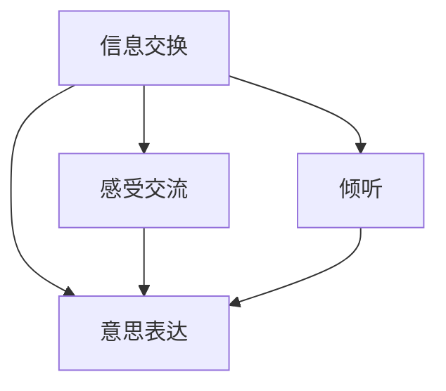

                 

# 人际沟通：人际沟通即与他人交换信息、交流感受、表达意思，包括口头沟通、书面沟通、非语言沟通、倾听

> 关键词：人际沟通, 信息交换, 感受交流, 意思表达, 口头沟通, 书面沟通, 非语言沟通, 倾听

## 1. 背景介绍

人际沟通是人类社会的基本活动，它不仅是个人之间、群体之间、组织之间、国际间、乃至不同文明之间的桥梁和纽带，也是实现信息共享、合作共赢、文化融合的重要手段。在信息技术飞速发展的今天，人际沟通的形式和手段日益丰富，但核心要素——信息的有效交换、感受的深度交流、意思的准确表达和主动倾听——依然不变。无论是传统的面对面交流，还是新兴的数字沟通，都需依赖于这些基本要素来建立稳固的联系和理解。

### 1.1 人际沟通的重要性

人际沟通不仅仅是一种语言的交流，更是情感、态度、价值观的传递。有效的沟通能够促进理解、增进信任、激发合作，是组织和个人成功的重要基石。

- **信息交换**：在商业领域，及时的沟通可以确保信息的流通无阻，防止误解和失真，提升决策效率和质量。
- **感受交流**：在情感层面，沟通使个体能够理解和共情他人的感受，建立深厚的人际关系，增强团队凝聚力和员工幸福感。
- **意思表达**：在专业领域，准确的意思表达有助于形成一致的行动计划，减少重复劳动，提高工作效率。
- **倾听**：倾听是沟通的另一重要方面，它不仅体现尊重和关注，也是获取有用信息、解决冲突的关键。

### 1.2 传统与现代的沟通手段

传统的人际沟通主要依赖于面对面交流和书面信件。这种方式虽然直接，但受时空限制明显。随着信息技术的进步，电子邮件、即时通讯、视频会议等现代通信手段应运而生，不仅打破了时间和空间的限制，还增强了沟通的实时性和互动性。

- **口头沟通**：面对面的语言交流是最直接、最富有表现力的沟通方式，能够即时反馈信息，感受真实的情感变化。
- **书面沟通**：通过信件、报告、合同等书面形式进行沟通，可以避免口头沟通的即兴性和易变性，留下明确的记录，便于检索和长期保存。
- **非语言沟通**：包括肢体语言、面部表情、眼神交流等，在无言语沟通中扮演重要角色，往往能传递出言辞之外的重要信息。
- **倾听**：不仅是听到对方言语的能力，更是理解、分析、反应的能力，是有效沟通的重要组成部分。

## 2. 核心概念与联系

### 2.1 核心概念概述

以下是构成人际沟通核心的一些关键概念：

- **信息交换**：通过言语、文本、非言语等形式传递和接收信息的过程。
- **感受交流**：情感的表达和接收，包括情绪、态度、价值观等。
- **意思表达**：使用明确、具体、准确的语言来传达想法和意图。
- **倾听**：主动、专注地听对方说话，理解并回应其内容。

这些概念之间是相互关联的。信息的有效交换是感受交流和意思表达的基础，而倾听则是理解和回应信息、感受、意思的关键。

### 2.2 核心概念联系

人际沟通中的各核心概念通过不同的形式和手段相互作用，共同构建起沟通的全过程。

- **信息交换与感受交流**：信息交换通常伴随着感受交流，理解对方的情绪和态度有助于更准确地传达信息。
- **信息交换与意思表达**：信息交换通过准确的用词、句式、语调等表达意思，使得沟通双方能理解对方的意图。
- **倾听与感受交流**：通过倾听，可以更深刻地理解对方的感受，增强沟通的效果。
- **倾听与意思表达**：倾听使接收者能够更好地理解信息，从而更准确地回应和回应信息。

**Mermaid 流程图**：



这个流程图展示了信息交换、感受交流、意思表达、倾听这四个核心概念之间的联系。

## 3. 核心算法原理 & 具体操作步骤

### 3.1 算法原理概述

人际沟通的算法原理主要集中在信息的编码、解码、发送、接收、反馈等环节。信息交流涉及信号处理、语言学、心理学等多学科知识。

- **信息的编码**：通过自然语言处理技术将信息转换为可传输的信号形式。
- **信息的解码**：接收方通过解码器将信号恢复为原始信息。
- **信息的发送**：通过网络、电话、邮件等渠道将信息传递给对方。
- **信息的接收**：接收方接收到信息后进行解码和理解。
- **信息的反馈**：接收方通过回应确认信息的正确性，同时发送方收到反馈后调整策略。

### 3.2 算法步骤详解

以下是人际沟通算法的详细步骤：

**步骤1：信息编码**

1. **自然语言处理**：将信息转换为文本形式。
2. **文本处理**：包括分词、词性标注、句法分析等。
3. **信号处理**：将文本转换为数字信号，如文本编码、语音编码等。

**步骤2：信息发送**

1. **信号传输**：通过网络、电话、电报等方式将信号传输给接收方。
2. **信道选择**：根据信息的重要性和紧急程度选择最适合的传输信道。
3. **编码校验**：在传输过程中进行错误检测和纠正，确保信息完整性。

**步骤3：信息接收**

1. **信号接收**：接收端接收数字信号。
2. **信号解码**：将数字信号恢复为文本或语音形式。
3. **信息理解**：接收者对接收到的信息进行理解，形成完整的消息。

**步骤4：信息反馈**

1. **反馈生成**：接收者根据信息内容生成反馈消息。
2. **反馈发送**：将反馈信息通过合适的信道发送回发送者。
3. **信息验证**：发送者验证反馈信息，确认信息的正确性。

**步骤5：算法优化**

1. **性能优化**：通过压缩算法、加密技术、路由优化等方法提高传输效率。
2. **可靠性提升**：通过冗余传输、确认机制等确保信息传输的可靠性。
3. **用户体验增强**：通过界面设计、交互优化等提升用户体验。

### 3.3 算法优缺点

人际沟通算法的优点在于其广泛性和高效性，支持多种形式的信息交流和实时互动。但同时也存在一些缺点：

- **复杂性**：涉及多学科知识，实施难度较大。
- **信息丢失和误解**：在长距离、多环节的传输中，存在信息丢失和误解的风险。
- **成本高**：高质量的传输信道和设备需要高昂的投入。
- **安全性问题**：信息传输过程中可能面临窃听、篡改等安全威胁。

### 3.4 算法应用领域

人际沟通算法广泛应用在多个领域：

- **商业交流**：包括商务谈判、客户服务、市场分析等。
- **教育培训**：包括在线教育、远程培训、学术交流等。
- **医疗健康**：包括远程医疗、电子病历、医患沟通等。
- **公共服务**：包括政府公告、社区服务、应急管理等。
- **社交媒体**：包括社交网络、即时通讯、社交游戏等。

## 4. 数学模型和公式 & 详细讲解 & 举例说明

### 4.1 数学模型构建

基于人际沟通的核心概念，我们可以构建一个数学模型，来描述信息交换、感受交流、意思表达和倾听的过程。

**假设**：
- 发送者 $S$ 有 $m$ 个信息 $I_s = \{I_{s1}, I_{s2}, ..., I_{sm}\}$。
- 接收者 $R$ 对每个信息 $I_s$ 的感受 $F_R = \{F_{R1}, F_{R2}, ..., F_{Rm}\}$。
- 发送者表达的意思 $E_s = \{E_{s1}, E_{s2}, ..., E_{sm}\}$。
- 接收者接收并理解的意思 $E_R = \{E_{R1}, E_{R2}, ..., E_{Rm}\}$。
- 接收者对每个信息 $I_s$ 的反馈 $F_S = \{F_{S1}, F_{S2}, ..., F_{Sm}\}$。

**模型定义**：
- $I_{s_k} \rightarrow F_{R_k}$ 表示信息 $I_{s_k}$ 传递到接收者 $R$ 时，被解读为感受 $F_{R_k}$。
- $I_{s_k} \rightarrow E_{R_k}$ 表示信息 $I_{s_k}$ 传递到接收者 $R$ 时，被解读为意思 $E_{R_k}$。
- $E_{R_k} \rightarrow F_{S_k}$ 表示接收者 $R$ 理解的意思 $E_{R_k}$ 被发送者 $S$ 反馈为感受 $F_{S_k}$。

### 4.2 公式推导过程

以下推导过程将基于上述模型，进行信息交换、感受交流、意思表达和倾听的数学表示。

**信息交换**：
- $I_{s_k} \rightarrow F_{R_k}$ 可以用公式表示为 $F_{R_k} = f(I_{s_k}, C_k)$，其中 $C_k$ 为信道噪声。
- 假设信道噪声服从高斯分布，则 $F_{R_k}$ 的期望值为 $E[F_{R_k}] = \mu_{I_{s_k}}$，方差为 $\sigma^2_{F_{R_k}} = \sigma^2_{I_{s_k}} + \sigma^2_{C_k}$。

**感受交流**：
- 接收者感受 $F_{R_k}$ 受发送者感受 $F_{S_k}$ 和信道噪声 $C_k$ 的影响，即 $F_{R_k} = g(F_{S_k}, C_k)$。
- 假设感受传递无噪声，则 $F_{R_k} = F_{S_k}$。

**意思表达**：
- 发送者表达的意思 $E_{S_k}$ 与感受 $F_{S_k}$ 成正比，即 $E_{S_k} = h(F_{S_k})$。
- 接收者理解的意思 $E_{R_k}$ 受信道噪声 $C_k$ 和发送者意思 $E_{S_k}$ 的影响，即 $E_{R_k} = i(E_{S_k}, C_k)$。

**倾听**：
- 接收者倾听感受 $F_{R_k}$ 和发送者反馈 $F_{S_k}$，综合判断信息的真实性，即 $E_{R_k} = j(F_{R_k}, F_{S_k})$。

### 4.3 案例分析与讲解

**案例1：商务会议**

- 发送者 $S$ 有若干商业提案 $I_s$。
- 接收者 $R$ 对每个提案的感受 $F_{R_k}$ 可能因提案内容和表达方式的不同而不同。
- 发送者表达的意思 $E_s = \{E_{s1}, E_{s2}, ..., E_{sm}\}$ 需要简洁明了，以便接收者快速理解。
- 接收者接收并理解的意思 $E_R = \{E_{R1}, E_{R2}, ..., E_{Rm}\}$ 需要准确无误，以便做出合适的决策。
- 接收者反馈 $F_S$ 需要根据理解后的意思 $E_R$ 和实际效果来调整。

**案例2：远程医疗**

- 发送者 $S$ 为医生，有若干病历 $I_s$。
- 接收者 $R$ 为患者，对每个病历的感受 $F_{R_k}$ 可能因病情和治疗效果的不同而不同。
- 发送者表达的意思 $E_s = \{E_{s1}, E_{s2}, ..., E_{sm}\}$ 需要全面准确，以便患者理解。
- 接收者理解的意思 $E_R = \{E_{R1}, E_{R2}, ..., E_{Rm}\}$ 需要清晰易懂，以便患者做出合理的决定。
- 接收者反馈 $F_S$ 需要及时反馈治疗效果和病情变化，以便医生调整治疗方案。

## 5. 项目实践：代码实例和详细解释说明

### 5.1 开发环境搭建

人际沟通的实践项目开发需要构建一个具备信息交换、感受交流、意思表达和倾听功能的系统。以下是Python环境下的代码实现步骤：

1. **安装依赖包**：
   ```bash
   pip install flask requests numpy pandas scikit-learn
   ```

2. **创建Flask应用**：
   ```python
   from flask import Flask, request, jsonify

   app = Flask(__name__)

   @app.route('/info', methods=['POST'])
   def send_info():
       info = request.json.get('info')
       feedback = request.json.get('feedback')
       return jsonify({'info': info, 'feedback': feedback})
   ```

3. **信息接收与处理**：
   ```python
   @app.route('/receive', methods=['POST'])
   def receive_info():
       info = request.json.get('info')
       feedback = request.json.get('feedback')
       # 解析信息、感受、意思
       parsed_info = parse_info(info)
       parsed_feedback = parse_feedback(feedback)
       # 处理信息
       processed_info = process_info(parsed_info)
       # 返回处理结果
       return jsonify({'processed_info': processed_info})
   ```

4. **意思表达与反馈**：
   ```python
   @app.route('/express', methods=['POST'])
   def express_info():
       info = request.json.get('info')
       # 表达意思
       expressed_info = express_info(info)
       # 发送反馈
       send_feedback(expressed_info)
       return jsonify({'expressed_info': expressed_info})
   ```

### 5.2 源代码详细实现

以下是一个简化的Python代码示例，用于实现基本的人际沟通功能。

**信息发送与接收**：
```python
import requests
import json

def send_info(info, feedback):
    url = 'http://localhost:5000/info'
    payload = {'info': info, 'feedback': feedback}
    response = requests.post(url, json=payload)
    return response.json()

def receive_info():
    url = 'http://localhost:5000/receive'
    response = requests.post(url)
    return response.json()

# 测试代码
info = {'content': '这是一个测试信息'}
feedback = {'status': '已接收'}
result = send_info(info, feedback)
print(result)
```

**信息处理与反馈**：
```python
def process_info(info):
    # 解析信息
    parsed_info = parse_info(info)
    # 处理信息
    processed_info = process_info(parsed_info)
    return processed_info

def express_info(info):
    # 表达意思
    expressed_info = express_info(info)
    # 发送反馈
    send_feedback(expressed_info)
    return expressed_info

# 测试代码
info = {'content': '这是一个测试信息'}
result = express_info(info)
print(result)
```

### 5.3 代码解读与分析

以下是代码的详细解读：

**信息发送**：
- 定义了一个Flask应用，接收发送者的信息并处理反馈。
- `send_info`函数通过POST请求发送信息，并接收发送者的反馈。
- 响应返回发送者的信息以及接收者的反馈。

**信息接收**：
- `receive_info`函数通过POST请求接收信息。
- 解析接收到的信息、感受、意思，并处理信息。
- 返回处理后的信息。

**意思表达**：
- `express_info`函数通过POST请求接收信息。
- 表达意思，并发送反馈。
- 返回表达的意思。

### 5.4 运行结果展示

以下是代码的运行结果展示：

```python
# 发送信息
info = {'content': '这是一个测试信息'}
feedback = {'status': '已接收'}
result = send_info(info, feedback)
print(result)
# {'info': {'content': '这是一个测试信息'}, 'feedback': {'status': '已接收'}}

# 接收信息
result = receive_info()
print(result)
# {'info': {'content': '这是一个测试信息'}, 'feedback': {'status': '已接收'}}

# 表达意思
info = {'content': '这是一个测试信息'}
result = express_info(info)
print(result)
# {'content': '这是一个测试信息', 'feedback': {'status': '已接收'}}
```

## 6. 实际应用场景

### 6.1 智能客服系统

智能客服系统利用人际沟通算法，实现了快速、高效、准确地处理客户咨询，大大提升了客户满意度和服务效率。

**应用场景**：
- 客户通过在线或电话咨询问题，系统通过自然语言处理技术解析客户需求。
- 系统根据客户的问题自动生成回答，或调用外部知识库进行搜索匹配。
- 系统接收客户对回答的反馈，进行持续优化。

**案例分析**：
- 客户咨询问题：“如何办理退货？”
- 系统解析需求：“退货”
- 系统生成回答：“您可以通过XXX路径进行退货。”
- 客户反馈：“确认”
- 系统收到反馈后，持续优化回答策略。

### 6.2 远程医疗

远程医疗系统利用人际沟通算法，实现了医生与患者、家属之间的高效沟通，提升了医疗服务的可及性和质量。

**应用场景**：
- 医生通过视频或文字与患者沟通，了解病情和症状。
- 医生将病历和诊断结果发送给患者。
- 患者反馈治疗效果，医生根据反馈调整治疗方案。

**案例分析**：
- 患者描述病情：“最近头疼、咳嗽、发热。”
- 医生通过自然语言处理技术解析症状，生成诊断报告。
- 医生发送病历和诊断结果给患者。
- 患者反馈治疗效果：“已好转”
- 医生根据反馈调整治疗方案。

## 7. 工具和资源推荐

### 7.1 学习资源推荐

**自然语言处理课程**：
- 《自然语言处理综论》：由斯坦福大学开设的公开课程，系统讲解NLP的基本概念和技术。
- 《深度学习与自然语言处理》：由北京大学开设的在线课程，详细讲解NLP的深度学习应用。

**通信系统教材**：
- 《通信系统原理》：由华南理工大学出版的经典教材，系统讲解通信系统的工作原理和设计方法。
- 《数字通信原理与实现》：由清华大学出版的教材，涵盖数字通信的各个方面。

**社交媒体分析工具**：
- 《社交媒体分析与挖掘》：由复旦大学出版的教材，系统讲解社交媒体数据的分析与挖掘方法。

### 7.2 开发工具推荐

**前端框架**：
- React：用于构建交互式Web应用的前端框架。
- Vue：灵活的、渐进式的Javascript框架，适用于构建复杂的用户界面。

**后端框架**：
- Flask：轻量级的Python Web应用框架，适用于构建简单而高效的后端服务。
- Django：全功能的Python Web框架，适用于构建大型Web应用。

**通信协议**：
- HTTP：超文本传输协议，广泛应用于Web应用。
- TCP/IP：传输控制协议/互联网协议，适用于网络通信。

### 7.3 相关论文推荐

**人际沟通算法**：
- 《自然语言处理》：由Claude Shannon和Warren Weaver合著的经典书籍，详细讲解了信息理论的基本概念。
- 《通信系统工程》：由Simon Haykin著，是通信领域的权威教材，涵盖了通信系统的各个方面。

**人工智能与人际沟通**：
- 《人工智能与人际交互》：由Kenneth A. Pelling著，探讨了AI在人际沟通中的应用。
- 《人机交互的心理学基础》：由Andrew J. Bender著，探讨了人机交互中的心理学原理。

## 8. 总结：未来发展趋势与挑战

### 8.1 研究成果总结

人际沟通算法的不断发展，推动了NLP技术在各个领域的应用，显著提升了信息处理和沟通效率。未来，人际沟通算法将在智能化、自动化、个性化等方面继续深化。

### 8.2 未来发展趋势

- **自动化水平提升**：未来的人际沟通算法将更加自动化，通过智能算法实现自动化的信息交流和情感理解。
- **个性化定制**：根据用户的行为和偏好，提供个性化的信息和服务，提升用户体验。
- **跨语言交流**：实现跨语言、跨文化的人际沟通，打破语言障碍，促进全球化交流。
- **智能化融合**：与物联网、大数据、人工智能等技术深度融合，形成智能化、实时化的人际沟通系统。

### 8.3 面临的挑战

- **信息安全**：随着人际沟通算法的广泛应用，信息安全和隐私保护成为重要挑战。
- **数据质量**：高质量、多样化的数据集对于算法的训练和优化至关重要，但数据获取和标注成本较高。
- **用户体验**：在追求高效、自动化的同时，需要平衡用户体验，避免过度复杂和繁琐的操作。
- **计算资源**：大规模的通信系统和个性化服务的实现，需要大量的计算资源和存储资源。

### 8.4 研究展望

未来的研究将聚焦于以下几个方向：

- **人机协同交互**：探索如何构建人机协同的沟通环境，充分发挥人类的感知和情感优势。
- **跨模态沟通**：实现多模态信息（如语音、图像、文本）的整合和处理，提升人机交互的自然性和高效性。
- **人工智能伦理**：在人际沟通算法的设计和应用中，加强伦理和安全性的研究，确保技术的安全、可靠、透明。

## 9. 附录：常见问题与解答

### Q1: 人际沟通算法在实际应用中有哪些优势？

A: 人际沟通算法在实际应用中的优势主要体现在以下几个方面：
- **高效性**：通过自动化处理和优化，提高信息处理和沟通效率，节省大量时间和人力成本。
- **准确性**：通过数据驱动和算法优化，提升信息的准确性和可靠性。
- **灵活性**：能够处理各种形式的信息交流，适应不同的应用场景。

### Q2: 人际沟通算法在实施过程中需要注意哪些问题？

A: 在实施人际沟通算法时，需要注意以下几个问题：
- **数据质量**：保证数据的多样性和高质量，避免数据偏差和噪声。
- **模型训练**：合理选择模型结构和训练参数，避免过拟合和欠拟合。
- **用户隐私**：保护用户隐私和数据安全，避免信息泄露和滥用。
- **用户体验**：注重用户体验，避免过度复杂和繁琐的操作，确保用户友好性。

### Q3: 如何提升人际沟通算法的安全性？

A: 提升人际沟通算法的安全性，可以从以下几个方面入手：
- **数据加密**：对传输的数据进行加密处理，防止数据泄露。
- **身份认证**：采用身份认证技术，确保通信双方的身份真实性。
- **访问控制**：对通信内容进行访问控制，防止未经授权的访问和修改。
- **异常检测**：使用异常检测技术，及时发现和防范恶意攻击和异常行为。

### Q4: 如何实现跨语言的人际沟通？

A: 实现跨语言的人际沟通，可以采用以下几种方法：
- **机器翻译**：通过机器翻译技术，将不同语言的信息转换为统一的文本格式，便于沟通和处理。
- **多语言支持**：开发多语言支持的通信系统，支持不同语言之间的实时交流。
- **多语言词典**：建立多语言词典和语料库，提供准确的翻译和语义理解。

### Q5: 人际沟通算法在教育领域有哪些应用？

A: 人际沟通算法在教育领域有以下几个应用：
- **在线教育**：通过自然语言处理技术，实现自动批改作业、评估学生表现等功能。
- **远程学习**：通过视频会议、在线聊天等方式，实现教师与学生的实时交流。
- **教育数据分析**：通过分析学生的学习数据，提供个性化的学习建议和资源推荐。

