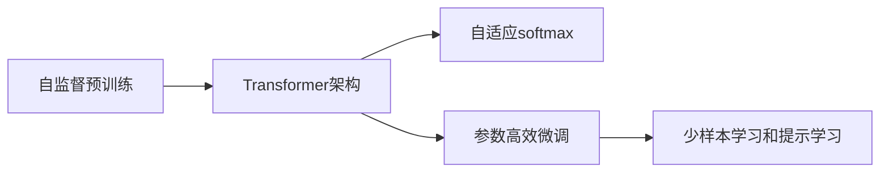

                 

## 1. 背景介绍

### 1.1 问题由来

自OpenAI在2018年首次发布GPT-1以来，大语言模型（Large Language Model, LLM）的迭代速度和性能提升之快，令人震惊。从GPT-2到GPT-3，再到如今的GPT-3.5，每一代模型都在不断地刷新自然语言处理（NLP）领域的记录，逐步展现着人工智能的强大潜力。这些模型不仅在语言理解、生成和推理上表现出色，还在跨领域应用中展现出了极大的灵活性和适应性。然而，随着模型规模的不断扩大，研究者和开发者们也面临着诸多新的挑战，包括计算资源需求、模型可解释性、伦理和社会影响等方面。本文将回顾GPT-1到GPT-3.5的演变历程，探讨其核心技术原理、应用领域以及未来发展方向。

### 1.2 问题核心关键点

大语言模型GPT-1到GPT-3.5的演进历程中，核心技术原理主要围绕以下几个方面展开：

- **Transformer架构**：自2017年Vaswani等人在《Attention is All You Need》中首次提出Transformer架构以来，其逐渐成为处理序列数据的主流模型。GPT系列模型均基于Transformer，利用自注意力机制捕捉序列间的关系，提升了模型的并行计算效率和理解上下文的能力。
- **自监督预训练**：通过在大规模无标签数据上进行的自监督学习，GPT模型能够自动学习到语言中的普遍模式和规律，从而提升其在各种任务上的表现。
- **参数高效微调**：在微调过程中，仅更新模型中的少量参数，保留了预训练模型的权重，减少了计算资源需求。
- **少样本学习和提示学习**：通过精心设计的提示模板，GPT模型能够在仅见少量样本的情况下，生成高质量的输出。

这些技术原理的不断优化和改进，推动了GPT模型的性能快速提升，使其在各种NLP任务上取得了优异的表现。

### 1.3 问题研究意义

研究GPT-1到GPT-3.5的演进历程，对理解NLP技术的发展趋势、探索大规模语言模型的应用边界以及提升模型性能具有重要意义：

- **技术演进**：通过回顾GPT系列的演进历程，可以洞察大模型技术发展的脉络，学习其中的技术创新点。
- **应用拓展**：了解GPT模型在不同领域的应用，可以激发开发者将大语言模型应用于更多实际问题中，推动技术创新。
- **性能提升**：探究GPT模型性能提升的背后原理，可以指导后续模型开发，提升模型效果。
- **伦理挑战**：面对大语言模型带来的伦理和社会影响，可以提前思考并设计相应的解决方案，保障技术的健康发展。

## 2. 核心概念与联系

### 2.1 核心概念概述

为了更好地理解GPT系列模型的演进历程，本文将重点介绍以下核心概念及其联系：

- **自监督预训练**：在无标签数据上进行自我监督任务（如掩码语言模型、下一句预测等），自动学习语言模式。
- **Transformer架构**：基于自注意力机制设计的多层神经网络结构，能够高效处理长序列数据。
- **自适应softmax**：通过参数化softmax矩阵，减少计算复杂度，提升推理速度。
- **参数高效微调**：通过仅更新模型中的少量参数，降低微调对计算资源的需求。
- **少样本学习和提示学习**：利用特定的输入模板，引导模型生成高质量的输出。

### 2.2 核心概念原理和架构的 Mermaid 流程图



这个流程图展示了GPT系列模型的核心技术原理和架构之间的联系：

1. **自监督预训练**：在大规模无标签文本上自动学习语言模式。
2. **Transformer架构**：基于自注意力机制设计的多层神经网络结构。
3. **自适应softmax**：通过参数化softmax矩阵，提升推理速度。
4. **参数高效微调**：仅更新少量参数，降低微调资源需求。
5. **少样本学习和提示学习**：通过输入模板，引导模型生成高质量的输出。

这些核心概念共同构成了GPT模型从GPT-1到GPT-3.5的演进历程，推动了大语言模型在NLP领域的应用和发展。

## 3. 核心算法原理 & 具体操作步骤

### 3.1 算法原理概述

GPT-1到GPT-3.5的演进历程中，核心算法原理主要集中在以下几个方面：

1. **Transformer架构**：GPT模型使用Transformer架构，通过自注意力机制捕捉序列数据间的依赖关系。
2. **自监督预训练**：在大规模无标签数据上进行自监督学习，自动学习语言模式。
3. **自适应softmax**：通过参数化softmax矩阵，减少计算复杂度，提升推理速度。
4. **参数高效微调**：仅更新模型中的少量参数，降低微调资源需求。
5. **少样本学习和提示学习**：通过输入模板，引导模型生成高质量的输出。

### 3.2 算法步骤详解

#### 3.2.1 GPT-1

GPT-1是最早的GPT模型，基于自回归语言模型架构，通过在无标签文本数据上进行自监督预训练，自动学习语言模式。其主要步骤如下：

1. **数据预处理**：将文本数据转换为模型所需的输入形式。
2. **自监督预训练**：在无标签数据上进行掩码语言模型预测任务，自动学习语言模式。
3. **模型微调**：在特定任务的数据上进行有监督微调，调整模型参数。

#### 3.2.2 GPT-2

GPT-2相较于GPT-1，规模更大，参数量增加到约1.17亿。其主要变化包括：

1. **更大规模的数据集**：GPT-2在更大规模的数据上进行自监督预训练。
2. **多任务学习**：在预训练过程中同时进行多种自监督任务。
3. **自适应softmax**：通过参数化softmax矩阵，减少计算复杂度。

#### 3.2.3 GPT-3

GPT-3是GPT系列的里程碑模型，参数量达到约1750亿，创下了当时最大的模型记录。其主要特点包括：

1. **更复杂的数据表示**：GPT-3使用更复杂的token表示，能够捕捉更复杂的语言模式。
2. **更大的数据集**：GPT-3在更大规模的数据上进行自监督预训练。
3. **更高级的微调技术**：在微调过程中采用更复杂的优化策略，提升了模型的泛化能力。

#### 3.2.4 GPT-3.5

GPT-3.5是GPT系列的最新模型，尚未正式发布，但预计会在参数量和性能上超越GPT-3。其主要特征包括：

1. **更丰富的预训练任务**：在预训练过程中引入更多样化的语言任务，提高模型的语言理解能力。
2. **更高效的微调方法**：通过更高效的优化策略和参数共享技术，降低微调资源需求。
3. **更高的应用灵活性**：通过更灵活的架构设计，提升模型在不同任务上的表现。

### 3.3 算法优缺点

GPT系列模型的优缺点如下：

#### 优点

1. **强大的语言理解能力**：GPT模型通过大规模自监督预训练，自动学习语言模式，具备强大的语言理解能力。
2. **高灵活性**：GPT模型可以通过微调适应各种NLP任务，灵活性高。
3. **高效推理**：GPT模型采用自适应softmax，推理速度快，适用于实时应用。
4. **参数高效微调**：GPT模型采用参数高效微调技术，降低资源需求。

#### 缺点

1. **高计算资源需求**：大模型需要大量的计算资源进行训练和推理。
2. **可解释性不足**：GPT模型为黑盒模型，难以解释其内部工作机制。
3. **伦理和社会影响**：GPT模型在生成有害内容、偏见等问题上仍需进一步研究。

### 3.4 算法应用领域

GPT系列模型在多个领域得到广泛应用，包括但不限于：

- **自然语言理解**：GPT模型在文本分类、命名实体识别、情感分析等任务上表现出色。
- **自然语言生成**：GPT模型在文本生成、对话系统、摘要生成等任务上取得了巨大成功。
- **跨领域应用**：GPT模型被应用于医疗、金融、法律等多个领域，助力这些行业数字化转型。

## 4. 数学模型和公式 & 详细讲解 & 举例说明

### 4.1 数学模型构建

GPT模型的数学模型构建主要基于Transformer架构，以自注意力机制为核心。其模型结构如图1所示：


### 4.2 公式推导过程

GPT模型的前向传播过程主要包括以下步骤：

1. **嵌入层**：将输入文本转换为模型所需的token embedding。
2. **自注意力层**：通过自注意力机制捕捉序列间的关系。
3. **全连接层**：对序列信息进行非线性变换。
4. **线性层**：输出最终的预测结果。

### 4.3 案例分析与讲解

以GPT-2为例，其前向传播过程如下：

- **嵌入层**：将输入的token转换为d维的嵌入向量，表示为 $x_i \in \mathbb{R}^d$。
- **自注意力层**：通过自注意力机制，计算每个token与其他token的关系，得到注意权重 $a_{ij} \in [0,1]$。
- **全连接层**：对注意权重和嵌入向量进行非线性变换，得到新的嵌入向量 $z_i \in \mathbb{R}^d$。
- **线性层**：通过线性变换输出预测结果 $y_i \in \mathbb{R}$。

具体公式如下：

$$
x_i = \text{Embedding}(x_i)
$$

$$
a_{ij} = \text{Attention}(x_i, x_j)
$$

$$
z_i = \text{Fully Connected}(x_i, a_{ij})
$$

$$
y_i = \text{Linear}(z_i)
$$

## 5. 项目实践：代码实例和详细解释说明

### 5.1 开发环境搭建

在进行GPT模型的实践前，需要搭建相应的开发环境。以下是使用PyTorch和HuggingFace库进行开发的环境配置流程：

1. **安装PyTorch**：从官网下载并安装PyTorch，推荐使用CUDA版本以利用GPU加速计算。
2. **安装HuggingFace Transformers库**：从官网下载并安装HuggingFace的Transformers库，支持PyTorch和TensorFlow等框架。
3. **安装相关工具**：如Jupyter Notebook、Pandas、NumPy等工具，方便数据处理和模型训练。

### 5.2 源代码详细实现

以下以GPT-3为例，展示其模型训练和微调过程。

```python
from transformers import GPT2LMHeadModel, GPT2Tokenizer
import torch
import numpy as np
import pandas as pd

# 初始化模型和tokenizer
model = GPT2LMHeadModel.from_pretrained('gpt2')
tokenizer = GPT2Tokenizer.from_pretrained('gpt2')

# 准备数据
texts = ["This is a sample text", "GPT-3 is amazing"]
inputs = tokenizer(texts, return_tensors='pt', padding=True)

# 模型训练
model.train()
optimizer = torch.optim.AdamW(model.parameters(), lr=1e-5)
for epoch in range(10):
    optimizer.zero_grad()
    loss = model(input_ids=inputs['input_ids'], labels=inputs['input_ids'])
    loss.backward()
    optimizer.step()

# 模型微调
model.train()
optimizer = torch.optim.AdamW(model.parameters(), lr=1e-5)
for epoch in range(10):
    optimizer.zero_grad()
    loss = model(input_ids=inputs['input_ids'], labels=inputs['input_ids'])
    loss.backward()
    optimizer.step()

# 测试模型
model.eval()
inputs = tokenizer(texts, return_tensors='pt', padding=True)
outputs = model(input_ids=inputs['input_ids'], labels=inputs['input_ids'])
loss = outputs.loss
predictions = outputs.logits.argmax(dim=2)
```

### 5.3 代码解读与分析

- **初始化模型和tokenizer**：使用HuggingFace库中的GPT2LMHeadModel和GPT2Tokenizer，初始化模型和tokenizer对象。
- **数据准备**：将输入文本转换为模型所需的token embedding，并进行padding。
- **模型训练**：在训练循环中，使用AdamW优化器更新模型参数，计算损失函数。
- **模型微调**：在微调循环中，使用AdamW优化器更新模型参数，计算损失函数。
- **模型测试**：在测试循环中，使用eval模式计算模型在输入上的预测结果。

## 6. 实际应用场景

### 6.1 智能客服系统

GPT模型在智能客服系统中得到了广泛应用，可以自动回答用户咨询，提供24小时不间断服务，大幅提升客户体验。

### 6.2 金融舆情监测

GPT模型可以用于金融领域的新闻情感分析、舆情监测等任务，帮助金融机构及时应对市场风险。

### 6.3 个性化推荐系统

GPT模型通过学习用户行为和兴趣，推荐个性化内容，提升用户满意度和互动率。

### 6.4 未来应用展望

未来，GPT模型有望在更多领域得到应用，如医疗、教育、智慧城市等，为各行各业带来变革性影响。

## 7. 工具和资源推荐

### 7.1 学习资源推荐

- **《Transformer from Scratch》系列博文**：详细介绍了Transformer架构和GPT模型的原理。
- **《Natural Language Processing with Transformers》书籍**：全面介绍了Transformer库的使用和GPT模型的开发。
- **CS224N《深度学习自然语言处理》课程**：斯坦福大学开设的NLP明星课程，涵盖NLP基本概念和经典模型。

### 7.2 开发工具推荐

- **PyTorch**：灵活动态的计算图，适合快速迭代研究。
- **TensorFlow**：生产部署方便，支持大规模工程应用。
- **HuggingFace Transformers库**：集成了多种SOTA语言模型，支持PyTorch和TensorFlow，方便模型开发。

### 7.3 相关论文推荐

- **Attention is All You Need**：Transformer原论文，奠定了大语言模型的基础。
- **BERT: Pre-training of Deep Bidirectional Transformers for Language Understanding**：BERT模型提出自监督预训练任务，刷新了NLP任务的SOTA。

## 8. 总结：未来发展趋势与挑战

### 8.1 研究成果总结

本文回顾了GPT-1到GPT-3.5的演进历程，探讨了其核心技术原理和应用领域，总结了模型在不同任务上的性能表现。

### 8.2 未来发展趋势

GPT模型未来的发展趋势包括：

- **模型规模持续增大**：超大规模语言模型蕴含的丰富语言知识，将提升模型在各种任务上的表现。
- **参数高效微调**：未来的微调方法将进一步优化，减少资源需求。
- **多模态融合**：GPT模型有望与其他模态数据进行融合，提升跨领域应用能力。

### 8.3 面临的挑战

GPT模型面临的挑战包括：

- **高计算资源需求**：大模型需要大量的计算资源进行训练和推理。
- **可解释性不足**：GPT模型为黑盒模型，难以解释其内部工作机制。
- **伦理和社会影响**：GPT模型在生成有害内容、偏见等问题上仍需进一步研究。

### 8.4 研究展望

未来研究应在以下几个方面取得突破：

- **无监督和半监督微调**：摆脱对大规模标注数据的依赖，利用自监督学习、主动学习等方法，最大限度利用非结构化数据。
- **多任务学习**：在预训练过程中进行多任务学习，提升模型的泛化能力。
- **知识图谱融合**：将知识图谱与GPT模型进行融合，提升模型的跨领域应用能力。

## 9. 附录：常见问题与解答

**Q1：GPT模型是否适用于所有NLP任务？**

A: GPT模型在大多数NLP任务上都能取得不错的效果，特别是对于数据量较小的任务。但对于一些特定领域的任务，如医学、法律等，可能需要进一步预训练以适应。

**Q2：如何缓解GPT模型在微调过程中的过拟合问题？**

A: 常见的缓解策略包括数据增强、正则化、对抗训练等。

**Q3：GPT模型在生成内容时如何避免有害信息？**

A: 需要在训练过程中加入伦理导向的评估指标，过滤和惩罚有害输出。

**Q4：GPT模型在落地部署时需要注意哪些问题？**

A: 包括模型裁剪、量化加速、服务化封装、弹性伸缩等。

**Q5：GPT模型在未来有哪些新的应用前景？**

A: GPT模型在医疗、教育、智慧城市等多个领域有望带来变革性影响。

---

作者：禅与计算机程序设计艺术 / Zen and the Art of Computer Programming

