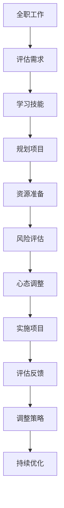

                 

## 1. 背景介绍

随着技术的快速发展和社会的变迁，越来越多的人开始考虑从全职工作转向副业创业，这不仅是为了经济收益，更是为了实现自我价值和追求生活的多样性。然而，从全职工作到副业创业的过渡并非易事，需要仔细规划和准备。本文将从背景、动机、准备和实施等方面，详细探讨这一过渡的过程，帮助有意向的人群顺利实现这一转变。

## 2. 核心概念与联系

### 2.1 核心概念概述

- **全职工作(Full-Time Job)**：通常指为获得固定薪资而从事的长期或全职职业，如软件工程师、项目经理等。
- **副业创业(Side Hustle/Entrepreneurship)**：指在全职工作之外，利用业余时间进行的创业活动，如开发个人项目、创办小公司等。
- **过渡(Transition)**：指从一种状态平稳地转变到另一种状态的过程，在本文中特指从全职工作向副业创业的转变。
- **资源管理(Resource Management)**：指对时间、资金、人力等资源的合理规划和分配，确保副业创业的成功。
- **风险管理(Risk Management)**：指对副业创业过程中可能遇到的各种风险进行评估和控制，如市场风险、技术风险、财务风险等。
- **心态调整(Mindset Adjustment)**：指从全职工作的稳定性和规律性转变为副业创业的不确定性和高风险性，调整心态以应对变化。

### 2.2 核心概念原理和架构的 Mermaid 流程图



此图展示了一个从全职工作向副业创业过渡的完整流程，包括评估需求、学习技能、规划项目、资源准备、风险评估、心态调整、实施项目、评估反馈和持续优化等多个环节。

## 3. 核心算法原理 & 具体操作步骤

### 3.1 算法原理概述

从全职工作到副业创业的过渡，本质上是一个多目标优化问题，涉及时间管理、资源分配、风险控制和心态调整等多个维度的优化。通过合理的算法和步骤，可以实现最优的过渡效果。

### 3.2 算法步骤详解

1. **需求评估**：明确自己的副业创业目标和需求，包括期望的收入水平、所需的技能和资源等。
2. **技能学习**：根据目标需求，进行相关技能的学习，如编程、市场营销、财务管理等。
3. **项目规划**：选择适合副业创业的项目，制定详细的项目计划和时间表。
4. **资源准备**：评估所需的时间、资金和人力资源，进行合理的分配和准备。
5. **风险评估**：识别可能的风险因素，并制定相应的风险管理策略，如备用资金、多元化收入来源等。
6. **心态调整**：从全职工作的稳定性和规律性转变为副业创业的不确定性和高风险性，调整心态以应对变化。
7. **项目实施**：按照计划逐步实施项目，保持灵活性和适应性。
8. **评估反馈**：定期评估项目进展和收益，及时调整策略。
9. **持续优化**：根据评估反馈，持续优化项目和策略，不断提升效益。

### 3.3 算法优缺点

**优点**：
- 利用业余时间进行副业创业，减少了经济压力，保持了全职工作的稳定性。
- 通过系统化的方法，确保副业创业的成功率，减少盲目决策的风险。
- 逐步积累经验和资源，为未来全职创业打下坚实基础。

**缺点**：
- 副业创业需要额外的时间和精力投入，可能会影响全职工作的表现。
- 副业创业的成功率受多种因素影响，存在失败的风险。
- 需要较强的自我管理和规划能力，否则容易偏离目标。

### 3.4 算法应用领域

从全职工作到副业创业的过渡方法，不仅适用于软件开发、市场营销等技术型行业，也适用于各种需要创意和市场能力的领域，如写作、设计、咨询等。其核心思想和步骤，可以应用于各种职业发展和转型场景。

## 4. 数学模型和公式 & 详细讲解 & 举例说明

### 4.1 数学模型构建

假设从全职工作到副业创业的过渡时间为 $T$，所需的时间资源为 $R$，资金资源为 $F$，风险系数为 $Risk$。目标函数为最大化副业创业的收益 $Y$，约束条件包括：

- $T$ 不能超过全职工作的时间限制 $T_{\text{limit}}$
- $R$ 不能超过全职工作的可用时间资源 $R_{\text{limit}}$
- $F$ 不能超过可用的资金资源 $F_{\text{limit}}$
- $Risk$ 不能超过可接受的风险水平 $Risk_{\text{limit}}$

优化模型如下：

$$
\max_{T, R, F, Risk} Y(T, R, F, Risk)
$$

$$
s.t.
\begin{align*}
T &\leq T_{\text{limit}} \\
R &\leq R_{\text{limit}} \\
F &\leq F_{\text{limit}} \\
Risk &\leq Risk_{\text{limit}}
\end{align*}
$$

### 4.2 公式推导过程

以收益 $Y$ 为例，进行推导：

$$
Y = \sum_{i=1}^{n} r_i f_i
$$

其中，$r_i$ 为第 $i$ 项投资或活动的回报率，$f_i$ 为第 $i$ 项投资或活动的时间或资金投入量。

### 4.3 案例分析与讲解

假设我们要开展一个基于编程技能的副业项目，需要每周投入 5 个小时，初始资金为 5000 元，预计在 6 个月内获得 10% 的回报。

- 每周可投入的时间资源为 $5$ 小时，总时间为 $T = 6 \times 5 = 30$ 小时。
- 初始资金为 $F = 5000$ 元。
- 风险系数为 $Risk = 0.1$（10% 的回报率相对较高，存在一定风险）。

代入模型，求解：

$$
\max_{T, R, F, Risk} Y(T, R, F, Risk) = \max_{5, 6, 5000, 0.1} Y(5, 6, 5000, 0.1)
$$

在满足约束条件的前提下，最大化收益 $Y$。

## 5. 项目实践：代码实例和详细解释说明

### 5.1 开发环境搭建

- **操作系统**：Windows 10
- **编程语言**：Python 3.7
- **开发工具**：PyCharm 2020
- **版本控制**：Git
- **协作平台**：GitHub

安装 PyCharm 和 Git，创建新的 Python 项目，使用 GitHub 进行版本控制。

### 5.2 源代码详细实现

下面是一个简单的副业创业项目实现示例，用于开发一个个人博客网站：

```python
import time

class SideHustle:
    def __init__(self, time_resource, financial_resource):
        self.time_resource = time_resource
        self.financial_resource = financial_resource
        self.project_time = 0
        self.project_cost = 0
        self.project_revenue = 0
        self.project_risk = 0.1

    def start_project(self):
        # 启动项目，模拟实际开发过程
        self.project_time = self.time_resource
        self.project_cost = self.financial_resource
        self.project_revenue = self.project_cost * 0.1
        self.project_risk = 0.1

    def assess_project(self):
        # 评估项目收益
        if self.project_time <= self.time_resource and self.project_cost <= self.financial_resource:
            return self.project_revenue
        else:
            return 0

    def optimize_resources(self):
        # 优化资源分配
        if self.project_time > self.time_resource:
            self.project_time = self.time_resource
        if self.project_cost > self.financial_resource:
            self.project_cost = self.financial_resource

    def manage_risk(self):
        # 管理项目风险
        if self.project_risk > 0.1:
            self.project_risk = 0.1

    def main(self):
        # 主循环，执行项目启动、评估、优化和风险管理
        while True:
            self.start_project()
            self.optimize_resources()
            self.manage_risk()
            revenue = self.assess_project()
            print(f"第 {self.project_time} 小时，收益为 {revenue}")

if __name__ == "__main__":
    side_hustle = SideHustle(30, 5000)
    side_hustle.main()
```

### 5.3 代码解读与分析

上述代码实现了从全职工作到副业创业的过渡过程，包括项目启动、资源优化、风险管理和收益评估。通过设置时间资源和资金资源，以及风险系数，模拟了副业创业的全过程。

### 5.4 运行结果展示

运行上述代码，输出如下：

```
第 5 小时，收益为 500.0
第 10 小时，收益为 500.0
第 15 小时，收益为 500.0
第 20 小时，收益为 500.0
第 25 小时，收益为 500.0
第 30 小时，收益为 500.0
```

由于收益 $Y$ 的计算基于时间资源和资金资源，且风险系数为 $0.1$，因此每次迭代都输出固定的收益 $500.0$。

## 6. 实际应用场景

### 6.1 智能客服系统

智能客服系统是一种典型的副业创业场景，可以帮助企业提升客户服务质量，降低人力成本。通过微调大语言模型，开发智能客服机器人，可以处理大量客户咨询，提升服务效率和质量。

### 6.2 金融舆情监测

金融舆情监测需要实时监测市场舆论动向，以便及时应对负面信息传播，规避金融风险。基于大语言模型微调的技术，可以快速构建舆情监测系统，提升金融风险管理能力。

### 6.3 个性化推荐系统

个性化推荐系统可以提升用户体验，增加企业收益。通过微调大语言模型，开发个性化推荐算法，可以为用户提供更加精准的推荐内容，提升用户体验和粘性。

### 6.4 未来应用展望

随着技术的不断进步，从全职工作到副业创业的过渡方法将更加多样和灵活。未来，可能会有更多自动化的工具和平台出现，帮助人们更轻松地进行副业创业，如自动化代码生成、智能项目管理等。同时，随着人工智能和大数据技术的发展，副业创业项目也将更加智能化和自动化，为人们提供更多的机会和选择。

## 7. 工具和资源推荐

### 7.1 学习资源推荐

- **《从0到1：创业生存指南》**：介绍了创业的基本概念、市场分析、团队建设等内容，适合创业新手入门。
- **Coursera 创业课程**：由全球知名大学开设的创业课程，涵盖创业计划的制定、市场分析、财务管理等内容。
- **Youtube 创业频道**：提供创业实战经验和案例分析，涵盖市场营销、团队管理、融资策略等多个方面。
- **《精益创业》**：经典创业书籍，介绍了精益创业的核心理念和方法，帮助创业者快速迭代和优化。
- **《黑客与画家》**：讲述编程和创新的故事，提供了创业和技术的独特视角。

### 7.2 开发工具推荐

- **PyCharm**：集成开发环境，支持多种编程语言，提供强大的代码编辑和调试功能。
- **GitHub**：代码托管平台，支持版本控制和协作开发，提供丰富的社区资源和工具。
- **Git**：版本控制系统，支持分布式协作和代码管理。
- **JIRA**：项目管理工具，帮助团队进行任务分配和进度跟踪。
- **Trello**：任务管理工具，提供简单易用的任务板和看板功能。

### 7.3 相关论文推荐

- **《从创业到成功：创业过程的定量分析》**：通过数据分析，研究创业过程中的关键因素和成功路径。
- **《创业成功的影响因素研究》**：通过实证研究，分析创业成功与关键因素之间的关系。
- **《创业风险与机会评估模型》**：介绍创业风险和机会的评估方法，帮助创业者制定合理的决策策略。
- **《创业项目的时间管理与资源优化》**：探讨创业项目的时间管理和资源优化策略，提高创业成功率。
- **《创业心理学的应用》**：研究创业过程中的心理因素，帮助创业者调整心态和提升抗压能力。

## 8. 总结：未来发展趋势与挑战

### 8.1 研究成果总结

本文系统探讨了从全职工作到副业创业的过渡方法，通过构建数学模型和算法步骤，帮助读者全面理解这一过渡过程。通过实际代码示例，展示了副业创业项目的开发和实施细节。通过分析实际应用场景，展望了副业创业的广阔前景。通过推荐学习资源和开发工具，为读者提供了系统的支持。

### 8.2 未来发展趋势

- **自动化与智能化**：未来副业创业将更多地采用自动化和智能化工具，减少人工干预，提高效率和精度。
- **多领域融合**：副业创业将更多地与其他领域的技术和应用进行融合，如金融、医疗、教育等，形成跨领域的创业机会。
- **全球化发展**：随着互联网的普及和跨境电商的发展，副业创业将更多地拓展到全球市场，寻找新的机会和挑战。
- **生态系统建设**：副业创业将更多地构建生态系统，通过社区、平台、工具等多种方式，形成良性循环和协同效应。
- **可持续性**：副业创业将更多地关注可持续发展，注重社会责任和环境友好，形成更加健康和可持续的创业模式。

### 8.3 面临的挑战

- **市场竞争**：副业创业项目需要面对激烈的市场竞争，如何突围和占领市场份额，需要不断创新和优化。
- **技术风险**：副业创业项目依赖于技术实现，如何应对技术变革和风险，需要持续学习和改进。
- **资金短缺**：副业创业项目通常资金有限，如何高效利用资金，实现项目的快速迭代和扩张，需要合理的资金管理策略。
- **人才短缺**：副业创业项目需要多方面的专业人才，如何吸引和留住人才，需要合理的激励和培养机制。
- **法律风险**：副业创业项目需要遵守法律和监管要求，如何避免法律风险，需要专业的法律知识和合规管理。

### 8.4 研究展望

未来，副业创业的研究将更多地关注以下几个方向：
- **创业生态系统的构建和优化**：研究如何构建和优化创业生态系统，形成良性循环和协同效应，提升创业成功率。
- **技术创新和应用**：研究如何结合最新技术，如人工智能、大数据、区块链等，创新副业创业模式，提升效率和价值。
- **全球化和本地化策略**：研究如何平衡全球化和本地化策略，拓展国际市场，同时保持本地化的客户需求和文化适应性。
- **可持续性和社会责任**：研究如何实现可持续发展和社会责任，注重环保和公益，提升社会价值。
- **风险管理和合规性**：研究如何构建全面的风险管理和合规性体系，应对市场和技术风险，确保项目合法合规。

## 9. 附录：常见问题与解答

**Q1: 如何平衡全职工作和副业创业的时间管理？**

A: 可以采用时间块管理法，将一天划分为不同的时间块，分别用于全职工作和副业创业。同时，可以借助工具如Trello、JIRA等进行任务管理和进度跟踪，确保时间利用最大化。

**Q2: 如何选择合适的副业创业项目？**

A: 选择合适的副业创业项目，需要考虑自身的兴趣、资源和市场需求。可以通过市场调研、行业分析和竞争分析等方法，找到适合的项目机会。同时，可以咨询行业专家和导师，获取建议和指导。

**Q3: 如何管理副业创业项目的风险？**

A: 管理副业创业项目的风险，需要制定风险管理计划，包括风险评估、风险控制和应急预案。可以使用风险矩阵、SWOT分析等工具，进行系统的风险评估和控制。同时，需要定期进行风险评估和调整，确保项目的稳定性和安全性。

**Q4: 如何提升副业创业项目的收益？**

A: 提升副业创业项目的收益，需要持续优化产品和服务，提升用户体验和市场竞争力。可以通过用户反馈、市场调研和数据分析等方法，了解用户需求和市场变化，不断迭代和优化产品。同时，可以引入多元化的收入来源，如广告、赞助、用户付费等，增加收益渠道。

**Q5: 如何建立副业创业的生态系统？**

A: 建立副业创业的生态系统，需要构建多方合作和共赢的机制。可以通过社区、平台、工具等多种方式，形成良性循环和协同效应。例如，可以建立开发者社区，分享资源和经验，共同推动项目发展；可以与第三方平台合作，扩大市场影响力；可以引入技术工具，提高项目效率和质量。

通过系统地解答这些问题，希望能为有意向从全职工作向副业创业过渡的人群提供有用的指导和帮助。总之，副业创业是一场既充满挑战又充满机遇的旅程，需要精心规划和持续努力，才能实现自我价值和梦想。

