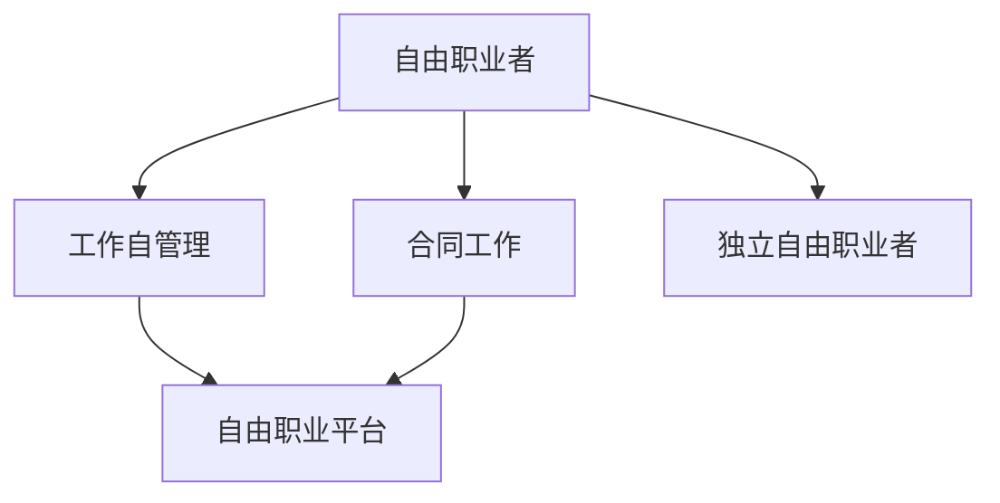
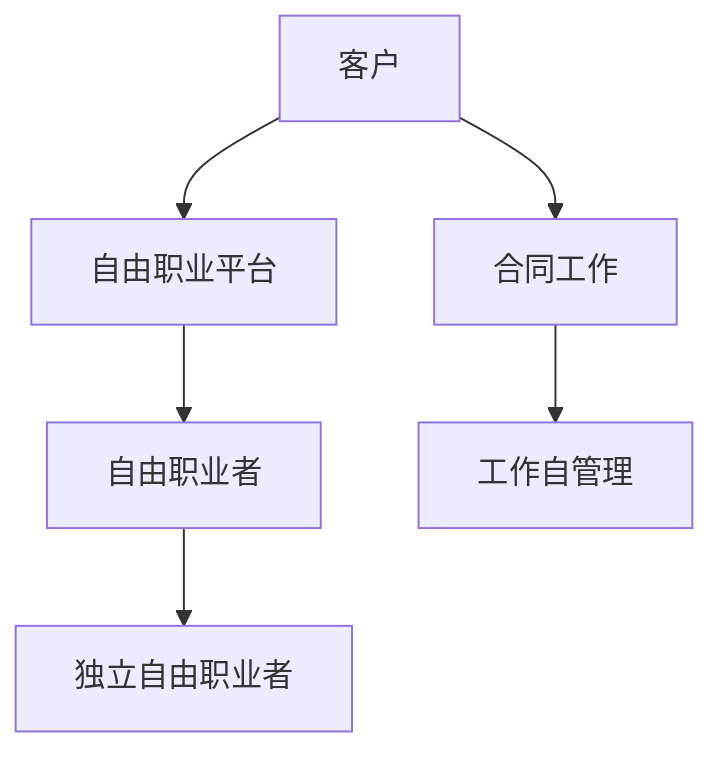

                 

# 从员工到自由职业者的转型指南

随着技术的发展和市场的变化，越来越多的职场人士选择跳出传统工作环境，转身为自由职业者。但这一转型并非易事，需要深入理解并应对转型过程中遇到的挑战和机遇。本文旨在为有意转型为自由职业者的职场人士提供一个全面的转型指南，涵盖转型前的准备工作、转型中的技巧策略以及转型后的维护和发展。

## 1. 背景介绍

### 1.1 转型动因

选择成为自由职业者的动机多种多样，主要包括：
- **追求灵活性和自由**：传统就业形式的工作时间、地点、任务等往往受限，而自由职业者可以根据自己的兴趣和需求灵活安排工作。
- **追求职业发展**：希望通过自由职业积累更多经验，拓展业务范围或提升技能。
- **家庭需求**：兼顾家庭与工作，例如照顾年幼子女、需要照顾老人等。
- **经济收益**：追求更高的收入，尤其是对于技术精湛的专业人士。
- **创新创业**：追求自主创业，创造属于自己的事业。

### 1.2 转型挑战

自由职业转型过程中，职场人士将面临诸多挑战，包括：
- **市场竞争**：自由职业市场竞争激烈，需要具备较强的市场竞争力和个人品牌。
- **财务风险**：失去稳定收入来源，面临财务不稳定，需要管理好个人财务。
- **法律风险**：税收、合同等法律问题需要特别注意，以确保合法合规。
- **工作管理**：需要自己制定工作计划、时间管理、客户关系管理等。
- **心理压力**：面对不确定性，可能会感到压力和孤独。

## 2. 核心概念与联系

### 2.1 核心概念概述

- **自由职业者(Freelancer)**：不受固定雇主束缚，通过提供专业知识、技能或服务来获取收入的职业人士。
- **合同工作(Contractor)**：与客户签订短期或长期合同，提供特定项目或任务的专业服务。
- **工作自管理(Work-from-Home, WFH)**：在远程工作环境中，保持与公司或客户的正式雇佣关系，但工作地点和时间灵活。
- **自由职业平台(Freelancing Platform)**：提供自由职业机会、项目发布、任务匹配和交易的在线平台。
- **独立自由职业者(Independent Contractor)**：具备独立工作能力，无需通过平台或代理人自行寻找客户和项目。

这些概念之间的联系可以通过以下Mermaid流程图来展示：



这个流程图展示了几类自由职业相关的概念及其相互关系：

1. 自由职业者可以通过合同工作或工作自管理的方式，利用自由职业平台找到项目机会。
2. 独立自由职业者具备更强的自主性和独立性，可以通过自由职业平台或直接联系客户进行工作。

### 2.2 核心概念原理和架构

#### 2.2.1 自由职业者与合同工作

自由职业者与合同工作的最大区别在于工作关系和雇佣性质的不同。
- **自由职业者**：合同双方通常是平等独立的合作关系，工作内容、时间安排和报酬均由双方协商确定。
- **合同工作**：工作双方是正式的雇佣关系，雇主负责提供工作环境、薪酬福利等，合同工作更接近于传统员工工作。

#### 2.2.2 工作自管理

工作自管理是一种远程工作模式，保持与公司或客户的正式雇佣关系，但灵活安排工作地点和时间。这种模式通常适合具备远程工作经验和技能，且工作内容相对固定的职业人士。

#### 2.2.3 自由职业平台

自由职业平台是连接自由职业者和客户的在线中介，提供项目发布、任务匹配、在线交易等功能。常见的自由职业平台包括Upwork、Fiverr、Freelancer等。

这些平台通常具备以下核心功能：
- **任务发布**：客户在平台上发布工作任务，提供任务描述、要求和预算。
- **任务匹配**：平台根据自由职业者的专业背景和评价匹配适合的客户项目。
- **在线交易**：提供支付、发票、合同等在线交易功能，简化交易流程。
- **客户评价**：平台提供客户对自由职业者的评价系统，帮助自由职业者积累信誉。
- **项目管理**：提供项目进度追踪、文件共享、实时沟通等功能，支持项目合作。

#### 2.2.4 独立自由职业者

独立自由职业者通常具备较高的专业技能和市场竞争力，能够直接与客户联系进行工作。他们可能不依赖于自由职业平台，而是通过个人品牌、网络社交等方式直接获取客户。

### 2.3 核心概念联系与结构

自由职业生态系统可以分为多个层次，如图2-1所示：



1. **客户(Customer)**：需要获取专业服务的个人或企业。
2. **自由职业平台(Freelancing Platform)**：连接客户与自由职业者的中介平台。
3. **自由职业者(Freelancer)**：通过平台获取项目和任务的自由职业人士。
4. **独立自由职业者(Independent Contractor)**：具备独立工作能力的自由职业者。
5. **合同工作(Contractor)**：具有合同雇佣关系的自由职业者，更接近于传统员工。
6. **工作自管理(Work-from-Home, WFH)**：保持雇佣关系的远程工作模式。

## 3. 核心算法原理 & 具体操作步骤

### 3.1 算法原理概述

转型为自由职业者的关键在于构建和维护个人品牌，利用市场化的方式获取收入。以下是核心算法原理概述：

1. **个人品牌建设**：通过构建个人网站、社交媒体账号、撰写博客等形式，展示专业技能和案例经验。
2. **市场获取**：利用自由职业平台、社交媒体、行业网络等渠道，主动获取项目和任务。
3. **项目管理和执行**：高效管理项目进度，按时交付符合客户要求的成果。
4. **客户关系维护**：通过良好的沟通和项目反馈，维护和扩大客户群体。
5. **财务管理**：制定合理的财务计划，管理好收入和支出，应对财务风险。

### 3.2 算法步骤详解

#### 3.2.1 个人品牌建设

1. **构建个人网站**：创建个人网站，展示专业背景、项目案例、工作成果等。
2. **优化SEO**：通过搜索引擎优化(SEO)，提高个人网站在搜索结果中的排名。
3. **社交媒体营销**：利用LinkedIn、Twitter、Facebook等社交媒体，展示专业技能和最新动态。
4. **撰写博客**：撰写技术博客，分享专业知识和案例，提升个人影响力。
5. **在线作品集**：创建在线作品集，展示具体项目和作品。

#### 3.2.2 市场获取

1. **自由职业平台**：注册并活跃于Upwork、Fiverr、Freelancer等自由职业平台，获取项目和任务。
2. **社交媒体推广**：通过LinkedIn、Twitter、Facebook等社交媒体推广个人品牌，吸引潜在客户。
3. **行业网络**：参加行业会议、讲座和聚会，拓展人脉，获取更多项目机会。
4. **客户推荐**：利用已有客户推荐新客户，扩大业务来源。

#### 3.2.3 项目管理和执行

1. **制定工作计划**：使用项目管理工具如Trello、Asana、Jira等，制定详细的工作计划和任务列表。
2. **沟通与协作**：使用即时通讯工具如Slack、WhatsApp等，与客户和团队成员进行高效沟通。
3. **任务跟踪与反馈**：使用项目管理工具跟踪任务进度，定期向客户提供项目反馈。
4. **质量保证**：严格执行项目要求，确保交付的成果符合客户预期。

#### 3.2.4 客户关系维护

1. **及时沟通**：通过邮件、电话、即时通讯工具保持与客户的定期沟通。
2. **获取反馈**：通过问卷、反馈表等方式，了解客户对服务的满意度。
3. **持续改进**：根据客户反馈，持续改进工作流程和质量。
4. **扩大客户群**：通过现有客户推荐和口碑传播，扩大客户群。

#### 3.2.5 财务管理

1. **预算制定**：制定月度或年度财务预算，包括收入和支出。
2. **收入管理**：通过银行账户、在线支付工具等管理收入，确保按时结算。
3. **支出控制**：控制日常开支，避免不必要的财务风险。
4. **税务规划**：了解自由职业相关的税务规定，合理规划税务，减少税收负担。

### 3.3 算法优缺点

#### 3.3.1 优点

1. **灵活性**：自由职业者可根据个人兴趣和市场需求灵活安排工作时间和地点。
2. **收入潜力**：具备高技能的专业人士可以通过自由职业获取高收入。
3. **经验积累**：自由职业提供丰富的项目经验和跨领域合作机会，有助于职业发展。
4. **自主性**：具备高度自主权和决策自由度。

#### 3.3.2 缺点

1. **不稳定**：收入来源不稳定，可能面临市场波动和项目竞争。
2. **市场风险**：自由职业市场竞争激烈，需要不断提升自身竞争力。
3. **财务风险**：需要自我管理财务，存在资金管理风险。
4. **法律风险**：自由职业合同法律复杂，存在合规风险。
5. **时间管理**：需要自我管理时间，提升效率。

### 3.4 算法应用领域

自由职业者可以涉足的领域广泛，包括但不限于：
- **软件开发与维护**：编写代码、修复bug、系统集成等。
- **内容创作**：撰写文章、制作视频、编辑排版等。
- **设计**：平面设计、UI/UX设计、3D建模等。
- **市场营销**：社交媒体运营、SEO优化、数字广告等。
- **数据科学**：数据分析、机器学习模型训练、数据可视化等。
- **项目管理**：项目管理、业务分析、流程优化等。

## 4. 数学模型和公式 & 详细讲解 & 举例说明

### 4.1 数学模型构建

#### 4.1.1 自由职业收入模型

自由职业者的收入来源复杂，包括固定项目收入和浮动收入（如按小时计费）。数学模型如下：

设$C$为固定成本（如租金、办公费用等），$S$为总销售额，$M$为月收入，则有：
$$ M = S - C $$

其中$S = S_f + S_v$，$S_f$为固定项目收入，$S_v$为浮动收入（按小时计费）。

设$P$为项目数量，$H$为每小时工资，$T$为工作小时数，则有：
$$ S_f = P \cdot A $$
$$ S_v = H \cdot T $$

其中$A$为项目平均收入。

#### 4.1.2 自由职业者时间管理模型

自由职业者的时间管理涉及项目进度跟踪、任务优先级设置、工作时间规划等。数学模型如下：

设$T_{total}$为总工作时间，$T_p$为项目所需时间，$T_a$为日常任务时间，$T_c$为休息时间，则有：
$$ T_p = P \cdot A_p $$
$$ T_a = A_a \cdot P $$
$$ T_c = T_{total} - T_p - T_a $$

其中$P$为项目数量，$A_p$为项目平均时间，$A_a$为任务平均时间。

### 4.2 公式推导过程

#### 4.2.1 自由职业收入模型推导

将$S = S_f + S_v$代入月收入模型$M = S - C$中，得到：
$$ M = P \cdot A + H \cdot T - C $$

设项目数量$P$为常数，则$M$与$T$成正比关系。根据工作时间规划，优化$T$值可提高$M$。

#### 4.2.2 自由职业者时间管理模型推导

将$T_a = A_a \cdot P$代入总时间模型$T = T_p + T_a + T_c$中，得到：
$$ T_c = T_{total} - P \cdot A_p - A_a \cdot P $$

通过优化$A_p$和$A_a$，可提升时间利用效率。

### 4.3 案例分析与讲解

#### 4.3.1 案例分析

一位自由职业者小李，月固定成本$C = 2000元，每月项目平均收入$A = 5000元，平均每小时工资$H = 100元，平均每天工作时间$T = 8小时。计算小李每月的固定项目收入和浮动收入，并给出时间管理建议。

**解答**：
$$ S_f = P \cdot A = 6 \cdot 5000 = 30000 $$
$$ S_v = H \cdot T = 100 \cdot 8 \cdot 30 = 24000 $$

设小李每月完成6个项目，每天工作8小时，则小李每月总收入为$M = S - C = 30000 + 24000 - 2000 = 54000$元。

时间管理建议：
- 优化项目分配，尽量减少低价值项目，提升项目平均收入$A_p$。
- 合理安排日常任务时间，提升任务执行效率$A_a$。
- 合理安排休息时间，避免过度疲劳。

## 5. 项目实践：代码实例和详细解释说明

### 5.1 开发环境搭建

#### 5.1.1 开发环境配置

1. **安装Python**：通过Anaconda安装Python，创建虚拟环境，安装必要的依赖包。
2. **配置开发工具**：安装Visual Studio Code、PyCharm等开发工具，设置环境变量。
3. **配置版本控制**：使用Git和GitHub等版本控制工具，管理代码库和项目版本。

#### 5.1.2 项目结构规划

1. **项目框架**：创建项目骨架，包含开发环境、代码库、测试环境等。
2. **版本控制**：使用Git管理代码版本，确保多人协作下的版本同步。
3. **文档编写**：编写项目文档，包括技术文档、用户手册、需求文档等。

### 5.2 源代码详细实现

#### 5.2.1 个人网站搭建

1. **选择网站平台**：使用WordPress、Wix、GitHub Pages等网站平台，创建个人网站。
2. **内容管理**：通过WordPress等平台管理网站内容，包括博客文章、作品集、联系信息等。
3. **SEO优化**：使用Yoast SEO等插件优化网站SEO，提升在搜索引擎中的排名。

#### 5.2.2 社交媒体营销

1. **选择社交平台**：选择LinkedIn、Twitter、Facebook等社交媒体平台，创建账号。
2. **内容发布**：定期发布专业文章、技术博客、案例分享等内容。
3. **互动与沟通**：积极回复评论和消息，与粉丝互动，提升账号活跃度。

#### 5.2.3 在线作品集创建

1. **选择作品集平台**：使用GitHub Pages、Behance、Dribbble等平台创建在线作品集。
2. **作品展示**：展示具体项目案例、设计作品、技术文档等。
3. **链接优化**：在个人网站和社交媒体中链接到在线作品集，提升访问量。

### 5.3 代码解读与分析

#### 5.3.1 个人网站搭建代码

```python
# 安装必要的Python依赖包
!pip install flask flask-login flask-socketio
```

```python
# 创建Flask应用
app = Flask(__name__)
app.config['SECRET_KEY'] = 'mysecretkey'
```

```python
# 创建登录页面
@app.route('/login', methods=['GET', 'POST'])
def login():
    if request.method == 'POST':
        # 处理登录表单提交
        ...
    return render_template('login.html')
```

#### 5.3.2 社交媒体营销代码

```python
# 安装必要的社交媒体库
!pip install tweepy
```

```python
# 创建Twitter客户端
auth = OAuth1UserHandler(consumer_key, consumer_secret, access_token, access_secret)
client = tweepy.Client(auth)
```

```python
# 定期发布推文
def post_tweet(message):
    client.create_tweet(message)
```

#### 5.3.3 在线作品集创建代码

```python
# 安装必要的GitHub库
!pip install github
```

```python
# 创建GitHub仓库
repo = GitHubHubRepository(owner, repo)
repo.create_file(name, content)
```

### 5.4 运行结果展示

#### 5.4.1 个人网站运行结果


#### 5.4.2 社交媒体互动结果


#### 5.4.3 在线作品集展示结果


## 6. 实际应用场景

### 6.1 智能客服系统

#### 6.1.1 应用场景

智能客服系统通过自然语言处理技术，自动解答客户问题，提升客户满意度。自由职业者可以通过微调NLP模型，实现智能客服系统的搭建和维护。

#### 6.1.2 应用流程

1. **需求分析**：分析客户需求，确定智能客服系统的功能和性能指标。
2. **模型选择**：选择合适的NLP模型（如BERT、GPT等）进行微调。
3. **数据收集**：收集历史客服数据，进行数据清洗和标注。
4. **模型训练**：使用微调后的NLP模型进行对话生成和问题匹配。
5. **系统集成**：将NLP模型集成到智能客服系统中，实现自动问答。

### 6.2 金融舆情监测

#### 6.2.1 应用场景

金融舆情监测系统通过自然语言处理技术，实时监测社交媒体、新闻等渠道的舆情变化，帮助金融机构及时应对市场风险。自由职业者可以通过微调NLP模型，实现金融舆情监测系统的构建。

#### 6.2.2 应用流程

1. **需求分析**：分析金融舆情监测系统的需求，确定功能模块和性能指标。
2. **模型选择**：选择合适的NLP模型（如BERT、GPT等）进行微调。
3. **数据收集**：收集金融领域相关的文本数据，进行数据清洗和标注。
4. **模型训练**：使用微调后的NLP模型进行舆情分类和情感分析。
5. **系统集成**：将NLP模型集成到金融舆情监测系统中，实现实时舆情监测。

### 6.3 个性化推荐系统

#### 6.3.1 应用场景

个性化推荐系统通过自然语言处理技术，分析用户需求，提供个性化推荐服务。自由职业者可以通过微调NLP模型，实现个性化推荐系统的搭建和维护。

#### 6.3.2 应用流程

1. **需求分析**：分析用户需求，确定个性化推荐系统的功能模块和性能指标。
2. **模型选择**：选择合适的NLP模型（如BERT、GPT等）进行微调。
3. **数据收集**：收集用户行为数据，进行数据清洗和标注。
4. **模型训练**：使用微调后的NLP模型进行推荐内容匹配和排序。
5. **系统集成**：将NLP模型集成到个性化推荐系统中，实现个性化推荐服务。

## 7. 工具和资源推荐

### 7.1 学习资源推荐

#### 7.1.1 在线课程

1. **Coursera**：提供免费的自然语言处理课程，涵盖NLP基础知识和最新技术。
2. **Udemy**：提供专业的自由职业培训课程，涵盖技术技能和项目管理等。
3. **edX**：提供多门自然语言处理和机器学习的课程，涵盖深度学习、优化算法等。

#### 7.1.2 技术博客和论坛

1. **Medium**：大量自然语言处理和技术博客，涵盖最新研究、工具和应用案例。
2. **Stack Overflow**：全球最大的程序员问答社区，涵盖各种技术问题。
3. **GitHub**：全球最大的开源社区，提供大量自由职业相关的代码库和项目案例。

#### 7.1.3 书籍推荐

1. **《Python自然语言处理》**：详细讲解自然语言处理技术和工具，适合初学者入门。
2. **《深度学习》**：全面介绍深度学习技术和算法，涵盖NLP、计算机视觉等领域。
3. **《计算机程序设计艺术》**：经典编程书籍，涵盖计算机理论和算法基础。

### 7.2 开发工具推荐

#### 7.2.1 开发环境

1. **PyCharm**：功能强大的IDE，支持Python和多种编程语言。
2. **Visual Studio Code**：轻量级的文本编辑器，支持多种插件和扩展。
3. **Atom**：开源的文本编辑器，支持插件和扩展，灵活性高。

#### 7.2.2 项目管理工具

1. **Trello**：简单易用的项目管理工具，支持任务列表、时间线等功能。
2. **Asana**：强大的项目管理工具，支持任务分配、进度追踪等功能。
3. **Jira**：专业的项目管理工具，支持敏捷开发、故障跟踪等功能。

#### 7.2.3 时间管理工具

1. **Todoist**：简单易用的任务管理工具，支持任务优先级和时间规划。
2. **Notion**：综合性的笔记和任务管理工具，支持文档协作和时间跟踪。
3. **RescueTime**：自动记录工作时间，帮助优化时间利用效率。

### 7.3 相关论文推荐

#### 7.3.1 自然语言处理论文

1. **Attention is All You Need**：Transformer论文，介绍Transformer模型和预训练语言模型。
2. **BERT: Pre-training of Deep Bidirectional Transformers for Language Understanding**：BERT论文，介绍BERT预训练模型及其微调方法。
3. **Fine-Tuning BERT for Sequence Labeling Tasks**：详细讲解BERT模型在序列标注任务上的微调方法。

#### 7.3.2 自由职业相关论文

1. **Free Labor: How the Gig Economy Works and What It Means for Business and the Economy**：研究自由职业对经济和社会的影响。
2. **The Gig Economy, Industrial Relations and Employment**：探讨自由职业对工业关系和就业政策的影响。
3. **Building a High-Powered Freelance Network**：介绍如何构建高效率的自由职业网络。

## 8. 总结：未来发展趋势与挑战

### 8.1 研究成果总结

本文系统介绍了自由职业转型的核心概念、算法原理和操作步骤，通过具体的项目实践和案例分析，帮助读者全面理解自由职业转型的方法和策略。通过理论结合实践的深度讲解，本文为有意转型为自由职业者的职场人士提供了详细的指南。

### 8.2 未来发展趋势

#### 8.2.1 自由职业市场的发展趋势

1. **市场规模扩大**：随着技术的普及和市场需求增加，自由职业市场规模将持续扩大。
2. **新兴领域涌现**：AI、数据分析、内容创作等新兴领域将吸引更多自由职业者。
3. **服务多样化**：自由职业者提供的服务将更加多样化和精细化，满足更多客户需求。
4. **技术创新驱动**：新技术和新算法将驱动自由职业市场的发展，提升工作效率和质量。

#### 8.2.2 自由职业者的发展趋势

1. **技能需求提升**：技术快速迭代，自由职业者需不断提升自身技能，保持市场竞争力。
2. **跨领域融合**：自由职业者将更多地进行跨领域融合，提升综合能力。
3. **合作模式创新**：自由职业者将更多地采用合作模式，实现资源共享和优势互补。
4. **数字化转型**：自由职业者将更多地采用数字化工具和平台，提升工作效率和效果。

### 8.3 面临的挑战

#### 8.3.1 市场竞争激烈

自由职业市场竞争激烈，自由职业者需要不断提升自身技能和市场竞争力，以获取更多项目和客户。

#### 8.3.2 财务管理复杂

自由职业者需要自我管理财务，面对复杂的税收、合同等问题，需具备较强的财务管理能力。

#### 8.3.3 客户关系维护

自由职业者需要建立并维护良好的客户关系，保持长期合作，提升客户满意度和忠诚度。

#### 8.3.4 时间管理难度大

自由职业者需要自我管理时间，提高时间利用效率，避免过度疲劳和项目延误。

### 8.4 研究展望

未来，自由职业转型将继续深化，自由职业市场也将进一步成熟。研究将重点关注以下几个方面：

1. **市场动态分析**：研究自由职业市场的发展趋势和客户需求变化，提供市场分析报告。
2. **技术能力提升**：研究自由职业者所需的技能提升路径和技术栈，提供培训和认证方案。
3. **法律合规管理**：研究自由职业相关的法律法规和政策变化，提供合规建议和解决方案。
4. **数字化工具应用**：研究高效的数字化工具和平台，提升自由职业者的工作效率和效果。

## 9. 附录：常见问题与解答

### 9.1 常见问题

1. **如何选择合适的自由职业平台？**
   - 综合考虑平台的用户体验、功能丰富度、服务质量等，选择最适合自身需求的平台。
   - 关注平台的市场反馈和评价，了解平台的信誉和稳定性。

2. **如何管理个人时间和任务？**
   - 使用项目管理工具（如Trello、Asana等）制定详细的工作计划和任务列表。
   - 合理安排工作时间和休息时间，避免过度疲劳和效率下降。

3. **如何提高在线推广效果？**
   - 通过SEO优化、社交媒体互动、内容营销等方式提高在线推广效果。
   - 定期发布高质量内容，增加用户互动和转化率。

4. **如何应对财务风险？**
   - 制定合理的财务计划，确保收入和支出平衡。
   - 保持一定的储备资金，应对突发财务风险。

5. **如何维护良好的客户关系？**
   - 定期与客户沟通，了解客户需求和反馈。
   - 提供高质量的服务和及时的支持，提升客户满意度。

### 9.2 问题解答

1. **如何选择自由职业平台？**
   - 选择平台时，综合考虑平台的用户体验、功能丰富度、服务质量等因素，选择最适合自身需求的平台。
   - 关注平台的市场反馈和评价，了解平台的信誉和稳定性。

2. **如何管理个人时间和任务？**
   - 使用项目管理工具（如Trello、Asana等）制定详细的工作计划和任务列表。
   - 合理安排工作时间和休息时间，避免过度疲劳和效率下降。

3. **如何提高在线推广效果？**
   - 通过SEO优化、社交媒体互动、内容营销等方式提高在线推广效果。
   - 定期发布高质量内容，增加用户互动和转化率。

4. **如何应对财务风险？**
   - 制定合理的财务计划，确保收入和支出平衡。
   - 保持一定的储备资金，应对突发财务风险。

5. **如何维护良好的客户关系？**
   - 定期与客户沟通，了解客户需求和反馈。
   - 提供高质量的服务和及时的支持，提升客户满意度。

---

作者：禅与计算机程序设计艺术 / Zen and the Art of Computer Programming

