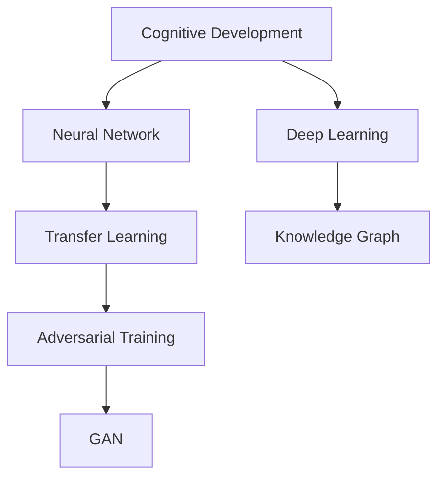

                 

# 从简单到深刻的认知发展

## 1. 背景介绍

### 1.1 问题由来

认知发展（Cognitive Development）研究的是人类认知能力的演变与提升，涉及从婴儿的简单感知到成年人的深度思考，是一个跨学科的复杂课题。在信息科技与人工智能（AI）飞速发展的今天，理解和模仿人类的认知过程，实现机器的深度理解与智能决策，成为了科技发展的前沿。

认知发展理论不仅在心理学、教育学等领域具有重要影响，还在人工智能、机器学习等领域提供了新的思路和方法。人工智能系统，特别是深度学习模型，已经在图像识别、语音识别、自然语言处理等领域取得了显著成果，展现了与人类认知过程相似的特点。

本博客旨在通过介绍认知发展理论及其在人工智能中的应用，探讨如何从简单到深刻的认知发展，实现更加智能化的AI系统。

### 1.2 问题核心关键点

- **认知发展理论**：心理学、认知科学的研究成果，揭示了人类认知能力从低级到高级的演变过程。
- **神经网络与深度学习**：AI领域的核心技术，模拟人脑处理信息的能力，实现数据驱动的决策。
- **迁移学习**：让机器利用已有知识解决新问题的技术，有助于提升AI系统的泛化能力。
- **对抗训练与生成对抗网络（GAN）**：通过对抗方式提升模型鲁棒性的技术，增强模型的泛化能力。
- **知识图谱与语义网络**：结构化的知识表示形式，帮助机器更好地理解和推理。

这些概念构成了认知发展理论在AI中的应用框架，为理解从简单到深刻的认知发展提供了理论和实践基础。

### 1.3 问题研究意义

- **理解与模仿**：通过认知发展理论，理解人类认知过程，进而实现AI系统的智能化。
- **提升模型性能**：通过迁移学习、对抗训练等方法，提升AI系统的泛化能力和鲁棒性。
- **知识工程**：利用知识图谱等结构化知识，增强AI系统的理解与推理能力。

## 2. 核心概念与联系

### 2.1 核心概念概述

为了更好地理解认知发展理论及其在AI中的应用，本节将介绍几个密切相关的核心概念：

- **认知发展（Cognitive Development）**：指人类认知能力从感知、记忆、推理到创新能力的逐步提升过程。
- **神经网络（Neural Network）**：一种模拟人脑神经元网络的计算模型，用于处理非线性、高维度数据。
- **深度学习（Deep Learning）**：一种基于神经网络的机器学习方法，通过多层次的非线性变换，实现复杂的模式识别与预测。
- **迁移学习（Transfer Learning）**：将在一个任务上学到的知识应用到另一个相关任务上，以减少新任务的学习负担。
- **对抗训练（Adversarial Training）**：通过引入对抗样本来提升模型的鲁棒性和泛化能力。
- **生成对抗网络（GAN）**：一种基于对抗学习的生成模型，用于生成高质量的伪数据。
- **知识图谱（Knowledge Graph）**：一种结构化的知识表示形式，用于描述实体与实体之间的关系。

这些核心概念之间的逻辑关系可以通过以下Mermaid流程图来展示：



这个流程图展示了几大核心概念及其之间的关系：

1. **认知发展**是整个理论的基础，揭示了人类认知能力的发展过程。
2. **神经网络**与**深度学习**是实现复杂认知功能的技术手段。
3. **迁移学习**利用已有知识提升新任务性能，与**深度学习**结合形成了**迁移深度学习**。
4. **对抗训练**与**生成对抗网络**提升模型鲁棒性，进一步增强了**深度学习**的泛化能力。
5. **知识图谱**通过结构化知识表示，为**深度学习**提供了更丰富的信息源，增强了推理能力。

这些概念共同构成了认知发展理论在AI中的应用框架，为理解和实现从简单到深刻的认知发展提供了理论支撑。

## 3. 核心算法原理 & 具体操作步骤
### 3.1 算法原理概述

基于认知发展理论，AI系统通过模拟人类认知过程，实现从简单到复杂的认知能力提升。以下是对核心算法原理的介绍：

### 3.2 算法步骤详解

认知发展的核心算法包括以下几个关键步骤：

**Step 1: 数据准备**

1. **数据收集**：收集有关人类认知发展的数据，包括感知、记忆、推理、创新等各个阶段的数据。
2. **数据预处理**：对数据进行清洗、归一化、特征提取等预处理，确保数据的质量和一致性。

**Step 2: 神经网络模型构建**

1. **神经网络架构设计**：根据认知发展的不同阶段，设计相应的神经网络架构。例如，简单的感知任务可以使用单层神经网络，复杂的推理任务则需要更深层次的网络结构。
2. **网络训练**：使用数据集对网络进行训练，优化网络参数，提升模型的预测能力。

**Step 3: 迁移学习**

1. **模型迁移**：将在一个任务上学到的知识迁移到另一个任务上，例如从图像分类任务中学习到的特征提取能力可以用于目标检测任务。
2. **模型微调**：对迁移后的模型进行微调，以适应新任务的特点，提升模型的泛化能力。

**Step 4: 对抗训练与生成对抗网络**

1. **对抗训练**：引入对抗样本来提升模型的鲁棒性和泛化能力，确保模型在面对攻击时仍能保持稳定。
2. **生成对抗网络（GAN）**：使用GAN生成高质量的伪数据，用于数据增强和模型训练。

**Step 5: 知识图谱与语义网络**

1. **知识图谱构建**：构建包含实体、关系、属性的知识图谱，描述实体之间的语义关系。
2. **语义网络推理**：利用知识图谱进行语义网络推理，增强AI系统的理解和推理能力。

### 3.3 算法优缺点

认知发展的核心算法具有以下优点：

1. **可扩展性**：能够模拟人类认知过程，适用于各种复杂认知任务。
2. **泛化能力**：通过迁移学习，能够在新的任务上快速适应，提升模型性能。
3. **鲁棒性**：通过对抗训练和生成对抗网络，提升模型的鲁棒性和泛化能力。
4. **知识表示**：通过知识图谱和语义网络，增强系统的理解和推理能力。

同时，该算法也存在一定的局限性：

1. **数据需求**：需要大量的标注数据进行模型训练和迁移学习。
2. **计算资源**：深度神经网络的训练和优化需要大量的计算资源。
3. **模型复杂度**：复杂的神经网络架构可能导致模型过拟合，需要精心设计和优化。
4. **对抗样本风险**：对抗训练生成的对抗样本可能导致模型在实际应用中表现不佳。

尽管存在这些局限性，但就目前而言，认知发展的核心算法仍是实现从简单到复杂认知发展的重要手段。

### 3.4 算法应用领域

基于认知发展的核心算法，AI系统已经在以下领域取得了显著应用：

- **计算机视觉**：使用深度学习模型进行图像分类、目标检测、图像生成等任务。
- **自然语言处理**：使用深度学习模型进行文本分类、情感分析、机器翻译等任务。
- **智能推荐系统**：利用迁移学习提升推荐模型的泛化能力，实现个性化推荐。
- **医疗诊断**：通过深度学习模型进行医学图像分析、病历分析等任务。
- **金融预测**：使用深度学习模型进行金融市场预测、风险评估等任务。

除了上述这些经典领域外，认知发展的核心算法还被创新性地应用到更多场景中，如自动驾驶、机器人控制、智能家居等，为人工智能技术的发展带来了新的突破。

## 4. 数学模型和公式 & 详细讲解 & 举例说明

### 4.1 数学模型构建

认知发展的核心算法涉及多个数学模型，以下将详细介绍其中的几个关键模型：

**感知机模型（Perceptron）**

感知机模型是最基础的神经网络模型，用于模拟人类感知过程。其数学模型如下：

$$y=f(\sum_{i=1}^{n}w_ix_i+b)$$

其中，$f$为激活函数，$w$为权重向量，$x$为输入向量，$b$为偏置项。

**多层感知机模型（Multilayer Perceptron, MLP）**

多层感知机模型用于模拟人类复杂的感知与推理过程，其数学模型如下：

$$y=f(\sum_{i=1}^{n}w_ix_i+b)$$

其中，$f$为激活函数，$w$为权重矩阵，$x$为输入向量，$b$为偏置项。

### 4.2 公式推导过程

**感知机模型**

感知机模型的推导过程如下：

1. **激活函数**：$f(x)=\sigma(x)$，其中$\sigma$为sigmoid函数。
2. **输出函数**：$y=\sigma(\sum_{i=1}^{n}w_ix_i+b)$。

**多层感知机模型**

多层感知机模型的推导过程如下：

1. **激活函数**：$f(x)=\sigma(x)$，其中$\sigma$为sigmoid函数。
2. **输出函数**：$y=\sigma(\sum_{i=1}^{n}w_ix_i+b)$。

**卷积神经网络模型（Convolutional Neural Network, CNN）**

卷积神经网络模型用于模拟人类视觉感知过程，其数学模型如下：

$$y=f(\sum_{i=1}^{n}w_ix_i+b)$$

其中，$f$为激活函数，$w$为权重矩阵，$x$为输入向量，$b$为偏置项。

### 4.3 案例分析与讲解

**图像分类**

图像分类任务可以使用卷积神经网络模型进行实现。其具体步骤如下：

1. **数据预处理**：将图像数据进行归一化、裁剪、缩放等预处理操作。
2. **网络构建**：构建卷积神经网络，包括卷积层、池化层、全连接层等。
3. **模型训练**：使用图像数据集对网络进行训练，优化网络参数，提升模型性能。
4. **迁移学习**：将预训练好的模型迁移到新的数据集上，进行微调，提升泛化能力。

**文本分类**

文本分类任务可以使用循环神经网络模型进行实现。其具体步骤如下：

1. **数据预处理**：将文本数据进行分词、去停用词、词向量化等预处理操作。
2. **网络构建**：构建循环神经网络，包括嵌入层、LSTM层、全连接层等。
3. **模型训练**：使用文本数据集对网络进行训练，优化网络参数，提升模型性能。
4. **迁移学习**：将预训练好的模型迁移到新的数据集上，进行微调，提升泛化能力。

## 5. 项目实践：代码实例和详细解释说明

### 5.1 开发环境搭建

在进行项目实践前，我们需要准备好开发环境。以下是使用Python进行TensorFlow开发的环境配置流程：

1. 安装Anaconda：从官网下载并安装Anaconda，用于创建独立的Python环境。

2. 创建并激活虚拟环境：
```bash
conda create -n tf-env python=3.8 
conda activate tf-env
```

3. 安装TensorFlow：根据CUDA版本，从官网获取对应的安装命令。例如：
```bash
conda install tensorflow -c tf -c conda-forge
```

4. 安装各类工具包：
```bash
pip install numpy pandas scikit-learn matplotlib tqdm jupyter notebook ipython
```

完成上述步骤后，即可在`tf-env`环境中开始项目实践。

### 5.2 源代码详细实现

这里我们以图像分类任务为例，给出使用TensorFlow进行卷积神经网络（CNN）模型构建和训练的代码实现。

```python
import tensorflow as tf
from tensorflow.keras import layers, models
from tensorflow.keras.datasets import mnist

(x_train, y_train), (x_test, y_test) = mnist.load_data()

x_train = x_train.reshape(-1, 28, 28, 1).astype('float32') / 255.0
x_test = x_test.reshape(-1, 28, 28, 1).astype('float32') / 255.0

y_train = tf.keras.utils.to_categorical(y_train, 10)
y_test = tf.keras.utils.to_categorical(y_test, 10)

model = models.Sequential([
    layers.Conv2D(32, (3, 3), activation='relu', input_shape=(28, 28, 1)),
    layers.MaxPooling2D((2, 2)),
    layers.Conv2D(64, (3, 3), activation='relu'),
    layers.MaxPooling2D((2, 2)),
    layers.Conv2D(64, (3, 3), activation='relu'),
    layers.Flatten(),
    layers.Dense(64, activation='relu'),
    layers.Dense(10, activation='softmax')
])

model.compile(optimizer='adam', loss='categorical_crossentropy', metrics=['accuracy'])

model.fit(x_train, y_train, epochs=10, validation_data=(x_test, y_test))
```

### 5.3 代码解读与分析

让我们再详细解读一下关键代码的实现细节：

**数据准备**

- `mnist.load_data()`：加载MNIST数据集。
- `x_train.reshape()`：将图像数据重塑为卷积层输入形状。
- `x_train.astype()`：将图像数据转换为浮点数。
- `y_train = tf.keras.utils.to_categorical()`：将类别标签转换为one-hot编码。

**模型构建**

- `models.Sequential()`：使用`Sequential`模型构建卷积神经网络。
- `layers.Conv2D()`：添加卷积层，使用ReLU激活函数。
- `layers.MaxPooling2D()`：添加池化层，使用最大池化操作。
- `layers.Flatten()`：将卷积层输出展平，用于全连接层。
- `layers.Dense()`：添加全连接层，使用ReLU激活函数。
- `layers.Dense()`：添加输出层，使用softmax激活函数。

**模型训练**

- `model.compile()`：编译模型，指定优化器和损失函数。
- `model.fit()`：训练模型，指定训练数据、训练轮数和验证数据。

以上代码实现了卷积神经网络模型在MNIST数据集上的训练，代码实现简洁高效，适合初学者学习和实践。

## 6. 实际应用场景

### 6.1 智能推荐系统

智能推荐系统是认知发展的典型应用场景之一。推荐系统通过深度学习模型，分析用户行为数据，预测用户兴趣，推荐个性化内容。

具体实现步骤如下：

1. **数据收集**：收集用户浏览、点击、购买等行为数据。
2. **数据预处理**：对行为数据进行清洗、归一化、特征提取等预处理操作。
3. **模型构建**：构建深度神经网络模型，使用迁移学习将预训练模型迁移到推荐任务上。
4. **模型训练**：使用行为数据对模型进行训练，优化模型参数。
5. **模型微调**：对训练后的模型进行微调，提升模型泛化能力。

### 6.2 医疗诊断系统

医疗诊断系统通过深度学习模型，分析医学影像、病历数据，辅助医生进行诊断。

具体实现步骤如下：

1. **数据收集**：收集医学影像、病历数据。
2. **数据预处理**：对医学影像进行归一化、增强、裁剪等预处理操作，对病历数据进行清洗、归一化、特征提取等预处理操作。
3. **模型构建**：构建深度神经网络模型，使用迁移学习将预训练模型迁移到医疗诊断任务上。
4. **模型训练**：使用医学影像和病历数据对模型进行训练，优化模型参数。
5. **模型微调**：对训练后的模型进行微调，提升模型泛化能力。

### 6.3 金融预测系统

金融预测系统通过深度学习模型，分析历史金融数据，预测市场趋势。

具体实现步骤如下：

1. **数据收集**：收集历史金融数据，包括股票价格、交易量、经济指标等。
2. **数据预处理**：对金融数据进行清洗、归一化、特征提取等预处理操作。
3. **模型构建**：构建深度神经网络模型，使用迁移学习将预训练模型迁移到金融预测任务上。
4. **模型训练**：使用金融数据对模型进行训练，优化模型参数。
5. **模型微调**：对训练后的模型进行微调，提升模型泛化能力。

## 7. 工具和资源推荐

### 7.1 学习资源推荐

为了帮助开发者系统掌握认知发展理论及其在AI中的应用，这里推荐一些优质的学习资源：

1. **《深度学习》**：Ian Goodfellow、Yoshua Bengio、Aaron Courville著，全面介绍了深度学习的基本概念和实现方法。
2. **《认知科学与深度学习》**：Tomas Mikolov、Peter Winkler著，探讨了认知科学与深度学习之间的联系和应用。
3. **Deep Learning Specialization**：由Andrew Ng教授在Coursera上开设的深度学习课程，系统讲解深度学习理论和方法。
4. **PyTorch官方文档**：PyTorch框架的官方文档，提供了丰富的代码示例和详细的使用指南。
5. **TensorFlow官方文档**：TensorFlow框架的官方文档，提供了丰富的代码示例和详细的使用指南。

通过这些资源的学习实践，相信你一定能够快速掌握认知发展理论及其在AI中的应用，并用于解决实际的AI问题。

### 7.2 开发工具推荐

高效的开发离不开优秀的工具支持。以下是几款用于认知发展理论应用开发的常用工具：

1. **PyTorch**：基于Python的开源深度学习框架，灵活动态的计算图，适合快速迭代研究。
2. **TensorFlow**：由Google主导开发的开源深度学习框架，生产部署方便，适合大规模工程应用。
3. **Keras**：基于TensorFlow的高层API，易于使用，适合快速原型开发和实验验证。
4. **Jupyter Notebook**：交互式的编程环境，方便代码调试和结果展示。
5. **Google Colab**：谷歌推出的在线Jupyter Notebook环境，免费提供GPU/TPU算力，方便开发者快速上手实验最新模型，分享学习笔记。

合理利用这些工具，可以显著提升认知发展理论在AI中的应用效率，加快创新迭代的步伐。

### 7.3 相关论文推荐

认知发展理论及其在AI中的应用涉及大量前沿研究，以下是几篇奠基性的相关论文，推荐阅读：

1. **ImageNet Classification with Deep Convolutional Neural Networks**：Alex Krizhevsky、Ilya Sutskever、Geoffrey Hinton著，展示了深度卷积神经网络在图像分类任务上的突破性表现。
2. **A Review of Convolutional Neural Networks for Visual Recognition**：Jin Shao、Wanxiang Che、Tie-Yan Liu著，综述了卷积神经网络在视觉识别任务中的应用。
3. **Natural Language Processing (NLP)**：Christopher Manning、Russell Meredith、Hinrich Schütze著，全面介绍了自然语言处理的基本概念和实现方法。
4. **Reinforcement Learning: An Introduction**：Richard S. Sutton、Andrew G. Barto著，介绍了强化学习的基本概念和实现方法。
5. **Knowledge Graphs**：Ian horizontal著，介绍了知识图谱的基本概念和实现方法。

这些论文代表了大数据、深度学习、自然语言处理、强化学习等领域的研究进展，是理解认知发展理论在AI应用中的关键文献。

## 8. 总结：未来发展趋势与挑战

### 8.1 研究成果总结

本文对认知发展理论及其在AI中的应用进行了全面系统的介绍。首先阐述了认知发展理论的基本概念和应用框架，明确了认知发展理论在AI中的重要地位。其次，从原理到实践，详细讲解了认知发展理论在AI中的应用，给出了典型的代码实现。同时，本文还探讨了认知发展理论在智能推荐系统、医疗诊断系统、金融预测系统等诸多领域的应用前景，展示了认知发展理论的广泛适用性。

通过本文的系统梳理，可以看到，认知发展理论为理解人类认知过程、实现AI系统的智能化提供了重要基础，具有广阔的应用前景。

### 8.2 未来发展趋势

展望未来，认知发展理论及其在AI中的应用将呈现以下几个发展趋势：

1. **多模态融合**：认知发展理论不仅适用于单模态数据，还可以应用于多模态数据的融合，例如将视觉、听觉、文本等多模态信息结合，提升系统的感知和推理能力。
2. **深度学习与认知科学的结合**：深度学习模型的训练过程可以通过认知科学的理论指导，进一步提升模型的表现。
3. **知识图谱与语义网络的应用**：知识图谱和语义网络可以增强AI系统的理解与推理能力，提升系统的知识整合能力。
4. **迁移学习与跨领域迁移**：迁移学习可以提升AI系统的泛化能力，跨领域迁移可以应用于更多领域的应用，例如医学、法律等。
5. **对抗训练与生成对抗网络的应用**：对抗训练和生成对抗网络可以提升AI系统的鲁棒性和泛化能力。

这些趋势凸显了认知发展理论及其在AI应用中的巨大潜力，为实现更加智能化、普适化的AI系统提供了新的思路和方法。

### 8.3 面临的挑战

尽管认知发展理论及其在AI中的应用取得了显著进展，但在迈向更加智能化、普适化应用的过程中，仍面临诸多挑战：

1. **数据需求**：需要大量的标注数据进行模型训练和迁移学习，对于某些领域的数据获取成本较高。
2. **计算资源**：深度神经网络的训练和优化需要大量的计算资源，对于大规模数据集的训练，资源需求较高。
3. **模型复杂度**：复杂的神经网络架构可能导致模型过拟合，需要精心设计和优化。
4. **对抗样本风险**：对抗训练生成的对抗样本可能导致模型在实际应用中表现不佳。
5. **模型解释性**：深度学习模型的“黑盒”特性，使得模型解释性较弱，难以用于高风险领域。

尽管存在这些挑战，但未来的研究仍需要不断探索，以应对这些挑战并实现认知发展理论在AI中的更深层次应用。

### 8.4 研究展望

面对认知发展理论及其在AI应用中的挑战，未来的研究需要在以下几个方面寻求新的突破：

1. **无监督学习和少样本学习**：探索无监督学习和少样本学习的方法，减少对标注数据的依赖。
2. **深度学习模型的解释性**：提高深度学习模型的可解释性，增强模型的透明性。
3. **跨领域迁移学习**：研究跨领域迁移学习方法，提升模型的泛化能力。
4. **多模态感知与推理**：研究多模态感知与推理方法，提升系统的感知与推理能力。
5. **知识图谱的应用**：进一步研究知识图谱在认知发展理论中的应用，提升系统的知识整合能力。

这些研究方向将推动认知发展理论及其在AI中的深入应用，为构建更加智能化、普适化的AI系统提供新的思路和方法。

## 9. 附录：常见问题与解答

**Q1：认知发展理论与深度学习的关系是什么？**

A: 认知发展理论为深度学习提供了理论基础，深度学习模型通过模拟人脑的神经网络结构，实现了对复杂数据的学习与理解。深度学习模型在数据驱动的训练过程中，可以不断优化自身的结构和参数，逐步提升认知能力。

**Q2：如何使用认知发展理论实现智能推荐系统？**

A: 智能推荐系统可以通过认知发展理论进行如下实现：
1. 收集用户行为数据，包括浏览、点击、购买等行为。
2. 对行为数据进行清洗、归一化、特征提取等预处理操作。
3. 构建深度神经网络模型，使用迁移学习将预训练模型迁移到推荐任务上。
4. 使用行为数据对模型进行训练，优化模型参数。
5. 对训练后的模型进行微调，提升模型泛化能力。

**Q3：深度学习模型的对抗训练与生成对抗网络（GAN）的区别是什么？**

A: 深度学习模型的对抗训练与生成对抗网络（GAN）的区别在于：
1. 对抗训练通过引入对抗样本，提升模型的鲁棒性和泛化能力。
2. GAN通过对抗方式生成高质量的伪数据，用于数据增强和模型训练。

**Q4：知识图谱在认知发展理论中的应用是什么？**

A: 知识图谱在认知发展理论中的应用在于：
1. 知识图谱可以用于描述实体与实体之间的关系，增强AI系统的理解与推理能力。
2. 知识图谱可以与深度学习模型结合，提升系统的知识整合能力。
3. 知识图谱可以用于多模态数据的融合，提升系统的感知与推理能力。

**Q5：如何提高深度学习模型的可解释性？**

A: 提高深度学习模型的可解释性可以通过以下方式实现：
1. 引入可视化工具，如TensorBoard，展示模型的结构和参数变化。
2. 使用可解释性模型，如LIME、SHAP等，生成模型的局部解释。
3. 对模型进行逐层解释，分析每个层的作用与输出。
4. 使用对抗训练，增强模型的鲁棒性和可解释性。

这些问题的解答可以帮助读者更好地理解认知发展理论及其在AI中的应用，为深入研究提供参考。

---

作者：禅与计算机程序设计艺术 / Zen and the Art of Computer Programming

