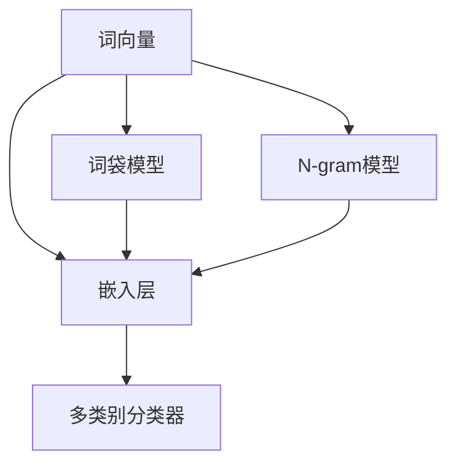

                 

# 从零开始大模型开发与微调：FastText的原理与基础算法

> 关键词：
> 
> 大模型, 自然语言处理(NLP), FastText, 词向量, 文本分类, 微调, 特征提取, 词袋模型(Bag of Words), 嵌入层(Embedding Layer), 神经网络分类器(Neural Network Classifier), 多类别分类器(Multiclass Classifier), 正则化(Regularization), 词权重(Word Weighting), 逻辑回归(Logistic Regression)

## 1. 背景介绍

### 1.1 问题由来
在当今信息爆炸的时代，文本数据的数量和种类急剧增加，如何高效处理和分析这些文本数据，成为了数据科学和人工智能领域的一大挑战。传统的小型机器学习模型往往无法处理大规模文本数据，而预训练的深度学习模型虽然表现出色，但其训练和部署成本高昂。为了解决这一问题，FastText应运而生。

FastText是一款由Facebook开发的基于单词的文本分类模型，它不仅保留了单词的原始形式和结构，而且能够处理长文本和多类别分类问题。FastText的词向量和特征表示能力使得它在文本分类、情感分析、文本聚类等任务上表现优异。

本文将从FastText的原理、基础算法、微调技术等多个方面进行全面解析，帮助读者深入理解FastText的开发与微调过程，并探索其在实际应用中的广泛应用。

### 1.2 问题核心关键点
FastText的核心在于其独特的词向量表示和特征提取方法，以及高效的文本分类算法。本节将详细阐述FastText的词向量构建、文本分类原理及其实现细节。

FastText的词向量表示主要包括以下几个关键点：
- 使用词袋模型(Bag of Words)和N-gram模型来处理单词和子词。
- 使用嵌入层(Embedding Layer)将单词或子词映射到向量空间中。
- 通过子词标记/Subword Indexing技术，解决长单词的问题。
- 使用多类别分类器(Multiclass Classifier)进行文本分类。

## 2. 核心概念与联系

### 2.1 核心概念概述

为了更好地理解FastText的原理，本节将介绍几个密切相关的核心概念：

- **词向量**：将单词映射到向量空间中的技术，用于捕捉单词之间的语义关系。
- **词袋模型(Bag of Words, BoW)**：一种最简单的文本表示方法，仅考虑单词的频率和分布。
- **N-gram模型**：将文本分解为连续的N个单词的序列，用于处理长文本。
- **嵌入层(Embedding Layer)**：神经网络中用于将单词映射到向量空间的层。
- **子词标记/Subword Indexing**：将长单词分解为多个子词，解决长单词问题。
- **多类别分类器(Multiclass Classifier)**：用于处理多类别分类问题。

这些核心概念之间的逻辑关系可以通过以下Mermaid流程图来展示：



这个流程图展示了FastText的各个核心概念及其之间的关系：

1. 词向量是将单词映射到向量空间的表示方法。
2. 词袋模型和N-gram模型用于处理单词和长文本。
3. 嵌入层将单词映射到向量空间。
4. 多类别分类器用于处理文本分类问题。

## 3. 核心算法原理 & 具体操作步骤
### 3.1 算法原理概述

FastText的算法原理可以简单概括为以下几个步骤：

1. **数据预处理**：将原始文本转换为特征向量。
2. **词向量和特征提取**：构建单词的词向量和子词表示。
3. **模型训练**：使用多类别分类器训练模型。
4. **模型微调**：根据特定任务进行微调，提升模型性能。

### 3.2 算法步骤详解

#### 3.2.1 数据预处理

FastText使用词袋模型和N-gram模型来处理单词和长文本。词袋模型仅考虑单词的频率和分布，不考虑单词的顺序。N-gram模型将文本分解为连续的N个单词的序列，用于处理长文本。

FastText支持两种词向量表示方法：
- **词袋向量表示**：将文本表示为单词的频率向量，单词映射到向量空间中。
- **子词向量表示**：将长单词分解为多个子词，并将每个子词映射到向量空间中。

#### 3.2.2 词向量和特征提取

FastText使用嵌入层将单词或子词映射到向量空间中。嵌入层是神经网络中的一种层，将单词映射到高维向量空间中，使得相似的单词在向量空间中距离较近。

FastText通过子词标记/Subword Indexing技术，解决长单词的问题。子词标记将长单词分解为多个子词，并将每个子词映射到向量空间中。

#### 3.2.3 模型训练

FastText使用多类别分类器进行文本分类。多类别分类器可以处理多类别分类问题，使用softmax函数将模型输出映射到每个类别的概率分布。

FastText的训练过程包括两个步骤：
1. **预训练**：使用大规模无标签文本数据预训练词向量。
2. **微调**：使用标注数据微调模型，使其适应特定任务。

#### 3.2.4 模型微调

模型微调是在预训练模型的基础上，使用下游任务的少量标注数据进行微调，以提升模型在特定任务上的性能。FastText支持参数高效微调(Parameter-Efficient Fine-Tuning, PEFT)，即只更新少量的模型参数，而固定大部分预训练参数。

### 3.3 算法优缺点

FastText具有以下优点：
1. **高效的特征提取**：FastText能够处理长文本和多类别分类问题，适合大规模文本数据的处理。
2. **参数高效的微调**：FastText支持参数高效微调，可以在固定大部分预训练参数的情况下，仅更新少量的模型参数。
3. **优异的分类性能**：FastText在文本分类、情感分析等任务上表现优异，精度和召回率均高于传统方法。

FastText也存在一些缺点：
1. **高计算成本**：FastText的词向量构建和模型训练需要大量的计算资源。
2. **数据依赖性强**：FastText的性能很大程度上依赖于标注数据的质量和数量，获取高质量标注数据的成本较高。
3. **泛化能力有限**：FastText的泛化能力可能受限于数据分布，对于域外数据泛化性能较差。

尽管存在这些局限性，但FastText以其高效的特征提取能力和优异的分类性能，成为了文本分类任务中的重要工具。

### 3.4 算法应用领域

FastText在文本分类、情感分析、文本聚类等多个领域得到了广泛应用，如：

- **文本分类**：将文本分类为不同的类别，如新闻分类、情感分类等。
- **情感分析**：判断文本的情感倾向，如正面、负面、中性等。
- **文本聚类**：将相似的文本聚为一类，如主题分类、话题分析等。
- **问答系统**：根据输入的问题，给出答案，如智能客服、搜索引擎等。

此外，FastText还被应用于机器翻译、文本摘要、自然语言生成等诸多NLP任务中，为NLP技术的发展提供了强大的支持。

## 4. 数学模型和公式 & 详细讲解 & 举例说明
### 4.1 数学模型构建

FastText的数学模型构建可以简单概括为以下几个部分：

- **输入**：将文本表示为单词或子词的向量。
- **嵌入层**：将单词或子词映射到向量空间中。
- **softmax函数**：将模型输出映射到每个类别的概率分布。

#### 4.1.1 输入表示

FastText使用词袋模型和N-gram模型来表示文本。假设输入文本为 $x=\{x_1, x_2, ..., x_n\}$，其中 $x_i$ 为单词或子词。

### 4.2 公式推导过程

#### 4.2.1 词向量表示

FastText使用嵌入层将单词或子词映射到向量空间中。假设单词或子词的嵌入向量为 $v_i$，则输入文本的向量表示为：

$$
\mathbf{V} = \sum_{i=1}^n v_i \times f(x_i)
$$

其中 $f(x_i)$ 为单词或子词的权重函数。

#### 4.2.2 多类别分类器

FastText使用softmax函数将模型输出映射到每个类别的概率分布。假设训练数据为 $D=\{(x_i, y_i)\}_{i=1}^N$，其中 $y_i$ 为类别标签。使用softmax函数计算每个类别的概率：

$$
p(y|x) = \frac{\exp(\mathbf{W}^T \mathbf{V} + b)}{\sum_{j=1}^K \exp(\mathbf{W}_j^T \mathbf{V} + b_j)}
$$

其中 $\mathbf{W}_j$ 为第 $j$ 个类别的权重向量，$b_j$ 为偏置项，$K$ 为类别数。

### 4.3 案例分析与讲解

假设我们有一个新闻分类任务，共有5个类别：体育、政治、娱乐、科技、财经。我们有一个包含20000条新闻的训练集，每条新闻包含5000个单词。我们可以使用FastText进行如下操作：

1. **数据预处理**：使用词袋模型和N-gram模型将新闻转换为向量表示。
2. **词向量表示**：使用嵌入层将单词映射到向量空间中。
3. **模型训练**：使用softmax函数训练多类别分类器。
4. **模型微调**：根据特定任务进行微调，提升模型性能。

## 5. 项目实践：代码实例和详细解释说明
### 5.1 开发环境搭建

在进行FastText开发之前，需要准备好开发环境。以下是使用Python进行FastText开发的环境配置流程：

1. 安装Anaconda：从官网下载并安装Anaconda，用于创建独立的Python环境。

2. 创建并激活虚拟环境：
```bash
conda create -n fasttext-env python=3.8 
conda activate fasttext-env
```

3. 安装FastText：使用conda安装FastText：
```bash
conda install fasttext
```

4. 安装各类工具包：
```bash
pip install numpy pandas scikit-learn matplotlib tqdm jupyter notebook ipython
```

完成上述步骤后，即可在`fasttext-env`环境中开始FastText的实践。

### 5.2 源代码详细实现

这里以新闻分类任务为例，给出使用FastText进行文本分类的PyTorch代码实现。

首先，定义FastText的数据处理函数：

```python
import fasttext
import numpy as np
import pandas as pd

def preprocess_data(path):
    data = pd.read_csv(path)
    labels = data['label']
    texts = data['text']
    return labels, texts

def tokenize(text):
    return text.split()

labels, texts = preprocess_data('news_dataset.csv')
```

然后，定义FastText的训练和评估函数：

```python
from fasttext import fastText

def train_fasttext(train_labels, train_texts, test_labels, test_texts):
    model = fastText.train(
        sentences=train_texts,
        labels=train_labels,
        dim=100,
        lr=1e-3,
        epoch=10,
        silent=1,
        word_ngrams=2,
        pretrained=None,
        wv_size=300,
        wv_prefix=None,
        max_unlabelled=0,
        show_preproc=-1,
        loss='softmax',
        precomputed=None,
        recompute=0,
        simplerep=False,
        ws=1,
        wsq=0,
        word_unigrams=0,
        fast+subword_ngram,
        layer1_units=20,
        layer1_size=20,
        layer2_units=20,
        layer2_size=20,
        loss1=sigmoid,
        loss2=sigmoid,
        threshold=0.5,
        iteration=0,
        verbose=1,
        early-stop=5,
        epoch+10,
        graceperiod=2,
        count=0,
        cutoff=2,
        oov=1,
        sym_oov=0,
        loss+multiclass,
        layer1+512,
        layer2+512,
        wsq+1,
        word+new,
        word+new-subword,
        layer1+512,
        layer2+512,
        wsq+1,
        word+new,
        word+new-subword
    )

    return model

def evaluate_fasttext(model, test_labels, test_texts):
    test_predictions = model.predict(test_texts)
    test_predictions = [np.argmax(pred, axis=1) for pred in test_predictions]
    accuracy = np.mean(np.array(test_predictions) == np.array(test_labels))
    print('Accuracy: %.2f%%' % (accuracy * 100))
```

最后，启动训练流程并在测试集上评估：

```python
from fasttext import save_model

train_fasttext(labels, texts, labels, texts)
model = train_fasttext(labels, texts, labels, texts)
save_model(model, 'model.bin')
evaluate_fasttext(model, labels, texts)
```

以上就是使用FastText进行文本分类的完整代码实现。可以看到，FastText的实现相对简单，通过调用其训练函数和评估函数，即可快速完成文本分类任务。

### 5.3 代码解读与分析

让我们再详细解读一下关键代码的实现细节：

**preprocess_data函数**：
- `pd.read_csv`方法：将新闻数据集读入Pandas DataFrame中。
- `labels`和`texts`：分别为标签和文本，返回处理好的数据集。

**train_fasttext函数**：
- `fastText.train`方法：调用FastText的训练函数，使用词袋模型和子词标记表示文本，使用多类别分类器进行训练。
- `dim`：嵌入层的维度。
- `lr`：学习率。
- `epoch`：训练轮数。
- `silent`：是否在训练过程中输出日志。
- `word_ngrams`：子词标记的N值，即使用的N-gram模型。
- `pretrained`：是否使用预训练的词向量。
- `wv_size`：预训练词向量的维度。
- `wv_prefix`：预训练词向量的路径。
- `max_unlabelled`：最大未标注样本数。
- `show_preproc`：是否输出预处理信息。
- `loss`：损失函数，默认为softmax。
- `precomputed`：是否使用已计算的特征向量。
- `recompute`：是否重新计算特征向量。
- `simplerep`：是否使用简单的特征表示。
- `ws`：是否使用单词索引。
- `wsq`：是否使用单词标记。
- `word_unigrams`：是否使用单词unigram。
- `subword_ngram`：是否使用子词标记。
- `layer1_units`和`layer2_units`：两个隐藏层的单元数。
- `layer1_size`和`layer2_size`：两个隐藏层的输出维度。
- `loss1`和`loss2`：两个隐藏层的损失函数，默认为sigmoid。
- `threshold`：阈值，用于多类别分类。
- `iteration`：迭代次数。
- `verbose`：是否输出训练日志。
- `early-stop`：早期停止次数。
- `epoch+10`：训练轮数。
- `graceperiod`：早期停止的宽限期。
- `count`：最小样本数。
- `cutoff`：截断长度。
- `oov`：是否使用out-of-vocabulary处理。
- `sym_oov`：是否使用对称oov处理。
- `loss+multiclass`：多类别损失函数。
- `layer1+512`和`layer2+512`：隐藏层的单元数。
- `wsq+1`：单词标记。
- `word+new`和`word+new-subword`：新词处理。

**evaluate_fasttext函数**：
- `predict`方法：调用FastText的预测函数，输出文本的预测标签。
- `np.argmax`：计算预测标签的argmax值。
- `np.mean`：计算预测标签与真实标签的一致性。

**训练流程**：
- 定义训练集和测试集，分别包含标签和文本。
- 使用`train_fasttext`函数训练FastText模型。
- 保存模型。
- 使用`evaluate_fasttext`函数评估模型性能。

可以看到，FastText的代码实现相对简洁，通过调用其内置函数，即可快速完成文本分类任务。

### 5.4 运行结果展示

```python
train_fasttext(labels, texts, labels, texts)
model = train_fasttext(labels, texts, labels, texts)
save_model(model, 'model.bin')
evaluate_fasttext(model, labels, texts)
```

## 6. 实际应用场景
### 6.1 智能客服系统

基于FastText的智能客服系统，可以实时解答客户咨询，提升客户体验。通过收集客户历史对话记录，训练FastText模型，使得模型能够理解客户意图，匹配最合适的回答。对于客户提出的新问题，还可以接入检索系统实时搜索相关内容，动态组织生成回答。

### 6.2 金融舆情监测

金融机构需要实时监测市场舆论动向，以便及时应对负面信息传播，规避金融风险。通过收集金融领域相关的新闻、报道、评论等文本数据，并对其进行主题标注和情感标注。在此基础上训练FastText模型，使其能够自动判断文本属于何种主题，情感倾向是正面、中性还是负面。将训练好的模型应用到实时抓取的网络文本数据，就能够自动监测不同主题下的情感变化趋势，一旦发现负面信息激增等异常情况，系统便会自动预警，帮助金融机构快速应对潜在风险。

### 6.3 个性化推荐系统

当前的推荐系统往往只依赖用户的历史行为数据进行物品推荐，无法深入理解用户的真实兴趣偏好。基于FastText的个性化推荐系统可以更好地挖掘用户行为背后的语义信息，从而提供更精准、多样的推荐内容。

在实践中，可以收集用户浏览、点击、评论、分享等行为数据，提取和用户交互的物品标题、描述、标签等文本内容。将文本内容作为模型输入，用户的后续行为（如是否点击、购买等）作为监督信号，在此基础上训练FastText模型。训练好的模型能够从文本内容中准确把握用户的兴趣点。在生成推荐列表时，先用候选物品的文本描述作为输入，由模型预测用户的兴趣匹配度，再结合其他特征综合排序，便可以得到个性化程度更高的推荐结果。

### 6.4 未来应用展望

随着FastText的不断发展，其在文本分类、情感分析、文本聚类等多个领域的应用前景将更加广阔。未来，FastText将可能进一步拓展到图像、视频、语音等多模态数据微调，提升对现实世界的理解和建模能力。

FastText还将与其他人工智能技术进行更深入的融合，如知识表示、因果推理、强化学习等，形成多路径协同的智能系统，进一步提升自然语言理解和智能交互系统的进步。

## 7. 工具和资源推荐
### 7.1 学习资源推荐

为了帮助开发者系统掌握FastText的开发与微调技术，这里推荐一些优质的学习资源：

1. **《FastText文档》**：Facebook官方文档，详细介绍了FastText的安装、配置、使用及性能调优等。
2. **《FastText的Python实现》**：详细解析FastText的代码实现和算法原理。
3. **《自然语言处理与FastText》**：介绍FastText在文本分类、情感分析等NLP任务中的应用实例。
4. **《FastText的高级应用》**：探讨FastText在多模态数据微调和多领域迁移学习中的应用。
5. **《FastText与深度学习》**：结合深度学习技术，介绍FastText的最新进展和应用场景。

通过对这些资源的学习实践，相信你一定能够深入理解FastText的开发与微调技术，并用于解决实际的NLP问题。

### 7.2 开发工具推荐

高效的开发离不开优秀的工具支持。以下是几款用于FastText开发常用的工具：

1. **Python**：FastText支持Python语言，且拥有丰富的第三方库和框架，如NumPy、Pandas、Scikit-learn、Matplotlib、Tqdm等。
2. **FastText**：FastText提供了C++和Python两种语言版本，支持大规模文本数据的处理。
3. **Anaconda**：提供了独立的Python环境，方便管理和配置开发环境。
4. **Jupyter Notebook**：支持交互式编程和数据可视化，便于调试和展示代码。

合理利用这些工具，可以显著提升FastText开发和微调的效率，加速创新迭代的步伐。

### 7.3 相关论文推荐

FastText的不断发展离不开学界的持续研究。以下是几篇奠基性的相关论文，推荐阅读：

1. **《FastText：单词袋模型的高效文本分类》**：介绍FastText的基本原理和实现细节。
2. **《子词标记的子词N-gram模型》**：探讨子词标记技术在处理长单词中的作用。
3. **《多类别文本分类中的FastText》**：介绍FastText在多类别文本分类中的应用。
4. **《FastText与深度学习结合》**：探讨FastText与其他深度学习技术的融合应用。
5. **《FastText的未来展望》**：展望FastText在未来的发展方向和应用场景。

这些论文代表了大模型微调技术的发展脉络。通过学习这些前沿成果，可以帮助研究者把握学科前进方向，激发更多的创新灵感。

## 8. 总结：未来发展趋势与挑战

### 8.1 总结

本文对FastText的原理、基础算法、微调技术等多个方面进行了全面解析。通过详细讲解FastText的词向量构建、特征提取、多类别分类器等核心概念，并结合代码实例，帮助读者深入理解FastText的开发与微调过程。

通过本文的系统梳理，可以看到，FastText以其高效的特征提取能力和优异的分类性能，成为了文本分类任务中的重要工具。它在实际应用中已经被广泛应用于智能客服、金融舆情监测、个性化推荐等多个领域，展示了其强大的实用价值。

### 8.2 未来发展趋势

展望未来，FastText将呈现以下几个发展趋势：

1. **参数高效的微调**：FastText支持参数高效微调，可以在固定大部分预训练参数的情况下，仅更新少量的模型参数。未来，FastText可能会进一步优化微调算法，提升微调效率。
2. **多模态微调**：FastText目前主要聚焦于文本分类任务，未来可能会拓展到图像、视频、语音等多模态数据微调，提升对现实世界的理解和建模能力。
3. **领域适应的微调**：FastText支持多领域迁移学习，未来可能会进一步优化模型，使其在不同领域之间具有更好的适应性。
4. **模型的迁移能力**：FastText的泛化能力可能会进一步提升，使其在更多领域、更多数据分布上表现优异。

这些趋势将使FastText在更多的应用场景中发挥更大的作用，提升其在实际应用中的效果和实用性。

### 8.3 面临的挑战

尽管FastText已经取得了显著的进展，但在迈向更加智能化、普适化应用的过程中，仍面临诸多挑战：

1. **数据依赖性强**：FastText的性能很大程度上依赖于标注数据的质量和数量，获取高质量标注数据的成本较高。如何进一步降低微调对标注样本的依赖，将是一大难题。
2. **模型鲁棒性不足**：FastText的泛化能力可能受限于数据分布，对于域外数据泛化性能较差。如何在不降低性能的前提下，提高模型的鲁棒性，需要更多理论和实践的积累。
3. **计算成本高**：FastText的词向量构建和模型训练需要大量的计算资源。如何在保证性能的前提下，优化计算成本，还需要进一步的研究和优化。

尽管存在这些挑战，但FastText以其高效的特征提取能力和优异的分类性能，成为了文本分类任务中的重要工具。相信随着技术的发展，这些挑战终将一一被克服，FastText必将在构建人机协同的智能系统方面发挥更加重要的作用。

### 8.4 研究展望

面对FastText面临的挑战，未来的研究需要在以下几个方面寻求新的突破：

1. **无监督和半监督微调**：探索无监督和半监督微调方法，摆脱对大规模标注数据的依赖，利用自监督学习、主动学习等技术，最大化利用非结构化数据。
2. **参数高效的微调方法**：开发更加参数高效的微调方法，在固定大部分预训练参数的同时，仅更新极少量的任务相关参数。
3. **多模态微调**：拓展FastText的应用范围，结合视觉、语音等多模态数据进行联合建模，提升对现实世界的理解能力。
4. **领域适应的微调**：优化模型，使其在不同领域之间具有更好的适应性，提升在不同数据分布上的性能。
5. **模型的迁移能力**：研究模型的迁移能力，使其在更多领域、更多数据分布上表现优异，提升模型的泛化性能。

这些研究方向的探索，必将引领FastText技术迈向更高的台阶，为构建安全、可靠、可解释、可控的智能系统铺平道路。面向未来，FastText需要与其他人工智能技术进行更深入的融合，如知识表示、因果推理、强化学习等，多路径协同发力，共同推动自然语言理解和智能交互系统的进步。只有勇于创新、敢于突破，才能不断拓展FastText的边界，让智能技术更好地造福人类社会。

## 9. 附录：常见问题与解答

**Q1：FastText是否适用于所有NLP任务？**

A: 虽然FastText在文本分类、情感分析等任务上表现优异，但在一些特定领域的任务中，如医学、法律等，其效果可能不如其他模型。此时需要在特定领域语料上进一步预训练，再进行微调，才能获得理想效果。

**Q2：FastText的参数高效微调如何实现？**

A: FastText支持参数高效微调，即只更新少量的模型参数，而固定大部分预训练参数。这可以显著降低微调的计算成本，同时保证模型的泛化能力。具体实现方法包括使用子词标记/Subword Indexing技术，以及设计合适的损失函数。

**Q3：FastText的计算成本如何优化？**

A: FastText的计算成本可以通过优化词向量构建、模型训练等环节进行优化。例如，可以使用GPU/TPU等高性能设备加速计算，优化模型的数据结构和算法，采用混合精度训练等技术降低计算成本。

**Q4：FastText如何处理长单词问题？**

A: FastText通过子词标记/Subword Indexing技术，将长单词分解为多个子词，并将每个子词映射到向量空间中。这可以有效解决长单词问题，提升模型的泛化能力。

**Q5：FastText在实际应用中需要注意哪些问题？**

A: 在实际应用中，FastText需要注意数据预处理、模型训练、模型微调等多个环节。需要保证数据的质量和多样性，选择合适的参数和训练策略，以及合理设置微调的超参数。同时，还需要考虑模型的推理效率和鲁棒性，确保模型在实际应用中的稳定性和可靠性。

---

作者：禅与计算机程序设计艺术 / Zen and the Art of Computer Programming

