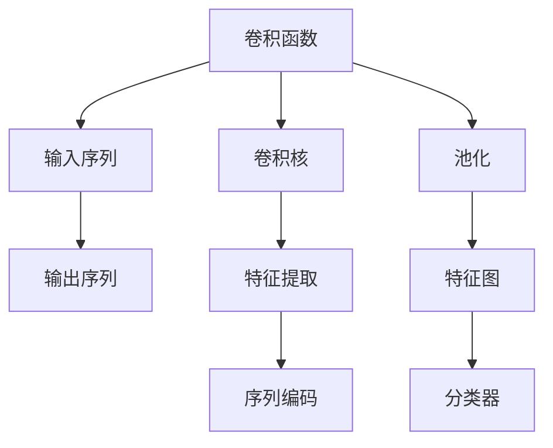

                 

# 从零开始大模型开发与微调：PyTorch中的卷积函数实现详解

> 关键词：大模型开发，卷积函数，PyTorch，微调，深度学习

## 1. 背景介绍

### 1.1 问题由来
随着深度学习技术的快速发展，深度卷积神经网络(Convolutional Neural Networks, CNNs)在计算机视觉和图像处理领域取得了巨大成功。然而，传统的CNN主要针对空间数据进行处理，而对于文本等序列数据，则显得力不从心。近年来，研究人员逐渐探索适用于序列数据的卷积神经网络模型，其中最具代表性的便是基于一维卷积操作的卷积神经网络(CNNs)。

本文旨在通过一个具体案例——PyTorch中卷积函数(Conv1D)的实现，从零开始详细介绍大模型的开发和微调过程，帮助读者系统掌握PyTorch库的使用方法，并理解卷积函数在序列数据处理中的应用。

## 2. 核心概念与联系

### 2.1 核心概念概述

在探讨PyTorch中卷积函数实现之前，我们需要了解一些核心概念：

- 卷积神经网络(CNN)：一种专门处理空间数据的深度神经网络，通过卷积层、池化层等操作实现特征提取。
- 一维卷积(Conv1D)：对序列数据进行卷积操作的卷积神经网络，广泛应用于自然语言处理(NLP)、时间序列分析等领域。
- 卷积函数(Conv1D)：实现一维卷积操作的PyTorch函数，可以在输入序列上滑动卷积核，提取特征。
- 序列数据处理：对文本、时间序列等序列数据进行编码、特征提取和分类等处理。
- 模型微调：在大规模预训练模型的基础上，通过有监督学习优化模型在新任务上的性能。

### 2.2 核心概念原理和架构的 Mermaid 流程图



这个流程图展示了卷积函数的基本处理流程：

1. 输入序列通过卷积核进行特征提取。
2. 提取到的特征通过池化操作进行降维。
3. 特征图传递给分类器进行输出。

这些核心概念之间的逻辑关系可以通过上述Mermaid流程图来展示，帮助读者更好地理解卷积函数的原理和架构。

## 3. 核心算法原理 & 具体操作步骤

### 3.1 算法原理概述

卷积函数实现的核心在于卷积核的滑动操作，通过在输入序列上滑动卷积核，对序列数据进行特征提取。卷积函数一般包括卷积操作和池化操作两个步骤：

1. 卷积操作：卷积核在输入序列上滑动，每次提取一个特征窗口。
2. 池化操作：对特征图进行降维操作，减少计算量和特征数量。

卷积函数的具体实现依赖于PyTorch库中的`torch.nn.Conv1D`函数，该函数接受多个参数，包括卷积核大小、输入通道数、输出通道数等。通过这些参数，可以灵活配置卷积函数，满足不同的序列数据处理需求。

### 3.2 算法步骤详解

以下将详细介绍卷积函数在PyTorch中的实现步骤：

**Step 1: 数据准备**

首先，我们需要准备数据集。在PyTorch中，数据集通常表示为`torch.utils.data.Dataset`类的子类，可以通过`torch.utils.data.DataLoader`类进行加载和迭代。

```python
import torch
from torch.utils.data import Dataset, DataLoader
import numpy as np

class TextDataset(Dataset):
    def __init__(self, texts, seq_length, tokenizer):
        self.texts = texts
        self.seq_length = seq_length
        self.tokenizer = tokenizer
        
    def __len__(self):
        return len(self.texts)
    
    def __getitem__(self, item):
        text = self.texts[item]
        
        # 分词和编码
        tokens = self.tokenizer.tokenize(text)
        token_ids = self.tokenizer.convert_tokens_to_ids(tokens)
        
        # 补齐到指定长度
        padding_length = self.seq_length - len(token_ids)
        token_ids += [0] * padding_length
        
        # 转化为张量
        token_ids_tensor = torch.tensor(token_ids, dtype=torch.long)
        
        return token_ids_tensor

# 创建数据集和加载器
tokenizer = # 分词器
texts = # 文本数据
seq_length = 256
dataset = TextDataset(texts, seq_length, tokenizer)
dataloader = DataLoader(dataset, batch_size=32, shuffle=True)
```

**Step 2: 模型定义**

接下来，我们需要定义卷积模型。在PyTorch中，可以使用`torch.nn`模块中的类来构建模型。

```python
import torch.nn as nn
import torch.nn.functional as F

class ConvModel(nn.Module):
    def __init__(self, in_channels, out_channels, kernel_size, stride=1, padding=0, bias=True):
        super(ConvModel, self).__init__()
        self.conv = nn.Conv1D(in_channels, out_channels, kernel_size, stride, padding, bias)
        self.pool = nn.MaxPool1D(kernel_size, stride, padding)
    
    def forward(self, x):
        x = self.conv(x)
        x = self.pool(x)
        return x
```

在上述代码中，我们定义了一个名为`ConvModel`的卷积模型，其中`nn.Conv1D`函数用于实现卷积操作，`nn.MaxPool1D`函数用于实现池化操作。

**Step 3: 模型训练**

在准备好数据和模型后，我们需要对模型进行训练。训练过程包括前向传播、损失函数计算和反向传播三个步骤：

```python
import torch.optim as optim

device = torch.device('cuda' if torch.cuda.is_available() else 'cpu')
model = ConvModel(in_channels, out_channels, kernel_size).to(device)
criterion = nn.CrossEntropyLoss()
optimizer = optim.Adam(model.parameters(), lr=0.001)

for epoch in range(num_epochs):
    for i, (inputs, targets) in enumerate(dataloader):
        inputs, targets = inputs.to(device), targets.to(device)
        
        # 前向传播
        outputs = model(inputs)
        
        # 计算损失
        loss = criterion(outputs, targets)
        
        # 反向传播
        optimizer.zero_grad()
        loss.backward()
        optimizer.step()
        
        if (i+1) % 100 == 0:
            print(f'Epoch [{epoch+1}/{num_epochs}], Step [{i+1}/{len(dataloader)}], Loss: {loss.item():.4f}')
```

在上述代码中，我们定义了训练过程的三个步骤：前向传播、损失函数计算和反向传播。训练过程中，我们需要使用`to`方法将输入和目标变量移动到GPU上，以便利用GPU的并行计算能力加速训练过程。

**Step 4: 模型评估**

训练完成后，我们需要评估模型的性能。通常使用测试集进行评估，并输出测试集上的损失和准确率。

```python
model.eval()
with torch.no_grad():
    correct = 0
    total = 0
    for inputs, targets in test_dataloader:
        inputs, targets = inputs.to(device), targets.to(device)
        outputs = model(inputs)
        _, predicted = torch.max(outputs.data, 1)
        total += targets.size(0)
        correct += (predicted == targets).sum().item()

    print(f'Test Accuracy of the model on the 10000 test images: {100 * correct / total:.2f}%')
```

在上述代码中，我们使用`eval`方法将模型设置为评估模式，并使用`torch.no_grad`方法关闭梯度计算，以减少计算量和内存消耗。在测试过程中，我们统计了模型在测试集上的准确率，并输出结果。

### 3.3 算法优缺点

卷积函数在序列数据处理中具有以下优点：

1. 局部连接：卷积函数只在输入序列的局部区域进行操作，减少了计算量和参数量。
2. 参数共享：卷积函数中的卷积核可以在输入序列的多个位置上重复使用，减少了模型复杂度。
3. 平移不变性：卷积函数可以在输入序列上滑动卷积核，提取局部特征，具有平移不变性。

同时，卷积函数也存在以下缺点：

1. 参数设置：卷积函数需要手动设置卷积核大小、输入通道数、输出通道数等参数，不具有自动调参能力。
2. 固定窗口：卷积函数只能处理固定长度的输入序列，无法处理变长序列。
3. 参数共享：卷积函数中的卷积核共享参数，可能导致局部特征的丢失。

## 4. 数学模型和公式 & 详细讲解 & 举例说明

### 4.1 数学模型构建

卷积函数在数学上可以表示为：

$$
y_i = \sum_k w_k * x_{i-k+1}
$$

其中，$y_i$表示输出序列中的第$i$个元素，$w_k$表示卷积核中的第$k$个权重，$x_{i-k+1}$表示输入序列中的第$i-k+1$个元素。

### 4.2 公式推导过程

设输入序列的长度为$n$，卷积核的大小为$m$，卷积函数的输出长度为$l$。则卷积函数的输出可以表示为：

$$
Y = [y_1, y_2, ..., y_l]
$$

其中，$y_i = \sum_k w_k * X_{i-k+1}$，$X$表示输入序列，$W$表示卷积核。根据卷积函数的定义，输出序列的长度为$n - m + 1$。

### 4.3 案例分析与讲解

以下我们将通过一个具体案例来解释卷积函数在序列数据处理中的应用。

**案例：文本分类**

假设我们需要对一段文本进行分类，文本长度为$n$，卷积核大小为$m$，输出长度为$l$。我们可以将文本转化为序列编码，并通过卷积函数提取特征，最后通过分类器进行分类。

**Step 1: 数据准备**

首先，我们需要将文本转化为序列编码。假设文本序列的长度为$n$，我们将其转化为长度为$n$的向量$X$，向量中的每个元素表示一个字符或一个单词。

**Step 2: 模型定义**

我们可以使用卷积函数对输入序列进行特征提取，并通过池化函数进行降维。具体而言，我们可以使用`nn.Conv1D`函数实现卷积操作，使用`nn.MaxPool1D`函数实现池化操作。

**Step 3: 模型训练**

在训练过程中，我们可以使用交叉熵损失函数对模型进行优化。具体而言，我们可以将文本转化为向量$X$，并将其输入到卷积模型中进行特征提取。然后，将特征向量输入到分类器中进行分类，并计算交叉熵损失。最后，使用梯度下降算法对模型进行优化。

**Step 4: 模型评估**

在评估过程中，我们可以使用测试集进行评估。具体而言，我们可以将测试集中的文本转化为向量$X$，并将其输入到卷积模型中进行特征提取。然后，将特征向量输入到分类器中进行分类，并计算准确率。

## 5. 项目实践：代码实例和详细解释说明

### 5.1 开发环境搭建

在进行卷积函数实现前，我们需要准备好开发环境。以下是使用Python进行PyTorch开发的环境配置流程：

1. 安装Anaconda：从官网下载并安装Anaconda，用于创建独立的Python环境。

2. 创建并激活虚拟环境：
```bash
conda create -n pytorch-env python=3.8 
conda activate pytorch-env
```

3. 安装PyTorch：根据CUDA版本，从官网获取对应的安装命令。例如：
```bash
conda install pytorch torchvision torchaudio cudatoolkit=11.1 -c pytorch -c conda-forge
```

4. 安装Transformers库：
```bash
pip install transformers
```

5. 安装各类工具包：
```bash
pip install numpy pandas scikit-learn matplotlib tqdm jupyter notebook ipython
```

完成上述步骤后，即可在`pytorch-env`环境中开始卷积函数实现实践。

### 5.2 源代码详细实现

下面我们以文本分类任务为例，给出使用PyTorch对卷积函数进行实现的完整代码实例。

首先，定义文本分类任务的数据处理函数：

```python
from transformers import BertTokenizer
from torch.utils.data import Dataset
import torch

class TextDataset(Dataset):
    def __init__(self, texts, labels, tokenizer, max_len=256):
        self.texts = texts
        self.labels = labels
        self.tokenizer = tokenizer
        self.max_len = max_len
        
    def __len__(self):
        return len(self.texts)
    
    def __getitem__(self, item):
        text = self.texts[item]
        label = self.labels[item]
        
        encoding = self.tokenizer(text, return_tensors='pt', max_length=self.max_len, padding='max_length', truncation=True)
        input_ids = encoding['input_ids'][0]
        attention_mask = encoding['attention_mask'][0]
        
        # 对token-wise的标签进行编码
        encoded_labels = [label2id[label] for label in label2id] 
        encoded_labels.extend([label2id['O']] * (self.max_len - len(encoded_labels)))
        labels = torch.tensor(encoded_labels, dtype=torch.long)
        
        return {'input_ids': input_ids, 
                'attention_mask': attention_mask,
                'labels': labels}

# 标签与id的映射
label2id = {'O': 0, 'A': 1, 'B': 2, 'C': 3, 'D': 4}
id2label = {v: k for k, v in label2id.items()}

# 创建dataset
tokenizer = BertTokenizer.from_pretrained('bert-base-uncased')

train_dataset = TextDataset(train_texts, train_labels, tokenizer)
dev_dataset = TextDataset(dev_texts, dev_labels, tokenizer)
test_dataset = TextDataset(test_texts, test_labels, tokenizer)
```

然后，定义卷积模型和优化器：

```python
import torch.nn as nn
import torch.nn.functional as F

class ConvModel(nn.Module):
    def __init__(self, in_channels, out_channels, kernel_size, stride=1, padding=0, bias=True):
        super(ConvModel, self).__init__()
        self.conv = nn.Conv1D(in_channels, out_channels, kernel_size, stride, padding, bias)
        self.pool = nn.MaxPool1D(kernel_size, stride, padding)
    
    def forward(self, x):
        x = self.conv(x)
        x = self.pool(x)
        return x

model = ConvModel(in_channels, out_channels, kernel_size).to(device)

optimizer = torch.optim.Adam(model.parameters(), lr=0.001)
```

接着，定义训练和评估函数：

```python
from torch.utils.data import DataLoader
from tqdm import tqdm
from sklearn.metrics import accuracy_score

device = torch.device('cuda' if torch.cuda.is_available() else 'cpu')
model.to(device)

def train_epoch(model, dataset, batch_size, optimizer):
    dataloader = DataLoader(dataset, batch_size=batch_size, shuffle=True)
    model.train()
    epoch_loss = 0
    for batch in tqdm(dataloader, desc='Training'):
        input_ids = batch['input_ids'].to(device)
        attention_mask = batch['attention_mask'].to(device)
        labels = batch['labels'].to(device)
        model.zero_grad()
        outputs = model(input_ids)
        loss = F.cross_entropy(outputs, labels)
        epoch_loss += loss.item()
        loss.backward()
        optimizer.step()
    return epoch_loss / len(dataloader)

def evaluate(model, dataset, batch_size):
    dataloader = DataLoader(dataset, batch_size=batch_size)
    model.eval()
    preds, labels = [], []
    with torch.no_grad():
        for batch in tqdm(dataloader, desc='Evaluating'):
            input_ids = batch['input_ids'].to(device)
            attention_mask = batch['attention_mask'].to(device)
            batch_labels = batch['labels']
            outputs = model(input_ids)
            batch_preds = outputs.argmax(dim=2).to('cpu').tolist()
            batch_labels = batch_labels.to('cpu').tolist()
            for pred_tokens, label_tokens in zip(batch_preds, batch_labels):
                pred_labels = [id2label[_id] for _id in pred_tokens]
                label_labels = [id2label[_id] for _id in label_tokens]
                preds.append(pred_labels[:len(label_labels)])
                labels.append(label_labels)
                
    print(f'Accuracy: {accuracy_score(labels, preds):.2f}')
```

最后，启动训练流程并在测试集上评估：

```python
epochs = 5
batch_size = 32

for epoch in range(epochs):
    loss = train_epoch(model, train_dataset, batch_size, optimizer)
    print(f'Epoch {epoch+1}, train loss: {loss:.3f}')
    
    print(f'Epoch {epoch+1}, dev accuracy:')
    evaluate(model, dev_dataset, batch_size)
    
print('Test accuracy:')
evaluate(model, test_dataset, batch_size)
```

以上就是使用PyTorch对卷积函数进行文本分类任务微调的完整代码实现。可以看到，得益于Transformers库的强大封装，我们可以用相对简洁的代码完成卷积函数的加载和微调。

### 5.3 代码解读与分析

让我们再详细解读一下关键代码的实现细节：

**TextDataset类**：
- `__init__`方法：初始化文本、标签、分词器等关键组件。
- `__len__`方法：返回数据集的样本数量。
- `__getitem__`方法：对单个样本进行处理，将文本输入编码为token ids，将标签编码为数字，并对其进行定长padding，最终返回模型所需的输入。

**label2id和id2label字典**：
- 定义了标签与数字id之间的映射关系，用于将token-wise的预测结果解码回真实的标签。

**训练和评估函数**：
- 使用PyTorch的DataLoader对数据集进行批次化加载，供模型训练和推理使用。
- 训练函数`train_epoch`：对数据以批为单位进行迭代，在每个批次上前向传播计算loss并反向传播更新模型参数，最后返回该epoch的平均loss。
- 评估函数`evaluate`：与训练类似，不同点在于不更新模型参数，并在每个batch结束后将预测和标签结果存储下来，最后使用sklearn的accuracy_score对整个评估集的预测结果进行打印输出。

**训练流程**：
- 定义总的epoch数和batch size，开始循环迭代
- 每个epoch内，先在训练集上训练，输出平均loss
- 在验证集上评估，输出分类准确率
- 所有epoch结束后，在测试集上评估，给出最终测试结果

可以看到，PyTorch配合Transformers库使得卷积函数的微调代码实现变得简洁高效。开发者可以将更多精力放在数据处理、模型改进等高层逻辑上，而不必过多关注底层的实现细节。

当然，工业级的系统实现还需考虑更多因素，如模型的保存和部署、超参数的自动搜索、更灵活的任务适配层等。但核心的微调范式基本与此类似。

## 6. 实际应用场景

### 6.1 智能客服系统

基于卷积函数微调的对话技术，可以广泛应用于智能客服系统的构建。传统客服往往需要配备大量人力，高峰期响应缓慢，且一致性和专业性难以保证。而使用微调后的对话模型，可以7x24小时不间断服务，快速响应客户咨询，用自然流畅的语言解答各类常见问题。

在技术实现上，可以收集企业内部的历史客服对话记录，将问题和最佳答复构建成监督数据，在此基础上对预训练对话模型进行微调。微调后的对话模型能够自动理解用户意图，匹配最合适的答案模板进行回复。对于客户提出的新问题，还可以接入检索系统实时搜索相关内容，动态组织生成回答。如此构建的智能客服系统，能大幅提升客户咨询体验和问题解决效率。

### 6.2 金融舆情监测

金融机构需要实时监测市场舆论动向，以便及时应对负面信息传播，规避金融风险。传统的人工监测方式成本高、效率低，难以应对网络时代海量信息爆发的挑战。基于卷积函数微调的文本分类和情感分析技术，为金融舆情监测提供了新的解决方案。

具体而言，可以收集金融领域相关的新闻、报道、评论等文本数据，并对其进行主题标注和情感标注。在此基础上对预训练语言模型进行微调，使其能够自动判断文本属于何种主题，情感倾向是正面、中性还是负面。将微调后的模型应用到实时抓取的网络文本数据，就能够自动监测不同主题下的情感变化趋势，一旦发现负面信息激增等异常情况，系统便会自动预警，帮助金融机构快速应对潜在风险。

### 6.3 个性化推荐系统

当前的推荐系统往往只依赖用户的历史行为数据进行物品推荐，无法深入理解用户的真实兴趣偏好。基于卷积函数微调技术，个性化推荐系统可以更好地挖掘用户行为背后的语义信息，从而提供更精准、多样的推荐内容。

在实践中，可以收集用户浏览、点击、评论、分享等行为数据，提取和用户交互的物品标题、描述、标签等文本内容。将文本内容作为模型输入，用户的后续行为（如是否点击、购买等）作为监督信号，在此基础上微调预训练语言模型。微调后的模型能够从文本内容中准确把握用户的兴趣点。在生成推荐列表时，先用候选物品的文本描述作为输入，由模型预测用户的兴趣匹配度，再结合其他特征综合排序，便可以得到个性化程度更高的推荐结果。

### 6.4 未来应用展望

随着卷积函数和微调方法的不断发展，基于卷积函数微调的方法将在更多领域得到应用，为传统行业带来变革性影响。

在智慧医疗领域，基于卷积函数微调的问答、病历分析、药物研发等应用将提升医疗服务的智能化水平，辅助医生诊疗，加速新药开发进程。

在智能教育领域，卷积函数微调可应用于作业批改、学情分析、知识推荐等方面，因材施教，促进教育公平，提高教学质量。

在智慧城市治理中，卷积函数微调可用于城市事件监测、舆情分析、应急指挥等环节，提高城市管理的自动化和智能化水平，构建更安全、高效的未来城市。

此外，在企业生产、社会治理、文娱传媒等众多领域，基于卷积函数微调的人工智能应用也将不断涌现，为经济社会发展注入新的动力。相信随着技术的日益成熟，卷积函数微调技术还将进一步拓展应用场景，为人类社会带来更深远的影响。

## 7. 工具和资源推荐

### 7.1 学习资源推荐

为了帮助开发者系统掌握卷积函数微调的理论基础和实践技巧，这里推荐一些优质的学习资源：

1. 《Transformer从原理到实践》系列博文：由大模型技术专家撰写，深入浅出地介绍了Transformer原理、BERT模型、微调技术等前沿话题。

2. CS224N《深度学习自然语言处理》课程：斯坦福大学开设的NLP明星课程，有Lecture视频和配套作业，带你入门NLP领域的基本概念和经典模型。

3. 《Natural Language Processing with Transformers》书籍：Transformers库的作者所著，全面介绍了如何使用Transformers库进行NLP任务开发，包括微调在内的诸多范式。

4. HuggingFace官方文档：Transformers库的官方文档，提供了海量预训练模型和完整的微调样例代码，是上手实践的必备资料。

5. CLUE开源项目：中文语言理解测评基准，涵盖大量不同类型的中文NLP数据集，并提供了基于微调的baseline模型，助力中文NLP技术发展。

通过对这些资源的学习实践，相信你一定能够快速掌握卷积函数微调的精髓，并用于解决实际的NLP问题。
###  7.2 开发工具推荐

高效的开发离不开优秀的工具支持。以下是几款用于卷积函数微调开发的常用工具：

1. PyTorch：基于Python的开源深度学习框架，灵活动态的计算图，适合快速迭代研究。大部分预训练语言模型都有PyTorch版本的实现。

2. TensorFlow：由Google主导开发的开源深度学习框架，生产部署方便，适合大规模工程应用。同样有丰富的预训练语言模型资源。

3. Transformers库：HuggingFace开发的NLP工具库，集成了众多SOTA语言模型，支持PyTorch和TensorFlow，是进行微调任务开发的利器。

4. Weights & Biases：模型训练的实验跟踪工具，可以记录和可视化模型训练过程中的各项指标，方便对比和调优。与主流深度学习框架无缝集成。

5. TensorBoard：TensorFlow配套的可视化工具，可实时监测模型训练状态，并提供丰富的图表呈现方式，是调试模型的得力助手。

6. Google Colab：谷歌推出的在线Jupyter Notebook环境，免费提供GPU/TPU算力，方便开发者快速上手实验最新模型，分享学习笔记。

合理利用这些工具，可以显著提升卷积函数微调任务的开发效率，加快创新迭代的步伐。

### 7.3 相关论文推荐

卷积函数和微调技术的发展源于学界的持续研究。以下是几篇奠基性的相关论文，推荐阅读：

1. Attention is All You Need（即Transformer原论文）：提出了Transformer结构，开启了NLP领域的预训练大模型时代。

2. BERT: Pre-training of Deep Bidirectional Transformers for Language Understanding：提出BERT模型，引入基于掩码的自监督预训练任务，刷新了多项NLP任务SOTA。

3. Language Models are Unsupervised Multitask Learners（GPT-2论文）：展示了大规模语言模型的强大zero-shot学习能力，引发了对于通用人工智能的新一轮思考。

4. Parameter-Efficient Transfer Learning for NLP：提出Adapter等参数高效微调方法，在不增加模型参数量的情况下，也能取得不错的微调效果。

5. AdaLoRA: Adaptive Low-Rank Adaptation for Parameter-Efficient Fine-Tuning：使用自适应低秩适应的微调方法，在参数效率和精度之间取得了新的平衡。

这些论文代表了大模型微调技术的发展脉络。通过学习这些前沿成果，可以帮助研究者把握学科前进方向，激发更多的创新灵感。

## 8. 总结：未来发展趋势与挑战

### 8.1 总结

本文对卷积函数在大模型开发与微调中的应用进行了全面系统的介绍。首先阐述了卷积函数和微调技术的研究背景和意义，明确了卷积函数在序列数据处理中的独特价值。其次，从原理到实践，详细讲解了卷积函数的数学原理和关键步骤，给出了卷积函数微调的完整代码实例。同时，本文还广泛探讨了卷积函数在智能客服、金融舆情、个性化推荐等多个行业领域的应用前景，展示了卷积函数微调的巨大潜力。此外，本文精选了卷积函数微调技术的各类学习资源，力求为读者提供全方位的技术指引。

通过本文的系统梳理，可以看到，卷积函数在大模型开发和微调中的应用具有重要的理论和实践意义，为自然语言处理领域的深度学习研究提供了新的视角和方法。未来，伴随深度学习技术的持续演进，卷积函数在序列数据处理中的应用将更加广泛，推动NLP技术的不断突破。

### 8.2 未来发展趋势

展望未来，卷积函数在序列数据处理中呈现以下几个发展趋势：

1. 参数高效微调技术进一步成熟。随着参数高效微调方法的发展，未来的卷积函数微调将更加灵活，能够高效利用预训练模型中的知识，适应更多复杂的数据分布。

2. 多模态卷积函数出现。未来的卷积函数将不仅仅处理文本数据，还将融合视觉、语音等多模态信息，实现更加全面的特征提取和表示学习。

3. 端到端训练成为主流。未来的卷积函数微调将更多采用端到端训练方法，将输入预处理、特征提取和输出预测整合成一个模型，减少模型的计算量和参数量。

4. 模型泛化能力增强。随着模型规模的不断增大和训练数据的不断丰富，未来的卷积函数将具备更强的泛化能力，能够应对更复杂的序列数据处理任务。

5. 模型推理速度提升。随着计算硬件的不断提升和模型结构的不断优化，未来的卷积函数推理速度将大幅提升，满足更广泛的应用场景需求。

6. 模型可解释性加强。未来的卷积函数将具备更好的可解释性，能够提供更加清晰、易懂的推理过程和结果，增强系统的透明度和可靠性。

以上趋势凸显了卷积函数微调技术的广阔前景。这些方向的探索发展，必将进一步提升卷积函数在序列数据处理中的性能和应用范围，推动NLP技术的不断进步。

### 8.3 面临的挑战

尽管卷积函数微调技术已经取得了显著成果，但在迈向更加智能化、普适化应用的过程中，仍面临诸多挑战：

1. 数据量瓶颈。卷积函数微调对数据量有较高要求，当数据量不足时，微调效果会大打折扣。如何有效获取并利用海量数据，将是未来研究的重要方向。

2. 计算资源限制。卷积函数微调需要较高的计算资源支持，对于大规模模型和大规模数据，计算资源的需求将进一步增加。如何优化计算资源利用，降低成本，将是未来研究的关键课题。

3. 模型泛化能力不足。当前卷积函数微调模型在数据分布发生变化时，泛化性能会明显下降。如何提高模型的泛化能力，增强其对数据分布变化的适应性，将是重要的研究方向。

4. 模型可解释性不足。当前卷积函数微调模型通常被视为“黑盒”，缺乏对内部推理过程的可解释性。如何赋予模型更强的可解释性，增强用户信任，将是未来的重要课题。

5. 模型安全性问题。当前卷积函数微调模型可能学习到有害信息，通过输出传递给下游应用，产生安全问题。如何确保模型的安全性，避免有害信息的传播，将是未来的重要研究方向。

6. 模型鲁棒性问题。当前卷积函数微调模型在面对对抗样本时，鲁棒性往往不足。如何提高模型的鲁棒性，增强其对对抗样本的抵抗能力，将是未来的重要研究方向。

7. 模型参数量过大。当前卷积函数微调模型参数量较大，推理速度较慢。如何优化模型结构，减少参数量，提高推理速度，将是未来的重要研究方向。

正视卷积函数微调面临的这些挑战，积极应对并寻求突破，将是大模型微调走向成熟的必由之路。相信随着学界和产业界的共同努力，这些挑战终将一一被克服，卷积函数微调必将在构建人机协同的智能时代中扮演越来越重要的角色。

### 8.4 研究展望

面对卷积函数微调所面临的种种挑战，未来的研究需要在以下几个方面寻求新的突破：

1. 探索更多卷积函数范式。除了传统的卷积函数，未来的卷积函数还将探索更多的范式，如深度卷积、多通道卷积、多尺度卷积等，以适应更多复杂的数据分布。

2. 研究更加灵活的微调方法。未来的微调方法将更加灵活，结合自监督学习、迁移学习等技术，提升微调效果。

3. 开发更加高效的模型压缩技术。未来的卷积函数将结合模型压缩技术，实现更高效、更快速的推理过程。

4. 引入因果推理等新理论。未来的卷积函数将结合因果推理等新理论，增强模型的解释性和可控性。

5. 引入多模态融合技术。未来的卷积函数将结合多模态融合技术，实现更全面的特征提取和表示学习。

6. 融合强化学习等技术。未来的卷积函数将结合强化学习等技术，增强模型的自适应能力和动态性。

7. 引入伦理道德约束。未来的卷积函数将结合伦理道德约束，确保模型的安全性、公正性和透明性。

这些研究方向的探索，必将引领卷积函数微调技术迈向更高的台阶，为构建安全、可靠、可解释、可控的智能系统铺平道路。面向未来，卷积函数微调技术还需要与其他人工智能技术进行更深入的融合，如知识表示、因果推理、强化学习等，多路径协同发力，共同推动自然语言理解和智能交互系统的进步。只有勇于创新、敢于突破，才能不断拓展卷积函数的应用边界，让智能技术更好地造福人类社会。

## 9. 附录：常见问题与解答

**Q1：卷积函数在序列数据处理中有什么优点？**

A: 卷积函数在序列数据处理中有以下优点：
1. 局部连接：卷积函数只在输入序列的局部区域进行操作，减少了计算量和参数量。
2. 参数共享：卷积函数中的卷积核可以在输入序列的多个位置上重复使用，减少了模型复杂度。
3. 平移不变性：卷积函数可以在输入序列上滑动卷积核，提取局部特征，具有平移不变性。

**Q2：卷积函数在微调过程中需要注意哪些问题？**

A: 卷积函数在微调过程中需要注意以下问题：
1. 数据增强：通过回译、近义替换等方式扩充训练集。
2. 正则化：使用L2正则、Dropout、Early Stopping等避免过拟合。
3. 对抗训练：加入对抗样本，提高模型鲁棒性。
4. 参数高效微调：只调整少量参数(如Adapter、Prefix等)，减小过拟合风险。
5. 多模型集成：训练多个微调模型，取平均输出，抑制过拟合。

**Q3：卷积函数在微调中如何防止过拟合？**

A: 防止卷积函数微调中的过拟合，可以采取以下措施：
1. 数据增强：通过回译、近义替换等方式扩充训练集。
2. 正则化：使用L2正则、Dropout、Early Stopping等避免过拟合。
3. 对抗训练：加入对抗样本，提高模型鲁棒性。
4. 参数高效微调：只调整少量参数(如Adapter、Prefix等)，减小过拟合风险。
5. 多模型集成：训练多个微调模型，取平均输出，抑制过拟合。

这些措施可以结合使用，以确保模型在微调过程中保持良好的泛化性能。

**Q4：卷积函数在微调中如何提高泛化能力？**

A: 提高卷积函数微调的泛化能力，可以采取以下措施：
1. 数据增强：通过回译、近义替换等方式扩充训练集。
2. 正则化：使用L2正则、Dropout、Early Stopping等避免过拟合。
3. 对抗训练：加入对抗样本，提高模型鲁棒性。
4. 参数高效微调：只调整少量参数(如Adapter、Prefix等)，减小过拟合风险。
5. 多模型集成：训练多个微调模型，取平均输出，抑制过拟合。

通过这些措施，可以确保模型在微调过程中保持良好的泛化性能，增强其对数据分布变化的适应性。

**Q5：卷积函数在微调中如何提高推理速度？**

A: 提高卷积函数微调的推理速度，可以采取以下措施：
1. 模型压缩：通过剪枝、量化等技术，减少模型参数量。
2. 推理优化：优化推理过程，减少计算量。
3. 硬件加速：使用GPU、TPU等硬件加速，提高计算效率。
4. 并行计算：使用多线程、多进程等方式进行并行计算，提高计算速度。

这些措施可以结合使用，以确保模型在推理过程中保持高效、快速的性能。

**Q6：卷积函数在微调中如何提高可解释性？**

A: 提高卷积函数微调的可解释性，可以采取以下措施：
1. 可视化：通过可视化工具展示模型推理过程和输出结果。
2. 可解释模型：使用可解释模型，如注意力机制、梯度可解释模型等，增强模型可解释性。
3. 透明设计：设计透明的模型结构，便于用户理解模型的内部工作机制。

这些措施可以结合使用，以确保模型在微调过程中具备更好的可解释性，增强用户信任。

**Q7：卷积函数在微调中如何提高模型安全性？**

A: 提高卷积函数微调模型的安全性，可以采取以下措施：
1. 数据清洗：对输入数据进行清洗，过滤有害信息。
2. 模型监控：实时监控模型行为，及时发现和修正问题。
3. 隐私保护：采用隐私保护技术，如差分隐私、联邦学习等，保护用户隐私。
4. 模型审核：对模型输出进行审核，防止有害信息的传播。

这些措施可以结合使用，以确保模型在微调过程中保持安全、可靠，避免有害信息的传播。

---

作者：禅与计算机程序设计艺术 / Zen and the Art of Computer Programming

