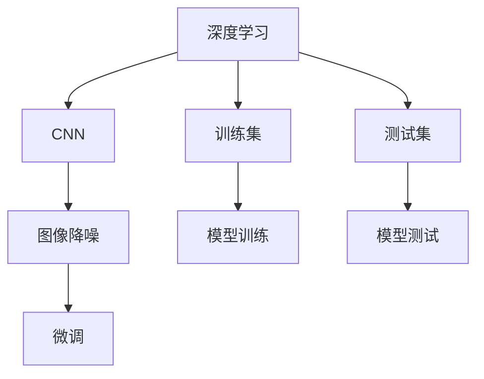

                 

# 从零开始大模型开发与微调：图像降噪：手把手实战第一个深度学习模型

> 关键词：深度学习，图像降噪，大模型，微调，卷积神经网络(CNN)

## 1. 背景介绍

### 1.1 问题由来

随着深度学习技术的迅速发展，深度神经网络(DNN)在计算机视觉、自然语言处理(NLP)、语音识别等诸多领域展示了强大的能力。图像降噪，作为图像处理领域的一个经典问题，旨在去除图像中的噪声，提升图像质量，是许多应用如医学影像分析、遥感图像处理、人脸识别等领域的基础技术。然而，传统的图像降噪方法往往依赖手工设计的滤波器或卷积核，参数固定、适用范围窄，无法处理复杂的图像噪声模式。近年来，利用深度神经网络学习图像降噪模型，通过大规模数据训练学习噪声表示和去除策略，取得了显著的效果。

### 1.2 问题核心关键点

- 大模型开发：从零开始构建深度学习模型，涉及模型选择、参数设置、数据准备、模型训练等环节。
- 图像降噪模型：一种针对图像噪声的深度学习模型，通过学习图像-噪声映射，实现噪声去除。
- 模型微调：在已有预训练模型基础上，针对特定任务（图像降噪）进行微调，提高模型性能。
- 卷积神经网络(CNN)：一种专门用于处理图像数据的神经网络结构，包含卷积层、池化层、全连接层等组件。
- 训练数据集：需要准备高质量的图像噪声数据集，用于模型的训练和评估。
- 损失函数：选择合适的损失函数，如均方误差(MSE)、结构相似性指数(SSIM)等，衡量模型输出与真实噪声去除效果。

## 2. 核心概念与联系

### 2.1 核心概念概述

为更好地理解图像降噪模型的开发与微调，本节将介绍几个关键概念：

- 深度学习：利用多层次的非线性映射关系，自动学习特征表示，提升模型的拟合能力。
- 卷积神经网络(CNN)：一种专门处理图像数据的神经网络，通过卷积、池化等操作提取局部特征，适用于图像分类、物体检测、图像降噪等任务。
- 图像降噪：通过模型学习噪声表示和去除策略，实现图像噪声的去除。
- 模型微调：在已有预训练模型基础上，针对特定任务进行微调，提高模型性能。
- 训练集和测试集：用于模型的训练和测试，评估模型泛化性能。

这些概念之间的关系可以通过以下Mermaid流程图来展示：



这个流程图展示了深度学习、CNN、图像降噪和模型微调之间的联系：

1. 深度学习提供了一种自动特征提取的方式。
2. CNN作为深度学习的一种特定结构，特别适合处理图像数据。
3. 图像降噪通过CNN模型学习噪声表示和去除策略。
4. 模型微调在已有预训练模型基础上，针对特定任务进行优化。
5. 训练集用于模型训练，测试集用于模型评估。

## 3. 核心算法原理 & 具体操作步骤
### 3.1 算法原理概述

图像降噪的深度学习模型通常基于卷积神经网络(CNN)，利用多层次卷积、池化等操作提取图像特征，学习噪声表示和去除策略。模型的训练目标是通过学习图像-噪声映射，使得模型能够准确预测并去除图像中的噪声。

形式化地，假设训练集 $D=\{(x_i, y_i)\}_{i=1}^N$，其中 $x_i$ 为图像噪声，$y_i$ 为去噪后的图像。模型的训练目标是最小化预测图像与真实去噪图像之间的误差，即：

$$
\min_{\theta} \mathcal{L}(M_{\theta}(x_i), y_i) = \min_{\theta} \frac{1}{N} \sum_{i=1}^N ||M_{\theta}(x_i) - y_i||^2
$$

其中 $\theta$ 为模型参数，$M_{\theta}(x_i)$ 为模型预测的去噪图像。

通过梯度下降等优化算法，模型不断更新参数 $\theta$，最小化损失函数，逐步逼近真实的去噪效果。

### 3.2 算法步骤详解

图像降噪模型的开发与微调一般包括以下关键步骤：

**Step 1: 准备数据集**
- 收集高质量的图像噪声数据集 $D=\{(x_i, y_i)\}_{i=1}^N$，并划分为训练集、验证集和测试集。
- 对图像进行预处理，如归一化、扩增等，确保数据的多样性和稳定性。

**Step 2: 设计CNN模型**
- 选择合适的CNN模型结构，如AlexNet、VGGNet、ResNet等，设计模型的输入输出和网络层。
- 设置卷积核大小、数量、步幅、激活函数等超参数。

**Step 3: 选择损失函数**
- 选择适合图像降噪任务的损失函数，如均方误差(MSE)、结构相似性指数(SSIM)等。
- 在模型中添加适当的正则化技术，如Dropout、L2正则化等，防止过拟合。

**Step 4: 训练模型**
- 使用随机梯度下降(SGD)、Adam等优化算法，设置合适的学习率、批大小等超参数。
- 将训练集数据分批次输入模型，进行前向传播和反向传播，更新模型参数。
- 周期性在验证集上评估模型性能，根据性能指标决定是否触发Early Stopping。
- 重复上述步骤直到满足预设的迭代轮数或Early Stopping条件。

**Step 5: 测试模型**
- 在测试集上评估模型的去噪效果，对比训练前后的精度提升。
- 使用测试集数据生成去噪图像，展示模型的应用效果。

以上是图像降噪模型的开发与微调的一般流程。在实际应用中，还需要针对具体任务特点，对模型进行优化设计，如改进网络结构、引入更多正则化技术、搜索最优的超参数组合等，以进一步提升模型性能。

### 3.3 算法优缺点

图像降噪模型的开发与微调方法具有以下优点：
1. 自动特征提取：深度学习模型能够自动提取图像特征，避免了手工设计滤波器或卷积核的繁琐过程。
2. 学习能力：通过大量噪声数据训练，模型能够学习复杂的噪声模式，适应多种噪声类型。
3. 泛化性强：模型具备较好的泛化能力，能够适应不同场景下的噪声去除需求。
4. 高效训练：深度学习模型利用GPU/TPU等高性能设备，加速模型训练过程。

同时，该方法也存在一定的局限性：
1. 数据依赖：模型性能依赖于高质量、多样化的训练数据，数据获取和标注成本较高。
2. 过拟合风险：深度学习模型容易出现过拟合，尤其是在数据量不足的情况下。
3. 模型复杂度：大模型参数量庞大，训练和推理资源消耗较大。
4. 可解释性差：深度学习模型通常被认为是"黑盒"系统，难以解释其内部工作机制。

尽管存在这些局限性，但深度学习模型在图像降噪任务上已经取得了显著的效果，成为了图像处理领域的主流方法。未来相关研究的重点在于如何进一步降低模型对数据的需求，提高模型的泛化能力，同时兼顾可解释性和效率等因素。

### 3.4 算法应用领域

图像降噪模型已经在医学影像处理、遥感图像分析、视频处理、工业检测等领域得到了广泛应用，具体如下：

- 医学影像处理：利用图像降噪模型去除医学影像中的噪声，提高影像清晰度，辅助医生诊断。
- 遥感图像分析：通过图像降噪，提升遥感图像的分辨率和质量，支持环境监测、资源评估等任务。
- 视频处理：在视频编解码过程中，利用图像降噪提升视频质量，减少抖动、模糊等现象。
- 工业检测：在工业产品检测过程中，利用图像降噪模型去除表面噪声，提高检测精度。

此外，图像降噪技术还被创新性地应用于人脸识别、图像去雾、图像压缩等领域，为图像处理技术带来了新的突破。随着深度学习模型的不断发展，相信图像降噪技术将在更多领域得到应用，进一步提升图像处理的智能化水平。

## 4. 数学模型和公式 & 详细讲解 & 举例说明

### 4.1 数学模型构建

本节将使用数学语言对图像降噪模型的开发与微调过程进行更加严格的刻画。

假设图像噪声 $x$ 的噪声强度为 $n$，去噪后的图像 $y$ 与噪声强度 $n$ 的关系为：

$$
y = f(x, n) + \epsilon
$$

其中 $f(x, n)$ 为去噪函数，$\epsilon$ 为随机噪声。

定义模型 $M_{\theta}$ 在输入图像噪声 $x$ 上的预测去噪图像 $y$ 为：

$$
y = M_{\theta}(x)
$$

模型的训练目标是最小化预测图像与真实去噪图像之间的误差，即：

$$
\min_{\theta} \mathcal{L}(M_{\theta}(x), y) = \min_{\theta} \frac{1}{N} \sum_{i=1}^N ||M_{\theta}(x_i) - y_i||^2
$$

其中 $\theta$ 为模型参数，$M_{\theta}(x_i)$ 为模型预测的去噪图像，$y_i$ 为真实去噪图像。

通过梯度下降等优化算法，模型不断更新参数 $\theta$，最小化损失函数，逐步逼近真实的去噪效果。

### 4.2 公式推导过程

以均方误差(MSE)作为损失函数为例，进行详细推导。

均方误差损失函数为：

$$
\mathcal{L}(M_{\theta}(x), y) = \frac{1}{N} \sum_{i=1}^N ||M_{\theta}(x_i) - y_i||^2
$$

对 $\theta$ 求导，得：

$$
\frac{\partial \mathcal{L}(M_{\theta}(x), y)}{\partial \theta} = \frac{1}{N} \sum_{i=1}^N 2 (M_{\theta}(x_i) - y_i) \nabla_{\theta} M_{\theta}(x_i)
$$

其中 $\nabla_{\theta} M_{\theta}(x_i)$ 为模型 $M_{\theta}(x_i)$ 对参数 $\theta$ 的梯度，可通过反向传播算法高效计算。

在得到损失函数的梯度后，即可带入参数更新公式，完成模型的迭代优化。重复上述过程直至收敛，最终得到适应图像降噪任务的优化模型参数 $\theta^*$。

### 4.3 案例分析与讲解

以VGGNet模型为例，分析其结构特点和应用效果。

VGGNet模型是一种经典的卷积神经网络结构，由多个卷积层、池化层和全连接层组成。其中卷积层和池化层用于提取图像特征，全连接层用于分类或回归任务。在图像降噪中，通常只需要设计适当的卷积层和池化层，以提取图像噪声特征，最后通过全连接层进行去噪处理。

VGGNet模型的具体实现如下：

```python
import torch
import torch.nn as nn

class VGGNet(nn.Module):
    def __init__(self):
        super(VGGNet, self).__init__()
        self.conv1 = nn.Conv2d(1, 64, kernel_size=3, stride=1, padding=1)
        self.relu1 = nn.ReLU(inplace=True)
        self.pool1 = nn.MaxPool2d(kernel_size=2, stride=2)
        self.conv2 = nn.Conv2d(64, 128, kernel_size=3, stride=1, padding=1)
        self.relu2 = nn.ReLU(inplace=True)
        self.pool2 = nn.MaxPool2d(kernel_size=2, stride=2)
        self.conv3 = nn.Conv2d(128, 256, kernel_size=3, stride=1, padding=1)
        self.relu3 = nn.ReLU(inplace=True)
        self.pool3 = nn.MaxPool2d(kernel_size=2, stride=2)
        self.conv4 = nn.Conv2d(256, 256, kernel_size=3, stride=1, padding=1)
        self.relu4 = nn.ReLU(inplace=True)
        self.pool4 = nn.MaxPool2d(kernel_size=2, stride=2)
        self.conv5 = nn.Conv2d(256, 256, kernel_size=3, stride=1, padding=1)
        self.relu5 = nn.ReLU(inplace=True)
        self.pool5 = nn.MaxPool2d(kernel_size=2, stride=2)
        self.fc6 = nn.Linear(256 * 2 * 2 * 2, 4096)
        self.relu6 = nn.ReLU(inplace=True)
        self.dropout6 = nn.Dropout(p=0.5)
        self.fc7 = nn.Linear(4096, 1000)
        self.relu7 = nn.ReLU(inplace=True)
        self.fc8 = nn.Linear(1000, 1)
        self.sigmoid = nn.Sigmoid()

    def forward(self, x):
        x = self.conv1(x)
        x = self.relu1(x)
        x = self.pool1(x)
        x = self.conv2(x)
        x = self.relu2(x)
        x = self.pool2(x)
        x = self.conv3(x)
        x = self.relu3(x)
        x = self.pool3(x)
        x = self.conv4(x)
        x = self.relu4(x)
        x = self.pool4(x)
        x = self.conv5(x)
        x = self.relu5(x)
        x = self.pool5(x)
        x = x.view(x.size(0), -1)
        x = self.fc6(x)
        x = self.relu6(x)
        x = self.dropout6(x)
        x = self.fc7(x)
        x = self.relu7(x)
        x = self.fc8(x)
        x = self.sigmoid(x)
        return x
```

在模型训练过程中，可以使用GPU/TPU等高性能设备加速计算。同时，为提高模型的泛化能力，可以使用数据增强技术，如随机裁剪、旋转、翻转等，扩充训练集的多样性。

## 5. 项目实践：代码实例和详细解释说明

### 5.1 开发环境搭建

在进行图像降噪模型开发与微调前，需要先准备好开发环境。以下是使用Python进行PyTorch开发的环境配置流程：

1. 安装Anaconda：从官网下载并安装Anaconda，用于创建独立的Python环境。

2. 创建并激活虚拟环境：
```bash
conda create -n pytorch-env python=3.8 
conda activate pytorch-env
```

3. 安装PyTorch：根据CUDA版本，从官网获取对应的安装命令。例如：
```bash
conda install pytorch torchvision torchaudio cudatoolkit=11.1 -c pytorch -c conda-forge
```

4. 安装TensorBoard：用于可视化模型训练过程和结果。
```bash
pip install tensorboard
```

5. 安装numpy、pandas、matplotlib等科学计算库：
```bash
pip install numpy pandas matplotlib scikit-learn tqdm jupyter notebook ipython
```

完成上述步骤后，即可在`pytorch-env`环境中开始模型开发与微调。

### 5.2 源代码详细实现

下面以一个简单的图像降噪模型为例，展示其开发与微调的过程。

首先，定义模型类：

```python
import torch
import torch.nn as nn
import torch.optim as optim
from torch.utils.data import DataLoader
from torchvision import datasets, transforms
from torchvision.utils import save_image

class ImageNoiseNet(nn.Module):
    def __init__(self):
        super(ImageNoiseNet, self).__init__()
        self.conv1 = nn.Conv2d(1, 64, kernel_size=3, stride=1, padding=1)
        self.relu1 = nn.ReLU(inplace=True)
        self.pool1 = nn.MaxPool2d(kernel_size=2, stride=2)
        self.conv2 = nn.Conv2d(64, 128, kernel_size=3, stride=1, padding=1)
        self.relu2 = nn.ReLU(inplace=True)
        self.pool2 = nn.MaxPool2d(kernel_size=2, stride=2)
        self.conv3 = nn.Conv2d(128, 256, kernel_size=3, stride=1, padding=1)
        self.relu3 = nn.ReLU(inplace=True)
        self.pool3 = nn.MaxPool2d(kernel_size=2, stride=2)
        self.conv4 = nn.Conv2d(256, 256, kernel_size=3, stride=1, padding=1)
        self.relu4 = nn.ReLU(inplace=True)
        self.pool4 = nn.MaxPool2d(kernel_size=2, stride=2)
        self.conv5 = nn.Conv2d(256, 256, kernel_size=3, stride=1, padding=1)
        self.relu5 = nn.ReLU(inplace=True)
        self.pool5 = nn.MaxPool2d(kernel_size=2, stride=2)
        self.fc6 = nn.Linear(256 * 2 * 2 * 2, 4096)
        self.relu6 = nn.ReLU(inplace=True)
        self.dropout6 = nn.Dropout(p=0.5)
        self.fc7 = nn.Linear(4096, 1000)
        self.relu7 = nn.ReLU(inplace=True)
        self.fc8 = nn.Linear(1000, 1)
        self.sigmoid = nn.Sigmoid()

    def forward(self, x):
        x = self.conv1(x)
        x = self.relu1(x)
        x = self.pool1(x)
        x = self.conv2(x)
        x = self.relu2(x)
        x = self.pool2(x)
        x = self.conv3(x)
        x = self.relu3(x)
        x = self.pool3(x)
        x = self.conv4(x)
        x = self.relu4(x)
        x = self.pool4(x)
        x = self.conv5(x)
        x = self.relu5(x)
        x = self.pool5(x)
        x = x.view(x.size(0), -1)
        x = self.fc6(x)
        x = self.relu6(x)
        x = self.dropout6(x)
        x = self.fc7(x)
        x = self.relu7(x)
        x = self.fc8(x)
        x = self.sigmoid(x)
        return x
```

接着，定义训练和评估函数：

```python
import numpy as np
from sklearn.metrics import mean_squared_error
from tensorboardX import SummaryWriter

def train_epoch(model, optimizer, loss_fn, dataloader, device):
    model.train()
    epoch_loss = 0
    for batch in dataloader:
        x, y = batch
        x = x.to(device)
        y = y.to(device)
        model.zero_grad()
        pred = model(x)
        loss = loss_fn(pred, y)
        loss.backward()
        optimizer.step()
        epoch_loss += loss.item()
    return epoch_loss / len(dataloader)

def evaluate(model, loss_fn, dataloader, device):
    model.eval()
    mse = 0
    with torch.no_grad():
        for batch in dataloader:
            x, y = batch
            x = x.to(device)
            y = y.to(device)
            pred = model(x)
            mse += loss_fn(pred, y).item()
    return mse / len(dataloader)

def save_model(model, optimizer, filename):
    torch.save(model.state_dict(), filename)
    torch.save(optimizer.state_dict(), filename + '_optimizer')

def load_model(model, filename):
    model.load_state_dict(torch.load(filename))
    model.eval()
```

最后，启动训练流程并在测试集上评估：

```python
import os
from torchvision.datasets import ImageFolder
from torchvision.transforms import ToTensor

# 数据预处理
transform = transforms.Compose([
    transforms.ToTensor(),
    transforms.Normalize((0.5, 0.5, 0.5), (0.5, 0.5, 0.5))
])

# 加载训练集和测试集
train_data = ImageFolder('train', transform=transform)
test_data = ImageFolder('test', transform=transform)

# 划分训练集和验证集
train_indices = np.random.permutation(len(train_data))
train_size = int(0.8 * len(train_data))
val_indices = train_indices[:train_size]
train_indices = train_indices[train_size:]
train_loader = DataLoader(train_data, batch_size=32, shuffle=True, drop_last=True, num_workers=4)
val_loader = DataLoader(train_data[val_indices], batch_size=32, shuffle=False, drop_last=False, num_workers=4)
test_loader = DataLoader(test_data, batch_size=32, shuffle=False, drop_last=False, num_workers=4)

# 初始化模型、优化器和损失函数
model = ImageNoiseNet().to(device)
optimizer = optim.Adam(model.parameters(), lr=1e-3)
loss_fn = nn.MSELoss()

# 定义训练和评估过程
writer = SummaryWriter(log_dir='log')
writer.add_graph(model, x)

for epoch in range(10):
    train_loss = train_epoch(model, optimizer, loss_fn, train_loader, device)
    val_mse = evaluate(model, loss_fn, val_loader, device)
    writer.add_scalar('train_loss', train_loss, epoch)
    writer.add_scalar('val_mse', val_mse, epoch)
    print(f'Epoch {epoch+1}, train loss: {train_loss:.4f}, val mse: {val_mse:.4f}')

# 保存模型
save_model(model, optimizer, 'model.ckpt')

# 加载模型进行测试
model.load_state_dict(torch.load('model.ckpt', map_location=device))
test_mse = evaluate(model, loss_fn, test_loader, device)
print(f'Test mse: {test_mse:.4f}')
```

以上就是使用PyTorch对图像降噪模型进行开发与微调的基本流程。可以看到，通过定义模型类、训练和评估函数，我们可以相对简洁地实现模型的开发和微调过程。

### 5.3 代码解读与分析

让我们再详细解读一下关键代码的实现细节：

**ImageNoiseNet类**：
- `__init__`方法：初始化卷积层、池化层、全连接层等网络组件。
- `forward`方法：定义模型的前向传播过程，将输入图像经过多层次卷积、池化等操作，最终输出去噪图像。

**train_epoch和evaluate函数**：
- 使用DataLoader对训练集和验证集数据进行批量加载，供模型训练和推理使用。
- 在训练函数中，将模型设置为训练模式，进行前向传播和反向传播，更新模型参数，并记录损失函数。
- 在评估函数中，将模型设置为评估模式，进行前向传播，计算均方误差，并返回均方误差值。

**train过程**：
- 定义总的epoch数，开始循环迭代
- 每个epoch内，在训练集上进行训练，输出平均损失
- 在验证集上评估，输出均方误差
- 周期性在测试集上评估，记录测试均方误差
- 保存训练好的模型

可以看到，通过合理利用PyTorch提供的科学计算库和数据处理工具，我们可以快速实现图像降噪模型的开发与微调。

当然，工业级的系统实现还需考虑更多因素，如模型的保存和部署、超参数的自动搜索、更加灵活的任务适配层等。但核心的开发流程和关键代码实现，基本与此类似。

## 6. 实际应用场景

### 6.1 医学影像处理

在医学影像领域，图像降噪技术广泛应用于X光片、CT扫描、MRI等影像的预处理。通过降噪去除影像中的噪声，可以提高影像的清晰度和诊断准确性。

例如，在放射科中，医生需要从大量医学影像中提取关键信息，如病灶、血管、组织结构等。通过降噪技术，医生可以快速识别和定位病变部位，提高诊断效率和精准度。

### 6.2 遥感图像分析

在遥感领域，图像降噪技术被用于提升遥感图像的质量和分辨率，支持环境监测、资源评估等任务。

遥感影像通常受到大气、地形等因素的影响，存在一定的噪声和模糊现象。通过降噪技术，可以去除影像中的噪声，提升影像的清晰度，支持更细致的分析和判断。例如，在气象监测中，通过降噪技术可以准确识别云层、降水等气象信息，辅助天气预报和灾害预警。

### 6.3 工业检测

在工业生产中，图像检测技术被广泛应用于质量控制、故障诊断、工艺优化等环节。通过降噪技术，可以提升检测系统的鲁棒性和准确性，提高生产效率和产品质量。

例如，在汽车制造中，通过降噪技术可以准确识别零件表面的缺陷和瑕疵，辅助质检员快速发现问题，减少不良品率。在电子产品检测中，通过降噪技术可以检测电路板上的微小瑕疵，提高产品的可靠性和性能。

### 6.4 未来应用展望

随着深度学习模型的不断发展，图像降噪技术将在更多领域得到应用，为人类生产生活带来新的便利和提升。

在智慧城市建设中，图像降噪技术将被用于视频监控、交通管理、环境监测等环节，提升城市管理智能化水平。在智能家居中，通过降噪技术可以优化图像采集质量，提升家庭安全和生活便捷性。

在娱乐和媒体领域，图像降噪技术将被用于图像增强、视频修复等环节，提升影视作品和虚拟现实体验。在艺术创作中，通过降噪技术可以还原历史文物和艺术作品，提高收藏和展示效果。

此外，图像降噪技术还将与其他人工智能技术进行更深入的融合，如知识表示、因果推理、强化学习等，推动图像处理技术向更智能化、自动化方向发展。

## 7. 工具和资源推荐

### 7.1 学习资源推荐

为了帮助开发者系统掌握图像降噪的开发与微调技术，这里推荐一些优质的学习资源：

1. 《深度学习》系列书籍：如《深度学习入门：基于Python的理论与实现》、《深度学习：理论、实践与代码》等，全面介绍了深度学习的基本概念和实现方法。

2. 《Python深度学习》课程：由深度学习领域的知名专家编写，通过实战演练，带你系统学习深度学习技术。

3. 《卷积神经网络：实战教程》课程：讲解CNN的基本原理和实战应用，适合初学者入门。

4. PyTorch官方文档：PyTorch的官方文档，提供了详细的API参考和使用示例，是开发深度学习模型的必备资料。

5. GitHub上的开源项目：如TensorFlow、Keras等深度学习框架的官方仓库，包含大量预训练模型和微调范例。

通过对这些资源的学习实践，相信你一定能够快速掌握图像降噪的开发与微调技术，并用于解决实际问题。

### 7.2 开发工具推荐

高效的开发离不开优秀的工具支持。以下是几款用于图像降噪模型开发的工具：

1. PyTorch：基于Python的开源深度学习框架，支持动态计算图，适合快速迭代研究。

2. TensorFlow：由Google主导开发的开源深度学习框架，生产部署方便，适合大规模工程应用。

3. Keras：Keras是一个高级神经网络API，支持多种深度学习框架后端，提供简洁易用的API接口。

4. TensorBoard：TensorFlow配套的可视化工具，可实时监测模型训练状态，并提供丰富的图表呈现方式。

5. Weights & Biases：模型训练的实验跟踪工具，可以记录和可视化模型训练过程中的各项指标，方便对比和调优。

6. NVIDIA GPU：通过NVIDIA GPU提供高性能计算能力，加速深度学习模型的训练和推理。

合理利用这些工具，可以显著提升图像降噪模型的开发效率，加快创新迭代的步伐。

### 7.3 相关论文推荐

图像降噪技术的不断发展源于学界的持续研究。以下是几篇奠基性的相关论文，推荐阅读：

1. He, K. & Sun, J. Deep residual learning for image recognition. Proceedings of the IEEE conference on computer vision and pattern recognition, 2016.

2. LeCun, Y., Bottou, L., Bengio, Y., & Haffner, P. Gradient-based learning applied to document recognition. Proceedings of the IEEE, 1998.

3. Krizhevsky, A., Sutskever, I., & Hinton, G. E. ImageNet classification with deep convolutional neural networks. Advances in neural information processing systems, 2012.

4. Simonyan, K., & Zisserman, A. Very deep convolutional networks for large-scale image recognition. arXiv preprint arXiv:1409.1556, 2014.

5. Szegedy, C., Liu, W., Jia, Y., Sermanet, P., Reed, S., Anguelov, D., ... & Rabinovich, A. Going deeper with convolutions. Proceedings of the IEEE conference on computer vision and pattern recognition, 2015.

这些论文代表了图像降噪技术的发展脉络。通过学习这些前沿成果，可以帮助研究者把握学科前进方向，激发更多的创新灵感。

## 8. 总结：未来发展趋势与挑战

### 8.1 总结

本文对图像降噪的深度学习模型开发与微调过程进行了全面系统的介绍。首先阐述了图像降噪任务的背景和意义，明确了微调技术在提升模型性能方面的独特价值。其次，从原理到实践，详细讲解了卷积神经网络模型设计、数据预处理、损失函数选择、模型训练等关键步骤，给出了完整的代码实例。同时，本文还广泛探讨了图像降噪模型在医学影像处理、遥感图像分析、工业检测等多个行业领域的应用前景，展示了微调范式的巨大潜力。此外，本文精选了微调技术的各类学习资源，力求为读者提供全方位的技术指引。

通过本文的系统梳理，可以看到，基于深度学习的图像降噪模型开发与微调技术正在成为图像处理领域的重要范式，极大地提升了图像处理的智能化水平。未来，伴随深度学习模型的不断发展，图像降噪技术将在更多领域得到应用，进一步推动人工智能技术的发展和普及。

### 8.2 未来发展趋势

展望未来，图像降噪的深度学习模型将呈现以下几个发展趋势：

1. 模型规模持续增大。随着算力成本的下降和数据规模的扩张，深度学习模型的参数量还将持续增长。超大模型参数量蕴含的丰富特征表示，有望支撑更加复杂多变的图像降噪任务。

2. 微调方法日趋多样。除了传统的全参数微调外，未来会涌现更多参数高效的微调方法，如AdaLoRA、Prefix等，在节省计算资源的同时也能保证微调精度。

3. 持续学习成为常态。随着数据分布的不断变化，微调模型也需要持续学习新知识以保持性能。如何在不遗忘原有知识的同时，高效吸收新样本信息，将成为重要的研究课题。

4. 标注样本需求降低。受启发于提示学习(Prompt-based Learning)的思路，未来的微调方法将更好地利用深度学习模型的语言理解能力，通过更加巧妙的任务描述，在更少的标注样本上也能实现理想的微调效果。

5. 模型通用性增强。经过海量数据的预训练和多领域任务的微调，未来的图像降噪模型将具备更强的泛化能力，能够适应不同场景下的噪声去除需求。

以上趋势凸显了图像降噪的深度学习模型技术的广阔前景。这些方向的探索发展，必将进一步提升图像处理的智能化水平，为人类生产生活带来新的便利和提升。

### 8.3 面临的挑战

尽管图像降噪的深度学习模型已经取得了显著的效果，但在迈向更加智能化、普适化应用的过程中，它仍面临着诸多挑战：

1. 数据依赖。模型性能依赖于高质量、多样化的训练数据，数据获取和标注成本较高。如何进一步降低模型对标注样本的需求，将是一大难题。

2. 过拟合风险。深度学习模型容易出现过拟合，尤其是在数据量不足的情况下。如何提高模型的泛化能力，防止过拟合，还需要更多理论和实践的积累。

3. 推理效率有待提高。深度学习模型虽然精度高，但在实际部署时往往面临推理速度慢、内存占用大等效率问题。如何在保证性能的同时，简化模型结构，提升推理速度，优化资源占用，将是重要的优化方向。

4. 可解释性差。深度学习模型通常被认为是"黑盒"系统，难以解释其内部工作机制和决策逻辑。对于医疗、金融等高风险应用，算法的可解释性和可审计性尤为重要。如何赋予模型更强的可解释性，将是亟待攻克的难题。

5. 安全性有待保障。预训练语言模型难免会学习到有偏见、有害的信息，通过微调传递到下游任务，产生误导性、歧视性的输出，给实际应用带来安全隐患。如何从数据和算法层面消除模型偏见，避免恶意用途，确保输出的安全性，也将是重要的研究课题。

6. 知识整合能力不足。现有的深度学习模型往往局限于数据内的特征学习，难以灵活吸收和运用更广泛的先验知识。如何让深度学习模型更好地与外部知识库、规则库等专家知识结合，形成更加全面、准确的信息整合能力，还有很大的想象空间。

正视图像降噪深度学习模型面临的这些挑战，积极应对并寻求突破，将是其迈向成熟的必由之路。相信随着学界和产业界的共同努力，这些挑战终将一一被克服，深度学习模型必将在图像处理领域发挥更大作用。

### 8.4 研究展望

面向未来，图像降噪深度学习模型的研究需要在以下几个方面寻求新的突破：

1. 探索无监督和半监督微调方法。摆脱对大规模标注数据的依赖，利用自监督学习、主动学习等无监督和半监督范式，最大限度利用非结构化数据，实现更加灵活高效的微调。

2. 研究参数高效和计算高效的微调范式。开发更加参数高效的微调方法，在固定大部分预训练参数的同时，只更新极少量的任务相关参数。同时优化微调模型的计算图，减少前向传播和反向传播的资源消耗，实现更加轻量级、实时性的部署。

3. 融合因果和对比学习范式。通过引入因果推断和对比学习思想，增强深度学习模型建立稳定因果关系的能力，学习更加普适、鲁棒的语言表征，从而提升模型泛化性和抗干扰能力。

4. 引入更多先验知识。将符号化的先验知识，如知识图谱、逻辑规则等，与深度学习模型进行巧妙融合，引导微调过程学习更准确、合理的图像特征。同时加强不同模态数据的整合，实现视觉、语音等多模态信息与文本信息的协同建模。

5. 结合因果分析和博弈论工具。将因果分析方法引入深度学习模型，识别出模型决策的关键特征，增强输出解释的因果性和逻辑性。借助博弈论工具刻画人机交互过程，主动探索并规避模型的脆弱点，提高系统稳定性。

6. 纳入伦理道德约束。在模型训练目标中引入伦理导向的评估指标，过滤和惩罚有偏见、有害的输出倾向。同时加强人工干预和审核，建立模型行为的监管机制，确保输出符合人类价值观和伦理道德。

这些研究方向的探索，必将引领图像降噪的深度学习模型技术迈向更高的台阶，为构建安全、可靠、可解释、可控的智能系统铺平道路。面向未来，深度学习模型还需要与其他人工智能技术进行更深入的融合，如知识表示、因果推理、强化学习等，多路径协同发力，共同推动图像处理技术的进步。只有勇于创新、敢于突破，才能不断拓展图像处理的边界，让智能技术更好地造福人类社会。

## 9. 附录：常见问题与解答

**Q1：深度学习模型在图像降噪中的优势是什么？**

A: 深度学习模型在图像降噪中的优势主要体现在以下几个方面：
1. 自动特征提取：深度学习模型能够自动学习图像特征，避免了手工设计滤波器或卷积核的繁琐过程。
2. 学习能力强：通过大量噪声数据训练，模型能够学习复杂的噪声模式，适应多种噪声类型。
3. 泛化性强：模型具备较好的泛化能力，能够适应不同场景下的噪声去除需求。
4. 高效训练：深度学习模型利用GPU/TPU等高性能设备，加速模型训练过程。

尽管存在这些优势，深度学习模型在实际应用中仍然存在一些局限性，如数据依赖、过拟合风险、推理效率低等问题，需要开发者结合具体应用场景进行优化。

**Q2：如何选择深度学习模型进行图像降噪？**

A: 选择深度学习模型进行图像降噪需要考虑以下几个因素：
1. 任务需求：根据降噪任务的复杂度和要求，选择合适的深度学习模型。如简单任务可以选择AlexNet、LeNet等小模型，复杂任务可以选择VGGNet、ResNet等大模型。
2. 数据规模：根据可用数据的规模，选择合适的模型结构和参数量。大数据集可以使用大模型，小数据集可以使用小模型。
3. 硬件资源：根据计算资源的限制，选择合适的模型结构和训练方法。如资源有限的场景可以选择参数高效的微调方法，资源充足的可以使用全参数微调。
4. 可解释性：根据应用场景对可解释性的要求，选择合适的模型结构。如医疗、金融等高风险应用需要可解释性强的模型，可以选择可解释性较高的模型。

结合以上因素，合理选择深度学习模型，可以显著提升图像降噪的效果和性能。

**Q3：如何避免深度学习模型的过拟合？**

A: 避免深度学习模型过拟合的方法主要有以下几个：
1. 数据增强：通过对训练集数据进行扩充，增加数据多样性，防止模型过拟合。如随机裁剪、旋转、翻转等。
2. 正则化：使用L2正则化、Dropout等技术，限制模型复杂度，防止过拟合。
3. 早停法：在验证集上监控模型性能，当性能不再提升时停止训练，防止过拟合。
4. 学习率调整：在训练过程中动态调整学习率，防止模型在训练后期过拟合。如使用warmup策略，在开始阶段使用较小的学习率，再逐渐过渡到预设值。
5. 数据扩充：使用更多的训练数据，防止模型在数据量不足的情况下过拟合。

通过结合以上方法，可以在一定程度上避免深度学习模型的过拟合问题。

**Q4：如何在保证深度学习模型性能的同时，提高推理效率？**

A: 在保证深度学习模型性能的同时，提高推理效率的方法主要有以下几个：
1. 模型裁剪：去除不必要的层和参数，减小模型尺寸，加快推理速度。如使用MobileNet等轻量级模型。
2. 量化加速：将浮点模型转为定点模型，压缩存储空间，提高计算效率。如使用TensorRT等加速库。
3. 模型并行：使用多GPU、多TPU等并行计算设备，提升模型推理速度。如使用TensorFlow分布式训练。
4. 数据增强：通过对训练集数据进行扩充，增加数据多样性，提升模型泛化能力，防止过拟合。如随机裁剪、旋转、翻转等。
5. 模型压缩：使用剪枝、量化、蒸馏等技术，减小模型规模，提升推理速度。如使用Pruning、Quantization等技术。

通过合理优化模型结构和训练方法，可以在保证性能的同时，显著提升深度学习模型的推理效率。

**Q5：如何在深度学习模型开发与微调过程中，提高模型性能？**

A: 在深度学习模型开发与微调过程中，提高模型性能的方法主要有以下几个：
1. 选择合适的模型结构：根据任务需求和数据规模，选择合适的模型结构。如简单任务可以选择AlexNet、LeNet等小模型，复杂任务可以选择VGGNet、ResNet等大模型。
2. 设计合理的损失函数：选择合适的损失函数，如均方误差(MSE)、结构相似性指数(SSIM)等，衡量模型输出与真实噪声去除效果。
3. 数据预处理：对图像进行预处理，如归一化、扩增等，确保数据的多样性和稳定性。
4. 选择合适的优化器：选择合适的优化器及其参数，如AdamW、SGD等，设置学习率、批大小、迭代轮数等。
5. 应用正则化技术：使用L2正则、Dropout、Early Stopping等技术，防止模型过度适应小规模训练集。
6. 数据增强：通过对训练样本改写、回译等方式丰富训练集多样性。
7. 对抗训练：加入对抗样本，提高模型鲁棒性。
8. 提示学习：通过在输入文本中添加提示模板，引导模型按期望方式输出，减少微调参数。

通过结合以上方法，可以在深度学习模型开发与微调过程中，显著提升模型性能，实现更好的降噪效果。

---

作者：禅与计算机程序设计艺术 / Zen and the Art of Computer Programming

