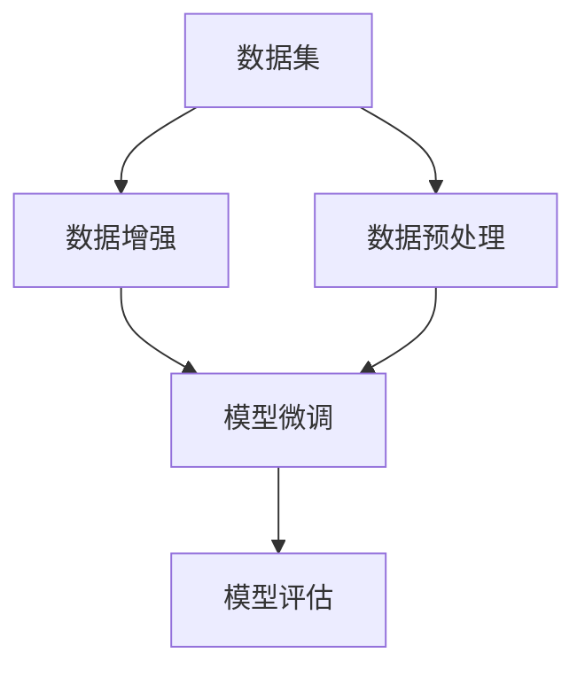

                 

# 从零开始大模型开发与微调：数据集的获取与处理

> 关键词：大模型开发, 微调, 数据集获取, 数据预处理, 数据增强, 模型评估

## 1. 背景介绍

### 1.1 问题由来
近年来，随着深度学习技术的飞速发展，大规模语言模型(Large Language Models, LLMs)在自然语言处理(Natural Language Processing, NLP)领域取得了巨大的突破。这些大语言模型通过在海量无标签文本数据上进行预训练，学习到了丰富的语言知识和常识，具备强大的语言理解和生成能力。

然而，预训练模型的应用范围和性能往往受限于其在特定领域数据的获取和处理。对于特定领域的微调任务，如果没有足够量的高质量数据，预训练模型的泛化能力难以发挥，进而影响微调后的性能表现。因此，获取并处理高质量的数据集，是大模型微调成功与否的关键环节。

### 1.2 问题核心关键点
1. **数据获取**：获取符合业务场景的数据集，并对数据进行预处理和增强。
2. **数据标注**：数据标注的准确性和完备性直接影响模型的微调效果。
3. **数据分布**：数据集分布应与实际应用场景一致，以避免模型泛化能力不足。
4. **数据量**：数据集大小应足够支撑模型训练，同时避免过拟合。
5. **数据格式**：数据的格式应符合模型的输入要求，如文本、图像等。

## 2. 核心概念与联系

### 2.1 核心概念概述

为了更好地理解数据集在大模型微调中的作用，本节将介绍几个关键概念：

- **数据集(Dataset)**：在机器学习中，数据集是一系列样本的集合，每个样本包括输入和标签。在NLP任务中，数据集通常包含文本和其对应的标签。
- **数据预处理(Data Preprocessing)**：包括数据清洗、分词、归一化、标准化等操作，将原始数据转化为模型可以接受的形式。
- **数据增强(Data Augmentation)**：通过变换或组合数据的方式，生成更多的训练样本，以提升模型的泛化能力。
- **模型评估(Model Evaluation)**：通过测试集对微调后的模型进行评估，以衡量其在未见过的数据上的表现。
- **迁移学习(Transfer Learning)**：通过在大规模通用数据上预训练模型，然后在特定领域数据上进行微调，以提高模型在特定任务上的性能。

这些核心概念之间的逻辑关系可以通过以下Mermaid流程图来展示：



这个流程图展示了数据集在大模型微调中的作用和流程：

1. 从原始数据中提取数据集。
2. 对数据集进行预处理，转化为模型接受的格式。
3. 通过数据增强生成更多训练样本，提升模型的泛化能力。
4. 利用预处理后的数据集对模型进行微调，以适应特定任务。
5. 使用测试集评估微调后的模型，保证其在实际应用中的表现。

## 3. 核心算法原理 & 具体操作步骤
### 3.1 算法原理概述

大模型微调中，数据集的作用是提供模型学习的基础样本。微调过程的目标是利用这些样本，通过监督学习的方式，调整预训练模型的参数，使其能够更好地适应特定任务。因此，数据集的质量和处理方式直接影响了微调的效果。

### 3.2 算法步骤详解

大模型微调通常包括以下几个关键步骤：

**Step 1: 数据集准备**
- 收集符合业务场景的数据集，并对数据进行清洗和预处理。
- 确保数据集的质量和完备性，避免由于标注错误或数据缺失影响模型微调。
- 进行数据分布分析，评估数据集的多样性和覆盖度，确保模型泛化能力。
- 划分子集，分为训练集、验证集和测试集，以保证模型在不同数据上的表现。

**Step 2: 数据增强**
- 对训练集数据进行增强，生成更多的训练样本，以提升模型的泛化能力。
- 常见的增强方式包括回译、近义替换、词性标注等，使模型能够学习到更多样化的语言表达。
- 注意增强方式的选择和参数设置，避免过度增强导致模型过拟合。

**Step 3: 模型微调**
- 选择合适的预训练模型，并加载其预训练参数。
- 设计适合特定任务的微调目标和损失函数。
- 设置合适的微调超参数，如学习率、批大小、迭代轮数等。
- 进行梯度下降等优化算法，更新模型参数以适应特定任务。
- 定期在验证集上评估模型性能，避免过拟合。

**Step 4: 模型评估**
- 在测试集上评估微调后的模型性能，包括精度、召回率、F1分数等指标。
- 进行混淆矩阵、ROC曲线等可视化分析，理解模型的预测能力。
- 收集模型在实际应用中的表现数据，不断优化模型。

### 3.3 算法优缺点

**优点**：
- 数据集提供模型学习的基础样本，使模型能够适应特定任务。
- 数据增强提升模型泛化能力，避免过拟合。
- 模型微调可以快速调整预训练参数，提升模型在特定任务上的性能。
- 模型评估帮助评估模型在不同数据上的表现，确保模型质量。

**缺点**：
- 数据集获取和标注成本高，尤其是特定领域数据集。
- 数据集标注质量影响模型微调效果，标注错误可能导致模型偏误。
- 数据增强可能引入噪声，影响模型稳定性。
- 模型微调需要较长时间和计算资源，特别是大规模模型。

### 3.4 算法应用领域

大模型微调方法广泛应用于各种NLP任务中，包括文本分类、命名实体识别、关系抽取、问答系统、翻译、摘要等。数据集的获取和处理在大模型微调中的应用具有以下几个典型领域：

1. **文本分类**：收集具有不同类别标签的文本数据，并对数据进行预处理和增强，用于训练和评估分类模型。
2. **命名实体识别**：收集包含实体标签的文本数据，并对数据进行标注和增强，用于训练和评估实体识别模型。
3. **关系抽取**：收集包含实体关系标签的文本数据，并对数据进行标注和增强，用于训练和评估关系抽取模型。
4. **问答系统**：收集包含问题和答案对的数据，并对数据进行预处理和增强，用于训练和评估问答系统。
5. **机器翻译**：收集包含源语言和目标语言对应文本的数据，并对数据进行预处理和增强，用于训练和评估翻译模型。
6. **文本摘要**：收集包含原文和摘要的数据，并对数据进行预处理和增强，用于训练和评估摘要模型。

## 4. 数学模型和公式 & 详细讲解 & 举例说明

### 4.1 数学模型构建

假设预训练语言模型为 $M_{\theta}$，其输入为文本 $x$，输出为预测标签 $y$。微调的目标是最大化模型在训练集 $D$ 上的性能，即最小化损失函数 $\mathcal{L}(\theta)$。损失函数通常定义为交叉熵损失：

$$
\mathcal{L}(\theta) = -\frac{1}{N}\sum_{i=1}^N \sum_{c} y_{i,c}\log p(y_{i,c}|x_i; \theta)
$$

其中 $N$ 为训练样本数量，$y_{i,c}$ 为样本 $i$ 在类别 $c$ 上的真实标签，$p(y_{i,c}|x_i; \theta)$ 为模型在样本 $i$ 上的预测概率。

### 4.2 公式推导过程

以二分类任务为例，推导微调模型的损失函数和梯度计算公式：

设样本 $x_i$ 的输入为 $x_i$，标签为 $y_i \in \{0,1\}$。模型的输出为 $p(y_{i}|x_i;\theta) = \sigma(z_i^{\theta})$，其中 $\sigma$ 为 sigmoid 函数，$z_i^{\theta}$ 为模型在样本 $i$ 上的线性变换结果。

则交叉熵损失函数为：

$$
\mathcal{L}(\theta) = -\frac{1}{N}\sum_{i=1}^N [y_i\log p(y_{i}|x_i;\theta) + (1-y_i)\log(1-p(y_{i}|x_i;\theta))]
$$

模型在样本 $i$ 上的预测概率 $p(y_{i}|x_i;\theta)$ 为：

$$
p(y_{i}|x_i;\theta) = \sigma(z_i^{\theta}) = \frac{1}{1+\exp(-z_i^{\theta})}
$$

其中 $z_i^{\theta}$ 为线性变换结果：

$$
z_i^{\theta} = \sum_{j=1}^d w_j x_{i,j} + b
$$

其中 $d$ 为特征维度，$x_{i,j}$ 为样本 $i$ 在特征 $j$ 上的值，$w_j$ 和 $b$ 为模型参数。

模型的梯度为：

$$
\frac{\partial \mathcal{L}(\theta)}{\partial \theta} = -\frac{1}{N}\sum_{i=1}^N [(y_i - p(y_{i}|x_i;\theta))x_i + (1-y_i - (1-p(y_{i}|x_i;\theta)))x_i]
$$

在梯度计算过程中，可以使用自动微分技术高效计算。

### 4.3 案例分析与讲解

假设有一个二分类任务，数据集包含1000个训练样本和200个测试样本。每个样本是一个长度为50的句子，包含两个类别标签：正面和负面。

首先，对数据集进行预处理，包括分词、去停用词、词向量化等操作。然后，对训练集进行增强，如回译、同义词替换等，生成更多的训练样本。最后，利用微调算法对模型进行训练，并在测试集上评估模型性能。

**预处理**：
1. 分词：将句子分割成单词序列。
2. 去停用词：去除无意义的停用词，如“的”、“是”等。
3. 词向量化：使用预训练的词嵌入（如Word2Vec、GloVe等）将单词序列转化为向量形式。

**数据增强**：
1. 回译：将句子翻译成其他语言，再翻译回原始语言。
2. 同义词替换：替换句子中的某些单词为同义词。
3. 句子切分：将句子切分为多个子句，并重新组合。

**微调**：
1. 选择BERT作为预训练模型。
2. 设置学习率为1e-5，批大小为32。
3. 使用Adam优化算法，训练10个epoch。
4. 在验证集上评估模型性能，选择性能最佳的模型进行测试集评估。

## 5. 项目实践：代码实例和详细解释说明
### 5.1 开发环境搭建

在进行大模型微调实践前，我们需要准备好开发环境。以下是使用Python进行PyTorch开发的环境配置流程：

1. 安装Anaconda：从官网下载并安装Anaconda，用于创建独立的Python环境。

2. 创建并激活虚拟环境：
```bash
conda create -n pytorch-env python=3.8 
conda activate pytorch-env
```

3. 安装PyTorch：根据CUDA版本，从官网获取对应的安装命令。例如：
```bash
conda install pytorch torchvision torchaudio cudatoolkit=11.1 -c pytorch -c conda-forge
```

4. 安装Transformers库：
```bash
pip install transformers
```

5. 安装各类工具包：
```bash
pip install numpy pandas scikit-learn matplotlib tqdm jupyter notebook ipython
```

完成上述步骤后，即可在`pytorch-env`环境中开始微调实践。

### 5.2 源代码详细实现

下面我们以二分类任务为例，给出使用Transformers库对BERT模型进行微调的PyTorch代码实现。

首先，定义二分类任务的模型：

```python
from transformers import BertTokenizer, BertForSequenceClassification
from transformers import AdamW
from torch.utils.data import Dataset, DataLoader

class TextDataset(Dataset):
    def __init__(self, texts, labels, tokenizer):
        self.texts = texts
        self.labels = labels
        self.tokenizer = tokenizer
        
    def __len__(self):
        return len(self.texts)
    
    def __getitem__(self, item):
        text = self.texts[item]
        label = self.labels[item]
        
        encoding = self.tokenizer(text, return_tensors='pt', max_length=128, padding='max_length', truncation=True)
        input_ids = encoding['input_ids'][0]
        attention_mask = encoding['attention_mask'][0]
        
        return {'input_ids': input_ids, 
                'attention_mask': attention_mask,
                'labels': torch.tensor(label, dtype=torch.long)}
    
# 初始化数据集和分词器
tokenizer = BertTokenizer.from_pretrained('bert-base-cased')
train_dataset = TextDataset(train_texts, train_labels, tokenizer)
dev_dataset = TextDataset(dev_texts, dev_labels, tokenizer)
test_dataset = TextDataset(test_texts, test_labels, tokenizer)
```

然后，定义模型和优化器：

```python
from transformers import BertForSequenceClassification

model = BertForSequenceClassification.from_pretrained('bert-base-cased', num_labels=2)

optimizer = AdamW(model.parameters(), lr=2e-5)
```

接着，定义训练和评估函数：

```python
from tqdm import tqdm

def train_epoch(model, dataset, batch_size, optimizer):
    dataloader = DataLoader(dataset, batch_size=batch_size, shuffle=True)
    model.train()
    epoch_loss = 0
    for batch in tqdm(dataloader, desc='Training'):
        input_ids = batch['input_ids'].to(device)
        attention_mask = batch['attention_mask'].to(device)
        labels = batch['labels'].to(device)
        model.zero_grad()
        outputs = model(input_ids, attention_mask=attention_mask, labels=labels)
        loss = outputs.loss
        epoch_loss += loss.item()
        loss.backward()
        optimizer.step()
    return epoch_loss / len(dataloader)

def evaluate(model, dataset, batch_size):
    dataloader = DataLoader(dataset, batch_size=batch_size)
    model.eval()
    preds, labels = [], []
    with torch.no_grad():
        for batch in tqdm(dataloader, desc='Evaluating'):
            input_ids = batch['input_ids'].to(device)
            attention_mask = batch['attention_mask'].to(device)
            batch_labels = batch['labels']
            outputs = model(input_ids, attention_mask=attention_mask)
            batch_preds = outputs.logits.argmax(dim=2).to('cpu').tolist()
            batch_labels = batch_labels.to('cpu').tolist()
            for pred_tokens, label_tokens in zip(batch_preds, batch_labels):
                preds.append(pred_tokens)
                labels.append(label_tokens)
                
    print(classification_report(labels, preds))
```

最后，启动训练流程并在测试集上评估：

```python
epochs = 5
batch_size = 16

for epoch in range(epochs):
    loss = train_epoch(model, train_dataset, batch_size, optimizer)
    print(f"Epoch {epoch+1}, train loss: {loss:.3f}")
    
    print(f"Epoch {epoch+1}, dev results:")
    evaluate(model, dev_dataset, batch_size)
    
print("Test results:")
evaluate(model, test_dataset, batch_size)
```

以上就是使用PyTorch对BERT进行二分类任务微调的完整代码实现。可以看到，得益于Transformers库的强大封装，我们可以用相对简洁的代码完成BERT模型的加载和微调。

### 5.3 代码解读与分析

让我们再详细解读一下关键代码的实现细节：

**TextDataset类**：
- `__init__`方法：初始化文本、标签、分词器等关键组件。
- `__len__`方法：返回数据集的样本数量。
- `__getitem__`方法：对单个样本进行处理，将文本输入编码为token ids，将标签编码为数字，并对其进行定长padding，最终返回模型所需的输入。

**模型和优化器**：
- `BertForSequenceClassification`：BERT模型的二分类变种，可以直接处理序列数据。
- `AdamW`：Adam优化算法，支持权重衰减和学习率调整。

**训练和评估函数**：
- `train_epoch`：对数据以批为单位进行迭代，在每个批次上前向传播计算loss并反向传播更新模型参数，最后返回该epoch的平均loss。
- `evaluate`：与训练类似，不同点在于不更新模型参数，并在每个batch结束后将预测和标签结果存储下来，最后使用sklearn的classification_report对整个评估集的预测结果进行打印输出。

**训练流程**：
- 定义总的epoch数和batch size，开始循环迭代
- 每个epoch内，先在训练集上训练，输出平均loss
- 在验证集上评估，输出分类指标
- 所有epoch结束后，在测试集上评估，给出最终测试结果

可以看到，PyTorch配合Transformers库使得BERT微调的代码实现变得简洁高效。开发者可以将更多精力放在数据处理、模型改进等高层逻辑上，而不必过多关注底层的实现细节。

当然，工业级的系统实现还需考虑更多因素，如模型的保存和部署、超参数的自动搜索、更灵活的任务适配层等。但核心的微调范式基本与此类似。

## 6. 实际应用场景
### 6.1 智能客服系统

基于大语言模型微调的对话技术，可以广泛应用于智能客服系统的构建。传统客服往往需要配备大量人力，高峰期响应缓慢，且一致性和专业性难以保证。而使用微调后的对话模型，可以7x24小时不间断服务，快速响应客户咨询，用自然流畅的语言解答各类常见问题。

在技术实现上，可以收集企业内部的历史客服对话记录，将问题和最佳答复构建成监督数据，在此基础上对预训练对话模型进行微调。微调后的对话模型能够自动理解用户意图，匹配最合适的答案模板进行回复。对于客户提出的新问题，还可以接入检索系统实时搜索相关内容，动态组织生成回答。如此构建的智能客服系统，能大幅提升客户咨询体验和问题解决效率。

### 6.2 金融舆情监测

金融机构需要实时监测市场舆论动向，以便及时应对负面信息传播，规避金融风险。传统的人工监测方式成本高、效率低，难以应对网络时代海量信息爆发的挑战。基于大语言模型微调的文本分类和情感分析技术，为金融舆情监测提供了新的解决方案。

具体而言，可以收集金融领域相关的新闻、报道、评论等文本数据，并对其进行主题标注和情感标注。在此基础上对预训练语言模型进行微调，使其能够自动判断文本属于何种主题，情感倾向是正面、中性还是负面。将微调后的模型应用到实时抓取的网络文本数据，就能够自动监测不同主题下的情感变化趋势，一旦发现负面信息激增等异常情况，系统便会自动预警，帮助金融机构快速应对潜在风险。

### 6.3 个性化推荐系统

当前的推荐系统往往只依赖用户的历史行为数据进行物品推荐，无法深入理解用户的真实兴趣偏好。基于大语言模型微调技术，个性化推荐系统可以更好地挖掘用户行为背后的语义信息，从而提供更精准、多样的推荐内容。

在实践中，可以收集用户浏览、点击、评论、分享等行为数据，提取和用户交互的物品标题、描述、标签等文本内容。将文本内容作为模型输入，用户的后续行为（如是否点击、购买等）作为监督信号，在此基础上微调预训练语言模型。微调后的模型能够从文本内容中准确把握用户的兴趣点。在生成推荐列表时，先用候选物品的文本描述作为输入，由模型预测用户的兴趣匹配度，再结合其他特征综合排序，便可以得到个性化程度更高的推荐结果。

### 6.4 未来应用展望

随着大语言模型微调技术的发展，其在更多领域的应用前景将更加广阔。

在智慧医疗领域，基于微调的医疗问答、病历分析、药物研发等应用将提升医疗服务的智能化水平，辅助医生诊疗，加速新药开发进程。

在智能教育领域，微调技术可应用于作业批改、学情分析、知识推荐等方面，因材施教，促进教育公平，提高教学质量。

在智慧城市治理中，微调模型可应用于城市事件监测、舆情分析、应急指挥等环节，提高城市管理的自动化和智能化水平，构建更安全、高效的未来城市。

此外，在企业生产、社会治理、文娱传媒等众多领域，基于大模型微调的人工智能应用也将不断涌现，为经济社会发展注入新的动力。相信随着技术的日益成熟，微调方法将成为人工智能落地应用的重要范式，推动人工智能技术在垂直行业的规模化落地。总之，微调需要开发者根据具体任务，不断迭代和优化模型、数据和算法，方能得到理想的效果。

## 7. 工具和资源推荐
### 7.1 学习资源推荐

为了帮助开发者系统掌握大语言模型微调的理论基础和实践技巧，这里推荐一些优质的学习资源：

1. 《Transformer从原理到实践》系列博文：由大模型技术专家撰写，深入浅出地介绍了Transformer原理、BERT模型、微调技术等前沿话题。

2. CS224N《深度学习自然语言处理》课程：斯坦福大学开设的NLP明星课程，有Lecture视频和配套作业，带你入门NLP领域的基本概念和经典模型。

3. 《Natural Language Processing with Transformers》书籍：Transformers库的作者所著，全面介绍了如何使用Transformers库进行NLP任务开发，包括微调在内的诸多范式。

4. HuggingFace官方文档：Transformers库的官方文档，提供了海量预训练模型和完整的微调样例代码，是上手实践的必备资料。

5. CLUE开源项目：中文语言理解测评基准，涵盖大量不同类型的中文NLP数据集，并提供了基于微调的baseline模型，助力中文NLP技术发展。

通过对这些资源的学习实践，相信你一定能够快速掌握大语言模型微调的精髓，并用于解决实际的NLP问题。
###  7.2 开发工具推荐

高效的开发离不开优秀的工具支持。以下是几款用于大语言模型微调开发的常用工具：

1. PyTorch：基于Python的开源深度学习框架，灵活动态的计算图，适合快速迭代研究。大部分预训练语言模型都有PyTorch版本的实现。

2. TensorFlow：由Google主导开发的开源深度学习框架，生产部署方便，适合大规模工程应用。同样有丰富的预训练语言模型资源。

3. Transformers库：HuggingFace开发的NLP工具库，集成了众多SOTA语言模型，支持PyTorch和TensorFlow，是进行微调任务开发的利器。

4. Weights & Biases：模型训练的实验跟踪工具，可以记录和可视化模型训练过程中的各项指标，方便对比和调优。与主流深度学习框架无缝集成。

5. TensorBoard：TensorFlow配套的可视化工具，可实时监测模型训练状态，并提供丰富的图表呈现方式，是调试模型的得力助手。

6. Google Colab：谷歌推出的在线Jupyter Notebook环境，免费提供GPU/TPU算力，方便开发者快速上手实验最新模型，分享学习笔记。

合理利用这些工具，可以显著提升大语言模型微调任务的开发效率，加快创新迭代的步伐。

### 7.3 相关论文推荐

大语言模型和微调技术的发展源于学界的持续研究。以下是几篇奠基性的相关论文，推荐阅读：

1. Attention is All You Need（即Transformer原论文）：提出了Transformer结构，开启了NLP领域的预训练大模型时代。

2. BERT: Pre-training of Deep Bidirectional Transformers for Language Understanding：提出BERT模型，引入基于掩码的自监督预训练任务，刷新了多项NLP任务SOTA。

3. Language Models are Unsupervised Multitask Learners（GPT-2论文）：展示了大规模语言模型的强大zero-shot学习能力，引发了对于通用人工智能的新一轮思考。

4. Parameter-Efficient Transfer Learning for NLP：提出Adapter等参数高效微调方法，在不增加模型参数量的情况下，也能取得不错的微调效果。

5. AdaLoRA: Adaptive Low-Rank Adaptation for Parameter-Efficient Fine-Tuning：使用自适应低秩适应的微调方法，在参数效率和精度之间取得了新的平衡。

这些论文代表了大语言模型微调技术的发展脉络。通过学习这些前沿成果，可以帮助研究者把握学科前进方向，激发更多的创新灵感。

## 8. 总结：未来发展趋势与挑战

### 8.1 总结

本文对大语言模型微调中数据集的获取与处理进行了全面系统的介绍。首先阐述了数据集在大模型微调中的作用，明确了数据预处理、数据增强和模型微调之间的关系。其次，从原理到实践，详细讲解了数据集构建和处理的具体步骤，给出了微调任务开发的完整代码实例。同时，本文还广泛探讨了数据集在大模型微调中的应用领域，展示了数据集在大模型微调中的广泛应用。

通过本文的系统梳理，可以看到，数据集在大模型微调中的重要性不容忽视，是实现微调成功的关键环节。获取和处理高质量的数据集，进行有效的数据增强，设计合理的微调算法，是未来大模型微调研究的重点方向。

### 8.2 未来发展趋势

展望未来，数据集在大模型微调中的应用将呈现以下几个发展趋势：

1. **数据集多样化**：随着数据标注成本的降低，更多领域的数据集将被收集和标注，使得模型能够覆盖更广泛的业务场景。
2. **数据增强自动化**：数据增强技术将更加自动化和智能化，减少人工干预，提升数据生成效率。
3. **数据集分布性**：数据集分布将更加多样化，涵盖更多场景和领域，提升模型的泛化能力。
4. **数据集可解释性**：数据集的构建过程将更加透明和可解释，便于模型调优和评估。
5. **数据集安全保护**：数据集的保护将更加严格，确保数据的隐私和安全。
6. **数据集互操作性**：数据集的互操作性将得到提升，便于不同模型和算法之间的融合和复用。

这些趋势凸显了数据集在大模型微调中的重要性和未来发展方向。随着数据集的不断丰富和处理技术的进步，大模型微调的效果将更加显著，模型的泛化能力和性能将得到进一步提升。

### 8.3 面临的挑战

尽管数据集在大模型微调中发挥着关键作用，但在实际应用中，仍面临一些挑战：

1. **数据标注成本**：获取高质量标注数据成本高，特别是在特定领域，数据标注难度大。
2. **数据标注质量**：标注数据的质量直接影响模型的微调效果，标注错误可能导致模型偏误。
3. **数据分布偏差**：数据集分布与实际应用场景不一致，导致模型泛化能力不足。
4. **数据集存储与传输**：大规模数据集存储和传输占用大量资源，影响模型训练和部署效率。
5. **数据集隐私与安全**：数据集包含敏感信息，数据集的安全保护和隐私保护至关重要。

### 8.4 研究展望

面对数据集在大模型微调中面临的挑战，未来的研究需要在以下几个方面寻求新的突破：

1. **自动化数据标注**：引入自动标注技术，如GAN生成、主动学习等，降低人工标注成本，提升标注数据质量。
2. **数据集增强**：探索更多有效的数据增强技术，如图像增强、文本生成等，提升数据多样性和数量。
3. **数据集分布对齐**：构建更加多样化的数据集，使其分布与实际应用场景一致，提升模型泛化能力。
4. **数据集压缩与存储优化**：采用数据压缩、分布式存储等技术，提升大规模数据集的存储和传输效率。
5. **数据集隐私保护**：采用差分隐私、联邦学习等技术，保护数据集隐私，确保数据安全。

这些研究方向将有助于解决数据集在大模型微调中的挑战，提升数据集的质量和效率，进一步推动大模型微调技术的发展。相信通过学术界和产业界的共同努力，数据集在大模型微调中的应用将更加高效和广泛，为人工智能技术的普及和发展提供坚实的基础。

## 9. 附录：常见问题与解答

**Q1：如何获取高质量的数据集？**

A: 高质量的数据集通常需要专业的标注团队，耗费大量人力和时间。以下是一些获取高质量数据集的方法：
1. 开源数据集：收集现有的开源数据集，如IMDB电影评论数据集、AG News新闻数据集等。
2. 众包标注：使用众包平台，如Amazon Mechanical Turk、CrowdFlower等，进行标注数据的收集和标注。
3. 用户数据：收集用户行为数据，如电商交易记录、社交媒体互动数据等，进行标注。

**Q2：数据集预处理包括哪些步骤？**

A: 数据集预处理通常包括以下几个步骤：
1. 数据清洗：去除噪声、缺失值、重复值等，保证数据质量。
2. 数据分割：将数据集划分为训练集、验证集和测试集，便于模型训练和评估。
3. 分词：将文本分割成单词序列，便于模型处理。
4. 去停用词：去除无意义的停用词，如“的”、“是”等。
5. 词向量化：使用预训练的词嵌入（如Word2Vec、GloVe等）将单词序列转化为向量形式。
6. 数据增强：通过变换或组合数据的方式，生成更多的训练样本，以提升模型的泛化能力。

**Q3：如何进行数据集增强？**

A: 数据集增强可以通过以下几种方式：
1. 回译：将句子翻译成其他语言，再翻译回原始语言。
2. 同义词替换：替换句子中的某些单词为同义词。
3. 词性标注：对句子进行词性标注，增加数据多样性。
4. 句子切分：将句子切分为多个子句，并重新组合。
5. 数据扰动：对数据进行随机扰动，如添加噪声、反转顺序等。

**Q4：数据增强可能引入噪声，如何处理？**

A: 数据增强可能引入噪声，但可以通过以下几种方式进行处理：
1. 数据筛选：对增强后的数据进行筛选，去除噪声样本。
2. 模型训练：在模型训练过程中，通过梯度下降等优化算法，自动学习到噪声数据的噪声特征，从而减少噪声的影响。
3. 模型集成：通过集成多个增强后的模型，取平均输出，抑制噪声。

**Q5：如何评估数据集的质量？**

A: 数据集的质量可以通过以下几种方式进行评估：
1. 数据分布：评估数据集的分布情况，确保数据集的多样性和覆盖度。
2. 标注质量：评估标注数据的准确性和完备性，确保标注数据的真实性和可靠性。
3. 数据量：评估数据集的大小，确保数据集足够支撑模型训练。
4. 数据标注一致性：评估不同标注者之间的标注一致性，确保标注数据的一致性。

**Q6：数据集增强的方式有哪些？**

A: 数据集增强可以通过以下几种方式：
1. 回译：将句子翻译成其他语言，再翻译回原始语言。
2. 同义词替换：替换句子中的某些单词为同义词。
3. 词性标注：对句子进行词性标注，增加数据多样性。
4. 句子切分：将句子切分为多个子句，并重新组合。
5. 数据扰动：对数据进行随机扰动，如添加噪声、反转顺序等。

**Q7：数据集增强是否会引入噪声？**

A: 数据集增强可能引入噪声，但可以通过以下几种方式进行处理：
1. 数据筛选：对增强后的数据进行筛选，去除噪声样本。
2. 模型训练：在模型训练过程中，通过梯度下降等优化算法，自动学习到噪声数据的噪声特征，从而减少噪声的影响。
3. 模型集成：通过集成多个增强后的模型，取平均输出，抑制噪声。

这些常见问题及解答有助于开发者更好地理解数据集在大模型微调中的作用，从而在实际应用中取得更好的效果。

---

作者：禅与计算机程序设计艺术 / Zen and the Art of Computer Programming

