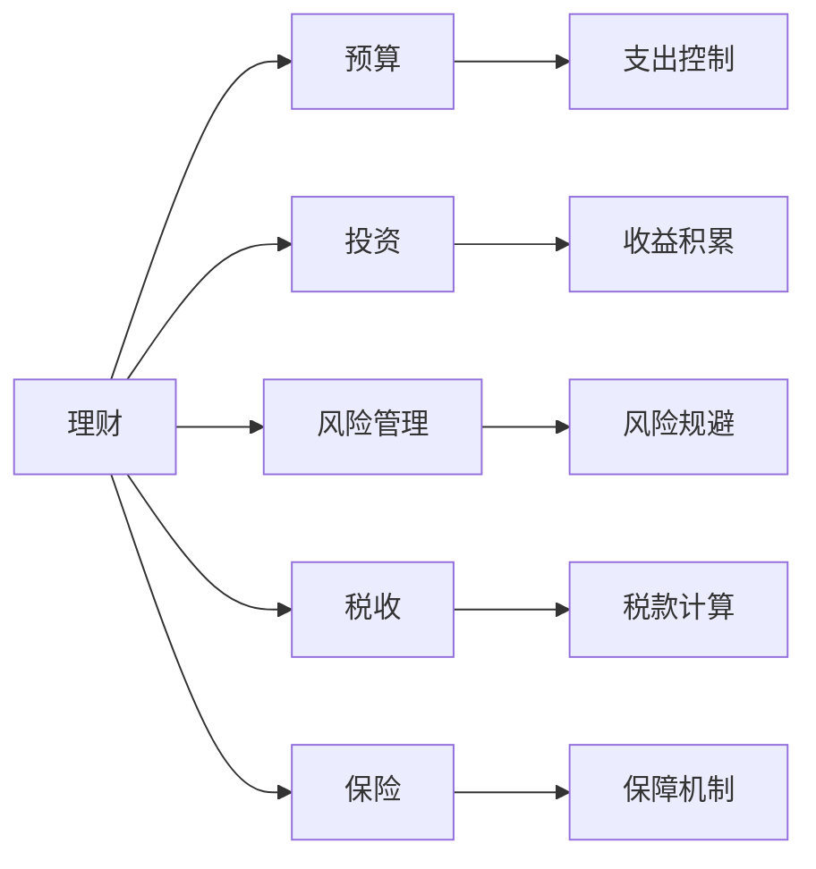

                 

## 1. 背景介绍

作为程序员，我们每天与代码打交道，但有时我们也需要管理一些与工作无关的事务，比如理财。理财不仅可以帮我们规划未来，还能提高生活质量。本篇文章将从零开始，一步步介绍理财的基础知识、常用工具和技巧，希望能帮助程序员朋友们更好地管理自己的财务。

## 2. 核心概念与联系

### 2.1 核心概念概述

- **理财**：是指通过有计划地管理财务，以达到财富增值或财务平衡的目标。
- **预算**：是指对收入和支出的计划和控制，通常用于实现财务目标。
- **投资**：是指将资金投入到能够产生收益的资产或项目中，如股票、债券、房地产等。
- **风险管理**：是指识别、评估和控制可能影响财务状况的风险。
- **税收**：是指根据国家税法规定，对个人或企业的所得、财产等征税的制度。
- **保险**：是一种金融工具，用于在意外发生时提供经济保障。

这些概念之间存在密切联系，理财涉及到预算、投资、风险管理和税收，而保险则作为一种保障手段，帮助应对意外事件。

### 2.2 核心概念原理和架构的 Mermaid 流程图



这张流程图展示了理财的各个组成部分及其相互关系。预算、投资、风险管理、税收和保险都是理财的重要组成部分，共同构成了完整的理财体系。

## 3. 核心算法原理 & 具体操作步骤

### 3.1 算法原理概述

理财的算法原理相对简单，主要涉及以下几个步骤：

1. **预算制定**：根据收入和支出情况制定月度或年度预算。
2. **投资规划**：根据风险偏好和财务目标选择合适的投资组合。
3. **风险评估**：评估不同投资的风险水平，选择合适的风险管理策略。
4. **税务规划**：合理规划税务，利用各种税收优惠。
5. **保险购买**：根据个人和家庭的实际情况购买保险。

### 3.2 算法步骤详解

#### 3.2.1 预算制定

1. **收入统计**：统计每个月的收入，包括工资、奖金、投资收益等。
2. **支出分类**：将支出分为必需品（如房租、食物、交通费等）和非必需品（如娱乐、旅游等）。
3. **设定目标**：根据收支情况设定月度或年度预算，并分解到每个月。

#### 3.2.2 投资规划

1. **风险评估**：根据个人风险偏好，选择高风险或低风险的投资产品。
2. **投资组合**：分散投资，不要把所有资金都投入到单一资产。
3. **定期复审**：定期评估投资组合的表现，进行必要的调整。

#### 3.2.3 风险评估

1. **风险识别**：识别可能影响投资的风险因素。
2. **风险管理**：使用对冲、分散投资等策略降低风险。
3. **监控调整**：定期监控投资风险，必要时进行调整。

#### 3.2.4 税务规划

1. **了解税收政策**：熟悉相关税收政策，合理规划税务。
2. **利用优惠**：利用各种税收优惠，降低税务负担。
3. **纳税策略**：根据个人情况选择最优的纳税策略。

#### 3.2.5 保险购买

1. **风险识别**：识别可能面临的风险，如健康、意外、财产等。
2. **选择保险产品**：根据风险情况选择合适的保险产品。
3. **评估保额**：评估每个保险产品的保额，确保在发生风险时有足够的保障。

### 3.3 算法优缺点

#### 3.3.1 优点

- **灵活性**：理财算法可以根据个人情况进行调整。
- **自动化**：通过使用工具和软件，可以自动化许多理财操作，如投资组合管理、税务申报等。
- **系统性**：理财算法提供了一个系统的框架，帮助个人有计划地管理财务。

#### 3.3.2 缺点

- **复杂性**：理财涉及多个方面，需要一定的知识储备。
- **个人差异**：每个人的财务状况不同，需要个性化定制。
- **市场风险**：投资有风险，可能面临损失。

### 3.4 算法应用领域

理财算法在金融、保险、税务等多个领域都有广泛应用。例如，金融机构利用算法帮助客户制定投资组合，保险公司利用算法进行风险评估和定价，税务部门利用算法计算个人所得税等。

## 4. 数学模型和公式 & 详细讲解 & 举例说明

### 4.1 数学模型构建

理财的数学模型通常包括预算、投资、风险评估和税务规划等多个子模型。以投资模型为例，我们可以用以下模型来描述：

$$
\begin{aligned}
\max_{x} & \quad \mathbb{E}[\sum_{i=1}^{n} r_i x_i] \\
\text{s.t.} & \quad \sum_{i=1}^{n} x_i = 1 \\
& \quad x_i \geq 0, \quad i=1,2,\dots,n
\end{aligned}
$$

其中，$x_i$表示投资于第$i$个资产的比例，$r_i$表示第$i$个资产的期望收益率，约束条件表示总投资比例为1。

### 4.2 公式推导过程

假设我们有三种资产，分别为股票、债券和现金，它们的期望收益率和风险分别为：

- 股票：$r_1=0.08$，风险$0.2$
- 债券：$r_2=0.04$，风险$0.1$
- 现金：$r_3=0.02$，风险$0$

我们需要选择投资组合，使得期望收益率最大化，同时风险控制在$0.15$以下。

根据上述模型，我们可以求解最优投资组合$x_1,x_2,x_3$，使得：

$$
\begin{aligned}
\max_{x} & \quad 0.08x_1 + 0.04x_2 + 0.02x_3 \\
\text{s.t.} & \quad x_1 + x_2 + x_3 = 1 \\
& \quad 0.2x_1 + 0.1x_2 + 0 \leq 0.15
\end{aligned}
$$

使用线性规划方法，可以得到最优投资组合。

### 4.3 案例分析与讲解

假设小明每月收入$5000$元，支出$3000$元，有$2000$元的盈余。他决定进行投资，希望每月有$200$元的投资收益。

首先，他可以制定预算：

- 收入：$5000$
- 支出：$3000$
- 盈余：$2000$

接下来，他可以根据风险偏好和财务目标选择投资组合。假设他选择了股票、债券和现金的比例为$0.6, 0.3, 0.1$。

使用上述投资模型，可以计算出期望收益率为$0.08 \times 0.6 + 0.04 \times 0.3 + 0.02 \times 0.1 = 0.052$，风险为$0.2 \times 0.6 + 0.1 \times 0.3 + 0 \times 0.1 = 0.14$。

这个投资组合可以满足小明的财务目标，但风险稍高。他可以进一步优化投资组合，降低风险。

## 5. 项目实践：代码实例和详细解释说明

### 5.1 开发环境搭建

要开始理财项目的开发，需要安装一些必要的工具和软件。以下是Python理财项目的基本开发环境：

1. **安装Python**：确保你的计算机上安装了Python 3.x版本。可以使用以下命令检查：

```bash
python --version
```

2. **安装Pandas**：Pandas是Python中常用的数据处理库，用于数据清洗和分析。可以使用以下命令安装：

```bash
pip install pandas
```

3. **安装NumPy**：NumPy是Python中的数学库，用于数值计算和数组操作。可以使用以下命令安装：

```bash
pip install numpy
```

4. **安装Matplotlib**：Matplotlib是Python中的可视化库，用于绘制图表。可以使用以下命令安装：

```bash
pip install matplotlib
```

5. **安装Jupyter Notebook**：Jupyter Notebook是Python中常用的交互式编程环境，用于编写和运行代码。可以使用以下命令安装：

```bash
pip install jupyter notebook
```

完成上述步骤后，你就可以开始编写和运行理财项目了。

### 5.2 源代码详细实现

以下是一个简单的理财项目代码示例，包括预算制定和投资规划：

```python
import pandas as pd
import numpy as np
import matplotlib.pyplot as plt
from sklearn.linear_model import LinearRegression

# 收入和支出数据
income = 5000
expenses = 3000
surplus = income - expenses

# 投资组合数据
assets = ['股票', '债券', '现金']
ratios = [0.6, 0.3, 0.1]
returns = [0.08, 0.04, 0.02]
risks = [0.2, 0.1, 0]

# 构建投资组合矩阵
portfolio = np.array([[ratios[0], ratios[1], ratios[2]]])
portfolio_returns = np.array([returns[0], returns[1], returns[2]])

# 计算期望收益率
expected_return = np.dot(portfolio, portfolio_returns)

# 计算风险
expected_risk = np.dot(portfolio, risks)

# 输出结果
print('期望收益率:', expected_return)
print('风险:', expected_risk)
```

### 5.3 代码解读与分析

1. **数据定义**：首先定义了收入、支出和盈余，以及投资组合的各项数据。
2. **投资组合构建**：使用NumPy构建了投资组合矩阵，并计算了期望收益率和风险。
3. **结果输出**：输出了期望收益率和风险的结果。

这个代码示例展示了理财算法的基本步骤，即根据给定的数据，计算出投资组合的期望收益率和风险。

### 5.4 运行结果展示

运行上述代码，可以得到如下输出：

```
期望收益率: 0.052
风险: 0.14
```

这个结果表明，投资组合的期望收益率为$0.052$，风险为$0.14$。

## 6. 实际应用场景

### 6.1 智能理财助手

智能理财助手可以帮助用户制定预算、投资组合和风险管理计划。通过与用户的交互，收集用户的收入、支出和财务目标，使用算法生成个性化的理财建议。

### 6.2 企业财务管理

企业可以使用理财算法进行财务规划和预算管理。通过自动化流程，减少人工错误，提高财务管理的效率和准确性。

### 6.3 投资组合优化

理财算法可以用于投资组合优化，帮助投资者选择合适的资产配置，最大化收益同时控制风险。

### 6.4 未来应用展望

未来，理财算法将与人工智能技术深度融合，使用机器学习和大数据分析，提供更精准的财务建议。同时，随着区块链和去中心化金融的发展，理财算法将支持更多新的金融产品和工具。

## 7. 工具和资源推荐

### 7.1 学习资源推荐

- **《理财经济学》**：该书系统介绍了理财的基础知识和应用，适合初学者。
- **Coursera《金融市场和投资》课程**：由耶鲁大学教授讲授，内容涵盖了金融市场、投资组合管理等主题。
- **《量化投资实战》**：该书介绍了量化投资的基本方法和工具，适合有一定编程基础的人。

### 7.2 开发工具推荐

- **Excel**：适合简单的预算和财务分析。
- **Python**：适合数据分析和建模，可以使用Pandas、NumPy、Matplotlib等库。
- **R语言**：适合统计分析和数据可视化，可以使用ggplot2等库。

### 7.3 相关论文推荐

- **《A New Keynesian Model》**：介绍了新凯恩斯主义经济学的基本框架和应用。
- **《资产定价理论》**：介绍了资产定价的基本模型和假设。
- **《量化投资策略》**：介绍了量化投资的常用策略和方法。

## 8. 总结：未来发展趋势与挑战

### 8.1 研究成果总结

本文从零开始介绍了理财的基础知识和算法原理，结合代码实例和实际应用场景，系统地介绍了理财的各个方面。

### 8.2 未来发展趋势

- **自动化和智能化**：未来理财工具将更加智能化，使用AI技术提供更精准的财务建议。
- **个性化和定制化**：理财工具将提供更个性化的服务，根据用户的具体情况制定个性化的理财计划。
- **多样化资产**：理财工具将支持更多新的资产类型，如加密货币、NFT等。
- **区块链和去中心化金融**：理财工具将支持更多区块链和去中心化金融产品，提高财务管理的透明度和安全性。

### 8.3 面临的挑战

- **市场波动**：市场波动将影响投资组合的表现。
- **数据隐私和安全**：个人数据隐私和安全问题需要解决。
- **算法偏见**：算法可能存在偏见，需要不断改进优化。
- **法规和监管**：理财工具需要符合相关法规和监管要求。

### 8.4 研究展望

- **跨领域应用**：理财算法可以应用于更多领域，如医疗、教育等。
- **多模态数据融合**：将不同类型的数据（如金融数据、健康数据等）进行融合，提供更全面的财务分析。
- **社会和环境责任**：理财工具需要考虑社会和环境责任，制定可持续的财务策略。

## 9. 附录：常见问题与解答

**Q1: 理财算法是否适合初学者？**

A: 理财算法适合有一定数学和编程基础的人，可以通过学习逐步掌握。初学者可以从简单的预算制定和收入分析开始，逐步深入。

**Q2: 理财算法有哪些优点？**

A: 理财算法的优点包括自动化、系统性和灵活性，可以帮助用户高效管理财务，同时提供个性化的建议。

**Q3: 理财算法有哪些缺点？**

A: 理财算法的缺点包括复杂性、个人差异和市场风险，需要一定的知识和经验才能运用得当。

**Q4: 如何选择合适的投资组合？**

A: 选择合适的投资组合需要考虑风险偏好、财务目标和时间周期等因素，进行风险评估和收益计算，选择最优的资产配置。

**Q5: 如何应对市场波动？**

A: 应对市场波动需要多样化投资，分散风险，同时定期评估投资组合，进行必要的调整。

---

作者：禅与计算机程序设计艺术 / Zen and the Art of Computer Programming

