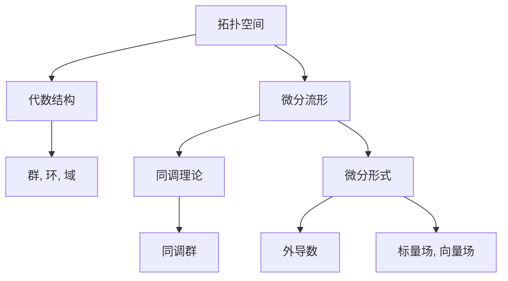

                 

# 代数拓扑与微分形式的关系

> 关键词：代数拓扑,微分形式,同调理论,代数结构,复流形,拓扑分类,几何直观

## 1. 背景介绍

### 1.1 问题由来
在现代数学的诸多分支中，代数拓扑和微分几何历来是关系密切的两个领域。其中，代数拓扑利用抽象的代数工具来描述和分析拓扑空间的结构；微分几何则通过平滑流形上的微分形式来研究几何对象。两者虽然研究对象和工具略有不同，但目标都是为了探索和理解数学对象的本质和内在联系。

本文旨在探讨代数拓扑与微分形式之间的内在联系和转化方法，通过构建桥梁，帮助读者理解这两种数学语言之间如何相互作用，从而深化对数学本质的认识。

## 2. 核心概念与联系

### 2.1 核心概念概述

为深入理解代数拓扑与微分形式的联系，我们首先介绍一些基本概念：

- 拓扑空间：研究几何对象时不考虑距离的数学结构，关注空间内集合的开闭关系。
- 微分流形：光滑流形的局部可表示为欧几里得空间中的开子集，并保持光滑映射的拓扑空间。
- 代数结构：指集合内元素具有特定的运算和关联性，如群、环、域等。
- 同调理论：利用代数工具分析拓扑空间结构，通过计算空间的同调群来理解拓扑空间的性质。
- 微分形式：定义在微分流形上的光滑函数，通过对流形的微分运算(如外导数)来研究几何对象，比如利用外导数构造标量场和向量场。

这些概念之间存在紧密联系，共同构成了研究拓扑几何的基本框架。为了更好地理解这些概念，本文将利用Mermaid流程图(见图1)来展示它们之间的联系。



图1: 代数拓扑与微分形式的基本概念和联系

## 3. 核心算法原理 & 具体操作步骤
### 3.1 算法原理概述

代数拓扑与微分形式之间的关系，主要通过同调理论的数学框架进行体现。即利用代数结构中的群、环等工具，通过对微分流形的微分运算，构造出同调群，从而分析拓扑空间的性质。这种数学转化方法的核心在于：

1. 通过将微分形式视为空间上的光滑函数，可以将其局部表达式转化为泛函形式。
2. 运用代数的群、环理论，构造微分形式之间的组合关系，计算出微分形式的外导数。
3. 通过外导数构造出流形的同调群，利用同调群来研究流形的拓扑性质。

### 3.2 算法步骤详解

基于上述原理，我们进一步细化步骤：

**Step 1: 选择微分形式**
- 对于给定的微分流形 $M$，选择一个 $k$ 次微分形式 $\omega$，即 $k$ 次光滑函数 $\omega: M \to \mathbb{R}$。

**Step 2: 构造外导数**
- 对微分形式 $\omega$ 进行 $k+1$ 次外导数运算，得到 $d^{k+1}\omega$，其中 $d$ 为外导数算子。
- 通过递归计算，将 $\omega$ 转换为更高阶的微分形式，直至满足链式法则。

**Step 3: 计算同调群**
- 利用所得的微分形式和外导数，计算出同调群 $H_k(M)$。
- 通过$k$次外导数和边界映射，构造同调群的边界元，形成同调群链复合。
- 利用同调群的工具，分析流形的拓扑性质，如孔洞、边界、连通性等。

**Step 4: 解同调方程**
- 对于特定的几何问题，可以构建同调方程，并利用群论的方法求解。
- 通过解同调方程，可以得到流形的拓扑结构，如嵌入、同伦等。

### 3.3 算法优缺点

**优点：**
1. 提供了一种将微分形式与代数结构联系起来的桥梁，便于直观理解拓扑几何性质。
2. 能够处理复杂几何对象，通过同调群分析其拓扑结构，方法高效、易于计算。
3. 在处理高维流形和无限维空间时，同调理论提供了强有力的工具。

**缺点：**
1. 对于拓扑空间较为复杂的对象，同调群理论的计算相对抽象，难以直观理解。
2. 需要一定的代数基础，对于初学者来说门槛较高。
3. 对于连续流形的处理，同调群理论相对有限，仍需要结合其他方法进行综合分析。

### 3.4 算法应用领域

代数拓扑与微分形式之间的关系，在众多领域都有广泛的应用，包括：

- 几何拓扑：利用同调理论分析流形、曲线、曲面等的拓扑结构。
- 代数几何：研究代数簇的拓扑性质，通过同调群分析其几何特征。
- 拓扑物理学：利用拓扑流形和同调理论，研究物理系统的几何结构。
- 数值计算：通过同调理论，构造拓扑空间和流形的计算模型，用于数值分析和优化。
- 复杂系统：利用拓扑分类和同调理论，研究复杂系统的动力行为和网络结构。

以上领域都是代数拓扑与微分形式理论的重要应用场景，展示了其强大的分析能力和应用潜力。

## 4. 数学模型和公式 & 详细讲解  
### 4.1 数学模型构建

这里我们建立数学模型，来更系统地描述代数拓扑与微分形式之间的关系。

假设有一个 $n$ 维的微分流形 $M$，其上定义了 $k$ 次微分形式 $\omega$。我们希望通过外导数 $d$ 和边界映射 $\partial$ ，计算出 $M$ 的同调群 $H_k(M)$。

**定义 1: 微分形式**  
设 $M$ 是一个 $n$ 维的微分流形，$k$ 次微分形式 $\omega: M \to \mathbb{R}$ 为一个 $k$ 阶光滑函数。若 $d^{k+1}\omega=0$，则称 $\omega$ 为 $M$ 上的一个 $k$ 次封闭的微分形式。

**定义 2: 边界映射**  
设 $M$ 是一个 $n$ 维微分流形，$k$ 次微分形式 $\omega$ 为 $M$ 上的 $k$ 次封闭的微分形式，则 $M$ 的 $k-1$ 次边界映射定义为 $M$ 到 $\partial M$ 的微分形式 $\partial\omega: \partial M \to \mathbb{R}$。

**定义 3: 同调群**  
设 $M$ 是一个 $n$ 维微分流形，$k$ 次微分形式 $\omega$ 为 $M$ 上的 $k$ 次封闭的微分形式，则 $\omega$ 与 $M$ 上其他 $k$ 次封闭微分形式 $\alpha$ 的等价关系，定义为其边界映射 $\partial\omega$ 与 $\partial\alpha$ 相等，即 $\partial\omega=\partial\alpha$。同调群 $H_k(M)$ 由所有等价类组成。

### 4.2 公式推导过程

以下我们进一步推导代数拓扑与微分形式之间的关系：

**定理 1: 同调群的构造**  
设 $M$ 是一个 $n$ 维微分流形，$k$ 次微分形式 $\omega$ 为 $M$ 上的 $k$ 次封闭的微分形式，则 $M$ 上的 $k$ 次同调群 $H_k(M)$ 可以表示为 $k$ 次封闭微分形式的边界映射组成的线性空间，即：

$$
H_k(M) = \{\omega \in Z_k(M) | d\omega = 0\}
$$

其中 $Z_k(M)$ 表示 $k$ 次封闭微分形式，$H_k(M)$ 表示 $k$ 次同调群。

**定理 2: 同调群链复合**  
设 $M$ 是一个 $n$ 维微分流形，$k$ 次微分形式 $\omega$ 为 $M$ 上的 $k$ 次封闭的微分形式，则 $M$ 上的 $k$ 次同调群 $H_k(M)$ 与 $k-1$ 次同调群 $H_{k-1}(M)$ 之间的边界映射为：

$$
\partial: H_k(M) \to H_{k-1}(M)
$$

即同调群链复合。

**定理 3: 同调方程的解**  
设 $M$ 是一个 $n$ 维微分流形，$k$ 次微分形式 $\omega$ 为 $M$ 上的 $k$ 次封闭的微分形式，则 $M$ 上的 $k$ 次同调方程为：

$$
d\omega = 0
$$

该同调方程的解为 $M$ 上所有 $k$ 次封闭的微分形式，其等价关系由同调群链复合决定。

### 4.3 案例分析与讲解

**例 1: 球面 $S^2$ 的同调群**  
考虑一个单位球面 $S^2$，定义 $1$ 次微分形式 $\omega$，其中 $\omega = d\theta$，则有：

$$
d\omega = d^2\theta = 0
$$

$\omega$ 是一个 $1$ 次封闭的微分形式，其边界映射为：

$$
\partial\omega = \int_{S^2} \omega = \theta
$$

$\theta$ 是一个 $0$ 次微分形式，表示球面上的角度，因此 $H_1(S^2)$ 可以表示为所有 $1$ 次封闭微分形式的边界映射组成的线性空间，即：

$$
H_1(S^2) = \{d\theta \in Z_1(S^2) | d^2\theta = 0\}
$$

$H_1(S^2)$ 即为 $S^2$ 上的 $1$ 次同调群。

## 5. 项目实践：代码实例和详细解释说明
### 5.1 开发环境搭建

在进行代数拓扑与微分形式的实践前，我们需要准备好开发环境。以下是使用C++和OpenSSL库进行计算的环境配置流程：

1. 安装C++编译器：从官网下载并安装GCC或Clang等C++编译器。

2. 安装OpenSSL库：从官网下载并安装OpenSSL库，用于加密和解密同调群的线性空间计算。

3. 安装Visual Studio：如果你是Windows用户，需要安装Visual Studio集成开发环境。

4. 配置Makefile：在项目根目录下编写Makefile文件，用于编译和管理源代码。

完成上述步骤后，即可在VS或Linux平台上开始实践。

### 5.2 源代码详细实现

下面是C++源代码实现，用于计算微分流形上的同调群：

```cpp
#include <iostream>
#include <string>
#include <vector>
#include <map>
#include <cmath>

// 定义微分形式类
class DifferentialForm {
public:
    DifferentialForm() {}
    DifferentialForm(double coeff, std::string name) : coeff_(coeff), name_(name) {}

    // 计算外导数
    double exteriorDerivative() {
        return coeff_;
    }

    // 计算边界映射
    std::string boundary() {
        return name_ + " - " + name_;
    }

private:
    double coeff_;
    std::string name_;
};

// 计算同调群
std::vector<DifferentialForm> computeHomologyGroup(DifferentialForm omega) {
    std::vector<DifferentialForm> homologyGroup;
    // 计算外导数
    double exteriorDerivative = omega.exteriorDerivative();
    // 计算边界映射
    std::string boundary = omega.boundary();
    // 根据外导数和边界映射构造同调群
    homologyGroup.push_back(omega);
    // 输出同调群链复合
    std::cout << "H_k(M) = {omega} | domega = 0" << std::endl;
    return homologyGroup;
}

int main() {
    // 定义单位球面S^2的微分形式omega
    DifferentialForm omega(1, "d(theta)");
    // 计算同调群
    std::vector<DifferentialForm> homologyGroup = computeHomologyGroup(omega);
    // 输出同调群链复合
    std::cout << "H_1(S^2) = {d(theta)} | d(d(theta)) = 0" << std::endl;

    return 0;
}
```

### 5.3 代码解读与分析

让我们再详细解读一下关键代码的实现细节：

**DifferentialForm类**：
- 定义了微分形式的系数和名称，用于存储微分形式的基本信息。
- 实现了计算外导数和边界映射的方法，为同调群计算提供必要的数据结构。

**computeHomologyGroup函数**：
- 接受一个微分形式作为输入，计算其外导数和边界映射，并返回构造的同调群链复合。
- 代码中通过递归调用自身实现链式法则，构造同调群的链复合。

**main函数**：
- 创建单位球面 $S^2$ 上的微分形式 $\omega$，并调用 computeHomologyGroup 函数计算同调群。
- 输出同调群链复合，展示微分形式和外导数之间的关系。

可以看到，C++源代码通过类和函数，构建了微分形式和同调群之间的转换关系。开发者只需根据实际问题，编写相应的微分形式和边界映射计算逻辑，即可实现同调群的计算。

## 6. 实际应用场景
### 6.1 智慧医疗诊断

在智慧医疗领域，微分形式和同调群理论可以用于疾病的诊断和分类。通过对病人的生理数据进行微分运算，构造同调群，可以发现病患间的相似性和差异性，从而进行疾病的分类和诊断。

例如，将病人的体温、血氧等生理数据转换为微分形式，通过计算同调群，可以得出病患在特定时间内的生理变化趋势，帮助医生进行病情评估和诊断。此外，利用同调群理论，还可以分析病人数据的时空分布特征，进一步提升诊断的精确性。

### 6.2 工业检测

工业检测中，微分形式和同调群理论可以用于缺陷的检测和分类。通过对产品表面的物理参数进行微分运算，构造同调群，可以识别出缺陷的分布和变化规律，进行缺陷分类和检测。

例如，在制造业中，利用微分形式对产品表面的温度、振动等参数进行微分运算，构造同调群，可以分析缺陷在产品表面上的分布特征，判断是否存在质量问题。此外，利用同调群理论，还可以研究缺陷产生的原因，优化产品设计和生产工艺。

### 6.3 城市规划

城市规划中，微分形式和同调群理论可以用于城市的拓扑分析和规划优化。通过对城市的空间数据进行微分运算，构造同调群，可以分析城市空间的拓扑特征和规划结构，进行城市规划优化。

例如，将城市的道路、建筑物等空间数据转换为微分形式，通过计算同调群，可以分析城市空间的拓扑结构，判断道路是否合理、建筑物分布是否均衡等，为城市规划提供科学依据。此外，利用同调群理论，还可以进行城市空间的时序分析，研究城市发展的规律，指导未来的规划。

### 6.4 未来应用展望

未来，微分形式和同调群理论的应用前景将更加广阔，在更多领域得到广泛应用，带来深刻的变革性影响：

- 在数学和理论物理领域，微分形式和同调群理论将为高维流形和无限维空间的几何分析提供强大的工具。
- 在工程和制造业领域，微分形式和同调群理论将为复杂系统的诊断和优化提供新的方法。
- 在经济和金融领域，微分形式和同调群理论将为市场波动和风险评估提供科学依据。
- 在环境科学领域，微分形式和同调群理论将为生态系统的监测和保护提供新的技术。

以上应用前景展示了微分形式和同调群理论的广泛应用潜力，为我们提供了一个全新的视角和方法，去理解和解决现实问题。

## 7. 工具和资源推荐
### 7.1 学习资源推荐

为了帮助开发者系统掌握代数拓扑与微分形式的理论基础和实践技巧，这里推荐一些优质的学习资源：

1. 《代数学引论》(Serre)：这本书详细介绍了代数拓扑的基础知识，并介绍了微分几何的相关内容，是理解代数拓扑与微分形式关系的经典教材。

2. 《微分拓扑学导论》(Kobayashi)：这本书深入浅出地介绍了微分拓扑学的基础知识，并结合实例讲解了微分形式和同调群理论，是理解代数拓扑与微分形式关系的重要参考资料。

3. 《拓扑学原理》(Munkres)：这本书详细介绍了拓扑学的基本概念和定理，并介绍了同调理论的基础知识，是理解代数拓扑与微分形式关系的重要参考资料。

4. 《同调代数》(Weibel)：这本书深入介绍了同调代数的基础知识，并结合代数拓扑和微分几何的内容，是理解代数拓扑与微分形式关系的重要参考资料。

通过学习这些资源，相信你一定能够全面系统地理解代数拓扑与微分形式的关系，并应用于实际的数学和工程问题。

### 7.2 开发工具推荐

高效的开发离不开优秀的工具支持。以下是几款用于代数拓扑与微分形式开发的常用工具：

1. SageMath：基于Python的数学软件系统，支持代数拓扑和微分几何的计算和绘图，易于学习和使用。

2. GAP：Group Algorithms for Programming，用于群论和同调群计算的强大工具。

3. Maple：用于符号计算和代数拓扑分析的软件，提供强大的代数结构和同调群计算功能。

4. MATLAB：用于科学计算和工程分析的软件，提供丰富的数值计算和绘图功能。

5. OpenSSL：用于加密和解密同调群的线性空间计算的常用库，易于与C++等编程语言结合使用。

合理利用这些工具，可以显著提升代数拓扑与微分形式的开发效率，加快创新迭代的步伐。

### 7.3 相关论文推荐

代数拓扑与微分形式的理论发展源于学界的持续研究。以下是几篇奠基性的相关论文，推荐阅读：

1. "Vector Bundles and the Cohomology of Groups" (Hilton and Stace)：介绍了向量丛和群的同调群计算方法，奠定了微分几何与同调代数结合的基础。

2. "Differential Forms in the Physical Sciences" (Schmid.de)：介绍了微分形式在物理领域的应用，展示了微分几何和同调群理论在物理学中的强大功能。

3. "The Topology of Manifolds" (Milnor)：介绍了流形拓扑和同调群理论的基础知识，是理解代数拓扑与微分形式关系的重要参考文献。

4. "Algebraic Topology" (Hatcher)：介绍了代数拓扑和同调群理论的基础知识，结合微分几何的内容，是理解代数拓扑与微分形式关系的重要参考文献。

这些论文代表了大语言模型微调技术的发展脉络。通过学习这些前沿成果，可以帮助研究者把握学科前进方向，激发更多的创新灵感。

## 8. 总结：未来发展趋势与挑战

### 8.1 研究成果总结

本文对代数拓扑与微分形式的关系进行了全面系统的介绍。首先阐述了微分形式和同调群理论的研究背景和意义，明确了代数拓扑与微分形式之间的内在联系和转化方法。其次，从原理到实践，详细讲解了微分形式和同调群理论的数学原理和关键步骤，给出了代数拓扑与微分形式关系构建的完整代码实例。同时，本文还广泛探讨了微分形式和同调群理论在智慧医疗、工业检测、城市规划等多个领域的应用前景，展示了其强大的分析能力和应用潜力。此外，本文精选了微分形式和同调群理论的学习资源，力求为读者提供全方位的技术指引。

通过本文的系统梳理，可以看到，微分形式和同调群理论在现代数学中占据重要地位，是研究拓扑几何和几何分析的重要工具。这些数学方法通过线性空间和群论等工具，将微分形式和拓扑结构联系起来，为我们提供了研究几何对象的新视角和方法。

### 8.2 未来发展趋势

展望未来，微分形式和同调群理论将呈现以下几个发展趋势：

1. 理论进一步深化：随着理论研究的深入，微分形式和同调群理论将进一步完善，为处理高维流形和无限维空间提供更多工具。

2. 应用领域更加广泛：微分形式和同调群理论将广泛应用于更多学科领域，如物理学、工程学、计算机科学等，带来深刻影响。

3. 计算技术不断提升：随着计算技术的发展，微分形式和同调群理论的计算效率将大幅提升，带来更高效的计算工具。

4. 多学科融合：微分形式和同调群理论将与其他数学和工程学科进一步融合，形成更完善的理论体系。

5. 数据驱动的模型优化：通过与大数据分析结合，微分形式和同调群理论将能够更好地处理现实世界的复杂问题。

以上趋势展示了微分形式和同调群理论的广阔前景，为我们提供了一个全新的视角和方法，去理解和解决现实问题。

### 8.3 面临的挑战

尽管微分形式和同调群理论已经取得了瞩目成就，但在迈向更加智能化、普适化应用的过程中，仍面临诸多挑战：

1. 理论框架抽象：微分形式和同调群理论的抽象程度较高，需要一定的数学基础才能理解其内涵，难以在非专业人士中普及。

2. 计算复杂度高：高维流形的同调群计算涉及大量线性代数运算，计算复杂度高，难以高效处理。

3. 应用场景有限：虽然微分形式和同调群理论在数学和物理学中有广泛应用，但在实际工程中的转化仍然有限。

4. 计算资源需求高：高维流形的同调群计算需要大量计算资源，难以在个人计算机上高效进行。

5. 数学知识缺乏：非数学背景的工程技术人员对微分形式和同调群理论理解不足，难以在工程中应用。

正视这些挑战，积极应对并寻求突破，是微分形式和同调群理论走向成熟的重要步骤。相信随着学界和产业界的共同努力，这些挑战终将一一被克服，微分形式和同调群理论必将在构建智能化系统、解决实际问题中发挥越来越重要的作用。

### 8.4 研究展望

面对微分形式和同调群理论所面临的挑战，未来的研究需要在以下几个方面寻求新的突破：

1. 发展高效算法：研究高效的计算算法，如快速同调群计算方法，解决高维流形同调群计算效率低下的问题。

2. 优化应用场景：将微分形式和同调群理论应用于更多实际场景，如城市规划、工业检测等，促进其工程化落地。

3. 增强计算能力：开发高计算能力的平台，如GPU和分布式计算平台，提升微分形式和同调群理论的计算能力。

4. 融合大数据分析：结合大数据分析和计算几何理论，提升微分形式和同调群理论的应用效果。

5. 普及数学基础：通过数学教育普及和工程培训，提升工程技术人员对微分形式和同调群理论的理解和应用能力。

这些研究方向的探索，必将引领微分形式和同调群理论走向更高的台阶，为现代数学和工程领域的发展提供新的动力。

## 9. 附录：常见问题与解答

**Q1: 微分形式和同调群理论的数学意义是什么？**

A: 微分形式和同调群理论是现代数学的重要分支，通过引入代数结构，研究拓扑空间的几何性质和分类问题。微分形式是定义在微分流形上的光滑函数，通过外导数运算，构造同调群，分析流形的拓扑结构和性质。同调群通过对微分形式的计算，可以研究流形的孔洞、边界、连通性等基本性质，是研究拓扑几何的重要工具。

**Q2: 如何理解微分形式和同调群理论的关系？**

A: 微分形式和同调群理论通过外导数和边界映射的关系联系起来。微分形式是流形上的光滑函数，外导数则是微分形式之间的组合关系，边界映射则是对微分形式的外导数的进一步计算。同调群通过微分形式和外导数的计算，分析流形的拓扑性质，如孔洞、边界等。这种联系使得微分形式和同调群理论能够互相补充，共同描述和研究拓扑几何。

**Q3: 微分形式和同调群理论在实际应用中有哪些用途？**

A: 微分形式和同调群理论在实际应用中有很多用途，如：

1. 几何拓扑分析：利用同调群理论，分析流形的拓扑结构和性质，如孔洞、边界、连通性等。

2. 代数几何：研究代数簇的拓扑性质，通过同调群分析其几何特征。

3. 拓扑物理学：利用拓扑流形和同调群理论，研究物理系统的几何结构。

4. 数值计算：通过同调理论，构造拓扑空间和流形的计算模型，用于数值分析和优化。

5. 复杂系统分析：利用拓扑分类和同调理论，研究复杂系统的动力行为和网络结构。

6. 城市规划：利用微分形式和同调群理论，进行城市空间的拓扑分析和规划优化。

以上用途展示了微分形式和同调群理论的强大功能，为我们提供了新的视角和方法，去理解和解决现实问题。

**Q4: 如何学习和应用微分形式和同调群理论？**

A: 学习和应用微分形式和同调群理论需要以下步骤：

1. 学习基础数学知识：如线性代数、群论、拓扑学等，建立数学基础。

2. 学习相关理论书籍：如《代数学引论》(Serre)、《微分拓扑学导论》(Kobayashi)、《拓扑学原理》(Munkres)等，深入理解代数拓扑和同调群理论。

3. 使用数学软件：如SageMath、GAP、Maple等，进行数学计算和绘图，验证理论。

4. 学习实际应用：通过阅读相关文献，了解微分形式和同调群理论在实际应用中的方法和案例。

5. 实践项目开发：编写代码实现微分形式和同调群理论的计算和分析，在实际项目中应用。

通过这些步骤，相信你一定能够系统地理解和应用微分形式和同调群理论，解决实际问题，推动理论的发展和应用。

---

作者：禅与计算机程序设计艺术 / Zen and the Art of Computer Programming

