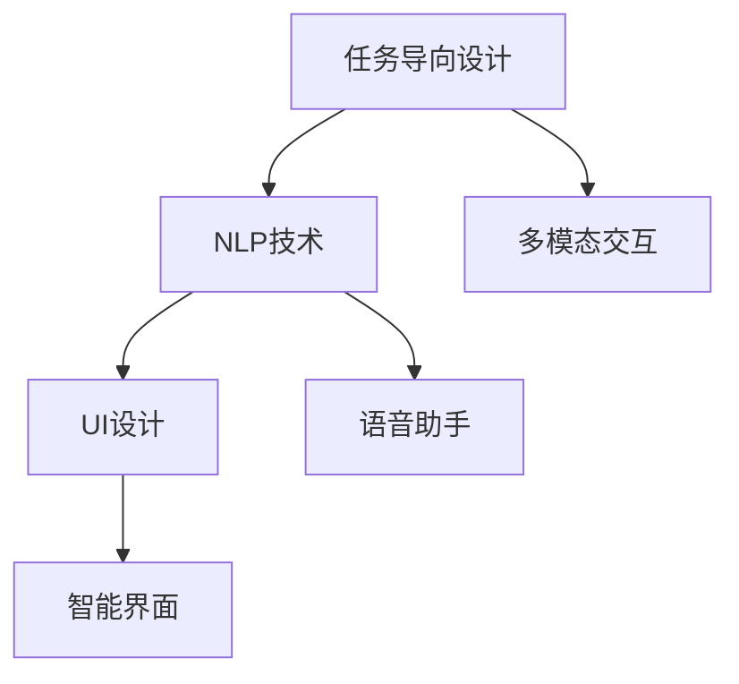

                 

# 任务导向设计思维在CUI中的应用

> 关键词：任务导向设计, 人机交互, 语音助手, 智能界面, 自然语言处理

## 1. 背景介绍

### 1.1 问题由来
随着人工智能技术的飞速发展，智能交互界面（Computer User Interfaces, CUI）已成为现代科技和互联网应用中的重要组成部分。从传统的文本交互界面到语音助手、智能音箱等，用户界面设计的方式和方式发生了巨大变化。然而，尽管CUI技术日益先进，用户满意度仍未达到预期。原因是多方面的，包括界面复杂性增加、交互方式不自然、用户体验不一致等。

### 1.2 问题核心关键点
如何设计出既满足用户需求又符合人机交互自然性原则的CUI系统，成为当前CUI设计的重要挑战。

- **任务导向设计（Task-oriented Design, TOD）**：是指以用户任务为中心，通过分析用户需求和行为，设计出直观、自然、高效的交互方式。
- **自然语言处理（Natural Language Processing, NLP）**：是实现CUI中自然语言理解和生成技术的关键，是任务导向设计的重要支撑。
- **用户界面设计（User Interface Design, UI）**：将任务导向设计的成果转化为具体的交互界面。
- **语音助手**：作为CUI系统中的重要组成部分，语音助手能实现更自然、直接的人机交互。
- **智能界面**：结合机器学习、自然语言处理等技术，实现更加智能、个性化的用户界面。

本文将探讨任务导向设计思维在CUI中的应用，介绍自然语言处理和用户界面设计方法，并通过实践案例展示如何利用任务导向设计思想，提升CUI系统的用户体验。

### 1.3 问题研究意义
随着智能设备的普及，CUI技术在家庭、企业、医疗等领域的广泛应用，任务导向设计已成为提高用户满意度和产品竞争力的关键。

- **降低复杂性**：通过任务导向设计，可以将复杂操作分解为简单、直观的交互步骤，降低用户学习成本。
- **提升自然性**：自然语言处理技术使得CUI系统能够更好地理解用户指令，自然语言输出更加流畅，提升用户体验。
- **个性化服务**：基于用户行为数据和偏好，实现个性化推荐和界面定制，使系统更符合用户需求。
- **支持多模态交互**：语音、文本、图像等多模态交互方式的应用，使CUI系统更灵活、更适应不同用户需求。

## 2. 核心概念与联系

### 2.1 核心概念概述

为了更好地理解任务导向设计思维在CUI中的应用，本节将介绍几个密切相关的核心概念：

- **任务导向设计（Task-oriented Design, TOD）**：以用户任务为中心，通过分析任务执行流程，设计出高效、直观的交互方式。任务导向设计强调任务序列和用户操作逻辑。
- **自然语言处理（Natural Language Processing, NLP）**：通过计算机对自然语言的理解、生成和处理，实现人与计算机之间自然、流畅的交互。NLP是任务导向设计中重要的一环。
- **用户界面设计（User Interface Design, UI）**：将任务导向设计的成果转化为具体的用户界面，通过视觉、听觉等多模态反馈提升用户体验。
- **语音助手**：通过语音识别和自然语言理解技术，实现用户语音指令的处理和响应。
- **智能界面**：结合机器学习、自然语言处理等技术，实现更加智能、个性化的用户界面。

这些概念之间的逻辑关系可以通过以下Mermaid流程图来展示：



这个流程图展示了任务导向设计思维在CUI中的应用流程：

1. 基于用户任务，设计任务序列和用户操作逻辑。
2. 引入自然语言处理技术，实现语音识别、自然语言理解和生成。
3. 将任务导向设计成果转化为用户界面，通过视觉、听觉等多模态反馈提升用户体验。
4. 引入语音助手和多模态交互，实现自然语言处理与用户界面的结合。

## 3. 核心算法原理 & 具体操作步骤

### 3.1 算法原理概述

基于任务导向设计思维的CUI设计，本质上是一个系统化的设计过程。其核心思想是：以用户任务为中心，通过分析任务执行流程，设计直观、自然、高效的交互方式。

具体流程如下：

1. **任务分析**：明确用户需要完成的任务，如信息检索、日程安排、购物等。
2. **任务建模**：将任务分解为若干步骤，每个步骤定义清晰的输入和输出。
3. **自然语言处理**：利用自然语言处理技术，将用户输入转换为计算机可理解的形式。
4. **任务执行**：执行任务模型，完成具体的操作。
5. **结果输出**：将任务执行结果以自然语言或多模态形式输出给用户。

### 3.2 算法步骤详解

基于任务导向设计思维的CUI设计一般包括以下几个关键步骤：

**Step 1: 任务建模**
- 对用户需要完成的任务进行详细分析，将任务分解为若干步骤。
- 每个步骤定义清晰的输入和输出，使用流程图或表格形式展示。
- 确定任务执行的关键节点和条件，确保任务逻辑清晰。

**Step 2: 设计任务界面**
- 根据任务模型的步骤，设计直观、自然的用户界面。
- 界面应简洁明了，突出关键信息，避免复杂操作。
- 引入多模态交互方式，如语音、图像等，提高用户操作便利性。

**Step 3: 实现自然语言处理**
- 选择适合的自然语言处理工具和技术。
- 对用户输入进行分词、命名实体识别、语义理解等处理。
- 将处理结果转化为计算机可理解的形式，如JSON结构。

**Step 4: 执行任务逻辑**
- 将任务逻辑实现为程序代码，保证高效、准确执行。
- 引入机器学习技术，根据用户历史行为数据，优化任务执行策略。
- 对任务执行结果进行多模态输出，如文本、语音、图像等。

**Step 5: 测试和优化**
- 对CUI系统进行全面的测试，包括功能测试、性能测试和用户体验测试。
- 根据测试结果，进行界面优化和功能改进。
- 持续收集用户反馈，不断迭代优化CUI系统。

### 3.3 算法优缺点

基于任务导向设计思维的CUI设计方法具有以下优点：
1. **提升用户体验**：通过任务导向设计，将复杂操作分解为简单、直观的交互步骤，降低用户学习成本。
2. **提升自然性**：自然语言处理技术使得CUI系统能够更好地理解用户指令，自然语言输出更加流畅，提升用户体验。
3. **支持多模态交互**：引入语音、图像等多模态交互方式，使CUI系统更灵活、更适应不同用户需求。
4. **提升系统效率**：通过任务建模和自然语言处理，优化任务执行流程，提升系统效率。

同时，该方法也存在一定的局限性：
1. **依赖数据质量**：任务导向设计依赖于用户任务的数据质量，数据的准确性和完整性直接影响系统性能。
2. **开发成本高**：任务导向设计需要深入理解用户需求和任务执行流程，开发成本较高。
3. **可扩展性差**：系统一旦开发完成，修改和扩展较为困难，难以适应快速变化的用户需求。

尽管存在这些局限性，但就目前而言，基于任务导向设计思维的CUI设计方法仍是最主流的设计范式。未来相关研究的重点在于如何进一步降低开发成本，提高系统的可扩展性和适应性，同时兼顾用户体验和系统效率。

### 3.4 算法应用领域

基于任务导向设计思维的CUI设计方法，在多个领域得到广泛应用：

- **智能家居**：通过任务导向设计，实现智能音箱、智能灯光、智能安防等功能，提升用户生活质量。
- **医疗健康**：基于自然语言处理，实现智能问诊、电子病历、健康管理等功能，提升医疗服务水平。
- **金融服务**：通过任务导向设计，实现智能客服、财务分析、投资管理等功能，提升金融服务效率。
- **交通出行**：基于自然语言处理和多模态交互，实现智能导航、智能停车、智能票务等功能，提升出行体验。
- **教育培训**：通过任务导向设计，实现智能作业批改、智能推荐、智能辅导等功能，提升教育质量。

这些应用场景展示了任务导向设计在CUI系统中的广泛应用，推动了相关领域的创新和发展。

## 4. 数学模型和公式 & 详细讲解 & 举例说明

### 4.1 数学模型构建

本节将使用数学语言对基于任务导向设计思维的CUI设计过程进行更加严格的刻画。

假设用户需要完成的任务为 $T$，任务模型为 $M$，自然语言处理模型为 $N$，任务执行逻辑为 $L$，用户界面为 $U$，任务执行结果为 $R$。则任务导向设计的过程可以表示为：

$$
T \rightarrow M \rightarrow N \rightarrow L \rightarrow R \rightarrow U
$$

其中：

- $T$：用户需要完成的任务。
- $M$：任务模型，描述任务执行步骤和逻辑。
- $N$：自然语言处理模型，将用户输入转换为计算机可理解的形式。
- $L$：任务执行逻辑，根据任务模型和自然语言处理结果执行具体操作。
- $R$：任务执行结果，经过多模态处理后输出。
- $U$：用户界面，展示任务执行结果并接收用户反馈。

### 4.2 公式推导过程

以下我们以智能家居场景为例，推导任务导向设计中自然语言处理和任务执行的具体实现。

假设用户需要控制家中的智能灯泡，其任务模型为 $M_{\text{bulb}}$，自然语言处理模型为 $N_{\text{bulb}}$，任务执行逻辑为 $L_{\text{bulb}}$，任务执行结果为 $R_{\text{bulb}}$，用户界面为 $U_{\text{bulb}}$。

**任务模型 $M_{\text{bulb}}$**：
- 用户输入灯泡的名称 $N_{\text{bulb}}$。
- 系统查询用户灯泡列表 $L_{\text{bulb}}$。
- 用户选择需要控制的灯泡 $R_{\text{bulb}}$。
- 系统输出灯泡控制界面 $U_{\text{bulb}}$。

**自然语言处理 $N_{\text{bulb}}$**：
- 用户输入 "打开客厅灯"。
- 系统通过分词、命名实体识别等技术，将输入转换为计算机可理解的形式，如 {"type": "command", "action": "开", "object": "客厅灯"}。

**任务执行逻辑 $L_{\text{bulb}}$**：
- 系统根据用户选择，执行灯泡控制操作。
- 将控制结果转换为多模态形式，如文本、语音、图像等。
- 输出到用户界面 $U_{\text{bulb}}$。

**任务执行结果 $R_{\text{bulb}}$**：
- 系统根据灯泡控制操作，执行打开或关闭操作。
- 将控制结果输出到用户界面 $U_{\text{bulb}}$。

**用户界面 $U_{\text{bulb}}$**：
- 展示当前灯泡状态。
- 提供控制按钮，用户可以进一步操作。

通过上述推导，可以看到，自然语言处理和任务执行逻辑的结合，能够实现复杂的CUI系统设计。接下来，我们将通过实践案例展示任务导向设计思维在CUI中的应用。

## 5. 项目实践：代码实例和详细解释说明

### 5.1 开发环境搭建

在进行CUI设计实践前，我们需要准备好开发环境。以下是使用Python进行Flask开发的环境配置流程：

1. 安装Anaconda：从官网下载并安装Anaconda，用于创建独立的Python环境。

2. 创建并激活虚拟环境：
```bash
conda create -n flask-env python=3.8 
conda activate flask-env
```

3. 安装Flask：
```bash
pip install flask
```

4. 安装SQLAlchemy：
```bash
pip install sqlalchemy
```

5. 安装Werkzeug：
```bash
pip install werkzeug
```

6. 安装Gunicorn：
```bash
pip install gunicorn
```

完成上述步骤后，即可在`flask-env`环境中开始CUI设计实践。

### 5.2 源代码详细实现

这里我们以智能音箱的语音控制为例，给出使用Flask和自然语言处理库spaCy进行CUI开发的Python代码实现。

首先，定义任务模型和自然语言处理模型：

```python
from flask import Flask, request
from spacy import displacy
from spacy.matcher import Matcher
from spacy.symbols import ENTITY, NOUN

app = Flask(__name__)

# 定义任务模型
class Task:
    def __init__(self, name, description):
        self.name = name
        self.description = description
        self.steps = []

    def add_step(self, step):
        self.steps.append(step)

    def execute(self):
        for step in self.steps:
            step.execute()
        return

# 定义自然语言处理模型
class NLP:
    def __init__(self, nlp):
        self.nlp = nlp
        self.matcher = Matcher(nlp.vocab)
        self.nlp.add_pipe('ner', last=True)

    def match(self, text):
        doc = self.nlp(text)
        matches = self.matcher(doc)
        for match_id, start, end in matches:
            span = doc[start:end]
            if span.text in ("开", "关"):
                return True, "开", "关"
        return False, None, None

# 定义任务步骤
class OpenLight:
    def __init__(self):
        self.light = "客厅灯"

    def execute(self):
        print(f"打开 {self.light} 灯泡。")
```

接着，定义任务模型和自然语言处理模型：

```python
from spacy import displacy
from spacy.matcher import Matcher
from spacy.symbols import ENTITY, NOUN

app = Flask(__name__)

# 定义任务模型
class Task:
    def __init__(self, name, description):
        self.name = name
        self.description = description
        self.steps = []

    def add_step(self, step):
        self.steps.append(step)

    def execute(self):
        for step in self.steps:
            step.execute()
        return

# 定义自然语言处理模型
class NLP:
    def __init__(self, nlp):
        self.nlp = nlp
        self.matcher = Matcher(nlp.vocab)
        self.nlp.add_pipe('ner', last=True)

    def match(self, text):
        doc = self.nlp(text)
        matches = self.matcher(doc)
        for match_id, start, end in matches:
            span = doc[start:end]
            if span.text in ("开", "关"):
                return True, "开", "关"
        return False, None, None

# 定义任务步骤
class OpenLight:
    def __init__(self):
        self.light = "客厅灯"

    def execute(self):
        print(f"打开 {self.light} 灯泡。")
```

最后，定义API接口和处理程序：

```python
@app.route('/control')
def control():
    text = request.args.get('text')
    nlp = spacy.load('en_core_web_sm')
    matcher = Matcher(nlp.vocab)
    nlp.add_pipe('ner', last=True)

    nlp = NLP(nlp)
    matched, action, label = nlp.match(text)
    if matched:
        task = Task("打开灯泡", "请输入需要打开的灯泡名称")
        step = OpenLight()
        task.add_step(step)
        task.execute()
        return f"已经为您打开 {step.light} 灯泡。"
    else:
        return "无法识别您的指令，请重新输入。"

if __name__ == '__main__':
    app.run(debug=True)
```

### 5.3 代码解读与分析

让我们再详细解读一下关键代码的实现细节：

**Task类**：
- 定义任务的基本信息，如任务名称和描述。
- 通过add_step方法，可以添加多个任务步骤。
- 通过execute方法，可以依次执行每个步骤，并返回最终结果。

**NLP类**：
- 通过自然语言处理模型spaCy，实现分词、命名实体识别等处理。
- 通过Matcher模块，匹配用户输入中的关键词，如“开”、“关”等，并返回对应的动作和标签。

**OpenLight类**：
- 实现具体的灯泡控制任务步骤，打开客厅灯泡。

**API接口和处理程序**：
- 定义一个控制灯泡的API接口，接收用户输入的文本指令。
- 使用spaCy进行自然语言处理，识别用户指令中的动作和标签。
- 根据用户指令，执行对应的任务步骤，并返回控制结果。

**任务导向设计流程**：
- 用户输入 "打开客厅灯"。
- 自然语言处理模型对输入进行分词和命名实体识别。
- 匹配动作关键词，识别为“开”。
- 任务模型根据动作，创建OpenLight任务步骤。
- 执行任务步骤，输出控制结果。

通过上述代码，我们可以看到任务导向设计思维在CUI中的应用，以及如何通过自然语言处理技术实现高效的CUI系统。

## 6. 实际应用场景

### 6.1 智能家居

基于任务导向设计思维的CUI设计方法，在智能家居领域得到广泛应用。通过任务导向设计，智能音箱可以实现语音控制家中的各种设备，如灯光、空调、电视等，极大地提升了用户生活的便捷性和舒适度。

**应用场景**：
- **智能灯泡控制**：用户可以通过语音指令控制家中的灯泡开关。
- **智能温控**：通过语音指令调节空调温度和风速。
- **智能播放**：根据语音指令播放音乐、视频等媒体内容。

**优势**：
- **提升便捷性**：通过语音控制，用户可以更方便地操作智能家居设备，无需手动操作。
- **提升舒适度**：智能家居系统可以根据用户习惯和偏好自动调节环境参数，提升居住舒适度。
- **提升安全性**：语音控制方式更加安全可靠，避免了手动操作带来的潜在风险。

### 6.2 医疗健康

在医疗健康领域，基于任务导向设计思维的CUI设计方法可以实现智能问诊、电子病历、健康管理等功能，提升医疗服务的效率和质量。

**应用场景**：
- **智能问诊**：通过语音助手和自然语言处理技术，智能识别患者的病情描述，推荐相应的诊疗方案。
- **电子病历**：患者可以通过语音输入病史，系统自动记录电子病历，方便医生查阅和诊断。
- **健康管理**：智能健康设备与CUI系统结合，实现健康数据的监测和分析，提供个性化的健康建议。

**优势**：
- **提升效率**：智能问诊和电子病历功能，可以大大减少医生的工作量，提升诊疗效率。
- **提升准确性**：通过自然语言处理技术，智能识别患者病情，推荐精准的诊疗方案。
- **提升用户体验**：通过语音控制和自然语言处理技术，提升患者的使用体验，减少病患的焦虑和恐惧感。

### 6.3 金融服务

金融服务行业对用户体验和效率的要求极高。基于任务导向设计思维的CUI设计方法可以实现智能客服、财务分析、投资管理等功能，提升金融服务的效率和质量。

**应用场景**：
- **智能客服**：通过语音助手和自然语言处理技术，智能识别客户问题，提供精准的解答。
- **财务分析**：客户可以通过语音输入财务数据，系统自动生成分析报告，提供个性化的投资建议。
- **投资管理**：智能投资助手根据用户偏好，自动管理投资组合，实现最优收益。

**优势**：
- **提升效率**：智能客服和财务分析功能，可以大大减少客服和分析师的工作量，提升服务效率。
- **提升准确性**：通过自然语言处理技术，智能识别客户问题，提供精准的解答和建议。
- **提升用户体验**：通过语音控制和自然语言处理技术，提升客户的使用体验，减少客户等待时间和沟通成本。

### 6.4 未来应用展望

随着人工智能技术的不断进步，基于任务导向设计思维的CUI设计方法将在更多领域得到应用，为传统行业数字化转型升级提供新的技术路径。

在智慧城市治理中，CUI系统可以实现智能导航、智能停车、智能票务等功能，提高城市管理的自动化和智能化水平，构建更安全、高效的未来城市。

在企业生产、社会治理、文娱传媒等众多领域，基于CUI技术的人工智能应用也将不断涌现，为经济社会发展注入新的动力。相信随着技术的日益成熟，CUI设计思维将成为人工智能技术落地应用的重要范式，推动人工智能技术在更广阔的领域深入应用。

## 7. 工具和资源推荐

### 7.1 学习资源推荐

为了帮助开发者系统掌握任务导向设计思维和CUI设计理论，这里推荐一些优质的学习资源：

1. 《人机交互设计》书籍：深入介绍人机交互设计的原理和实践方法，涵盖任务导向设计、多模态交互等内容。

2. 《自然语言处理基础》课程：斯坦福大学开设的自然语言处理课程，涵盖自然语言处理的基本概念和经典模型，帮助开发者掌握自然语言处理技术。

3. 《Flask Web开发》书籍：全面介绍Flask框架的使用方法和实践技巧，帮助开发者快速搭建高效的Web应用。

4. 《Python数据分析与可视化》书籍：介绍Python数据分析和可视化的基本方法和工具，帮助开发者处理和展示数据。

5. 《TensorFlow和PyTorch深度学习教程》视频：Google和Facebook开设的深度学习课程，涵盖深度学习的基本概念和经典模型，帮助开发者掌握深度学习技术。

通过对这些资源的学习实践，相信你一定能够快速掌握任务导向设计思维和CUI设计的方法，并将其应用于实际项目中。

### 7.2 开发工具推荐

高效的开发离不开优秀的工具支持。以下是几款用于CUI设计开发的常用工具：

1. Flask：Python的开源Web框架，灵活高效的开发环境，适合快速迭代研究。

2. spaCy：自然语言处理工具库，提供分词、命名实体识别、语义理解等功能，支持Python语言。

3. TensorFlow：由Google主导开发的开源深度学习框架，生产部署方便，适合大规模工程应用。

4. PyTorch：由Facebook主导开发的开源深度学习框架，灵活高效，支持多种编程语言。

5. Werkzeug：Python的Web工具包，提供Web开发中常用的功能，如表单处理、URL路由等。

6. SQLAlchemy：Python的ORM框架，提供数据库操作的功能，支持多种数据库。

合理利用这些工具，可以显著提升CUI设计开发的效率，加快创新迭代的步伐。

### 7.3 相关论文推荐

任务导向设计思维和CUI设计的研究源于学界的持续研究。以下是几篇奠基性的相关论文，推荐阅读：

1. Designing User Interfaces for Task-oriented Systems：研究了任务导向设计在CUI系统中的应用，介绍了任务序列和用户操作逻辑的设计方法。

2. Conversational User Interfaces: Design, Evaluation, and Future Directions：介绍了自然语言处理技术在CUI系统中的应用，探讨了未来CUI设计的发展方向。

3. AI-driven Personalized Healthcare：介绍了基于自然语言处理和机器学习的个性化医疗系统设计，展示了任务导向设计在医疗中的应用。

4. Smart Home Control with Conversational UI：研究了基于自然语言处理和语音助手的智能家居系统设计，展示了任务导向设计在智能家居中的应用。

5. Intelligent Financial Services with AI-driven Conversational UI：介绍了基于自然语言处理和语音助手的金融服务系统设计，展示了任务导向设计在金融中的应用。

这些论文代表了大语言模型微调技术的发展脉络。通过学习这些前沿成果，可以帮助研究者把握学科前进方向，激发更多的创新灵感。

## 8. 总结：未来发展趋势与挑战

### 8.1 研究成果总结

本文对基于任务导向设计思维的CUI设计方法进行了全面系统的介绍。首先阐述了任务导向设计在CUI设计中的应用，明确了任务导向设计在提升用户体验和系统效率方面的独特价值。其次，从原理到实践，详细讲解了CUI系统的设计过程和具体实现方法，并通过实践案例展示了任务导向设计思维在CUI中的应用。

通过本文的系统梳理，可以看到，任务导向设计思维在CUI系统中的应用已经成为提升用户体验和系统效率的关键。基于自然语言处理和任务导向设计的方法，可以设计出直观、自然、高效的CUI系统，极大地提升用户的使用体验。未来，随着技术的不断进步，任务导向设计将在更多领域得到应用，推动人工智能技术在更广泛的领域落地。

### 8.2 未来发展趋势

展望未来，基于任务导向设计思维的CUI设计方法将呈现以下几个发展趋势：

1. **任务序列优化**：通过更加精细的任务建模和优化，设计更加高效、自然的用户界面，提升用户操作便利性。

2. **自然语言处理技术提升**：通过引入更先进的自然语言处理技术，如多模态交互、上下文理解等，提升系统对用户指令的理解能力。

3. **多模态交互发展**：引入语音、图像、手势等多模态交互方式，使CUI系统更加灵活、智能，适应不同用户需求。

4. **个性化服务增强**：基于用户行为数据和偏好，实现个性化推荐和界面定制，使系统更符合用户需求。

5. **智能界面普及**：结合机器学习、自然语言处理等技术，实现更加智能、个性化的用户界面。

以上趋势凸显了任务导向设计思维在CUI系统中的应用前景，为提升用户体验和系统效率提供了新的发展方向。

### 8.3 面临的挑战

尽管基于任务导向设计思维的CUI设计方法已经取得了瞩目成就，但在迈向更加智能化、普适化应用的过程中，它仍面临着诸多挑战：

1. **依赖数据质量**：任务导向设计依赖于用户任务的数据质量，数据的准确性和完整性直接影响系统性能。

2. **开发成本高**：任务导向设计需要深入理解用户需求和任务执行流程，开发成本较高。

3. **可扩展性差**：系统一旦开发完成，修改和扩展较为困难，难以适应快速变化的用户需求。

4. **交互自然性不足**：尽管自然语言处理技术不断进步，但仍难以完全实现自然、流畅的人机交互，存在一定的语言障碍和理解误差。

5. **多模态交互复杂**：多模态交互方式的引入，增加了系统的复杂性和开发难度，需要更加强大的技术支撑。

6. **系统安全性和隐私保护**：CUI系统涉及大量用户数据，如何保障数据安全和隐私保护，是一大难题。

面对这些挑战，未来的研究需要在以下几个方面寻求新的突破：

- **数据质量提升**：通过改进数据采集和处理方法，提升数据质量和准确性，保障系统性能。

- **开发成本降低**：引入自动生成和测试工具，降低开发成本，提高开发效率。

- **系统可扩展性增强**：设计模块化、可配置的系统架构，提高系统的可扩展性和适应性。

- **交互自然性提升**：引入更加先进的自然语言处理技术，提升系统对用户指令的理解能力，实现更自然、流畅的人机交互。

- **多模态交互优化**：引入更加复杂和灵活的多模态交互方式，提高系统的智能性和适应性。

- **安全性和隐私保护**：引入数据加密、访问控制等技术，保障系统安全性和隐私保护。

这些研究方向的探索，必将引领基于任务导向设计思维的CUI设计方法迈向更高的台阶，为构建智能、高效、安全的CUI系统铺平道路。面向未来，任务导向设计思维将成为CUI设计的重要范式，推动CUI技术在更广泛的领域深入应用。

### 8.4 研究展望

基于任务导向设计思维的CUI设计方法，在人工智能技术的推动下，将迎来更加广阔的发展前景。未来，任务导向设计思维将结合更多前沿技术，如深度学习、增强学习、因果推理等，推动CUI系统的创新和发展。

1. **结合深度学习技术**：通过引入深度学习技术，提升自然语言处理能力和任务执行效率，实现更加智能、高效的CUI系统。

2. **结合增强学习技术**：通过引入增强学习技术，提升系统的自适应能力和决策能力，实现更加智能、灵活的CUI系统。

3. **结合因果推理技术**：通过引入因果推理技术，提升系统的因果解释能力和用户理解能力，实现更加透明、可解释的CUI系统。

4. **结合多学科知识**：通过结合心理学、社会学等学科知识，提升系统的用户体验和系统设计，实现更加人性化、高效的CUI系统。

5. **结合新兴技术**：通过结合新兴技术，如区块链、边缘计算等，提升系统的安全和稳定性，实现更加智能、安全的CUI系统。

这些研究方向的探索，将推动基于任务导向设计思维的CUI设计方法迈向新的高度，为构建更加智能、高效、安全的CUI系统提供新的动力和方向。

## 9. 附录：常见问题与解答

**Q1：任务导向设计如何与自然语言处理结合？**

A: 任务导向设计依赖于自然语言处理技术，通过自然语言处理技术对用户输入进行分词、命名实体识别、语义理解等处理，识别出用户意图和动作，并转换为任务模型可理解的形式，进而执行任务。

**Q2：任务导向设计如何提升用户体验？**

A: 任务导向设计通过将复杂操作分解为简单、直观的交互步骤，降低用户学习成本，提升用户体验。同时，通过自然语言处理技术，实现自然语言理解和输出，提升系统自然性和交互流畅度。

**Q3：任务导向设计在多模态交互中如何发挥作用？**

A: 任务导向设计结合多模态交互技术，通过语音、图像、手势等多种方式，提升系统灵活性和适应性，适应不同用户的需求。同时，通过多模态数据融合，提高系统决策能力和用户体验。

**Q4：任务导向设计如何应对快速变化的用户需求？**

A: 任务导向设计可以通过模块化、可配置的系统架构，提高系统的可扩展性和适应性，应对快速变化的用户需求。同时，通过持续收集用户反馈和数据，不断优化系统设计，提升用户体验。

**Q5：任务导向设计如何保障数据安全和隐私保护？**

A: 任务导向设计可以通过数据加密、访问控制等技术，保障数据安全和隐私保护。同时，通过用户权限管理和数据匿名化等手段，提升系统的安全性。

通过本文的系统梳理，可以看到，任务导向设计思维在CUI系统中的应用已经成为提升用户体验和系统效率的关键。基于自然语言处理和任务导向设计的方法，可以设计出直观、自然、高效的CUI系统，极大地提升用户的使用体验。未来，随着技术的不断进步，任务导向设计将在更多领域得到应用，推动人工智能技术在更广泛的领域深入应用。

---

作者：禅与计算机程序设计艺术 / Zen and the Art of Computer Programming

