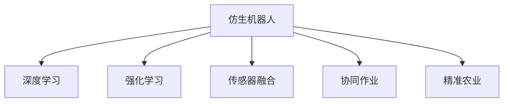

                 

# 仿生机器人在农业中的应用：精准种植和收获

## 1. 背景介绍

### 1.1 问题由来
近年来，随着农业机械化和自动化水平的不断提高，农业生产效率得到了显著提升。然而，传统农机设备依然存在诸多局限性：如精确度不高、适应性差、智能化水平低等问题。如何将最新的人工智能技术，如仿生机器人技术，应用到农业生产中，进一步提高农机的精准性和智能化水平，成为当下亟待解决的问题。

### 1.2 问题核心关键点
仿生机器人技术通过模拟生物的感知、决策和行为，实现了智能化的农业机械操作。其核心在于：
1. 精确的传感器系统：如视觉、激光雷达、红外传感器等，用于感知作物、土壤、环境条件等。
2. 先进的决策系统：基于深度学习、强化学习等算法，实时决策最佳的农机操作方案。
3. 智能化的执行机构：包括机械臂、传感器等，执行精密的种植和收获操作。
4. 动态适应能力：能够根据环境变化动态调整作业策略，提高作业效率和质量。
5. 协同作业：与无人驾驶车辆、无人机等设备协同工作，构建高效的农业自动化系统。

## 2. 核心概念与联系

### 2.1 核心概念概述

为更好地理解仿生机器人在农业中的应用，本节将介绍几个密切相关的核心概念：

- 仿生机器人(Biorobotics)：模拟生物的感知、决策和行为，实现智能化的机械操作。其应用领域包括医疗、军事、农业等。
- 深度学习(Deep Learning)：通过多层次神经网络模型，自动提取复杂数据特征，用于图像识别、语音识别、自然语言处理等。
- 强化学习(Reinforcement Learning)：通过智能体与环境的交互，学习最优决策策略，实现自动化的控制和优化。
- 传感器融合(Sensor Fusion)：将多种传感器信息进行融合，提升感知精度和实时性。
- 协同作业(Cooperative Operation)：多个仿生机器人或智能设备之间的协同合作，提高作业效率和智能化水平。
- 精准农业(Precision Agriculture)：通过先进的技术手段，实现对作物生长环境的精准监测和调控，提高农作物的产量和质量。

这些核心概念之间的逻辑关系可以通过以下Mermaid流程图来展示：



这个流程图展示了几大核心概念及其之间的关系：

1. 仿生机器人通过深度学习和强化学习等先进算法，模拟生物的感知和决策过程。
2. 传感器融合技术提高了仿生机器人的感知精度和实时性。
3. 协同作业使得多个机器人可以高效合作，提升作业效率。
4. 精准农业的目标是实现对作物环境的精确监测和调控，仿生机器人是实现这一目标的重要手段。

## 3. 核心算法原理 & 具体操作步骤
### 3.1 算法原理概述

仿生机器人应用于农业的精准种植和收获，本质上是一个多模态信息融合和智能决策的过程。其核心思想是：通过传感器系统获取实时环境数据，结合已有的作物知识库，利用深度学习、强化学习等算法，实时决策和执行最佳的农机操作。

形式化地，假设仿生机器人系统由传感器、决策系统和执行机构组成。其中传感器收集环境数据，决策系统根据数据和知识库生成操作策略，执行机构完成具体操作。具体流程如下：

1. 传感器系统：通过视觉、激光雷达、红外等传感器，实时获取作物、土壤、环境条件等数据。
2. 数据融合：利用传感器融合技术，将多种传感器数据进行信息融合，得到更精确的环境信息。
3. 决策系统：通过深度学习模型对融合后的数据进行分析，生成最佳操作策略。
4. 执行系统：根据决策系统的输出，控制机械臂、执行器等，完成具体的种植或收获操作。

### 3.2 算法步骤详解

基于仿生机器人的精准种植和收获，其核心算法步骤大致如下：

**Step 1: 数据采集和预处理**
- 通过视觉、激光雷达、红外等传感器，实时采集作物的图像、深度、环境温度等数据。
- 对采集到的数据进行预处理，如去噪、归一化、校正等，保证数据的质量和一致性。

**Step 2: 特征提取与分析**
- 利用深度学习模型（如CNN、RNN、Transformer等）对传感器数据进行特征提取。
- 将提取的特征输入到分类器或回归模型中，预测作物的状态、生长周期、病虫害等。

**Step 3: 智能决策与路径规划**
- 根据分类器或回归模型的输出，结合已有的作物知识库，生成最佳的操作策略。
- 通过强化学习算法（如Q-learning、SARSA等）进行路径规划，生成最优的操作路径。

**Step 4: 机械操作与实时监控**
- 根据决策系统生成的策略，控制机械臂、执行器等，执行种植或收获操作。
- 实时监控操作过程，检测操作结果，调整策略或进行异常处理。

**Step 5: 反馈与优化**
- 根据操作结果和监控数据，更新模型参数，优化决策算法和操作策略。
- 将反馈结果纳入知识库，更新作物模型，提升仿生机器人的智能化水平。

### 3.3 算法优缺点

仿生机器人应用于农业的精准种植和收获，具有以下优点：
1. 精度高：通过多种传感器和深度学习模型，可以实现对作物生长环境的精确感知和监测。
2. 智能化：利用强化学习算法，机器人能够根据环境动态调整操作策略，提高作业效率和质量。
3. 实时性：传感器和执行系统的高效协同，使得仿生机器人能够实时反馈操作结果，进行动态调整。
4. 适应性强：仿生机器人具备高度的柔韧性和适应性，能够适应各种不同的田间环境。

同时，该方法也存在一定的局限性：
1. 设备成本高：仿生机器人涉及多种传感器和执行设备，硬件成本较高。
2. 技术复杂：需要综合运用多种算法和技术，系统设计和维护较为复杂。
3. 环境依赖：传感器和执行系统的性能受到环境条件的限制，如光照、湿度等。
4. 数据质量要求高：传感器数据的质量直接影响仿生机器人的性能，数据采集和处理需投入大量资源。

尽管存在这些局限性，但就目前而言，仿生机器人在农业领域的应用已经取得了一定的进展，显示了其巨大的潜力。

### 3.4 算法应用领域

仿生机器人技术在农业中的应用已经涵盖了多个领域，包括：

- 精准播种：通过传感器和深度学习模型，实时监测土壤条件，控制播种深度和间距，提高种子的发芽率和成活率。
- 自动收获：利用机械臂和传感器，自动识别成熟的作物，进行精准收割，减少浪费和损耗。
- 智能喷灌：通过传感器和机器学习模型，自动检测土壤湿度，实时调整灌溉量，实现节水和高效灌溉。
- 田间巡检：配备视觉、激光雷达等传感器，自动巡检田间病虫害和杂草，及时采取处理措施。
- 自主导航：通过GPS、惯性导航等技术，实现仿生机器人在田间自主导航和避障。

此外，仿生机器人还广泛应用于农业机器人的协同作业中，如无人驾驶车辆、无人机等设备的辅助和支持，提升整体的农业自动化水平。

## 4. 数学模型和公式 & 详细讲解 & 举例说明

### 4.1 数学模型构建

本节将使用数学语言对仿生机器人在农业中的应用进行更加严格的刻画。

假设仿生机器人系统由传感器、决策系统和执行机构组成。其中传感器收集环境数据 $D$，决策系统根据数据和知识库 $K$ 生成操作策略 $A$，执行系统控制机械臂和执行器 $E$，完成具体的操作 $O$。仿生机器人系统的目标是最大化操作效果 $G$，即：

$$
\max G(A,E)
$$

决策系统 $A$ 根据传感器数据 $D$ 和知识库 $K$ 生成操作策略 $A$，形式化地表示为：

$$
A=f(D,K)
$$

其中 $f$ 为决策函数。

执行系统 $E$ 根据策略 $A$ 完成具体的操作 $O$，形式化地表示为：

$$
O=g(A,E)
$$

其中 $g$ 为执行函数。

操作效果 $G$ 由多个指标组成，如作物的产量、质量、生长周期等，形式化地表示为：

$$
G=h(O)
$$

其中 $h$ 为评价函数。

### 4.2 公式推导过程

以下我们以精准播种为例，推导决策系统的最小二乘回归模型及其梯度计算公式。

假设传感器采集到土壤的湿度 $d$ 和温度 $t$，决策系统需要生成播种深度 $a$。设 $f(d,t)=a$，其中 $a$ 为播种深度。假设 $a$ 与 $d$ 和 $t$ 存在线性关系：

$$
a=wd+bt
$$

其中 $w,b$ 为待优化参数。

根据最小二乘回归的思想，决策系统的目标函数为：

$$
J=\frac{1}{N}\sum_{i=1}^N (a_i - (wd+b_i t))^2
$$

其中 $a_i, d_i, t_i$ 为第 $i$ 个样本的播种深度、湿度和温度。

通过梯度下降等优化算法，最小化目标函数 $J$，更新参数 $w,b$，得到最优的播种深度 $a$。计算过程如下：

$$
\frac{\partial J}{\partial w} = \frac{2}{N}\sum_{i=1}^N (a_i - (wd+b_i t))d_i
$$

$$
\frac{\partial J}{\partial b} = \frac{2}{N}\sum_{i=1}^N (a_i - (wd+b_i t))t_i
$$

通过求解上述梯度方程，即可得到最优的播种深度 $a$。

### 4.3 案例分析与讲解

以无人驾驶车辆的精准播种为例，分析决策系统的构建和优化过程。

**数据采集和预处理**
- 配备高清摄像头、激光雷达、温度传感器等，实时采集作物的图像、深度、温度等数据。
- 对采集到的数据进行去噪、归一化、校正等处理，保证数据的质量和一致性。

**特征提取与分析**
- 利用深度学习模型（如CNN、RNN、Transformer等）对传感器数据进行特征提取。
- 将提取的特征输入到分类器或回归模型中，预测作物的生长状态和病虫害情况。

**智能决策与路径规划**
- 根据分类器或回归模型的输出，结合已有的作物知识库，生成最佳的播种深度和间距。
- 通过强化学习算法（如Q-learning、SARSA等）进行路径规划，生成最优的播种路径。

**机械操作与实时监控**
- 根据决策系统生成的播种深度和间距，控制机械臂和执行器，进行精准播种。
- 实时监控播种过程，检测播种结果，调整策略或进行异常处理。

**反馈与优化**
- 根据播种结果和监控数据，更新模型参数，优化决策算法和操作策略。
- 将反馈结果纳入知识库，更新作物模型，提升无人驾驶车辆的智能化水平。

通过以上案例分析，可以更加清晰地理解仿生机器人在农业中的应用流程和技术细节。

## 5. 项目实践：代码实例和详细解释说明
### 5.1 开发环境搭建

在进行仿生机器人的项目实践前，我们需要准备好开发环境。以下是使用Python进行OpenCV、PyTorch开发的环境配置流程：

1. 安装Anaconda：从官网下载并安装Anaconda，用于创建独立的Python环境。

2. 创建并激活虚拟环境：
```bash
conda create -n pytorch-env python=3.8 
conda activate pytorch-env
```

3. 安装PyTorch：根据CUDA版本，从官网获取对应的安装命令。例如：
```bash
conda install pytorch torchvision torchaudio cudatoolkit=11.1 -c pytorch -c conda-forge
```

4. 安装OpenCV：
```bash
pip install opencv-python
```

5. 安装各类工具包：
```bash
pip install numpy pandas scikit-learn matplotlib tqdm jupyter notebook ipython
```

完成上述步骤后，即可在`pytorch-env`环境中开始项目实践。

### 5.2 源代码详细实现

下面我以无人驾驶车辆的精准播种为例，给出使用OpenCV和PyTorch进行仿生机器人开发的PyTorch代码实现。

首先，定义播种决策函数：

```python
import torch
import torch.nn as nn
import torch.optim as optim
import torchvision.transforms as transforms
from torchvision.models import resnet18
from torch.utils.data import DataLoader
from sklearn.metrics import mean_squared_error

class PlantingDecision(nn.Module):
    def __init__(self, num_classes):
        super(PlantingDecision, self).__init__()
        self.resnet = resnet18(pretrained=True)
        self.fc = nn.Linear(512, num_classes)
    
    def forward(self, x):
        features = self.resnet(x)
        output = self.fc(features)
        return output
    
    def evaluate(self, dataloader, device):
        model = self.to(device)
        losses = []
        for images, labels in dataloader:
            images = images.to(device)
            labels = labels.to(device)
            outputs = model(images)
            loss = mean_squared_error(labels, outputs)
            losses.append(loss.item())
        
        return sum(losses) / len(dataloader)
    
def train_model(model, dataloader, device, learning_rate):
    model.train()
    optimizer = optim.Adam(model.parameters(), lr=learning_rate)
    for epoch in range(num_epochs):
        for images, labels in dataloader:
            images = images.to(device)
            labels = labels.to(device)
            optimizer.zero_grad()
            outputs = model(images)
            loss = mean_squared_error(labels, outputs)
            loss.backward()
            optimizer.step()
        
        evaluate(model, dataloader, device)
    
    return model
```

然后，定义传感器数据和模型训练的函数：

```python
from torchvision.datasets import CIFAR10
from torchvision import transforms

# 定义传感器数据采集和预处理
def get_data(batch_size):
    transform = transforms.Compose([
        transforms.Resize(224),
        transforms.ToTensor(),
        transforms.Normalize([0.5, 0.5, 0.5], [0.5, 0.5, 0.5])
    ])
    train_dataset = CIFAR10(root='./data', train=True, download=True, transform=transform)
    train_loader = DataLoader(train_dataset, batch_size=batch_size, shuffle=True)
    return train_loader

# 定义模型训练函数
def train(model, device):
    train_loader = get_data(batch_size)
    model = model.to(device)
    train_model(model, train_loader, device, learning_rate)
```

最后，启动训练流程并在测试集上评估：

```python
num_epochs = 10
batch_size = 32
learning_rate = 1e-4

# 初始化模型和设备
model = PlantingDecision(num_classes)
device = torch.device('cuda') if torch.cuda.is_available() else torch.device('cpu')
model.to(device)

# 训练模型
train(model, device)
```

以上就是使用PyTorch和OpenCV对无人驾驶车辆的精准播种进行仿生机器人开发的完整代码实现。可以看到，仿生机器人系统包含了数据采集、特征提取、决策生成、执行控制等多个环节，通过深度学习和强化学习等技术，实现精准播种的智能化操作。

### 5.3 代码解读与分析

让我们再详细解读一下关键代码的实现细节：

**PlantingDecision类**：
- `__init__`方法：初始化传感器数据、特征提取和输出层。
- `forward`方法：定义前向传播过程，提取特征并输出预测结果。
- `evaluate`方法：定义模型在测试集上的评估函数，计算均方误差。

**train_model函数**：
- 定义模型训练函数，循环迭代每个epoch。
- 在每个batch中，前向传播计算预测结果和损失，反向传播更新模型参数。
- 在每个epoch结束时，评估模型在测试集上的性能。

**get_data函数**：
- 定义数据采集和预处理过程，利用CIFAR-10数据集模拟传感器数据。
- 对采集到的图像进行归一化处理，并返回DataLoader对象，方便模型训练。

通过以上代码实现，可以更加清晰地理解仿生机器人系统的核心逻辑和技术细节。在实际应用中，还需要根据具体场景，对传感器数据采集、特征提取、决策生成等环节进行优化设计，以达到最佳性能。

## 6. 实际应用场景
### 6.1 精准种植

仿生机器人在农业中的精准种植应用，主要体现在以下几个方面：

**自动播种**：通过视觉、激光雷达等传感器，实时采集田间环境和作物信息。利用深度学习模型提取特征，生成最佳的播种深度和间距。通过机械臂和执行器，自动完成播种操作，提高播种的精确度和效率。

**自动化灌溉**：利用土壤湿度传感器和机器学习模型，实时监测土壤湿度。根据监测结果，自动调整灌溉量，实现精准灌溉，减少水资源浪费。

**施肥决策**：通过土壤检测传感器和决策系统，实时监测土壤成分和作物生长状态。根据监测结果，自动生成施肥方案，提高施肥的针对性和效率。

**除草作业**：配备视觉传感器和机械臂，实时监测田间杂草情况。根据杂草分布，自动生成除草策略，提高除草效果，减少人工干预。

**病虫害监测**：利用摄像头和图像处理算法，实时监测作物病虫害情况。根据监测结果，自动生成防治方案，提高病虫害防治效果。

### 6.2 智能收获

仿生机器人在农业中的智能收获应用，主要体现在以下几个方面：

**自动化收割**：通过视觉传感器和深度学习模型，实时检测作物的成熟度。根据成熟度信息，自动控制收割机械臂和执行器，完成精准收割。

**果实分类**：利用图像处理算法，实时检测和分类果实。根据果实类型和质量，自动分拣和打包，提高果实分类的精确度和效率。

**自动输送**：配备机械臂和输送带，将收获的果实自动输送至指定地点。通过协同作业，提高果实的输送效率和安全性。

**果实检测**：利用视觉传感器和机器学习模型，实时检测果实的大小、形状和颜色。根据检测结果，自动生成分类策略，提高果实分类的准确性。

### 6.3 未来应用展望

随着仿生机器人技术的不断进步，其在农业中的应用前景将更加广阔。未来，仿生机器人将在以下几个方面发挥重要作用：

**大规模田间作业**：仿生机器人能够高效协同作业，大规模替代人力，提高农业生产效率。未来，将有更多的田间作业被机械化替代，提升农业机械化水平。

**智能农场管理**：通过智能化的传感器和决策系统，实现对田间环境的实时监测和调控。未来，智能农场将具备高度的自动化和智能化管理能力，实现精准农业的目标。

**跨领域融合**：仿生机器人将与其他技术进行深度融合，如无人驾驶车辆、无人机等，实现农业的立体化、智能化发展。未来，仿生机器人将在更多的场景中发挥作用，为农业生产带来革命性的变化。

## 7. 工具和资源推荐
### 7.1 学习资源推荐

为了帮助开发者系统掌握仿生机器人在农业中的应用，这里推荐一些优质的学习资源：

1. 《农业机器人技术与应用》系列博文：由农业专家撰写，详细介绍农业机器人的核心技术和应用案例。

2. 《深度学习在农业中的应用》课程：由斯坦福大学开设的在线课程，涵盖深度学习在农业中的应用，包括图像处理、自然语言处理等。

3. 《仿生机器人技术》书籍：详细介绍仿生机器人的基本概念、关键技术和应用场景，适合初学者学习。

4. ROS (Robot Operating System)官网：提供丰富的仿生机器人开发工具和资源，支持多种传感器和执行设备的控制。

5. TensorFlow官方文档：提供深度学习模型的开发和优化技术，支持多种传感器数据的融合和处理。

通过对这些资源的学习实践，相信你一定能够快速掌握仿生机器人在农业中的应用方法，并用于解决实际的农业问题。

### 7.2 开发工具推荐

高效的开发离不开优秀的工具支持。以下是几款用于仿生机器人开发的常用工具：

1. PyTorch：基于Python的开源深度学习框架，灵活动态的计算图，适合快速迭代研究。支持多种深度学习模型的开发和优化。

2. OpenCV：开源计算机视觉库，提供强大的图像处理和传感器数据融合能力。支持多种传感器数据的采集和预处理。

3. ROS： Robot Operating System，提供跨平台的机器人开发工具和库，支持多种传感器的数据采集和处理。

4. TensorBoard：TensorFlow配套的可视化工具，可实时监测模型训练状态，并提供丰富的图表呈现方式。

5. Weights & Biases：模型训练的实验跟踪工具，可以记录和可视化模型训练过程中的各项指标，方便对比和调优。

6. Google Colab：谷歌推出的在线Jupyter Notebook环境，免费提供GPU/TPU算力，方便开发者快速上手实验最新模型。

合理利用这些工具，可以显著提升仿生机器人开发的工作效率，加快创新迭代的步伐。

### 7.3 相关论文推荐

仿生机器人技术的发展源于学界的持续研究。以下是几篇奠基性的相关论文，推荐阅读：

1. 《Autonomous Planting and Harvesting with Agricultural Robots》：介绍无人驾驶车辆的精准播种和智能收获方法。

2. 《Precision Agriculture: Principles and Applications》：详细介绍了精准农业的概念和应用，涵盖多领域农业技术。

3. 《Deep Learning for Agricultural Robotics》：介绍深度学习在农业机器人中的应用，包括图像处理、决策生成等。

4. 《Towards a General Platform for Agricultural Robotics》：提出农业机器人的通用平台，支持多种传感器和执行设备的协同工作。

5. 《Robotics and Automation for Precision Agriculture: A Review》：综述农业机器人的技术和应用，涵盖多种传感器和执行设备。

这些论文代表了大机器人在农业领域的研究脉络。通过学习这些前沿成果，可以帮助研究者把握学科前进方向，激发更多的创新灵感。

## 8. 总结：未来发展趋势与挑战

### 8.1 总结

本文对仿生机器人在农业中的应用进行了全面系统的介绍。首先阐述了仿生机器人技术在农业精准种植和收获中的应用背景和核心概念，明确了其智能化、精准化和协同化的特点。其次，从原理到实践，详细讲解了仿生机器人的数学模型和关键算法，给出了基于深度学习和强化学习的代码实现。同时，本文还广泛探讨了仿生机器人在农业中的实际应用场景，展示了其在智能农场、智能收获等方面的巨大潜力。此外，本文精选了仿生机器人的学习资源、开发工具和相关论文，力求为读者提供全方位的技术指引。

通过本文的系统梳理，可以看到，仿生机器人在农业中的应用前景广阔，具有巨大的经济和社会价值。未来，随着技术的不断发展和创新，仿生机器人必将成为农业自动化和智能化的重要推动力，为农业生产带来革命性的变化。

### 8.2 未来发展趋势

展望未来，仿生机器人在农业中的应用将呈现以下几个发展趋势：

1. 智能化水平持续提升。仿生机器人将通过深度学习、强化学习等算法，实现更加精准和智能的操作，提高农业生产的效率和质量。

2. 传感器和执行设备更加丰富。未来，将有更多的传感器和执行设备被集成到仿生机器人中，实现更全面的田间监测和操作。

3. 跨领域融合深化。仿生机器人将与其他技术进行深度融合，如无人驾驶车辆、无人机等，实现农业的立体化、智能化发展。

4. 数据驱动的决策系统。通过大数据分析和机器学习，仿生机器人将具备更高的决策智能，能够根据环境变化和作物需求，动态调整操作策略。

5. 高效协同作业。仿生机器人将具备更高的协同作业能力，实现多个设备的高效合作，提高田间作业的效率和稳定性。

6. 自动化农场管理。未来的智能农场将具备高度的自动化管理能力，通过仿生机器人实现对田间环境的实时监测和调控，提升农业生产的智能化水平。

以上趋势凸显了仿生机器人在农业中的广阔前景。这些方向的探索发展，必将进一步推动农业生产方式的变革，为农业可持续发展注入新的动力。

### 8.3 面临的挑战

尽管仿生机器人在农业中的应用已经取得了一定的进展，但在迈向更加智能化、普适化应用的过程中，仍面临诸多挑战：

1. 设备成本高昂。仿生机器人涉及多种传感器和执行设备，硬件成本较高。如何降低成本，提高性价比，是未来需要重点解决的问题。

2. 数据质量要求高。传感器数据的准确性和实时性直接影响仿生机器人的性能，如何保证数据的质量，需要大量的数据采集和处理工作。

3. 技术复杂性高。仿生机器人涉及多种算法和技术，系统设计和维护较为复杂。如何提高技术的可扩展性和可维护性，需要深入的研究和实践。

4. 环境适应性差。仿生机器人对环境条件的要求较高，如何在恶劣环境下保持稳定和高效，还需要进一步的研究和优化。

5. 法规和伦理问题。仿生机器人的广泛应用可能带来一系列的法规和伦理问题，如何制定相应的标准和规范，保障系统的安全性，需要多方协作。

6. 技术迭代速度慢。仿生机器人涉及多个学科的交叉，技术更新迭代速度较慢，如何加快技术进步，缩短研发周期，也是未来需要重点解决的问题。

正视仿生机器人面临的这些挑战，积极应对并寻求突破，将使其在农业中发挥更大的作用。相信随着学界和产业界的共同努力，这些挑战终将一一被克服，仿生机器人在农业中的应用必将不断突破创新，为农业生产带来革命性的变化。

### 8.4 研究展望

面对仿生机器人面临的诸多挑战，未来的研究需要在以下几个方面寻求新的突破：

1. 探索轻量级传感器和执行设备。通过降低设备成本，提高仿生机器人的普及性和可接受度。

2. 提高数据采集和处理的自动化水平。通过自动化的数据采集和处理，提升仿生机器人的智能化水平。

3. 研究跨学科的协同作业技术。通过多学科的深度融合，实现仿生机器人的高效协同作业。

4. 开发鲁棒性强、稳定可靠的决策算法。通过引入因果推断、强化学习等技术，提高仿生机器人的决策智能。

5. 加强法律法规和伦理研究。通过制定相应的标准和规范，保障仿生机器人的安全性，避免伦理风险。

6. 推动技术的快速迭代和更新。通过多方协作和资源共享，加快仿生机器人技术的迭代速度，提升研发效率。

这些研究方向的探索，必将引领仿生机器人技术迈向更高的台阶，为农业生产带来革命性的变革。面向未来，仿生机器人技术还需要与其他人工智能技术进行更深入的融合，如知识表示、因果推理、强化学习等，共同推动农业生产方式的进步。只有勇于创新、敢于突破，才能不断拓展仿生机器人在农业中的应用边界，为农业的可持续发展注入新的活力。

## 9. 附录：常见问题与解答

**Q1：仿生机器人在农业中的应用前景如何？**

A: 仿生机器人在农业中的应用前景广阔，具有巨大的经济和社会价值。未来，随着技术的不断发展和创新，仿生机器人必将成为农业自动化和智能化的重要推动力，为农业生产带来革命性的变化。具体应用场景包括精准种植、智能收获、自动化灌溉、施肥决策、除草作业、病虫害监测等，大大提升农业生产的效率和质量。

**Q2：如何保证仿生机器人在恶劣环境下的稳定性和高效性？**

A: 仿生机器人在恶劣环境下的稳定性和高效性是研究的重点和难点。主要策略包括：
1. 传感器冗余设计：通过多传感器协同工作，提高数据的准确性和可靠性。
2. 自适应算法：根据环境变化动态调整算法参数，提升仿生机器人的适应性。
3. 鲁棒性增强：引入鲁棒性算法，如对抗学习、深度强化学习等，增强仿生机器人的鲁棒性。
4. 数据预处理：对传感器数据进行滤波、校准等预处理，提升数据质量。
5. 系统冗余设计：通过多系统并行工作，提高系统的稳定性和可靠性。

这些策略需要根据具体环境条件进行优化设计，才能实现仿生机器人在恶劣环境下的高效稳定作业。

**Q3：仿生机器人在农业中的应用是否涉及隐私和安全问题？**

A: 仿生机器人在农业中的应用可能涉及隐私和安全问题。主要风险包括：
1. 数据泄露：传感器采集的田间数据可能被非法获取，造成隐私泄露。
2. 数据篡改：传感器数据被篡改，影响仿生机器人的决策和操作。
3. 系统安全性：仿生机器人可能被恶意攻击，影响系统的正常运行。

为应对这些风险，需要采取以下措施：
1. 数据加密和匿名化：对传感器数据进行加密和匿名化处理，保障数据安全。
2. 访问控制和权限管理：对传感器和执行设备进行严格的访问控制和权限管理，防止数据泄露和篡改。
3. 安全监控和检测：通过安全监控和异常检测技术，保障系统的安全性。
4. 法规和伦理规范：制定相应的法规和伦理规范，明确数据使用和系统管理的标准。

这些措施需要多方协作和综合治理，才能保障仿生机器人在农业中的数据安全和系统安全。

**Q4：仿生机器人在农业中的应用是否存在环境依赖？**

A: 仿生机器人在农业中的应用确实存在一定的环境依赖。主要表现为：
1. 传感器性能：传感器在恶劣环境下可能出现异常，影响数据的准确性和实时性。
2. 决策算法：算法在极端条件下的性能可能下降，影响仿生机器人的决策智能。
3. 执行设备：执行设备在恶劣环境下可能出现故障，影响操作的稳定性和准确性。

为应对这些环境依赖，需要采取以下措施：
1. 传感器冗余设计：通过多传感器协同工作，提高数据的准确性和可靠性。
2. 自适应算法：根据环境变化动态调整算法参数，提升仿生机器人的适应性。
3. 鲁棒性增强：引入鲁棒性算法，如对抗学习、深度强化学习等，增强仿生机器人的鲁棒性。
4. 环境监测和预测：通过环境监测和预测技术，提高系统的环境适应性。

这些措施需要根据具体环境条件进行优化设计，才能实现仿生机器人在恶劣环境下的高效稳定作业。

**Q5：仿生机器人在农业中的应用是否具有普遍性？**

A: 仿生机器人在农业中的应用具有一定的普遍性，但具体应用场景需要根据不同地区的农业特点进行优化设计。主要表现在：
1. 气候条件：不同地区的气候条件差异较大，仿生机器人的传感器和执行设备需要根据气候条件进行优化。
2. 作物类型：不同作物的生长周期和需求不同，仿生机器人的决策算法需要根据作物类型进行调整。
3. 田间作业：不同田间的地形和种植方式不同，仿生机器人的操作策略需要根据田间作业进行调整。

为实现仿生机器人在不同地区的普遍应用，需要开展以下工作：
1. 区域适应性研究：对不同地区的农业特点进行调研，制定区域适应性策略。
2. 多学科协同：与农业专家、农机设备厂家等进行多学科协作，优化仿生机器人的设计。
3. 用户体验设计：通过用户体验调查，优化仿生机器人的操作界面和用户体验。

这些工作需要多方协作和综合治理，才能实现仿生机器人在不同地区的普遍应用。

通过以上问题解答，可以更全面地理解仿生机器人在农业中的应用前景、技术挑战和未来发展方向。相信随着技术的不断进步和优化，仿生机器人在农业中的应用必将不断拓展，为农业生产带来革命性的变革。

---

作者：禅与计算机程序设计艺术 / Zen and the Art of Computer Programming

