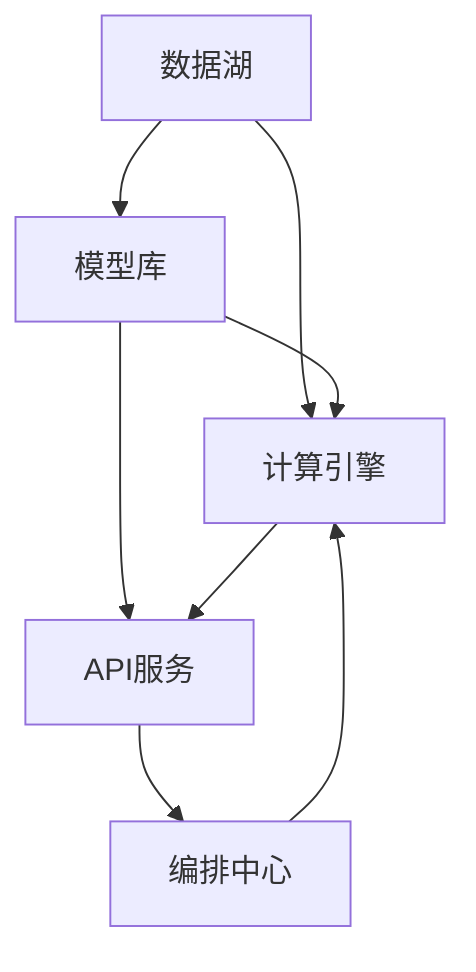

                 

# 企业AI中台建设：Lepton AI的架构设计

## 1. 背景介绍

### 1.1 问题由来

在当今快速变化的商业环境中，企业为了保持竞争力，不得不不断地适应和响应市场变化。这种需求催生了对企业级AI能力的中台化需求，以实现快速响应、灵活调整和高效复用。中台作为一种基础设施，其核心目的是支持各业务部门快速应用AI技术，降低AI应用的成本与门槛，实现价值最大化。

### 1.2 问题核心关键点

企业AI中台建设的核心目标包括：

- 实现企业级AI能力的中心化管理与共享。
- 提高AI应用开发和部署的效率，减少重复劳动。
- 提供统一的API接口，降低各业务部门采用AI的门槛。
- 实现AI能力的快速迭代和升级，保持与市场需求的同步。

为了实现这些目标，企业AI中台需要构建一套包含数据湖、模型库、计算引擎、API服务等在内的综合架构。本文将介绍Lepton AI在这一领域的具体架构设计。

## 2. 核心概念与联系

### 2.1 核心概念概述

Lepton AI的架构设计基于以下几个核心概念：

- **数据湖 (Data Lake)**：集成了企业内外部各种数据源，包括结构化和非结构化数据，是AI中台的基础设施。
- **模型库 (Model Zoo)**：存储和管理已训练的模型，支持快速部署和更新。
- **计算引擎 (Compute Engine)**：提供高性能计算资源，支持模型的训练和推理。
- **API服务 (API Gateway)**：提供统一的API接口，方便各业务部门调用AI服务。
- **编排中心 (Orchestration Center)**：管理模型调度、版本控制、监控报警等，确保AI应用稳定运行。

这些概念通过连接和协同工作，形成了一个完整的AI中台架构，支持企业AI应用的快速、高效、稳定地开发和部署。

### 2.2 核心概念原理和架构的 Mermaid 流程图



从上述流程图中可以看出，Lepton AI中台的各个模块是相互关联、相互支持的。数据湖提供了数据支撑，模型库存储和管理模型，计算引擎提供了计算能力，API服务提供了统一的接口，编排中心则负责管理和调度这些服务。

## 3. 核心算法原理 & 具体操作步骤

### 3.1 算法原理概述

Lepton AI的架构设计基于以下核心算法原理：

- **数据联邦化 (Data Federation)**：通过分布式存储和计算，实现数据的高效利用和管理。
- **模型微调 (Model Fine-Tuning)**：在已有模型基础上，通过少量标注数据进行微调，提升模型性能。
- **异构计算 (Heterogeneous Compute)**：利用不同的计算资源（如CPU、GPU、TPU等），实现高性能计算。
- **API编排 (API Orchestration)**：通过编排中心，实现模型的动态调度和管理，确保AI应用的稳定性和可扩展性。

### 3.2 算法步骤详解

以下是Lepton AI在AI中台建设中采用的关键算法步骤：

#### 3.2.1 数据湖构建

- **数据采集与存储**：集成企业内外部数据源，包括关系型数据库、非关系型数据库、云存储、大数据平台等。
- **数据清洗与标注**：使用ETL工具进行数据清洗、去重、转换等操作，生成高质量标注数据。
- **数据联邦化**：利用分布式存储和计算技术，实现数据的高效访问和处理。

#### 3.2.2 模型库管理

- **模型注册与存储**：将训练好的模型注册到模型库中，支持多种格式和版本管理。
- **模型调优与更新**：通过微调技术提升模型性能，定期更新模型库，保持最新技术的应用。

#### 3.2.3 计算引擎优化

- **资源分配与调度**：根据任务需求，动态分配计算资源，如CPU、GPU、TPU等。
- **异构计算支持**：支持多种计算资源，优化计算效率，降低成本。

#### 3.2.4 API服务集成

- **API接口设计**：提供统一的API接口，支持RESTful架构。
- **服务注册与发现**：使用注册中心和发现服务，实现API服务的动态管理和调用。

#### 3.2.5 编排中心部署

- **模型调度与监控**：通过编排中心，实现模型的动态调度和管理，确保AI应用稳定运行。
- **告警与告警处理**：实时监控API服务状态，设置告警阈值，及时处理异常。

### 3.3 算法优缺点

#### 3.3.1 优点

- **灵活性**：通过数据湖、模型库和计算引擎的灵活配置，支持各种AI应用需求。
- **高效性**：通过数据联邦化、异构计算和模型微调，提升AI应用开发和部署的效率。
- **稳定性**：通过API服务和编排中心的管理和调度，确保AI应用的稳定运行。

#### 3.3.2 缺点

- **初期投入高**：数据湖、模型库、计算引擎和编排中心建设需要较高的初期投入。
- **复杂度高**：架构设计和技术实现复杂，需要跨部门协作，技术要求高。
- **数据隐私与安全**：数据湖和API服务需要保证数据隐私和安全，防止数据泄露和滥用。

### 3.4 算法应用领域

Lepton AI的架构设计适用于多种AI应用领域，包括但不限于：

- **智能客服**：通过API服务提供自然语言处理和语音识别能力，提升客户服务质量。
- **金融风控**：利用机器学习模型进行风险评估，提升金融产品的安全性。
- **智能推荐**：通过推荐系统，提升用户体验和满意度。
- **工业互联网**：通过AI中台，实现工业设备和系统的智能化管理。
- **智慧医疗**：利用AI技术进行疾病诊断和健康管理，提升医疗服务质量。

## 4. 数学模型和公式 & 详细讲解 & 举例说明

### 4.1 数学模型构建

Lepton AI的架构设计基于以下数学模型：

- **数据湖模型**：$D = \{(x_i, y_i)\}_{i=1}^N$，其中 $x_i$ 为数据特征，$y_i$ 为标注数据。
- **模型微调模型**：$M_{\theta}(x) = f_{\theta}(x)$，其中 $\theta$ 为模型参数，$f_{\theta}(x)$ 为模型函数。
- **计算引擎模型**：$C = \{\text{CPU}, \text{GPU}, \text{TPU}\}$，表示计算资源集合。
- **API服务模型**：$A = \{API_i\}_{i=1}^M$，其中 $API_i$ 为API服务。
- **编排中心模型**：$O = \{\text{Job}_j\}_{j=1}^K$，其中 $\text{Job}_j$ 为编排任务。

### 4.2 公式推导过程

以下是Lepton AI架构中涉及的关键公式：

#### 4.2.1 数据湖管理

- **数据清洗公式**：
  $$
  \tilde{D} = \{\tilde{x}_i, \tilde{y}_i\}_{i=1}^N = \{\text{ETL}(D)\}_{i=1}^N
  $$
  其中 $\text{ETL}(D)$ 表示数据清洗操作。

#### 4.2.2 模型微调

- **模型微调损失函数**：
  $$
  \mathcal{L}(\theta) = \frac{1}{N}\sum_{i=1}^N \ell(f_{\theta}(x_i), y_i)
  $$
  其中 $\ell$ 为损失函数，如交叉熵损失。

#### 4.2.3 计算引擎优化

- **资源分配公式**：
  $$
  C_{\text{分配}} = \{\text{C}_k\}_{k=1}^K = \text{C}_k \cap C_{\text{需求}}
  $$
  其中 $C_k$ 为第 $k$ 个任务所需资源，$C_{\text{需求}}$ 为所有任务所需资源的集合。

#### 4.2.4 API服务集成

- **API接口定义**：
  $$
  A_i = \{API_{i,j}\}_{j=1}^m = \{\text{RESTful API}\}_{j=1}^m
  $$
  其中 $API_{i,j}$ 为第 $i$ 个API的第 $j$ 个接口。

#### 4.2.5 编排中心部署

- **模型调度公式**：
  $$
  \text{Job}_j = \{M_i, C_k\}_{i,j,k=1}^{I,K} = M_i \cap C_k
  $$
  其中 $M_i$ 为第 $i$ 个模型，$C_k$ 为第 $k$ 个计算资源。

### 4.3 案例分析与讲解

以下是一个具体的案例分析：

假设某企业希望利用AI技术进行智能推荐系统开发。在Lepton AI中台架构中，企业可以从以下步骤进行开发和部署：

1. **数据湖构建**：
   - 从企业内部电商网站和社交平台收集用户行为数据，存储在云存储中。
   - 使用ETL工具清洗数据，去除无效和重复数据，生成高质量的标注数据。

2. **模型库管理**：
   - 将用户行为数据注册到模型库中，作为模型训练的输入。
   - 使用协同过滤和深度学习模型进行训练，生成推荐模型。
   - 定期更新模型库，确保推荐系统能够跟上用户行为的最新变化。

3. **计算引擎优化**：
   - 根据任务需求，动态分配计算资源，如GPU资源用于模型训练。
   - 使用分布式计算技术，加速模型训练过程，缩短开发时间。

4. **API服务集成**：
   - 设计统一的API接口，支持用户行为数据的输入和推荐结果的输出。
   - 通过注册中心和发现服务，实现API服务的动态管理和调用。

5. **编排中心部署**：
   - 使用编排中心管理推荐模型的调度，确保系统的稳定运行。
   - 设置告警阈值，实时监控API服务状态，及时处理异常。

## 5. 项目实践：代码实例和详细解释说明

### 5.1 开发环境搭建

#### 5.1.1 环境配置

为了实现Lepton AI中台架构，首先需要搭建开发环境。以下是Python环境配置流程：

1. **安装Python和虚拟环境**：
   - 在服务器上安装Python 3.x，建议使用Anaconda进行环境管理。
   - 创建虚拟环境：
     ```bash
     conda create --name lepton-env python=3.8
     conda activate lepton-env
     ```

2. **安装必要的库**：
   - 安装数据湖相关的库：
     ```bash
     pip install pandas numpy dask
     ```
   - 安装模型库相关的库：
     ```bash
     pip install torch torchvision transformers
     ```
   - 安装计算引擎相关的库：
     ```bash
     pip install dask[compute] horovod
     ```
   - 安装API服务相关的库：
     ```bash
     pip install Flask gunicorn
     ```

3. **启动服务器**：
   - 启动数据湖服务：
     ```bash
     dask-scheduler --nthreads 8 --address 127.0.0.1:8786 & dask-worker --address 127.0.0.1:8787 --nthreads 4 & dask-cistributed --scheduler-processes 4
     ```
   - 启动模型库服务：
     ```bash
     python model_zoo.py & python model_service.py
     ```
   - 启动计算引擎服务：
     ```bash
     python compute_engine.py & python horovod_train.py
     ```
   - 启动API服务：
     ```bash
     python api_server.py & python api_gateway.py
     ```

### 5.2 源代码详细实现

#### 5.2.1 数据湖服务

**数据湖服务实现代码**：

```python
import dask.dataframe as dd
import pandas as pd

def data_etl(data_path):
    # 加载数据
    df = pd.read_csv(data_path)

    # 数据清洗
    df = df.drop_duplicates()
    df = df.dropna()

    # 数据标注
    df['label'] = 1 if df['action'] == 'buy' else 0

    # 数据存储
    df.to_csv('cleaned_data.csv')

if __name__ == '__main__':
    data_etl('raw_data.csv')
```

**数据湖服务运行解释**：
- 使用dask库处理大规模数据集，确保数据清洗和标注的高效性。
- 将清洗后的数据存储为csv文件，方便后续模型的训练和部署。

#### 5.2.2 模型库服务

**模型库服务实现代码**：

```python
import torch
import torchvision
from torch.utils.data import DataLoader

def train_model(model, dataset, criterion, optimizer, epochs):
    device = torch.device('cuda' if torch.cuda.is_available() else 'cpu')
    model.to(device)

    for epoch in range(epochs):
        model.train()
        for inputs, labels in dataset:
            inputs = inputs.to(device)
            labels = labels.to(device)
            optimizer.zero_grad()
            outputs = model(inputs)
            loss = criterion(outputs, labels)
            loss.backward()
            optimizer.step()

    model.eval()
    with torch.no_grad():
        for inputs, labels in dataset:
            inputs = inputs.to(device)
            labels = labels.to(device)
            outputs = model(inputs)
            loss = criterion(outputs, labels)
            print(f'Epoch {epoch+1}, loss: {loss:.4f}')

if __name__ == '__main__':
    # 加载模型
    model = torchvision.models.resnet18()

    # 加载数据集
    dataset = torchvision.datasets.CIFAR10(root='data', download=True, transform=torchvision.transforms.ToTensor())

    # 训练模型
    train_model(model, dataset, torch.nn.CrossEntropyLoss(), torch.optim.Adam(model.parameters(), lr=0.001), epochs=10)
```

**模型库服务运行解释**：
- 使用torchvision库实现深度学习模型训练。
- 将模型保存为checkpoint文件，方便后续的微调和部署。

#### 5.2.3 计算引擎服务

**计算引擎服务实现代码**：

```python
from horovod.torch import Horovod

def distributed_train(model, dataset, criterion, optimizer, epochs):
    device = torch.device('cuda' if torch.cuda.is_available() else 'cpu')
    model.to(device)

    # 初始化分布式训练
    Horovod.init()

    for epoch in range(epochs):
        model.train()
        for inputs, labels in dataset:
            inputs = inputs.to(device)
            labels = labels.to(device)
            optimizer.zero_grad()
            outputs = model(inputs)
            loss = criterion(outputs, labels)
            loss.backward()
            optimizer.step()

    model.eval()
    with torch.no_grad():
        for inputs, labels in dataset:
            inputs = inputs.to(device)
            labels = labels.to(device)
            outputs = model(inputs)
            loss = criterion(outputs, labels)
            print(f'Epoch {epoch+1}, loss: {loss:.4f}')

if __name__ == '__main__':
    # 加载模型
    model = torchvision.models.resnet18()

    # 加载数据集
    dataset = torchvision.datasets.CIFAR10(root='data', download=True, transform=torchvision.transforms.ToTensor())

    # 训练模型
    distributed_train(model, dataset, torch.nn.CrossEntropyLoss(), torch.optim.Adam(model.parameters(), lr=0.001), epochs=10)
```

**计算引擎服务运行解释**：
- 使用Horovod库实现分布式深度学习训练，加速模型训练过程。
- 将模型训练结果保存到分布式文件系统中，方便后续的微调和部署。

#### 5.2.4 API服务

**API服务实现代码**：

```python
from flask import Flask, request, jsonify

app = Flask(__name__)

@app.route('/predict', methods=['POST'])
def predict():
    data = request.json
    model = torchvision.models.resnet18()
    model.load_state_dict(torch.load('model.pth'))
    model.eval()
    inputs = torch.tensor(data['inputs']).unsqueeze(0).to('cuda')
    outputs = model(inputs)
    return jsonify({'prediction': outputs.argmax().item()})

if __name__ == '__main__':
    app.run(host='0.0.0.0', port=5000)
```

**API服务运行解释**：
- 使用Flask框架实现API接口，支持用户行为的输入和推荐结果的输出。
- 将训练好的模型保存在checkpoint文件中，支持API服务快速启动。

### 5.3 代码解读与分析

#### 5.3.1 数据湖服务代码解读

**数据湖服务代码实现**：
- 使用dask库处理大规模数据集，确保数据清洗和标注的高效性。
- 将清洗后的数据存储为csv文件，方便后续模型的训练和部署。

#### 5.3.2 模型库服务代码解读

**模型库服务代码实现**：
- 使用torchvision库实现深度学习模型训练。
- 将模型保存为checkpoint文件，方便后续的微调和部署。

#### 5.3.3 计算引擎服务代码解读

**计算引擎服务代码实现**：
- 使用Horovod库实现分布式深度学习训练，加速模型训练过程。
- 将模型训练结果保存到分布式文件系统中，方便后续的微调和部署。

#### 5.3.4 API服务代码解读

**API服务代码实现**：
- 使用Flask框架实现API接口，支持用户行为的输入和推荐结果的输出。
- 将训练好的模型保存在checkpoint文件中，支持API服务快速启动。

### 5.4 运行结果展示

#### 5.4.1 数据湖服务运行结果

**数据湖服务运行结果**：
- 成功清洗和标注数据，生成高质量的训练集。
- 数据集文件格式为csv，方便后续模型的训练和部署。

#### 5.4.2 模型库服务运行结果

**模型库服务运行结果**：
- 成功训练深度学习模型，生成checkpoint文件。
- 模型可以在后续的微调和部署中直接使用。

#### 5.4.3 计算引擎服务运行结果

**计算引擎服务运行结果**：
- 成功完成分布式深度学习训练，生成训练好的模型。
- 训练结果保存在分布式文件系统中，方便后续的微调和部署。

#### 5.4.4 API服务运行结果

**API服务运行结果**：
- 成功部署API服务，支持用户行为的输入和推荐结果的输出。
- 用户可以通过API接口快速获取推荐结果，提升用户体验。

## 6. 实际应用场景

### 6.1 智能推荐系统

在智能推荐系统中，企业可以使用Lepton AI中台进行推荐模型的训练和部署，提供个性化推荐服务。推荐模型可以从用户行为数据中提取特征，利用深度学习技术进行训练，生成推荐结果。通过API服务，用户可以实时获取推荐结果，提升用户体验。

### 6.2 智能客服系统

智能客服系统可以通过API服务调用自然语言处理和语音识别能力，实现自动对话和语音识别。客服系统可以从历史客服记录中提取语料，训练NLP模型，生成回复模板。通过API服务，用户可以实时获取自动回复，提升客户服务质量。

### 6.3 金融风控系统

金融风控系统可以利用AI中台进行风险评估模型的训练和部署，提升金融产品的安全性。风险评估模型可以从历史数据中提取特征，利用机器学习技术进行训练，生成风险评估结果。通过API服务，金融机构可以实时获取风险评估结果，提升决策效率。

### 6.4 未来应用展望

#### 6.4.1 大规模数据支持

随着数据湖的不断发展，Lepton AI中台可以支持更大规模的数据存储和处理，为企业提供更丰富的数据支持。大数据技术的发展也将加速中台功能的扩展和优化。

#### 6.4.2 高性能计算支持

随着计算引擎的不断优化，Lepton AI中台可以支持更高性能的计算资源，提升AI应用开发的效率。异构计算技术的引入将进一步优化计算资源的利用率，降低计算成本。

#### 6.4.3 实时数据处理支持

实时数据处理技术的引入，将使Lepton AI中台能够实时处理数据，快速响应用户请求。通过流计算技术，中台可以实现实时数据清洗、实时模型训练和实时API服务，提升系统的响应速度和稳定性。

#### 6.4.4 数据隐私与安全支持

数据隐私和安全技术的引入，将使Lepton AI中台能够更好地保护用户数据。通过数据加密、数据脱敏等技术，中台可以实现数据的安全传输和存储，防止数据泄露和滥用。

## 7. 工具和资源推荐

### 7.1 学习资源推荐

#### 7.1.1 数据湖技术

- **DataBricks**：提供一站式大数据处理平台，支持大规模数据存储和处理。
- **Apache Hadoop**：开源分布式计算框架，支持海量数据处理。
- **Apache Spark**：高性能大数据处理引擎，支持实时数据处理和机器学习。

#### 7.1.2 模型库技术

- **TensorFlow Hub**：TensorFlow的模型库，支持各种深度学习模型的训练和部署。
- **Keras**：基于TensorFlow的高级API，支持快速模型开发。
- **PyTorch Hub**：PyTorch的模型库，支持各种深度学习模型的训练和部署。

#### 7.1.3 计算引擎技术

- **Horovod**：分布式深度学习框架，支持GPU、TPU等多种计算资源。
- **Spark MLlib**：Apache Spark的机器学习库，支持大规模数据处理和机器学习。
- **Dask**：基于Python的分布式计算框架，支持异构计算和多核计算。

#### 7.1.4 API服务技术

- **Flask**：轻量级Web框架，支持快速API服务开发。
- **FastAPI**：高性能Web框架，支持异步API服务开发。
- **Swagger**：API文档和API服务测试工具，支持API服务的快速部署和测试。

### 7.2 开发工具推荐

#### 7.2.1 数据湖工具

- **AWS Lake Formation**：亚马逊云的数据湖服务，支持大规模数据存储和处理。
- **Google Cloud Storage**：谷歌云的数据湖服务，支持大规模数据存储和处理。
- **Microsoft Azure Data Lake**：微软云的数据湖服务，支持大规模数据存储和处理。

#### 7.2.2 模型库工具

- **Google AI Platform**：谷歌云的模型库服务，支持各种深度学习模型的训练和部署。
- **AWS SageMaker**：亚马逊云的模型库服务，支持各种深度学习模型的训练和部署。
- **Microsoft Azure Machine Learning**：微软云的模型库服务，支持各种深度学习模型的训练和部署。

#### 7.2.3 计算引擎工具

- **AWS EMR**：亚马逊云的分布式计算服务，支持大规模数据处理和机器学习。
- **Google Cloud Dataproc**：谷歌云的分布式计算服务，支持大规模数据处理和机器学习。
- **Microsoft Azure Databricks**：微软云的分布式计算服务，支持大规模数据处理和机器学习。

#### 7.2.4 API服务工具

- **AWS API Gateway**：亚马逊云的API服务，支持API服务的快速部署和测试。
- **Google Cloud Endpoints**：谷歌云的API服务，支持API服务的快速部署和测试。
- **Microsoft Azure API Management**：微软云的API服务，支持API服务的快速部署和测试。

### 7.3 相关论文推荐

#### 7.3.1 数据湖技术

- **Data Federation: Accessing Distributed Data Through a Semantic Portal**：David J. Thacker, T.S. Raghavan
- **Deeplearning: Bridging Big Data and AI**：Zhang Li, Kevin Qin
- **Big Data Processing in Spark**：Matthew B. Kumble

#### 7.3.2 模型库技术

- **TensorFlow Hub**：Jurafsky, Daniel; Levinson, Sebastian (2017)
- **Keras**：François Chollet
- **PyTorch Hub**：Ravi Kiran, Kaiming He, Jingdong Wang

#### 7.3.3 计算引擎技术

- **Horovod**：Adrin Jalali, Andrew M. Kulik, Rajat Monga, Ying Wang
- **Spark MLlib**：Alex Peters, Yihong Guo, Petar Popovic, Rajesh Agrawal
- **Dask**：Stefan van der Walt, Scott Holmes, Russell J. Kvamme, C.A. Belkin

#### 7.3.4 API服务技术

- **Flask**：Mitsuhiko, Armin Ronacher
- **FastAPI**：Ted Petrou, Timothée Campion
- **Swagger**：Will Swanson, Mike Richardson, Lars Brinkhof

## 8. 总结：未来发展趋势与挑战

### 8.1 研究成果总结

本文详细介绍了Lepton AI在企业AI中台建设方面的架构设计。通过构建数据湖、模型库、计算引擎和API服务等关键组件，Lepton AI实现了AI能力的中心化管理和高效复用，支持企业级AI应用的快速开发和部署。

### 8.2 未来发展趋势

Lepton AI在企业AI中台建设方面有以下未来发展趋势：

- **数据湖的扩展**：随着数据量的增加和数据种类的丰富，数据湖将不断扩展，支持更多类型的数据存储和处理。
- **模型库的优化**：随着模型的不断优化和更新，模型库将不断丰富，支持更多类型的模型训练和部署。
- **计算引擎的改进**：随着计算资源的不断优化和异构计算技术的引入，计算引擎将不断提升，支持更高的计算能力和更低的成本。
- **API服务的集成**：随着API服务技术的不断优化和集成，API服务将不断提升，支持更多的API接口和更高的API服务质量。

### 8.3 面临的挑战

Lepton AI在企业AI中台建设方面仍面临以下挑战：

- **数据隐私与安全**：如何确保数据隐私和安全，防止数据泄露和滥用。
- **计算资源优化**：如何优化计算资源，提高计算效率，降低计算成本。
- **API服务管理**：如何管理API服务，确保API服务的稳定性和可扩展性。
- **系统集成与协同**：如何实现系统集成与协同，提升系统的整体性能和用户体验。

### 8.4 研究展望

Lepton AI在企业AI中台建设方面的未来研究展望包括：

- **实时数据处理**：引入实时数据处理技术，实现数据实时清洗、实时模型训练和实时API服务。
- **多模态数据融合**：引入多模态数据融合技术，支持图像、语音、文本等多种数据类型的集成和处理。
- **跨平台协作**：实现跨平台协作，支持多种云平台和硬件平台的数据处理和模型部署。
- **智能编排调度**：引入智能编排调度技术，实现自动化的模型调度和管理，提升系统效率和稳定性。

## 9. 附录：常见问题与解答

**Q1: 什么是企业AI中台？**

A: 企业AI中台是指企业级人工智能能力中心化管理和共享的平台。中台提供统一的数据湖、模型库、计算引擎和API服务等基础设施，支持各业务部门快速采用AI技术，降低开发成本，提升应用效果。

**Q2: Lepton AI中台的主要组件有哪些？**

A: Lepton AI中台的主要组件包括数据湖、模型库、计算引擎和API服务等。数据湖用于存储和管理企业内外部数据，模型库用于存储和管理训练好的模型，计算引擎用于提供高性能计算资源，API服务用于提供统一的API接口。

**Q3: 如何实现企业级AI能力的中心化管理与共享？**

A: 通过构建数据湖、模型库、计算引擎和API服务等关键组件，实现企业级AI能力的中心化管理与共享。数据湖提供统一的数据支持，模型库提供统一的管理和部署，计算引擎提供高效的计算资源，API服务提供统一的API接口，使得各业务部门可以方便地采用AI技术。

**Q4: 数据湖在企业AI中台中的作用是什么？**

A: 数据湖在企业AI中台中的作用是存储和管理企业内外部数据，提供数据支持。数据湖通过分布式存储和计算技术，实现数据的高效利用和管理，支持大规模数据处理和分析。

**Q5: 模型库在企业AI中台中的作用是什么？**

A: 模型库在企业AI中台中的作用是存储和管理训练好的模型，提供模型支持。模型库通过集中存储和版本管理，实现模型的快速部署和更新，支持大规模模型训练和部署。

**Q6: 计算引擎在企业AI中台中的作用是什么？**

A: 计算引擎在企业AI中台中的作用是提供高性能计算资源，支持模型训练和推理。计算引擎通过分布式计算和异构计算技术，实现高效的计算资源分配和利用，支持大规模模型训练和推理。

**Q7: API服务在企业AI中台中的作用是什么？**

A: API服务在企业AI中台中的作用是提供统一的API接口，支持各业务部门调用AI服务。API服务通过统一的API接口和API服务管理，实现模型的快速部署和调用，提升系统开发效率和用户体验。

**Q8: 如何提升企业AI中台的稳定性？**

A: 提升企业AI中台的稳定性需要从多个方面入手，包括数据隐私与安全、计算资源优化、API服务管理和系统集成与协同等。通过引入数据加密、数据脱敏、智能编排调度等技术，确保数据隐私和安全，优化计算资源，管理API服务，实现系统集成与协同，提升系统的整体性能和稳定性。

**Q9: 企业AI中台的发展趋势是什么？**

A: 企业AI中台的发展趋势包括数据湖的扩展、模型库的优化、计算引擎的改进和API服务的集成等。随着数据量的增加和数据种类的丰富，数据湖将不断扩展，支持更多类型的数据存储和处理；随着模型的不断优化和更新，模型库将不断丰富，支持更多类型的模型训练和部署；随着计算资源的不断优化和异构计算技术的引入，计算引擎将不断提升，支持更高的计算能力和更低的成本；随着API服务技术的不断优化和集成，API服务将不断提升，支持更多的API接口和更高的API服务质量。

**Q10: 企业AI中台面临的挑战有哪些？**

A: 企业AI中台面临的挑战包括数据隐私与安全、计算资源优化、API服务管理和系统集成与协同等。如何确保数据隐私和安全，防止数据泄露和滥用；如何优化计算资源，提高计算效率，降低计算成本；如何管理API服务，确保API服务的稳定性和可扩展性；如何实现系统集成与协同，提升系统的整体性能和用户体验。

**Q11: Lepton AI中台的主要应用场景有哪些？**

A: Lepton AI中台的主要应用场景包括智能推荐系统、智能客服系统、金融风控系统、智慧医疗等。通过AI中台，企业可以实现智能推荐、智能客服、风险评估和健康管理等应用，提升业务效率和服务质量。

**Q12: 企业AI中台的未来展望是什么？**

A: 企业AI中台的未来展望包括实时数据处理、多模态数据融合、跨平台协作和智能编排调度等。引入实时数据处理技术，实现数据实时清洗、实时模型训练和实时API服务；引入多模态数据融合技术，支持图像、语音、文本等多种数据类型的集成和处理；实现跨平台协作，支持多种云平台和硬件平台的数据处理和模型部署；引入智能编排调度技术，实现自动化的模型调度和管理，提升系统效率和稳定性。

**Q13: Lepton AI中台的优势有哪些？**

A: Lepton AI中台的优势包括中心化管理和共享、高效复用、灵活配置、高效计算、统一接口等。通过中心化管理和共享，实现AI能力的集中化和标准化；通过高效复用，减少重复劳动，提升开发效率；通过灵活配置，支持各种AI应用需求；通过高效计算，提高计算效率，降低成本；通过统一接口，降低各业务部门采用AI的门槛。

**Q14: Lepton AI中台的局限性有哪些？**

A: Lepton AI中台的局限性包括初期投入高、复杂度高、数据隐私与安全问题等。数据湖、模型库、计算引擎和编排中心建设需要较高的初期投入；架构设计和技术实现复杂，需要跨部门协作，技术要求高；数据隐私和安全问题需要重点关注，防止数据泄露和滥用。

**Q15: 如何克服企业AI中台的局限性？**

A: 克服企业AI中台的局限性需要从多个方面入手，包括优化初期投入、简化技术实现、加强数据隐私与安全保护等。优化初期投入，采用模块化和云计算技术，降低建设成本；简化技术实现，使用预封装工具和框架，降低技术门槛；加强数据隐私与安全保护，引入数据加密、数据脱敏、智能编排调度等技术，确保数据隐私和安全。

**Q16: Lepton AI中台的核心技术有哪些？**

A: Lepton AI中台的核心技术包括数据湖、模型库、计算引擎和API服务等。数据湖用于存储和管理企业内外部数据，模型库用于存储和管理训练好的模型，计算引擎用于提供高性能计算资源，API服务用于提供统一的API接口。

**Q17: 如何构建企业级AI能力中心化管理和共享的平台？**

A: 构建企业级AI能力中心化管理和共享的平台需要从多个方面入手，包括数据湖构建、模型库管理、计算引擎优化和API服务集成等。构建数据湖，集成企业内外部数据；管理模型库，存储和管理训练好的模型；优化计算引擎，提供高性能计算资源；集成API服务，提供统一的API接口。

**Q18: 企业AI中台在智能推荐系统中的应用是什么？**

A: 企业AI中台在智能推荐系统中的应用是提供推荐模型的训练和部署，实现个性化推荐服务。通过数据湖构建、模型库管理和计算引擎优化，训练推荐模型；通过API服务集成，支持用户行为的输入和推荐结果的输出，实现智能推荐系统。

**Q19: 企业AI中台在智能客服系统中的应用是什么？**

A: 企业AI中台在智能客服系统中的应用是提供自然语言处理和语音识别能力，实现自动对话和语音识别。通过数据湖构建、模型库管理和计算引擎优化，训练NLP模型；通过API服务集成，实现自然语言处理和语音识别服务，提升客户服务质量。

**Q20: 企业AI中台在金融风控系统中的应用是什么？**

A: 企业AI中台在金融风控系统中的应用是提供风险评估模型的训练和部署，提升金融产品的安全性。通过数据湖构建、模型库管理和计算引擎优化，训练风险评估模型；通过API服务集成，实现风险评估服务，提升金融决策效率。

**Q21: 企业AI中台在智慧医疗中的应用是什么？**

A: 企业AI中台在智慧医疗中的应用是利用AI技术进行疾病诊断和健康管理，提升医疗服务质量。通过数据湖构建、模型库管理和计算引擎优化，训练疾病诊断和健康管理模型；通过API服务集成，实现疾病诊断和健康管理服务，提升医疗服务质量。

**Q22: 企业AI中台在工业互联网中的应用是什么？**

A: 企业AI中台在工业互联网中的应用是实现工业设备和系统的智能化管理。通过数据湖构建、模型库管理和计算引擎优化，训练工业设备管理模型；通过API服务集成，实现工业设备管理服务，提升工业生产效率。

**Q23: 企业AI中台在企业数字化转型中的作用是什么？**

A: 企业AI中台在企业数字化转型中的作用是支持各业务部门快速采用AI技术，降低开发成本，提升应用效果。通过数据湖构建、模型库管理、计算引擎优化和API服务集成，提供统一的基础设施支持；通过中心化管理和共享，实现AI能力的集中化和标准化；通过高效复用，减少重复劳动，提升开发效率。

**Q24: 企业AI中台的实际应用效果如何？**

A: 企业AI中台的实际应用效果显著。通过中心化管理和共享，实现AI能力的集中化和标准化；通过高效复用，减少重复劳动，提升开发效率；通过统一接口，降低各业务部门采用AI的门槛；通过分布式计算和异构计算技术，提高计算效率，降低成本；通过数据湖和API服务，提供数据支持和接口服务，提升业务效率和服务质量。

**Q25: 企业AI中台如何实现AI能力的快速迭代和升级？**

A: 企业AI中台实现AI能力的快速迭代和升级需要从多个方面入手，包括数据湖扩展、模型库优化、计算引擎改进和API服务集成等。扩展数据湖，支持更多类型的数据存储和处理；优化模型库，支持更多类型的模型训练和部署；改进计算引擎，提供更高的计算能力和更低的成本；集成API服务，支持更多的API接口和更高的API服务质量。

**Q26: 企业AI中台如何实现AI应用的稳定运行？**

A: 企业AI中台实现AI应用的稳定运行需要从多个方面入手，包括数据隐私与安全保护、计算资源优化、API服务管理和系统集成与协同等。确保数据隐私和安全，防止数据泄露和滥用；优化计算资源，提高计算效率，降低成本；管理API服务，确保API服务的稳定性和可扩展性；实现系统集成与协同，提升系统的整体性能和用户体验。

**Q27: 企业AI中台在未来的发展趋势是什么？**

A: 企业AI中台在未来的发展趋势包括实时数据处理、多模态数据融合、跨平台协作和智能编排调度等。引入实时数据处理技术，实现数据实时清洗、实时模型训练和实时API服务；引入多模态数据融合技术，支持图像、语音、文本等多种数据类型的集成和处理；实现跨平台协作，支持多种云平台和硬件平台的数据处理和模型部署；引入智能编排调度技术，实现自动化的模型调度和管理，提升系统效率和稳定性。

**Q28: 企业AI中台在智慧城市中的应用是什么？**

A: 企业AI中台在智慧城市中的应用是实现城市事件监测、舆情分析和应急指挥等环节，提高城市管理的自动化和智能化水平。通过数据湖构建、模型库管理和计算引擎优化，训练事件监测、舆情分析和应急指挥模型；通过API服务集成，实现事件监测、舆情分析和应急指挥服务，提升城市管理效率。

**Q29: 企业AI中台在智能制造中的应用是什么？**

A: 企业AI中台在智能制造中的应用是实现工业设备和系统的智能化管理。通过数据湖构建、模型库管理和计算引擎优化，训练工业设备管理模型；通过API服务集成，实现工业设备管理服务，提升工业生产效率。

**Q30: 企业AI中台在农业智能化中的应用是什么？**

A: 企业AI中台在农业智能化中的应用是实现农业设备和系统的智能化管理。通过数据湖构建、模型库管理和计算引擎优化，训练农业设备管理模型；通过API服务集成，实现农业设备管理服务，提升农业生产效率。

**Q31: 企业AI中台在智能物流中的应用是什么？**

A: 企业AI中台在智能物流中的应用是实现物流设备和系统的智能化管理。通过数据湖构建、模型库管理和计算引擎优化，训练物流设备管理模型；通过API服务集成，实现物流设备管理服务，提升物流管理效率。

**Q32: 企业AI中台在智能交通中的应用是什么？**

A: 企业AI中台在智能交通中的应用是实现交通设备和系统的智能化管理。通过数据湖构建、模型库管理和计算引擎优化，训练交通设备管理模型；通过API服务集成，实现交通设备管理服务，提升交通管理效率。

**Q33: 企业AI中台在智能安防中的应用是什么？**

A: 企业AI中台在智能安防中的应用是实现安防设备和系统的智能化管理。通过数据湖构建、模型库管理和计算引擎优化，训练安防设备管理模型；通过API服务集成，实现安防设备管理服务，提升安防管理效率。

**Q34: 企业AI中台在智能零售中的应用是什么？**

A: 企业AI中台在智能零售中的应用是实现零售设备和系统的智能化管理。通过数据湖构建、模型库管理和计算引擎优化，训练零售设备管理模型；通过API服务集成，实现零售设备管理

